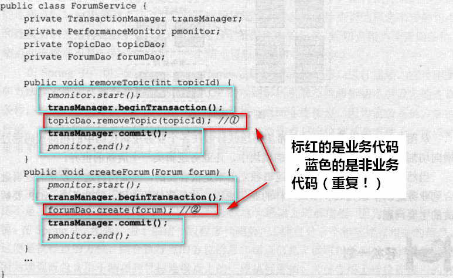

# Spring AOP



面向对象的时候，如果代码重复了怎么办？可以分成下面几个步骤：

- 1：抽取成方法
- 2：抽取类

抽取成类的方式我们称之为：**纵向抽取**

- 通过继承的方式实现纵向抽取

但是，我们现在的办法不行：即使抽取成类还是会出现重复的代码，因为这些逻辑(开始、结束、提交事务)**依附在我们业务类的方法逻辑中**！


AOP的理念：就是将**分散在各个业务逻辑代码中相同的代码通过横向切割的方式**抽取到一个独立的模块中！


## AOP的实现者

Spring AOP

AspectJ

JBoss AOP


## AOP的术语

**切面**(Aspect): 切面由切点和增强/通知组成，它既包括了横切逻辑的定义、也包括了连接点的定义。业务逻辑中可以进行横向切入的面。如权限管理、日志管理

**连接点**(Join point): **能够被拦截的地方**：Spring AOP是基于动态代理的，所以是方法拦截的。每个成员方法都可以称之为连接点。

**切点**(Poincut)：**具体定位的连接点**：上面也说了，每个方法都可以称之为连接点，我们**具体定位到某一个方法就成为切点**。

**增强/通知**(Advice)：在切面的某个切点上执行的动作

> 前置通知（Before）:在目标方法或者说连接点被调用前执行的通知；
>
> 后置通知（After）：指在某个连接点完成后执行的通知；
>
> 返回通知（After-returning）：指在某个连接点成功执行之后执行的通知；
>
> 异常通知（After-throwing）：指在方法抛出异常后执行的通知；
>
> 环绕通知（Around）：指包围一个连接点通知，在被通知的方法调用之前和之后执行自定义的方法。

**织入**(Weaving)： 将`增强/通知`添加到目标类的具体连接点上的过程。

**引入/引介**(Introduction)：`引入/引介`允许我们**向现有的类添加新方法或属性**。是一种**特殊**的增强！

Target: 目标对象是被一个或者多个切面所通知的对象


在《Spring 实战 (第4版)》给出的总结：

> 通知/增强包含了需要用于多个应用对象的横切行为；
>
> 连接点是程序执行过程中能够应用通知的所有点；
>
> 切点定义了通知/增强被应用的具体位置。其中关键的是切点定义了哪些连接点会得到通知/增强。


## Spring对AOP的支持

Spring提供了3种类型的AOP支持：

- 基于代理的经典SpringAOP
  - 需要实现接口，手动创建代理
- 纯POJO切面
  - 使用XML配置，aop命名空间
- @AspectJ 注解驱动的切面
  - 使用注解的方式，这是最简洁和最方便的


## AOP为何失效

之所以会出现上述AOP失效的现象，归根到底是由于AOP的实现机制导致的。Spring AOP采用代理的方式实现AOP，我们编写的横切逻辑被添加到动态生成的代理对象中，只要我们调用的是代理对象，则可以保证调用的是被增强的代理方法。而在代理对象中，不管你的横切逻辑是怎样的，也不管你增加了多少层的横切逻辑，有一点可以确定的是，你终归会调用目标对象的同一方法来调用原始的业务逻辑。

如果目标对象中的原始方法依赖于其他对象，那么Spring会注入所依赖对象的代理对象，从而保证依赖的对象的横切逻辑能够被正常织入。而一旦目标对象调用的是自身的其他方法时，问题就来了，这种情况下，目标对象调用的并不是代理对象的方法，故被调用的方法无法织入横切逻辑。


如上图所示，method1和method2方法是同个类中的方法，当外部通过代理对象调用method1时，最终会调用目标对象的method1方法，而在目标对象的method1方法中调用method2方法时，最终调用的是目标对象的method2方法，而不是代理对象的method2方法，故而针对method2的AOP增强失效了。

### 解决方法

通过AopContext.currentProxy()获取当前对象的代理对象

```java
//通过AopContext.currentProxy()获取当前对象的代理对象
TransactionalAopService service = (TransactionalAopService) AopContext.currentProxy(); //获取代理对象
service.addUser("13522203330"); //通过代理对象调用addUser，做异步增强
```

在@EnableAspectJAutoProxy添加属性值。否则线程不能通过AopContext.currentProxy()获取到当前代理对象

```java
@EnableAspectJAutoProxy(exposeProxy = true)
```