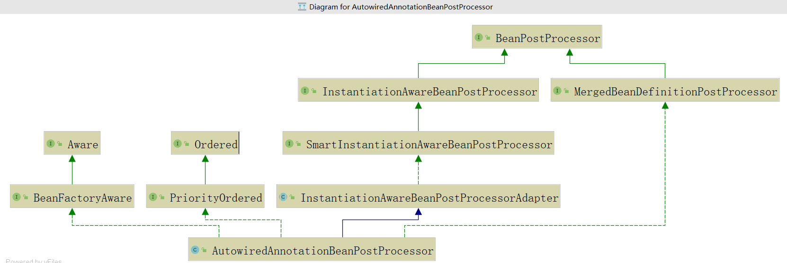

# Ioc容器

控制反转

依赖注入

主动创建的模式中，责任归于开发者，而在被动的模式下，责任归于 IoC 容器，基于这样的被动形式，我们就说对象被控制反转了。（也可以说是反转了控制）


## Ioc容器设计

`Spring IoC` 容器的设计主要是基于以下两个接口：

- BeanFactory
- ApplicationContext

`ApplicationContext` 是 `BeanFactory` 的子接口之一，换句话说：`BeanFactory` 是 `Spring IoC 容器`所定义的最底底接口，而 `ApplicationContext` 是其最高级接口之一，并对 BeanFactory 功能做了许多的扩展，所以在绝大部分的工作场景下，**都会使用 ApplicationContext 作为 Spring IoC 容器。**


### BeanFactory

- `BeanFactory` 位于设计的最底层，它提供了 `Spring IoC` 最底层的设计


```java
String FACTORY_BEAN_PREFIX = "&";

Object getBean(String name) throws BeansException;

<T> T getBean(String name, @Nullable Class<T> requiredType) throws BeansException;

Object getBean(String name, Object... args) throws BeansException;

<T> T getBean(Class<T> requiredType) throws BeansException;

<T> T getBean(Class<T> requiredType, Object... args) throws BeansException;

boolean containsBean(String name);

// 判断是否单例，如果判断为真，其意思是该 Bean 在容器中是作为一个唯一单例存在的。
boolean isSingleton(String name) throws NoSuchBeanDefinitionException;

// 如果判断为真，意思是当你从容器中获取 Bean，容器就为你生成一个新的实例
// 在默认情况下，【isSingleton】为 ture，而【isPrototype】为 false
boolean isPrototype(String name) throws NoSuchBeanDefinitionException;

boolean isTypeMatch(String name, ResolvableType typeToMatch) throws NoSuchBeanDefinitionException;

boolean isTypeMatch(String name, @Nullable Class<?> typeToMatch) throws NoSuchBeanDefinitionException;

@Nullable
Class<?> getType(String name) throws NoSuchBeanDefinitionException;

String[] getAliases(String name);
```


### ApplicationContext

- 通过API文档可以知道，ApplicationContext是BeanFactory的子接口，并且从文档中也可以看到ApplicaionContext除了包含有BeanFactory的所有功能还支持了更多的功能。


### ApplicationContext的实现方式

 `FileSystemXmlApplicationContext`：加载配置文件的时候采用的是项目的路径。

 `ClassPathXmlApplicationContext`：加载配置文件的时候根据ClassPath位置。

 `XmlWebApplicationContext`：在Web环境下初始化监听器的时候会加载该类。

 `AnnotationConfigApplicationContext`：根据注解的方式启动Spring 容器。


#### AnnotationConfigApplicationContext

```java
package com.qls.test;

import com.qls.impl.BraveKnight;
import com.qls.impl.SlayDragonQuest;
import com.qls.inter.Knight;
import com.qls.inter.Query;
import org.springframework.context.annotation.Bean;
import org.springframework.context.annotation.Configuration;

/**
	 * @Bean indicated that a method produced a bean to be managed by the spring container;
	 */
@Configuration
public class KnightConfig {
    @Bean(name = "knight")
    public Knight knight(){
        return  new BraveKnight(quest());
    }
    @Bean(name = "quest")
    public Query quest(){
        return  new SlayDragonQuest(System.out);
    }
}
```

```java
package com.qls.test;

import com.qls.inter.Knight;
import org.springframework.context.annotation.AnnotationConfigApplicationContext;

public class Test4 {
    public static void main(String[] args) {
        AnnotationConfigApplicationContext ac = new AnnotationConfigApplicationContext(KnightConfig.class);
        Knight knight = ac.getBean(Knight.class);
        knight.embarkOnQuest();
    }
}
```


#### ClassPathXmlApplicationContext


#### FileSystemXmlApplicationContext


#### XmlWebApplicationContext


## BeanFactory与ApplicationContext区别

- BeanFactory初始化bean采用懒加载，在获取的时候才创建；ApplicationContext启动时一次性全部加载，如果配置错误则无法启动容器，可以提前检测配置正确性，当然也导致容器启动速度慢

- 对于配置文件，ApplicationContext提供了访问URL和文件访问的接口

- ApplicationContext支持aop


# Ioc容器的启动原理

注意：

`Bean` 的定义和初始化在 `Spring IoC` 容器是两大步骤，它是先定义，然后初始化和依赖注入的。


## Bean 的定义

`Bean` 的定义分为 3 步：

- `Resource` 定位

  `Spring IoC` 容器先根据开发者的配置，进行资源的定位，在 `Spring` 的开发中，通过 `XML` 或者注解都是十分常见的方式，定位的内容是由开发者提供的。

- `BeanDefinition` 的载入

  这个时候只是将 `Resource` 定位到的信息，保存到 `Bean` 定义（`BeanDefinition`）中，此时并不会创建 `Bean` 的实例

- `BeanDefinition` 的注册

  这个过程就是将 `BeanDefinition` 的信息发布到 `Spring IoC` 容器中

  注意：此时仍然没有对应的 `Bean` 的实例。

做完了以上 3 步，`Bean` 就在 `Spring IoC` 容器中被定义了，而没有被初始化，更没有完成依赖注入，也就是没有注入其配置的资源给 `Bean`，那么它还不能完全使用。


## Bean的初始化


## 容器的启动

web环境Spring、Spring mvc容器加载过程

对于一个web应用，部署在web容器中，容易提供一个全局应用上下文（ServletContext），为后面的IOC容器提供宿主环境。

其次，因为web.xml中会提供有contextLoaderListener（或ContextLoaderServlet），当web容器启动后，触发IOC容器初始化时间，contextLoaderListener监听到事件后，Spring将初始化一个上下文（WebApplicationContext接口），实现类为XmlWebApplicationContext（IOC容器）。 IOC初始化后，开始初始化各种servlet（DispatchServlet），以IOC容器为宿主环境进行初始化（两者都有属于自己的bean缓存）


# Spring后置处理器扩展接口

`Bean`对象在实例化和依赖注入完毕后，在显示调用初始化方法的前后添加我们自己的逻辑。注意是Bean实例化完毕后及依赖注入完成后触发的。




## BeanPostProcessor

执行顺序：BeanFactoryPostProcessor—>构造方法—>BeanPostProcessor的before—>init-method—>BeanPostProcessor的after.


```java
public interface BeanPostProcessor {
	// 实例化、依赖注入完毕，在调用显示的初始化之前完成一些定制的初始化任务
	Object postProcessBeforeInitialization(Object bean, String beanName) throws BeansException;
        // 实例化、依赖注入、初始化完毕时执行
	Object postProcessAfterInitialization(Object bean, String beanName) throws BeansException;

}
// 注意:接口中两个方法不能返回null，如果返回null那么在后续初始化方法将报空指针异常或者通过getBean()方法获取不到bena实例对象，因为后置处理器从Spring IoC容器中取出bean实例对象没有再次放回IoC容器中
```


tips：多个后置处理器指定顺序

在默认情况下Spring容器会根据后置处理器的定义顺序来依次调用。

- 显示指定顺序

> 在Spring机制中可以指定后置处理器调用顺序，通过让BeanPostProcessor接口实现类实现Ordered接口getOrder方法，该方法返回一整数，默认值为 0，优先级最高，值越大优先级越低.


## PriorityOrdered

确认 `AutowiredAnnotationBeanPostProcessor` 后置处理器的执行优先级

## BeanFactoryAware

使得`AutowiredAnnotationBeanPostProcessor`可以直接通过`BeanFactory`获取容器中的Bean

## AutowiredAnnotationBeanPostProcessor

可以直接通过`BeanFactory`获取容器中的Bean。

## InstantiationAwareBeanPostProcessor

在 Bean 实例化前后和Bean设置属性值时执行的后置处理器。

## SmartInstantiationAwareBeanPostProcessor

智能实例化Bean的后处理器，如预测Bean的类型和确认Bean的构造函数等。

## MergedBeanDefinitionPostProcessor

合并Bean的定义信息。


## BeanDefinitionRegistryPostProcessor

手动往容器中注入bean，即编程方式注入bean。

> Spring 中用BeanDefinition接口描述一个bean，Spring容器中用Map<String, BeanDefinition> beanDefinitionMap
>
> 存储beanName和BeanDefinition对象的映射关系【beanDefinitionMap 可参考DefaultListableBeanFactory】。Spring在实例化一个bean，都是先从 beanDefinitionMap 中获取beanDefinition对象，进而构造出对应的bean。因此，我们手动注册bean的问题，就演化为如何往这个 beanDefinitionMap 放入我们要注册bean对应的 BeanDefinition 对象。
>
> Spring 提供了 BeanDefinitionRegistry 接口来操作底层beanFactory实现的beanDefinitionMap。


# Aware系列接口

在 Spring 中，有一个特殊的约定，就是被 Spring 容器管理的 bean，如果实现了 Spring 提供的以 Aware 结尾的接口，那么在对 bean 进行实例化的过程中，容器会调用相应的接口方法，通过这个特性，我们可以获取容器或者 bean 相关的一些属性。

```java
/**
 * A marker superinterface indicating that a bean is eligible to be notified by the
 * Spring container of a particular framework object through a callback-style method.
 * The actual method signature is determined by individual subinterfaces but should
 * typically consist of just one void-returning method that accepts a single argument.
 *
 * <p>Note that merely implementing {@link Aware} provides no default functionality.
 * Rather, processing must be done explicitly, for example in a
 * {@link org.springframework.beans.factory.config.BeanPostProcessor}.
 * Refer to {@link org.springframework.context.support.ApplicationContextAwareProcessor}
 * for an example of processing specific {@code *Aware} interface callbacks.
 *
 * @author Chris Beams
 * @author Juergen Hoeller
 * @since 3.1
 */
public interface Aware {

}
```

Aware 接口为 Spring 容器的核心接口，是一个具有标识作用的超级接口，实现了该接口的 bean 是具有被 Spring 容器**通知**的能力，通知的方式是采用回调的方式。


## 接口实现


### ApplicationContextAware

实现ApplicationContextAware接口的Bean可以获得Spring上下文信息ApplicationContext，ApplicationContextAware接口内部只有一个方法：

void setApplicationContext(ApplicationContext applicationContext) throws BeansException;

该方法会在Spring容器加载完后被调用，用户只要实现这个接口就能拿到Spring上下文信息。

### ApplicationEventPublisherAware

该接口主要用于发布一些事件时使用，接口方法如下:

void setApplicationEventPublisher(ApplicationEventPublisher applicationEventPublisher);

实现该接口能获取到ApplicationEventPublisher，这个接口具备发布事件功能。

### BeanClassLoaderAware

该接口可以获取到加载当前类的类加载器，

void setBeanClassLoader(ClassLoader classLoader);

### BeanFactoryAware

这个很简单，主要用于获取BeanFactory接口。

### BeanNameAware

实现该接口的Bean能够获取在Spring IOC中bean的名字。

### BootstrapContextAware

拿到BootstrapContext信息，BootstrapContext暂时不清楚用来干啥，官方解释为:

这提供了一种机制，通过引导环境资源适配器实例时，它是引导。那是，当（开始（bootstrapcontext））在resourceadapter类的方法调用。引导上下文包含对资源适配器实例可用的有用设施的引用。

### EmbeddedValueResolverAware

实现该接口可以获取Spring加载properties文件的属性值，

void setEmbeddedValueResolver(StringValueResolver resolver);

通常是用于一些编程是获取配置信息，常用于工具类中。

### EnvironmentAware

void setEnvironment(Environment environment);

实现该接口可以获取到系统的环境变量信息。

### ImportAware

### LoadTimeWeaverAware

加载Spring Bean时织入第三方模块，如AspectJ

### MessageSourceAware

主要用于获取国际化相关接口

### NotificationPublisherAware

用于获取通知发布者

### ResourceLoaderAware

初始化时注入ResourceLoader

### SchedulerContextAware

配合Quartz使用，获取Quartz调度上下文

### ServletConfigAware, ServletContextAware

web开发过程中获取ServletConfig和ServletContext信息。


## 使用方法

这里以 `BeanNameAware`、`ApplicationContextAware` 为例，演示相关接口的使用方法。相关的代码来自 `Dubbo` 框架的 `com.alibaba.dubbo.config.spring.ServiceBean`。

```java
public class ServiceBean<T> extends ServiceConfig<T> implements InitializingBean, DisposableBean, ApplicationContextAware, ApplicationListener, BeanNameAware {

    private static final long serialVersionUID = 213195494150089726L;

    private transient ApplicationContext applicationContext;

    private transient String beanName;

    public void setApplicationContext(ApplicationContext applicationContext) {
        this.applicationContext = applicationContext;
        SpringExtensionFactory.addApplicationContext(applicationContext);
        if (applicationContext != null) {
            SPRING_CONTEXT = applicationContext;
            try {
                Method method = applicationContext.getClass().getMethod("addApplicationListener", new Class<?>[]{ApplicationListener.class}); // 兼容Spring2.0.1
                method.invoke(applicationContext, new Object[] {this});
                supportedApplicationListener = true;
            } catch (Throwable t) {
                if (applicationContext instanceof AbstractApplicationContext) {
                    try {
                        Method method = AbstractApplicationContext.class.getDeclaredMethod("addListener", new Class<?>[]{ApplicationListener.class}); // 兼容Spring2.0.1
                        if (! method.isAccessible()) {
                            method.setAccessible(true);
                        }
                        method.invoke(applicationContext, new Object[] {this});
                        supportedApplicationListener = true;
                    } catch (Throwable t2) {
                    }
                }
            }
        }
    }

    public void setBeanName(String name) {
        this.beanName = name;
    }
}
```

代码中只保留了与 Aware 接口相关的内容。

可以看到 `ServiceBean` 实现了 `BeanNameAware`、`ApplicationContextAware` 接口，对应的方法为 `com.alibaba.dubbo.config.spring.ServiceBean#setBeanName` 和 `com.alibaba.dubbo.config.spring.ServiceBean#setApplicationContext`，这两个方法将会被容器调用，带来的结果就是 `ServiceBean` 可以直接获取到容器上下文环境 `ApplicationContext` 和当前 `bean` 在容器中的表示的 `BeanName`。


## 使用示例

```java
//实现BeanNameAware接口，并重写setBeanName()方法，让Bean获取自己在BeanFactory配置中的名字（根据情况是id或者name）
//实现ApplicationContextAware接口，并重写setApplicationContext()方法
public class MyApplicationContext implements BeanNameAware,ApplicationContextAware{
    private String beanName;

    //注入的beanName即为MyApplicationContext在BeanFactory配置中的名字（根据情况是id或者name）
    @Override
    public void setBeanName(String beanName) {
        this.beanName = beanName;
        System.out.println("MyApplicationContext beanName:"+beanName);
    }

    @Override
    public void setApplicationContext(ApplicationContext context)
            throws BeansException {
        //通过重写的接口方法，获取spring容器实例context，进而获取容器中相关bean资源
        System.out.println(context.getBean(this.beanName).hashCode());
    }
}
```


在 Spring 配置文件中加上如下 bean 节点，那么容器中所管理的 `MyApplicationContext` 在实例化过程中将会执行这两个方法。

```xml
<bean name ="myContext" class="com.jsun.test.springDemo.aware.MyApplicationContext"></bean>
```


## 总结

这里只是以 `BeanNameAware`、`ApplicationContextAware` 接口进行了说明，其他的 Aware 结尾的接口的使用方法类似，表示获取到某种属性的能力。不仅如此，Spring 中的其他很多的接口的设计也是采用了这种思想，比如 `ServiceBean` 实现的 `DisposableBean`,`ApplicationListener` 接口。这是一种很优秀的设计思想，Spring 容器在其初始化的特殊时刻将会统一调用实现了对应接口的实例的对应方法。


# Import系列

Spring 3.0之前，我们的Bean可以通过xml配置文件与扫描特定包下面的类来将类注入到Spring IOC容器内。

Spring 3.0之后提供了JavaConfig的方式，也就是将IOC容器里Bean的元信息以java代码的方式进行描述。我们可以通过@Configuration与@Bean这两个注解配合使用来将原来配置在xml文件里的bean通过java代码的方式进行描述。

@Import注解提供了**@Bean注解的功能，同时还有xml配置文件里\<import>标签组织多个分散的xml文件的功能，当然在这里是组织多个分散的@Configuration**。

```java
@Target(ElementType.TYPE)
@Retention(RetentionPolicy.RUNTIME)
@Documented
public @interface Import {
    /**
     * 这里说了可以配合 Configuration , ImportSelector, ImportBeanDefinitionRegistrar 来使用
     * 
     * {@link Configuration}, {@link ImportSelector}, {@link ImportBeanDefinitionRegistrar}
     * or regular component classes to import.
     */
    Class<?>[] value();

}
```


注入bean示例：

```java
import com.ivan.entity.User;
import com.ivan.service.UserService;

public class UserServiceImpl implements UserService {

    public int save(User user) {
        System.out.println("调用了当前方法");
        return 1;
    }

}
```


方式一：

```java
import org.springframework.context.annotation.Configuration;
import org.springframework.context.annotation.Import;

import com.ivan.service.impl.UserServiceImpl;

@Configuration
@Import(value={UserServiceImpl.class})
public class Config {

}
```


方式二：通过ImportBeanDefinitionRegistrar将类注入到Spring IOC容器

```java
import org.springframework.beans.factory.support.BeanDefinitionBuilder;
import org.springframework.beans.factory.support.BeanDefinitionRegistry;
import org.springframework.context.annotation.ImportBeanDefinitionRegistrar;
import org.springframework.core.type.AnnotationMetadata;

import com.ivan.service.impl.UserServiceImpl;

public class UserServiceBeanDefinitionRegistrar implements ImportBeanDefinitionRegistrar {

    public void registerBeanDefinitions(AnnotationMetadata importingClassMetadata,
                                        BeanDefinitionRegistry registry) {
        BeanDefinitionBuilder userService = BeanDefinitionBuilder.rootBeanDefinition(UserServiceImpl.class);
        //通过registry就可以注入到容器里啦
        registry.registerBeanDefinition("userService", userService.getBeanDefinition());
    }

}
```


```java
package com.ivan.config;

import org.springframework.context.annotation.Configuration;
import org.springframework.context.annotation.Import;

import com.ivan.bean.registrar.UserServiceBeanDefinitionRegistrar;

@Configuration(value="ivan_test")
@Import(value={UserServiceBeanDefinitionRegistrar.class})
public class Config {

}
```


方式三：通过ImportSelector方式注入Bean

上面通过ImportBeanDefinitionRegistrar的方式注入的实例需要我们操作BeanDefinitionRegistry 对象，而通过ImportSelector方式我们可以不操作BeanDefinitionRegistry 对象，只需要告诉容器我们需要注入类的完整类名就好。

```java
public interface ImportSelector {

    /**
     * Select and return the names of which class(es) should be imported based on
     * the {@link AnnotationMetadata} of the importing @{@link Configuration} class.
     */
    String[] selectImports(AnnotationMetadata importingClassMetadata);

}
```


# applicationcontextinitializer

ApplicationContextInitializer是Spring框架原有的东西，这个类的主要作用就是在ConfigurableApplicationContext类型(或者子类型)的ApplicationContext做refresh之前，允许我们对ConfiurableApplicationContext的实例做进一步的设置和处理。

## 扩展实现方式

### 编程方式

```java
//@Order的value值越小->越早执行。注：在类上标注，不是方法上
@Order(111)
public class ApplicationContextInitializer1 implements ApplicationContextInitializer {

    @Override
    public void initialize(ConfigurableApplicationContext applicationContext) {

        // 打印容器里面有多少个bean
        System.out.println("bean count=====" + applicationContext.getBeanDefinitionCount());

        // 打印人所有 beanName
        System.out.println(applicationContext.getBeanDefinitionCount() + "个Bean的名字如下：");
        String[] beanDefinitionNames = applicationContext.getBeanDefinitionNames();
        for (String beanName : beanDefinitionNames) {
            System.out.println(beanName);
        }

    }
}
```

启动类里手动增加initializer

```java
@SpringBootApplication
@EnableConfigServer
@EnableDiscoveryClient
public class ConfigServer {
    public static void main(String[] args) {
        SpringApplication springApplication = new SpringApplication(ConfigServer.class);

        // 方法一：添加自定义的 ApplicationContextInitializer 实现类的实例(注册ApplicationContextInitializer)
        springApplication.addInitializers(new ApplicationContextInitializer1());

        ConfigurableApplicationContext context = springApplication.run(args);

        context.close();
    }
}
```

### application.properties添加配置方式

通过DelegatingApplicationContextInitializer这个初始化类中的initialize方法获取到application.properties中context.initializer.classes对应的类并执行对应的initialize方法。

只需要将实现了ApplicationContextInitializer的类添加到application.properties即可。

```properties
org.springframework.context.ApplicationContextInitializer=com.dxz.ApplicationContextInitializer1
```

### 使用spring.factories方式

在项目下的resources下新建META-INF文件夹，文件夹下新建spring.factories文件

```factories
org.springframework.context.ApplicationContextInitializer=com.dxz.ApplicationContextInitializer1
```


