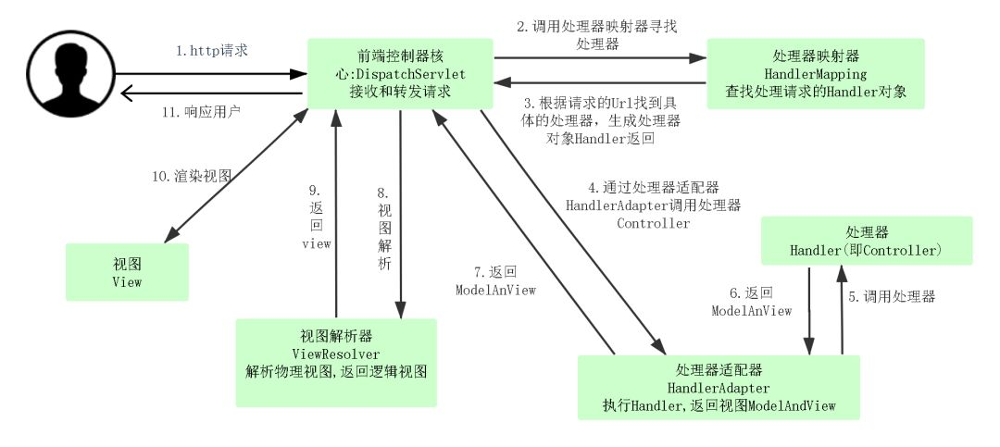
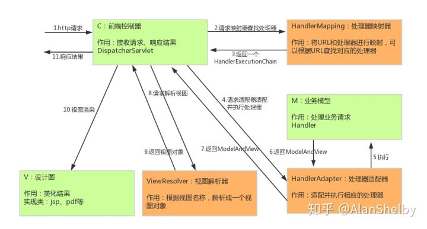
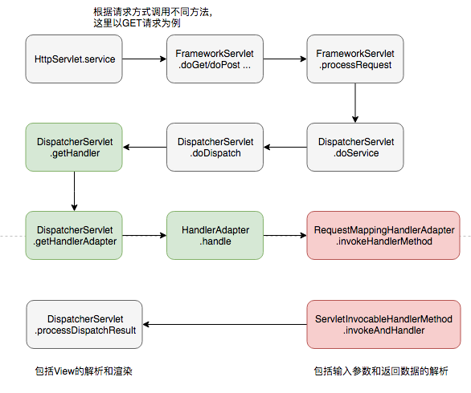

# 流程

## 处理流程

> 1）用户发送请求至前端控制器 DispatcherServlet。
>
> 2）DispatcherServlet 收到请求调用 HandlerMapping 处理器映射器。
>
> 3） 处理器映射器根据请求 url 找到具体的处理器，生成处理器对象及处理器拦截器（如果有则生成）一并返回给 DispatcherServlet。
>
> 4） DispatcherServlet 通过 HandlerAdapter 处理器适配器调用处理器。
>
> 5） HandlerAdapter 执行处理器（handler，也叫后端控制器）。
>
> 6） Controller 执行完成返回 ModelAndView。
>
> 7） HandlerAdapter 将 handler 执行结果 ModelAndView 返回给 DispatcherServlet。
>
> 8） DispatcherServlet 将 ModelAndView 传给 ViewReslover 视图解析器。
>
> 9） ViewReslover 解析后返回具体 View 对象。
>
> 10） DispatcherServlet 对 View 进行渲染视图（即将模型数据填充至视图中）。
>
> 11） DispatcherServlet 响应用户。

## 调用流程

- 灰色标识主流程，绿色为`DispathcerServlet.doDispatch`方法中的流程，红色为`HandlerAdapter.handler`方法中的流程

# 组件

## DispatcherServlet

> 前端控制器。用户请求到达前端控制器，它就相当于`MVC`模式中的C，`DispatcherServlet`是整个流程控制的中心，由它调用其它组件处理用户的请求，`DispatcherServlet`的存在降低了组件之间的耦合性,系统扩展性提高。由框架实现

## HandlerMapping

> 处理器映射器。`HandlerMapping`负责根据用户请求的`url`找到`Handler`即处理器，`Spring MVC`提供了不同的映射器实现不同的映射方式，根据一定的规则去查找,例如：`xml`配置方式，实现接口方式，注解方式等。由框架实现

### RequestMappingHandlerMapping

### BeanNameUrlHandlerMapping

### SimpleUrlHandlerMapping

### WelcomePageHandlerMapping

## Handler

> 处理器。Handler 是继`DispatcherServlet`前端控制器的后端控制器，在`DispatcherServlet`的控制下Handler对具体的用户请求进行处理。**由于Handler涉及到具体的用户业务请求，所以一般情况需要程序员根据业务需求开发Handler**。

## HandlAdapter

> 处理器适配器。通过`HandlerAdapter`对处理器进行执行，这是适配器模式的应用，通过扩展适配器可以对更多类型的处理器进行执行。由框架实现。

### RequestMappingHandlerAdapter

### HttpRequestHandlerAdapter

### SimpleControllerHandlerAdapter

## ModelAndView 

> `Spring MVC`的封装对象，将`Model`和`View`封装在一起。

## ViewResolver

> 视图解析器。`ViewResolver`负责将处理结果生成View视图，`ViewResolver`首先根据逻辑视图名解析成物理视图名即具体的页面地址，再生成View视图对象，最后对View进行渲染将处理结果通过页面展示给用户。

### ContentNegotiatingViewResolver

### BeanNameViewResolver

### ViewResolverComposite

### InternalResourceViewResolver

## View

> `Spring MVC`的封装对象，是一个接口, `Spring MVC`框架提供了很多的View视图类型，包括：`jspview、pdfview、jstlView、freemarkerView、pdfView`等。一般情况下需要通过页面标签或页面模版技术将模型数据通过页面展示给用户，需要由程序员根据业务需求开发具体的页面。

https://segmentfault.com/a/1190000013816079