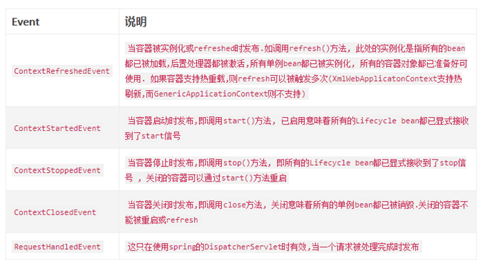
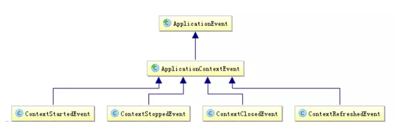
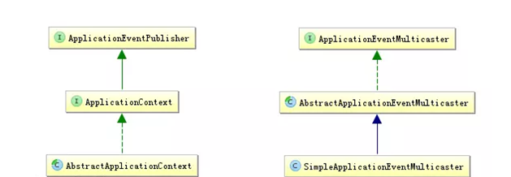

# Spring事件监听机制

- spring的事件监听机制是基于java的事件机制实现的。

[原文链接](https://baijiahao.baidu.com/s?id=1617119527751442850&wfr=spider&for=pc)

# java的事件机制

- java中的事件机制一般包括3个部分：EventObject，EventListener和Source。

## EventObject

- java.util.EventObject是事件状态对象的基类，它封装了事件源对象以及和事件相关的信息。所有java的事件类都需要继承该类。

## EventListener

- java.util.EventListener是一个标记接口，就是说该接口内是没有任何方法的。所有事件监听器都需要实现该接口。事件监听器注册在事件源上，当事件源的属性或状态改变的时候，调用相应监听器内的回调方法。

## Source

- 事件源不需要实现或继承任何接口或类，它是事件最初发生的地方。因为事件源需要注册事件监听器，所以事件源内需要有相应的盛放事件监听器的容器。


**java的事件机制是一个观察者模式。**


# spring事件

- Spring 的事件（Application Event）为 **Bean 与 Bean 之间的消息通信**提供了支持。当一个 Bean 处理完一个任务之后，希望另一个 Bean 知道并能做相应的处理，这时我们就需要让另一个 Bean 监听当前 Bean 所发送的事件。*（观察者模式）*

- Spring 的事件需要遵循以下流程：

  - 1. 自定义事件，集成 ApplicationEvent。

  - 2. 定义事件监听器，实现 ApplicationListener。

  - 3. 使用容器（ApplicationContext）发布事件

    - ApplicationEventPublisher是Spring的事件发布接口，ApplicationContext实现了该接口
    - ApplicationEventMulticaster就是Spring事件机制中的事件广播器，默认实现SimpleApplicationEventMulticaster

- 在Spring中通常是ApplicationContext本身担任监听器注册表的角色，在其子类AbstractApplicationContext中就聚合了事件广播器ApplicationEventMulticaster和事件监听器ApplicationListnener，并且提供注册监听器的addApplicationListnener方法。

- 其**执行的流程**大致为：

  - 当一个事件源产生事件时，它通过事件发布器ApplicationEventPublisher发布事件，然后事件广播器ApplicationEventMulticaster会去事件注册表ApplicationContext中找到事件监听器ApplicationListnener，并且逐个执行监听器的onApplicationEvent方法，从而完成事件监听器的逻辑。


## 详解

- 在设计模式中,观察者模式可以算得上是一种非常经典的行为设计模式,事件---事件发布者---事件监听者是事件驱动模型在设计层面的体现.
- 在`Spring`容器中通过`ApplicationEvent`类和`ApplicationListener`接口来处理事件的.如果某个`bean`实现`ApplicationListener`接口并被部署到容器中,那么每次对应的`ApplicationEvent`被发布到容器中都会通知该`bean`,这是典型的观察者模式.
- `Spring`的事件默认是同步的,即调用`#publishEvent`方法发布事件后,它会处于阻塞状态,直到`#onApplicationEvent`接受到事件并处理返回之后才继续执行下去,这种单线程同步的好处是可以进行事务管理.

系统默认提供的容器事件的异步发布机制参数




### 事件

其继承自`JDK`的`EventObject`,`JDK`要求所有的事件都继承它,并通过`#resource`得到事件源

统默认提供如下`ApplicationEvent`事件




### 目标(事件发布者)

具体代表:`ApplicationEventPublisher`和`ApplicationEventMulticaster`,系统提供如下实现



- `ApplicationContext`接口继承了`ApplicationEventPublisher`,并在`abstractApplicationContext#publishEvent`方法实现具体代码,实际执行委托给`ApplicationEventMulticaster#multicastEvent`方法.
- `ApplicationContext#initApplicationEventMulticaster`方法会自动到本地容器里找一个名为`ApplicationEventMulticaster`的实现,如果没有就`new`一个`SimpleApplicationEventMulticaster`.
- 可以看到如果提供一个`executor`,它就可以异步支持发布事件,否则为同步发布.


### 监听器

具体代表:`ApplicationListener`

- 其继承自`JDK`的`EventListener`,`JDK`要求所有的监听器将继承它
- `ApplicationListener`接口:其只提供了`#onApplicationEvent`方法,我们需要在该方法实现内部判断事件类型来处理,若想提供顺序触发监听器的语义,则可以使用另一个接口:`SmartApplicationListener`


## Spring事件驱动案例

### 无序

- 1.定义用户注册事件。

  必须继承ApplicationEvent，实现构造方法。

  `ApplicationEvent`是由`Spring`提供的所有`Event`类的基类

```java
public class UserEvent extends ApplicationEvent {

    private BaseBean baseBean;

    /**
     * 重写构造函数
     * @param source 发生事件的对象
     */
    public UserEvent(Object source, BaseBean baseBean) {
        super(source);
        this.baseBean = baseBean;

    }
    public BaseBean getBaseBean() {
        return baseBean;
    }
    public void setBaseBean(BaseBean baseBean) {
        this.baseBean = baseBean;
    }
}
```

- 1.2事件监听器，监听方法的实现有很多种，可以使用注解；也可以实现接口ApplicationListener

```java
@Component
public class UserBeanListener {

    /**
     * 监听实现方法
     * @param event 监听事件
     */
    @EventListener
    public void register(UserEvent event) {
        System.out.println("UserBeanListener: " + event.getBaseBean().getName());
    }
}

```


```java
@Component
public class UserBeanListener implements ApplicationListener<UserEvent>{

    /**
     * 监听实现方法
     * @param event 监听事件
     */
    @Override
    public void onApplicationEvent(UserEvent event) {
        System.out.println("UserBeanListener: " + event.getBaseBean().getName());
    }
}

```


- 1.3发布事件
  - ApplicationEventPublisher是Spring的事件发布接口，ApplicationContext实现了该接口
  - ApplicationEventMulticaster就是Spring事件机制中的事件广播器，默认实现SimpleApplicationEventMulticaster

```java
@Service
public class RegisterService {

    @Autowired
    private ApplicationContext applicationContext;

    public void register() {
        /*
         * 这里的UserA 和 UserB 都是BaseBean的子类
         */
        UserA a = new UserA();
        a.setName("a");
        UserB b = new UserB();
        b.setName("b");
        // 发布事件  UserEvent
        applicationContext.publishEvent(new UserEvent(this, a));
        // 发布事件  UserEvent
        applicationContext.publishEvent(new UserEvent(this, b));
    }
}
```


- `ApplicationEventPublishAware`是由`Spring`提供的用于`Service`注入`ApplicationEventPublisher`事件发布器的接口.使用这个接口,我们的`Service`就拥有发布事件的能力了.
- 用户注册后,不再是显示调用其他的业务`Service`,而是发布一个用户注册事件

```java
@Component
public class AppServiceImpl implements ApplicationEventPublisherAware {

    private ApplicationEventPublisher applicationEventPublisher;

    @Override
    public void setApplicationEventPublisher(ApplicationEventPublisher applicationEventPublisher) {
        this.applicationEventPublisher = applicationEventPublisher;
    }

    public void show(String object){
        System.out.println("用户发部" + object);
        applicationEventPublisher.publishEvent(new UserEvent(object));
    }
}
```


### 有序

- 当发布多个事件的时候,他们的顺序是无序的.如果要控制顺序,则监听器`Service`需要实现`Order`接口或者使用`SmartApplicationListener`.
- 通过`Spring`事件驱动模型,我们完成了注册服务和其他服务之间的解耦,这也是事件驱动的最大特性之一,若后续要新增其他操作,只需要添加相应的事件订阅者即可.


```java
@Component
public class AppListenner implements SmartApplicationListener {

    //用于指定支持的事件类型,只有支持的才调用#onApplicationEvent方法.
    @Override
    public boolean supportsEventType(Class<? extends ApplicationEvent> eventType) {
        return false;
    }

    //支持的目标类型,只有支持的才调用#onApplicationEvent方法.
    @Override
    public boolean supportsSourceType(Class<?> sourceType) {
        return false;
    }

    //顺序越小优先级越高,监听器默认优先级为7.
    @Override
    public int getOrder() {
        return 0;
    }

    @Override
    public void onApplicationEvent(ApplicationEvent event) {
        System.out.println("abc");
    }
}
```


## Spring对Event的注解支持

`Spring4.2`之后,`ApplicationEventPublisher`自动被注入到容器中,不再需要显示实现`Aware`接口

```java
@Component
public class AppServiceImpl {

    @Autowired
    private ApplicationEventPublisher applicationEventPublisher;

    public void show(String object){
        System.out.println("用户发部" + object);
        applicationEventPublisher.publishEvent(new UserEvent(object));
    }
}
```


## Spring对异步事件机制的支持

`java`配置通过`@EnableAsync`模块注解开启异步支持,使用`@Async`注解对需要异步的监听器进行标注.

```java
@Component
public class AppServiceImpl {

    @EventListener
    @Async
    public void scoreEventListener(UserEvent event){
        System.out.println("用户发部" + object);
    }
}
```

