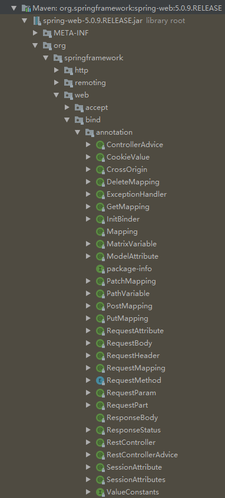

# 控制层相关注解



- 前端请求类型

```xml
Content-Type:

    application/x-www-form-urlencoded		//Http协议中默认编码的内容 @RequestParam 处理

    application/json, application/xml等		//必须使用 @RequestBody 来处理

    multipart/form-data
```

- application/x-www-form-urlencoded
  - 这种情况的数据@RequestParam,@ModelAttribute可以处理，当然@RequestBody 也能处理。
- multipart/form-data
  - 使用 @RequestBody 不能处理这种格式的数据
- 其他格式（包括application/json, application/xml等）
  - 必须使用 @RequestBody 来处理

## 1.@RequestParam

- 用来处理Content-Type: 为 application/x-www-form-urlencoded编码的内容。（Http协议中，如果不指定Content-Type，则默认传递的参数就是application/x-www-form-urlencoded类型）
- 在Content-Type: application/x-www-form-urlencoded的请求中，get 方式中queryString的值，和post方式中 body data的值都会被Servlet接受到并转化到Request.getParameter()参数集中，所以@RequestParam可以获取的到。
- 如果传输的是单层json对象，我们后台可以直接用 @RequestParam接收；如果传输的是**多层嵌套json对象**，这个时候会就会出现数据丢失问题

## 2.@RequestBody

- 在GET请求中，不能使用@RequestBody。
- 在POST请求，可以使用@RequestBody和@RequestParam，但是如果使用@RequestBody，对于参数转化的配置必须统一。

## 3.@ResponseBody

## 4.@RequestMapping

4.1@GetMapping

4.2@PostMapping

4.3@PutMapping

4.4@DeleteMapping

4.5@PatchMapping

4.6@PathVariable

## 5.@CrossOrigin


## @Controller/RestController 

[原文链接](https://www.cnblogs.com/shuaifing/p/8119664.html)

- @RestController 注解相当于 @ResponseBody ＋ @Controller 合在一起的作用。

1) 如果只是使用 @RestController 注解控制器，则控制器中的方法无法返回 jsp 页面，或者 html ，
			配置的视图解析器 InternalResourceViewResolver 不起作用，返回的内容就是 return 里的内容。
		 

2) 如果需要返回到指定页面，则需要用 @Controller配合视图解析器 InternalResourceViewResolver 才行。
		如果需要返回JSON，XML或自定义mediaType内容到页面，则需要在对应的方法上加上@ResponseBody注解。


# 注入相关

## 1.@Primary

- 自动装配时当出现多个Bean候选者时，被注解为@Primary的Bean将作为首选者，否则将抛出异常 

## 2.@Qualifier

- 合格者，通过这个标示，表明了哪个实现类才是我们所需要的
- 需要注意的是@Qualifier的参数名称必须为我们之前定义的bean的名称之一
- 定义

```java
@Configuration
public class DataBaseConfig {

    @Bean(name = "gbiapDataSource")
    @ConfigurationProperties(prefix = "lj.datasource.gbiap")
    public DataSource gbiapDataSource() {
        return new DruidDataSource();
    }

    @Bean(name = "gbiapCommonConfigDataSource")
    @ConfigurationProperties(prefix = "lj.datasource.gbiap-common-config")
    public DataSource gbiapCommonConfigDataSource() {
        return new DruidDataSource();
    }

    @Bean(name = "gbiapCountResultDataSource")
    @ConfigurationProperties(prefix = "lj.datasource.gbiap-count-result")
    public DataSource gbiapCountResultDataSource() {
        return new DruidDataSource();
    }


    @Bean(name = "gbiapJdbcTemplate")
    public JdbcTemplate gbiapJdbcTemplate(@Qualifier("gbiapDataSource") DataSource ctaDataSource) {
        return new JdbcTemplate(ctaDataSource);
    }

    @Bean(name = "gbiapCommonConfigJdbcTemplate")
    public JdbcTemplate gbiapCommonConfigJdbcTemplate(@Qualifier("gbiapCommonConfigDataSource") DataSource gbiapCommonConfigJdbcTemplate) {
        return new JdbcTemplate(gbiapCommonConfigJdbcTemplate);
    }

    @Bean(name = "gbiapCountResultJdbcTemplate")
    public JdbcTemplate gbiapCountResultJdbcTemplate(@Qualifier("gbiapCountResultDataSource") DataSource gbiapCountResultJdbcTemplate) {
        return new JdbcTemplate(gbiapCountResultJdbcTemplate);
    }
}
```

- 使用

```java
@Repository
public class BureauInfoDao {

    @Autowired
    @Qualifier("gbiapCommonConfigJdbcTemplate")
    //上边两行效果等同于：@Resource(name = "gbiapCommonConfigJdbcTemplate")
    private JdbcTemplate jdbcTemplate;

    @Autowired
    private RowMapper<BureauInfoEntity> rowMapper;

    private static final String TABLE_NAME = "BureauInfoTable";

    private List<BureauInfoEntity> getTableInfo() {
        String sql = "select * from " + TABLE_NAME;
        return jdbcTemplate.query(sql, rowMapper);
    }
}
```


## 3.@Resource

- 默认按名称装配，当找不到与名称匹配的bean才会按类型装配。 

## 4. @Autowired

- 默认按类型装配，如果我们想使用按名称装配，可以结合@Qualifier注解一起使用 

> @Autowired  
> @Qualifier(“personDaoBean”)  
> 存在多个实例配合使用

- @Autowired + @Qualifier == @Resource

## @Bean

---

### 作用 

> Spring的@Bean注解用于告诉方法，产生一个Bean对象，然后这个Bean对象交给Spring管理。  
> 产生这个Bean对象的方法Spring只会调用一次，随后Spring会将这个Bean对象放在自己的IOC容器中。

### 基于xml方式的bean声明

- spring3.0之前，没有注解的方式，如果要声明一个bean交给spring容器管理，只能通过xml配置文件的方式进行配置。

示例：

bean.xml
	

```xml
<?xml version="1.0" encoding="UTF-8"?>
<beans xmlns="http://www.springframework.org/schema/beans"
       xmlns:xsi="http://www.w3.org/2001/XMLSchema-instance"
       xsi:schemaLocation="http://www.springframework.org/schema/beans http://www.springframework.org/schema/beans/spring-beans.xsd">

    <bean id="person" class="com.myspringboot.helloworld.model.Person">
        <property name="name" value="赵六"/>
        <property name="age" value="26"/>
    </bean>
</beans>
```

使用:

```java
ApplicationContext context = new ClassPathXmlApplicationContext("bean.xml");
Person xmlBeanPerson = context.getBean(Person.class);
System.out.println(xmlBeanPerson);
......
```

### 基于注解方式声明并注入bean

- spring3.0之后，支持使用注解方式来声明一个bean，并交给spring容器管理。

示例：

```java
config/MyMvcConfig.java

@Configuration
public class MyMvcConfig {

    @Bean
    public Person getPerson() {
        return new Person();
    }
}
```

> @Configuration告诉spring，这个类是一个spring配置类。  
> @Bean告诉spring，这个方法会产生一个Bean对象，然后spring会管理这个Bean对象。

### @Bean定义

```java
@Target({ElementType.METHOD, ElementType.ANNOTATION_TYPE})
@Retention(RetentionPolicy.RUNTIME)
@Documented
public @interface Bean {
    @AliasFor("name")
    String[] value() default {};

    @AliasFor("value")
    String[] name() default {};

    /** @deprecated */
    @Deprecated
    Autowire autowire() default Autowire.NO;

    boolean autowireCandidate() default true;

    String initMethod() default "";

    String destroyMethod() default "(inferred)";
}
```

- ElementType.METHOD, ElementType.ANNOTATION_TYPE：可以在使用在方法上，以及一个注释类型声明  

- value -- bean别名和name是相互依赖关联的，value,name如果都使用的话值必须要一致  

- name -- bean名称，如果不写会默认为注解的方法名称  

- autowire -- 自定装配默认是不开启的，建议尽量不要开启，因为自动装配不能装配基本数据类型、字符串、数组等，这是自动装配设计的局限性，以及自动装配不如显示依赖注入精确  

- initMethod -- bean的初始化之前的执行方法，该参数一般不怎么用，因为可以完全可以在代码中实现  

- destroyMethod -- bean销毁执行的方法

- bean的别名与描述

  ```java
  @Configuration
  public class AppConfig {
  
  ​```
  @Description("Provides a basic example of a bean")//描述
  @Bean(name = { "dataSource", "subsystemA-dataSource", "subsystemB-dataSource" })//别名
  public DataSource dataSource() {
      // instantiate, configure and return DataSource bean...
  }
  ​```
  
  }
  ```

  
