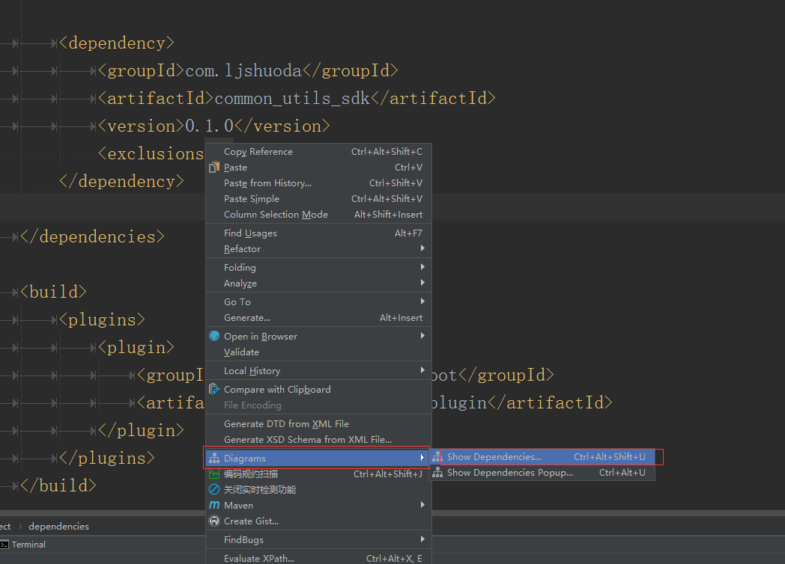
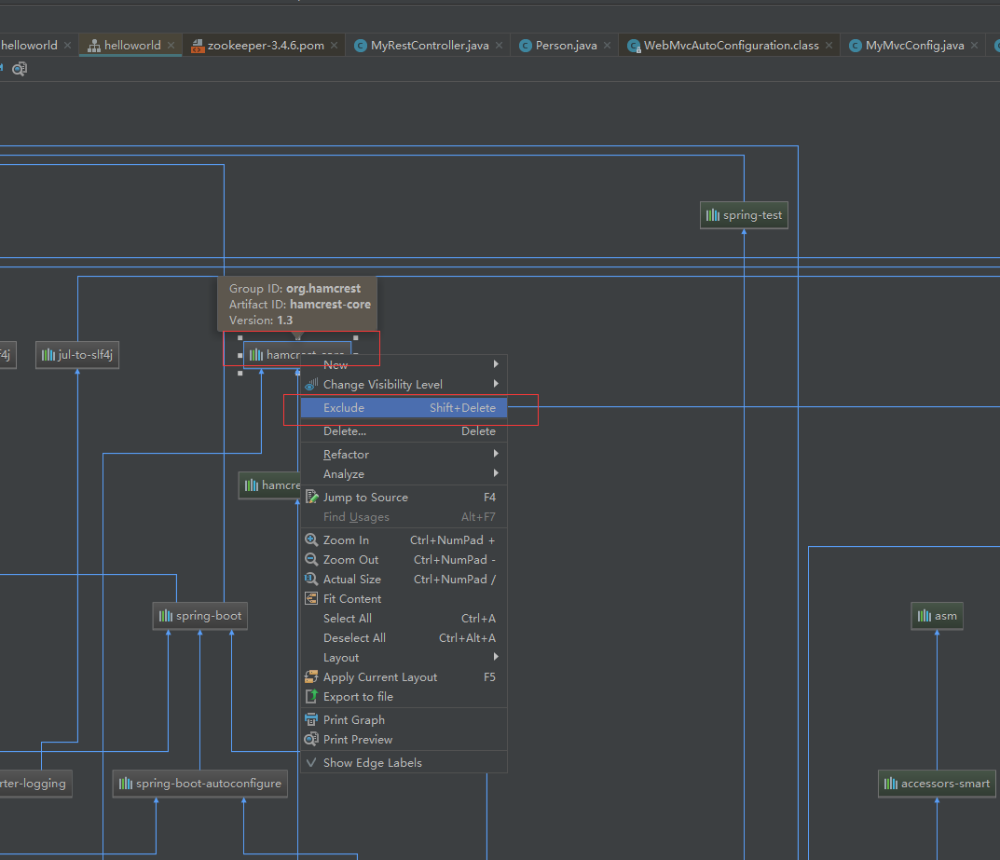

## java常用日志

[点击查看介绍](https://blog.csdn.net/baidu_36216018/article/details/79607550)

### 1.日志门面（日志接口而非实现）

- commons-logging

	Apache Commons Logging(之前叫Jakarta Commons Logging)，即 JCL

- slf4j

#### commons-logging

	动态查找机制，在程序运行时自动找到真正使用的日志库。它是使用了ClassLoader寻找和载入底层的日志库。

#### slf4j

	在编译时绑定真正的日志库。

### 2.日志实现

- JDK的日志:java.util.logging，即： jul

- 第三方日志工具：log4j，logback，log4j2，Jboss-logging

### 3.排除jar包

- idea中maven管理的项目

---

