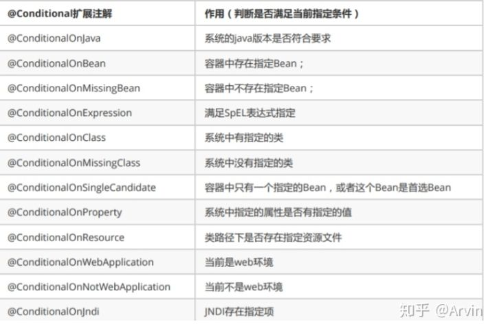

# 为什么要用 Spring Boot 

下面我列几个最常见的三个回答：

**A：Spring Boot 最主要是不用 XML 配置，可以用 Java 来配置 bean，省去了许多配置文件。**

我又问：Spring 本身就可以用 Java 配置代替 XML 配置，和 Spring Boot 有什么关系呢？

然后对方就吱吱唔唔了……

**B：Spring Boot 我们用来做 Spring Cloud 微服务。**

我又问：微服务和 Spring Boot 有什么关系？不用 Spring Boot 行不行？

然后对方就吱吱唔唔了……

**C：Spring Boot 可以打 jar 包部署，内部集成了Tomcat。**

这个确实是 Spring Boot 的特色，但是我还是觉得没有答到关键点上。

然后我继续问，如果不考虑打 jar 包部署呢，然后就没然后了……

为什么我们要用 Spring Boot，显然上面三个求职者没有答到关键点上，Spring Boot 最重要的功能是：<font color=#dd0000>自动配置</font>

**为什么说是自动配置？**

Spring Boot 的开启注解是：@SpringBootApplication，其实它就是由下面三个注解组成的：

- @Configuration
- @ComponentScan
- @EnableAutoConfiguration

上面三个注解，前面两个都是 Spring 自带的，和 Spring Boot 无关，所以说上面的回答的不是在点上。

所以说 Spring Boot 最最核心的就是这个 `@EnableAutoConfiguration` 注解了，它能根据类路径下的 jar 包和配置动态加载配置和注入bean。

举个例子，比如我在 lib 下放一个 druid 连接池的 jar 包，然后在 application.yml 文件配置 druid 相关的参数，Spring Boot 就能够自动配置所有我们需要的东西，如果我把 jar 包拿掉或者把参数去掉，那 Spring Boot 就不会自动配置。

这样我们就能把许多功能做成公共的自动配置的启动器（starters），其实 druid 连接池就是这么做的，它提供了针对 Spring Boot 的启动器：druid-spring-boot-starter。

有了这个自动配置的启动器，我们就能非常简单的使用它，

先添加 jar 包依赖：

```xml
<dependency>   
	<groupId>com.alibaba</groupId>   
	<artifactId>druid-spring-boot-starter</artifactId>   
	<version>1.1.10</version>
</dependency>
```

再添加相关参数：

```properties
spring.datasource.url= 
spring.datasource.username=
spring.datasource.password=……
```

如果是传统的项目，我们要自己手动写一大堆的配置，而且还不灵活，有了这个启动器，我们就可以做到简单集成。具体大家可以看 druid-spring-boot-starter 是怎么实现的。

**所以，这才是 Spring Boot 的核心，这才是我们为什么使用 Spring Boot 的原因。如果答不到这个关键点，那真没有掌握到 Spring Boot 的核心所在。**


# springboot内嵌tomcat

https://www.cnblogs.com/sword-successful/p/11383723.html

http://cmsblogs.com/?p=2674


# springboot自动配置原理

1.`@EnableAutoConfiguration`作用：

​	利用`EnableAutoConfigurationImportSelector`给容器中导入一些组件

```java
@Target({ElementType.TYPE})
@Retention(RetentionPolicy.RUNTIME)
@Documented
@Inherited
@AutoConfigurationPackage
@Import({AutoConfigurationImportSelector.class})
public @interface EnableAutoConfiguration {
    String ENABLED_OVERRIDE_PROPERTY = "spring.boot.enableautoconfiguration";

    Class<?>[] exclude() default {};

    String[] excludeName() default {};
}
```

可以查看selectImports()方法的内容

```java
public String[] selectImports(AnnotationMetadata annotationMetadata) {
    if (!this.isEnabled(annotationMetadata)) {
        return NO_IMPORTS;
    } else {
        AutoConfigurationMetadata autoConfigurationMetadata = AutoConfigurationMetadataLoader.loadMetadata(this.beanClassLoader);
        // 获取候选的配置
        AutoConfigurationImportSelector.AutoConfigurationEntry autoConfigurationEntry = this.getAutoConfigurationEntry(autoConfigurationMetadata, annotationMetadata);
        return StringUtils.toStringArray(autoConfigurationEntry.getConfigurations());
    }
}

protected AutoConfigurationImportSelector.AutoConfigurationEntry getAutoConfigurationEntry(AutoConfigurationMetadata autoConfigurationMetadata, AnnotationMetadata annotationMetadata) {
    if (!this.isEnabled(annotationMetadata)) {
        return EMPTY_ENTRY;
    } else {
        AnnotationAttributes attributes = this.getAttributes(annotationMetadata);
        // 获取候选的配置的地方
        List<String> configurations = this.getCandidateConfigurations(annotationMetadata, attributes);
        configurations = this.removeDuplicates(configurations);
        Set<String> exclusions = this.getExclusions(annotationMetadata, attributes);
        this.checkExcludedClasses(configurations, exclusions);
        configurations.removeAll(exclusions);
        configurations = this.filter(configurations, autoConfigurationMetadata);
        this.fireAutoConfigurationImportEvents(configurations, exclusions);
        return new AutoConfigurationImportSelector.AutoConfigurationEntry(configurations, exclusions);
    }
}

protected List<String> getCandidateConfigurations(AnnotationMetadata metadata, AnnotationAttributes attributes) {
    // 根据名称加载配置
    List<String> configurations = SpringFactoriesLoader.loadFactoryNames(this.getSpringFactoriesLoaderFactoryClass(), this.getBeanClassLoader());
    Assert.notEmpty(configurations, "No auto configuration classes found in META-INF/spring.factories. If you are using a custom packaging, make sure that file is correct.");
    return configurations;
}


// org.springframework.core.io.support.SpringFactoriesLoader 类似于SPI

// SpringFactoriesLoader会加载classpath下所有JAR文件里面的META-INF/spring.factories文件。


// 扫描所有jar包类路径下 META‐INF/spring.factories
// 把扫描到的这些文件的内容包装成properties对象,从properties中获取到EnableAutoConfiguration.class类（类名）对应的值，然后把他们添加在容器中
public static List<String> loadFactoryNames(Class<?> factoryClass, @Nullable ClassLoader classLoader) {
    String factoryClassName = factoryClass.getName();
    return (List)loadSpringFactories(classLoader).getOrDefault(factoryClassName, Collections.emptyList());
}

private static Map<String, List<String>> loadSpringFactories(@Nullable ClassLoader classLoader) {
    MultiValueMap<String, String> result = (MultiValueMap)cache.get(classLoader);
    if (result != null) {
        return result;
    } else {
        try {
            Enumeration<URL> urls = classLoader != null ? classLoader.getResources("META-INF/spring.factories") : ClassLoader.getSystemResources("META-INF/spring.factories");
            LinkedMultiValueMap result = new LinkedMultiValueMap();

            while(urls.hasMoreElements()) {
                URL url = (URL)urls.nextElement();
                UrlResource resource = new UrlResource(url);
                Properties properties = PropertiesLoaderUtils.loadProperties(resource);
                Iterator var6 = properties.entrySet().iterator();

                while(var6.hasNext()) {
                    Entry<?, ?> entry = (Entry)var6.next();
                    String factoryClassName = ((String)entry.getKey()).trim();
                    String[] var9 = StringUtils.commaDelimitedListToStringArray((String)entry.getValue());
                    int var10 = var9.length;

                    for(int var11 = 0; var11 < var10; ++var11) {
                        String factoryName = var9[var11];
                        result.add(factoryClassName, factoryName.trim());
                    }
                }
            }

            cache.put(classLoader, result);
            return result;
        } catch (IOException var13) {
            throw new IllegalArgumentException("Unable to load factories from location [META-INF/spring.factories]", var13);
        }
    }
}
```


将 类路径下 META-INF/spring.factories 里面配置的所有EnableAutoConfiguration的值加入到了容中；

```properties
# Auto Configure
org.springframework.boot.autoconfigure.EnableAutoConfiguration=\
org.springframework.boot.autoconfigure.admin.SpringApplicationAdminJmxAutoConfiguration,\
org.springframework.boot.autoconfigure.aop.AopAutoConfiguration,\
org.springframework.boot.autoconfigure.amqp.RabbitAutoConfiguration,\
org.springframework.boot.autoconfigure.batch.BatchAutoConfiguration,\
org.springframework.boot.autoconfigure.cache.CacheAutoConfiguration,\
org.springframework.boot.autoconfigure.cassandra.CassandraAutoConfiguration,\
org.springframework.boot.autoconfigure.cloud.CloudAutoConfiguration,\
org.springframework.boot.autoconfigure.context.ConfigurationPropertiesAutoConfiguration,\
org.springframework.boot.autoconfigure.context.MessageSourceAutoConfiguration,\
org.springframework.boot.autoconfigure.context.PropertyPlaceholderAutoConfiguration,\
org.springframework.boot.autoconfigure.couchbase.CouchbaseAutoConfiguration,\
org.springframework.boot.autoconfigure.dao.PersistenceExceptionTranslationAutoConfiguration,\
org.springframework.boot.autoconfigure.data.cassandra.CassandraDataAutoConfiguration,\
org.springframework.boot.autoconfigure.data.cassandra.CassandraRepositoriesAutoConfiguration,\
org.springframework.boot.autoconfigure.data.couchbase.CouchbaseDataAutoConfiguration,\
org.springframework.boot.autoconfigure.data.couchbase.CouchbaseRepositoriesAutoConfiguration,\
org.springframework.boot.autoconfigure.data.elasticsearch.ElasticsearchAutoConfiguration,\
org.springframework.boot.autoconfigure.data.elasticsearch.ElasticsearchDataAutoConfiguration,\
org.springframework.boot.autoconfigure.data.elasticsearch.ElasticsearchRepositoriesAutoConfiguration,\
org.springframework.boot.autoconfigure.data.jpa.JpaRepositoriesAutoConfiguration,\
org.springframework.boot.autoconfigure.data.ldap.LdapDataAutoConfiguration,\
org.springframework.boot.autoconfigure.data.ldap.LdapRepositoriesAutoConfiguration,\
org.springframework.boot.autoconfigure.data.mongo.MongoDataAutoConfiguration,\
org.springframework.boot.autoconfigure.data.mongo.MongoRepositoriesAutoConfiguration,\
org.springframework.boot.autoconfigure.data.neo4j.Neo4jDataAutoConfiguration,\
org.springframework.boot.autoconfigure.data.neo4j.Neo4jRepositoriesAutoConfiguration,\
org.springframework.boot.autoconfigure.data.solr.SolrRepositoriesAutoConfiguration,\
org.springframework.boot.autoconfigure.data.redis.RedisAutoConfiguration,\
org.springframework.boot.autoconfigure.data.redis.RedisRepositoriesAutoConfiguration,\
org.springframework.boot.autoconfigure.data.rest.RepositoryRestMvcAutoConfiguration,\
org.springframework.boot.autoconfigure.data.web.SpringDataWebAutoConfiguration,\
org.springframework.boot.autoconfigure.elasticsearch.jest.JestAutoConfiguration,\
org.springframework.boot.autoconfigure.freemarker.FreeMarkerAutoConfiguration,\
org.springframework.boot.autoconfigure.gson.GsonAutoConfiguration,\
org.springframework.boot.autoconfigure.h2.H2ConsoleAutoConfiguration,\
org.springframework.boot.autoconfigure.hateoas.HypermediaAutoConfiguration,\
org.springframework.boot.autoconfigure.hazelcast.HazelcastAutoConfiguration,\
org.springframework.boot.autoconfigure.hazelcast.HazelcastJpaDependencyAutoConfiguration,\
org.springframework.boot.autoconfigure.info.ProjectInfoAutoConfiguration,\
org.springframework.boot.autoconfigure.integration.IntegrationAutoConfiguration,\
org.springframework.boot.autoconfigure.jackson.JacksonAutoConfiguration,\
org.springframework.boot.autoconfigure.jdbc.DataSourceAutoConfiguration,\
org.springframework.boot.autoconfigure.jdbc.JdbcTemplateAutoConfiguration,\
org.springframework.boot.autoconfigure.jdbc.JndiDataSourceAutoConfiguration,\
org.springframework.boot.autoconfigure.jdbc.XADataSourceAutoConfiguration,\
org.springframework.boot.autoconfigure.jdbc.DataSourceTransactionManagerAutoConfiguration,\
org.springframework.boot.autoconfigure.jms.JmsAutoConfiguration,\
org.springframework.boot.autoconfigure.jmx.JmxAutoConfiguration,\
org.springframework.boot.autoconfigure.jms.JndiConnectionFactoryAutoConfiguration,\
org.springframework.boot.autoconfigure.jms.activemq.ActiveMQAutoConfiguration,\
org.springframework.boot.autoconfigure.jms.artemis.ArtemisAutoConfiguration,\
org.springframework.boot.autoconfigure.flyway.FlywayAutoConfiguration,\
org.springframework.boot.autoconfigure.groovy.template.GroovyTemplateAutoConfiguration,\
org.springframework.boot.autoconfigure.jersey.JerseyAutoConfiguration,\
org.springframework.boot.autoconfigure.jooq.JooqAutoConfiguration,\
org.springframework.boot.autoconfigure.kafka.KafkaAutoConfiguration,\
org.springframework.boot.autoconfigure.ldap.embedded.EmbeddedLdapAutoConfiguration,\
org.springframework.boot.autoconfigure.ldap.LdapAutoConfiguration,\
org.springframework.boot.autoconfigure.liquibase.LiquibaseAutoConfiguration,\
org.springframework.boot.autoconfigure.mail.MailSenderAutoConfiguration,\
org.springframework.boot.autoconfigure.mail.MailSenderValidatorAutoConfiguration,\
org.springframework.boot.autoconfigure.mobile.DeviceResolverAutoConfiguration,\
org.springframework.boot.autoconfigure.mobile.DeviceDelegatingViewResolverAutoConfiguration,\
org.springframework.boot.autoconfigure.mobile.SitePreferenceAutoConfiguration,\
org.springframework.boot.autoconfigure.mongo.embedded.EmbeddedMongoAutoConfiguration,\
org.springframework.boot.autoconfigure.mongo.MongoAutoConfiguration,\
org.springframework.boot.autoconfigure.mustache.MustacheAutoConfiguration,\
org.springframework.boot.autoconfigure.orm.jpa.HibernateJpaAutoConfiguration,\
org.springframework.boot.autoconfigure.reactor.ReactorAutoConfiguration,\
org.springframework.boot.autoconfigure.security.SecurityAutoConfiguration,\
org.springframework.boot.autoconfigure.security.SecurityFilterAutoConfiguration,\
org.springframework.boot.autoconfigure.security.FallbackWebSecurityAutoConfiguration,\
org.springframework.boot.autoconfigure.security.oauth2.OAuth2AutoConfiguration,\
org.springframework.boot.autoconfigure.sendgrid.SendGridAutoConfiguration,\
org.springframework.boot.autoconfigure.session.SessionAutoConfiguration,\
org.springframework.boot.autoconfigure.social.SocialWebAutoConfiguration,\
org.springframework.boot.autoconfigure.social.FacebookAutoConfiguration,\
org.springframework.boot.autoconfigure.social.LinkedInAutoConfiguration,\
org.springframework.boot.autoconfigure.social.TwitterAutoConfiguration,\
org.springframework.boot.autoconfigure.solr.SolrAutoConfiguration,\
org.springframework.boot.autoconfigure.thymeleaf.ThymeleafAutoConfiguration,\
org.springframework.boot.autoconfigure.transaction.TransactionAutoConfiguration,\
org.springframework.boot.autoconfigure.transaction.jta.JtaAutoConfiguration,\
org.springframework.boot.autoconfigure.validation.ValidationAutoConfiguration,\
org.springframework.boot.autoconfigure.web.DispatcherServletAutoConfiguration,\
org.springframework.boot.autoconfigure.web.EmbeddedServletContainerAutoConfiguration,\
org.springframework.boot.autoconfigure.web.ErrorMvcAutoConfiguration,\
org.springframework.boot.autoconfigure.web.HttpEncodingAutoConfiguration,\
org.springframework.boot.autoconfigure.web.HttpMessageConvertersAutoConfiguration,\
org.springframework.boot.autoconfigure.web.MultipartAutoConfiguration,\
org.springframework.boot.autoconfigure.web.ServerPropertiesAutoConfiguration,\
org.springframework.boot.autoconfigure.web.WebClientAutoConfiguration,\
org.springframework.boot.autoconfigure.web.WebMvcAutoConfiguration,\
org.springframework.boot.autoconfigure.websocket.WebSocketAutoConfiguration,\
org.springframework.boot.autoconfigure.websocket.WebSocketMessagingAutoConfiguration,\
org.springframework.boot.autoconfigure.webservices.WebServicesAutoConfiguration
```

每一个这样的 `xxxAutoConfiguration`类都是容器中的一个组件，都加入到容器中；用他们来做自动配置；

然后每一个自动配置类进行自动配置功能。


注意：

这些`AutoConfiguration`不是所有都会加载的，会根据`AutoConfiguration`上的`@ConditionalOnClass`等条件，再进一步判断是否加载。


总结：

- `SpringBoot`启动的时候会扫描所有`jar`路径下的`META-INF/spring.factories`，将其文件包装成`Properties`对象
- 从`Properties`对象获取到`key`值为`EnableAutoConfiguration`的数据，加载到IOC容器中，实现自动配置功能！


附录：



**作用：必须是@Conditional指定的条件成立，才给容器中添加组件，配置配里面的所有内容才生效**


# springboot启动流程


# 配置文件能配置的属性

https://docs.spring.io/spring-boot/docs/1.5.9.RELEASE/reference/htmlsingle/#common-application-properties