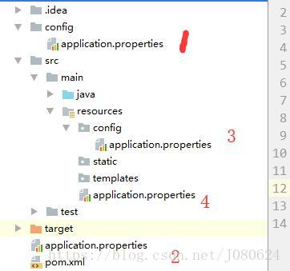

## SpringBoot配置(Profile不同环境配置)  

### properties格式

- Profile是Spring对不同环境提供不同配置功能的支持，可以通过激活、指定参数等方式快速切换环境

- 一般我们在开发的时候有测试环境，开发环境，生产环境等。

- 在编写多个配置文件的时候，文件名字是application-(profile).properties/yml

  eg: application-test.properties, application-prod.properties, application-dev.properties

- 我们只需要在application-.properties/yaml中指定激活配置文件即可:

  spring.profiles.active=prod

### yaml/yml格式

- 文档快

```
	#激活哪个环境
	spring:
	  profiles:
	    active: test
	#测试环境
	---
	server:
	  port: 808
	spring:
	  profiles: test
	#开发环境
	---
	server:
	  port: 8082
	spring:
	  profiles: dev

```


# springboot命令行指定配置文件

* java的springboot项目，有时候为了配置方便，需要将配置文件单独拿出来，这样可以在不重新打包的情况下，修改配置文件即可重启程序。

* 有时候，当多个springboot项目jar包放在服务器同一目录下，那么多个模块对应的配置文件则需要单独重新命名。

---

## 所以有时候我们需要在命令行启动 springboot 程序的时候，指定配置文件

> java -Dspring.config.location=application.yaml,application.properties -jar network-0.0.1.jar

- 注意事项： 

  springboot项目默认启动(即： 不在命令行指定配置文件)和命令行指定配置文件这两种启动方式是不同的。

  当不在命令行指定配置文件，即用jar包默认的配置文件的时候，此时如果打包的源文件内有 没有加 @Configuration @Commpent @Service
  等注释的时候，是不会报错，且程序可正常启动的；

  但是当在命令行制定配置文件方式启动的时候，如果源文件内有 没有加 @Configuration @Commpent @Service 等注释，则会出现启动失败的现象。

  猜测: 应该是springboot启动时根据配置文件位置而进行了不同的配置，当命令行指定配置文件时，若此时源代码中有需要交给spring Ioc容器管理的bean没有加注解，spring扫描不到，则会直接报错。


# SpringBoot - 配置文件加载位置与优先级

---

## 1.项目内部配置文件

- spring boot 启动后默认会扫描以下位置的application.properties或者application.yml文件作为Spring boot的配置文件

```
	–file:./config/  
	–file:./  
	–classpath:/config/  
	–classpath:/  

- 如下图所示：



- **以上是按照优先级从高到低的顺序，所有位置的文件都会被加载，高优先级配置内容会覆盖低优先级配置内容。**

- 改变默认配置位置

	`java -jar spring-boot-02-config-02-0.0.1-SNAPSHOT.jar --spring.config.location=D:/application.properties`

## 2.外部配置加载顺序

- SpringBoot也可以从以下位置加载配置

```

	1.命令行参数:  
		
		所有的配置都可以在命令行上进行指定；
	
		多个配置用空格分开； –配置项=值
	
		java -jar spring-boot-02-config-02-0.0.1-SNAPSHOT.jar --server.port=8087 --server.context-path=/abc
	
	2.来自java:comp/env的JNDI属性 
	3.Java系统属性（System.getProperties()） 
	4.操作系统环境变量 
	5.RandomValuePropertySource配置的random.*属性值
	6.jar包外部的application-{profile}.properties或application.yml(带spring.profile)配置文件 
	7.jar包内部的application-{profile}.properties或application.yml(带spring.profile)配置文件 
	8.jar包外部的application.properties或application.yml(不带spring.profile)配置文件 
	9.jar包内部的application.properties或application.yml(不带spring.profile)配置文件

- **优先级从高到低；高优先级的配置覆盖低优先级的配置，所有的配置会形成互补配置。**

---

- **由jar包外向jar包内进行寻找，优先加载带profile的，再加载不带profile的。**

# springboot之配置文件占位符

### 使用SpringBoot提供的的一些随机数

	${random.value}、${random.int}、${random.long}
	
	${random.int(10)}、${random.int[1024,65536]}

### 使用我们这个配置文件中自己在前面定义的值

	person.last-name=张三
	
	person.dog.name=${person.last-name}小狗

- 如果前面没有这个值，可以用默认值：

  ${app.name:金毛}