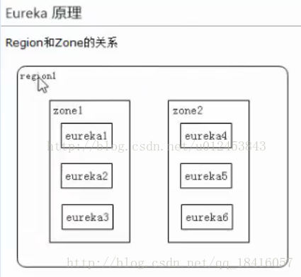
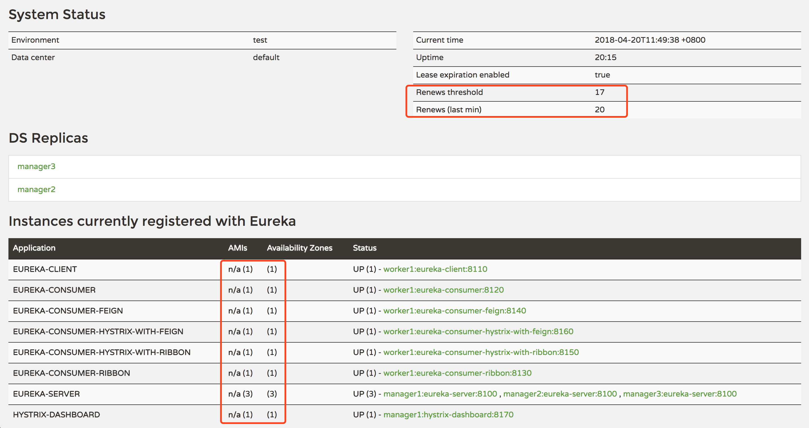
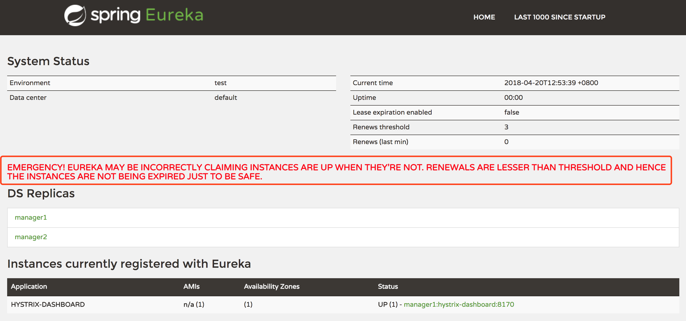

# CAP理论

- 指的是在一个分布式系统中，Consistency（一致性）、 Availability（可用性）、Partition tolerance（分区容错性），三者不可同时获得。

> **一致性（C）**：在分布式系统中的所有数据备份，在同一时刻是否同样的值。（所有节点在同一时间的数据完全一致，越多节点，数据同步越耗时）	
>
> **可用性（A）**：负载过大后，集群整体是否还能响应客户端的读写请求。（服务一直可用，而且是正常响应时间）
>
> **分区容错性（P）**：分区容忍性，就是高可用性，一个节点崩了，并不影响其它的节点（100个节点，挂了几个，不影响服务，越多机器越好）


**再进一步解释CAP理论**

就是说在分布式存储系统中，最多只能实现上面的两点。而由于当前的网络硬件肯定会出现延迟丢包等问题，所以分区容忍性是我们必须需要实现的。所以我们只能**在一致性和可用性之间进行权衡**

> **C A 满足的情况下，P不能满足的原因：**
> 	数据同步(C)需要时间，也要正常的时间内响应(A)，那么机器数量就要少，所以P就不满足
>
> **CP 满足的情况下，A不能满足的原因：**
> 	数据同步(C)需要时间, 机器数量也多(P)，但是同步数据需要时间，所以不能再正常时间内响应，所以A就不满足
>
> **AP 满足的情况下，C不能满足的原因：**
> 	机器数量也多(P)，正常的时间内响应(A)，那么数据就不能及时同步到其他节点，所以C不满足


**Zookeeper和Consul ：CP设计，保证了一致性，集群搭建的时候，某个节点失效，则会进行选举行的leader，或者半数以上节点不可用，则无法提供服务，因此可用性没法满足**

**Eureka：AP原则，无主从节点，一个节点挂了，自动切换其他节点可以使用，去中心化**


> 结论：分布式系统中P,肯定要满足，所以只能在CA中二选一没有最好的选择，最好的选择是根据业务场景来进行架构设计
> 如果要求一致性，则选择zookeeper、Consul，如金融行业
> 如果要去可用性，则Eureka，如电商系统


# 示例

以eureka作为服务的发现注册中心。

## eureka server

pom.xml

```xml
<properties>
    <java.version>1.8</java.version>
    <java.version>1.8</java.version>
    <project.build.sourceEncoding>UTF-8</project.build.sourceEncoding>
    <project.reporting.outputEncoding>UTF-8</project.reporting.outputEncoding>
    <spring-cloud.version>Greenwich.SR2</spring-cloud.version>
</properties>

<dependencies>

    <dependency>
        <groupId>org.springframework.boot</groupId>
        <artifactId>spring-boot-starter-web</artifactId>
    </dependency>

    <dependency>
        <groupId>de.codecentric</groupId>
        <artifactId>spring-boot-admin-starter-server</artifactId>
        <version>2.1.5</version>
    </dependency>
    <dependency>
        <groupId>de.codecentric</groupId>
        <artifactId>spring-boot-admin-dependencies</artifactId>
        <version>2.1.5</version>
        <type>pom</type>
        <scope>import</scope>
    </dependency>

    <dependency>
        <groupId>org.springframework.cloud</groupId>
        <artifactId>spring-cloud-starter-netflix-eureka-server</artifactId>
    </dependency>

</dependencies>

<dependencyManagement>
    <dependencies>

        <dependency>
            <groupId>de.codecentric</groupId>
            <artifactId>spring-boot-admin-dependencies</artifactId>
            <version>2.1.5</version>
        </dependency>

        <dependency>
            <groupId>org.springframework.cloud</groupId>
            <artifactId>spring-cloud-dependencies</artifactId>
            <version>${spring-cloud.version}</version>
            <type>pom</type>
            <scope>import</scope>
        </dependency>

    </dependencies>
</dependencyManagement>
```


application.yaml

```yaml
spring:
  application:
    name: eureka-server
server:
  port: 8761
eureka:
  instance:
    hostname: localhost
    # 在多机器独立部署的情况下是没有问题的，配置 prefer-ip-address 为 ture，
    # 代表发现服务时候优先按照 IP 去搜寻，对于多集群而言，可以保证尽快准确搜索到服务。
    # 而对于单机部署来说，IP 地址都是相同的，这会导致其余注册中心出现在
    # unavailable-replicas (不可用副本) 中。所以单机部署时候不建议开启这个
    # 参数（默认值为 false），多机部署时候可以开启。
    prefer-ip-address: false
    lease-renewal-interval-in-seconds: 5 # heartbeat interval
    lease-expiration-duration-in-seconds: 15 # offline timeout
  client:
    service-url:
      defaultZone: http://${eureka.instance.hostname}:${server.port}/eureka/
    register-with-eureka: true # 设置为 false,代表不向注册中心注册自己
    fetch-registry: false #false表示自己端就是注册中心，我的职责就是维护服务实例，并不需要去检索服务
management:
  endpoints:
    web:
      exposure:
        include: "*"
  endpoint:
    health:
      show-details: ALWAYS
```


启动

```java
@SpringBootApplication
@EnableEurekaServer
public class CloudEurekaServerApplication {

    public static void main(String[] args) {
        SpringApplication.run(CloudEurekaServerApplication.class, args);
    }

}
```


## eureka client

pom.xml

```xml
<properties>
    <java.version>1.8</java.version>
    <project.build.sourceEncoding>UTF-8</project.build.sourceEncoding>
    <project.reporting.outputEncoding>UTF-8</project.reporting.outputEncoding>
    <spring-cloud.version>Greenwich.SR2</spring-cloud.version>
</properties>

<dependency>
    <groupId>org.springframework.cloud</groupId>
    <artifactId>spring-cloud-starter-netflix-eureka-client</artifactId>
</dependency>

<dependencyManagement>
    <dependencies>
        <dependency>
            <groupId>org.springframework.cloud</groupId>
            <artifactId>spring-cloud-dependencies</artifactId>
            <version>${spring-cloud.version}</version>
            <type>pom</type>
            <scope>import</scope>
        </dependency>
    </dependencies>
</dependencyManagement>
```


application.yaml

```yaml
logging:
  file: ${spring.application.name}.log
  level:
    root: info
    com:
      lj:
        pri:
          dao: debug

server:
  port: 8081

spring:
  application:
    name: eureka-pri

eureka:
  instance:
    leaseRenewalIntervalInSeconds: 10 #表示eureka client发送心跳给server端的频率
    health-check-url-path: /actuator/health #健康检查页面的URL，相对路径，默认使用 HTTP 访问，如果需要使用 HTTPS则需要使用绝对路径配置

  client:
    registryFetchIntervalSeconds: 5 #表示eureka client间隔多久去拉取服务注册信息，默认为30秒
    service-url:
      defaultZone: ${EUREKA_SERVICE_URL:http://localhost:8761}/eureka/ #服务注册中心地址
```


启动

```java
@SpringBootApplication
//@EnableEurekaClient
//@EnableDiscoveryClient
public class PriApplication {

    public static void main(String[] args) {
        SpringApplication.run(PriApplication.class, args);
    }

}
```


## 注意

`@EnableDiscoveryClient`和`@EnableEurekaClient`

共同点：都是能够让注册中心能够发现，扫描到改服务。

不同点：@EnableEurekaClient只适用于Eureka作为注册中心，@EnableDiscoveryClient 可以是其他注册中心。


@EnableDiscoveryClient基于spring-cloud-commons，@EnableEurekaClient基于spring-cloud-netflix，如果选用的注册中心是eureka，那么就推荐@EnableEurekaClient，如果是其他的注册中心，那么推荐使用@EnableDiscoveryClient。


从Spring Cloud Edgware开始，`@EnableDiscoveryClient` 或`@EnableEurekaClient` **可选项**。只需加上相关依赖，并进行相应配置，即可将微服务注册到服务发现组件上。

1. EnableDiscoveryClient注解现在是可选项了(你用不用这个注解，是不会影响服务注册发现功能的)；  
2. 只要依赖了以spring-cloud-starter-netflix为前缀的库(例如spring-cloud-starter-netflix-eureka-client)，就启用了服务注册发现功能；  
3.  使用配置项`spring.cloud.service-registry.auto-registration.enabled=false`即可禁止服务注册发现功能；


# eureka详解

spring cloud eureka作为spring cloud提供的服务发现注册中心，其在2.0之后闭源。Consul，zookeeper也可以作为服务发现注册中心。

Eureka各个节点都是平等的，没有ZK中角色的概念， 即使N-1个节点挂掉也不会影响其他节点的正常运行。


## region和zone

- zone可以理解为机房，region理解为区域

> Eureka支持Region和Zone的概念。其中一个Region可以包含多个Zone。
>
> Eureka在启动时需要指定一个Zone名，即当前Eureka属于哪个zone, 如果不指定则属于defaultZone。
>
> Eureka Client也需要指定Zone, Client(当与Ribbon配置使用时)在向Server获取注册列表时会优先向自己Zone的Eureka发请求，如果自己Zone中的Eureka全挂了才会尝试向其它Zone。当获取到远程服务列表后，Client也会优先向同一个Zone的服务发起远程调用。Region和Zone可以对应于现实中的大区和机房，如在华北地区有10个机房，在华南地区有20个机房，那么分别为Eureka指定合理的Region和Zone能有效避免跨机房调用，同时一个地区的Eureka坏掉不会导致整个该地区的服务都不可用。





## Eureka的治理机制

### 服务提供者

- **服务注册**：启动的时候会通过发送REST请求的方式将自己注册到Eureka Server上，同时带上了自身服务的一些元数据信息，比如IP地址、端口等信息。

- **服务续约：**在注册完服务之后，服务提供者会<font color=#dd0000>维护一个心跳</font>用来持续告诉Eureka Server: "我还活着 ” 。心跳频率：<font color=#dd0000>默认30秒</font>；可以通过客户端配置`eureka.instance.lease-renewal-interval-in-seconds`修改。

- **服务下线**：当服务实例进行正常的关闭操作时，它会触发一个服务下线的REST请求给Eureka Server, 告诉服务注册中心：“我要下线了 ”。


### 服务消费者

- **获取服务**：当我们启动服务消费者的时候，它会发送一个REST请求给服务注册中心，来获取上面注册的服务清单
- **服务调用**：服务消费者在获取服务清单后，通过服务名可以获得具体提供服务的实例名和该实例的元数据信息。在进行服务调用的时候，**优先访问同处一个Zone中的服务提供方**。


### Eureka Server(服务注册中心)

- **失效剔除：**`Eureka Server`在启动完成后会创建一个定时器每隔60秒检查一次服务健康状况，如果其中一个服务节点超过90秒未检查到心跳，那么`Eureka Server`会自动从服务实例列表内将该服务剔除。

  > 由于非正常关闭不会执行主动下线动作，所以才会出现失效剔除机制，该机制主要是应对`非正常关闭服务`的情况

  配置参数：

  ```yaml
  # 服务端
  
  # 服务端剔除失效服务间隔
  eureka:
  	server:
  		eviction-interval-timer-in-ms: 60000 # 默认值 60s
  		
  # 客户端
  
  #Eureka客户端向服务端发送心跳的时间间隔，单位为秒（客户端告诉服务端自己会按照该规则执行）
  eureka:
  	instance:
  		lease-renewal-interval-in-seconds: 30 # 服务端默认值
  
  #Eureka服务端在收到最后一次心跳之后等待的时间上限，单位为秒，超过则剔除（客户端告诉服务端按照此规则等待自己）
  eureka:
  	instance:
  		lease-expiration-duration-in-seconds: 90 # 服务端默认值
  ```

  

- **自我保护：**Eureka Server 在运行期间，会统计心跳失败的比例在15分钟之内是否低于85%(通常由于网络不稳定导致)。 Eureka Server会将当前的实例注册信息保护起来， 让这些实例不会过期，尽可能保护这些注册信息。

  配置参数：

  ```yaml
  eureka:
  	server: 
  		enable-self-preservation: false
  		
  # 自我保护系数
  eureka: 
  	server:
  		renewal-percent-threshold: 0.85 # 默认值
  ```

  


## Eureka Server自我保护

### 作用

> 默认情况下，如果Eureka Server在一定时间内（默认90秒）没有接收到某个微服务实例的心跳，Eureka Server将会移除该实例。
>
> 但是当网络分区故障发生时，微服务与Eureka Server之间无法正常通信，而微服务本身是正常运行的，此时不应该移除这个微服务，所以引入了自我保护机制。

```properties
eureka.server.enable-self-preservation=false
# 设为false，关闭自我保护（一般本地调式的时候最好是关闭的，默认是打开的,建议生产环境打开此配置）
```


自我保护模式正是一种针对网络异常波动的安全保护措施，使用自我保护模式能使Eureka集群更加的健壮、稳定的运行。

### 工作机制

**如果在15分钟内超过85%的客户端节点都没有正常的心跳，那么Eureka就认为客户端与注册中心出现了网络故障，Eureka Server自动进入自我保护机制**，此时会出现以下几种情况：

> 1、Eureka Server不再从注册列表中移除因为长时间没收到心跳而应该过期的服务。
> 2、Eureka Server仍然能够接受新服务的注册和查询请求，但是不会被同步到其它节点上，保证当前节点依然可用。
> 3、当网络稳定时，当前Eureka Server新的注册信息会被同步到其它节点中。

因此Eureka Server可以很好的应对因网络故障导致部分节点失联的情况，而不会像ZK那样如果有一半不可用的情况会导致整个集群不可用而变成瘫痪。


### 激活条件

```properties
Renews threshold：server望每分钟收到客户端实例续约（心跳）的总数。

Renews (last min)：最后一分钟内收到的续约（心跳）总数。
```


1.在 1 分钟后，`Renews (last min) < Renews threshold`

2.`eureka server`间同服务注册数据步失败


### 计算方法



如上所示，部署3 个 Eureka Server（自注册模式），另外，又部署 7 个服务，注册到 Eureka Server 集群，参数值分别为：

- `Renews threshold`：17
- `Renews (last min)`：20

下面说下`Renews threshold`和`Renews threshold`具体计算方式。


`Renews threshold` 计算代码：

```java
this.expectedNumberOfRenewsPerMin = count * 2;

this.numberOfRenewsPerMinThreshold = (int) (this.expectedNumberOfRenewsPerMin * serverConfig.getRenewalPercentThreshold());
```

`count`表示服务的数量，如果 Eureka Server 开启自注册模式，也算一个服务，比如我们上面的示例，`count`的值就是 10（3 个自注册服务 + 7 个独立服务），`serverConfig.getRenewalPercentThreshold()`默认是 0.85（可以通过`eureka.server.renewal-percent-threshold`配置）。

所以，根据上面的分析，我们可以计算出`Renews threshold`的值：`(int)(10 * 2 * 0.85) = (int)17 = 17`。

`Renews (last min)`计算方式：`count * 2`，数值 2 表示每 30 秒 1 个心跳，每分钟 2 个心跳的固定频率因子，所以具体值为：`10 * 2 = 20`。

如果在 1 分钟后出现：`Renews (last min) < Renews threshold`，默认需等待 5 分钟（可以通过`eureka.server.wait-time-in-ms-when-sync-empty`配置），即 5 分钟后你会看到下面的提示信息：



```properties
EMERGENCY! EUREKA MAY BE INCORRECTLY CLAIMING INSTANCES ARE UP WHEN THEY’RE NOT. RENEWALS ARE LESSER THAN THRESHOLD AND HENCE THE INSTANCES ARE NOT BEING EXPIRED JUST TO BE SAFE.
```


### 解决方式

- 关闭自我保护模式（`eureka.server.enable-self-preservation`设为`false`），**不推荐**。
- 降低`renewalPercentThreshold`的比例（`eureka.server.renewal-percent-threshold`设置为`0.5`以下，比如`0.49`），**不推荐**。
- 部署多个 Eureka Server 并开启其客户端行为（`eureka.client.register-with-eureka`不要设为`false`，默认为`true`），**推荐**。


### 配置

```yaml
eureka:
	server:
        #自我保护模式，默认为true
        enable-self-preservation: true
        
        #eureka server清理无效节点的时间间隔，默认60000毫秒，即60秒
        eviction-interval-timer-in-ms: 60000
        
        # 阈值更新的时间间隔，单位为毫秒，默认为15 * 60 * 1000，即15分钟
        # 调度程序以这个频率运行，该频率计算每分钟的预期心跳，即：在这段时间内，都认为收到固定个心跳才是正常的
        renewal-threshold-update-interval-ms: 900000 # 15 * 60 * 1000
        
        #阈值因子，默认是0.85，如果阈值比最小值大，则自我保护模式开启
        renewal-percent-threshold: 0.85
        
        #清理任务程序被唤醒的时间间隔，清理过期的增量信息，单位为毫秒，默认为30 * 1000
        delta-retention-timer-interval-in-ms: 30000
        
        # 默认情况下Eureka服务器还会以每5分钟的间隔从与它对等的节点（这些节点由eureka.client.service-url.defaultZone配置指定）中复制所有的服务注册数据以达到同步的目的，
        # 如果这个同步因为某种原因导致失败，也会让Eureka服务器进入自我保护状态。
        # 如果只构建了一个Eureka服务器，并没有其他对等的节点，那么就无法同步其他服务注册信息，因此5分钟后会在Eureka的控制台上看到之前所示的告警信息。
        # 我们可以通过eureka.server.wait-time-in-ms-when-sync-empty属性配置来设置这个时间间隔
        wait-time-in-ms-when-sync-empty: 5 * 60 * 1000
```


## Eureka的核心类

```properties
InstanceInfo :              注册的服务实例,里面包含服务实例的各项属性
LeaseInfo :                 Eureka用这个类来标识应用实例的租约信息
ServiceInstance :           发现的实例信息的抽象接口,约定了服务发现的实例应用有哪些通用信息
InstanceStatus :            用于标识服务实例的状态,是一个枚举类,主要有状态UP,DOWN,STARTING,OUT_OF_SERVICE,UNKNOWN
EurekaServerConfigBean :    Eureka Server的核心配置类，里面包含了Eureka Server的各项核心属性信息
```


## Eureka的核心动作

- 核心接口为**LeaseManager**,基本实现类为**InstanceRegistry**

```java
package com.netflix.eureka.lease;

import com.netflix.eureka.registry.AbstractInstanceRegistry;

/**
 服务注册(register) :  其他客户端将自己注册到Eureka上面
 服务下线(cancel) :    Eureka 删除服务信息
 服务租约(renew) :     客户端定时向Eureka发送心跳证明自己存活,Eureka接收到心跳为其维持租约
 服务剔除(evict) :     Eureka Server的方法,剔除心跳检测过期的服务实例
*/
public interface LeaseManager<T> {

    void register(T r, int leaseDuration, boolean isReplication);

    boolean cancel(String appName, String id, boolean isReplication);

    boolean renew(String appName, String id, boolean isReplication);

    void evict();
}
```


示例

```java
import org.slf4j.Logger;
import org.slf4j.LoggerFactory;
import org.springframework.cloud.netflix.eureka.server.EurekaServerConfigBean;
import org.springframework.cloud.netflix.eureka.server.event.*;
import org.springframework.context.event.EventListener;
import org.springframework.stereotype.Component;

/**
 * EurekaServerEventListener 监听Eureka的事件行为
 * 注 :
 		EurekaInstanceRegisteredEvent,
 		EurekaInstanceCanceledEvent,
 		EurekaInstanceRenewedEvent
 *	
 * Eureka会为每个核心动作发布一个相关的事件，我们可以通过监听这些事件来做一些针对性的自定义处理逻辑。
    Eureka Server自身注册事件 :             EurekaRegistryAvailableEvent
    Eureka Server自身启动事件 :             EurekaServerStartedEvent
    服务注册事件(register) :                EurekaInstanceRegisteredEvent
    服务下线事件(cancel) :                  EurekaInstanceCanceledEvent
    服务租约事件(renew,续约,发送心跳) :		  EurekaInstanceRenewedEvent
 */
@Component
public class EurekaServerEventListener {
    private static final Logger log = LoggerFactory.getLogger(EurekaServerEventListener.class);

    /**
     * Eureka Server 注册事件
     */
    @EventListener
    public void eurekaRegister(EurekaRegistryAvailableEvent event) {
        //write your logic..........
        log.info("Eureka Server Register at timestamp : {}", event.getTimestamp());
    }
    /**
     * Eureka Server 启动事件
     */
    @EventListener
    public void serverStart(EurekaServerStartedEvent event) {
        //write your logic..........
        Object source = event.getSource();
        if (source instanceof EurekaServerConfigBean) {
            EurekaServerConfigBean eureka = (EurekaServerConfigBean) source;
            log.info("Eureka ServerConfigBean : {}",eureka);
        }
    }
    /**
     * 服务注册事件
     */
    @EventListener(condition = "#event.replication==false")
    public void instanceRegister(EurekaInstanceRegisteredEvent event) {
        //write your logic..........
       log.info("Register InstanceInfo : {}",event.getInstanceInfo());
    }
    /**
     * 服务下线事件
     */
    @EventListener(condition = "#event.replication==false")
    public void instanceCancel(EurekaInstanceCanceledEvent event) {
        //write your logic..........
        log.info("instanceCancel serviceId : {}",event.getServerId());
    }
    /**
     * 服务续约事件
     */
    @EventListener(condition = "#event.replication==false")
    public void instanceRenewed(EurekaInstanceRenewedEvent event) {
        //write your logic..........
    }
}
```


## Eureka的健康检查

Spring Boot Actuator 提供了/health 端点只需要启用Eureka的健康检查,就可以将端点中的健康状态传递到Eureka Server

```properties
eureka.client.healthcheck.enable: true

# 注意 : 这个只能在application.yml中配置,如果在bootstrap.yml中配置,可能会导致一些不良后果。这一点官方有明确说明
```


## 配置参数

### Client端

```yaml
eureka.client.register-with-eureka: true                     
# 是否注册自己到Eureka Server上面

eureka.client.fetch-registry: true                           
# 是否从Eureka Server上面拉取服务信息

eureka.client.enable: true                                   
# 是否启用Eureka客户端,不启用则不注册到Eureka Server

eureka.client.healthcheck.enable: true                       
# 是否启用Eureka健康检查

eureka.client.availability-zones: new HashMap<>()            
# 告诉client有哪些可用的region和zone

eureka.client.filter-only-up-instances: true                 
# 是否过滤出InstanceStatus为UP的实例

eureka.client.region: us-east-1                              
# 指定该应用实例所在的region,AWS datacenters适用

eureka.client.prefer-same-zone-eureka: true                  
# 是否优先使用与该应用相同Zone的Eureka Server

eureka.client.cache-refresh-executor-thread-pool-size: 2     
# 缓存刷新线程池CacheRefreshThread的初始化线程数

eureka.client.registry-fetch-interval-seconds: 30            
# Eureka client拉取服务注册信息间隔时间(s)

eureka.client.instance-info-replication-interval-seconds: 30 
# 复制实例变化信息到Eureka服务器所需要的时间间隔（s）

eureka.client.eureka-service-url-poll-interval-seconds:  300 
# 轮询Eureka服务端地址更改的间隔时间(s)

eureka.client.eureka-server-read-timeout-seconds: 8          
# 读取Eureka Server信息的超时时间(s)

eureka.client.eureka-server-connect-timeout-seconds: 5       
# 连接Eureka Server的超时时间(s)

eureka.client.eureka-server-total-connections: 200           
# 从Eureka客户端到所有Eureka服务端的连接总数

eureka.client.eureka-server-total-connections-per-host: 50   
# 从Eureka客户端到每个Eureka服务端主机的连接总数

eureka.client.eureka-connection-idle-timeout-seconds: 30    
# Eureka服务端连接的空闲关闭时间(s)

eureka.instance.metadata-map: new HashMap<>()                
# 指定应用实例的元数据信息

eureka.instance.prefer-ip-address: false                     
# 是否优先使用ip地址来替代hostname作为实例hostname字段值 

eureka.instance.lease-expiration-duration-in-seconds: 90     
# Eureka clent最后一次心跳后,Eureka Server剔除需要等待时间(s)

eureka.instance.lease-renewal-interval-in-seconds: 30        
# 客户端向Eureka Server发送心跳周期(s)
```


### Server端

```yaml
eureka.server.enable-self-preservation: true                 
# Eureka Server是否开启自我保护模式

eureka.server.renewal-percent-threshold: 0.85                
# 指定每分钟需要收到的续约次数的阙值,如果阈值比最小值大,则自我保护模式开启

eureka.server.eviction-interval-timer-in-ms: 60*1000         
# 指定EvictionTask定时任务的调度频率,用于剔除过期的实例

eureka.server.wait-time-in-ms-when-sync-empty: 1000*60*5     
# 在Eureka服务器获取不到集群里对等服务器上的实例时，需要等待的时间
```


```yaml
eureka:

  # 修改Eureka监控页面的System Status Data center
  datacenter: cloud
  # 修改Eureka监控页面的System Status Environment
  environment: test

  server:
    # 注册中心是否开启服务的自我保护
    enable-self-preservation: true
    # 表示 Eureka Server 开启自我保护的系数，默认：0.85
    renewal-percent-threshold: 0.85
    # 表示 Eureka Server 清理无效节点的频率，默认 60000 毫秒（60 秒）
    eviction-interval-timer-in-ms: 60
    # Eureka Server 参数配置可以看一下这个类：org.springframework.cloud.netflix.eureka.server.EurekaServerConfigBean

  instance:
    # 表示实例在注册中心注册的唯一ID
    instance-id: eureka-server
    # true：实例以 IP 的形式注册; false：实例以机器 HOSTNAME 形式注册
    prefer-ip-address: true
    #表示 Eureka Server 在接收到上一个心跳之后等待下一个心跳的秒数（默认 90 秒），若不能在指定时间内收到心跳，则移除此实例，并禁止此实例的流量。
      #此值设置太长，即使实例不存在，流量也能路由到该实例
      #此值设置太小，由于网络故障，实例会被取消流量
    #需要设置为至少高于 lease-renewal-interval-in-seconds 的值，不然会被误移除了。
    lease-expiration-duration-in-seconds: 90
    #表示 Eureka Client 向 Eureka Server 发送心跳的频率（默认 30 秒），如果在 lease-expiration-duration-in-seconds 指定的时间内未收到心跳，则移除该实例。
    lease-renewal-interval-in-seconds: 30
    # 更多 Eureka Instance 参数配置可以看一下这个类：org.springframework.cloud.netflix.eureka.EurekaInstanceConfigBean

  client:
    # 表示此实例是否注册到 Eureka Server 以供其他实例发现。
    register-with-eureka: false
    # 客户端是否从 Eureka Server 获取实例注册信息。
    fetch-registry: true
    # eureka server 端的url
    serviceUrl.defaultZone:
    # 更多 Eureka Client 参数配置可以看一下这个类：org.springframework.cloud.netflix.eureka.EurekaClientConfigBean
```


## 获取Eureka中的注册信息

### URL的方式

这种方式比较简单，比如说我们现在有一个本地的Eureka服务器，其端口号为`8761`，当我们想获取其中所注册的服务信息时，我们只需要访问下面的地址：

```http
http://localhost:8761/eureka/apps
```

当我们想访问其中的`product-service`服务时，此时我们应该访问下面的地址：

```http
http://localhost:8761/eureka/apps/product-service
```


### DiscoveryClient

在Eureka的客户端，我们通过Eureka提供的DiscoveryClient工具类就可以获取Eureka中注册的服务信息。

```java
package com.lyc.goodsProduct.controller;

import org.springframework.beans.factory.annotation.Autowired;
import org.springframework.cloud.client.ServiceInstance;
import org.springframework.cloud.client.discovery.DiscoveryClient;
import org.springframework.web.bind.annotation.GetMapping;
import org.springframework.web.bind.annotation.RequestMapping;
import org.springframework.web.bind.annotation.RestController;

import java.util.ArrayList;
import java.util.List;

@RestController
@RequestMapping("/eurekaCentre")
public class EurekaController {

    @Autowired
    private DiscoveryClient discoveryClient;

    /**
     * 获取注册在Eureka中的服务名称
     * @return
     */
    @GetMapping("/getEurekaServices")
    public List<String> getEurekaServices(){
        List<String> services = new ArrayList<>();
        List<String> serviceNames = discoveryClient.getServices();
        for(String serviceName : serviceNames){
            List<ServiceInstance> serviceInstances = discoveryClient.getInstances(serviceName);
            for(ServiceInstance serviceInstance : serviceInstances){
                services.add(String.format("%s:%s",serviceName,serviceInstance.getUri()));
            }
        }
        return services;
    }

}
```


## eureka集群

eureka通过去中心化的方式，使自己成为"AP"类型的注册中心，区别于consul和zk这种“CP”类型的注册中心。


其通过将多个eureka server实例相互注册，来搭建成集群。


## eureka与consul/zk选型对比