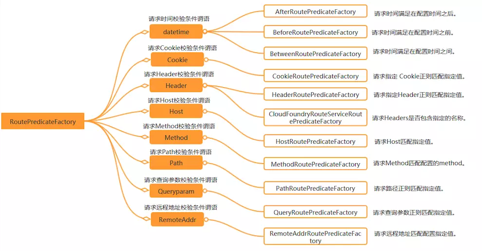

# Spring Cloud Gateway

Spring Cloud Gateway 是 `Spring Cloud Finchley` 版推出来的新组件，用来代替服务网关：Zuul。


Gateway旨在提供一种简单而有效的方式来对API进行路由，以及提供一些强大的过滤器功能， 例如：**熔断、限流、重试等**。


## 与zuul对比

- 开源组织

> Spring Cloud Gateway 是 Spring Cloud 微服务平台的一个子项目，属于 Spring 开源社区，依赖名叫：spring-cloud-starter-gateway。
>
> Zuul 是 Netflix 公司的开源项目，Spring Cloud 在 Netflix 项目中也已经集成了 Zuul，依赖名叫：spring-cloud-starter-netflix-zuul。

- 底层实现

Zuul构建于 Servlet 2.5，兼容 3.x，使用的是阻塞式的 API，不支持长连接，比如 websockets。另外

Spring Cloud Gateway构建于 Spring 5+，基于 Spring Boot 2.x 响应式的、非阻塞式的 API。同时，它支持 websockets，和 Spring 框架紧密集成，开发体验相对来说十分不错。

- 性能表现

Zuul 2.x 在底层上有了很大的改变，使用了异步无阻塞式的 API，性能改善明显，不过现在 Spring Cloud 也没集成 Zuul 2.x，所以就没什么好比的。


## 特性

```properties
1.基于Spring Framework 5, Project Reactor 和 Spring Boot 2.0 进行构建；

2.动态路由：能够匹配任何请求属性；

3.可以对路由指定 Predicate（断言）和 Filter（过滤器）；

4.集成Hystrix的断路器功能；

5.集成 Spring Cloud 服务发现功能；

6.易于编写的 Predicate（断言）和 Filter（过滤器）；

7.请求限流功能；

8.支持路径重写。
```

> Route（路由）：路由是构建网关的基本模块，它由ID，目标URI，一系列的断言和过滤器组成，如果断言为true则匹配该路由；
>
> Predicate（断言）：指的是Java 8 的 Function Predicate。 输入类型是Spring框架中的ServerWebExchange。 这使开发人员可以匹配HTTP请求中的所有内容，例如请求头或请求参数。如果请求与断言相匹配，则进行路由；
>
> Filter（过滤器）：指的是Spring框架中GatewayFilter的实例，使用过滤器，可以在请求被路由前后对请求进行修改。


## 相关概念

- Route（路由）：路由是构建网关的基本模块，它由ID，目标URI，一系列的断言和过滤器组成，如果断言为true则匹配该路由；
- Predicate（断言）：指的是Java 8 的 Function Predicate。 输入类型是Spring框架中的ServerWebExchange。 这使开发人员可以匹配HTTP请求中的所有内容，例如请求头或请求参数。如果请求与断言相匹配，则进行路由；
- Filter（过滤器）：指的是Spring框架中GatewayFilter的实例，使用过滤器，可以在请求被路由前后对请求进行修改。


## 两种不同的配置路由方式

> Gateway 提供了两种不同的方式用于配置路由，一种是通过yml文件来配置，另一种是通过Java Bean来配置，下面我们分别介绍下。


### 使用yml配置

- 在application.yml中进行配置：

```yaml
server:
  port: 9201
service-url:
  user-service: http://localhost:8201
spring:
  cloud:
    gateway:
      routes:
        - id: path_route #路由的ID
          uri: ${service-url.user-service}/user/{id} #匹配后路由地址
          predicates: # 断言，路径相匹配的进行路由
            - Path=/user/{id}
```

### 使用Java Bean配置

- 添加相关配置类，并配置一个RouteLocator对象：

```java
@Configuration
public class GatewayConfig {

    @Bean
    public RouteLocator customRouteLocator(RouteLocatorBuilder builder) {
        return builder.routes()
                .route("path_route2", r -> r.path("/user/getByUsername")
                        .uri("http://localhost:8201/user/getByUsername"))
                .build();
    }
}
```


## Route Predicate 的使用

Spring Cloud Gateway将路由匹配作为Spring WebFlux HandlerMapping基础架构的一部分。

 Spring Cloud Gateway包括许多**内置的Route Predicate工厂**。 所有这些Predicate都与HTTP请求的不同属性匹配。 多个Route Predicate工厂可以进行组合，下面我们来介绍下一些常用的Route Predicate。

> 注意：Predicate中提到的配置都在application-predicate.yml文件中进行修改，并用该配置启动api-gateway服务。




说白了 Predicate 就是为了实现一组匹配规则，方便让请求过来找到对应的 Route 进行处理


### After Route Predicate

在指定时间之后的请求会匹配该路由。

```yaml
spring:
  cloud:
    gateway:
      routes:
        - id: after_route
          uri: ${service-url.user-service}
          predicates:
            - After=2019-09-24T16:30:00+08:00[Asia/Shanghai]
```

### Before Route Predicate

在指定时间之前的请求会匹配该路由。

```yaml
spring:
  cloud:
    gateway:
      routes:
        - id: before_route
          uri: ${service-url.user-service}
          predicates:
            - Before=2019-09-24T16:30:00+08:00[Asia/Shanghai]
```

### Between Route Predicate

在指定时间区间内的请求会匹配该路由。

```yaml
spring:
  cloud:
    gateway:
      routes:
        - id: before_route
          uri: ${service-url.user-service}
          predicates:
            - Between=2019-09-24T16:30:00+08:00[Asia/Shanghai], 2019-09-25T16:30:00+08:00[Asia/Shanghai]
```

### Cookie Route Predicate

带有指定Cookie的请求会匹配该路由。

```yaml
spring:
  cloud:
    gateway:
      routes:
        - id: cookie_route
          uri: ${service-url.user-service}
          predicates:
            - Cookie=username,macro
```

使用curl工具发送带有cookie为`username=macro`的请求可以匹配该路由。

```shell
curl http://localhost:9201/user/1 --cookie "username=macro"
```

### Header Route Predicate

带有指定请求头的请求会匹配该路由。

```yaml
spring:
  cloud:
    gateway:
      routes:
      - id: header_route
        uri: ${service-url.user-service}
        predicates:
        - Header=X-Request-Id, \d+
```

使用curl工具发送带有请求头为`X-Request-Id:123`的请求可以匹配该路由。

```shell
curl http://localhost:9201/user/1 -H "X-Request-Id:123" 
```

### Host Route Predicate

带有指定Host的请求会匹配该路由。

```yaml
spring:
  cloud:
    gateway:
      routes:
        - id: host_route
          uri: ${service-url.user-service}
          predicates:
            - Host=**.macrozheng.com
```

使用curl工具发送带有请求头为`Host:www.macrozheng.com`的请求可以匹配该路由。

```shell
curl http://localhost:9201/user/1 -H "Host:www.macrozheng.com" 
```

### Method Route Predicate

发送指定方法的请求会匹配该路由。

```yaml
spring:
  cloud:
    gateway:
      routes:
      - id: method_route
        uri: ${service-url.user-service}
        predicates:
        - Method=GET
```

使用curl工具发送GET请求可以匹配该路由。

```shell
curl http://localhost:9201/user/1
```

使用curl工具发送POST请求无法匹配该路由。

```shell
curl -X POST http://localhost:9201/user/1
```

### Path Route Predicate

发送指定路径的请求会匹配该路由。

```yaml
spring:
  cloud:
    gateway:
      routes:
        - id: path_route
          uri: ${service-url.user-service}/user/{id}
          predicates:
            - Path=/user/{id}
```

使用curl工具发送`/user/1`路径请求可以匹配该路由。

```shell
curl http://localhost:9201/user/1
```

使用curl工具发送`/abc/1`路径请求无法匹配该路由。

```shell
curl http://localhost:9201/abc/1
```

### Query Route Predicate

带指定查询参数的请求可以匹配该路由。

```yaml
spring:
  cloud:
    gateway:
      routes:
      - id: query_route
        uri: ${service-url.user-service}/user/getByUsername
        predicates:
        - Query=username
```

使用curl工具发送带`username=macro`查询参数的请求可以匹配该路由。

```shell
curl http://localhost:9201/user/getByUsername?username=macro
```

使用curl工具发送带不带查询参数的请求无法匹配该路由。

```shell
curl http://localhost:9201/user/getByUsername
```

### RemoteAddr Route Predicate

从指定远程地址发起的请求可以匹配该路由。

```yaml
spring:
  cloud:
    gateway:
      routes:
      - id: remoteaddr_route
        uri: ${service-url.user-service}
        predicates:
        - RemoteAddr=192.168.1.1/24
```

使用curl工具从192.168.1.1发起请求可以匹配该路由。

```shell
curl http://localhost:9201/user/1
```

### Weight Route Predicate

使用权重来路由相应请求，以下表示有80%的请求会被路由到localhost:8201，20%会被路由到localhost:8202。

```yaml
spring:
  cloud:
    gateway:
      routes:
      - id: weight_high
        uri: http://localhost:8201
        predicates:
        - Weight=group1, 8
      - id: weight_low
        uri: http://localhost:8202
        predicates:
        - Weight=group1, 2
```


## Route Filter 的使用

路由过滤器可用于修改进入的HTTP请求和返回的HTTP响应，路由过滤器只能指定路由进行使用。Spring Cloud Gateway 内置了多种路由过滤器，他们都由GatewayFilter的工厂类来产生，下面我们介绍下常用路由过滤器的用法。


### AddRequestParameter GatewayFilter

给请求添加参数的过滤器。

```yaml
spring:
  cloud:
    gateway:
      routes:
        - id: add_request_parameter_route
          uri: http://localhost:8201
          filters:
            - AddRequestParameter=username, macro
          predicates:
            - Method=GET
```

以上配置会对GET请求添加`username=macro`的请求参数，通过curl工具使用以下命令进行测试。

```http
curl http://localhost:9201/user/getByUsername
```

相当于发起该请求：

```http
curl http://localhost:8201/user/getByUsername?username=macro
```

### StripPrefix GatewayFilter

对指定数量的路径前缀进行去除的过滤器。

```yaml
spring:
  cloud:
    gateway:
      routes:
      - id: strip_prefix_route
        uri: http://localhost:8201
        predicates:
        - Path=/user-service/**
        filters:
        - StripPrefix=2
```

以上配置会把以`/user-service/`开头的请求的路径去除两位，通过curl工具使用以下命令进行测试。

```shell
curl http://localhost:9201/user-service/a/user/1
```

相当于发起该请求：

```shell
curl http://localhost:8201/user/1
```

### PrefixPath GatewayFilter

与StripPrefix过滤器恰好相反，会对原有路径进行增加操作的过滤器。

```yaml
spring:
  cloud:
    gateway:
      routes:
      - id: prefix_path_route
        uri: http://localhost:8201
        predicates:
        - Method=GET
        filters:
        - PrefixPath=/user
```

以上配置会对所有GET请求添加`/user`路径前缀，通过curl工具使用以下命令进行测试。

```shell
curl http://localhost:9201/1
```

相当于发起该请求：

```shell
curl http://localhost:8201/user/1
```

### Hystrix GatewayFilter

Hystrix 过滤器允许你将断路器功能添加到网关路由中，使你的服务免受级联故障的影响，并提供服务降级处理。

- 要开启断路器功能，我们需要在pom.xml中添加Hystrix的相关依赖：

```xml
<dependency>
    <groupId>org.springframework.cloud</groupId>
    <artifactId>spring-cloud-starter-netflix-hystrix</artifactId>
</dependency>
```

- 然后添加相关服务降级的处理类：

```java
@RestController
public class FallbackController {

    @GetMapping("/fallback")
    public Object fallback() {
        Map<String,Object> result = new HashMap<>();
        result.put("data",null);
        result.put("message","Get request fallback!");
        result.put("code",500);
        return result;
    }
}
```

- 在application-filter.yml中添加相关配置，当路由出错时会转发到服务降级处理的控制器上：

```yaml
spring:
  cloud:
    gateway:
      routes:
        - id: hystrix_route
          uri: http://localhost:8201
          predicates:
            - Method=GET
          filters:
            - name: Hystrix
              args:
                name: fallbackcmd
                fallbackUri: forward:/fallback
```

- 关闭user-service，调用该地址进行测试：http://localhost:9201/user/1 ，发现已经返回了服务降级的处理信息。


### RequestRateLimiter GatewayFilter

RequestRateLimiter 过滤器可以用于限流，使用RateLimiter实现来确定是否允许当前请求继续进行，如果请求太大默认会返回HTTP 429-太多请求状态。

- 在pom.xml中添加相关依赖：

```xml
<dependency>
    <groupId>org.springframework.boot</groupId>
    <artifactId>spring-boot-starter-data-redis-reactive</artifactId>
</dependency>
```

- 添加限流策略的配置类，这里有两种策略一种是根据请求参数中的username进行限流，另一种是根据访问IP进行限流；

```java
@Configuration
public class RedisRateLimiterConfig {
    @Bean
    KeyResolver userKeyResolver() {
        return exchange -> Mono.just(exchange.getRequest().getQueryParams().getFirst("username"));
    }

    @Bean
    public KeyResolver ipKeyResolver() {
        return exchange -> Mono.just(exchange.getRequest().getRemoteAddress().getHostName());
    }
}
```

- 我们使用Redis来进行限流，所以需要添加Redis和RequestRateLimiter的配置，这里对所有的GET请求都进行了按IP来限流的操作；

```yaml
server:
  port: 9201
spring:
  redis:
    host: localhost
    password: 123456
    port: 6379
  cloud:
    gateway:
      routes:
        - id: requestratelimiter_route
          uri: http://localhost:8201
          filters:
            - name: RequestRateLimiter
              args:
                redis-rate-limiter.replenishRate: 1 #每秒允许处理的请求数量
                redis-rate-limiter.burstCapacity: 2 #每秒最大处理的请求数量
                key-resolver: "#{@ipKeyResolver}" #限流策略，对应策略的Bean
          predicates:
            - Method=GET
logging:
  level:
    org.springframework.cloud.gateway: debug
```

- 多次请求该地址：http://localhost:9201/user/1 ，会返回状态码为429的错误；


> 令牌桶算法描述：
>  	假如用户配置的平均发送速率为r，则每隔1/r秒一个令牌被加入到桶中
>  	假设桶中最多可以存放b个令牌。如果令牌到达时令牌桶已经满了，那么这个令牌会被丢弃
>  	当流量以速率v进入，从桶中以速率v取令牌，拿到令牌的流量通过，拿不到令牌流量不通过，执行熔断逻辑


### Retry GatewayFilter

对路由请求进行重试的过滤器，可以根据路由请求返回的HTTP状态码来确定是否进行重试。

- 修改配置文件：

```yaml
spring:
  cloud:
    gateway:
      routes:
      - id: retry_route
        uri: http://localhost:8201
        predicates:
        - Method=GET
        filters:
        - name: Retry
          args:
            retries: 1 #需要进行重试的次数
            statuses: BAD_GATEWAY #返回哪个状态码需要进行重试，返回状态码为5XX进行重试
            backoff:
              firstBackoff: 10ms
              maxBackoff: 50ms
              factor: 2
              basedOnPreviousValue: false
```

- 当调用返回500时会进行重试，访问测试地址：http://localhost:9201/user/111
- 可以发现user-service控制台报错2次，说明进行了一次重试。

```
2019-10-27 14:08:53.435 ERROR 2280 --- [nio-8201-exec-2] o.a.c.c.C.[.[.[/].[dispatcherServlet]    : Servlet.service() for servlet [dispatcherServlet] in context with path [] threw exception [Request processing failed; nested exception is java.lang.NullPointerException] with root cause

java.lang.NullPointerException: null
	at com.macro.cloud.controller.UserController.getUser(UserController.java:34) ~[classes/:na]
```


## 结合注册中心使用

使用Zuul作为网关结合注册中心进行使用时，默认情况下Zuul会根据注册中心注册的服务列表，以服务名为路径创建动态路由，Gateway同样也实现了该功能。下面我们演示下Gateway结合注册中心如何使用默认的动态路由和过滤器。


### 使用动态路由

- 在pom.xml中添加相关依赖：

```xml
<dependency>
    <groupId>org.springframework.cloud</groupId>
    <artifactId>spring-cloud-starter-netflix-eureka-client</artifactId>
</dependency>
```

- 添加application-eureka.yml配置文件：

```yaml
server:
  port: 9201
spring:
  application:
    name: api-gateway
    cloud:
    gateway:
      discovery:
        locator:
          # 是否与服务注册于发现组件进行结合，通过 serviceId 转发到具体的服务实例。默认为 false，设为 true 便开启通过服务中心的自动根据 serviceId 创建路由的功能。
          enabled: true
          # 如果需要小写serviceId,则配置 lower-case-service-id: true
          # 注意: 不管小写大写,不能使用下划线,否则会报
          lower-case-service-id: true
#      routes:
#        - id: eureka-pri
#          uri: lb://eureka-pri

eureka:
  client:
    service-url:
      defaultZone: http://localhost:8001/eureka/
logging:
  level:
    org.springframework.cloud.gateway: debug
```

- 使用application-eureka.yml配置文件启动api-gateway服务，访问http://localhost:9201/user-service/user/1 ，可以路由到user-service的http://localhost:8201/user/1 处。

> 通过网关访问具体服务的格式：`http://网关IP:网关端口号/serviceId/**`

### 使用过滤器

> 在结合注册中心使用过滤器的时候，我们需要注意的是uri的协议为`lb`，这样才能启用Gateway的负载均衡功能。

- 修改application-eureka.yml文件，使用了PrefixPath过滤器，会为所有GET请求路径添加`/user`路径并路由；

```yaml
server:
  port: 9201
spring:
  application:
    name: api-gateway
  cloud:
    gateway:
      routes:
        - id: prefixpath_route
        # lb代表从注册中心获取服务,后面接的就是你需要转发到的服务名称(eureka中的服务名)
          uri: lb://user-service #此处需要使用lb协议
          predicates:
            - Method=GET
          filters:
            - PrefixPath=/user
      discovery:
        locator:
          enabled: true
eureka:
  client:
    service-url: 
      defaultZone: http://localhost:8001/eureka/
logging:
  level:
    org.springframework.cloud.gateway: debug
```

- 使用application-eureka.yml配置文件启动api-gateway服务，访问http://localhost:9201/1 ，可以路由到user-service的http://localhost:8201/user/1 处。


## 熔断/限流


## 跨域

在 Spring Cloud Gateway 中配置跨域有两种方式，分别是代码配置方式和配置文件方式。


```java
@Configuration
public class CorsConfig {

    @Bean
    public WebFilter corsFilter() {
        return (ServerWebExchange ctx, WebFilterChain chain) -> {
            ServerHttpRequest request = ctx.getRequest();
            if (CorsUtils.isCorsRequest(request)) {
                HttpHeaders requestHeaders = request.getHeaders();
                ServerHttpResponse response = ctx.getResponse();
                HttpMethod requestMethod = requestHeaders.getAccessControlRequestMethod();
                HttpHeaders headers = response.getHeaders();
                headers.add(HttpHeaders.ACCESS_CONTROL_ALLOW_ORIGIN, requestHeaders.getOrigin());
                headers.addAll(HttpHeaders.ACCESS_CONTROL_ALLOW_HEADERS,
                        requestHeaders.getAccessControlRequestHeaders());
                if (requestMethod != null) {
                    headers.add(HttpHeaders.ACCESS_CONTROL_ALLOW_METHODS, requestMethod.name());
                }

                headers.add(HttpHeaders.ACCESS_CONTROL_ALLOW_CREDENTIALS, "true");
                headers.add(HttpHeaders.ACCESS_CONTROL_EXPOSE_HEADERS, "*");
                if (request.getMethod() == HttpMethod.OPTIONS) {
                    response.setStatusCode(HttpStatus.OK);
                    return Mono.empty();
                }
            }
            return chain.filter(ctx);
        };
    }
}
```


```yaml
spring:
  cloud:
    gateway:
      globalcors:
        corsConfigurations:
          '[/**]':
            allowedOrigins: "*"
            exposedHeaders:
              - content-type
            allowedHeaders:
              - content-type
            allowCredentials: true
              allowedMethods:
              - GET
              - OPTIONS
              - PUT
              - DELETE
              - POST
```


## 统一异常处理

Spring Cloud Gateway 中的全局异常处理不能直接使用 `@ControllerAdvice`，可以通过跟踪异常信息的抛出，找到对应的源码，自定义一些处理逻辑来匹配业务的需求。

网关是给接口做代理转发的，后端对应的是 REST API，返回数据格式是 JSON。如果不做处理，当发生异常时，Gateway 默认给出的错误信息是页面，不方便前端进行异常处理。

所以我们需要对异常信息进行处理，并返回 JSON 格式的数据给客户端。


## 重试机制

RetryGatewayFilter 是 Spring Cloud Gateway 对请求重试提供的一个 GatewayFilter Factory


```yaml
spring:
  cloud:
    gateway:
      routes:
        - id: zuul-encrypt-service
  uri: lb://zuul-encrypt-service
  predicates:
    - Path=/data/**
  filters:
    - name: Retry
  args:
  	# 重试次数，默认值是 3 次
    retries: 3
    # 状态码配置（分段），符合某段状态码才会进行重试逻辑，默认值是 SERVER_ERROR，值是 5，也就是 5XX（5 开头的状态码），共有 5 个值
    series: SERVER_ERROR
```

```java
public enum Series {
    INFORMATIONAL(1), SUCCESSFUL(2), REDIRECTION(3), CLIENT_ERROR(4), SERVER_ERROR(5);
}
```

上述代码中具体参数含义如下所示。

- statuses：状态码配置，和 series 不同的是这里是具体状态码的配置，取值请参考 org.springframework.http.HttpStatus。
- methods：指定哪些方法的请求需要进行重试逻辑，默认值是 GET 方法，取值代码如下所示。

```java
public enum HttpMethod {
  GET, HEAD, POST, PUT, PATCH, DELETE, OPTIONS, TRACE;
}
```

上述代码中具体参数含义如下所示。 exceptions：指定哪些异常需要进行重试逻辑。默认值是 java.io.IOException 和 org.springframework.cloud.gateway.support.TimeoutException。


## 负载均衡