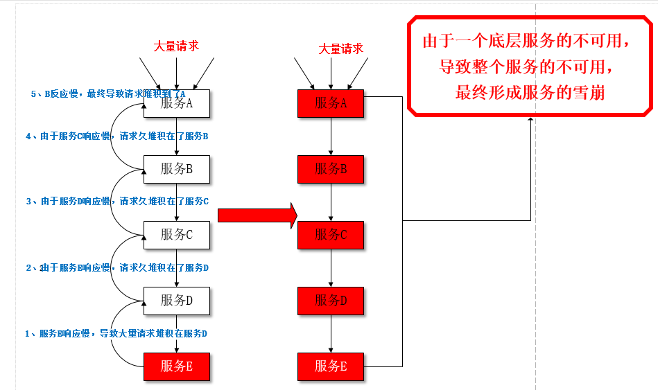
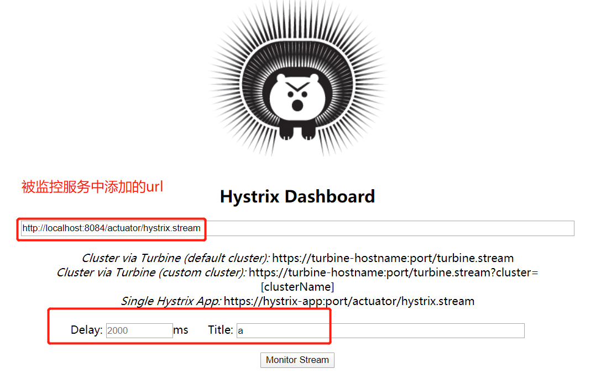
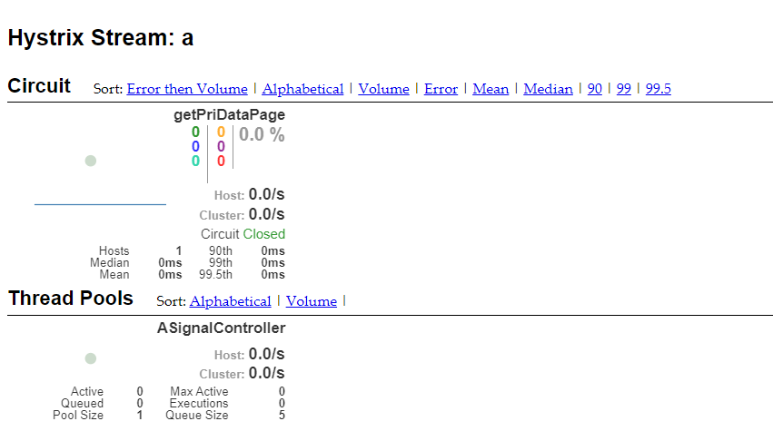
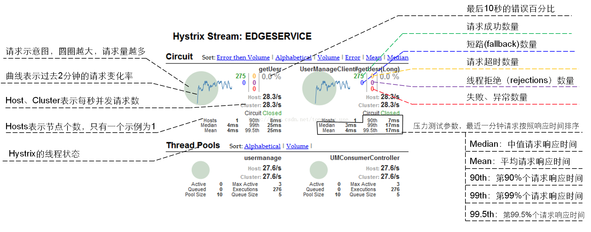
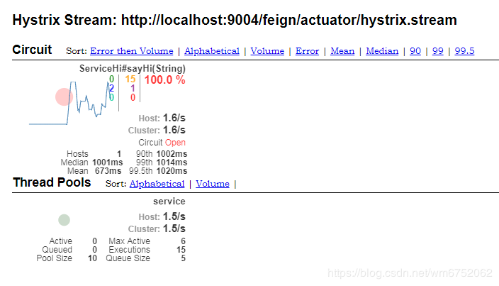
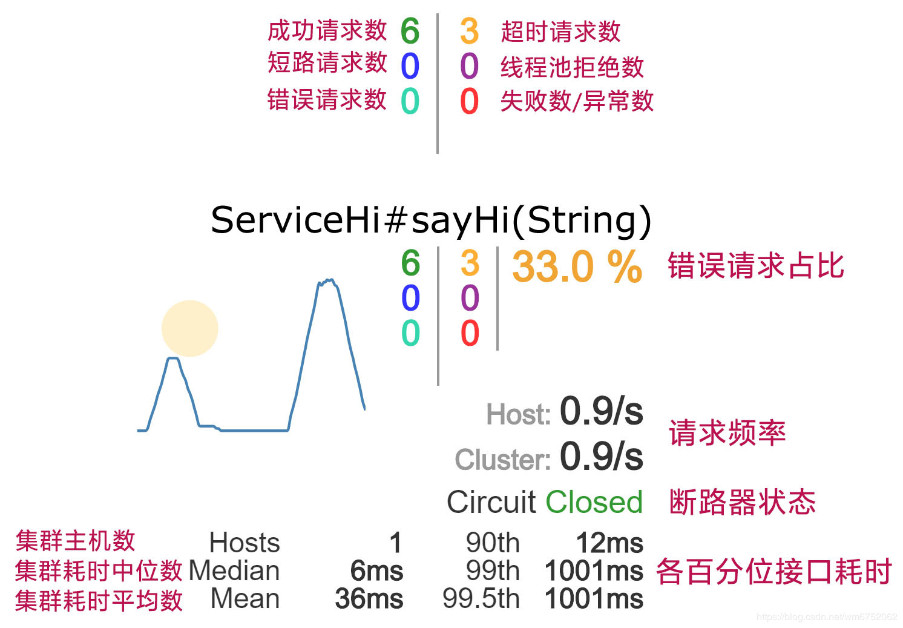

# 引言

## 服务雪崩

在微服务架构中通常会有多个服务层调用，基础服务的故障可能会导致级联故障，进而造成整个系统不可用的情况，这种现象被称为**服务雪崩**效应。服务雪崩效应是一种因“服务提供者”的不可用导致“服务消费者”的不可用,并将不可用逐渐放大的过程。





## 熔断器（CircuitBreaker）

**为了解决以上问题**,spring cloud中为我们提供了 **hystrix** 断路器来保护我们的应用程序。


### 断路器机制

> `hystrix`存在三种状态：`CLOSED`、`OPEN`和`HALF_OPEN`。

默认情况下为`CLOSED`；

当一个服务在一定的时间内(`metrics.rollingStats.timeInMilliseconds`默认<font color=#dd0000>10s</font>)，

请求次数达到了某个阀值(`circuitBreaker.requestVolumeThreshold`默认<font color=#dd0000>20次</font>)，

并且错误率也达到了某个阀值(`circuitBreaker.errorThresholdPercentage`默认><font color=#dd0000>50%</font>)，

此时断路器变成了`OPEN`的状态；

当断路器打开，过了一定的时(`circuitBreaker.sleepWindowInMilliseconds`默认为<font color=#dd0000>5s</font>)将会放行一个请求，此时变成`HALF_OPEN`状态，如果可以访问就变成`CLOSED`，否则变成`OPEN`状态


### 资源隔离

`hystrix`为每个依赖都提供了一个线程池或信号量。当线程池满了之后，发往该依赖的请求会被直接拒绝，从而加速失败。


# 注意点

1. 进入`fallback`方法并不意味着断路器一定是打开的，请求失败、超时、被拒绝以及断路器打开时都会执行回退逻辑。

2. 被`@HystrixCommand`修饰的方法错误累积到一定门槛的时候，就会启动断路器，后续所有调用该方法的请求都会失败，而会临时调用`fallbackMethod`指定的方法，然后当服务恢复正常时，断路器就会关闭。

3. 在feign中也可以使用hystrix 

   ```java
   @FeignClient(name="service-pri-server",fallback=UserFeignClientFallBack.class)
   ```

4. 可以使用回调工厂检查原因

   > 改变不是太大，在接口的地方回调的是一个工厂类

```java
import org.springframework.stereotype.Component;
import feign.hystrix.FallbackFactory;

@Component
public class UserFeignClientFactory implements FallbackFactory<UserFeignClient> {

    @Override
    public UserFeignClient create(Throwable cause) {
        return new UserFeignClient(){
            @Override
            public User findById(Integer id) {

                // cause就是调用失败的原因, 因此此处可以看到该原因
                //这里打印输出错误
                System.out.println(cause);

                User user=new User();
                user.setId(0);
                user.setName("NULL");
                user.setNickName("默认用户-Factory");
                user.setPassword("");
                user.setLastLoginDt(null);
                return user;
            }
        };
    }
}
```

```yaml
feign.hystrix.enabled: true
```


# 作用

- 资源隔离（线程隔离、信号量隔离）：主要是限制调用分布式服务的资源，避免个别服务出现问题时对其他服务产生影响
- 熔断（容错）：当失败率达到一定阈值时，熔断器触发快速失败
- 降级回退（超时降级、熔断降级）：触发降级时可以使用回调方法返回托底数据
- 自我修复
- 实时监控、报警


# 配置

## HystrixCommand 属性

这类属性是控制 HystrixCommand 行为。

## Execution(执行)

这些属性是控制 HystrixCommand.run()的执行。

1. hystrix.command.default.execution.isolation.strategy

   用于设置 HystrixCommand.run() 执行所采用的隔离策略，有两种选择：

   - THREAD：默认值，线程隔离，在单独的线程上执行，并发请求受线程池中线程数的控制。
   - SEMAPHORE：信号量隔离，在调用线程上执行，并发请求受信号量计数器的限制。

   ```java
   // to use thread isolation
   HystrixCommandProperties.Setter()
      .withExecutionIsolationStrategy(ExecutionIsolationStrategy.THREAD)
   // to use semaphore isolation
   HystrixCommandProperties.Setter()
      .withExecutionIsolationStrategy(ExecutionIsolationStrategy.SEMAPHORE)
   ```

2. hystrix.command.default.execution.isolation.thread.timeoutInMilliseconds

   用于设置 HystrixCommand 执行的超时时长，超时后执行回退逻辑。单位：毫秒，默认值：1000。

   ```java
   HystrixCommandProperties.Setter()
       .withExecutionTimeoutInMilliseconds(int value)
   ```

3. hystrix.command.default.execution.timeout.enabled

   用于设置 HystrixCommand.run() 超时(hystrix.command.default.execution.isolation.thread.timeoutInMilliseconds)是否启用，默认值：true；如果设置为 false，则 hystrix.command.default.execution.isolation.thread.timeoutInMilliseconds 也失效。

   ```java
   HystrixCommandProperties.Setter()
       .withExecutionTimeoutEnabled(boolean value)
   ```

4. hystrix.command.default.execution.isolation.thread.interruptOnTimeout

   用于设置 HystrixCommand 执行超时后是否中断 HystrixCommand.run() 的执行，默认值：true。

   ```java
   HystrixCommandProperties.Setter()
       .withExecutionIsolationThreadInterruptOnTimeout(boolean value)
   ```

5. hystrix.command.default.execution.isolation.thread.interruptOnCancel

   用于设置 HystrixCommand 执行被取消时，是否中断 HystrixCommand.run() 执行。默认值：false。

   ```java
   HystrixCommandProperties.Setter()
       .withExecutionIsolationThreadInterruptOnCancel(boolean value)
   ```

6. hystrix.command.default.execution.isolation.semaphore.maxConcurrentRequests

   用于设置当使用信号量(SEMAPHORE)策略时 HystrixCommand.run() 充许最大的请求数(并发)。默认值为：10。

   ```java
   HystrixCommandProperties.Setter()
      .withExecutionIsolationSemaphoreMaxConcurrentRequests(int value)
   ```

## Fallback(回退)

这些属性控制 HystrixCommand.getFallback()的执行。这些属性对 **THREAD** 和 **SEMAPHORE** 隔离级别都适用。

1. hystrix.command.default.fallback.isolation.semaphore.maxConcurrentRequests

   此属性设置允许 HystrixCommand.getFallback（）方法从调用线程发出的最大请求数。

   如果达到最大并发限制，则随后的请求将被拒绝，并引发异常，因为无法检索到 fallback ，fallback 不会被调用。默认值：10。

   ```java
   HystrixCommandProperties.Setter()
      .withFallbackIsolationSemaphoreMaxConcurrentRequests(int value)
   ```

2. hystrix.command.default.fallback.enabled

   此属性确定在发生故障或拒绝时是否将尝试调用 HystrixCommand.getFallback()。SEMAPHORE模式有效。默认值：true。

   ```java
   HystrixCommandProperties.Setter()
      .withFallbackEnabled(boolean value)
   ```

## Circuit Breaker(熔断器)

以下熔断器属性用于控制 HystrixCircuitBreaker的行为。

1. hystrix.command.default.circuitBreaker.enabled

   此属性确定断路器是否用于跟踪运行状况，以及在其断开时是否用于短路请求。默认值：true。

   ```java
   HystrixCommandProperties.Setter()
      .withCircuitBreakerEnabled(boolean value)
   ```

2. hystrix.command.default.circuitBreaker.requestVolumeThreshold

   此属性设置在一个窗口期内触发熔断的最的最小请求数。默认值：20。

   例如：如果值为 20，那么如果在窗口期内仅接收到19个请求（比如10秒的窗口期），即使全部19个失败，也不是触发熔断器断开。

   ```java
   HystrixCommandProperties.Setter()
      .withCircuitBreakerRequestVolumeThreshold(int value)
   ```

3. hystrix.command.default.circuitBreaker.sleepWindowInMilliseconds

   此属性设置触发熔断器后拒绝请求的时长；达到时长后关闭 circuit 。单位：毫秒，默认值：5000。

   ```java
   HystrixCommandProperties.Setter()
      .withCircuitBreakerSleepWindowInMilliseconds(int value)
   ```

4. hystrix.command.default.circuitBreaker.errorThresholdPercentage

   此属性设置错误率阀值(百分比)，大于该值，熔断器断开并启动对回退逻辑的短路请求(执行 fallback )。

   ```java
   HystrixCommandProperties.Setter()
      .withCircuitBreakerErrorThresholdPercentage(int value)
   ```

5. hystrix.command.default.circuitBreaker.forceOpen

   此属性设置熔断器是否强制打开，如果设置为 true，则拒绝所有请求。默认值：false。

   ```java
   HystrixCommandProperties.Setter()
      .withCircuitBreakerForceOpen(boolean value)
   ```

6. hystrix.command.default.circuitBreaker.forceClosed

   此属性设置熔断器是否强制关闭，如果设置为 true，则不管错误率的阀值，将允许所有请求。

   circuitBreaker.forceClosed 属性优化，如果为 true，则不做任何操作。

   ```java
   HystrixCommandProperties.Setter()
      .withCircuitBreakerForceClosed(boolean value)
   ```

## Metrics(指标)

以下属性与从 HystrixCommand 和 HystrixObservableCommand 执行中捕获的指标有关。

1. hystrix.command.default.metrics.rollingStats.timeInMilliseconds

   此属性设置统计的时间窗口时长，这是Hystrix 为断路器使用和发布指标的时间(窗口期)。单位：毫秒，默认值：10000。

   一个窗口期会被分成多个 bucket，每个 bucket 都有 Success、Failure、Timeout、Rejection 指标。

   ```java
   HystrixCommandProperties.Setter()
      .withMetricsRollingStatisticalWindowInMilliseconds(int value)
   ```

2. hystrix.command.default.metrics.rollingStats.numBuckets

   设置一个统计窗口期内被划分为 bucket 的数量。若窗口时长(timeInMilliseconds)= 10 000 毫秒 ，numBuckets= 10，那么一个 bucket 的时间为 1 秒。必须符合 metrics.rollingStats.timeInMilliseconds % metrics.rollingStats.numBuckets == 0，否则会报错。默认值：10。

   ```java
   HystrixCommandProperties.Setter()
      .withMetricsRollingStatisticalWindowBuckets(int value)
   ```

3. hystrix.command.default.metrics.rollingPercentile.enabled

   此属性设置是否开启指标百分比的计算和跟踪，默认值：true。

   ```java
   HystrixCommandProperties.Setter()
      .withMetricsRollingPercentileEnabled(boolean value)
   ```

4. hystrix.command.default.metrics.rollingPercentile.timeInMilliseconds

   此属性设置计算百分比的窗口时长，默认值：60000。

   ```java
   HystrixCommandProperties.Setter()
      .withMetricsRollingPercentileWindowInMilliseconds(int value)
   ```

5. hystrix.command.default.metrics.rollingPercentile.numBuckets

   此属性设置 rollingPercentile 窗口时长被划分为 bucket 的数量。默认值：6。

   注意：必须满足 metrics.rollingPercentile.timeInMillisecond % metrics.rollingPercentile.numBuckets == 0，否则报异常。

   ```java
   HystrixCommandProperties.Setter()
      .withMetricsRollingPercentileWindowBuckets(int value)
   ```

6. hystrix.command.default.metrics.rollingPercentile.bucketSize

   此属性设置每个 bucket 保留的最大执行次数。 默认值：100。
   例如，如果 bucketSize = 100，一个 bucket 窗口期为 10秒，在此期间发生了 500 次收集指标，则只记录 10 秒期间内最近的 100 次的指标。

   如果增加此值，还将增加存储值所需的内存量，并增加排序列表进行百分位数计算所需的时间。

   ```java
   HystrixCommandProperties.Setter()
      .withMetricsRollingPercentileBucketSize(int value)
   ```

7. hystrix.command.default.metrics.healthSnapshot.intervalInMilliseconds

   此属性设置执行计算成功和错误百分比的健康快照时影响断路器状态的时长，单位：毫秒，默认值：500。

   ```java
   HystrixCommandProperties.Setter()
      .withMetricsHealthSnapshotIntervalInMilliseconds(int value)
   ```

## Request Context(请求上下文)

这些属性涉及 HystrixCommand 使用 HystrixRequestContext的使用。

1. hystrix.command.default.requestCache.enabled

   此属性指示是否将 hystrixcommand.getcachekey() 与 HystrixRequestCache 一起使用，来开启请求缓存功能。默认值：true。

   ```java
   HystrixCommandProperties.Setter()
      .withRequestCacheEnabled(boolean value)
   ```

2. hystrix.command.default.requestLog.enabled

   此属性设置是否开启将 HystrixCommand 执行和事件记录日志(HystrixRequestLog)，默认值：true。

   ```java
   HystrixCommandProperties.Setter()
      .withRequestLogEnabled(boolean value)
   ```

## Collapser(批处理)

该属性用于控制 HystrixCollapser行为。

1. Hystrix.collapser.default.maxRequestsInBatch

   此属性设置在触发批处理执行之前允许的最大批处理请求数。默认值：Integer.MAX_VALUE。

   ```java
   HystrixCollapserProperties.Setter()
      .withMaxRequestsInBatch(int value)
   ```

2. hystrix.collapser.default.timerDelayInMilliseconds

   此属性设置创建批处理后触发执行的毫秒数(执行延迟时长)。单位：毫秒，默认值：10。

   ```java
   HystrixCollapserProperties.Setter()
      .withTimerDelayInMilliseconds(int value)
   ```

3. hystrix.collapser.default.requestCache.enabled

   此属性指示是否为 HystrixCollapser.execute() 和 HystrixCollapser.queue() 调用启用请求缓存。默认值：true

   ```java
   HystrixCollapserProperties.Setter()
      .withRequestCacheEnabled(boolean value)
   ```

## ThreadPool (线程池)

以下属性控制 Hystrix Commands 执行线程池的行为。
大多数情况下，默认值是 10 个线程是较好的(通过可以减小)。

要确定是否需要更大，计算线程池大小的基本公式是：

1. hystrix.threadpool.default.coreSize

   设置线程池核心大小，默认值：10。

   ```java
   HystrixThreadPoolProperties.Setter()
      .withCoreSize(int value)
   ```

2. hystrix.threadpool.default.maximumSize

   设置线程池最大值，在不开始拒绝 HystrixCommands 的情况下支持的最大并发数。默认值：10。

   ```java
   HystrixThreadPoolProperties.Setter()
      .withMaximumSize(int value)
   ```

3. hystrix.threadpool.default.maxQueueSize

   设置实现 BlockingQueue 的队列最大值。默认值：-1。

   如果设置为 -1，则使用 SynchronousQueue；否则其它正数值，则使用LinkedBlockingQueue。

   ```java
   HystrixThreadPoolProperties.Setter()
      .withMaxQueueSize(int value)
   ```

   如果想覆盖此限制并允许动配修改此队列大小，参数 queueSizeRejectionThreshold 属性。

4. hystrix.threadpool.default.queueSizeRejectionThreshold

   此属性设置队列拒绝阈值，即使未达到 MaxQueueSize，也会发生拒绝的最大队列。默认值：5。

   此属性的存在是因为无法动态更改 BlockingQueue的 MaxQueueSize。

   当线程排队等待执行时，HystrixCommand 将使用属性。当 maxQueueSize == -1 时不适用。

   ```java
   HystrixThreadPoolProperties.Setter()
      .withQueueSizeRejectionThreshold(int value)
   ```

5. hystrix.threadpool.default.keepAliveTimeMinutes

   此属性设置 keep-alive 的时间，单位：分种，默认值：1。

   如果 coreSize < maximumSize，则此属性控制线程在释放之前空闲时长。

   ```java
   HystrixThreadPoolProperties.Setter()
      .withKeepAliveTimeMinutes(int value)
   ```

6. hystrix.threadpool.default.allowMaximumSizeToDivergeFromCoreSize

   此属性允许 maximumSize 的配置生效。maximumSize 值可以等于或大于 coreSize。默认值：false。

   当 coreSize < maximumSize 时会创建一个可以维持 maximumSize 并发性的线程池，但会在相对不活动期间将线程返回到系统。(以 KeepaliveTimeinMinutes 为准)

   ```java
   HystrixThreadPoolProperties.Setter()
      .withAllowMaximumSizeToDivergeFromCoreSize(boolean value)
   ```

7. hystrix.threadpool.default.metrics.rollingStats.timeInMilliseconds

   此属性设置线程池统计窗口期的时长，即为线程池保留指标的时长。单分：毫秒，默认值：10000。

   ```java
   HystrixThreadPoolProperties.Setter()
      .withMetricsRollingStatisticalWindowInMilliseconds(int value)
   ```

8. hystrix.threadpool.default.metrics.rollingStats.numBuckets

   此属性设置线程指标统计窗口期划分的 bucket 数。


# Command Properties

以下属性控制HystrixCommand行为：

## Execution

以下属性控制HystrixCommand.run()如何执行。

| **参数**                                            | **描述**                                                     | **默认值**                                                   |
| --------------------------------------------------- | ------------------------------------------------------------ | ------------------------------------------------------------ |
| execution.isolation.strategy                        | 隔离策略，有THREAD和SEMAPHORETHREAD - 它在单独的线程上执行，并发请求受线程池中的线程数量的限制 SEMAPHORE - 它在调用线程上执行，并发请求受到信号量计数的限制 | 默认使用THREAD模式，以下几种场景可以使用SEMAPHORE模式：只想控制并发度外部的方法已经做了线程隔离调用的是本地方法或者可靠度非常高、耗时特别小的方法（如medis） |
| execution.isolation.thread.timeoutInMilliseconds    | 超时时间                                                     | 默认值：1000在THREAD模式下，达到超时时间，可以中断在SEMAPHORE模式下，会等待执行完成后，再去判断是否超时设置标准：有retry，99meantime+avg meantime没有retry，99.5meantime |
| execution.timeout.enabled                           | HystrixCommand.run（）执行是否应该有超时。                   | 默认值：true                                                 |
| execution.isolation.thread.interruptOnTimeout       | 在发生超时时是否应中断HystrixCommand.run（）执行。           | 默认值：trueTHREAD模式有效                                   |
| execution.isolation.thread.interruptOnCancel        | 当发生取消时，执行是否应该中断。                             | 默认值为falseTHREAD模式有效                                  |
| execution.isolation.semaphore.maxConcurrentRequests | 设置在使用时允许到HystrixCommand.run（）方法的最大请求数。   | 默认值：10SEMAPHORE模式有效                                  |

## Fallback

以下属性控制HystrixCommand.getFallback()如何执行。这些属性适用于ExecutionIsolationStrategy.THREAD和ExecutionIsolationStrategy.SEMAPHORE。

| **参数**                                           | **描述**                                                     | **默认值**                  |
| -------------------------------------------------- | ------------------------------------------------------------ | --------------------------- |
| fallback.isolation.semaphore.maxConcurrentRequests | 设置从调用线程允许HystrixCommand.getFallback（）方法的最大请求数。 | SEMAPHORE模式有效默认值：10 |
| fallback.enabled                                   | 确定在发生失败或拒绝时是否尝试调用HystrixCommand.getFallback（）。 | 默认值为true                |

## Circuit Breaker

断路器属性控制HystrixCircuitBreaker的行为。

| **参数**                                 | **描述**                                                     | **默认值**                                                   |
| ---------------------------------------- | ------------------------------------------------------------ | ------------------------------------------------------------ |
| circuitBreaker.enabled                   | 确定断路器是否用于跟踪运行状况和短路请求（如果跳闸）。       | 默认值为true                                                 |
| circuitBreaker.requestVolumeThreshold    | 熔断触发的最小个数/10s                                       | 默认值：20                                                   |
| circuitBreaker.sleepWindowInMilliseconds | 熔断多少秒后去尝试请求                                       | 默认值：5000                                                 |
| circuitBreaker.errorThresholdPercentage  | 失败率达到多少百分比后熔断                                   | 默认值：50主要根据依赖重要性进行调整                         |
| circuitBreaker.forceOpen                 | 属性如果为真，强制断路器进入打开（跳闸）状态，其中它将拒绝所有请求。 | 默认值为false此属性优先于circuitBreaker.forceClosed          |
| circuitBreaker.forceClosed               | 该属性如果为真，则迫使断路器进入闭合状态，其中它将允许请求，而不考虑误差百分比。 | 默认值为false如果是强依赖，应该设置为truecircuitBreaker.forceOpen属性优先，因此如果forceOpen设置为true，此属性不执行任何操作。 |

## Metrics

以下属性与从HystrixCommand和HystrixObservableCommand执行捕获指标有关。

| **参数**                                      | **描述**                                                     | **默认值**    |
| --------------------------------------------- | ------------------------------------------------------------ | ------------- |
| metrics.rollingStats.timeInMilliseconds       | 此属性设置统计滚动窗口的持续时间（以毫秒为单位）。对于断路器的使用和发布Hystrix保持多长时间的指标。 | 默认值：10000 |
| metrics.rollingStats.numBuckets               | 此属性设置rollingstatistical窗口划分的桶数。以下必须为true - “metrics.rollingStats.timeInMilliseconds%metrics.rollingStats.numBuckets == 0” -否则将抛出异常。 | 默认值：10    |
| metrics.rollingPercentile.enabled             | 此属性指示是否应以百分位数跟踪和计算执行延迟。 如果禁用它们，则所有摘要统计信息（平均值，百分位数）都将返回-1。 | 默认值为true  |
| metrics.rollingPercentile.timeInMilliseconds  | 此属性设置滚动窗口的持续时间，其中保留执行时间以允许百分位数计算，以毫秒为单位。 | 默认值：60000 |
| metrics.rollingPercentile.numBuckets          | 此属性设置rollingPercentile窗口将划分的桶的数量。以下内容必须为true - “metrics.rollingPercentile.timeInMilliseconds%metrics.rollingPercentile.numBuckets == 0” -否则将抛出异常。 | 默认值：6     |
| metrics.rollingPercentile.bucketSize          | 此属性设置每个存储桶保留的最大执行次数。如果在这段时间内发生更多的执行，它们将绕回并开始在桶的开始处重写。 | 默认值：100   |
| metrics.healthSnapshot.intervalInMilliseconds | 此属性设置在允许计算成功和错误百分比并影响断路器状态的健康快照之间等待的时间（以毫秒为单位）。 | 默认值：500   |

## Request Context

这些属性涉及HystrixCommand使用的HystrixRequestContext功能。

| **参数**             | **描述**                                                     | **默认值**   |
| -------------------- | ------------------------------------------------------------ | ------------ |
| requestCache.enabled | HystrixCommand.getCacheKey（）是否应与HystrixRequestCache一起使用，以通过请求范围的缓存提供重复数据删除功能。 | 默认值为true |
| requestLog.enabled   | HystrixCommand执行和事件是否应记录到HystrixRequestLog。      | 默认值为true |

# Collapser Properties

下列属性控制HystrixCollapser行为。

| **参数**                 | **描述**                                                     | **默认值**        |
| ------------------------ | ------------------------------------------------------------ | ----------------- |
| maxRequestsInBatch       | 此属性设置在触发批处理执行之前批处理中允许的最大请求数。     | Integer.MAX_VALUE |
| timerDelayInMilliseconds | 此属性设置创建批处理后触发其执行的毫秒数。                   | 默认值：10        |
| requestCache.enabled     | 此属性指示是否为HystrixCollapser.execute（）和HystrixCollapser.queue（）调用启用请求高速缓存。 | 默认值：true      |

ThreadPool Properties

以下属性控制Hystrix命令在其上执行的线程池的行为。

大多数时候，默认值为10的线程会很好（通常可以做得更小）。

| **参数**                                | **描述**                                                     | **默认值**                                                   |
| --------------------------------------- | ------------------------------------------------------------ | ------------------------------------------------------------ |
| coreSize                                | 线程池coreSize                                               | 默认值：10设置标准：qps*99meantime+breathing room            |
| maximumSize                             | 此属性设置最大线程池大小。 这是在不开始拒绝HystrixCommands的情况下可以支持的最大并发数。 请注意，此设置仅在您还设置allowMaximumSizeToDivergeFromCoreSize时才会生效。 | 默认值：10                                                   |
| maxQueueSize                            | 请求等待队列                                                 | 默认值：-1如果使用正数，队列将从SynchronizeQueue改为LinkedBlockingQueue |
| queueSizeRejectionThreshold             | 此属性设置队列大小拒绝阈值 - 即使未达到maxQueueSize也将发生拒绝的人为最大队列大小。 此属性存在，因为BlockingQueue的maxQueueSize不能动态更改，我们希望允许您动态更改影响拒绝的队列大小。 | 默认值：5注意：如果maxQueueSize == -1，则此属性不适用。      |
| keepAliveTimeMinutes                    | 此属性设置保持活动时间，以分钟为单位。                       | 默认值：1                                                    |
| allowMaximumSizeToDivergeFromCoreSize   | 此属性允许maximumSize的配置生效。 那么该值可以等于或高于coreSize。 设置coreSize <maximumSize会创建一个线程池，该线程池可以支持maximumSize并发，但在相对不活动期间将向系统返回线程。 （以keepAliveTimeInMinutes为准） | 默认值：false                                                |
| metrics.rollingStats.timeInMilliseconds | 此属性设置statistical rolling窗口的持续时间（以毫秒为单位）。 这是为线程池保留多长时间。 | 默认值：10000                                                |
| metrics.rollingStats.numBuckets         | 此属性设置滚动统计窗口划分的桶数。 注意：以下必须为true - “metrics.rollingStats.timeInMilliseconds%metrics.rollingStats.numBuckets == 0” -否则将引发异常。 | 默认值：10                                                   |

# 其他

| **参数**   | **描述**                             | **默认值**                          |
| ---------- | ------------------------------------ | ----------------------------------- |
| groupKey   | 表示所属的group，一个group共用线程池 | 默认值：getClass().getSimpleName(); |
| commandKey |                                      | 默认值：当前执行方法名              |


# Hystrix Dashboard

1.新建一个服务模块，`service-a`，提供`controller`功能（注意，需要在服务的`controller`层提供`@HystrixCommand`注解）

```java
@HystrixCommand(fallbackMethod = "myFallback")
```

2.创建一个模块，`cloud-hystrix-dashboard`

## 引入依赖

```xml
<dependency>
    <groupId>org.springframework.cloud</groupId>
    <artifactId>spring-cloud-starter-hystrix</artifactId>
</dependency>
<dependency>
    <groupId>org.springframework.cloud</groupId>
    <artifactId>spring-cloud-starter-netflix-hystrix-dashboard</artifactId>
</dependency>
<dependency>
    <groupId>org.springframework.boot</groupId>
    <artifactId>spring-boot-starter-actuator</artifactId>
</dependency>
```

## 开启注解

在启动类上加上 `@EnableHystrixDashboard` 注解，开启Hystrix Dashboard功能。

```java
import org.springframework.boot.SpringApplication;
import org.springframework.boot.autoconfigure.SpringBootApplication;
import org.springframework.cloud.netflix.hystrix.dashboard.EnableHystrixDashboard;

@SpringBootApplication
@EnableHystrixDashboard
public class ServiceHystrixDashboardApplication {

    public static void main(String[] args) {
        SpringApplication.run(ServiceHystrixDashboardApplication.class, args);
    }
}
```

## 修改配置文件

修改application.properties文件:

```properties
spring.application.name=service-hystrix-dashboard
server.port=5566
```

## 测试

启动`cloud-hystrix-dashboard`，在浏览器访问： http://localhost:5566/hystrix

## Hystrix Dashboard访问规则

Hystrix Dashboard共支持三种不同的监控方式

默认的集群监控：通过URL:http://turbine-hostname:port/turbine.stream开启，实现对默认集群的监控。

指定的集群监控：通过URL:http://turbine-hostname:port/turbine.stream?cluster=[clusterName]开启，实现对clusterName集群的监控。

单体应用的监控：通过URL:http://hystrix-app:port/hystrix.stream开启，实现对具体某个服务实例的监控。

> Delay：控制服务器上轮询监控信息的延迟时间，默认为2000毫秒，可以通过配置该属性来降低客户端的网络和CPU消耗。
>
> Title:该参数可以展示合适的标题。

## 将服务纳入监控

以`service-a`为例，在其上面进行改造。

- 首先我们启动 `eureka-service`注册中心

- 然后操作`service-a`实例：

  - 添加以上3个依赖 启动类加上

  - 在启动类添加注解 `@EnableCircuitBreaker` 开启断路器功能

  - 在启动类注入`Servlet bean`， springboot 版本如果是2.0，则需要添加 `ServletRegistrationBean` 因为`springboot`的默认路径不是 `"/hystrix.stream"`，只要在自己的项目里配置上下面的servlet就可以了：

    ```java
    @SpringBootApplication
    @EnableEurekaClient
    @EnableHystrix
    @EnableCircuitBreaker // 断路器开启
    public class ServiceHystrixApplication {
    
        @Autowired
        HystrixService hystrixService;
    
        @Bean
        @LoadBalanced  // 基于Ribbon+RestTemplate实现负载均衡
        RestTemplate restTemplate(){
            return new RestTemplate();
        }
    
        public static void main(String[] args) {
            SpringApplication.run(ServiceHystrixApplication.class, args);
        }
    
        /**
         * Hystrix-dashboard；springboot2.0以后需要注入Servlet
         *
         * 这里我指定的urlMapping 是/test/hystrix.stream 那么我在monitor stream 的时候填写的地址就是:
         * http://ip:port/actuator/hystrix.stream
         * @return
         */
        @Bean
        public ServletRegistrationBean getServlet(){
            HystrixMetricsStreamServlet streamServlet = new HystrixMetricsStreamServlet();
            ServletRegistrationBean registrationBean = new ServletRegistrationBean(streamServlet);
            registrationBean.setLoadOnStartup(1);
    		//registrationBean.addUrlMappings("/actuator/hystrix.stream");  // 这里指定的urlMapping 就是我们在仪表盘中monitor Stream 的地址后缀
            registrationBean.addUrlMappings("/actuator/hystrix.stream");
            registrationBean.setName("HystrixMetricsStreamServlet");
            return registrationBean;
        }
    
    }
    ```

- 在`application.properties`中增加配置： `hystrix.command.default.execution.isolation.thread.timeoutInMilliseconds=2000` 。

- 启动 `service-a`服务、启动 `cloud-hystrix-dashboard` 服务。

- 在浏览器输入http://localhost:5566/hystrix 。

- 在`Hystrix-Dashboard`的主界面上输入: http://localhost:8084/actuator/hystrix.stream ， 然后点击 `Monitor Stream`按钮

可以看到：




填入url，Delay，Title，点击 Monitor Stream


注意，此时访问http://host-application:8084/actuator/hystrix.stream可以发现，后台一直处于 ping 状态

```txt
ping: 

ping: 

ping: 

ping: 

ping: 

......
```


需要访问一下要监控的服务提供的url服务，如：http://host-application:8084/a/dataPage 获取一下数据，然后可以看到http://host-application:8084/actuator/hystrix.stream中出现：

```txt
ping: 

ping: 

data: {"type":"HystrixCommand","name":"getPriDataPage","group":"ASignalController","currentTime":1589708047085,"isCircuitBreakerOpen":false,"errorPercentage":0,"errorCount":0,"requestCount":0,"rollingCountBadRequests":0,"rollingCountCollapsedRequests":0,"rollingCountEmit":0,"rollingCountExceptionsThrown":0,"rollingCountFailure":0,"rollingCountFallbackEmit":0,"rollingCountFallbackFailure":0,"rollingCountFallbackMissing":0,"rollingCountFallbackRejection":0,"rollingCountFallbackSuccess":0,"rollingCountResponsesFromCache":0,"rollingCountSemaphoreRejected":0,"rollingCountShortCircuited":0,"rollingCountSuccess":0,"rollingCountThreadPoolRejected":0,"rollingCountTimeout":0,"currentConcurrentExecutionCount":0,"rollingMaxConcurrentExecutionCount":0,"latencyExecute_mean":0,"latencyExecute":{"0":0,"25":0,"50":0,"75":0,"90":0,"95":0,"99":0,"99.5":0,"100":0},"latencyTotal_mean":0,"latencyTotal":{"0":0,"25":0,"50":0,"75":0,"90":0,"95":0,"99":0,"99.5":0,"100":0},"propertyValue_circuitBreakerRequestVolumeThreshold":20,"propertyValue_circuitBreakerSleepWindowInMilliseconds":5000,"propertyValue_circuitBreakerErrorThresholdPercentage":50,"propertyValue_circuitBreakerForceOpen":false,"propertyValue_circuitBreakerForceClosed":false,"propertyValue_circuitBreakerEnabled":true,"propertyValue_executionIsolationStrategy":"THREAD","propertyValue_executionIsolationThreadTimeoutInMilliseconds":4000,"propertyValue_executionTimeoutInMilliseconds":4000,"propertyValue_executionIsolationThreadInterruptOnTimeout":true,"propertyValue_executionIsolationThreadPoolKeyOverride":null,"propertyValue_executionIsolationSemaphoreMaxConcurrentRequests":10,"propertyValue_fallbackIsolationSemaphoreMaxConcurrentRequests":10,"propertyValue_metricsRollingStatisticalWindowInMilliseconds":10000,"propertyValue_requestCacheEnabled":true,"propertyValue_requestLogEnabled":true,"reportingHosts":1,"threadPool":"ASignalController"}

......
```


这时再去http://localhost:8766/actuator/hystrix.stream填入url，点击Monitor Stream，可以看到监控界面




**注意**：如果在windows上进行上述实验，则会一直报错，无法打开监控页面

```log
Proxy opening connection to: http://localhost:8762/actuator/hystrix.stream?delay=2000
2019-09-26 11:31:23.536 ERROR 135936 --- [nio-8762-exec-2] ashboardConfiguration$ProxyStreamServlet : Error proxying request: http://localhost:8762/actuator/hystrix.stream?delay=2000
java.net.SocketTimeoutException: Read timed out
at java.net.SocketInputStream.socketRead0(Native Method) ~[na:1.8.0_181]
at java.net.SocketInputStream.socketRead(SocketInputStream.java:116) ~[na:1.8.0_181]
```


但是浏览器直接请求：http://localhost:8762/actuator/hystrix.stream正常返回结果

```txt
data: {"type":"HystrixCommand","name":"getPriDataPage","group":"ASignalController","currentTime":1589708047085,"isCircuitBreakerOpen":false,"errorPercentage":0,"errorCount":0,"requestCount":0,"rollingCountBadRequests":0,"rollingCountCollapsedRequests":0,"rollingCountEmit":0,"rollingCountExceptionsThrown":0,"rollingCountFailure":0,"rollingCountFallbackEmit":0,"rollingCountFallbackFailure":0,"rollingCountFallbackMissing":0,"rollingCountFallbackRejection":0,"rollingCountFallbackSuccess":0,"rollingCountResponsesFromCache":0,"rollingCountSemaphoreRejected":0,"rollingCountShortCircuited":0,"rollingCountSuccess":0,"rollingCountThreadPoolRejected":0,"rollingCountTimeout":0,"currentConcurrentExecutionCount":0,"rollingMaxConcurrentExecutionCount":0,"latencyExecute_mean":0,"latencyExecute":{"0":0,"25":0,"50":0,"75":0,"90":0,"95":0,"99":0,"99.5":0,"100":0},"latencyTotal_mean":0,"latencyTotal":{"0":0,"25":0,"50":0,"75":0,"90":0,"95":0,"99":0,"99.5":0,"100":0},"propertyValue_circuitBreakerRequestVolumeThreshold":20,"propertyValue_circuitBreakerSleepWindowInMilliseconds":5000,"propertyValue_circuitBreakerErrorThresholdPercentage":50,"propertyValue_circuitBreakerForceOpen":false,"propertyValue_circuitBreakerForceClosed":false,"propertyValue_circuitBreakerEnabled":true,"propertyValue_executionIsolationStrategy":"THREAD","propertyValue_executionIsolationThreadTimeoutInMilliseconds":4000,"propertyValue_executionTimeoutInMilliseconds":4000,"propertyValue_executionIsolationThreadInterruptOnTimeout":true,"propertyValue_executionIsolationThreadPoolKeyOverride":null,"propertyValue_executionIsolationSemaphoreMaxConcurrentRequests":10,"propertyValue_fallbackIsolationSemaphoreMaxConcurrentRequests":10,"propertyValue_metricsRollingStatisticalWindowInMilliseconds":10000,"propertyValue_requestCacheEnabled":true,"propertyValue_requestLogEnabled":true,"reportingHosts":1,"threadPool":"ASignalController"}
```


<font color=#dd0000>Windows系统的原因，放在linux上面跑，放在linux上面跑，放在linux上面跑</font>


## 图标含义

Hystrix Dashboard Wiki上详细说明了图上每个指标的含义









# Turbine

通过Hystrix Dashboard我们可以在直观地看到各Hystrix Command的请求响应时间, 请求成功率等数据。但是只使用Hystrix Dashboard的话, 你只能看到单个应用内的服务信息, 这明显不够. 我们需要一个工具能让我们汇总系统内多个服务的数据并显示到Hystrix Dashboard上, 这个工具就是Turbine


<font color=#dd0000>`Turbine`可以将所有单独的`hystrix.stream`聚合成一个`turbine.stream`，以便在`Hystrix Dashboard`上查看，它使用`DiscoveryClient`接口找出生产`/hystrix.stream`的相关服务。</font>


## 添加依赖

新建模块 `cloud-turbine-dashboard`用于替换上边的`cloud-hystrix-dashboard`

```xml
<dependencies>
	<dependency>
		<groupId>org.springframework.cloud</groupId>
		<artifactId>spring-cloud-starter-turbine</artifactId>
	</dependency>
	<dependency>
		<groupId>org.springframework.cloud</groupId>
		<artifactId>spring-cloud-netflix-turbine</artifactId>
	</dependency>
	<dependency>
		<groupId>org.springframework.boot</groupId>
		<artifactId>spring-boot-starter-actuator</artifactId>
	</dependency>
	<dependency>
		<groupId>org.springframework.cloud</groupId>
		<artifactId>spring-cloud-starter-hystrix-dashboard</artifactId>
	</dependency>
</dependencies>
```


## 配置文件

```properties
server.port=5566
spring.application.name=cloud-turbine-dashboard
eureka.client.serviceUrl.defaultZone=http://localhost:8761/eureka/
turbine.appConfig=eureka-a,service-abis
turbine.clusterNameExpression=new String("default")
```


```java
import org.springframework.boot.SpringApplication;
import org.springframework.boot.autoconfigure.SpringBootApplication;
import org.springframework.cloud.client.discovery.EnableDiscoveryClient;
import org.springframework.cloud.netflix.hystrix.dashboard.EnableHystrixDashboard;
import org.springframework.cloud.netflix.turbine.EnableTurbine;

@EnableHystrixDashboard
@EnableTurbine
@EnableDiscoveryClient
@SpringBootApplication
public class CloudTurbineDashboardApplication {

    public static void main(String[] args) {
        SpringApplication.run(CloudTurbineDashboardApplication.class, args);
    }
}
```


## 访问

参见 [Hystrix Dashboard访问规则]

1.访问http://host-application:8084/actuator/hystrix.stream，看是否在ping

2.如果在ping，访问一下服务提供的url，http://host-application:8084/a/dataPage，http://host-application:8084/a/dataPage，触发

3.http://host-application:5566/hystrix填入url：http://host-application:5566/turbine.stream，点击Monitor Stream，可以看到监控界面。这时随意触发http://host-application:8084/a/dataPage，http://host-application:8084/a/dataPage其中任意一个，都可以从界面看到变化


**注意**

<font color=#dd0000>Windows系统的原因，放在linux上面跑，放在linux上面跑，放在linux上面跑</font>