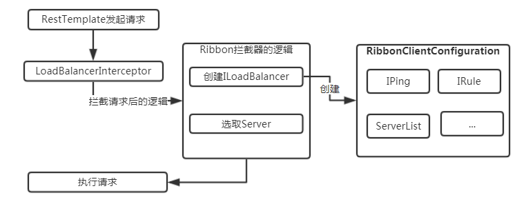

# Ribbon

`Spring Cloud Ribbon`是基于`Netflix Ribbon`实现的一套客户端负载均衡的工具。它是一个基于`HTTP`和`TCP`的客户端负载均衡器。它可以通过在客户端中配置`ribbonServerList`来设置服务端列表去轮询访问以达到均衡负载的作用。

当`Ribbon`与`Eureka`联合使用时，`ribbonServerList`会被`DiscoveryEnabledNIWSServerList`重写，扩展成从`Eureka`注册中心中获取服务实例列表。同时它也会用`NIWSDiscoveryPing`来取代`IPing`，它将职责委托给`Eureka`来确定服务端是否已经启动。

而当`Ribbon`与`Consul`（类似于`Eureka`的另一种服务注册中心）联合使用时，`ribbonServerList`会被`ConsulServerList`来扩展成从`Consul`获取服务实例列表。同时由`ConsulPing`来作为`IPing`接口的实现。

我们在使用`Spring Cloud Ribbon`的时候，不论是与`Eureka`还是`Consul`结合，都会在引入`Spring Cloud Eureka`或`Spring Cloud Consul`依赖的时候通过自动化配置来加载上述所说的配置内容，所以我们可以快速在`Spring Cloud`中实现服务间调用的负载均衡。


## 示例

```shell
# 1.启动一个eureka server 服务端
# 2.启动同一spirng boot 应用（多个实例），提供url访问，并注册到eureka
# 3.启动ribbon客户端，对spring boot应用进行负载均衡
```


```xml
<properties>
    <java.version>1.8</java.version>
    <spring-cloud.version>Greenwich.SR2</spring-cloud.version>
</properties>

<dependencies>
    <dependency>
        <groupId>org.springframework.boot</groupId>
        <artifactId>spring-boot-starter-web</artifactId>
    </dependency>
    <dependency>
        <groupId>org.springframework.cloud</groupId>
        <artifactId>spring-cloud-starter-netflix-eureka-client</artifactId>
    </dependency>
    <dependency>
        <groupId>org.springframework.cloud</groupId>
        <artifactId>spring-cloud-starter-netflix-ribbon</artifactId>
    </dependency>
</dependencies>

<dependencyManagement>
    <dependencies>
        <dependency>
            <groupId>org.springframework.cloud</groupId>
            <artifactId>spring-cloud-dependencies</artifactId>
            <version>${spring-cloud.version}</version>
            <type>pom</type>
            <scope>import</scope>
        </dependency>
    </dependencies>
</dependencyManagement>
```


```yaml
server:
  port: 8888

spring:
  application:
    name: cloud-ribbon

eureka:
  instance:
    leaseRenewalIntervalInSeconds: 10 #表示eureka client发送心跳给server端的频率
    health-check-url-path: /actuator/health #健康检查页面的URL，相对路径，默认使用 HTTP 访问，如果需要使用 HTTPS则需要使用绝对路径配置

  client:
    registryFetchIntervalSeconds: 5 #表示eureka client间隔多久去拉取服务注册信息，默认为30秒
    service-url:
      defaultZone: ${EUREKA_SERVICE_URL:http://localhost:8761}/eureka/ #服务注册中心地址
```


启动类

```java
@SpringBootApplication
@RibbonClient(name = "指定调用的服务名称", configuration = RibbonConfiguration.class)
@EnableCircuitBreaker
public class RibbonApplication {

    @LoadBalanced
    @Bean
    public RestTemplate restTemplate() {
        return new RestTemplate();
    }

    public static void main(String[] args) {
        SpringApplication.run(RibbonApplication.class, args);
    }

}
```


```java
public class MyRoundRobinRule  extends AbstractLoadBalancerRule {

    // total = 0 // 当total==5以后，我们指针才能往下走，
    // index = 0 // 当前对外提供服务的服务器地址，
    // total需要重新置为零，但是已经达到过一个5次，我们的index = 1
    // 分析：我们5次，但是微服务只有8001 8002 8003 三台，OK？

    private int total = 0; // 总共被调用的次数，目前要求每台被调用5次
    private int currentIndex = 0;	// 当前提供服务的机器号

    @Override
    public void initWithNiwsConfig(IClientConfig iClientConfig) {

    }

    private Server choose(ILoadBalancer lb, Object key)
    {
        if (lb == null) {
            return null;
        }
        Server server = null;

        while (server == null) {
            if (Thread.interrupted()) {
                return null;
            }
            List<Server> upList = lb.getReachableServers();
            List<Server> allList = lb.getAllServers();

            int serverCount = allList.size();
            if (serverCount == 0) {
                /*
                 * No servers. End regardless of pass, because subsequent passes only get more
                 * restrictive.
                 */
                return null;
            }

//			int index = rand.nextInt(serverCount);// java.util.Random().nextInt(3);
//			server = upList.get(index);


//			private int total = 0; // 总共被调用的次数，目前要求每台被调用5次
//			private int currentIndex = 0;	// 当前提供服务的机器号
            if(total < 5)
            {
                server = upList.get(currentIndex);
                total++;
            }else {
                total = 0;
                currentIndex++;
                if(currentIndex >= upList.size())
                {
                    currentIndex = 0;
                }
            }


            if (server == null) {
                /*
                 * The only time this should happen is if the server list were somehow trimmed.
                 * This is a transient condition. Retry after yielding.
                 */
                Thread.yield();
                continue;
            }

            if (server.isAlive()) {
                return (server);
            }

            // Shouldn't actually happen.. but must be transient or a bug.
            server = null;
            Thread.yield();
        }

        return server;

    }

    @Override
    public Server choose(Object o) {
        return choose(getLoadBalancer(), o);
    }
}
```


```java
@Configuration
public class RibbonConfiguration {

    //IRule就是所有规则的标准
    @Bean
    public IRule ribbonRule() {

        //自定义
        //return new MyRoundRobinRule();// 我自定义为每台机器5次

        // Ribbon随机
        //return new RandomRule();

        // Ribbon默认的轮询
        return new RoundRobinRule();

        //会先过滤掉由于多次访问故障而处于断路器跳闸状态的服务，还有并发的连接数量超过阈值的服务。然后对剩余的服务列表按照轮询策略进行访问。
        //return new AvailabilityFilteringRule();

        //根据平均响应时间计算所有服务的权重，响应时间越快服务权重越大被选中的概率越高。刚启动时如果统计信息不足，会使用 RoundRobinRule策略。等统计信息足够，会切换到WeightedResponseTimeRule。
        //return new WeightedResponseTimeRule();

        //先按照 RoundRobinRule策略获取服务，如果获取服务失败则在指定时间内会进行重试获取可用的服务。
        //return new RetryRule();

        //会先过滤掉由于多次访问故障而处于断路器跳闸状态的服务,然后选取一个并发量最小的服务。
        //return new BestAvailableRule();

        //复合判断Server所在区域的性能和Server的可用性来选择服务器。
        //return new ZoneAvoidanceRule();
    }

}
```


调用

```java
@RestController
@CrossOrigin(allowCredentials = "true")
public class PriSignalController {

    @Autowired
    private RestTemplate restTemplate;

    @Autowired
    private DiscoveryClient discoveryClient;

    @GetMapping("/service-instances/{applicationName}")
    public List<ServiceInstance> serviceInstancesByApplicationName(
            @PathVariable String applicationName) {
        return this.discoveryClient.getInstances(applicationName);
    }

    @HystrixCommand(fallbackMethod="hystrixFallback")
    @GetMapping("data")
    public String data() {
        Object results = restTemplate.getForObject("http://EUREKA-PRI/pri/data?dataNum=5359812", Object.class);
        if (results != null) {
            return results.toString();
        }
        return "empty results";
    }

    @HystrixCommand(fallbackMethod="hystrixFallback")
    @GetMapping("list")
    public String test() throws Exception {
        List results = restTemplate.getForObject("http://EUREKA-PRI/pri/dataPage?pageNum=1&pageSize=10", List.class);
        return results.toString();
    }

    //这个方法是上面的方法发生错误的时候调用
    //回调方法参数与上面的一模一样。
    public String hystrixFallback(){
        System.out.println("hystrixFallback error");
        return "hystrixFallback error";
    }
}

```


## 常用配置

### 结合eureka

```properties
# 禁用 Eureka
ribbon.eureka.enabled=false

# 禁用 Eureka 后手动配置服务地址
# 这个配置是针对具体服务的，前缀就是服务名称，配置完之后就可以和之前一样使用服务名称来调用接口了。
ribbon-config-demo.ribbon.listOfServers=localhost:8081,localhost:8083
```


### 超时时间

```properties
# 全局设置

# 请求连接的超时时间
ribbon.ConnectTimeout=2000
# 请求处理的超时时间
ribbon.ReadTimeout=5000


# 局部设置

# 也可以为每个Ribbon客户端设置不同的超时时间, 通过服务名称进行指定：
ribbon-config-demo.ribbon.ConnectTimeout=2000
ribbon-config-demo.ribbon.ReadTimeout=5000
```


```java
protected static int getRibbonTimeout(IClientConfig config, String commandKey) {
	int ribbonTimeout;
	// 这是比较异常的情况，不说
	if (config == null) {
		ribbonTimeout = RibbonClientConfiguration.DEFAULT_READ_TIMEOUT + RibbonClientConfiguration.DEFAULT_CONNECT_TIMEOUT;
	} else {
	   // 这里获取了四个参数，ReadTimeout，ConnectTimeout，MaxAutoRetries， MaxAutoRetriesNextServer
		int ribbonReadTimeout = getTimeout(config, commandKey, "ReadTimeout",
			IClientConfigKey.Keys.ReadTimeout, RibbonClientConfiguration.DEFAULT_READ_TIMEOUT);
		int ribbonConnectTimeout = getTimeout(config, commandKey, "ConnectTimeout",
			IClientConfigKey.Keys.ConnectTimeout, RibbonClientConfiguration.DEFAULT_CONNECT_TIMEOUT);
		int maxAutoRetries = getTimeout(config, commandKey, "MaxAutoRetries",
			IClientConfigKey.Keys.MaxAutoRetries, DefaultClientConfigImpl.DEFAULT_MAX_AUTO_RETRIES);
		int maxAutoRetriesNextServer = getTimeout(config, commandKey, "MaxAutoRetriesNextServer",
			IClientConfigKey.Keys.MaxAutoRetriesNextServer, DefaultClientConfigImpl.DEFAULT_MAX_AUTO_RETRIES_NEXT_SERVER);
		// 原来ribbonTimeout的计算方法在这里，以上文的设置为例
		// ribbonTimeout = (50000 + 50000) * (0 + 1) * (1 + 1) = 200000
		ribbonTimeout = (ribbonReadTimeout + ribbonConnectTimeout) * (maxAutoRetries + 1) * (maxAutoRetriesNextServer + 1);
	}
	return ribbonTimeout;
}
```


可以看到`ribbonTimeout`是一个总时间，所以从逻辑上来讲，作者希望<font color=##00dd00> hystrixTimeout要大于ribbonTimeout</font>，否则`hystrix`熔断了以后，`ribbon`的重试就都没有意义了。


### ribbon负载均衡

```java
@Configuration
public class RibbonConfiguration {

    //IRule就是所有规则的标准
    @Bean
    public IRule ribbonRule() {

        //自定义
        //return new MyRoundRobinRule();// 我自定义为每台机器5次

        // Ribbon随机
        //return new RandomRule();

        // Ribbon默认的轮询
        return new RoundRobinRule();

        //会先过滤掉由于多次访问故障而处于断路器跳闸状态的服务，还有并发的连接数量超过阈值的服务。然后对剩余的服务列表按照轮询策略进行访问。
        //return new AvailabilityFilteringRule();

        //根据平均响应时间计算所有服务的权重，响应时间越快服务权重越大被选中的概率越高。刚启动时如果统计信息不足，会使用 RoundRobinRule策略。等统计信息足够，会切换到WeightedResponseTimeRule。
        //return new WeightedResponseTimeRule();

        //先按照 RoundRobinRule策略获取服务，如果获取服务失败则在指定时间内会进行重试获取可用的服务。
        //return new RetryRule();

        //会先过滤掉由于多次访问故障而处于断路器跳闸状态的服务,然后选取一个并发量最小的服务。
        //return new BestAvailableRule();

        //复合判断Server所在区域的性能和Server的可用性来选择服务器。
        //return new ZoneAvoidanceRule();
    }

}
```


### 重试机制

在集群环境中，用多个节点来提供服务，难免会有某个节点出现故障。用 `Nginx` 做负载均衡的时候，如果你的应用是无状态的、可以滚动发布的，也就是需要一台台去重启应用，这样对用户的影响其实是比较小的，因为 `Nginx` 在转发请求失败后会重新将该请求转发到别的实例上去。

由于 `Eureka` 是基于 `AP` 原则构建的，牺牲了数据的一致性，每个 `Eureka` 服务都会保存注册的服务信息，当注册的客户端与 `Eureka` 的心跳无法保持时，有可能是网络原因，也有可能是服务挂掉了。

在这种情况下，`Eureka` 中还会在一段时间内保存注册信息。这个时候客户端就有可能拿到已经挂掉了的服务信息，所以 `Ribbon` 就有可能拿到已经失效了的服务信息，这样就会导致发生失败的请求。

这种问题我们可以利用重试机制来避免。重试机制就是当 `Ribbon` 发现请求的服务不可到达时，重新请求另外的服务。


#### 1. Retry Rule 重试

解决上述问题，最简单的方法就是利用 Ribbon 自带的重试策略进行重试，此时只需要指定某个服务的负载策略为重试策略即可：

```properties
# 开启重试机制，它默认是关闭的
spring.cloud.loadbalancer.retry.enabled=true
# 断路器hystrix的超时时间需要大于Ribbon的超时时间，不然不会触发重试。
hystrix.command.default.execution.isolation.thread.timeoutInMilliseconds=10000
# 请求连接时间
hello-service.ribbon.ConnectTimeout=250
# 请求处理时间
hello-service.ribbon.ReadTimeout=1000
# 对所有操作都进行重试
hello-service.ribbon.OkToRetryOnAllOperations=true
# 切换实例的重试次数
hello-service.ribbon.MaxAutoRetriesNextServer=2
# 对当前实例的重试次数
hello-service.ribbon.MaxAutoRetries=1

ribbon-config-demo.ribbon.NFLoadBalancerRuleClassName=com.netflix.loadbalancer.RetryRule
```

#### 2. Spring Retry 重试

除了使用 `Ribbon` 自带的重试策略，我们还可以通过集成 `Spring Retry` 来进行重试操作。

1. 在 `pom.xml` 中添加 `Spring Retry` 的依赖，代码如下所示。

```xml
<dependency>
    <groupId>org.springframework.retry</groupId>
    <artifactId>spring-retry</artifactId>
</dependency>
```


2. 启动类加上`@EnableRetry`注解。


配置重试次数等信息：

```properties
# 对当前实例的重试次数
ribbon.maxAutoRetries=1
# 切换实例的重试次数
ribbon.maxAutoRetriesNextServer=3
# 对所有操作请求都进行重试
ribbon.okToRetryOnAllOperations=true
# 对Http响应码进行重试
ribbon.retryableStatusCodes=500,404,502
```


## 配置Ribbon

### 代码方式

参见上述示例


### 配置文件方式

```	properties
# 对于Ribbon参数配置通常有两种方式: 全局配置 和 客户端配置

# 全局配置:ribbon.<key>=<value>
# 指定客户端配置:<client>.ribbon.<key>=<value>格式进行配置,client可以理解为服务名
# 对于Ribbon参数的key以及value类型定义,可以查看com.netflix.client.config.CommonClientConfigKey类获取更为详细的配置内容


<clientName>.ribbon.NFLoadBalancerClassName: Should implement ILoadBalancer(负载均衡器操作接口)
<clientName>.ribbon.NFLoadBalancerRuleClassName: Should implement IRule(负载均衡算法)
<clientName>.ribbon.NFLoadBalancerPingClassName: Should implement IPing(服务可用性检查)
<clientName>.ribbon.NIWSServerListClassName: Should implement ServerList(服务列表获取)
<clientName>.ribbon.NIWSServerListFilterClassName: Should implement ServerListFilter(服务列表的过滤)
```


## 基本实现

`BaseLoadBalancer`是一个负载均衡器，是`ribbon`框架提供的负载均衡器。`Spring Cloud`对`ribbon`封装以后，直接调用`ribbon`的负载均衡器来实现微服务客户端的负载均衡。

这里需要注意，`ribbon`框架本身提供了几个负载均衡器，`BaseLoadBalancer`只是其中之一。

Spring Cloud是如何封装`ribbon`框架的呢？Spring Cloud提供了2个接口：`ServiceInstanceChooser`和`LoadBalancerClient`，这2个接口就是客户端负载均衡的定义。具体实现类是`RibbonLoadBalancerClient`。`RibbonLoadBalancerClient#choose()`方法根据微服务实例的`serviceId`，然后使用配置的负载均衡策略，打到对应的微服务实例节点上。

OK，到这里，我们简单梳理一下Spring Cloud集成`ribbon`后，负载均衡的执行逻辑。

1，`Spring Cloud RibbonLoadBalancerClient#choose()`调用`ribbon`框架的`BaseLoadBalancer`。

2，`BaseLoadBalancer#chooseServer()`选择具体的负载均衡策略（`RoundRibonRule`），然后执行。

但是，`RibbonLoadBalancerClient#choose()`是在哪里调用的呢？这里用到了拦截器，`@RibbonClient`注解自动化配置类`LoadBalancerAutoConfiguration.class`中有两个注解：

```java
@ConditionalOnClass({RestTemplate.class})

@ConditionalOnClass({LoadBalancerClient.class})
```

也就是说，在`RestTemplate.class`和`LoadBalancerClient.class`存在的情况下，`LoadBalancerInterceptor.class`会拦截`RestTemplate.class`上的`@LoadBalanced`注解，然后将请求中的微服务实例名`serviceId`转化为具体的`ip+端口`，然后去请求目标服务节点。


## 原理

- 1.获取`@LoadBalanced`注解标记的`RestTemplate`。
- 2.`RestTemplate`添加一个拦截器(`filter`)，当使用`RestTemplate`发起`http`调用时进行拦截。
- 3.在`filter`拦截到该请求时，获取该次请求服务集群的全部列表信息。
- 4.根据规则从集群中选取一个服务作为此次请求访问的目标。
- 5.访问该目标，并获取返回结果。


### 获取@LoadBalanced注解标记的RestTemplate。

Ribbon将所有标记`@LoadBalanced`注解的`RestTemplate`保存到一个List集合当中，具体源码如下：

```java
@LoadBalanced
@Autowired(required = false)
private List<RestTemplate> restTemplates = Collections.emptyList();
```

具体源码位置是在`LoadBalancerAutoConfiguration`中。

### RestTemplate添加一个拦截器(filter)

`RestTemplate`添加拦截器需要有两个步骤，首先是定义一个拦截器，其次是将定义的拦截器添加到`RestTemplate`中。

#### 定义一个拦截器

实现`ClientHttpRequestInterceptor`接口就具备了拦截请求的功能，该接口源码如下：

```java
public interface ClientHttpRequestInterceptor {
    /**
     *实现该方法，在该方法内完成拦截请求后的逻辑内容。
     *对于ribbon而言，在该方法内完成了根据具体规则从
     *服务集群中选取一个服务，并向该服务发起请求的操作。
     */
   ClientHttpResponse intercept(HttpRequest request, byte[] body, ClientHttpRequestExecution execution) throws IOException;

}
```

`ribbon`中对应的实现类是`LoadBalancerInterceptor`(不使用`spring-retry`的情况下)具体源码如下：

```java
public class LoadBalancerInterceptor implements ClientHttpRequestInterceptor {

   private LoadBalancerClient loadBalancer;
   private LoadBalancerRequestFactory requestFactory;

    //省略构造器代码...

   @Override
   public ClientHttpResponse intercept(final HttpRequest request, final byte[] body,
         final ClientHttpRequestExecution execution) throws IOException {
      final URI originalUri = request.getURI();
      String serviceName = originalUri.getHost();
      /**
       *拦截请求，并调用loadBalancer.execute()方法
       *在该方法内部完成server的选取。向选取的server
       *发起请求，并获得返回结果。
       */
      return this.loadBalancer.execute(serviceName, requestFactory.createRequest(request, body, execution));
   }
}
```

#### 将拦截器添加到RestTemplate中

`RestTemplate`继承了`InterceptingHttpAccessor`，在`InterceptingHttpAccessor`中提供了获取以及添加拦截器的方法，具体源码如下：

```java
public abstract class InterceptingHttpAccessor extends HttpAccessor {

    /**
     * 所有的拦截器是以一个List集合形式进行保存。
     */
   private List<ClientHttpRequestInterceptor> interceptors = new ArrayList<ClientHttpRequestInterceptor>();

   /**
    * 设置拦截器。
    */
   public void setInterceptors(List<ClientHttpRequestInterceptor> interceptors) {
      this.interceptors = interceptors;
   }

   /**
    * 获取当前的拦截器。
    */
   public List<ClientHttpRequestInterceptor> getInterceptors() {
      return interceptors;
   }

   //省略部分代码...
}
```

通过这两个方法我们就可以将刚才定义的`LoadBalancerInterceptor`添加到有`@LoadBalanced`注解标识的`RestTemplate`中。具体的源码如下(`LoadBalancerAutoConfiguration`)省略部分代码：

```java
public class LoadBalancerAutoConfiguration {

    /**
      * 获取所有带有@LoadBalanced注解的restTemplate
     */
   @LoadBalanced
   @Autowired(required = false)
   private List<RestTemplate> restTemplates = Collections.emptyList();

    /**
     * 创建SmartInitializingSingleton接口的实现类。Spring会在所有
     * 单例Bean初始化完成后回调该实现类的afterSingletonsInstantiated()
     * 方法。在这个方法中会为所有被@LoadBalanced注解标识的
     * RestTemplate添加ribbon的自定义拦截器LoadBalancerInterceptor。
     */
   @Bean
   public SmartInitializingSingleton loadBalancedRestTemplateInitializer(
         final List<RestTemplateCustomizer> customizers) {
      return new SmartInitializingSingleton() {
         @Override
         public void afterSingletonsInstantiated() {
            for (RestTemplate restTemplate : LoadBalancerAutoConfiguration.this.restTemplates) {
               for (RestTemplateCustomizer customizer : customizers) {
                  customizer.customize(restTemplate);
               }
            }
         }
      };
   }
    /**
     * 创建Ribbon自定义拦截器LoadBalancerInterceptor
     * 创建前提是当前classpath下不存在spring-retry。
     * 所以LoadBalancerInterceptor是默认的Ribbon拦截
     * 请求的拦截器。
     */
    @Configuration
    @ConditionalOnMissingClass("org.springframework.retry.support.RetryTemplate")
   static class LoadBalancerInterceptorConfig {
      @Bean
      public LoadBalancerInterceptor ribbonInterceptor(
            LoadBalancerClient loadBalancerClient,
            LoadBalancerRequestFactory requestFactory) {
         return new LoadBalancerInterceptor(loadBalancerClient, requestFactory);
      }

      /**
       * 添加拦截器具体方法。首先获取当前拦截器集合(List)
       * 然后将loadBalancerInterceptor添加到当前集合中
       * 最后将新的集合放回到restTemplate中。
       */
      @Bean
      @ConditionalOnMissingBean
      public RestTemplateCustomizer restTemplateCustomizer(
            final LoadBalancerInterceptor loadBalancerInterceptor) {
         return new RestTemplateCustomizer() {
            @Override
            public void customize(RestTemplate restTemplate) {
               List<ClientHttpRequestInterceptor> list = new ArrayList<>(
                     restTemplate.getInterceptors());
               list.add(loadBalancerInterceptor);
               restTemplate.setInterceptors(list);
            }
         };
      }
   }
}
```

至此知道了`ribbon`拦截请求的基本原理，接下来我们看看`Ribbon`是怎样选取server的。

#### Ribbon选取server原理概览

通过上面的介绍我们知道了当发起请求时`ribbon`会用`LoadBalancerInterceptor`这个拦截器进行拦截。在该拦截器中会调用`LoadBalancerClient.execute()`方法，该方法具体代码如下：

```java
@Override
public <T> T execute(String serviceId, LoadBalancerRequest<T> request) throws IOException {
  /**
   *创建loadBalancer的过程可以理解为组装选取服务的规则(IRule)、
   *服务集群的列表(ServerList)、检验服务是否存活(IPing)等特性
   *的过程(加载RibbonClientConfiguration这个配置类)，需要注意
   *的是这个过程并不是在启动时进行的，而是当有请求到来时才会处理。
   */
   ILoadBalancer loadBalancer = getLoadBalancer(serviceId);

   /**
    * 根据ILoadBalancer来选取具体的一个Server。
    * 选取的过程是根据IRule、IPing、ServerList
    * 作为参照。
    */
   Server server = getServer(loadBalancer);
   if (server == null) {
      throw new IllegalStateException("No instances available for " + serviceId);
   }
   RibbonServer ribbonServer = new RibbonServer(serviceId, server, isSecure(server,
         serviceId), serverIntrospector(serviceId).getMetadata(server));

   return execute(serviceId, ribbonServer, request);
}
```

通过代码我们可知，首先创建一个`ILoadBalancer`，这个`ILoadBalancer`是Ribbon的核心类。可以理解成它包含了选取服务的规则(`IRule`)、服务集群的列表(`ServerList`)、检验服务是否存活(`IPing`)等特性，同时它也具有了根据这些特性从服务集群中选取具体一个服务的能力。
`Server server = getServer(loadBalancer);`这行代码就是选取举一个具体`server`。
最终调用了内部的`execute`方法，该方法代码如下(只保留了核心代码)：

```java
@Override
public <T> T execute(String serviceId, ServiceInstance serviceInstance, LoadBalancerRequest<T> request) throws IOException {
   try {
      //发起调用
      T returnVal = request.apply(serviceInstance);
      statsRecorder.recordStats(returnVal);
      return returnVal;
   }
   catch (IOException ex) {
      statsRecorder.recordStats(ex);
      throw ex;
   }
   catch (Exception ex) {
      statsRecorder.recordStats(ex);
      ReflectionUtils.rethrowRuntimeException(ex);
   }
   return null;
}
```

接下来看下`request.apply(serviceInstance)`方法的具体做了那些事情(LoadBalancerRequestFactory中)：

```java
@Override
public ClientHttpResponse apply(final ServiceInstance instance)
      throws Exception {
   HttpRequest serviceRequest = new ServiceRequestWrapper(request, instance, loadBalancer);
   //省略部分代码...
   /**
    * 发起真正请求。
    */
   return execution.execute(serviceRequest, body);
}
```


### 总结

看到这里整体流程的原理就说完了，接下来我们结合一张图来回顾下整个过程：



首先获取所有标识`@LoadBalanced`注解的`RestTemplate`(可以理解成获取那些开启了Ribbon负载均衡功能的`RestTemplate`)，然后将Ribbon默认的拦截器`LoadBalancerInterceptor`添加到`RestTemplate`中，这样当使用`RestTemplate`发起http请求时就会起到拦截的作用。当有请求发起时，ribbon默认的拦截器首先会创建`ILoadBalancer`(里面包含了选取服务的规则(`IRule`)、服务集群的列表(`ServerList`)、检验服务是否存活(`IPing`)等特性)。在代码层面的含义是加载`RibbonClientConfiguration`配置类)。然后使用`ILoadBalancer`从服务集群中选择一个服务，最后向这个服务发送请求。