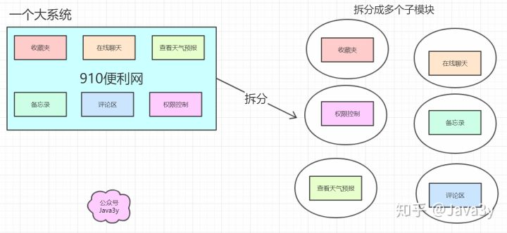
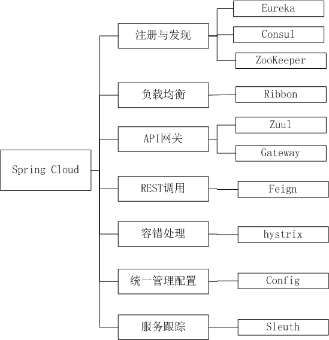

# 分布式、集群、微服务、SOA

分布式：不同模块部署在不同服务器上
作用：分布式解决网站高并发带来问题

集群：多台服务器部署相同应用构成一个集群
作用：通过负载均衡设备共同对外提供服务

SOA：业务系统分解为多个组件，让每个组件都独立提供离散，自治，可复用的服务能力，通过服务的组合和编排来实现上层的业务流程
作用：简化维护,降低整体风险,伸缩灵活

微服务：架构设计概念,各服务间隔离（分布式也是隔离）,自治（分布式依赖整体组合）其它特性(单一职责,边界,异步通信,独立部署)是分布式概念的跟严格执行SOA到微服务架构的演进过程
作用：各服务可独立应用，组合服务也可系统应用

分布式：一个业务分拆多个子业务，部署在不同的服务器上

集群：同一个业务，部署在多个服务器上

# CAP理论

- 指的是在一个分布式系统中，Consistency（一致性）、 Availability（可用性）、Partition tolerance（分区容错性），三者不可同时获得。

> **一致性（C）**：在分布式系统中的所有数据备份，在同一时刻是否同样的值。（所有节点在同一时间的数据完全一致，越多节点，数据同步越耗时）	
>
>
> **可用性（A）**：负载过大后，集群整体是否还能响应客户端的读写请求。（服务一直可用，而且是正常响应时间）
>
>
> **分区容错性（P）**：分区容忍性，就是高可用性，一个节点崩了，并不影响其它的节点（100个节点，挂了几个，不影响服务，越多机器越好）

**再进一步解释CAP理论**

就是说在分布式存储系统中，最多只能实现上面的两点。而由于当前的网络硬件肯定会出现延迟丢包等问题，所以分区容忍性是我们必须需要实现的。所以我们只能**在一致性和可用性之间进行权衡**

> **C A 满足的情况下，P不能满足的原因：**
> 	数据同步(C)需要时间，也要正常的时间内响应(A)，那么机器数量就要少，所以P就不满足
>
> **CP 满足的情况下，A不能满足的原因：**
> 	数据同步(C)需要时间, 机器数量也多(P)，但是同步数据需要时间，所以不能再正常时间内响应，所以A就不满足
>
> **AP 满足的情况下，C不能满足的原因：**
> 	机器数量也多(P)，正常的时间内响应(A)，那么数据就不能及时同步到其他节点，所以C不满足

**Zookeeper和Consul ：CP设计，保证了一致性，集群搭建的时候，某个节点失效，则会进行选举行的leader，或者半数以上节点不可用，则无法提供服务，因此可用性没法满足**

**Eureka：AP原则，无主从节点，一个节点挂了，自动切换其他节点可以使用，去中心化**

> 结论：分布式系统中P,肯定要满足，所以只能在CA中二选一没有最好的选择，最好的选择是根据业务场景来进行架构设计
> 如果要求一致性，则选择zookeeper、Consul，如金融行业
> 如果要去可用性，则Eureka，如电商系统

# 引言 spring cloud

前面也讲了，从分布式/微服务的角度而言：就是把我们一**大**的项目，**分解**成多个**小**的模块。这些小的模块组合起来，完成功能。

拆分出多个模块以后，就会出现**各种各样**的问题，而SpringCloud提供了**一整套**的解决方案！

# springcloud概览

## springboot与springcloud

- Spring boot 是 Spring 的一套快速配置脚手架，可以基于spring boot 快速开发单个**微服务**
- Spring Boot，看名字就知道是**Spring的引导**，就是**用于启动Spring**的，使得Spring的学习和使用变得快速无痛。不仅适合替换原有的工程结构，更适合**微服务开发**。
- Spring Cloud**基于Spring Boot**，为微服务体系开发中的**架构问题**，提供了一整套的解决方案——服务注册与发现，服务消费，服务保护与熔断，网关，分布式调用追踪，分布式配置管理等。
- Spring Cloud是一个基于Spring Boot实现的云应用开发工具；Spring boot专注于快速、方便集成的**单个个体**，Spring Cloud是关注**全局的服务治理框架**

## SpringCloud的基础功能

- 服务治理： Spring Cloud Eureka
- 客户端负载均衡： Spring Cloud Ribbon
- 服务容错保护： Spring Cloud Hystrix
- 声明式服务调用： Spring Cloud Feign
- API网关服务：Spring Cloud Zuul
- 分布式配置中心： Spring Cloud Config

## SpringCloud的高级功能

- 消息总线： Spring Cloud Bus
- 消息驱动的微服务： Spring Cloud Stream
- 分布式服务跟踪： Spring Cloud Sleuth

# springcloud注解

## @SpringBootApplication

是springboot启动类，包括三个注解，他们的作用分别是：

@Configuration：表示将该类作用springboot配置文件类

@EnableAutoConfiguration：表示程序启动时，自动加载springboot默认的配置

@ComponentScan：表示程序启动是，自动扫描当前包及子包下所有类

## @EnableDiscoveryClient && @EnableEurekaClient

@EnableDiscoveryClient基于spring-cloud-commons，@EnableEurekaClient基于spring-cloud-netflix，如果选用的注册中心是eureka，那么就推荐@EnableEurekaClient，如果是其他的注册中心，那么推荐使用@EnableDiscoveryClient。

@ComponentScan && @Configuration && @EnableAutoConfiguration

## @ComponentScan 

如果不设置basePackage的话 默认会扫描包的所有类，所以最好还是写上basePackage （@componentScan({" ... "}）,减少加载时间。默认扫描\**/\*.class路径 比如这个注解在com.wuhulala 下面 ，那么会扫描这个包下的所有类还有子包的所有类,比如com.wuhulala.service包的应用

@Configuration 表示这个类中定义了Bean，会把这个类中bean加载到spring容器中

@EnableAutoConfiguration表示 会在你开启某些功能的时候自动配置，这个注解告诉Spring Boot根据添加的jar依赖猜测你想如何配置Spring。由于spring-boot-starter-web添加了Tomcat和Spring MVC，所以auto-configuration将假定你正在开发一个web应用，并对Spring进行相应地设置。

## @Mapper && @MapperScan

Mapper类上面添加注解@Mapper，这种方式要求每一个mapper类都需要添加此注解

使用@MapperScan可以指定要扫描的Mapper类的包的路径（@MapperScan("com.demo.\*.mapper") || @MapperScan("com.test.\*.mapper", "com.demo.\*.mapper")）

## @EnableTransactionManagement && @Transactional

Spring Boot 使用事务非常简单，首先使用注解 @EnableTransactionManagement （启注解事务管理，等同于xml配置方式的 ）开启事务支持后，然后在访问数据库的Service方法上添加注解 @Transactional 便可。

## @Async && @EnableAsync

@EnableAsync注解的意思是可以异步执行，就是开启多线程的意思。可以标注在方法、类上。

为了让@Async注解能够生效，需要在Spring Boot的主程序中配置@EnableAsync

@Async所修饰的函数不要定义为static类型，这样异步调用不会生效

## @Bean && @Configuration

@Bean标注在方法上(返回某个实例的方法)，等价于spring的xml配置文件中的，作用为：注册bean对象

@Configuration标注在类上，相当于把该类作为spring的xml配置文件中的，作用为：配置spring容器(应用上下文)

## @LoadBalanced

Spring Cloud的commons模块提供了一个@LoadBalanced注解，方便我们对RestTemplate添加一个LoadBalancerClient，以实现客户端负载均衡。通过源码可以发现这是一个标记注解,我们可以通过ribbon实现客户端的负载均衡功能。