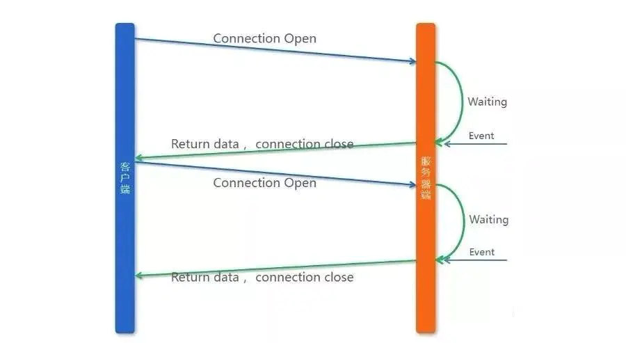

# 系统架构演变

单体应用架构--->垂直应用架构--->分布式架构--->SOA架构--->微服务架构，还有悄然兴起的Service Mesh(服务网格化)。


# 微服务架构解决方案

单体应用走向微服务以后，面临服务相关的各种问题。

- ServiceComb

Apache ServiceComb，前身是华为云的微服务引擎 CSE (Cloud Service Engine) 云服务，是全球
首个Apache微服务顶级项目。它提供了一站式的微服务开源解决方案，致力于帮助企业、用户和开发
者将企业应用轻松微服务化上云，并实现对微服务应用的高效运维管理。


- spring cloud

spring基于springboot提供的微服务一站式解决方案。


- spring cloud alibaba

阿里提供的微服务一站式解决方案。内部继承阿里众多组件。


- service mesh

服务网格，下一代微服务解决方案。


# springcloud


## springboot与springcloud

- Spring boot 是 Spring 的一套快速配置脚手架，可以基于spring boot 快速开发单个**微服务**
- Spring Boot，看名字就知道是**Spring的引导**，就是**用于启动Spring**的，使得Spring的学习和使用变得快速无痛。不仅适合替换原有的工程结构，更适合**微服务开发**。
- Spring Cloud**基于Spring Boot**，为微服务体系开发中的**架构问题**，提供了一整套的解决方案——服务注册与发现，服务消费，服务保护与熔断，网关，分布式调用追踪，分布式配置管理等。
- Spring Cloud是一个基于Spring Boot实现的云应用开发工具；Spring boot专注于快速、方便集成的**单个个体**，Spring Cloud是关注**全局的服务治理框架**


## SpringCloud组件

```properties
服务治理: Spring Cloud Eureka

客户端负载均衡: Spring Cloud Ribbon

服务容错保护: Spring Cloud Hystrix，Turbine

声明式服务调用: Spring Cloud Feign

API网关服务: Spring Cloud Zuul，Spring Cloud Gateway

分布式配置中心: Spring Cloud Config

分布式服务跟踪: Spring Cloud Sleuth，Zipkin
```

> Turbine是聚合服务器发送事件流数据的一个工具，Hystrix的监控中，只能监控单个节点，实际生产中都为集群，因此可以通过Turbine来监控集群下Hystrix的metrics情况


# spring cloud alibaba

```properties
Sentinel: 把流量作为切入点，从流量控制、熔断降级、系统负载保护等多个维度保护服务的稳定性。

Nacos: 一个更易于构建云原生应用的动态服务发现、配置管理和服务管理平台。

RocketMQ: 一款开源的分布式消息系统，基于高可用分布式集群技术，提供低延时的、高可靠的消息发布与订阅服务。

Dubbo: Apache Dubbo 是一款高性能 Java RPC 框架。

Seata: 阿里巴巴开源产品，一个易于使用的高性能微服务分布式事务解决方案。

Alibaba Cloud ACM: 一款在分布式架构环境中对应用配置进行集中管理和推送的应用配置中心产品。

Alibaba Cloud OSS: 阿里云对象存储服务（Object Storage Service，简称 OSS），是阿里云提供的海量、安全、低成本、高可靠的云存储服务。您可以在任何应用、任何时间、任何地点存储和访问任意类型的数据。

Alibaba Cloud SchedulerX: 阿里中间件团队开发的一款分布式任务调度产品，提供秒级、精准、高可靠、高可用的定时（基于 Cron 表达式）任务调度服务。

Alibaba Cloud SMS: 覆盖全球的短信服务，友好、高效、智能的互联化通讯能力，帮助企业迅速搭建客户触达通道。

sidecar:	多语言
```


# 注冊中心

nacos，eureka，consul，zookeeper


| 对比项目\注册中心  | Spring Cloud Nacos                                           | Spring Cloud Eureka                                          |
| ------------------ | ------------------------------------------------------------ | ------------------------------------------------------------ |
| CAP模型            | 支持AP和CP模型                                               | AP模型                                                       |
| 客户端更新服务信息 | 使用注册+DNS-f+健康检查模式。 DNS-F客户端使用监听模式push/pull拉取更新信息 | 客户端定时轮询服务端获取其他服务ip信息并对比，相比之下服务端压力较大、延迟较大 |
| 伸缩性             | 使用Raft选举算法性能、可用性、容错性均比较好，新加入节点无需与所有节点互相广播同步信息 | 由于使用广播同步信息，集群超过1000台机器后对eureka集群压力很大 |
| 健康检查模式/方式  | 支持服务端/客户端/关闭检查模式，检查方式有tcp、http、sql。支持自己构建健康检查器 | 客户端向服务端发送http心跳                                   |
| 负载均衡           | 支持                                                         | 支持                                                         |
| 手动上下线服务方式 | 通过控制台页面和API                                          | 通过调用API                                                  |
| 跨中心同步         | 支持                                                         | 不支持                                                       |
| k8s集成            | 支持                                                         | 不支持                                                       |
| 分组               | Nacos可用根据业务和环境进行分组管理                          | 不支持                                                       |
| 权重               | Nacos默认提供权重设置功能，调整承载流量压力                  | 不支持                                                       |
| 厂商               | 阿里巴巴                                                     | Netflix                                                      |


## eureka

AP模型，高可用，内部有自我保护机制

2.x之后闭源，目前社区不更新

界面简单，只提供查看，不提供操作

客户端更新服务信息时，需要定时轮询服务端获取其他服务ip信息并对比。所以服务端压力较大、延迟较大

由于使用广播同步信息，所以<font color=#00dd00>集群超过1000台机器后对eureka集群压力很大</font>


## Nacos

=eureka+spring cloud config

同时支持AP和CP模式,它是根据服务注册选择临时和永久来决定走AP模式还是CP模式。

社区更新活跃

界面功能丰富，可以将服务优雅上下线和流量管理

支持跨注册中心同步

支持大数量级的集群


目前使用Nacos的公司：

阿里巴巴、虎牙直播、中国工商银行、爱奇艺、中国平安、平安科技、浙江农信、贝壳、丰巢、百世快递、汽车之家等


## consul

遵循CP原则，服务注册稍慢

由于其一致性导致了在Leader挂掉时重新选举期间整个consul集群不可用。


# 配置中心

springcloud config，百度的disconf（目前已经不维护了），协程的apollo，nacos


| 对比项目/配置中心        | spring cloud config                           | apollo                               | nacos                      |
| ------------------------ | --------------------------------------------- | ------------------------------------ | -------------------------- |
| 开源时间                 | 2014.9                                        | 2016.5                               | 2018.6                     |
| 配置实时推送             | 支持（Spring Cloud Bus）                      | 支持（HTTP长轮询1s内）               | 支持（HTTP长轮询1s内）     |
| 版本管理                 | 支持（Git）                                   | 自动管理                             | 自动管理                   |
| 配置回滚                 | 支持（Git）                                   | 支持                                 | 支持                       |
| 灰度发布                 | 支持                                          | 支持                                 | 支持（1.1.0）              |
| 权限管理                 | 支持                                          | 支持                                 | 支持（1.2.0）              |
| 多集群多环境             | 支持                                          | 支持                                 | 支持                       |
| 监听查询                 | 支持                                          | 支持                                 | 支持                       |
| 多语言                   | 只支持Java                                    | Go,C++,Python,Java,.net,OpenAPI      | Python,Java,Nodejs,OpenAPI |
| 分布式高可用最小集群数量 | Config-Server2+Git+MQ                         | Config2+Admin3+Portal*2+Mysql=8      | Nacos*3+MySql=4            |
| 配置格式校验             | 不支持                                        | 支持                                 | 支持                       |
| 通信协议                 | HTTP和AMQP                                    | HTTP                                 | HTTP                       |
| 数据一致性               | Git保证数据一致性，Config-Server从Git读取数据 | 数据库模拟消息队列，Apollo定时读消息 | HTTP异步通知               |
| 单机读（tps）            | 7（限流所制）                                 | 9000                                 | 15000                      |
| 单机写（tps）            | 5（限流所制）                                 | 1100                                 | 1800                       |
| 3节点读                  | 21（限流所制）                                | 27000                                | 45000                      |
| 3节点写                  | 5（限流所制）                                 | 3300                                 | 5600                       |

**总的来说**

 1、Apollo和Nacos相对于Spring Cloud Config的生态支持更广，在配置管理流程上做的更好。
 2、Apollo相对于Nacos在配置管理做的更加全面，不过使用起来也要麻烦一些。
 3、apollo容器化较困难，Nacos有官网的镜像可以直接部署，总体来说，Nacos比apollo更符合KISS原则。
 4、Nacos部署和使用起来相对比较简洁，在对性能要求比较高的大规模场景更适合。

此外，Nacos除了提供配置中心的功能，还提供了动态服务发现、服务共享与管理的功能，降低了服务化改造过程中的难度。


## springcloud config

当配置变更的时候，配置中心需要将配置实时推送到应用客户端。

Spring Cloud Config原生不支持配置的实时推送，需要依赖Git的WebHook、Spring Cloud Bus和客户端/bus/refresh端点:

1、基于Git的WebHook，配置变更触发server端refresh

2、Server端接收到请求并发送给Spring Cloud Bus

3、Spring Cloud Bus接到消息并通知给客户端

4、客户端接收到通知，请求Server端获取最新配置


可以看出，Spring Cloud Config的配置推送引入Spring Cloud Bus，链路较长，比较复杂。


Spring Cloud Config包含config-server、Git和Spring Cloud Bus三大组件：

1、config-server提供给客户端获取配置;

2、Git用于存储和修改配置;

3、Spring Cloud Bus通知客户端配置变更;

本地测试模式下，Spring Cloud Bus和config-server需要部署一个节点，Git使用GitHub就可以。在生产环境中，Spring Cloud Config，config-server需要部署至少两个节点。Spring Cloud Bus如果使用RabbitMQ，普通集群模式至少需要两个节点。

Git服务如果使用GitHub就不用考虑高可用问题，如果考虑到安全性要自建Git私有仓库，整体的成本比较高。Web服务可以部署多节点支持高可用，由于Git有数据的一致性问题，可以通过以下的方式来支持高可用：

1、Git+Keepalived冷备模式，当主Git挂了可以马上切到备Git;

2、Git多节点部署，存储使用网络文件系统或者通过DRBD实现多个Git节点的数据同步;


## apollo

Nacos和Apollo配置推送都是基于HTTP长轮询，客户端和配置中心建立HTTP长联接，当配置变更的的时候，配置中心把配置推送到客户端。




## nacos

Nacos部署需要Nacos Service和MySQL：

1、Nacos对外提供服务，支持配置管理和服务发现;

2、MySQL提供Nacos的数据持久化存储;

单机模式下，Nacos可以使用嵌入式数据库部署一个节点，就能启动。如果对MySQL比较熟悉，想要了解整体数据流向，可以安装MySQL提供给Nacos数据持久化服务。生产环境使用Nacos，Nacos服务需要至少部署三个节点，再加上MySQL主备。


# 服务保护

在微服务架构中，根据业务来拆分成一个个的服务，服务与服务之间可以相互调用（RPC），在Spring Cloud可以用RestTemplate+Ribbon和Feign来调用。为了保证其高可用，单个服务通常会集群部署。由于网络原因或者自身的原因，服务并不能保证100%可用，如果单个服务出现问题，调用这个服务就会出现线程阻塞，此时若有大量的请求涌入，Servlet容器的线程资源会被消耗完毕，导致服务瘫痪。服务与服务之间的依赖性，故障会传播，会对整个微服务系统造成灾难性的严重后果，这就是服务故障的“雪崩”效应。

为了解决这个问题，提出了断路器模型。


| 功能           | Sentinel                                                   | Hystrix                 | resilience4j                     |
| :------------- | :--------------------------------------------------------- | :---------------------- | :------------------------------- |
| 隔离策略       | 信号量隔离（并发线程数限流）                               | 线程池隔离/信号量隔离   | 信号量隔离                       |
| 熔断降级策略   | 基于响应时间、异常比率、异常数                             | 基于异常比率            | 基于异常比率、响应时间           |
| 实时统计实现   | 滑动窗口（LeapArray）                                      | 滑动窗口（基于 RxJava） | Ring Bit Buffer                  |
| 动态规则配置   | 支持多种数据源                                             | 支持多种数据源          | 有限支持                         |
| 扩展性         | 多个扩展点                                                 | 插件的形式              | 接口的形式                       |
| 基于注解的支持 | 支持                                                       | 支持                    | 支持                             |
| 限流           | 基于 QPS，支持基于调用关系的限流                           | 有限的支持              | Rate Limiter                     |
| 流量整形       | 支持预热模式、匀速器模式、预热排队模式(流量规则处可配置)   | 不支持                  | 简单的 Rate Limiter 模式         |
| 系统自适应保护 | 支持                                                       | 不支持                  | 不支持                           |
| 控制台         | 提供开箱即用的控制台，可配置规则、查看秒级监控、机器发现等 | 简单的监控查看          | 不提供控制台，可对接其它监控系统 |


## Hystrix

### 隔离设计

隔离是 Hystrix 的核心功能之一。Hystrix 提供两种隔离策略：线程池隔离（Bulkhead Pattern）和信号量隔离，其中最推荐也是最常用的是线程池隔离。Hystrix 的线程池隔离针对不同的资源分别创建不同的线程池，不同服务调用都发生在不同的线程池中，在线程池排队、超时等阻塞情况时可以快速失败，并可以提供 fallback 机制。线程池隔离的好处是隔离度比较高，可以针对某个资源的线程池去进行处理而不影响其它资源，但是代价就是线程上下文切换的 overhead 比较大，特别是对低延时的调用有比较大的影响。


## Turbine

Turbine是聚合服务器发送事件流数据的一个工具，Hystrix的监控中，只能监控单个节点，实际生产中都为集群，因此可以通过Turbine来监控集群下Hystrix的metrics情况


在复杂的分布式系统中，相同服务的结点经常需要部署上百甚至上千个，很多时候，运维人员希望能够把相同服务的节点状态以一个整体集群的形式展现出来，这样可以更好的把握整个系统的状态。 为此，`Netflix`又提供了一个开源项目`Turbine`来提供把多个
 `hystrix.stream`的内容聚合为一个数据源供`Dashboard`展示。


## sentinel

以流量为切入点，从流量控制、熔断降级、系统负载保护等多个维度来保护服务的稳定性。


Sentinel 和 Hystrix 的原则是一致的: 当调用链路中某个资源出现不稳定，例如，表现为 timeout，异常比例升高的时候，则对这个资源的调用进行限制，并让请求快速失败，避免影响到其它的资源，最终产生雪崩的效果。


### 隔离设计

Sentinel 可以通过并发线程数模式的流量控制来提供信号量隔离的功能。这样的隔离非常轻量级，仅限制对某个资源调用的并发数，而不是显式地去创建线程池，所以 overhead 比较小，但是效果不错。并且结合基于响应时间的熔断降级模式，可以在不稳定资源的平均响应时间比较高的时候自动降级，防止过多的慢调用占满并发数，影响整个系统。而 Hystrix 的信号量隔离比较简单，无法对慢调用自动进行降级，只能等待客户端自己超时，因此仍然可能会出现级联阻塞的情况。


### 熔断降级对比

Sentinel 和 Hystrix 的熔断降级功能本质上都是基于熔断器模式（Circuit Breaker Pattern）。Sentinel 与 Hystrix 都支持基于失败比率（异常比率）的熔断降级，在调用达到一定量级并且失败比率达到设定的阈值时自动进行熔断，此时所有对该资源的调用都会被 block，直到过了指定的时间窗口后才启发性地恢复。上面提到过，Sentinel 还支持基于平均响应时间的熔断降级，可以在服务响应时间持续飙高的时候自动熔断，拒绝掉更多的请求，直到一段时间后才恢复。这样可以防止调用非常慢造成级联阻塞的情况。


# 服务调用

在微服务模块中，模块与模块之间的相互调用不可避免，目前流行的调用方式有基于http的restful风格的调用，也有基于tcp的rpc方式调用


## feign+ribbon+hystrix

### feign

Feign使用Http进行传输。

Feign 集成了Ribbon，并且嵌入了Spring cloud全家桶 ，通过简单配置 ，就能在分布式里面实现服务间的调用，类似于Bean 调用。


### ribbon

**Ribbon 的负载均衡策略**

随机；

规则轮询；

空闲策略；

响应时间策略。


### Hystix

Hystix 提供了服务降级，服务熔断，依赖隔离，监控（Hystrix Dashboard）等功能。


## dubbo

Dubbo协议可选，大部分情况使用Dubbo传输协议，也可以使用http协议。

从协议层选择看，Dubbo是配置化的，更加灵活。


**Dubbo 的负载均衡策略**

随机；

权重轮询；

最少活跃调用数；

一致性Hash策略。


Dubbo 提供了一整套 FailOver、FailFast、Failsafe、FailBack、Aviailable、Broadcast、Forking 策略，以及Mock


# 分布式事务

本地事务4个属性：原子性、一致性、隔离性、持久性。这四个属性通常称为ACID特性。

分布式事务指事务的参与者、支持事务的服务器、资源服务器以及事务管理器分别位于不同的分布式系统的不同节点之上。

简单的说，就是一次大的操作由不同的小操作组成，这些小的操作分布在不同的服务器上，且属于不同的应用，分布式事务需要保证这些小操作要么全部成功，要么全部失败。

本质上来说，分布式事务就是为了保证不同数据库的数据一致性。


**CAP**


**BASE**

> BASE 是 Basically Available(基本可用)、Soft state(软状态)和 Eventually consistent (最终一致性)三个短语的缩写，是对 CAP 中 AP 的一个扩展。
>
> 基本可用：分布式系统在出现故障时，允许损失部分可用功能，保证核心功能可用。
>
> 软状态：允许系统中存在中间状态，这个状态不影响系统可用性，这里指的是 CAP 中的不一致。
>
> 最终一致：最终一致是指经过一段时间后，所有节点数据都将会达到一致。
>
> BASE 解决了 CAP 中理论没有网络延迟，在 BASE 中用软状态和最终一致，保证了延迟后的一致性。
>
> BASE 和 ACID 是相反的，它完全不同于 ACID 的强一致性模型，而是通过牺牲强一致性来获得可用性，并允许数据在一段时间内是不一致的，但最终达到一致状态。


**TCC**

> TCC事务补偿是基于2PC实现的业务层事务控制方案，它是Try、Confirm和Cancel三个单词的首字母，含义如下：
> 1、Try 检查及预留业务资源完成提交事务前的检查，并预留好资源。
> 2、Confirm 确定执行业务操作
> 对try阶段预留的资源正式执行。
> 3、Cancel 取消执行业务操作
> 对try阶段预留的资源释放。


比较著名的分布式事务有：

- 2pc（两段式提交）

- 3pc（三段式提交）

- TCC（Try、Confirm、Cancel）

- 半消息/最终一致性（RocketMQ）


## Seata