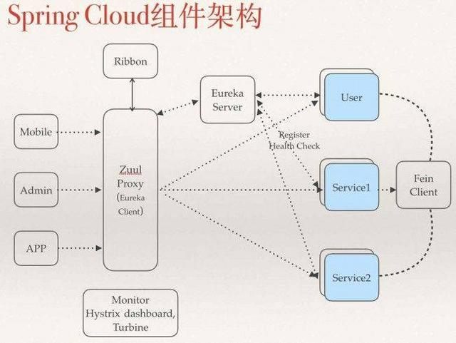
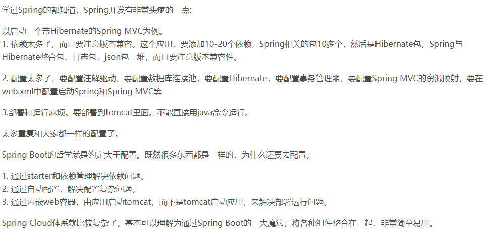

# 1.springcloud

## 1.1springboot与springcloud

- Spring boot 是 Spring 的一套快速配置脚手架，可以基于spring boot 快速开发单个**微服务**
- Spring Boot，看名字就知道是**Spring的引导**，就是**用于启动Spring**的，使得Spring的学习和使用变得快速无痛。不仅适合替换原有的工程结构，更适合**微服务开发**。
- Spring Cloud**基于Spring Boot**，为微服务体系开发中的**架构问题**，提供了一整套的解决方案——服务注册与发现，服务消费，服务保护与熔断，网关，分布式调用追踪，分布式配置管理等。
- Spring Cloud是一个基于Spring Boot实现的云应用开发工具；Spring boot专注于快速、方便集成的**单个个体**，Spring Cloud是关注**全局的服务治理框架**

