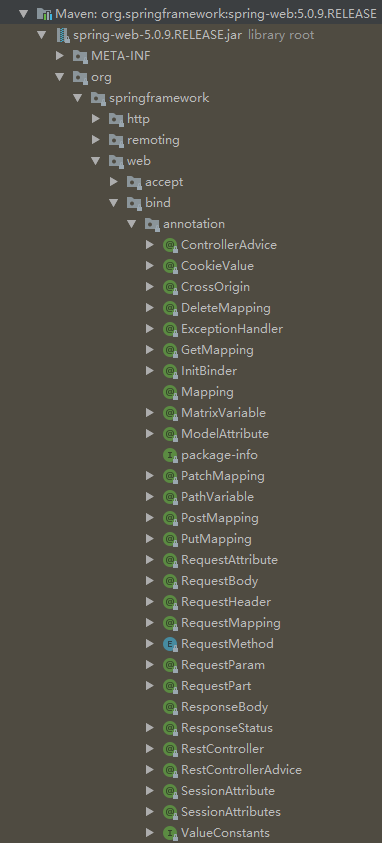

# 控制层相关注解



- 前端请求类型

```xml
Content-Type:

    application/x-www-form-urlencoded		//Http协议中默认编码的内容 @RequestParam 处理

    application/json, application/xml等		//必须使用 @RequestBody 来处理

    multipart/form-data
```
- application/x-www-form-urlencoded
  - 这种情况的数据@RequestParam,@ModelAttribute可以处理，当然@RequestBody 也能处理。
- multipart/form-data
  - 使用 @RequestBody 不能处理这种格式的数据
- 其他格式（包括application/json, application/xml等）
  - 必须使用 @RequestBody 来处理

# 1.@RequestParam

- 用来处理Content-Type: 为 application/x-www-form-urlencoded编码的内容。（Http协议中，如果不指定Content-Type，则默认传递的参数就是application/x-www-form-urlencoded类型）
- 在Content-Type: application/x-www-form-urlencoded的请求中，get 方式中queryString的值，和post方式中 body data的值都会被Servlet接受到并转化到Request.getParameter()参数集中，所以@RequestParam可以获取的到。
- 如果传输的是单层json对象，我们后台可以直接用 @RequestParam接收；如果传输的是**多层嵌套json对象**，这个时候会就会出现数据丢失问题

# 2.@RequestBody

- 在GET请求中，不能使用@RequestBody。
- 在POST请求，可以使用@RequestBody和@RequestParam，但是如果使用@RequestBody，对于参数转化的配置必须统一。

# 3.@ResponseBody

# 4.@RequestMapping

4.1@GetMapping

4.2@PostMapping

4.3@PutMapping

4.4@DeleteMapping

4.5@PatchMapping

4.6@PathVariable

# 5.@CrossOrigin