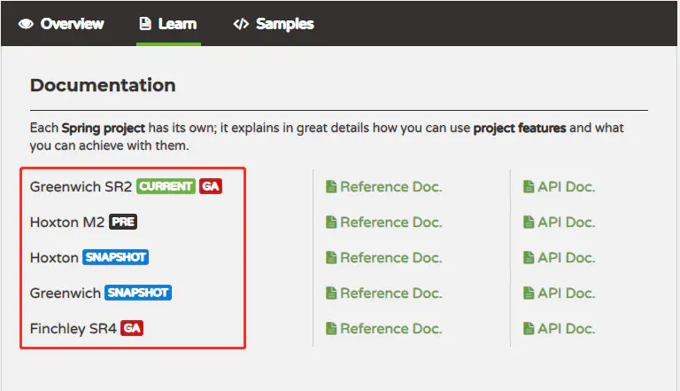

# Spring 版本

# SpringBoot 版本

# SpringCloud 版本

SpringCloud 主项目版本命名并没有采数字版本化的形式，而是采用了英文名称。它选择英国伦敦地铁站的名称来命名，并按地铁站名称的首字母A-Z依次命名

## 大版本号

| Spring Cloud 大版本 | Spring Boot 大版本                             | 说明                                                         |
| ------------------- | ---------------------------------------------- | ------------------------------------------------------------ |
| Angel               | 兼容Spring Boot 1.2.x                          | 不建议使用                                                   |
| Brixton             | 兼容Spring Boot 1.3.x，也兼容Spring Boot 1.4.x | 不建议使用                                                   |
| Camden              | 兼容Spring Boot 1.4.x，也兼容Spring Boot 1.5.x | 不建议使用                                                   |
| Dalston             | 兼容Spring Boot 1.5.x，不兼容Spring Boot 2.0.x | 不建议使用                                                   |
| Edgware             | 兼容Spring Boot 1.5.x，不兼容Spring Boot 2.0.x | [已于2019/08/01 退役](https://spring.io/blog/2019/01/23/spring-cloud-greenwich-release-is-now-available) |
| Finchley            | 兼容Spring Boot 2.0.x，不兼容Spring Boot 1.5.x | 要求 jdk1.8                                                  |
| Greenwich           | 兼容Spring Boot 2.1.x                          | 推荐使用                                                     |
| Hoxton              | 兼容Spring Boot 2.2.x                          | 目前版本到 M2                                                |

如上，Spring Cloud Edgware 已退役，而Finchley 版本作为 Spring Boot 2.0.x 的主要版本，Finchley 的生命周期也会由 Spring Boot 2.0.x 版本的终止而终止。因此不管是学习还是使用，目前仅推荐 Greenwich 版。

## 小版本号

| Spring Cloud 版本        | Spring Boot 版本     |
| ------------------------ | -------------------- |
| Finchley.M9              | 2.0.0.RELEASE        |
| Finchley.RC1             | 2.0.1.RELEASE        |
| Greenwich.BUILD-SNAPSHOT | 2.1.8.BUILD-SNAPSHOT |
| Greenwich.RELEASE        | 2.1.2.RELEASE        |
| Greenwich.SR1            | 2.1.3.RELEASE        |
| Greenwich.SR2            | 2.1.5.RELEASE        |

### 版本号含义

Spring Cloud 处于快速迭代状态，开发的不同阶段对应着不同的版本号，一个大版本是从 **BUILD-SNAPSHOT** 开始的，他表示**快照版本**，这个版本的代码不是固定的，而是处于变化之中。

等到开发到了一定的阶段比如50%，就会发布一个**MX** 版本，他表示**里程碑版**。比如M1表示第一个里程碑版

经过数个里程碑版后，已经开发的差不多了，这是会发布**候选发布版(RCX)**，该版本为正式版提供一个发行观察期，主要修复一些bug，RC1 表示第一个候选发布版在经过一个或多个候选发布版后，**正式版(RELEASE)** 就发布了

正式版发布之后，如果有被发现了错误和bug，修复之后就会发布**SRX版**，他也叫正式版。

**总结**

| 版本号         | 含义                               |
| -------------- | ---------------------------------- |
| BUILD-SNAPSHOT | 快照版，代码不是固定，处于变化之中 |
| MX             | 里程碑版                           |
| RCX            | 候选发布版                         |
| RELEASE        | 正式发布版                         |
| SR2            | 正式发布版                         |

在SpringCloud 官网上，每个版本号后面还带有一个英文标示，它们的含义如下：

| 标示     | 含义               |
| -------- | ------------------ |
| CURRENT  | 当前推荐的版本     |
| GA       | 稳定版，可用于生产 |
| PRE      | 里程碑版           |
| SNAPSHOT | 快照               |

## 查找 SpringCloud 与 SpringBoot 版本对应关系

 Spring Cloud 与 Spring Boot 的版本，并不是一一对应的，而是 Spring Boot 只要满足一定的版本区间都可以。

具体可参见spring cloud官网 [Reference Doc]

