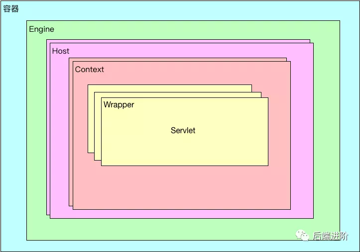
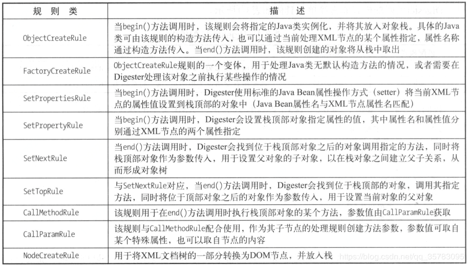

# Tomcat部署

http://tomcat.apache.org/tomcat-8.5-doc/appdev/deployment.html
应用文件格式WAR(Web Application Archive)
应用标准目录WEB-INF/web.xml,WEB-INF/lib/, .jsp,.html,etc.
应用自用库放WEB-INF/lib,所有应用公用库放CATALINA_HOME/lib.
描述文件:
`/WEB-INF/web.xml`:由Servlet规范定义的。配置文档见：http://tomcat.apache.org/tomcat-8.5-doc/appdev/web.xml.txt
`/META-INF/context.xml`:Tomcat Context配置文件，该文件以`Context`元素为根，实际运行时文件中的配置会作为Tomcat配置的`Host`元素的子元素。注意：此处/META-INF不是/WEB-INF/META-INF.配置文档见：http://tomcat.apache.org/tomcat-8.5-doc/config/context.html


## 部署方式

1、直接拷贝项目文件夹/war包，到webapps下

2、在server.xml中指定

3、在conf目录中，新建 Catalina＼localhost目录，在该目录中新建一个xml文件，名字不可以随意取，要和path后的那个名字一致

```xml
<Context path="/myHttpServlet" docBase="E:\temp\httpservletDemo" debug="0" privileged="true" reloadable="true"></Context>
```

注意：`E:\temp\httpservletDemo`中，`httpservletDemo`是web项目文件夹（即war包解压出来的文件夹）

3、使用tomcat /manager应用来部署


Host配置：

```xml
<Host name="localhost"  appBase="webapps"
      unpackWARs="true" autoDeploy="true">

    <Valve className="org.apache.catalina.valves.AccessLogValve" directory="logs"
           prefix="localhost_access_log" suffix=".txt"
           pattern="%h %l %u %t &quot;%r&quot; %s %b" />

    <Context Path="" docbase="E:\demo-projects\springmvc\springmvcAbstractController\target\myAbstractController" Debug="0" Privileged="True" Reloadable="True"></Context>

</Host>
```


Context配置

```xml
<Context path="/hello" docBase="D:\ workspace\hello\WebRoot" debug="0" privileged="true"> 
</Context>
```

> path是虚拟路径；
>
> docBase 是应用程序的物理路径；
>
> workDir 是这个应用的工作目录，存放运行时生成的与这个应用相关的文件；
>
> debug 则是设定debug level, 0表示提供最少的信息，9表示提供最多的信息
>
> privileged设置为true的时候，才允许Tomcat的Web应用使用容器内的Servlet
>
> reloadable 如果为true，则tomcat会自动检测应用程序的/WEB-INF/lib 和/WEB-INF/classes目录的变化，自动装载新的应用程序，可以在不重起tomcat的情况下改变应用程序，实现热部署
>
> antiResourceLocking和antiJARLocking 热部署时需要配置的参数，默认false避免更新了某个webapp。
> 有时候Tomcat并不能把旧的webapp完全删除，通常会留下WEB-INF/lib下的某个jar包，必须关闭Tomcat才能删除，这就导致自动部署失败。设置为true，Tomcat在运行对应的webapp时，会把相应的源文件和jar文件复制到一个临时目录里。


## 热加载

一般在开发环境中我们使用的是热加载，因为热加载的实现的方式在Web容器中启动一个后台线程，定期检测相关文件的变化，如果有变化就重新加载类，这个过程不会清空Session。


## 热部署

在生产环境我们一般应用的是热部署，热部署也是在Web应用后台线程定期检测，发现有变化就会重新加载整个Web应用，这种方式更加彻底会清空Session。


# Tomcat详解

- tomcat 8.5.38


## 导入idea


## 编译

在ContextConfig.java中

```java
//运行项目，访问http://localhost:8080,原因是我们直接启动org.apache.catalina.startup.Bootstrap的时候
// 没有加载org.apache.jasper.servlet.JasperInitializer，从而无法编译JSP。解决办法是在tomcat的源码
// org.apache.catalina.startup.ContextConfig中的configureStart函数中手动将JSP解析器初始化：

context.addServletContainerInitializer(new JasperInitializer(), null);
```


## 原理解析


### 整体架构





- Engine：表示一个虚拟主机的引擎，一个 Tomcat Server 只有一个 引擎，连接器所有的请求都交给引擎处理，而引擎则会交给相应的虚拟主机去处理请求；
  - Host：表示虚拟主机，一个容器可以有多个虚拟主机，每个主机都有对应的域名，在 Tomcat 中，一个 webapps 就代表一个虚拟主机，当然 webapps 可以配置多个；
    - Context：表示一个应用容器，一个虚拟主机可以拥有多个应用，webapps 中每个目录都代表一个 Context，每个应用可以配置多个 Servlet。


### 架构图


### 内部组件

tomcat的组件主要包括:

- server：整个servlet容器，一个tomcat对应一个server，一个server包含多个service

  server在tomcat中的实现类是：StandardServer

- service： Tomcat 默认的 Service 服务是 Catalina，一个service包含多个connector（ 因为 Tomcat 支持多种网络协议，包括 HTTP/1.1、HTTP/2、AJP 等等 ），和一个container（容器）。多个connector共享一个container容器。

  service在tomcat中的实现类是：StandardService

- connector：链接器，负责处理客户端请求，解析不同协议及io方式。 连接器与容器之间通过 ServletRequest 和 ServletResponse 对象进行交流。 

- executor：线程池

- container：包含engine，host，context，wrapper等组件。

- engine：servlet引擎，container容器中顶层的容器对象，一个engine可以包含多个host主机。 默认的情况下 conf/server.xml 配置文件中定义了一个名为Catalina的Engine。 

  engine在tomcat中的实现类是：StandardEngine

- host： 代表一个站点，也可以叫虚拟主机 ，一个host对应一个网络域名，一个Host可以配置多个Context，在server.xml文件中的默认配置为, 其中一个Engine包含多个Host的设计，使得一个服务器实例可以承担多个域名的服务，是很灵活的设计。

  host在tomcat中的实现类是：StandardHost

- context：代表一个应用程序，就是日常开发中的web程序，或者一个WEB-INF目录以及下面的web.xml文件，换句话说每一个运行的webapp最终都是以Context的形式存在，每个Context都有一个根路径和请求路径；与Host的区别是Context代表一个应用，如，默认配置下webapps下的每个目录都是一个应用，其中ROOT目录中存放主应用，其他目录存放别的子应用，而整个webapps是一个站点。 

  ```xml
  在Tomcat中通常采用如下方式创建一个Context：
  
  	1. 在/webapps 目录中创建一个目录dirname，此时将自动创建一个context，默认context的访问url为http://host:port/dirname，也可以通过在ContextRoot\META-INF 中创建一个context.xml文件，其中包含如下内容来指定应用的访问路径：
  
  	2. 在server.xml文件中增加context 元素，如下：
  	<Context path="/urlpath" docBase="/test/xxx" reloadable=true />
  ```

  context在tomcat中的实现类是：StandardContext

- wrapper：tomcat中最小的容器单元，表示web应用中的servlet。

  一个Context可以包含多个Servlet处理不同请求，当然现在的SpringMVC，struts框架的出现导致程序中不再是大量的Servlet，但其实本质是没变的，都是由Servlet来处理或者当作入口。
  
  在tomcat中Servlet被称为wrapper。
  
  >  那么为什么要用Wrapper来表示Servlet？这和tomcat的处理机制有关，为了更加灵活，便于扩展，tomcat是用管道（pipeline）和阀(valve)的形式来处理请求，所以将Servlet丢给Wrapper。 
  
- wrapper在tomcat中的实现类是：StandardWrapper


 也可以从 server.xml 的配置结构可以看出 tomcat 整体的内部结构： 

```xml
<Server port="8005" shutdown="SHUTDOWN">

  <Service name="Catalina">

    <Connector connectionTimeout="20000" port="8080" protocol="HTTP/1.1" redirectPort="8443" URIEncoding="UTF-8"/>

    <Connector port="8009" protocol="AJP/1.3" redirectPort="8443"/>

    <Engine defaultHost="localhost" name="Catalina">

      <-- appBase=webapps， 也就是/webapps目录，
          unpackingWARS=true 属性指定在appBase指定的目录中的war包都自动的解压，
          autoDeploy=true 属性指定对加入到appBase目录的war包进行自动的部署。->
      <Host appBase="webapps" autoDeploy="true" name="localhost" unpackWARs="true">

        <Context docBase="handler-api" path="/handler" reloadable="true" source="org.eclipse.jst.jee.server:handler-api"/>
      </Host>
    </Engine>
  </Service>
</Server>
```


所以tomcat结构大致如下：


组件关系继承图


## 源码解析


| 一级模块                    | 二级模块        | 代码量 | 用途                                                         |
| --------------------------- | --------------- | ------ | ------------------------------------------------------------ |
|                             | ant             |        | 使用ant集成jmx,方便运行时对tomcat进行管理                    |
|                             | connector       |        | 处理连接，如HttpServletRequest等                             |
|                             | core            |        | 核心实现                                                     |
|                             | deploy          |        | 部署模块                                                     |
|                             | filters         |        | 内置的一些Filter实现                                         |
|                             | loader          |        | High Availiable缩写，处理Tomcat集群                          |
|                             | manager         |        |                                                              |
|                             | mbeans          |        | tomcat内置的jmx                                              |
|                             | realm           |        | tomcat管理页面的控制权限                                     |
|                             | security        |        | 安全相关                                                     |
|                             | servlet4preview |        | servlet4.0前瞻                                               |
|                             | servlets        |        | servlet实现类                                                |
|                             | session         |        | HttpSession相关                                              |
|                             | ssi             |        | server side include,用于替换html片段，类似nginx处理ssi资源   |
|                             | startup         |        | 启动tomcat容器                                               |
|                             | storeconfig     |        | 配置信息                                                     |
|                             | values          |        | 阀门组件。Values是tomcat中责任链模式的实现，通过链接多个Value对请求进行处理 |
|                             | tribes          |        | 部落组件，用于tomcat之间通信                                 |
| catalina（核心部分）        | webresources    |        | 用于处理 jar,war等文件                                       |
|                             | ajp             |        | ajp协议                                                      |
|                             | http11          |        |                                                              |
| coyote（支持各种协议）      | http2           |        |                                                              |
|                             | dbcp            |        | 数据库连接池实现                                             |
|                             | jni             |        | native实现，需要使用tomcat提供的tomcat-native.tar.gz         |
|                             | websocket       |        | 对javax.websocket的实现                                      |
| tomcat（对javax的一些实现） | util            |        | 各种工具类，包括对jdk的封装                                  |
| el                          |                 |        | el表达式                                                     |
| jasper                      |                 |        | 支持jsp                                                      |
| juli                        |                 |        | 日志                                                         |
| naming                      |                 |        | jndi                                                         |


### daemon.load() 加载

```java
Bootstrap.main()->Bootstrap.load()->Catalina.load()
    ->初始化的依据是什么？考虑coder的设计server.xml
->Lifecycle.init()->LifecycleBase.init()->LifecycleBase.initInternal()
    ->StandardServer.initInternal()->services[i].init()
    ->StandardService.initInternal()->executor.init()/ connector.init()
    ->LifecyleBase.initInternal()->Connector.initInternal()->protocolHandler.init()
    ->AbstractProtocol.init()->endpoint.init()->bind()
    ->Apr,JIo,NIO,NIO2
```


### daemon.start() 启动 

```java
Bootstrap.start()->Catalina.start()->getServer.start()->LifecycleBase.start()
    ->LifecycleBase.startInternal()->StandardServer.startInternal()
    ->services[i].start()->StandardService.startInternal() 
    -> container.start()[查看一下Container接口] 
    	/executors.init()/connectors.start()/engine.start()
    -> StandardEngine.startInternal()
	查看一下StandardEngine类关系结构图，发现ContainerBase是它的爸爸，而这个爸爸有多少孩子呢？
	->(ContainerBase中)super.startInternal()
    -> 代码呈现，关注到
    	new StartChild(children[i])—>child.start()
    也就是会调用Engine子容器的start方法，那子容器是什么呢？->
    Host，child.start->LifecycleBase.start()->startInternal()
    ->StandardHost.startInternal() Host将一个个web项目加载进来
    ->super.startInternal()->ContainerBase.startInternal()
    ->最后 threadStart() ->new Thread(new ContainerBackgroundProcessor())
    -> run() [->processChildren(ContainerBase.this)]
    
    ->container.backgroundProcess()->ContainerBase.backgroundProcess()
	->fireLifecycleEvent(Lifecycle.PERIODIC_EVENT, null)
    ->listener.lifecycleEvent(event)->interested[i].lifecycleEvent(event)
    ->监听器HostConfig->HostConfig.lifecycleEvent(LifecycleEvent event)
    ->check()-> deployApps()
	
    Engine,Host,Context,Wrapper都是它的孩子

    results.add(startStopExecutor.submit(new StartChild(children[i])))

    回到StandardHost.startInternal() ->super.startInternal()
    ->results.add(startStopExecutor.submit(new StartChild(children[i])));

	然后又会调用它的子容器: 
	super.startInternal()->StandardContext.initInternal()
       ->StandardContext.startInternal()解析每个web项目

    ContextConfig.webConfig()的step9解析到servlets包装成wrapper对象
    何时调用loadOnstartup()?

    StandardContext.startInternal()
    ->最终会调用 if (!loadOnStartup(findChildren()))
```


### init过程

tomcat的入口类为BootStrap的main方法

#### BootStrap

```JAVA
public static void main(String args[]) {
        .....
        //初始化    
        bootstrap.init();
        .....
        if (command.equals("startd")) {
            args[args.length - 1] = "start";
            //实例化各组件 调用Catalina类的load方法
            daemon.load(args);
            //启动各组件 调用Catalina类的start方法
            daemon.start();
        }
        .....
}
```

 bootstrap.init()的工作是初始化Bootstrap类，包含初始化类加载器 

```java
public void init() throws Exception {
    //初始化类加载
    initClassLoaders();
    ......
    //实例化Catalina类
    Class<?> startupClass = catalinaLoader.loadClass("org.apache.catalina.startup.Catalina");
    Object startupInstance = startupClass.getConstructor().newInstance();
    ......
    catalinaDaemon = startupInstance;

}
```

#### Catalina

接着调用刚初始化的Catalina类的实例catalinaDaemon的load()方法，重要的就两点

```java
public void load() {
    .....
    // Digester... 实例化组件
    Digester digester = createStartDigester();
    .....加载server.xml......
    file = configFile();
    inputStream = new FileInputStream(file);
    inputSource = new InputSource(file.toURI().toURL().toString());
    ......
    // 初始化sever
    getServer().init();
}
```

#### Digester

Digester是一种将xml转化为java对象的事件驱动型工具，通过读取xml文件，当识别到特定的节点的时候会执行特定的动作，创建java对象或者执行对象的某个方法



通过Digester去创建了Catania中的大量初始化工作，具体详见源码：

```java
// 创建server实例
digester.addObjectCreate("Server",
                         "org.apache.catalina.core.StandardServer",
                         "className");
//创建Executor
digester.addObjectCreate("Server/Service/Executor",
                         "org.apache.catalina.core.StandardThreadExecutor",
                         "className");
...等等大量初始化工作...
```

接着讲，getServer().init()方法的作用是初始化Sever，调用LifecycleBase的init()方法，在init方法中调用的是StandardServer类initInternal()方法

#### StandardServer


StandardServer类initInternal()方法：

```java
/**
 * Invoke a pre-startup initialization. This is used to allow connectors
 * to bind to restricted ports under Unix operating environments.
 */
@Override
protected void initInternal() throws LifecycleException {

    super.initInternal();
    // ...省略很多，但是主要的在下面...
    // Initialize our defined Services
    for (int i = 0; i < services.length; i++) {
        //调用services的init
        services[i].init();
    }
}
```

前面的时候讲过一个server初始化多个services；

#### StandardService

services[i].init();初始化的是StandardService类，类图如下


StandardService的initInternal() 方法的工作是初始化engine组件，初始化线程池，初始化mapperListener，初始化connector

```java
/**
 * Invoke a pre-startup initialization. This is used to allow connectors
 * to bind to restricted ports under Unix operating environments.
 */
@Override
protected void initInternal() throws LifecycleException {

    super.initInternal();
    //初始化engine
    engine.init();
    //初始化线程池
    // Initialize any Executors
    for (Executor executor : findExecutors()) {
        if (executor instanceof JmxEnabled) {
            ((JmxEnabled) executor).setDomain(getDomain());
        }
        executor.init();
    }
    //初始化mapperListener
    // Initialize mapper listener
    mapperListener.init();
    //初始化connector
    connector.init();
     
}
```

初始化executor，mapperListener，connector后面再讲其作用，先接初始化engine

#### StandardEngine


在StandardEngine的初始化中并没有直接调用host的初始化，而是调用的父类containerBase的initInternal的方法：

```java
//StandardEngine
@Override
protected void initInternal() throws LifecycleException {
    // Ensure that a Realm is present before any attempt is made to start
    // one. This will create the default NullRealm if necessary.
    getRealm();
    super.initInternal();
}

//containerBase
 @Override
 protected void initInternal() throws LifecycleException {
        BlockingQueue<Runnable> startStopQueue = new LinkedBlockingQueue<>();
        startStopExecutor = new ThreadPoolExecutor(
                getStartStopThreadsInternal(),
                getStartStopThreadsInternal(), 10, TimeUnit.SECONDS,
                startStopQueue,
                new StartStopThreadFactory(getName() + "-startStop-"));
        startStopExecutor.allowCoreThreadTimeOut(true);
        super.initInternal();
    }
```

<font color=#dd0000>host的init是在start阶段去做的</font>，所以后面再说

#### executor

executor.init();默认调用LifecycleMBeanBase的initInternal方法

#### mapperListener

mapperListener.init();也默认调用LifecycleMBeanBase的initInternal方法

#### connector

connector的初始化调用Connector类的initInternal方法，主要是new了一个CoyoteAdapter，初始化protocolHandler

```java
@Override
protected void initInternal() throws LifecycleException {

    super.initInternal();

    // 实例化 CoyoteAdapter 适配器
    adapter = new CoyoteAdapter(this);
    protocolHandler.setAdapter(adapter);
    ......
    try {
        //初始化 protocolHandler
        protocolHandler.init();
    } catch (Exception e) {
        throw new LifecycleException(
                sm.getString("coyoteConnector.protocolHandlerInitializationFailed"), e);
    }
}
```

ProtocolHandler.init();的实现：


AbstractProtocol是调用endpoint的init方法，这个方法中调用bind()

```java
@Override
public void init() throws Exception {
   //初始化endpoint
   endpoint.init();
}
```

bind()针对不同的io类型提供了三种的默认实现


进入NioEndpoint类的bind()

```java
/**
 * Initialize the endpoint.
 */
@Override
public void bind() throws Exception {
    //使用nio方式监听端口
    if (!getUseInheritedChannel()) {
        serverSock = ServerSocketChannel.open();
        socketProperties.setProperties(serverSock.socket());
        InetSocketAddress addr = (getAddress()!=null?new InetSocketAddress(getAddress(),getPort()):new InetSocketAddress(getPort()));
        serverSock.socket().bind(addr,getAcceptCount());
    } 
    //设置非阻塞
    serverSock.configureBlocking(true); //mimic APR behavior
    ......
    //开启selectorPool
    selectorPool.open();
}
```

#### Mapper

Tomcat 是如何来定位 Servlet 的呢？答案是利用 Mapper 组件来完成定位的工作。

<font color=#dd0000>Mapper 最主要的核心功能是保存容器组件之间访问路径的映射关系</font>

我们先从源码入手：

org.apache.catalina.core.StandardService：

```java
protected final Mapper mapper = new Mapper();
protected final MapperListener mapperListener = new MapperListener(this);
```

 Service 实现类中，已经初始化了 Mapper 组件以及它的监听类 MapperListener。


在 Service 服务启动的时候，会调用 MapperListener.start() 方法，最终会执行 MapperListener 的 startInternal 方法：

org.apache.catalina.mapper.MapperListener#startInternal：

```java
Container[] conHosts = engine.findChildren();
for (Container conHost : conHosts) {
  Host host = (Host) conHost;
  if (!LifecycleState.NEW.equals(host.getState())) {
    // Registering the host will register the context and wrappers
    registerHost(host);
  }
}
```

该方法会注册新的虚拟主机，接着 registerHost() 方法会注册 context，以此类推，从而将容器组件直接的访问的路径都注册到 Mapper 中。

定位 Servlet 的流程图：


### start过程

tomcat的start阶段与init阶段相似，都是逐层调用，稍有不同的是在于engine，host，context，wrapper的启动方式；

首先回到Bootstrap的main方法中，继续执行Catalina类的start()，在start()方法中调getServer().start();

调用LifecycleBase类的start()方法，在这个方法中调动StandardServer类实现的startInternal()，在这个类中继续调用service的star()方法，以此类推逐层start调用，直到调用engine的start()，我们看下engine的start()方法，在看下StandardEngine的类图:


StandardEngine的startInternal()调用ContainerBase的startInternal()

```java
/**
 * Start this component and implement the requirements
 * of {@link org.apache.catalina.util.LifecycleBase#startInternal()}.
 *
 * @exception LifecycleException if this component detects a fatal error
 *  that prevents this component from being used
 */
@Override
protected synchronized void startInternal() throws LifecycleException {

    // ......
    // Start our child containers, if any
    Container children[] = findChildren();
    List<Future<Void>> results = new ArrayList<>();
    for (int i = 0; i < children.length; i++) {
        results.add(startStopExecutor.submit(new StartChild(children[i])));
    }
    // ......
}
```

findChildren()的方法找到的是engine容器的子容器，然后再new StartChild(children[i])中调用子类容器的start()；使用这种方式依次启动子容器。


### NioEndPoint线程池启动过程


org.apache.catalina.core.StandardService#startInternal

```java
@Override
protected void startInternal() throws LifecycleException {
    if(log.isInfoEnabled())
        log.info(sm.getString("standardService.start.name", this.name));
    setState(LifecycleState.STARTING);

    // Start our defined Container first
    if (engine != null) {
        synchronized (engine) {
            engine.start();
        }
    }

    synchronized (executors) {
        for (Executor executor: executors) {
            executor.start();
        }
    }

    mapperListener.start();

    // Start our defined Connectors second
    synchronized (connectorsLock) {
        for (Connector connector: connectors) {
            try {
                // If it has already failed, don't try and start it
                if (connector.getState() != LifecycleState.FAILED) {
                    connector.start();
                }
            } catch (Exception e) {
                log.error(sm.getString(
                    "standardService.connector.startFailed",
                    connector), e);
            }
        }
    }
}
```


org.apache.catalina.connector.Connector#startInternal

```java
/**
     * Begin processing requests via this Connector.
     *
     * @exception LifecycleException if a fatal startup error occurs
     */
    @Override
    protected void startInternal() throws LifecycleException {

        // Validate settings before starting
        if (getPort() < 0) {
            throw new LifecycleException(sm.getString(
                    "coyoteConnector.invalidPort", Integer.valueOf(getPort())));
        }

        setState(LifecycleState.STARTING);

        try {
            protocolHandler.start();
        } catch (Exception e) {
            throw new LifecycleException(
                    sm.getString("coyoteConnector.protocolHandlerStartFailed"), e);
        }
    }
```


org.apache.coyote.AbstractProtocol#start

```java
@Override
    public void start() throws Exception {
        if (getLog().isInfoEnabled()) {
            getLog().info(sm.getString("abstractProtocolHandler.start", getName()));
        }

        endpoint.start();

        // Start async timeout thread
        asyncTimeout = new AsyncTimeout();
        Thread timeoutThread = new Thread(asyncTimeout, getNameInternal() + "-AsyncTimeout");
        int priority = endpoint.getThreadPriority();
        if (priority < Thread.MIN_PRIORITY || priority > Thread.MAX_PRIORITY) {
            priority = Thread.NORM_PRIORITY;
        }
        timeoutThread.setPriority(priority);
        timeoutThread.setDaemon(true);
        timeoutThread.start();
    }
```


org.apache.tomcat.util.net.AbstractEndpoint#start

```java
public final void start() throws Exception {
        if (bindState == BindState.UNBOUND) {
            bind();
            bindState = BindState.BOUND_ON_START;
        }
        startInternal();
    }
```


org.apache.tomcat.util.net.AbstractEndpoint#startInternal

|

org.apache.tomcat.util.net.NioEndpoint#startInternal

```java
/**
     * Start the NIO endpoint, creating acceptor, poller threads.
     */
    @Override
    public void startInternal() throws Exception {

        if (!running) {
            running = true;
            paused = false;

            processorCache = new SynchronizedStack<>(SynchronizedStack.DEFAULT_SIZE,
                    socketProperties.getProcessorCache());
            eventCache = new SynchronizedStack<>(SynchronizedStack.DEFAULT_SIZE,
                    socketProperties.getEventCache());
            //申请nioChannel 默认128个 为什么有这个东西
            //其实这个东西就是申请了系统内存io读写直接使用系统内存的效率比堆内存好快很多
            //
            //当然申请系统内存会有很大的开销，所以直接初始一些出来，这样要用的时候直接可以
            // 使用、当socket关闭的时候、nioChannel并不会被销毁、而是重新放入这个队列中、重复被使用
            //
            //总之可以理解内核复用技术、类似netty的内核复用技术
            nioChannels = new SynchronizedStack<>(SynchronizedStack.DEFAULT_SIZE,
                    socketProperties.getBufferPool());

            // Create worker collection
            if (getExecutor() == null) {
                //构建线程池executor 它是用来处理SocketProcessor
                //换句话主要是用来对socket进行读写封装成request对象然后做业务处理
                //我们常常用的controller也是使用这个线程来执行的
                createExecutor();
            }

            initializeConnectionLatch();

            // Start poller threads
            // 初始化poller,默认是两个poller
            // poller主要循环扫描PollerEvent队列是否存在待处理请求
            // 如果存在PollerEvent待处理，进行请求解析封装,启动Executor线程进行请求读处理
            pollers = new Poller[getPollerThreadCount()];
            for (int i = 0; i < pollers.length; i++) {
                pollers[i] = new Poller();
                Thread pollerThread = new Thread(pollers[i], getName() + "-ClientPoller-" + i);
                pollerThread.setPriority(threadPriority);
                pollerThread.setDaemon(true);
                pollerThread.start();
            }

            //启动Acceptor 默认使用一单线程处理连接
            startAcceptorThreads();
        }
    }
```


**总结**：

请求先到达acceptor线程 ，然后转交给pollor线程，最后交给executor线程池处理


#### acceptor线程：


```java
protected final void startAcceptorThreads() {
    int count = getAcceptorThreadCount();
    acceptors = new Acceptor[count];

    for (int i = 0; i < count; i++) {
        acceptors[i] = createAcceptor();
        String threadName = getName() + "-Acceptor-" + i;
        acceptors[i].setThreadName(threadName);
        Thread t = new Thread(acceptors[i], threadName);
        t.setPriority(getAcceptorThreadPriority());
        t.setDaemon(getDaemon());
        t.start();
    }
}
```


org.apache.tomcat.util.net.NioEndpoint.Acceptor

```java
    /**
     * The background thread that listens for incoming TCP/IP connections and
     * hands them off to an appropriate processor.
     */
protected class Acceptor extends AbstractEndpoint.Acceptor {

    @Override
    public void run() {

        int errorDelay = 0;

        // Loop until we receive a shutdown command
        while (running) {
			
            //......
            
            try {
                //if we have reached max connections, wait、
                // 如果有请求, 则首先通过 countUpOrAwaitConnection 来获取请求处理得许可(用的是LimitLatch)
                countUpOrAwaitConnection();

                SocketChannel socket = null;
                try {
                    // Accept the next incoming connection from the server
                    // socket
                    // 在没有网络 IO 数据时, 该线程会一直在此阻塞
                    socket = serverSock.accept();
                }
                // Successful accept, reset the error delay
                errorDelay = 0;

                // Configure the socket
                if (running && !paused) {
                    // setSocketOptions() will hand the socket off to
                    // an appropriate processor if successful
                    if (!setSocketOptions(socket)) {
                        closeSocket(socket);
                    }
                } else {
                    closeSocket(socket);
                }
            }
        }
        state = AcceptorState.ENDED;
    }
}
```


org.apache.tomcat.util.net.NioEndpoint#setSocketOptions

```java
protected boolean setSocketOptions(SocketChannel socket) {
    // Process the connection
    try {
        //disable blocking, APR style, we are gonna be polling it
        socket.configureBlocking(false);
        Socket sock = socket.socket();
        socketProperties.setProperties(sock);

        NioChannel channel = nioChannels.pop();
        if (channel == null) {
            //......
        }
        getPoller0().register(channel);
    }
}
```


```java
/**
         * Registers a newly created socket with the poller.
         *
         * @param socket The newly created socket
         */
public void register(final NioChannel socket) {
    socket.setPoller(this);
    NioSocketWrapper ka = new NioSocketWrapper(socket, NioEndpoint.this);
    socket.setSocketWrapper(ka);
    ka.setPoller(this);
    ka.setReadTimeout(getSocketProperties().getSoTimeout());
    ka.setWriteTimeout(getSocketProperties().getSoTimeout());
    ka.setKeepAliveLeft(NioEndpoint.this.getMaxKeepAliveRequests());
    ka.setSecure(isSSLEnabled());
    ka.setReadTimeout(getConnectionTimeout());
    ka.setWriteTimeout(getConnectionTimeout());
    PollerEvent r = eventCache.pop();
    ka.interestOps(SelectionKey.OP_READ);//this is what OP_REGISTER turns into.
    if (r == null) r = new PollerEvent(socket, ka, OP_REGISTER);
    else r.reset(socket, ka, OP_REGISTER);
    // 添加连接事件
    addEvent(r);
}
```


```java
private void addEvent(PollerEvent event) {
    events.offer(event);
    if (wakeupCounter.incrementAndGet() == 0) selector.wakeup();
}
```


#### pollor线程

##### 接受acceptor线程的请求。


org.apache.tomcat.util.net.NioEndpoint.Poller

```java
/**
     * Poller class.
     */
public class Poller implements Runnable {

    private Selector selector;
    private final SynchronizedQueue<PollerEvent> events =
        new SynchronizedQueue<>();

    private volatile boolean close = false;
    private long nextExpiration = 0;//optimize expiration handling

    private AtomicLong wakeupCounter = new AtomicLong(0);

    private volatile int keyCount = 0;

    public Poller() throws IOException {
        this.selector = Selector.open();
    }

    /**
         * The background thread that adds sockets to the Poller, checks the
         * poller for triggered events and hands the associated socket off to an
         * appropriate processor as events occur.
         */
    @Override
    public void run() {
        // Loop until destroy() is called
        while (true) {

            boolean hasEvents = false;

            try {
                if (!close) {
                    // 处理新到来的连接请求
                    hasEvents = events();
                    if (wakeupCounter.getAndSet(-1) > 0) {
                        //if we are here, means we have other stuff to do
                        //do a non blocking select
                        keyCount = selector.selectNow();
                    } else {
                        // 等待socket事件到来
                        keyCount = selector.select(selectorTimeout);
                    }
                    wakeupCounter.set(0);
                }
                if (close) {
                    events();
                    timeout(0, false);
                    try {
                        selector.close();
                    } catch (IOException ioe) {
                        log.error(sm.getString("endpoint.nio.selectorCloseFail"), ioe);
                    }
                    break;
                }
            } catch (Throwable x) {
                ExceptionUtils.handleThrowable(x);
                log.error("", x);
                continue;
            }
            //either we timed out or we woke up, process events first
            if (keyCount == 0) hasEvents = (hasEvents | events());

            Iterator<SelectionKey> iterator =
                keyCount > 0 ? selector.selectedKeys().iterator() : null;
            // Walk through the collection of ready keys and dispatch
            // any active event.
            while (iterator != null && iterator.hasNext()) {
                SelectionKey sk = iterator.next();
                NioSocketWrapper attachment = (NioSocketWrapper) sk.attachment();
                // Attachment may be null if another thread has called
                // cancelledKey()
                if (attachment == null) {
                    iterator.remove();
                } else {
                    iterator.remove();
                    processKey(sk, attachment);
                }
            }//while

            //process timeouts
            timeout(keyCount, hasEvents);
        }//while

        getStopLatch().countDown();
    }
    
    /**
         * Processes events in the event queue of the Poller.
         *
         * @return <code>true</code> if some events were processed,
         * <code>false</code> if queue was empty
         */
    public boolean events() {
        boolean result = false;

        PollerEvent pe = null;
        for (int i = 0, size = events.size(); i < size && (pe = events.poll()) != null; i++) {
            result = true;
            try {
                pe.run();
                pe.reset();
                if (running && !paused) {
                    eventCache.push(pe);
                }
            } catch (Throwable x) {
                log.error("", x);
            }
        }

        return result;
    }
}
```


可以看到，pollor线程就是不断地从`events`中取出`PollerEvent`执行run方法。


org.apache.tomcat.util.net.NioEndpoint.PollerEvent

```java
/**
     * PollerEvent, cacheable object for poller events to avoid GC
     */
public static class PollerEvent implements Runnable {

    private NioChannel socket;
    private int interestOps;
    private NioSocketWrapper socketWrapper;

    public PollerEvent(NioChannel ch, NioSocketWrapper w, int intOps) {
        reset(ch, w, intOps);
    }

    public void reset(NioChannel ch, NioSocketWrapper w, int intOps) {
        socket = ch;
        interestOps = intOps;
        socketWrapper = w;
    }

    public void reset() {
        reset(null, null, 0);
    }

    @Override
    public void run() {
        if (interestOps == OP_REGISTER) {
            try {
                socket.getIOChannel().register(
                    socket.getPoller().getSelector(), SelectionKey.OP_READ, socketWrapper);
            } catch (Exception x) {
                log.error(sm.getString("endpoint.nio.registerFail"), x);
            }
        } else {
            final SelectionKey key = socket.getIOChannel().keyFor(socket.getPoller().getSelector());
            try {
                if (key == null) {
                    // The key was cancelled (e.g. due to socket closure)
                    // and removed from the selector while it was being
                    // processed. Count down the connections at this point
                    // since it won't have been counted down when the socket
                    // closed.
                    socket.socketWrapper.getEndpoint().countDownConnection();
                    ((NioSocketWrapper) socket.socketWrapper).closed = true;
                } else {
                    final NioSocketWrapper socketWrapper = (NioSocketWrapper) key.attachment();
                    if (socketWrapper != null) {
                        //we are registering the key to start with, reset the fairness counter.
                        int ops = key.interestOps() | interestOps;
                        socketWrapper.interestOps(ops);
                        key.interestOps(ops);
                    } else {
                        socket.getPoller().cancelledKey(key);
                    }
                }
            } catch (CancelledKeyException ckx) {
                try {
                    socket.getPoller().cancelledKey(key);
                } catch (Exception ignore) {
                }
            }
        }
    }

    @Override
    public String toString() {
        return "Poller event: socket [" + socket + "], socketWrapper [" + socketWrapper +
            "], interestOps [" + interestOps + "]";
    }
}
```


##### Poller缓存

在Poller中使用的缓存是Endpoint的缓存。keyCache和eventCache


**keyCache**

对应的socket信息的缓存，在Poller上注册的时候，从keyCache中取出KeyAttachment对象，重置这个对象，作用附件用于channel到selector上的注册。在Processor处理完数据之后，将这个KeyAttachment对象放回keyCache中。  ----- 避免频繁地创建KeyAttachment对象和GC回收。


**eventCache**

PollerEvent事件的缓存，在Poller上注册的时候，从eventCache中取出PollerEvent对象，重置这个对象，然后再放入Poller的事件队列中。Poller在处理队列的过程中，每从队列中取出一个要处理的PollerEvent事件，处理完之后，把这个PollerEvent对象放回缓存中。   ---- 避免频繁地创建PollerEvent对象和GC回收。


**processorCache**

https://tomcat.apache.org/tomcat-8.5-doc/config/http.html


#### executor线程

处理pollor线程的任务。


org.apache.tomcat.util.net.NioEndpoint.Poller#run

```java
/**
         * The background thread that adds sockets to the Poller, checks the
         * poller for triggered events and hands the associated socket off to an
         * appropriate processor as events occur.
         */
@Override
public void run() {
    // Loop until destroy() is called
    while (true) {

        boolean hasEvents = false;

        try {
            if (!close) {
                // 处理新到来的连接请求
                hasEvents = events();
                if (wakeupCounter.getAndSet(-1) > 0) {
                    //if we are here, means we have other stuff to do
                    //do a non blocking select
                    keyCount = selector.selectNow();
                } else {
                    // 等待socket事件到来
                    keyCount = selector.select(selectorTimeout);
                }
                wakeupCounter.set(0);
            }
            if (close) {
                events();
                timeout(0, false);
                try {
                    selector.close();
                } catch (IOException ioe) {
                    log.error(sm.getString("endpoint.nio.selectorCloseFail"), ioe);
                }
                break;
            }
        } catch (Throwable x) {
            ExceptionUtils.handleThrowable(x);
            log.error("", x);
            continue;
        }
        //either we timed out or we woke up, process events first
        if (keyCount == 0) hasEvents = (hasEvents | events());

        Iterator<SelectionKey> iterator =
            keyCount > 0 ? selector.selectedKeys().iterator() : null;
        // Walk through the collection of ready keys and dispatch
        // any active event.
        while (iterator != null && iterator.hasNext()) {
            SelectionKey sk = iterator.next();
            NioSocketWrapper attachment = (NioSocketWrapper) sk.attachment();
            // Attachment may be null if another thread has called
            // cancelledKey()
            if (attachment == null) {
                iterator.remove();
            } else {
                iterator.remove();
                processKey(sk, attachment);
            }
        }//while

        //process timeouts
        timeout(keyCount, hasEvents);
    }//while

    getStopLatch().countDown();
}
```


org.apache.tomcat.util.net.NioEndpoint.Poller#processKey

```java
/**
         * 这里会对SelectionKey进行处理，传递给Tomcat业务线程池，如果出现非正常情况，
         * 则调用cancelledKey取消该SelectionKey。
         * <p>
         * SelectionKey.cancel方法会移除对应的channel注册事件。
         * <p>
         * 正常情况下，该流程不会调用cancelledKey，也就是说，如果同一个socket连接前后来了
         * 两次请求，则这两次请求可能会由两个不同的业务线程来执行。
         */
protected void processKey(SelectionKey sk, NioSocketWrapper attachment) {
    try {
        if (close) {
            cancelledKey(sk);
        } else if (sk.isValid() && attachment != null) {
            if (sk.isReadable() || sk.isWritable()) {
                if (attachment.getSendfileData() != null) {
                    processSendfile(sk, attachment, false);
                } else {
                    unreg(sk, attachment, sk.readyOps());
                    boolean closeSocket = false;
                    // Read goes before write
                    if (sk.isReadable()) {
                        // socket事件处理
                        if (!processSocket(attachment, SocketEvent.OPEN_READ, true)) {
                            closeSocket = true;
                        }
                    }
                    if (!closeSocket && sk.isWritable()) {
                        if (!processSocket(attachment, SocketEvent.OPEN_WRITE, true)) {
                            closeSocket = true;
                        }
                    }
                    if (closeSocket) {
                        cancelledKey(sk);
                    }
                }
            }
        } else {
            //invalid key
            cancelledKey(sk);
        }
    } catch (CancelledKeyException ckx) {
        cancelledKey(sk);
    } catch (Throwable t) {
        ExceptionUtils.handleThrowable(t);
        log.error("", t);
    }
}
```


org.apache.tomcat.util.net.AbstractEndpoint#processSocket

```java
/**
     * Process the given SocketWrapper with the given status. Used to trigger
     * processing as if the Poller (for those endpoints that have one)
     * selected the socket.
     *
     * @param socketWrapper The socket wrapper to process
     * @param event         The socket event to be processed
     * @param dispatch      Should the processing be performed on a new
     *                          container thread
     *
     * @return if processing was triggered successfully
     */
public boolean processSocket(SocketWrapperBase<S> socketWrapper,
                             SocketEvent event, boolean dispatch) {
    try {
        if (socketWrapper == null) {
            return false;
        }
        SocketProcessorBase<S> sc = processorCache.pop();
        if (sc == null) {
            sc = createSocketProcessor(socketWrapper, event);
        } else {
            sc.reset(socketWrapper, event);
        }
        Executor executor = getExecutor();
        if (dispatch && executor != null) {
            // 传递给Tomcat业务线程池
            executor.execute(sc);
        } else {
            //当前线程执行
            sc.run();
        }
    }
    return true;
}
```


#### NioSelectorPool

#### NioBlockingSelector

#### BlockPoller

NioEndpoint对象中维护了一个NioSelecPool对象，这个NioSelectorPool中又维护了一个BlockPoller线程，这个线程就是基于辅Selector进行NIO的逻辑。以执行servlet后，得到response，往socket中写数据为例，最终写的过程调用NioBlockingSelector的write方法。


### 请求处理相关组件

`NioEndpoint` ：

NioEndpoint的原理还是对于Linux的多路复用器的使用，而在多路复用器中简单来说就两个步骤。

1. 创建一个Selector，在它身上注册各种Channel，然后调用select方法，等待通道中有感兴趣的事件发生。
2. 如果有感兴趣的事情发生了，例如是读事件，那么就将信息从通道中读取出来。

而NioEndpoint为了实现上面这两步，用了五个组件来。这五个组件是`LimitLatch`、`Acceptor`、`Poller`、`SocketProcessor`、`Executor`

> - LimitLatch：连接控制器，负责控制最大的连接数
> - Acceptor：负责接收新的连接，然后返回一个Channel对象给Poller
> - Poller：可以将其看成是NIO中Selector，负责监控Channel的状态
> - SocketProcessor：可以看成是一个被封装的任务类
> - Executor：Tomcat自己扩展的线程池，用来执行任务类


注：图中的第二列`Acceptor`应该为`Poller`


- `Acceptor` 线程组。 负责从ServerSocket中接收新的连接。 选择一个 `Poller` 将新连接添加到 `Poller` 的事件队列中。

  >  Acceptor线程的默认大小为1，我们可以在server.xml的Connector配置中增加acceptorThreadCount的大小。 

- `PollerEvent`，事件，由Acceptor线程接收到新的连接后new一个pollerEvent放入poller线程的事件队列；由`Poller`线程执行；其实现了Runable，内部逻辑为：将Channel注册进Poller线程的selector中

- `Poller` 线程组。用于监听 Socket 事件，当 Socket 可读或可写等等时，将 Socket 封装成SocketProcessor，交给woker线程执行（或自己执行）添加到 `worker` 线程池的任务队列中。

- `worker` 线程组。用于对请求进行处理，包括分析请求报文并创建 Request 对象，调用容器的 pipeline 进行处理。

- `SocketProcessor`：负责对Acceptor转交的Socket进行处理，包括给Socket设置属性、读取请求行和请求头等，最终将处理交给Engine的Pipeline处理。

- `ThreadPool`：执行SocketProcessor的线程来自线程池，此线程池默认的最小线程数minSpareThreads等于10，最大线程数maxThreads等于200，我们可以在server.xml的Connector配置中调整它们的大小。

- `Pipeline`：SocketProcessor线程最后会将请求进一步交给Engine容器的Pipeline，管道Pipeline包括一系列的valve，如：StandardEngineValve、AccessLogValve、ErrorReportValve、StandardHostValve、 StandardContextValve、 StandardWrapperValve，它们就像地下水管中的一个个阀门，每一个都会对请求数据做不同的处理。

- `FilterChain`：管道Pipeline的最后一个valve是StandardWrapperValve，它会负责生成Servlet和Filter实例，并将它们组织成对请求处理的链条，这里正是Tomcat与J2EE规范相结合的部分。


适配器组件`CoyoteAdapter`


### 请求处理流程

1. socket请求首先到达NioEndPoint$**Acceptor**，这里只是接收该socket请求（serverSock.accept()），设置下socket属性然后传递给NioEndPoint$Poller（保存在SynchronizedQueue events中），除此之外并不会进一步处理。Accepter线程是单线程，并且阻塞监听连接请求。 
2. NioEndPoint$Poller是角色为**Poller**的线程，一般Server有2个Poller的线程，每个拥有独立的events队列。Poller会将socket请求注册到selector，调用selector.select(selectorTimeout)获取到来的socket事件，然后对socket事件进行处理，这里的处理只是获取SelectionKey.attachment，然后封装成SocketProcessor提交给线程池（这里的线程池是Tomcat中专门处理socket业务逻辑的，也就是http-nio-8080-exec这种线程池）。 
3.  当**业务线程池**中线程工作时，就执行到SocketProcessor.run方法了。从SocketProcessor.run开始，经过Http11Processor、CoyoteAdapter、StandardEngineValve、ApplicationFilterChain的处理，最后达到HttpServlet.service方法，也就是用户自定的业务逻辑了。 


#### 接受浏览器socket请求

org.apache.tomcat.util.net.NioEndpoint.Acceptor#run

```java
public void run() {
    while (running) {
        // .......
        try {
            SocketChannel socket = null;
            try {
                socket = serverSock.accept();
            } catch (IOException ioe) {
                // ......
            }
            if (running && !paused) {
                // setSocketOptions() will hand the socket off to
                // an appropriate processor if successful
                if (!setSocketOptions(socket)) {
                    closeSocket(socket);
                }
            } 
            //......
        }
```


org.apache.tomcat.util.net.NioEndpoint#setSocketOptions

```java
protected boolean setSocketOptions(SocketChannel socket) {
    
    NioChannel channel = nioChannels.pop();
    
    getPoller0().register(channel);
}
```


org.apache.tomcat.util.net.NioEndpoint.Poller#register

```java
public void register(final NioChannel socket) {
    socket.setPoller(this);
    NioSocketWrapper ka = new NioSocketWrapper(socket, NioEndpoint.this);
    // socket.set......
    if ( r==null) 
        r = new PollerEvent(socket,ka,OP_REGISTER);
    else 
        r.reset(socket,ka,OP_REGISTER);
    addEvent(r);
}
```


org.apache.tomcat.util.net.NioEndpoint.Poller#addEvent

```java
private void addEvent(PollerEvent event) {
    events.offer(event);
    if ( wakeupCounter.incrementAndGet() == 0 ) 
        //唤醒等待在 select() 上的线程
        selector.wakeup();
}
```


#### 请求的注册处理

Tomcat初始化流程中在org.apache.tomcat.util.net.NioEndpoint#startInternal会创建Poller线程。 

```java
**
    * Start the NIO endpoint, creating acceptor, poller threads.
    */
    @Override
    public void startInternal() throws Exception {

    if (!running) {
        running = true;
        paused = false;

        processorCache = new SynchronizedStack<>(SynchronizedStack.DEFAULT_SIZE,
                                                 socketProperties.getProcessorCache());
        eventCache = new SynchronizedStack<>(SynchronizedStack.DEFAULT_SIZE,
                                             socketProperties.getEventCache());
        nioChannels = new SynchronizedStack<>(SynchronizedStack.DEFAULT_SIZE,
                                              socketProperties.getBufferPool());

        // Create worker collection
        if ( getExecutor() == null ) {
            createExecutor();
        }

        initializeConnectionLatch();

        // Start poller threads
        pollers = new Poller[getPollerThreadCount()];
        for (int i=0; i<pollers.length; i++) {
            pollers[i] = new Poller();
            Thread pollerThread = new Thread(pollers[i], getName() + "-ClientPoller-"+i);
            pollerThread.setPriority(threadPriority);
            pollerThread.setDaemon(true);
            pollerThread.start();
        }

        startAcceptorThreads();
    }
}
```


Poller.run方法中，首先会处理新到来的连接请求事件（将socket注册到selector上），然后调用selector.select(selectorTimeout)等待socket事件的到来。socket事件来临时，依次处理，也就是提交给Tocmat业务线程池，这里不会作scoket数据的读取操作。 

```java
        /**
         * The background thread that adds sockets to the Poller, checks the
         * poller for triggered events and hands the associated socket off to an
         * appropriate processor as events occur.
         */
		@Override
        public void run() {
            // Loop until destroy() is called
            while (true) {

                boolean hasEvents = false;

                try {
                    if (!close) {
                        // 处理新到来的连接请求
                        hasEvents = events();
                        if (wakeupCounter.getAndSet(-1) > 0) {
                            //if we are here, means we have other stuff to do
                            //do a non blocking select
                            keyCount = selector.selectNow();
                        } else {
                            // 等待socket事件到来
                            keyCount = selector.select(selectorTimeout);
                        }
                        wakeupCounter.set(0);
                    }
                    if (close) {
                        events();
                        timeout(0, false);
                        try {
                            selector.close();
                        } catch (IOException ioe) {
                            log.error(sm.getString("endpoint.nio.selectorCloseFail"), ioe);
                        }
                        break;
                    }
                } catch (Throwable x) {
                    ExceptionUtils.handleThrowable(x);
                    log.error("",x);
                    continue;
                }
                //either we timed out or we woke up, process events first
                if ( keyCount == 0 ) hasEvents = (hasEvents | events());

                Iterator<SelectionKey> iterator =
                    keyCount > 0 ? selector.selectedKeys().iterator() : null;
                // Walk through the collection of ready keys and dispatch
                // any active event.
                while (iterator != null && iterator.hasNext()) {
                    SelectionKey sk = iterator.next();
                    NioSocketWrapper attachment = (NioSocketWrapper)sk.attachment();
                    // Attachment may be null if another thread has called
                    // cancelledKey()
                    if (attachment == null) {
                        iterator.remove();
                    } else {
                        iterator.remove();
                        processKey(sk, attachment);
                    }
                }//while

                //process timeouts
                timeout(keyCount,hasEvents);
            }//while

            getStopLatch().countDown();
        }

		/**
         * 这里会对SelectionKey进行处理，传递给Tomcat业务线程池，如果出现非正常情况，
         * 则调用cancelledKey取消该SelectionKey。
         *
         * SelectionKey.cancel方法会移除对应的channel注册事件。
         *
         * 正常情况下，该流程不会调用cancelledKey，也就是说，如果同一个socket连接前后来了
         * 两次请求，则这两次请求可能会由两个不同的业务线程来执行。
         */
        protected void processKey(SelectionKey sk, NioSocketWrapper attachment) {
            try {
                if ( close ) {
                    cancelledKey(sk);
                } else if ( sk.isValid() && attachment != null ) {
                    if (sk.isReadable() || sk.isWritable() ) {
                        if ( attachment.getSendfileData() != null ) {
                            processSendfile(sk,attachment, false);
                        } else {
                            unreg(sk, attachment, sk.readyOps());
                            boolean closeSocket = false;
                            // Read goes before write
                            if (sk.isReadable()) {
                                // socket事件处理
                                if (!processSocket(attachment, SocketEvent.OPEN_READ, true)) {
                                    closeSocket = true;
                                }
                            }
                            if (!closeSocket && sk.isWritable()) {
                                if (!processSocket(attachment, SocketEvent.OPEN_WRITE, true)) {
                                    closeSocket = true;
                                }
                            }
                            if (closeSocket) {
                                cancelledKey(sk);
                            }
                        }
                    }
                } else {
                    //invalid key
                    cancelledKey(sk);
                }
            } catch ( CancelledKeyException ckx ) {
                cancelledKey(sk);
            } catch (Throwable t) {
                ExceptionUtils.handleThrowable(t);
                log.error("",t);
            }
        }
```


org.apache.tomcat.util.net.AbstractEndpoint#processSocket

```java
/**
     * Process the given SocketWrapper with the given status. Used to trigger
     * processing as if the Poller (for those endpoints that have one)
     * selected the socket.
     *
     * @param socketWrapper The socket wrapper to process
     * @param event         The socket event to be processed
     * @param dispatch      Should the processing be performed on a new
     *                          container thread
     *
     * @return if processing was triggered successfully
     */
    public boolean processSocket(SocketWrapperBase<S> socketWrapper,
            SocketEvent event, boolean dispatch) {
        try {
            if (socketWrapper == null) {
                return false;
            }
            SocketProcessorBase<S> sc = processorCache.pop();
            if (sc == null) {
                sc = createSocketProcessor(socketWrapper, event);
            } else {
                sc.reset(socketWrapper, event);
            }
            Executor executor = getExecutor();
            if (dispatch && executor != null) {
                // 传递给Tomcat业务线程池
                executor.execute(sc);
            } else {
                sc.run();
            }
        } catch (RejectedExecutionException ree) {
            getLog().warn(sm.getString("endpoint.executor.fail", socketWrapper) , ree);
            return false;
        } catch (Throwable t) {
            ExceptionUtils.handleThrowable(t);
            // This means we got an OOM or similar creating a thread, or that
            // the pool and its queue are full
            getLog().error(sm.getString("endpoint.process.fail"), t);
            return false;
        }
        return true;
    }
```


#### 数据处理

org.apache.tomcat.util.net.NioEndpoint.SocketProcessor#doRun

```java
if (event == null) {
    state = getHandler().process(socketWrapper, SocketEvent.OPEN_READ);
} else {
    state = getHandler().process(socketWrapper, event);
}
```


org.apache.coyote.AbstractProtocol.ConnectionHandler#process

```java
if (processor == null) {
    processor = getProtocol().createProcessor();// 
    register(processor);
}

do {
    //......
    state = processor.process(wrapper, status);
	// ......
} while ( state == SocketState.UPGRADING);
```


org.apache.coyote.AbstractProcessorLight#process

```java
else if (isAsync() || isUpgrade() || state == SocketState.ASYNC_END) {
    state = dispatch(status);
    if (state == SocketState.OPEN) {
        // There may be pipe-lined data to read. If the data isn't
        // processed now, execution will exit this loop and call
        // release() which will recycle the processor (and input
        // buffer) deleting any pipe-lined data. To avoid this,
        // process it now.
        state = service(socketWrapper);
    }
} else if (status == SocketEvent.OPEN_WRITE) {
    // Extra write event likely after async, ignore
    state = SocketState.LONG;
} else if (status == SocketEvent.OPEN_READ){
    state = service(socketWrapper);
}
```


org.apache.coyote.http11.Http11Processor#service

> 1. 只解析 Http 请求头中的 方法, URI, 协议(PS: 这里是直接整块读取 Header 里面的数据, 最大大小是 8M, 见 Http11Processor 的构造函数)
> 2. 设置最大的 Header 大小
> 3. 解析 HTTP 请求的包问头 headers
> 4. 根据请求来设置其对应的 InputFilter
> 5. 调用 CoyoteAdapter 的 service 方法来处理请求

```java
// Process the request in the adapter
if (!getErrorState().isError()) {
    try {
        rp.setStage(org.apache.coyote.Constants.STAGE_SERVICE);
        // CoyoteAdapter，Adapter连接了Tomcat连接器Connector和容器Container.
        // 它的实现类是CoyoteAdapter主要负责的是对请求进行封装,构造Request和Response对象.
        // 并将请求转发给Container也就是Servlet容器.
        getAdapter().service(request, response);
        // Handle when the response was committed before a serious
        // error occurred.  Throwing a ServletException should both
        // set the status to 500 and set the errorException.
        // If we fail here, then the response is likely already
        // committed, so we can't try and set headers.
        if(keepAlive && !getErrorState().isError() && !isAsync() &&
           statusDropsConnection(response.getStatus())) {
            setErrorState(ErrorState.CLOSE_CLEAN, null);
        }
    } 
```


org.apache.catalina.connector.CoyoteAdapter#service

> 1. 通过 Connector 创建 org.apache.catalina.connector.Request对象,org.apache.catalina.connectorResponse 对象 这里的 Request, Response 实现了 ServletRequest/ServletResponse, 并且在内部属性中拥有 org.apache.coyote.Request/Response
> 2. 下面的 postParseRequest 是用来处理请求映射 (获取 host, context, wrapper, URI 后面的参数的解析, sessionId )
> 3. 开始调用 Tomcat 的容器, 首先调用 StandardEngine 容器中的管道PipeLine 中的第一个 Valve, 传入 connector.Request 与 connector.Response 来处理所有逻辑
> 4. 通过request.finishRequest 与 response.finishResponse(刷OutputBuffer中的数据到浏览器) 来完成整个请求

```java
    @Override
    public void service(org.apache.coyote.Request req, org.apache.coyote.Response res)
            throws Exception {

        Request request = (Request) req.getNote(ADAPTER_NOTES);
        Response response = (Response) res.getNote(ADAPTER_NOTES);

        if (request == null) {
            // Create objects
            request = connector.createRequest();
            request.setCoyoteRequest(req);
            response = connector.createResponse();
            response.setCoyoteResponse(res);

            // Link objects
            request.setResponse(response);
            response.setRequest(request);

            // Set as notes
            req.setNote(ADAPTER_NOTES, request);
            res.setNote(ADAPTER_NOTES, response);

            // Set query string encoding
            req.getParameters().setQueryStringCharset(connector.getURICharset());
        }

        if (connector.getXpoweredBy()) {
            response.addHeader("X-Powered-By", POWERED_BY);
        }

        boolean async = false;
        boolean postParseSuccess = false;

        req.getRequestProcessor().setWorkerThreadName(THREAD_NAME.get());

        try {
            // Parse and set Catalina and configuration specific
            // request parameters
            postParseSuccess = postParseRequest(req, request, res, response);
            if (postParseSuccess) {
                //check valves if we support async
                request.setAsyncSupported(
                        connector.getService().getContainer().getPipeline().isAsyncSupported());
                // Calling the container
                // 请求继续往后传递
                connector.getService().getContainer().getPipeline().getFirst().invoke(
                        request, response);
            } else {
                request.finishRequest();
                response.finishResponse();
            }

        } catch (IOException e) {
            // Ignore
        } finally {
            //......
        }

    }
```


 比较重要的就是postParseRequest方法, 它主要完成: 

> 1. 将URI里面的请求参数解析到 request.pathParameters 里面
> 2. Mapper.map 方法按照请求路径进行匹配, Mapper是路由程序, 主要根据 URI 中的信息, 匹配对应的 StandardHost, StandardContext, StandardWrapper
> 3. 根据默认的session追踪机制(defaultSessionTrackingModes)来尝试获取一下 sessionID(依次从 URI, Cookie, SSL中)


org.apache.catalina.core.StandardEngineValve#invoke

```java
/**
* 选择合适的子主机来处理这个请求，
* 基于请求的服务器名。如果没有匹配的主机可以
* 被发现，返回一个适当的HTTP错误。
*/
@Override
public final void invoke(Request request, Response response)
    throws IOException, ServletException {

    // Select the Host to be used for this Request
    Host host = request.getHost();
    if (host == null) {
        response.sendError
            (HttpServletResponse.SC_BAD_REQUEST,
             sm.getString("standardEngine.noHost",
                          request.getServerName()));
        return;
    }
    if (request.isAsyncSupported()) {
        request.setAsyncSupported(host.getPipeline().isAsyncSupported());
    }

    // Ask this Host to process this request
    host.getPipeline().getFirst().invoke(request, response);

}
```


org.apache.catalina.core.StandardHostValve#invoke

```java
/**
*选择合适的子上下文来处理这个请求，
*基于指定的请求URI。如果没有匹配的上下文可以
*被发现，返回一个适当的HTTP错误。
*/
@Override
public final void invoke(Request request, Response response)
    throws IOException, ServletException {
    // Ask this Context to process this request. Requests that are in
    // async mode and are not being dispatched to this resource must be
    // in error and have been routed here to check for application
    // defined error pages.
    try {
        if (!asyncAtStart || asyncDispatching) {
            context.getPipeline().getFirst().invoke(request, response);
        } else {
            // Make sure this request/response is here because an error
            // report is required.
            if (!response.isErrorReportRequired()) {
                throw new IllegalStateException(sm.getString("standardHost.asyncStateError"));
            }
        }
    } 
	//......
}
```


org.apache.catalina.core.StandardContextValve#invoke

```java
/**
     * Select the appropriate child Wrapper to process this request,
     * based on the specified request URI.  If no matching Wrapper can
     * be found, return an appropriate HTTP error.
     *
     * @param request Request to be processed
     * @param response Response to be produced
     *
     * @exception IOException if an input/output error occurred
     * @exception ServletException if a servlet error occurred
     */
@Override
public final void invoke(Request request, Response response)
    throws IOException, ServletException {

    //......

    if (request.isAsyncSupported()) {
        request.setAsyncSupported(wrapper.getPipeline().isAsyncSupported());
    }
    wrapper.getPipeline().getFirst().invoke(request, response);
}
```


org.apache.catalina.core.StandardWrapperValve#invoke

```java
// Create the filter chain for this request
ApplicationFilterChain filterChain =
    ApplicationFilterFactory.createFilterChain(request, wrapper, servlet);

// Call the filter chain for this request
// NOTE: This also calls the servlet's service() method
try {
    if ((servlet != null) && (filterChain != null)) {
        // Swallow output if needed
        if (context.getSwallowOutput()) {
            try {
                SystemLogHandler.startCapture();
                if (request.isAsyncDispatching()) {
                    request.getAsyncContextInternal().doInternalDispatch();
                } else {
                    filterChain.doFilter(request.getRequest(),
                                         response.getResponse());
                }
            } finally {
                String log = SystemLogHandler.stopCapture();
                if (log != null && log.length() > 0) {
                    context.getLogger().info(log);
                }
            }
        } else {
            if (request.isAsyncDispatching()) {
                request.getAsyncContextInternal().doInternalDispatch();
            } else {
                filterChain.doFilter
                    (request.getRequest(), response.getResponse());
            }
        }

    }
}
```


org.apache.catalina.core.ApplicationFilterChain#doFilter

```java
/**
     * Invoke the next filter in this chain, passing the specified request
     * and response.  If there are no more filters in this chain, invoke
     * the <code>service()</code> method of the servlet itself.
     *
     * @param request The servlet request we are processing
     * @param response The servlet response we are creating
     *
     * @exception IOException if an input/output error occurs
     * @exception ServletException if a servlet exception occurs
     */
    @Override
    public void doFilter(ServletRequest request, ServletResponse response)
        throws IOException, ServletException {

        if( Globals.IS_SECURITY_ENABLED ) {
            final ServletRequest req = request;
            final ServletResponse res = response;
            try {
                java.security.AccessController.doPrivileged(
                    new java.security.PrivilegedExceptionAction<Void>() {
                        @Override
                        public Void run()
                            throws ServletException, IOException {
                            internalDoFilter(req,res);
                            return null;
                        }
                    }
                );
            } 
        } else {
            internalDoFilter(request,response);
        }
    }

    private void internalDoFilter(ServletRequest request,
                                  ServletResponse response)
        throws IOException, ServletException {

        // Call the next filter if there is one
        //......

        // We fell off the end of the chain -- call the servlet instance
        try {
            if (ApplicationDispatcher.WRAP_SAME_OBJECT) {
                lastServicedRequest.set(request);
                lastServicedResponse.set(response);
            }

            if (request.isAsyncSupported() && !servletSupportsAsync) {
                request.setAttribute(Globals.ASYNC_SUPPORTED_ATTR,
                        Boolean.FALSE);
            }
            // Use potentially wrapped request from this point
            if ((request instanceof HttpServletRequest) &&
                    (response instanceof HttpServletResponse) &&
                    Globals.IS_SECURITY_ENABLED ) {
                final ServletRequest req = request;
                final ServletResponse res = response;
                Principal principal =
                    ((HttpServletRequest) req).getUserPrincipal();
                Object[] args = new Object[]{req, res};
                SecurityUtil.doAsPrivilege("service",
                                           servlet,
                                           classTypeUsedInService,
                                           args,
                                           principal);
            } else {
                servlet.service(request, response);
            }
        }
    }
```


#### 业务处理线程

- 即http-nio-8080-exec-n线程


org.apache.tomcat.util.net.NioEndpoint.SocketProcessor#doRun

```java
/**
     * Invoke the servlet we are managing, respecting the rules regarding
     * servlet lifecycle and SingleThreadModel support.
     *
     * @param request Request to be processed
     * @param response Response to be produced
     *
     * @exception IOException if an input/output error occurred
     * @exception ServletException if a servlet error occurred
     */
@Override
public final void invoke(Request request, Response response)
    throws IOException, ServletException {

    // Initialize local variables we may need
    boolean unavailable = false;
    Throwable throwable = null;
    // This should be a Request attribute...
    long t1=System.currentTimeMillis();
    requestCount.incrementAndGet();
    StandardWrapper wrapper = (StandardWrapper) getContainer();
    Servlet servlet = null;
    Context context = (Context) wrapper.getParent();

    // Check for the application being marked unavailable
   
    // Check for the servlet being marked unavailable
    //......

    // Allocate a servlet instance to process this request
    try {
        if (!unavailable) {
            servlet = wrapper.allocate();
        }
    } 
    
    MessageBytes requestPathMB = request.getRequestPathMB();
    DispatcherType dispatcherType = DispatcherType.REQUEST;
    if (request.getDispatcherType()==DispatcherType.ASYNC) dispatcherType = DispatcherType.ASYNC;
    request.setAttribute(Globals.DISPATCHER_TYPE_ATTR,dispatcherType);
    request.setAttribute(Globals.DISPATCHER_REQUEST_PATH_ATTR,
                         requestPathMB);
    // Create the filter chain for this request
    ApplicationFilterChain filterChain =
        ApplicationFilterFactory.createFilterChain(request, wrapper, servlet);

    // Call the filter chain for this request
    // NOTE: This also calls the servlet's service() method
    try {
        if ((servlet != null) && (filterChain != null)) {
            // Swallow output if needed
            if (context.getSwallowOutput()) {
                try {
                    SystemLogHandler.startCapture();
                    if (request.isAsyncDispatching()) {
                        request.getAsyncContextInternal().doInternalDispatch();
                    } else {
                        filterChain.doFilter(request.getRequest(),
                                             response.getResponse());
                    }
                } finally {
                    String log = SystemLogHandler.stopCapture();
                    if (log != null && log.length() > 0) {
                        context.getLogger().info(log);
                    }
                }
            } else {
                if (request.isAsyncDispatching()) {
                    request.getAsyncContextInternal().doInternalDispatch();
                } else {
                    filterChain.doFilter
                        (request.getRequest(), response.getResponse());
                }
            }

        }
    }

    // Release the filter chain (if any) for this request
    if (filterChain != null) {
        filterChain.release();
    }

    // Deallocate the allocated servlet instance
    try {
        if (servlet != null) {
            wrapper.deallocate(servlet);
        }
    }

    // If this servlet has been marked permanently unavailable,
    // unload it and release this instance
    try {
        if ((servlet != null) &&
            (wrapper.getAvailable() == Long.MAX_VALUE)) {
            wrapper.unload();
        }
    }
    long t2=System.currentTimeMillis();

    long time=t2-t1;
    processingTime += time;
    if( time > maxTime) maxTime=time;
    if( time < minTime) minTime=time;
}
```


### 请求Url如何对应的Servlet

#### servlet规范

在`Servlet`中，规定的`Url`组成为：ip:port/context/servlet-path

因此，想要找到对应的`Servlet`,必须首先解析context，然后再找到对应的servlet-path

同时，servlet协议规定，servlet-path有4中不同的匹配规则：

- 精确匹配
- 路径匹配
- 扩展匹配
- 默认匹配

因此，需要不同的匹配方式


#### tomcat实现

`Tomcat`底层实现确实是上面那样，不过在实际的实现中，更加复杂。在`Servlet`与`Tomcat`配置中，可一个配置多个`Host`，每个`Host`可以配置多个`Context`,每个`Context`可以配置多个`Servlet`，因此单单使用一个`HashMap`是无法满足需求的，因为可能存在`Servlet`名字相同但是`Context`不同的情况。

在`Tomcat`中，最终的实现是一个树结构:

`Host`

|_ `Context`

|_`Context`

 |_`Servlet`

 |_`Servlet`

因此，在`Tomcat`实现中，会一边查找树节点，一边根据不同的规则匹配。


`Tomcat`的树结构，是通过数组来实现的。比如`MappedHost`中包含`MappedContext[] contexts;`，`MappedContext`包含`MappedWrapper[] exactWrappers`.

对于这些数组，`Tomcat`在每次插入的时候，都会先排序再插入，每次索引的时候，都会通过**二分查找**进行匹配。

扩容方式为：每次增加一个元素都会使用`System.arraycopy()`方法生成一个新的数组。

> 为什么不用`HashMap`？这样实现起来更加简单而且性能应该不会太差。
>
> 因为`HashMap`虽然好，但是`HashMap`只能精确匹配，而这里由于很多情况都需要模糊查找，有些时候只能返回最相近的元素，因此这里没有使用`HashMap`，而采用了二分查找最相邻的元素。


#### 源码探究

在`Tomcat`中，实现此功能的是`org.apache.catalina.mapper.Mapper`类

`Mapper`会作为`Service`模块的组件。

在`Service`启动的时候，会调用`Mapper`的`addHost()`添加`server.xml`中配置的`Host`，默认只有一个`localhost`,这样就创建好了一棵树的最顶端。

当有请求到来的时候，`Connector`会解析`Http`然后在`CoyoteAdapter`中，调用

```java
connector.getService().getMapper().map(serverName, decodedURI, version, request.getMappingData());
```

来查找`Servlet`。


**Mapper#map()**

```java
public void map(MessageBytes host, MessageBytes uri, String version,
                MappingData mappingData) throws IOException {

    if (host.isNull()) {
        String defaultHostName = this.defaultHostName;
        if (defaultHostName == null) {
            return;
        }
        host.getCharChunk().append(defaultHostName);
    }
    host.toChars();
    uri.toChars();
    internalMap(host.getCharChunk(), uri.getCharChunk(), version, mappingData);
}
```

**Mapper#internalMap()**

```java
private final void internalMap(CharChunk host, CharChunk uri,
        String version, MappingData mappingData) throws IOException {

    if (mappingData.host != null) {
        throw new AssertionError();
    }

    //首先获取Host,也就是一棵树的头节点
    MappedHost[] hosts = this.hosts;
    //需要注意的是，URL是不区分大小写的，因此这里的比较都是通过IgnoreCase比较的
    MappedHost mappedHost = exactFindIgnoreCase(hosts, host);
    //如果没有找到匹配的host，则尝试匹配二级域名。比如*.baidu.com
    if (mappedHost == null) {

        int firstDot = host.indexOf('.');
        if (firstDot > -1) {
            int offset = host.getOffset();
            try {
                host.setOffset(firstDot + offset);
                mappedHost = exactFindIgnoreCase(hosts, host);

            } finally {
                // Make absolutely sure this gets reset
                host.setOffset(offset);
            }
        }
        //如果依然没有找到，则使用默认的host
        if (mappedHost == null) {
            mappedHost = defaultHost;
            if (mappedHost == null) {
                return;
            }
        }
    }

    mappingData.host = mappedHost.object;

    if (uri.isNull()) {
        // Can't map context or wrapper without a uri
        return;
    }

    uri.setLimit(-1);

    //匹配Context，Context是在webapp目录下的war或文件夹解压出来对应生成的
    ContextList contextList = mappedHost.contextList;
    MappedContext[] contexts = contextList.contexts;
    //找到最后一个uri大于等于contextName的pos 
    //注意这里不是等于，属于模糊匹配
    int pos = find(contexts, uri);
    if (pos == -1) {
        return;
    }

    int lastSlash = -1;
    int uriEnd = uri.getEnd();
    int length = -1;
    boolean found = false;
    MappedContext context = null;
    while (pos >= 0) {
        context = contexts[pos];
        //首先直接检查url是不是以contextName开始的
        if (uri.startsWith(context.name)) {
            length = context.name.length();
            if (uri.getLength() == length) {
                found = true;
                break;
            } else if (uri.startsWithIgnoreCase("/", length)) {
                found = true;
                break;
            }
        }
        //如果不是，则截取第一个/开始的字符进行匹配
        //比如：ip:port/test/test2
        //则会截取/test去和缓存contextName匹配
        if (lastSlash == -1) {
            lastSlash = nthSlash(uri, contextList.nesting + 1);
        } else {
            lastSlash = lastSlash(uri);
        }
        uri.setEnd(lastSlash);
        pos = find(contexts, uri);
    }
    uri.setEnd(uriEnd);
    //如果依然没有查找成功，则看下是否有允许contextName为空的情况
    if (!found) {
        if (contexts[0].name.equals("")) {
            context = contexts[0];
        } else {
            context = null;
        }
    }
    if (context == null) {
        return;
    }
    //查找成功
    mappingData.contextPath.setString(context.name);

    ContextVersion contextVersion = null;
    ContextVersion[] contextVersions = context.versions;
    final int versionCount = contextVersions.length;
    if (versionCount > 1) {
        Context[] contextObjects = new Context[contextVersions.length];
        for (int i = 0; i < contextObjects.length; i++) {
            contextObjects[i] = contextVersions[i].object;
        }
        mappingData.contexts = contextObjects;
        if (version != null) {
            contextVersion = exactFind(contextVersions, version);
        }
    }
    if (contextVersion == null) {
        // Return the latest version
        // The versions array is known to contain at least one element
        contextVersion = contextVersions[versionCount - 1];
    }
    mappingData.context = contextVersion.object;
    mappingData.contextSlashCount = contextVersion.slashCount;

    //匹配Servlet
    if (!contextVersion.isPaused()) {
        internalMapWrapper(contextVersion, uri, mappingData);
    }

}
```

在`Mapper`中，会根据启动时`server.xml`中配置的`Host`，以及`webapps`目录下的文件装载`Context`，然后根据`Request`的`uri`一一匹配`Host`和`Context`，如果匹配成功，则进入`internalMapWrapper`

这里可以看到，很多时候ContextName是允许为空的，那应该怎么配置才能让ContextName为空呢？

答案是在server.xml中添加Context配置

```xml
<Context path="" docBase="F:\tomcat\webapps\study" debug="0"></Context>
```

最重要的便是将`path`设置为空即可，这里`path`还可以自定义其他名字。

为什么可以这样配置呢？

代码比较多，这里简单说下：`Tomcat`中，负责扫描`Context`的模块为`HostConfig`，`HostConfig`所执行的对象为`ContextName`


在`Mapper`中，会根据启动时`server.xml`中配置的`Host`，以及`webapps`目录下的文件装载`Context`，然后根据`Request`的`uri`一一匹配`Host`和`Context`，如果匹配成功，则进入`internalMapWrapper`

这里可以看到，很多时候ContextName是允许为空的，那应该怎么配置才能让ContextName为空呢？

答案是在server.xml中添加Context配置

```xml
<Context path="" docBase="F:\tomcat\webapps\study" debug="0"></Context>
```


最重要的便是将`path`设置为空即可，这里`path`还可以自定义其他名字。

为什么可以这样配置呢？

代码比较多，这里简单说下：`Tomcat`中，负责扫描`Context`的模块为`HostConfig`，`HostConfig`所执行的对象为`ContextName`

```java
public ContextName(String name, boolean stripFileExtension) {

    String tmp1 = name;

    // Convert Context names and display names to base names

    // Strip off any leading "/"
    if (tmp1.startsWith("/")) {
        tmp1 = tmp1.substring(1);
    }

    // Replace any remaining /
    tmp1 = tmp1.replaceAll("/", FWD_SLASH_REPLACEMENT);

    // Insert the ROOT name if required
    if (tmp1.startsWith(VERSION_MARKER) || "".equals(tmp1)) {
        tmp1 = ROOT_NAME + tmp1;
    }

    // Remove any file extensions
    if (stripFileExtension &&
        (tmp1.toLowerCase(Locale.ENGLISH).endsWith(".war") ||
         tmp1.toLowerCase(Locale.ENGLISH).endsWith(".xml"))) {
        tmp1 = tmp1.substring(0, tmp1.length() -4);
    }

    baseName = tmp1;

    String tmp2;
    // Extract version number
    int versionIndex = baseName.indexOf(VERSION_MARKER);
    if (versionIndex > -1) {
        version = baseName.substring(versionIndex + 2);
        tmp2 = baseName.substring(0, versionIndex);
    } else {
        version = "";
        tmp2 = baseName;
    }

    if (ROOT_NAME.equals(tmp2)) {
        path = "";
    } else {
        path = "/" + tmp2.replaceAll(FWD_SLASH_REPLACEMENT, "/");
    }

    if (versionIndex > -1) {
        this.name = path + VERSION_MARKER + version;
    } else {
        this.name = path;
    }
}
```

在`ContextName`的构造方法中，`path`便是通过获取`war`包名或者文件夹名赋值的，当初始化完成便会加入`Host`的`child`，而如果直接在`server.xml`中指定了`Context`元素，则`Context`会直接读取配置的`path`作为类似`War`包的`Name`初始化，因此想要自己配置`ContextName`，可以在`server.xml`中进行配置

#### Mapper#internalMap()

```java
/**
     * Wrapper mapping.
     * @throws IOException if the buffers are too small to hold the results of
     *                     the mapping.
     */
private final void internalMapWrapper(ContextVersion contextVersion,
                                      CharChunk path,
                                      MappingData mappingData) throws IOException {

    int pathOffset = path.getOffset();
    int pathEnd = path.getEnd();
    boolean noServletPath = false;

    int length = contextVersion.path.length();
    if (length == (pathEnd - pathOffset)) {
        noServletPath = true;
    }
    int servletPath = pathOffset + length;
    path.setOffset(servletPath);

    // Rule 1 -- Exact Match
    MappedWrapper[] exactWrappers = contextVersion.exactWrappers;

    internalMapExactWrapper(exactWrappers, path, mappingData);

    // Rule 2 -- Prefix Match
    boolean checkJspWelcomeFiles = false;
    MappedWrapper[] wildcardWrappers = contextVersion.wildcardWrappers;
    if (mappingData.wrapper == null) {
        internalMapWildcardWrapper(wildcardWrappers, contextVersion.nesting,
                                   path, mappingData);
        if (mappingData.wrapper != null && mappingData.jspWildCard) {
            char[] buf = path.getBuffer();
            if (buf[pathEnd - 1] == '/') {
                /*
                     * Path ending in '/' was mapped to JSP servlet based on
                     * wildcard match (e.g., as specified in url-pattern of a
                     * jsp-property-group.
                     * Force the context's welcome files, which are interpreted
                     * as JSP files (since they match the url-pattern), to be
                     * considered. See Bugzilla 27664.
                     */
                mappingData.wrapper = null;
                checkJspWelcomeFiles = true;
            } else {
                // See Bugzilla 27704
                mappingData.wrapperPath.setChars(buf, path.getStart(),
                                                 path.getLength());
                mappingData.pathInfo.recycle();
            }
        }
    }

    if(mappingData.wrapper == null && noServletPath &&
       contextVersion.object.getMapperContextRootRedirectEnabled()) {
        // The path is empty, redirect to "/"
        path.append('/');
        pathEnd = path.getEnd();
        mappingData.redirectPath.setChars
            (path.getBuffer(), pathOffset, pathEnd - pathOffset);
        path.setEnd(pathEnd - 1);
        return;
    }

    // Rule 3 -- Extension Match
    MappedWrapper[] extensionWrappers = contextVersion.extensionWrappers;
    if (mappingData.wrapper == null && !checkJspWelcomeFiles) {
        internalMapExtensionWrapper(extensionWrappers, path, mappingData,
                                    true);
    }

    // Rule 4 -- Welcome resources processing for servlets
    if (mappingData.wrapper == null) {
        boolean checkWelcomeFiles = checkJspWelcomeFiles;
        if (!checkWelcomeFiles) {
            char[] buf = path.getBuffer();
            checkWelcomeFiles = (buf[pathEnd - 1] == '/');
        }
        if (checkWelcomeFiles) {
            for (int i = 0; (i < contextVersion.welcomeResources.length)
                 && (mappingData.wrapper == null); i++) {
                path.setOffset(pathOffset);
                path.setEnd(pathEnd);
                path.append(contextVersion.welcomeResources[i], 0,
                            contextVersion.welcomeResources[i].length());
                path.setOffset(servletPath);

                // Rule 4a -- Welcome resources processing for exact macth
                internalMapExactWrapper(exactWrappers, path, mappingData);

                // Rule 4b -- Welcome resources processing for prefix match
                if (mappingData.wrapper == null) {
                    internalMapWildcardWrapper
                        (wildcardWrappers, contextVersion.nesting,
                         path, mappingData);
                }

                // Rule 4c -- Welcome resources processing
                //            for physical folder
                if (mappingData.wrapper == null
                    && contextVersion.resources != null) {
                    String pathStr = path.toString();
                    WebResource file =
                        contextVersion.resources.getResource(pathStr);
                    if (file != null && file.isFile()) {
                        internalMapExtensionWrapper(extensionWrappers, path,
                                                    mappingData, true);
                        if (mappingData.wrapper == null
                            && contextVersion.defaultWrapper != null) {
                            mappingData.wrapper =
                                contextVersion.defaultWrapper.object;
                            mappingData.requestPath.setChars
                                (path.getBuffer(), path.getStart(),
                                 path.getLength());
                            mappingData.wrapperPath.setChars
                                (path.getBuffer(), path.getStart(),
                                 path.getLength());
                            mappingData.requestPath.setString(pathStr);
                            mappingData.wrapperPath.setString(pathStr);
                        }
                    }
                }
            }

            path.setOffset(servletPath);
            path.setEnd(pathEnd);
        }

    }

    /* welcome file processing - take 2
         * Now that we have looked for welcome files with a physical
         * backing, now look for an extension mapping listed
         * but may not have a physical backing to it. This is for
         * the case of index.jsf, index.do, etc.
         * A watered down version of rule 4
         */
    if (mappingData.wrapper == null) {
        boolean checkWelcomeFiles = checkJspWelcomeFiles;
        if (!checkWelcomeFiles) {
            char[] buf = path.getBuffer();
            checkWelcomeFiles = (buf[pathEnd - 1] == '/');
        }
        if (checkWelcomeFiles) {
            for (int i = 0; (i < contextVersion.welcomeResources.length)
                 && (mappingData.wrapper == null); i++) {
                path.setOffset(pathOffset);
                path.setEnd(pathEnd);
                path.append(contextVersion.welcomeResources[i], 0,
                            contextVersion.welcomeResources[i].length());
                path.setOffset(servletPath);
                internalMapExtensionWrapper(extensionWrappers, path,
                                            mappingData, false);
            }

            path.setOffset(servletPath);
            path.setEnd(pathEnd);
        }
    }


    // Rule 7 -- Default servlet
    if (mappingData.wrapper == null && !checkJspWelcomeFiles) {
        if (contextVersion.defaultWrapper != null) {
            mappingData.wrapper = contextVersion.defaultWrapper.object;
            mappingData.requestPath.setChars
                (path.getBuffer(), path.getStart(), path.getLength());
            mappingData.wrapperPath.setChars
                (path.getBuffer(), path.getStart(), path.getLength());
            mappingData.matchType = MappingMatch.DEFAULT;
        }
        // Redirection to a folder
        char[] buf = path.getBuffer();
        if (contextVersion.resources != null && buf[pathEnd -1 ] != '/') {
            String pathStr = path.toString();
            // Note: Check redirect first to save unnecessary getResource()
            //       call. See BZ 62968.
            if (contextVersion.object.getMapperDirectoryRedirectEnabled()) {
                WebResource file;
                // Handle context root
                if (pathStr.length() == 0) {
                    file = contextVersion.resources.getResource("/");
                } else {
                    file = contextVersion.resources.getResource(pathStr);
                }
                if (file != null && file.isDirectory()) {
                    // Note: this mutates the path: do not do any processing
                    // after this (since we set the redirectPath, there
                    // shouldn't be any)
                    path.setOffset(pathOffset);
                    path.append('/');
                    mappingData.redirectPath.setChars
                        (path.getBuffer(), path.getStart(), path.getLength());
                } else {
                    mappingData.requestPath.setString(pathStr);
                    mappingData.wrapperPath.setString(pathStr);
                }
            } else {
                mappingData.requestPath.setString(pathStr);
                mappingData.wrapperPath.setString(pathStr);
            }
        }
    }

    path.setOffset(pathOffset);
    path.setEnd(pathEnd);
}
```

这里可以看到，代码比较长。但是可以直接从注释和方法名就能看出，这是在解析`Servlet`模糊匹配规则：

- 精确匹配：完整的匹配到URL 比如

  ```http
  /myapp/test.jsp
  ```

- 路径匹配：匹配前面大部分URL，后面任意:比如：`/myapp/*`

- 扩展名匹配：以扩展名的形式匹配URL，比如：`*.jsp`

- 资源文件处理：也就是看看是否有匹配的默认首页文件

  ```xml
  <welcome-file-list>
        <welcome-file>index.jsp</welcome-file>
  </welcome-file-list>
  ```

- 默认匹配：当所有都不满足的时候指定的URL:比如：

  ```http
  /
  ```

这里可以看出来`/`是比`/*`要弱一级的。`/`的时候，如果存在`welcome-file-list`，则回去找`welcome-file-list`,找不到才会匹配`/`，而`/*`会比`welcome-file-list`优先查找


# PipeLine Value机制

 Tomcat的pipeline value机制保证了请求的处理链逻辑，并且可以通过添加value动态扩展。 

> pipeline 管道，可以比作车间生产线，在这里可认为是容器的逻辑处理总线，
>
> valve 阀门，可以比作生产线上的工人，负责完成各自的部分工作。 
>
> 生产线(pipeline)可以配置其工人的位置。 与车间生产线不同的是，tomcat中pipeline的不同是valve拿到输入，处理完成后，需要将输出返回给调用方。 

 

四个基本容器对象里面都有一个pipeline及valve模块，是容器类必须具有的模块，对象生成时set该属性。Pipeline就像是每个容器的逻辑总线。在pipeline上按照配置的顺序，加载各个valve。通过pipeline完成各个valve之间的调用，各个valve实现具体的应用逻辑。 


 从上图中看到，在Connector接收到一次连接并转化成HttpServletRequest请求对象后，请求传递如下：

 Connector–>Engine的Pipeline的ValveA中–>Engine Valve–>Host Pipeline的Error Report Valve和Host Value–>Context Valve–>Wrapper Valve中，在这里会经过一个过滤器链（Filter Chain）–>Servlet中。 Servlet处理完成后一步步返回，最后Connector拿到response。 


## Pipeline

 一个pipeline包含多个Valve，这些阀共分为两类：

> 一类叫基础阀（通过getBasic、setBasic方法调用）；
>
> 一类是普通阀（通过addValve、removeValve调用）。


管道都是包含在容器中，所以有`getContainer`和`setContainer`方法。

一个管道一般有一个基础阀（通过`setBasic`添加），可以有0到多个普通阀（通过`addValve`添加）。 

`isAsyncSupported`：当管道中的所有阀门都支持异步时返回ture，否则返回false。

该接口的标准实现是：`org.apache.catalina.core.StandardPipeline` 。 


## Value

通过`setNext`设置该阀的下一阀，通过`getNext`返回该阀的下一个阀的引用，`invoke`方法则执行该阀内部自定义的请求处理代码。 

`ValveBase`：是`Valve`接口的基本实现。

四大容器类都有各自缺省的标准valve实现。它们分别是：

>-  ValveBase：Valve接口的基本实现，ValveBase与Valve的具体实现采用抽象模板模式将管道中的阀门串联起来。 
>- StandardEngineValve：StandardEngine中的唯一阀门，主要用于从request中选择其host映射的Host容器StandardHost。
>- AccessLogValve：StandardHost中的第一个阀门，主要用于管道执行结束之后记录日志信息。
>- ErrorReportValve：StandardHost中紧跟AccessLogValve的阀门，主要用于管道执行结束后，从request对象中获取异常信息，并封装到response中以便将问题展现给访问者。
>- StandardHostValve：StandardHost中最后的阀门，主要用于从request中选择其context映射的Context容器StandardContext以及访问request中的Session以更新会话的最后访问时间。
>- StandardContextValve：StandardContext中的唯一阀门，主要作用是禁止任何对WEB-INF或META-INF目录下资源的重定向访问，对应用程序热部署功能的实现，从request中获得StandardWrapper。
>- StandardWrapperValve：StandardWrapper中的唯一阀门，主要作用包括调用StandardWrapper的loadServlet方法生成Servlet实例和调用ApplicationFilterFactory生成Filter链。


通过pipeline value和Filter链，请求处理最后到达HttpServlet.service中，这样就到了用户自定义的处理逻辑，经过处理后沿着调用链返回，并将响应返回给客户端，一次请求处理就完成了。 


# HTTP请求处理过程


```properties
1、用户点击网页内容，请求被发送到本机端口8080，被在那里监听的Coyote HTTP/1.1 Connector获得。

2、Connector把该请求交给它所在的Service的Engine来处理，并等待Engine的回应。 

3、Engine获得请求localhost/test/index.jsp，匹配所有的虚拟主机Host。

4、Engine匹配到名为localhost的Host（即使匹配不到也把请求交给该Host处理，因为该Host被定义为该Engine的
默认主机），名为localhost的Host获得请求/test/index.jsp，匹配它所拥有的所有的Context。Host匹配到路径为/test的Context（如果匹配不到就把该请求交给路径名为“ ”的Context去处理）。

5、path=“/test”的Context获得请求/index.jsp，在它的mapping table中寻找出对应的Servlet。Context匹配到URL PATTERN为*.jsp的Servlet,对应于JspServlet类。 

6、构造HttpServletRequest对象和HttpServletResponse对象，作为参数调用JspServlet的doGet（）或doPost（）.执行业务逻辑、数据存储等程序。 

7、Context把执行完之后的HttpServletResponse对象返回给Host。 

8、Host把HttpServletResponse对象返回给Engine。 

9、Engine把HttpServletResponse对象返回Connector。 

10、Connector把HttpServletResponse对象返回给客户Browser。
```


在`Http11ConnectionHandler`中经过一系列处理，最终由`CoyoteAdapter`对象调用`service`方法处理`Request`。

在`service`方法中，获得当前的`Connection`找到对应的`Engine`，将`Request`交给对应的Engine处理。

再由`Engine`根据自己的`pipleline`将`request`一层层传递下去，最终在`StandardWrapper`中获得`filterChanin`，调用`servlet`。


# Tomcat管理servlet

## 创建Servlet

A.先到缓存中寻找有没有这个对象

如果没有：   1、通过反射去创建相应的对象（执行构造方法）

 					 2、tomcat会把对象存放到缓存中

  					3、执行初始化方法init

如果有该对象，直接获取到这个对象

B. 执行服务方法

C.返回响应的数据到客户端（浏览器）

## Servlet的执行流程

### 从浏览器地址（请求）开始分析

1. http://localhost:80/servlet/hello

2. Localhost:80 -> 找到我们的服务器

  3. 到tomcat的server.xml中找到 Context 这个配置

     ```xml
     <Context docBase="E:\java\javaee\day13-servlet\webapps" path="servlet" />
     ```

4. servlet: 这个Servlet找到Context中的path

  5. 通过path找到它对应的docBase,也就是找到我们工程实际地址

6. Hello 就到我们实现的项目中找到相应的web.xml文件中的servlet-mapping中的url-pattern 

### 分析web.xml中的内容

1. 先找到url-pattern

   ```xml
    <url-pattern>/hello</url-pattern>
   ```

2. 找到它对应的servlet-name
3. 通过mapping中servlet-name找到相应的servlet(它们的servet-name是一样的)
    在servlet标签中找到它的servlet-class，它里面是全限定名称


```xml
<servlet>
    <servlet-name>hello</servlet-name>
    <servlet-class>com.mytomcat.demo.MyHttpServlet</servlet-class>
</servlet>
<servlet-mapping>
    <servlet-name>hello</servlet-name>
    <url-pattern>/hello</url-pattern>
</servlet-mapping>
```


# Tomcat组件生命周期

运行startup.bat。将引发Tomcat一连串组件的启动。事实上这一连串启动是通过组件的生命周期(Lifecycle)实现的

解读Lifecycle。涉及到例如以下几个类

Lifecycle、LifecycleState、LifecycleEvent、LifecycleListener(位于org.apache.catalina)

LifecycleBase、~~LifecycleSupport~~、LifecycleMBeanBase(位于org.apache.catalina.util)


tomcat的启动过程非常规范，使用Lifecycle接口统一管理各组件的生命周期，根据各个组件之间的父子级关系，首先调用init()方法逐级初始化各组件，然后在调用start()的方法进行启动；

Lifecycle接口提供的方法如下，提供了init，start，destory等方法：


tomcat中的组件基本都继承了LifecycleMBeanBase类，LifecycleMBeanBase集成LifecycleBase，LifecycleBase实现Lifecycle接口：


LifecycleBase重写Lifecycle接口，比如init()方法，在init()方法中调用initInternal()方法，initInternal()方法是抽象方法，具体实现交由各个子类（组件）去实现。如果没有实现initInternal()方法，则调用默认的LifecycleMBeanBase的initInternal方法。


## Lifecycle接口

```java
package org.apache.catalina;

public interface Lifecycle {

    // 事件类型
    public static final String BEFORE_INIT_EVENT = "before_init";
    public static final String AFTER_INIT_EVENT = "after_init";
    public static final String START_EVENT = "start";
    public static final String BEFORE_START_EVENT = "before_start";
    public static final String AFTER_START_EVENT = "after_start";
    public static final String STOP_EVENT = "stop";
    public static final String BEFORE_STOP_EVENT = "before_stop";
    public static final String AFTER_STOP_EVENT = "after_stop";
    public static final String AFTER_DESTROY_EVENT = "after_destroy";
    public static final String BEFORE_DESTROY_EVENT = "before_destroy";
    public static final String PERIODIC_EVENT = "periodic";
    public static final String CONFIGURE_START_EVENT = "configure_start";
    public static final String CONFIGURE_STOP_EVENT = "configure_stop";

    public void addLifecycleListener(LifecycleListener listener);

    public LifecycleListener[] findLifecycleListeners();

    public void removeLifecycleListener(LifecycleListener listener);

    public void init() throws LifecycleException;

    public void start() throws LifecycleException;

    public void stop() throws LifecycleException;

    public void destroy() throws LifecycleException;

    public LifecycleState getState();

    public String getStateName();
}
```


Lifecycle接口的作用

定义了事件类型(静态常量字符串)

定义了init/start/stop/destroy方法，即组件初始化/启动/停止/销毁

定义了addLifecycleListener/findLifecycleListeners/removeLifecycleListener方法，即加入/获取/移除监听器(监听器主要监听启动、停止动作)


## LifecycleState枚举

```java
package org.apache.catalina;

public enum LifecycleState {
    // 组件状态
    NEW(false, null),
    INITIALIZING(false, Lifecycle.BEFORE_INIT_EVENT),
    INITIALIZED(false, Lifecycle.AFTER_INIT_EVENT),
    STARTING_PREP(false, Lifecycle.BEFORE_START_EVENT),
    STARTING(true, Lifecycle.START_EVENT),
    STARTED(true, Lifecycle.AFTER_START_EVENT),
    STOPPING_PREP(true, Lifecycle.BEFORE_STOP_EVENT),
    STOPPING(false, Lifecycle.STOP_EVENT),
    STOPPED(false, Lifecycle.AFTER_STOP_EVENT),
    DESTROYING(false, Lifecycle.BEFORE_DESTROY_EVENT),
    DESTROYED(false, Lifecycle.AFTER_DESTROY_EVENT),
    FAILED(false, null),
    MUST_STOP(true, null),
    MUST_DESTROY(false, null);

    private final boolean available;
    private final String lifecycleEvent;

    private LifecycleState(boolean available, String lifecycleEvent) {
        this.available = available;
        this.lifecycleEvent = lifecycleEvent;
    }

    public boolean isAvailable() {
        return available;
    }

    public String getLifecycleEvent() {
        return lifecycleEvent;
    }
}
```


LifecycleState定义了组件状态的枚举。LifecycleState包括两个属性：available、lifecycleEvent

available(boolean)－处于此状态的组件能否够运行public方法(get/set方法除外)。能否够获取lifecycleEvent值

lifecycleEvent(String)－处于此状态的组件正进行的事件


## LifecycleEvent

LifecycleEvent是个实体类，包括三个属性lifecycle、type、data

lifecycle(Lifecycle)－将触发事件的组件

(注意：每一个组件都能够向上转成Lifecycle类型。由于组件继承LifecycleMBeanBase。而LifecycleMBeanBase继承LifecycleBase，而LifecycleBase是Lifecycle的一种实现)

type(String)－事件类型

data(String)－事件数据


## LifecycleListener

监听特定事件。并做出对应处理

AprLifecycleListener(org.apache.catalina.core)就是LifecycleListener的一种实现

<font color=#dd0000>组件更新状态时，假设组件当前状态的lifecycleEvent不为空。LifecycleSupport会将 lifecycleEvent通知给LifecycleListener，LifecycleListener会做出对应处理。</font>


## LifecycleBase

LifecycleBase实现了Lifecycle接口，加入了几个新的方法如setStateInternal(更新组件状态)、fireLifecycleEvent(触发LifecycleEvent)

加入了四个抽象方法initInternal、startInternal、stopInternal、destroyInternal

LifecycleBase内初始化了LifecycleSupport、LifecycleState


```java
private final LifecycleSupport lifecycle = new LifecycleSupport(this);
private volatile LifecycleState state = LifecycleState.NEW;
```


以下来看看LifecycleBase的init方法的逻辑(start/stop/destroy的逻辑与init类似)


```java
public final synchronized void init() throws LifecycleException {
	//查看组件状态是否为LifecycleState.NEW
	if (!state.equals(LifecycleState.NEW)) {
		invalidTransition(Lifecycle.BEFORE_INIT_EVENT);
	}
	//更新组件状态LifecycleState.INITIALIZING
	setStateInternal(LifecycleState.INITIALIZING, null, false);

	try {
	//调用initInternal
		initInternal();
	} catch (Throwable t) {
		ExceptionUtils.handleThrowable(t);
		setStateInternal(LifecycleState.FAILED, null, false);
		throw new LifecycleException(
				sm.getString("lifecycleBase.initFail",toString()), t);
	}
	
	//更新组件状态为LifecycleState.INITIALIZED。到此初始化完毕
	setStateInternal(LifecycleState.INITIALIZED, null, false);
}
```


<font color=#dd0000>注意init方法内部又调用了initInternal方法</font>


## LifecycleMBeanBase

LifecycleMBeanBase继承LifecycleBase，LifecycleMBeanBase内又加入了一些新的方法

<font color=#dd0000>StandardServer、StandardService等组件继承LifecycleMBeanBase，并重写initInternal、startInternal、stopInternal、destroyInternal方法</font>

以下来看看StandardServer的initInternal方法


```java
protected void initInternal() throws LifecycleException {
	//调用父类(LifecycleMBeanBase)的initInternal方法
	super.initInternal();
	
	onameStringCache = register(new StringCache(), "type=StringCache");

	// Register the MBeanFactory
	MBeanFactory factory = new MBeanFactory();
	factory.setContainer(this);
	onameMBeanFactory = register(factory, "type=MBeanFactory");

	// Register the naming resources
	globalNamingResources.init();

	// Populate the extension validator with JARs from common and shared
	// class loaders
	if (getCatalina() != null) {
		ClassLoader cl = getCatalina().getParentClassLoader();
		// Walk the class loader hierarchy. Stop at the system class loader.
		// This will add the shared (if present) and common class loaders
		while (cl != null && cl != ClassLoader.getSystemClassLoader()) {
			if (cl instanceof URLClassLoader) {
				URL[] urls = ((URLClassLoader) cl).getURLs();
				for (URL url : urls) {
					if (url.getProtocol().equals("file")) {
						try {
							File f = new File (url.toURI());
							if (f.isFile() &&
									f.getName().endsWith(".jar")) {
								ExtensionValidator.addSystemResource(f);
							}
						} catch (URISyntaxException e) {
							// Ignore
						} catch (IOException e) {
							// Ignore
						}
					}
				}
			}
			cl = cl.getParent();
		}
	}
	//Server调用其子组件(Service)的init方法，Service在初始化过程中又会调用其子组件的init方法
	for (int i = 0; i < services.length; i++) {
		services[i].init();
	}
}
```


当Catalina调用StandardServer的init方法时，因为StandardServer未重写init方法，因此将使用LifecycleBase的init方法。当运行到initInternal()时，因为StandardServer重写了initInternal方法，因此将使用StandardServer的initInternal方法(应用了多态。每一个组件的initInternal方法包括其自己定义逻辑)

通过Lifecycle。Tomcat启动最顶层组件(Server)。就可以启动全部组件


# Tomcat调优


## Connector

### Common Attributes

All implementations of **Connector** support the following attributes:

**port**


**protocol**

> `org.apache.coyote.http11.Http11NioProtocol` - non blocking Java NIO connector
> `org.apache.coyote.http11.Http11Nio2Protocol` - non blocking Java NIO2 connector
> `org.apache.coyote.http11.Http11AprProtocol` - the APR/native connector.


### Standard Implementation

The standard HTTP connectors (NIO, NIO2 and APR/native) all support the following attributes in addition to the common Connector attributes listed above.

**acceptCount**

> The maximum queue length for incoming connection requests when all possible request processing threads are in use. Any requests received when the queue is full will be refused. The default value is 100.
>
> accept队列长度

**acceptorThreadCount**

>  The number of threads to be used to accept connections. Increase this value on a multi CPU machine, although you would never really need more than `2`. Also, with a lot of non keep alive connections, you might want to increase this value as well. Default value is `1`.
>
> 用于接受连接的线程数。在多CPU机器上增加这个值，尽管您实际上永远不会需要超过2个CPU。此外，由于有许多非保持连接，您可能还希望增加此值。默认值是1。

**connectionTimeout**

> The number of milliseconds this **Connector** will wait, after accepting a connection, for the request URI line to be presented. Use a value of -1 to indicate no (i.e. infinite) timeout. The default value is 60000 (i.e. 60 seconds) but note that the standard server.xml that ships with Tomcat sets this to 20000 (i.e. 20 seconds). Unless **disableUploadTimeout** is set to `false`, this timeout will also be used when reading the request body (if any).
>
> 接受连接后，此连接器将等待请求URI线显示的毫秒数。使用-1值表示没有超时(即无限超时)。默认值是60000(即60秒)，但是请注意，Tomcat附带的标准server.xml将其设置为20000(即20秒)。除非disableUploadTimeout设置为false，否则在读取请求主体(如果有的话)时也将使用此超时。

**connectionUploadTimeout**

> Specifies the timeout, in milliseconds, to use while a data upload is in progress. This only takes effect if **disableUploadTimeout** is set to `false`.

**keepAliveTimeout**

> The number of milliseconds this **Connector** will wait for another HTTP request before closing the connection. The default value is to use the value that has been set for the **connectionTimeout** attribute. Use a value of -1 to indicate no (i.e. infinite) timeout.
>
> 此连接器将在关闭连接之前等待另一个HTTP请求的毫秒数。默认值是使用为connectionTimeout属性设置的值。使用-1值表示没有超时(即无限超时)。

**maxConnections**

> The maximum number of connections that the server will accept and process at any given time. When this number has been reached, the server will accept, but not process, one further connection. This additional connection be blocked until the number of connections being processed falls below **maxConnections** at which point the server will start accepting and processing new connections again. Note that once the limit has been reached, the operating system may still accept connections based on the `acceptCount` setting. The default value varies by connector type. For NIO and NIO2 the default is `10000`. For APR/native, the default is `8192`.
>
> For NIO/NIO2 only, setting the value to -1, will disable the maxConnections feature and connections will not be counted.
>
> 服务器在任何给定时间将接受和处理的最大连接数。当到达此号码时，服务器将接受(但不处理)另一个连接。此附加连接将被阻塞，直到正在处理的连接数量低于maxConnections，此时服务器将再次开始接受和处理新连接。注意，一旦达到了限制，操作系统仍然可以基于acceptCount设置接受连接。默认值因连接器类型而异。对于NIO和NIO2，缺省值是10000。

**maxKeepAliveRequests**

>  The maximum number of HTTP requests which can be pipelined until the connection is closed by the server. Setting this attribute to 1 will disable HTTP/1.0 keep-alive, as well as HTTP/1.1 keep-alive and pipelining. Setting this to -1 will allow an unlimited amount of pipelined or keep-alive HTTP requests. If not specified, this attribute is set to 100.
>
> 在服务器关闭连接之前可以被流水线处理的HTTP请求的最大数量。将此属性设置为1将禁用HTTP/1.0 keep-alive，以及HTTP/1.1 keep-alive和pipelining。将其设置为-1将允许无限数量的管道或保持HTTP请求的活动。如果未指定，则将此属性设置为100。

**maxThreads**

> The maximum number of request processing threads to be created by this **Connector**, which therefore determines the maximum number of simultaneous requests that can be handled. If not specified, this attribute is set to 200. If an executor is associated with this connector, this attribute is ignored as the connector will execute tasks using the executor rather than an internal thread pool. Note that if an executor is configured any value set for this attribute will be recorded correctly but it will be reported (e.g. via JMX) as `-1` to make clear that it is not used.

**minSpareThreads**

> The minimum number of threads always kept running. This includes both active and idle threads. If not specified, the default of `10` is used. If an executor is associated with this connector, this attribute is ignored as the connector will execute tasks using the executor rather than an internal thread pool. Note that if an executor is configured any value set for this attribute will be recorded correctly but it will be reported (e.g. via JMX) as `-1` to make clear that it is not used.

**processorCache**

> The protocol handler caches Processor objects to speed up performance. This setting dictates how many of these objects get cached. `-1` means unlimited, default is `200`. If not using Servlet 3.0 asynchronous processing, a good default is to use the same as the maxThreads setting. If using Servlet 3.0 asynchronous processing, a good default is to use the larger of maxThreads and the maximum number of expected concurrent requests (synchronous and asynchronous).
>
> 协议处理程序缓存处理器对象以提高性能。此设置指示缓存了多少这些对象。-1表示无限，默认为200。如果不使用Servlet 3.0异步处理，一个好的默认设置是使用与maxThreads设置相同的方法。如果使用Servlet 3.0异步处理，一个好的默认设置是使用较大的maxThreads和最大的预期并发请求数(同步和异步)。

**tcpNoDelay**

> If set to `true`, the TCP_NO_DELAY option will be set on the server socket, which improves performance under most circumstances. This is set to `true` by default.

**useKeepAliveResponseHeader**

> (bool) Use this attribute to enable or disable the addition of the `Keep-Alive` HTTP response header as described in [this Internet-Draft](https://tools.ietf.org/html/draft-thomson-hybi-http-timeout-03). The default value is `true`.
>
> 使用此属性来启用或禁用此internet草案中所述的添加Keep-Alive HTTP响应标头。默认值为true。


### Java TCP socket attributes

The NIO and NIO2 implementation support the following Java TCP socket attributes in addition to the common Connector and HTTP attributes listed above.


### NIO specific configuration

**pollerThreadCount**

> The number of threads to be used to run for the polling events. Default value is `1` per processor but not more than 2.
> When accepting a socket, the operating system holds a global lock. So the benefit of going above 2 threads diminishes rapidly. Having more than one thread is for system that need to accept connections very rapidly. However usually just increasing `acceptCount` will solve that problem. Increasing this value may also be beneficial when a large amount of send file operations are going on.
>
> 用于运行轮询事件的线程数。默认值为每个处理器1，但不超过2。
>
> 当接受一个套接字时，操作系统持有一个全局锁。因此，超过两个线程的好处会迅速减少。如果系统需要非常快速地接受连接，则需要多个线程。然而，通常只要增加 `acceptCount` 就可以解决这个问题。当大量发送文件操作正在进行时，增加这个值也可能是有益的。

**selectorTimeout**

> The time in milliseconds to timeout on a select() for the poller. This value is important, since connection clean up is done on the same thread, so do not set this value to an extremely high one. The default value is `1000` milliseconds.
>
> 轮询器在select()上超时的时间(以毫秒为单位)。这个值很重要，因为连接清理是在同一个线程上完成的，所以不要将这个值设置为非常高的值。默认值是1000毫秒。

**useSendfile**

>  (bool)Use this attribute to enable or disable sendfile capability. The default value is `true`. Note that the use of sendfile will disable any compression that Tomcat may otherwise have performed on the response.
>
> 使用此属性启用或禁用sendfile功能。默认值为true。注意，使用sendfile将禁用Tomcat可能对响应执行的任何压缩。


## Executor

执行程序表示可以在Tomcat中的组件之间共享的线程池。历史上，每个创建的连接器都有一个线程池，但这允许您共享一个线程池，在(主要)连接器和其他组件之间共享线程池，当这些组件被配置为支持executor时

执行器必须实现org.apache.catalina。Executor接口。

executor是服务元素的嵌套元素。为了让连接器接收它，**Executor元素必须出现在server.xml中的Connector元素之前**

### Common Attributes

All implementations of **Executor** support the following attributes:

| Attribute   | Description                                                  |
| :---------- | :----------------------------------------------------------- |
| `className` | The class of the implementation. The implementation has to implement the `org.apache.catalina.Executor` interface. This interface ensures that the object can be referenced through its `name` attribute and that implements Lifecycle, so that it can be started and stopped with the container. The default value for the className is `org.apache.catalina.core.StandardThreadExecutor` |
| **`name`**  | The name used to reference this pool in other places in server.xml. The name is required and must be unique. |

### Standard Implementation

The default implementation supports the following attributes:

| Attribute                 | Description                                                  |
| :------------------------ | :----------------------------------------------------------- |
| `threadPriority`          | (int) The thread priority for threads in the executor, the default is `5` (the value of the `Thread.NORM_PRIORITY` constant) |
| `daemon`                  | (boolean) Whether the threads should be daemon threads or not, the default is `true` |
| `namePrefix`              | (String) The name prefix for each thread created by the executor. The thread name for an individual thread will be `namePrefix+threadNumber` |
| `maxThreads`              | (int) The max number of active threads in this pool, default is `200` |
| `minSpareThreads`         | (int) The minimum number of threads (idle and active) always kept alive, default is `25` |
| `maxIdleTime`             | (int) The number of milliseconds before an idle thread shutsdown, unless the number of active threads are less or equal to minSpareThreads. Default value is `60000`(1 minute) |
| `maxQueueSize`            | (int) The maximum number of runnable tasks that can queue up awaiting execution before we reject them. Default value is `Integer.MAX_VALUE` |
| `prestartminSpareThreads` | (boolean) Whether minSpareThreads should be started when starting the Executor or not, the default is `false` |
| `threadRenewalDelay`      | (long) If a [ThreadLocalLeakPreventionListener](https://tomcat.apache.org/tomcat-8.5-doc/config/listeners.html) is configured, it will notify this executor about stopped contexts. After a context is stopped, threads in the pool are renewed. To avoid renewing all threads at the same time, this option sets a delay between renewal of any 2 threads. The value is in ms, default value is `1000` ms. If value is negative, threads are not renewed. |


## tomcat扩展线程池和任务队列

`tomcat`扩展`juc`中的线程池`ThreadPoolExecutor`

因为在`juc`的`ThreadPoolExecutor`中，当线程数达到核心线程大小，开始想任务队列中添加，此时如果任务队列容量很大，那么是不会创建临时线程去执行任务的。

tomcat就扩展了`java.util.concurrent.ThreadPoolExecutor`，在内部提供了`AtomicInteger submittedCount`变量来记录已经提交还未执行的任务数量；并且在内部提供的`execute(Runnable command, long timeout, TimeUnit unit)`中操作该变量。

```java
public void execute(Runnable command, long timeout, TimeUnit unit) {
    //新增任务数
    submittedCount.incrementAndGet();
    try {
        //执行
        super.execute(command);
    } catch (RejectedExecutionException rx) {
        //如果执行抛出异常，则尝试加入任务队列
        //注意：tomcat提供了自定义的阻塞队列 TaskQueue, 其内部重写了offer(Runnable o)方法 
        if (super.getQueue() instanceof TaskQueue) {
            final TaskQueue queue = (TaskQueue)super.getQueue();
            try {
                if (!queue.force(command, timeout, unit)) {
                    submittedCount.decrementAndGet();
                    throw new RejectedExecutionException("Queue capacity is full.");
                }
            } catch (InterruptedException x) {
                submittedCount.decrementAndGet();
                throw new RejectedExecutionException(x);
            }
        } else {
            submittedCount.decrementAndGet();
            throw rx;
        }
    }
}
```


```java
public class TaskQueue extends LinkedBlockingQueue<Runnable> {

    // ...

    @Override
    public boolean offer(Runnable o) {
        //we can't do any checks
        if (parent == null)
            return super.offer(o);
        //we are maxed out on threads, simply queue the object
        //如果当前线程数等于最大线程数,此时不能创建新线程,只能添加进任务队列中
        if (parent.getPoolSize() == parent.getMaximumPoolSize())
            return super.offer(o);
        //we have idle threads, just add it to the queue
        //如果已提交但是未完成的任务数小于等于当前线程数,说明能处理过来,就放入队列中
        if (parent.getSubmittedCount() <= (parent.getPoolSize()))
            return super.offer(o);
        //if we have less threads than maximum force creation of a new thread
        //到这一步说明,已提交但是未完成的任务数大于当前线程数,此时如果当前线程数小于最大线程数,就返回false新建线程
        if (parent.getPoolSize() < parent.getMaximumPoolSize())
            return false;
        //if we reached here, we need to add it to the queue
        return super.offer(o);
    }

    // ...
}
```


## 查看当前状态

上面介绍了 Tomcat 连接数、线程数的概念以及如何设置，下面说明如何查看服务器中的连接数和线程数。

查看服务器的状态，大致分为两种方案：（1）使用现成的工具，（2）直接使用 Linux 的命令查看。

现成的工具，如 JDK 自带的 jconsole 工具可以方便的查看线程信息（此外还可以查看 CPU、内存、类、JVM 基本信息等），Tomcat 自带的 manager，收费工具 New Relic 等。下图是 jconsole 查看线程信息的界面：


下面说一下如何通过 Linux 命令行，查看服务器中的连接数和线程数。

1、连接数

假设 Tomcat 接收 http 请求的端口是 8083，则可以使用如下语句查看连接情况：

netstat –nat | grep 8083

结果如下所示：


可以看出，有一个连接处于 listen 状态，监听请求；除此之外，还有 4 个已经建立的连接（ESTABLISHED）和 2 个等待关闭的连接（CLOSE_WAIT）。

2、线程

ps 命令可以查看进程状态，如执行如下命令：

ps –e | grep Java

结果如下图：


可以看到，只打印了一个进程的信息；27989 是线程 id，Java 是指执行的 Java 命令。这是因为启动一个 Tomcat，内部所有的工作都在这一个进程里完成，包括主线程、垃圾回收线程、Acceptor 线程、请求处理线程等等。

通过如下命令，可以看到该进程内有多少个线程；其中，nlwp 含义是 number of light-weight process。

ps –o nlwp 27989


可以看到，该进程内部有 73 个线程；但是 73 并没有排除处于 idle 状态的线程。要想获得真正在 running 的线程数量，可以通过以下语句完成：

ps -eLo pid ,stat | grep 27989 | grep running | wc -l

其中 ps -eLo pid ,stat 可以找出所有线程，并打印其所在的进程号和线程当前的状态；两个 grep 命令分别筛选进程号和线程状态；wc 统计个数。


## 配置文件

```xml
禁用8005端口
<Server port="8005" shutdown="SHUTDOWN">
<Server port="-1" shutdown="SHUTDOWN">

maxThreads 连接数限制修改配置
<Executor
 name="tomcatThreadPool"
 namePrefix="catalina-exec-"
 maxThreads="500"
 minSpareThreads="30"
 maxIdleTime="60000"
 prestartminSpareThreads = "true"
 maxQueueSize = "100"
/>
```

**maxThreads**：最大并发数，默认设置 200，一般建议在 500 ~ 800，根据硬件设施和业务来判断
**minSpareThreads**：Tomcat 初始化时创建的线程数，默认设置 20
**maxIdleTime**：如果当前线程大于初始化线程，那空闲线程存活的时间，单位毫秒，默认60000=60秒=1分钟。
**prestartminSpareThreads**：在 Tomcat 初始化的时候就初始化 minSpareThreads 的参数值，如果不等于 true，minSpareThreads 的值就没啥效果了
**maxQueueSize**：最大的等待队列数，超过则拒绝请求 


```xml
Connector 参数优化配置:

<Connector
           executor="tomcatThreadPool"
           port="8080"
           protocol="org.apache.coyote.http11.Http11Nio2Protocol"
           connectionTimeout="60000"
           maxConnections="10000"
           redirectPort="8443"
           enableLookups="false"
           acceptCount="100"
           maxPostSize="10485760"
           maxHttpHeaderSize="8192"
           disableUploadTimeout="true"
           compressionMinSize="2048"
           acceptorThreadCount="2"
           		compressableMimeType="text/html,text/plain,text/css,application/javascript,application/json,application/x-font-ttf,application/x-font-otf,image/svg+xml,image/jpeg,image/png,image/gif,audio/mpeg,video/mp4"
           URIEncoding="utf-8"
           processorCache="20000"
           tcpNoDelay="true"
           connectionLinger="5"
           server="Server Version 11.0"
 />
```

**protocol**：

> protocol：Tomcat 8 设置 nio2 更好：org.apache.coyote.http11.Http11Nio2Protocol
> protocol：Tomcat 8 设置 APR 性能飞快：org.apache.coyote.http11.Http11AprProtocol 更多详情：《[**Tomcat 8.5 基于 Apache Portable Runtime（APR）库性能优化**](https://www.linuxidc.com/Linux/2017-12/149295.htm)》


**minProcessors**： 服务器创建时的最小处理线程数 ，用于提高系统处理性能，默认值为 10 

**maxProcessors**： 服务器同时最大处理线程数 ，即：并发处理的最大请求数，默认值为 75 

**connectionTimeout**：Connector接受一个连接后等待的时间(milliseconds)，默认值是60000。

**maxConnections**：这个值表示最多可以有多少个socket连接到tomcat上

**enableLookups**：禁用DNS查询。 为了提高处理能力，应设置为 false 

**acceptCount**： 指定当所有可以使用的处理请求的线程数都被使用时，可以放到处理队列中的请求数，超过这个数的请求将不予处理，默认设置 100 

 **acceptorThreadCount**： 用于接收连接的线程的数量，默认值是1。一般这个指需要改动的时候是因为该服务器是一个多核CPU，如果是多核 CPU 一般配置为 2. 

**maxPostSize**：设置由容器解析的URL参数的最大长度，-1(小于0)为禁用这个属性，默认为2097152(2M) 请注意， FailedRequestFilter 过滤器可以用来拒绝达到了极限值的请求。

**maxHttpHeaderSize**：http请求头信息的最大程度，超过此长度的部分不予处理。一般8K。

**compression**：是否启用GZIP压缩 on为启用（文本数据压缩） off为不启用， force 压缩所有数据

**disableUploadTimeout**：这个标志允许servlet容器使用一个不同的,通常长在数据上传连接超时。 如果不指定,这个属性被设置为true,表示禁用该时间超时。

**compressionMinSize**：当超过最小数据大小才进行压缩

**acceptorThreadCount**：用于接受连接的线程数量。增加这个值在多CPU的机器上,尽管你永远不会真正需要超过2。 也有很多非维持连接,您可能希望增加这个值。默认值是1。

**compressableMimeType**：配置想压缩的数据类型

**URIEncoding**：网站一般采用UTF-8作为默认编码。

**processorCache**：协议处理器缓存的处理器对象来提高性能。 该设置决定多少这些对象的缓存。-1意味着无限的,默认是200。 如果不使用Servlet 3.0异步处理,默认是使用一样的maxThreads设置。 如果使用Servlet 3.0异步处理,默认是使用大maxThreads和预期的并发请求的最大数量(同步和异步)。

**tcpNoDelay**：如果设置为true,TCP_NO_DELAY选项将被设置在服务器套接字,而在大多数情况下提高性能。这是默认设置为true。

**connectionLinger**：秒数在这个连接器将持续使用的套接字时关闭。默认值是 -1,禁用socket 延迟时间。

**server**： 在response里面 隐藏Tomcat版本信息，首先隐藏HTTP头中的版本信息 


## jvm优化

- 查看当前tomcat的jvm大小

 编缉$CATALINA_HOME/conf/tomcat-users.xml，在<tomcat-users>标签内添加以下内容： 

```xml
<role rolename="manager-gui" />
<role rolename="admin-gui" />
<user username="admin" password="123456" roles="manager-gui,admin-gui" />
```


然后登录 http://localhost:8080/manager/status 用上述的用户名密码登录即可。


 Tomcat 的启动参数位于安装目录 ${TOMCAT_HOME}/bin 目录下的 catalina.bat ，Linux 操作系统就是 catalina.sh 文件。


```shell
set CATALINA_OPTS="
-server
-Xms4096M
-Xmx4096M
-Xss512k
-XX:NewSize=2250M
-XX:MaxNewSize=2250M
-XX:MetaspaceSize=128M
-XX:MaxMetaspaceSize=256M  
-XX:+AggressiveOpts
-XX:+UseBiasedLocking
-XX:+DisableExplicitGC
-XX:+UseParNewGC
-XX:+UseConcMarkSweepGC
-XX:MaxTenuringThreshold=15
-XX:+CMSParallelRemarkEnabled
-XX:+UseCMSCompactAtFullCollection
-XX:LargePageSizeInBytes=128m
-XX:+UseFastAccessorMethods
-XX:+UseCMSInitiatingOccupancyOnly
-Duser.timezone=Asia/Shanghai
-Djava.awt.headless=true"

-server：
一定要作为第一个参数，在多个 CPU 时性能佳，还有一种叫 -client 的模式，特点是启动速度比较快，
但运行时性能和内存管理效率不高，通常用于客户端应用程序或开发调试，在 32 位环境下直接运行 Java 程
序默认启用该模式。Server 模式的特点是启动速度比较慢，但运行时性能和内存管理效率很高，适用于生产环境，
在具有 64 位能力的 JDK 环境下默认启用该模式，可以不配置该参数。

-Xms：
表示 Java 初始化堆的大小，-Xms 与-Xmx 设成一样的值，此值可以设置与-Xmx相同，避免每次垃圾回收完成后
JVM重新分配内存。导致性能大起大落，默认值为物理内存的 1/64，默认（MinHeapFreeRatio参数可以调整）空
余堆内存小于 40% 时，JVM 就会增大堆直到 -Xmx 的最大限制。

-Xmx：
表示最大 Java 堆大小，当应用程序需要的内存超出堆的最大值时虚拟机就会提示内存溢出，并且导致应用服务崩溃，
因此一般建议堆的最大值设置为可用内存的最大值的80%。

如何知道我的 JVM 能够使用最大值，使用 java -Xmx512M -version 命令来进行测试，
然后逐渐的增大 512 的值,如果执行正常就表示指定的内存大小可用，否则会打印错误信息，
默认值为物理内存的 1/4，默认（MinHeapFreeRatio参数可以调整）空余堆内存大于 70% 时，
JVM 会减少堆直到-Xms 的最小限制。

-Xss：
表示每个 Java 线程堆栈大小，JDK 5.0 以后每个线程堆栈大小为 1M，以前每个线程堆栈大小为 256K。
根据应用的线程所需内存大小进行调整，在相同物理内存下，减小这个值能生成更多的线程，但是操作系统对
一个进程内的线程数还是有限制的，不能无限生成，经验值在 3000~5000 左右。一般小的应用， 如果栈不
是很深， 应该是128k 够用的，大的应用建议使用 256k 或 512K，一般不易设置超过 1M，要不然容易出
现out ofmemory。这个选项对性能影响比较大，需要严格的测试。

-XX:NewSize：
设置新生代内存大小。

-XX:MaxNewSize：
设置最大新生代新生代内存大小

-XX:MetaspaceSize：
设置持久代内存大小(tomcat1.8之前是-XX:PermSize)

-XX:MaxMetaspaceSize：
设置最大值持久代内存大小，永久代不属于堆内存，堆内存只包含新生代
和老年代。(tomcat1.8之前是-XX:MaxPermSize)

-XX:+AggressiveOpts：
作用如其名（aggressive），启用这个参数，则每当 JDK 版本升级时，你的 JVM 都会使用最新加入的优化技术（如果有的话）。

-XX:+UseBiasedLocking：
启用一个优化了的线程锁，我们知道在我们的 app server，每个http请求就是一个线程，有的请求短有的请求长，
就会有请求排队的现象，甚至还会出现线程阻塞，这个优化了的线程锁使得你的 app server 内对线程处理自动进
行最优调配。

-XX:+DisableExplicitGC：
在程序代码中不允许有显示的调用“System.gc()”。
每次在到操作结束时手动调用 System.gc() 一下，付出的代价就是系统响应时间严重降低，
就和关于 Xms，Xmx 里的解释的原理一样，这样去调用 GC 导致系统的 JVM 大起大落。

-XX:MaxTenuringThreshold：
设置垃圾最大年龄。如果设置为0的话，则新生代对象不经过 Survivor 区，直接进入老年代。
对于老年代比较多的应用（需要大量常驻内存的应用），可以提高效率。

如果将此值设置为一个较大值，则新生代对象会在 Survivor 区进行多次复制，这样可以增加对象在新生代的存活时间，
增加在新生代即被回收的概率，减少Full GC的频率，这样做可以在某种程度上提高服务稳定性。

该参数只有在串行 GC 时才有效，这个值的设置是根据本地的 jprofiler 监控后得到的一个理想的值，不能一概而论原搬照抄。

-XX:+CMSParallelRemarkEnabled：
在使用 UseParNewGC 的情况下，尽量减少 mark 的时间。

-XX:+UseCMSCompactAtFullCollection：
在使用 concurrent gc 的情况下，防止 memoryfragmention，对 live object 进行整理，
使 memory 碎片减少。

-XX:LargePageSizeInBytes：
指定 Java heap 的分页页面大小，内存页的大小不可设置过大， 会影响 Perm 的大小。

-XX:+UseFastAccessorMethods：
使用 get，set 方法转成本地代码，原始类型的快速优化。

-XX:+UseCMSInitiatingOccupancyOnly：
只有在 old generation 在使用了初始化的比例后 concurrent collector 启动收集。

-Duser.timezone=Asia/Shanghai：
设置用户所在时区。

-Djava.awt.headless=true：
这个参数一般我们都是放在最后使用的，这全参数的作用是这样的，有时我们会在我们的 J2EE 工程中使用
一些图表工具如：jfreechart，用于在 web 网页输出 GIF/JPG 等流，在 winodws 环境下，一般我
们的 app server 在输出图形时不会碰到什么问题，但是在linux/unix 环境下经常会碰到一个 exception
导致你在 winodws 开发环境下图片显示的好好可是在 linux/unix 下却显示不出来，因此加上这个
参数以免避这样的情况出现。

-Xmn：
新生代的内存空间大小，注意：此处的大小是（eden+ 2 survivor space)。
与 jmap -heap 中显示的 New gen 是不同的。

整个堆大小 = 新生代大小 + 老生代大小 + 永久代大小。
在保证堆大小不变的情况下，增大新生代后，将会减小老生代大小。

此值对系统性能影响较大，Sun官方推荐配置为整个堆的 3/8。

-XX:CMSInitiatingOccupancyFraction：
当堆满之后，并行收集器便开始进行垃圾收集，例如，当没有足够的空间来容纳新分配或提升的对象。
对于 CMS 收集器，长时间等待是不可取的，因为在并发垃圾收集期间应用持续在运行（并且分配对象）。
因此，为了在应用程序使用完内存之前完成垃圾收集周期，CMS 收集器要比并行收集器更先启动。
因为不同的应用会有不同对象分配模式，JVM 会收集实际的对象分配（和释放）的运行时数据，
并且分析这些数据，来决定什么时候启动一次 CMS 垃圾收集周期。这个参数设置有很大技巧，
基本上满足(Xmx-Xmn)*(100-CMSInitiatingOccupancyFraction)/100 >= Xmn 就
不会出现 promotion failed。例如在应用中 Xmx 是6000，Xmn 是 512，那么 Xmx-Xmn 是 5488M，
也就是老年代有 5488M，CMSInitiatingOccupancyFraction=90 说明老年代到 90% 满的时候开始执行
对老年代的并发垃圾回收（CMS），这时还 剩 10% 的空间是 5488*10% = 548M，
所以即使 Xmn（也就是新生代共512M）里所有对象都搬到老年代里，548M 的空间也足够了，
所以只要满足上面的公式，就不会出现垃圾回收时的 promotion failed，

因此这个参数的设置必须与 Xmn 关联在一起。

-XX:+CMSIncrementalMode：
该标志将开启 CMS 收集器的增量模式。增量模式经常暂停 CMS 过程，以便对应用程序线程作出完全的让步。
因此，收集器将花更长的时间完成整个收集周期。因此，只有通过测试后发现正常 CMS 周期对应用程序线程
干扰太大时，才应该使用增量模式。由于现代服务器有足够的处理器来适应并发的垃圾收集，所以这种情况发
生得很少，用于但 CPU情况。

-XX:NewRatio：
年轻代（包括 Eden 和两个 Survivor 区）与年老代的比值（除去持久代），-XX:NewRatio=4 表示
年轻代与年老代所占比值为 1:4，年轻代占整个堆栈的 1/5，Xms=Xmx 并且设置了 Xmn 的情况下，
该参数不需要进行设置。

-XX:SurvivorRatio：
Eden 区与 Survivor 区的大小比值，设置为 8，表示 2 个 Survivor 区（JVM 堆内存年轻代中默认有 
2 个大小相等的 Survivor 区）与 1 个 Eden 区的比值为 2:8，即 1 个 Survivor 区占整个
年轻代大小的 1/10。

-XX:ConcGCThreads：
早期 JVM 版本也叫-XX:ParallelCMSThreads，定义并发 CMS 过程运行时的线程数。
比如 value=4 意味着 CMS 周期的所有阶段都以 4 个线程来执行。尽管更多的线程会加快并发 CMS 过程，
但其也会带来额外的同步开销。因此，对于特定的应用程序，应该通过测试来判断增加 CMS 线程数是否真的
能够带来性能的提升。如果还标志未设置，JVM 会根据并行收集器中的 -XX:ParallelGCThreads 参数的
值来计算出默认的并行 CMS 线程数。

-XX:ParallelGCThreads：
配置并行收集器的线程数，即：同时有多少个线程一起进行垃圾回收，此值建议配置与 CPU 数目相等。

-XX:OldSize：
设置 JVM 启动分配的老年代内存大小，类似于新生代内存的初始大小 -XX:NewSize。
```


- tomcat日志分析

在`catalina.bat/catalina.sh`中配置：

```bash
set CATALINA_OPTS=-Xms256m -Xmx1024m -verbose.gc -XX:+PrintGCDetails -Xloggc:..\logs\tomcat_gc.log
```


##  Linux 系统优化

###  优化网络参数 

```properties
修改文件: vi /etc/sysctl.conf

net.core.netdev_max_backlog=32768
net.core.somaxconn = 32768
net.core.wmem_default = 8388608
net.core.rmem_default = 8388608
net.core.rmem_max = 16777216
net.core.wmem_max = 16777216
net.ipv4.ip_local_port_range = 1024 65000
net.ipv4.route.gc_timeout = 100
net.ipv4.tcp_fin_timeout = 30
net.ipv4.tcp_keepalive_time = 1200
net.ipv4.tcp_timestamps = 0
net.ipv4.tcp_synack_retries = 2
net.ipv4.tcp_syn_retries = 2
net.ipv4.tcp_tw_recycle = 1
net.ipv4.tcp_tw_reuse = 1
net.ipv4.tcp_mem = 94500000 915000000 927000000
net.ipv4.tcp_max_orphans = 3276800
net.ipv4.tcp_max_syn_backlog = 65536


立刻生效: /sbin/sysctl -p


net.core.netdev_max_backlog:     参数net.core.netdev_max_backlog表示当每个网络接口接收数据包的速率比内核处理这些包的速率快时，允许发送到队列的数据包的最大数目，一般默认值为128（可能不同的linux系统该数值也不同）。nginx服务器中定义的NGX_LISTEN_BACKLOG默认为511。我们可以将它调整一下
net.core.somaxconn:         该参数用于调节系统同时发起的TCP连接数，一般默认值为128.在客户端存在高并发请求的情况下，该默认值较小，肯那个导致连接超时或重传问题，我们可以根据实际需要结合并发请求数来调节此值。
net.core.wmem_default:     默认的TCP数据发送窗口大小（字节）。
net.core.rmem_default:   默认的TCP数据接收窗口大小（字节）。
net.core.rmem_max :     最大的TCP数据接收窗口（字节）。
net.core.wmem_max :     最大的TCP数据发送窗口（字节）。
net.ipv4.ip_local_port_range :     表示TCP/UDP协议允许使用的本地端口号
net.ipv4.route.gc_timeout : 路由缓存刷新频率，当一个路由失败后多长时间跳到另一个路由，默认是300。
net.ipv4.tcp_fin_timeout:     对于本端断开的socket连接，TCP保持在FIN-WAIT-2状态的时间（秒）。对方可能会断开连接或一直不结束连接或不可预料的进程死亡。
net.ipv4.tcp_keepalive_time : TCP发送keepalive探测消息的间隔时间（秒），用于确认TCP连接是否有效。
net.ipv4.tcp_timestamps : TCP时间戳（会在TCP包头增加12个字节），以一种比重发超时更精确的方法（参考RFC 1323）来启用对RTT 的计算，为实现更好的性能应该启用这个选项。
net.ipv4.tcp_synack_retries :tcp_synack_retries 显示或设定 Linux 核心在回应 SYN 要求时会尝试多少次重新发送初始 SYN,ACK 封包后才决定放弃。这是所谓的三段交握 (threeway handshake) 的第二个步骤。即是说系统会尝试多少次去建立由远端启始的 TCP 连线。tcp_synack_retries 的值必须为正整数，并不能超过 255。因为每一次重新发送封包都会耗费约 30 至 40 秒去等待才决定尝试下一次 重新发送或决定放弃。tcp_synack_retries 的缺省值为 5，即每一个连线要在约 180 秒 (3 分钟) 后才确定逾时.
net.ipv4.tcp_syn_retries :         对于一个新建连接，内核要发送多少个 SYN 连接请求才决定放弃。不应该大于255，默认值是5，对应于180秒左右时间。(对于大负载而物理通信良好的网络而言,这个值偏高,可修改为2.这个值仅仅是针对对外的连接,对进来的连接,是由tcp_retries1 决定的)
net.ipv4.tcp_tw_recycle : 能够更快地回收TIME-WAIT套接字。
net.ipv4.tcp_tw_reuse : 表示是否允许将处于TIME-WAIT状态的socket（TIME-WAIT的端口）用于新的TCP连接 。
net.ipv4.tcp_mem : 确定TCP栈应该如何反映内存使用，每个值的单位都是内存页（通常是4KB）。第一个值是内存使用的下限；第二个值是内存压力模式开始对缓冲区使用应用压力的上限；第三个值是内存使用的上限。在这个层次上可以将报文丢弃，从而减少对内存的使用。对于较大的BDP可以增大这些值（注意，其单位是内存页而不是字节）。
net.ipv4.tcp_max_orphans :     该参数用于设定系统中最多允许存在多少tcp套接字不被关联到任何一个用户文件句柄上。如果超过这个数字，没有与用户文件句柄关联的tcp套接字符将立即被复位，同时给出警告信息。这个限制只是为了防止简单的DoS工具。一般在系统内存比较充足的情况下，可以增大这个参数的赋值
net.ipv4.tcp_max_syn_backlog:  记录的那些尚未收到客户端确认信息的连接请求的最大值。对于有128M内存的系统而言，缺省值是1024，小内存的系统则是128。一般在系统内存比较充足的情况下，可以增大这个参数的赋值
```


###  优化用户进程数和最大文件打开数量

 通过下面命令可看到目前每个进程打开的文件数量

`lsof -n|awk '{print $2}'|sort|uniq -c |sort -nr|more` 


```properties
------------------------1--------------------------------
vi /etc/security/limits.conf

 *   soft noproc  20480
 *   hard noproc  20480  
 
 *   soft nofile  100000  
 *   hard nofile  100000
 
 * 代表针对所有用户
noproc 是代表最大进程数
nofile 是代表最大文件打开数

------------------------2--------------------------------
vi /etc/profile

 ulimit -u 20480
 ulimit -n 100000
 ulimit -d unlimited  
 ulimit -m unlimited  
 ulimit -s unlimited  
 ulimit -t unlimited  
 ulimit -v unlimited

立刻生效: source /etc/profile

------------------------3--------------------------------
vi /etc/security/limits.d/20-nproc.conf

*    soft nproc 100000
root soft nproc unlimited
```

