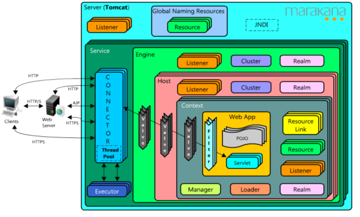
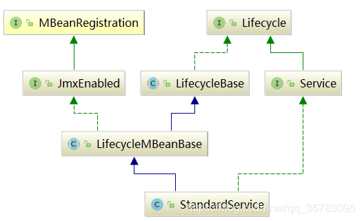

 [http://xbynet.top/2018/01/05/tomcat8-5%E5%AE%98%E6%96%87%E7%AC%94%E8%AE%B0/](http://xbynet.top/2018/01/05/tomcat8-5官文笔记/) 

# Tomcat部署

http://tomcat.apache.org/tomcat-8.5-doc/appdev/deployment.html
应用文件格式WAR(Web Application Archive)
应用标准目录WEB-INF/web.xml,WEB-INF/lib/, .jsp,.html,etc.
应用自用库放WEB-INF/lib,所有应用公用库放CATALINA_HOME/lib.
描述文件:
`/WEB-INF/web.xml`:由Servlet规范定义的。配置文档见：http://tomcat.apache.org/tomcat-8.5-doc/appdev/web.xml.txt
`/META-INF/context.xml`:Tomcat Context配置文件，该文件以`Context`元素为根，实际运行时文件中的配置会作为Tomcat配置的`Host`元素的子元素。注意：此处/META-INF不是/WEB-INF/META-INF.配置文档见：http://tomcat.apache.org/tomcat-8.5-doc/config/context.html

部署方式:
1、直接拷贝文件夹到webapps下
2、拷贝war到webapps下
3、使用tomcat /manager应用来部署
4、其他


# Tomcat详解

- tomcat 8.5.38


## 导入idea


## 编译


## 原理解析


### 整体架构


- Engine：表示一个虚拟主机的引擎，一个 Tomcat Server 只有一个 引擎，连接器所有的请求都交给引擎处理，而引擎则会交给相应的虚拟主机去处理请求；
  - Host：表示虚拟主机，一个容器可以有多个虚拟主机，每个主机都有对应的域名，在 Tomcat 中，一个 webapps 就代表一个虚拟主机，当然 webapps 可以配置多个；
    - Context：表示一个应用容器，一个虚拟主机可以拥有多个应用，webapps 中每个目录都代表一个 Context，每个应用可以配置多个 Servlet。


### 架构图





### 内部组件

tomcat的组件主要包括:

- server：整个servlet容器，一个tomcat对应一个server，一个server包含多个service

  server在tomcat中的实现类是：StandardServer

- service： Tomcat 默认的 Service 服务是 Catalina，一个service包含多个connector（ 因为 Tomcat 支持多种网络协议，包括 HTTP/1.1、HTTP/2、AJP 等等 ），和一个container（容器）。多个connector共享一个container容器。

  service在tomcat中的实现类是：StandardService

- connector：链接器，负责处理客户端请求，解析不同协议及io方式。 连接器与容器之间通过 ServletRequest 和 ServletResponse 对象进行交流。 

- executor：线程池

- container：包含engine，host，context，wrapper等组件。

- engine：servlet引擎，container容器中顶层的容器对象，一个engine可以包含多个host主机。 默认的情况下 conf/server.xml 配置文件中定义了一个名为Catalina的Engine。 

  engine在tomcat中的实现类是：StandardEngine

- host： 代表一个站点，也可以叫虚拟主机 ，一个host对应一个网络域名，一个Host可以配置多个Context，在server.xml文件中的默认配置为, 其中一个Engine包含多个Host的设计，使得一个服务器实例可以承担多个域名的服务，是很灵活的设计。

  host在tomcat中的实现类是：StandardHost

- context：代表一个应用程序，就是日常开发中的web程序，或者一个WEB-INF目录以及下面的web.xml文件，换句话说每一个运行的webapp最终都是以Context的形式存在，每个Context都有一个根路径和请求路径；与Host的区别是Context代表一个应用，如，默认配置下webapps下的每个目录都是一个应用，其中ROOT目录中存放主应用，其他目录存放别的子应用，而整个webapps是一个站点。 

  ```xml
  在Tomcat中通常采用如下方式创建一个Context：
  
  	1. 在/webapps 目录中创建一个目录dirname，此时将自动创建一个context，默认context的访问url为http://host:port/dirname，也可以通过在ContextRoot\META-INF 中创建一个context.xml文件，其中包含如下内容来指定应用的访问路径：
  
  	2. 在server.xml文件中增加context 元素，如下：
  	<Context path="/urlpath" docBase="/test/xxx" reloadable=true />
  ```

  context在tomcat中的实现类是：StandardContext

- wrapper：tomcat中最小的容器单元，表示web应用中的servlet。

  一个Context可以包含多个Servlet处理不同请求，当然现在的SpringMVC，struts框架的出现导致程序中不再是大量的Servlet，但其实本质是没变的，都是由Servlet来处理或者当作入口。
  
  在tomcat中Servlet被称为wrapper。
  
  >  那么为什么要用Wrapper来表示Servlet？这和tomcat的处理机制有关，为了更加灵活，便于扩展，tomcat是用管道（pipeline）和阀(valve)的形式来处理请求，所以将Servlet丢给Wrapper。 
  
- wrapper在tomcat中的实现类是：StandardWrapper


 也可以从 server.xml 的配置结构可以看出 tomcat 整体的内部结构： 

```xml

<Server port="8005" shutdown="SHUTDOWN">

  <Service name="Catalina">

    <Connector connectionTimeout="20000" port="8080" protocol="HTTP/1.1" redirectPort="8443" URIEncoding="UTF-8"/>

    <Connector port="8009" protocol="AJP/1.3" redirectPort="8443"/>

    <Engine defaultHost="localhost" name="Catalina">

      <-- appBase=webapps， 也就是/webapps目录，
          unpackingWARS=true 属性指定在appBase指定的目录中的war包都自动的解压，
          autoDeploy=true 属性指定对加入到appBase目录的war包进行自动的部署。->
      <Host appBase="webapps" autoDeploy="true" name="localhost" unpackWARs="true">

        <Context docBase="handler-api" path="/handler" reloadable="true" source="org.eclipse.jst.jee.server:handler-api"/>
      </Host>
    </Engine>
  </Service>
</Server>
```


所以tomcat结构大致如下：


组件关系继承图


## 源码解析


| 一级模块                    | 二级模块        | 代码量 | 用途                                                         |
| --------------------------- | --------------- | ------ | ------------------------------------------------------------ |
|                             | ant             |        | 使用ant集成jmx,方便运行时对tomcat进行管理                    |
|                             | connector       |        | 处理连接，如HttpServletRequest等                             |
|                             | core            |        | 核心实现                                                     |
|                             | deploy          |        | 部署模块                                                     |
|                             | filters         |        | 内置的一些Filter实现                                         |
|                             | loader          |        | High Availiable缩写，处理Tomcat集群                          |
|                             | manager         |        |                                                              |
|                             | mbeans          |        | tomcat内置的jmx                                              |
|                             | realm           |        | tomcat管理页面的控制权限                                     |
|                             | security        |        | 安全相关                                                     |
|                             | servlet4preview |        | servlet4.0前瞻                                               |
|                             | servlets        |        | servlet实现类                                                |
|                             | session         |        | HttpSession相关                                              |
|                             | ssi             |        | server side include,用于替换html片段，类似nginx处理ssi资源   |
|                             | startup         |        | 启动tomcat容器                                               |
|                             | storeconfig     |        | 配置信息                                                     |
|                             | values          |        | 阀门组件。Values是tomcat中责任链模式的实现，通过链接多个Value对请求进行处理 |
|                             | tribes          |        | 部落组件，用于tomcat之间通信                                 |
| catalina（核心部分）        | webresources    |        | 用于处理 jar,war等文件                                       |
|                             | ajp             |        | ajp协议                                                      |
|                             | http11          |        |                                                              |
| coyote（支持各种协议）      | http2           |        |                                                              |
|                             | dbcp            |        | 数据库连接池实现                                             |
|                             | jni             |        | native实现，需要使用tomcat提供的tomcat-native.tar.gz         |
|                             | websocket       |        | 对javax.websocket的实现                                      |
| tomcat（对javax的一些实现） | util            |        | 各种工具类，包括对jdk的封装                                  |
| el                          |                 |        | el表达式                                                     |
| jasper                      |                 |        | 支持jps                                                      |
| juli                        |                 |        | 日志                                                         |
| naming                      |                 |        | jndi                                                         |


### init过程

tomcat的入口类为BootStrap的main方法

#### BootStrap

```JAVA
public static void main(String args[]) {
        .....
        //初始化    
        bootstrap.init();
        .....
        if (command.equals("startd")) {
            args[args.length - 1] = "start";
            //实例化各组件 调用Catalina类的load方法
            daemon.load(args);
            //启动各组件 调用Catalina类的start方法
            daemon.start();
        }
        .....
}
```

 bootstrap.init()的工作是初始化Bootstrap类，包含初始化类加载器 

```java
public void init() throws Exception {
    //初始化类加载
    initClassLoaders();
    ......
    //实例化Catalina类
    Class<?> startupClass = catalinaLoader.loadClass("org.apache.catalina.startup.Catalina");
    Object startupInstance = startupClass.getConstructor().newInstance();
    ......
    catalinaDaemon = startupInstance;

}
```

#### Catalina

接着调用刚初始化的Catalina类的实例catalinaDaemon的load()方法，重要的就两点

```java
public void load() {
    .....
    // Digester... 实例化组件
    Digester digester = createStartDigester();
    .....加载server.xml......
    file = configFile();
    inputStream = new FileInputStream(file);
    inputSource = new InputSource(file.toURI().toURL().toString());
    ......
    // 初始化sever
    getServer().init();
}
```

#### Digester

Digester是一种将xml转化为java对象的事件驱动型工具，通过读取xml文件，当识别到特定的节点的时候会执行特定的动作，创建java对象或者执行对象的某个方法


通过Digester去创建了Catania中的大量初始化工作，具体详见源码：

```java
// 创建server实例
digester.addObjectCreate("Server",
                         "org.apache.catalina.core.StandardServer",
                         "className");
//创建Executor
digester.addObjectCreate("Server/Service/Executor",
                         "org.apache.catalina.core.StandardThreadExecutor",
                         "className");
...等等大量初始化工作...
```

接着讲，getServer().init()方法的作用是初始化Sever，调用LifecycleBase的init()方法，在init方法中调用的是StandardServer类initInternal()方法

#### StandardServer


StandardServer类initInternal()方法：

```java
/**
 * Invoke a pre-startup initialization. This is used to allow connectors
 * to bind to restricted ports under Unix operating environments.
 */
@Override
protected void initInternal() throws LifecycleException {

    super.initInternal();
    // ...省略很多，但是主要的在下面...
    // Initialize our defined Services
    for (int i = 0; i < services.length; i++) {
        //调用services的init
        services[i].init();
    }
}
```

前面的时候讲过一个server初始化多个services；

#### StandardService

services[i].init();初始化的是StandardService类，类图如下



StandardService的initInternal() 方法的工作是初始化engine组件，初始化线程池，初始化mapperListener，初始化connector

```java
/**
 * Invoke a pre-startup initialization. This is used to allow connectors
 * to bind to restricted ports under Unix operating environments.
 */
@Override
protected void initInternal() throws LifecycleException {

    super.initInternal();
    //初始化engine
    engine.init();
    //初始化线程池
    // Initialize any Executors
    for (Executor executor : findExecutors()) {
        if (executor instanceof JmxEnabled) {
            ((JmxEnabled) executor).setDomain(getDomain());
        }
        executor.init();
    }
    //初始化mapperListener
    // Initialize mapper listener
    mapperListener.init();
    //初始化connector
    connector.init();
     
}
```

初始化executor，mapperListener，connector后面再讲其作用，先接初始化engine

#### StandardEngine


在StandardEngine的初始化中并没有直接调用host的初始化，而是调用的父类containerBase的initInternal的方法：

```java
//StandardEngine
@Override
protected void initInternal() throws LifecycleException {
    // Ensure that a Realm is present before any attempt is made to start
    // one. This will create the default NullRealm if necessary.
    getRealm();
    super.initInternal();
}

//containerBase
 @Override
 protected void initInternal() throws LifecycleException {
        BlockingQueue<Runnable> startStopQueue = new LinkedBlockingQueue<>();
        startStopExecutor = new ThreadPoolExecutor(
                getStartStopThreadsInternal(),
                getStartStopThreadsInternal(), 10, TimeUnit.SECONDS,
                startStopQueue,
                new StartStopThreadFactory(getName() + "-startStop-"));
        startStopExecutor.allowCoreThreadTimeOut(true);
        super.initInternal();
    }
```

<font color=#dd0000>host的init是在start阶段去做的</font>，所以后面再说

#### executor

executor.init();默认调用LifecycleMBeanBase的initInternal方法

#### mapperListener

mapperListener.init();也默认调用LifecycleMBeanBase的initInternal方法

#### connector

connector的初始化调用Connector类的initInternal方法，主要是new了一个CoyoteAdapter，初始化protocolHandler

```java
@Override
protected void initInternal() throws LifecycleException {

    super.initInternal();

    // 实例化 CoyoteAdapter 适配器
    adapter = new CoyoteAdapter(this);
    protocolHandler.setAdapter(adapter);
    ......
    try {
        //初始化 protocolHandler
        protocolHandler.init();
    } catch (Exception e) {
        throw new LifecycleException(
                sm.getString("coyoteConnector.protocolHandlerInitializationFailed"), e);
    }
}
```

ProtocolHandler.init();的实现：


AbstractProtocol是调用endpoint的init方法，这个方法中调用bind()

```java
@Override
public void init() throws Exception {
   //初始化endpoint
   endpoint.init();
}
```

bind()针对不同的io类型提供了三种的默认实现


进入NioEndpoint类的bind()

```java
/**
 * Initialize the endpoint.
 */
@Override
public void bind() throws Exception {
    //使用nio方式监听端口
    if (!getUseInheritedChannel()) {
        serverSock = ServerSocketChannel.open();
        socketProperties.setProperties(serverSock.socket());
        InetSocketAddress addr = (getAddress()!=null?new InetSocketAddress(getAddress(),getPort()):new InetSocketAddress(getPort()));
        serverSock.socket().bind(addr,getAcceptCount());
    } 
    //设置非阻塞
    serverSock.configureBlocking(true); //mimic APR behavior
    ......
    //开启selectorPool
    selectorPool.open();
}
```

#### Mapper

Tomcat 是如何来定位 Servlet 的呢？答案是利用 Mapper 组件来完成定位的工作。

<font color=#dd0000>Mapper 最主要的核心功能是保存容器组件之间访问路径的映射关系</font>

我们先从源码入手：

org.apache.catalina.core.StandardService：

```java
protected final Mapper mapper = new Mapper();
protected final MapperListener mapperListener = new MapperListener(this);
```

 Service 实现类中，已经初始化了 Mapper 组件以及它的监听类 MapperListener。


在 Service 服务启动的时候，会调用 MapperListener.start() 方法，最终会执行 MapperListener 的 startInternal 方法：

org.apache.catalina.mapper.MapperListener#startInternal：

```java
Container[] conHosts = engine.findChildren();
for (Container conHost : conHosts) {
  Host host = (Host) conHost;
  if (!LifecycleState.NEW.equals(host.getState())) {
    // Registering the host will register the context and wrappers
    registerHost(host);
  }
}
```

该方法会注册新的虚拟主机，接着 registerHost() 方法会注册 context，以此类推，从而将容器组件直接的访问的路径都注册到 Mapper 中。

定位 Servlet 的流程图：


### start过程

tomcat的start阶段与init阶段相似，都是逐层调用，稍有不同的是在于engine，host，context，wrapper的启动方式；

首先回到Bootstrap的main方法中，继续执行Catalina类的start()，在start()方法中调getServer().start();

调用LifecycleBase类的start()方法，在这个方法中调动StandardServer类实现的startInternal()，在这个类中继续调用service的star()方法，以此类推逐层start调用，直到调用engine的start()，我们看下engine的start()方法，在看下StandardEngine的类图:


StandardEngine的startInternal()调用ContainerBase的startInternal()

```java
/**
 * Start this component and implement the requirements
 * of {@link org.apache.catalina.util.LifecycleBase#startInternal()}.
 *
 * @exception LifecycleException if this component detects a fatal error
 *  that prevents this component from being used
 */
@Override
protected synchronized void startInternal() throws LifecycleException {

    // ......
    // Start our child containers, if any
    Container children[] = findChildren();
    List<Future<Void>> results = new ArrayList<>();
    for (int i = 0; i < children.length; i++) {
        results.add(startStopExecutor.submit(new StartChild(children[i])));
    }
    // ......
}
```

findChildren()的方法找到的是engine容器的子容器，然后再new StartChild(children[i])中调用子类容器的start()；使用这种方式依次启动子容器。


# Tomcat组件生命周期

运行startup.bat。将引发Tomcat一连串组件的启动。事实上这一连串启动是通过组件的生命周期(Lifecycle)实现的

今天来看看Lifecycle设计。解读Lifecycle。涉及到例如以下几个类

Lifecycle、LifecycleState、LifecycleEvent、LifecycleListener(位于org.apache.catalina)

LifecycleBase、LifecycleSupport、LifecycleMBeanBase(位于org.apache.catalina.util)


tomcat的启动过程非常规范，使用Lifecycle接口统一管理各组件的生命周期，根据各个组件之间的父子级关系，首先调用init()方法逐级初始化各组件，然后在调用start()的方法进行启动；

Lifecycle接口提供的方法如下，提供了init，start，destory等方法：


tomcat中的组件基本都继承了LifecycleMBeanBase类，LifecycleMBeanBase集成LifecycleBase，LifecycleBase实现Lifecycle接口：


LifecycleBase重写Lifecycle接口，比如init()方法，在init()方法中调用initInternal()方法，initInternal()方法是抽象方法，具体实现交由各个子类（组件）去实现。如果没有实现initInternal()方法，则调用默认的LifecycleMBeanBase的initInternal方法。


## Lifecycle接口

```java
package org.apache.catalina;

public interface Lifecycle {

    // 事件类型
    public static final String BEFORE_INIT_EVENT = "before_init";
    public static final String AFTER_INIT_EVENT = "after_init";
    public static final String START_EVENT = "start";
    public static final String BEFORE_START_EVENT = "before_start";
    public static final String AFTER_START_EVENT = "after_start";
    public static final String STOP_EVENT = "stop";
    public static final String BEFORE_STOP_EVENT = "before_stop";
    public static final String AFTER_STOP_EVENT = "after_stop";
    public static final String AFTER_DESTROY_EVENT = "after_destroy";
    public static final String BEFORE_DESTROY_EVENT = "before_destroy";
    public static final String PERIODIC_EVENT = "periodic";
    public static final String CONFIGURE_START_EVENT = "configure_start";
    public static final String CONFIGURE_STOP_EVENT = "configure_stop";

    public void addLifecycleListener(LifecycleListener listener);

    public LifecycleListener[] findLifecycleListeners();

    public void removeLifecycleListener(LifecycleListener listener);

    public void init() throws LifecycleException;

    public void start() throws LifecycleException;

    public void stop() throws LifecycleException;

    public void destroy() throws LifecycleException;

    public LifecycleState getState();

    public String getStateName();
}
```


Lifecycle接口的作用

定义了事件类型(静态常量字符串)

定义了init/start/stop/destroy方法，即组件初始化/启动/停止/销毁

定义了addLifecycleListener/findLifecycleListeners/removeLifecycleListener方法，即加入/获取/移除监听器(监听器主要监听启动、停止动作)


## LifecycleState枚举

```java
package org.apache.catalina;

public enum LifecycleState {
    // 组件状态
    NEW(false, null),
    INITIALIZING(false, Lifecycle.BEFORE_INIT_EVENT),
    INITIALIZED(false, Lifecycle.AFTER_INIT_EVENT),
    STARTING_PREP(false, Lifecycle.BEFORE_START_EVENT),
    STARTING(true, Lifecycle.START_EVENT),
    STARTED(true, Lifecycle.AFTER_START_EVENT),
    STOPPING_PREP(true, Lifecycle.BEFORE_STOP_EVENT),
    STOPPING(false, Lifecycle.STOP_EVENT),
    STOPPED(false, Lifecycle.AFTER_STOP_EVENT),
    DESTROYING(false, Lifecycle.BEFORE_DESTROY_EVENT),
    DESTROYED(false, Lifecycle.AFTER_DESTROY_EVENT),
    FAILED(false, null),
    MUST_STOP(true, null),
    MUST_DESTROY(false, null);

    private final boolean available;
    private final String lifecycleEvent;

    private LifecycleState(boolean available, String lifecycleEvent) {
        this.available = available;
        this.lifecycleEvent = lifecycleEvent;
    }

    public boolean isAvailable() {
        return available;
    }

    public String getLifecycleEvent() {
        return lifecycleEvent;
    }
}
```


LifecycleState定义了组件状态的枚举。LifecycleState包括两个属性：available、lifecycleEvent

available(boolean)－处于此状态的组件能否够运行public方法(get/set方法除外)。能否够获取lifecycleEvent值

lifecycleEvent(String)－处于此状态的组件正进行的事件


## LifecycleEvent

LifecycleEvent是个实体类，包括三个属性lifecycle、type、data

lifecycle(Lifecycle)－将触发事件的组件

(注意：每一个组件都能够向上转成Lifecycle类型。由于组件继承LifecycleMBeanBase。而LifecycleMBeanBase继承LifecycleBase，而LifecycleBase是Lifecycle的一种实现)

type(String)－事件类型

data(String)－事件数据


## LifecycleSupport

LifecycleSupport将组件正在进行的LifecycleEvent通知给监听器(LifecycleListener)


## LifecycleListener

监听特定事件。并做出对应处理

AprLifecycleListener(org.apache.catalina.core)就是LifecycleListener的一种实现

<font color=#dd0000>组件更新状态时，假设组件当前状态的lifecycleEvent不为空。LifecycleSupport会将 lifecycleEvent通知给LifecycleListener，LifecycleListener会做出对应处理。</font>


## LifecycleBase

LifecycleBase实现了Lifecycle接口，加入了几个新的方法如setStateInternal(更新组件状态)、fireLifecycleEvent(触发LifecycleEvent)

加入了四个抽象方法initInternal、startInternal、stopInternal、destroyInternal

LifecycleBase内初始化了LifecycleSupport、LifecycleState


```java
private final LifecycleSupport lifecycle = new LifecycleSupport(this);
private volatile LifecycleState state = LifecycleState.NEW;
```


以下来看看LifecycleBase的init方法的逻辑(start/stop/destroy的逻辑与init类似)


```java
public final synchronized void init() throws LifecycleException {
	//查看组件状态是否为LifecycleState.NEW
	if (!state.equals(LifecycleState.NEW)) {
		invalidTransition(Lifecycle.BEFORE_INIT_EVENT);
	}
	//更新组件状态LifecycleState.INITIALIZING
	setStateInternal(LifecycleState.INITIALIZING, null, false);

	try {
	//调用initInternal
		initInternal();
	} catch (Throwable t) {
		ExceptionUtils.handleThrowable(t);
		setStateInternal(LifecycleState.FAILED, null, false);
		throw new LifecycleException(
				sm.getString("lifecycleBase.initFail",toString()), t);
	}
	
	//更新组件状态为LifecycleState.INITIALIZED。到此初始化完毕
	setStateInternal(LifecycleState.INITIALIZED, null, false);
}
```


<font color=#dd0000>注意init方法内部又调用了initInternal方法</font>


## LifecycleMBeanBase

LifecycleMBeanBase继承LifecycleBase，LifecycleMBeanBase内又加入了一些新的方法

<font color=#dd0000>StandardServer、StandardService等组件继承LifecycleMBeanBase，并重写initInternal、startInternal、stopInternal、destroyInternal方法</font>

以下来看看StandardServer的initInternal方法


```java
protected void initInternal() throws LifecycleException {
	//调用父类(LifecycleMBeanBase)的initInternal方法
	super.initInternal();
	
	onameStringCache = register(new StringCache(), "type=StringCache");

	// Register the MBeanFactory
	MBeanFactory factory = new MBeanFactory();
	factory.setContainer(this);
	onameMBeanFactory = register(factory, "type=MBeanFactory");

	// Register the naming resources
	globalNamingResources.init();

	// Populate the extension validator with JARs from common and shared
	// class loaders
	if (getCatalina() != null) {
		ClassLoader cl = getCatalina().getParentClassLoader();
		// Walk the class loader hierarchy. Stop at the system class loader.
		// This will add the shared (if present) and common class loaders
		while (cl != null && cl != ClassLoader.getSystemClassLoader()) {
			if (cl instanceof URLClassLoader) {
				URL[] urls = ((URLClassLoader) cl).getURLs();
				for (URL url : urls) {
					if (url.getProtocol().equals("file")) {
						try {
							File f = new File (url.toURI());
							if (f.isFile() &&
									f.getName().endsWith(".jar")) {
								ExtensionValidator.addSystemResource(f);
							}
						} catch (URISyntaxException e) {
							// Ignore
						} catch (IOException e) {
							// Ignore
						}
					}
				}
			}
			cl = cl.getParent();
		}
	}
	//Server调用其子组件(Service)的init方法，Service在初始化过程中又会调用其子组件的init方法
	for (int i = 0; i < services.length; i++) {
		services[i].init();
	}
}
```


当Catalina调用StandardServer的init方法时，因为StandardServer未重写init方法，因此将使用LifecycleBase的init方法。当运行到initInternal()时，因为StandardServer重写了initInternal方法，因此将使用StandardServer的initInternal方法(应用了多态。每一个组件的initInternal方法包括其自己定义逻辑)

通过Lifecycle。Tomcat启动最顶层组件(Server)。就可以启动全部组件


# Tomcat调优

在使用 Tomcat 时，经常会遇到连接数、线程数之类的配置问题，要真正理解这些概念，必须先了解 Tomcat 的连接器（Connector）。

在前面的文章 详解 Tomcat 配置文件 server.xml 中写到过：Connector 的主要功能，是接收连接请求，创建 Request 和 Response 对象用于和请求端交换数据；然后分配线程让 Engine（也就是 Servlet 容器）来处理这个请求，并把产生的 Request 和 Response 对象传给 Engine。当 Engine 处理完请求后，也会通过 Connector 将响应返回给客户端。

可以说，Servlet 容器处理请求，是需要 Connector 进行调度和控制的，Connector 是 Tomcat 处理请求的主干，因此 Connector 的配置和使用对 Tomcat 的性能有着重要的影响。这篇文章将从 Connector 入手，讨论一些与 Connector 有关的重要问题，包括 NIO/BIO 模式、线程池、连接数等。

根据协议的不同，Connector 可以分为 HTTP Connector、AJP Connector 等，本文只讨论 HTTP Connector。

一、Nio、Bio、APR

1、Connector 的 protocol

Connector 在处理 HTTP 请求时，会使用不同的 protocol。不同的 Tomcat 版本支持的 protocol 不同，其中最典型的 protocol 包括 BIO、NIO 和 APR（Tomcat7 中支持这 3 种，Tomcat8 增加了对 NIO2 的支持，而到了 Tomcat8.5 和 Tomcat9.0，则去掉了对 BIO 的支持）。

BIO 是 Blocking IO，顾名思义是阻塞的 IO；NIO 是 Non-blocking IO，则是非阻塞的 IO。而 APR 是 Apache Portable Runtime，是 Apache 可移植运行库，利用本地库可以实现高可扩展性、高性能；Apr 是在 Tomcat 上运行高并发应用的首选模式，但是需要安装 apr、apr-utils、tomcat-native 等包。

2、如何指定 protocol

Connector 使用哪种 protocol，可以通过元素中的 protocol 属性进行指定，也可以使用默认值。

指定的 protocol 取值及对应的协议如下：

- HTTP/1.1：默认值，使用的协议与 Tomcat 版本有关
- org.apache.coyote.http11.Http11Protocol：BIO
- org.apache.coyote.http11.Http11NioProtocol：NIO
- org.apache.coyote.http11.Http11Nio2Protocol：NIO2
- org.apache.coyote.http11.Http11AprProtocol：APR

如果没有指定 protocol，则使用默认值 HTTP/1.1，其含义如下：在 Tomcat7 中，自动选取使用 BIO 或 APR（如果找到 APR 需要的本地库，则使用 APR，否则使用 BIO）；在 Tomcat8 中，自动选取使用 NIO 或 APR（如果找到 APR 需要的本地库，则使用 APR，否则使用 NIO）。

3、BIO/NIO 有何不同

无论是 BIO，还是 NIO，Connector 处理请求的大致流程是一样的：

在 accept 队列中接收连接（当客户端向服务器发送请求时，如果客户端与 OS 完成三次握手建立了连接，则 OS 将该连接放入 accept 队列）；在连接中获取请求的数据，生成 request；调用 servlet 容器处理请求；返回 response。为了便于后面的说明，首先明确一下连接与请求的关系：连接是 TCP 层面的（传输层），对应 socket；请求是 HTTP 层面的（应用层），必须依赖于 TCP 的连接实现；一个 TCP 连接中可能传输多个 HTTP 请求。

在 BIO 实现的 Connector 中，处理请求的主要实体是 JIoEndpoint 对象。JIoEndpoint 维护了 Acceptor 和 Worker：Acceptor 接收 socket，然后从 Worker 线程池中找出空闲的线程处理 socket，如果 worker 线程池没有空闲线程，则 Acceptor 将阻塞。其中 Worker 是 Tomcat 自带的线程池，如果通过配置了其他线程池，原理与 Worker 类似。

在 NIO 实现的 Connector 中，处理请求的主要实体是 NIoEndpoint 对象。NIoEndpoint 中除了包含 Acceptor 和 Worker 外，还是用了 Poller，处理流程如下图所示。


Acceptor 接收 socket 后，不是直接使用 Worker 中的线程处理请求，而是先将请求发送给了 Poller，而 Poller 是实现 NIO 的关键。Acceptor 向 Poller 发送请求通过队列实现，使用了典型的生产者-消费者模式。在 Poller 中，维护了一个 Selector 对象；当 Poller 从队列中取出 socket 后，注册到该 Selector 中；然后通过遍历 Selector，找出其中可读的 socket，并使用 Worker 中的线程处理相应请求。与 BIO 类似，Worker 也可以被自定义的线程池代替。

通过上述过程可以看出，在 NIoEndpoint 处理请求的过程中，无论是 Acceptor 接收 socket，还是线程处理请求，使用的仍然是阻塞方式；但在“读取 socket 并交给 Worker 中的线程”的这个过程中，使用非阻塞的 NIO 实现，这是 NIO 模式与 BIO 模式的最主要区别（其他区别对性能影响较小，暂时略去不提）。而这个区别，在并发量较大的情形下可以带来 Tomcat 效率的显著提升：

目前大多数 HTTP 请求使用的是长连接（HTTP/1.1 默认 keep-alive 为 true），而长连接意味着，一个 TCP 的 socket 在当前请求结束后，如果没有新的请求到来，socket 不会立马释放，而是等 timeout 后再释放。如果使用 BIO，“读取 socket 并交给 Worker 中的线程”这个过程是阻塞的，也就意味着在 socket 等待下一个请求或等待释放的过程中，处理这个 socket 的工作线程会一直被占用，无法释放；因此 Tomcat 可以同时处理的 socket 数目不能超过最大线程数，性能受到了极大限制。而使用 NIO，“读取 socket 并交给 Worker 中的线程”这个过程是非阻塞的，当 socket 在等待下一个请求或等待释放时，并不会占用工作线程，因此 Tomcat 可以同时处理的 socket 数目远大于最大线程数，并发性能大大提高。

二、3 个参数：acceptCount、maxConnections、maxThreads

再回顾一下 Tomcat 处理请求的过程：在 accept 队列中接收连接（当客户端向服务器发送请求时，如果客户端与 OS 完成三次握手建立了连接，则 OS 将该连接放入 accept 队列）；在连接中获取请求的数据，生成 request；调用 servlet 容器处理请求；返回 response。

相对应的，Connector 中的几个参数功能如下：

1、acceptCount

accept 队列的长度；当 accept 队列中连接的个数达到 acceptCount 时，队列满，进来的请求一律被拒绝。默认值是 100。

2、maxConnections

Tomcat 在任意时刻接收和处理的最大连接数。当 Tomcat 接收的连接数达到 maxConnections 时，Acceptor 线程不会读取 accept 队列中的连接；这时 accept 队列中的线程会一直阻塞着，直到 Tomcat 接收的连接数小于 maxConnections。如果设置为-1，则连接数不受限制。

默认值与连接器使用的协议有关：NIO 的默认值是 10000，APR/native 的默认值是 8192，而 BIO 的默认值为 maxThreads（如果配置了 Executor，则默认值是 Executor 的 maxThreads）。

在 windows 下，APR/native 的 maxConnections 值会自动调整为设置值以下最大的 1024 的整数倍；如设置为 2000，则最大值实际是 1024。

3、maxThreads

请求处理线程的最大数量。默认值是 200（Tomcat7 和 8 都是的）。如果该 Connector 绑定了 Executor，这个值会被忽略，因为该 Connector 将使用绑定的 Executor，而不是内置的线程池来执行任务。

maxThreads 规定的是最大的线程数目，并不是实际 running 的 CPU 数量；实际上，maxThreads 的大小比 CPU 核心数量要大得多。这是因为，处理请求的线程真正用于计算的时间可能很少，大多数时间可能在阻塞，如等待数据库返回数据、等待硬盘读写数据等。因此，在某一时刻，只有少数的线程真正的在使用物理 CPU，大多数线程都在等待；因此线程数远大于物理核心数才是合理的。

换句话说，Tomcat 通过使用比 CPU 核心数量多得多的线程数，可以使 CPU 忙碌起来，大大提高 CPU 的利用率。

4、参数设置

（1）maxThreads 的设置既与应用的特点有关，也与服务器的 CPU 核心数量有关。通过前面介绍可以知道，maxThreads 数量应该远大于 CPU 核心数量；而且 CPU 核心数越大，maxThreads 应该越大；应用中 CPU 越不密集（IO 越密集），maxThreads 应该越大，以便能够充分利用 CPU。当然，maxThreads 的值并不是越大越好，如果 maxThreads 过大，那么 CPU 会花费大量的时间用于线程的切换，整体效率会降低。

（2）maxConnections 的设置与 Tomcat 的运行模式有关。如果 Tomcat 使用的是 BIO，那么 maxConnections 的值应该与 maxThreads 一致；如果 Tomcat 使用的是 NIO，那么类似于 Tomcat 的默认值，maxConnections 值应该远大于 maxThreads。

（3）通过前面的介绍可以知道，虽然 Tomcat 同时可以处理的连接数目是 maxConnections，但服务器中可以同时接收的连接数为 maxConnections+acceptCount 。acceptCount 的设置，与应用在连接过高情况下希望做出什么反应有关系。如果设置过大，后面进入的请求等待时间会很长；如果设置过小，后面进入的请求立马返回 connection refused。

三、线程池 Executor

Executor 元素代表 Tomcat 中的线程池，可以由其他组件共享使用；要使用该线程池，组件需要通过 executor 属性指定该线程池。

Executor 是 Service 元素的内嵌元素。一般来说，使用线程池的是 Connector 组件；为了使 Connector 能使用线程池，Executor 元素应该放在 Connector 前面。Executor 与 Connector 的配置举例如下：

Executor 的主要属性包括：

- name：该线程池的标记
- maxThreads：线程池中最大活跃线程数，默认值 200（Tomcat7 和 8 都是）
- minSpareThreads：线程池中保持的最小线程数，最小值是 25
- maxIdleTime：线程空闲的最大时间，当空闲超过该值时关闭线程（除非线程数小于 minSpareThreads），单位是 ms，默认值 60000（1 分钟）
- daemon：是否后台线程，默认值 true
- threadPriority：线程优先级，默认值 5
- namePrefix：线程名字的前缀，线程池中线程名字为：namePrefix+ 线程编号

四、查看当前状态

上面介绍了 Tomcat 连接数、线程数的概念以及如何设置，下面说明如何查看服务器中的连接数和线程数。

查看服务器的状态，大致分为两种方案：（1）使用现成的工具，（2）直接使用 Linux 的命令查看。

现成的工具，如 JDK 自带的 jconsole 工具可以方便的查看线程信息（此外还可以查看 CPU、内存、类、JVM 基本信息等），Tomcat 自带的 manager，收费工具 New Relic 等。下图是 jconsole 查看线程信息的界面：


下面说一下如何通过 Linux 命令行，查看服务器中的连接数和线程数。

1、连接数

假设 Tomcat 接收 http 请求的端口是 8083，则可以使用如下语句查看连接情况：

netstat –nat | grep 8083

结果如下所示：


可以看出，有一个连接处于 listen 状态，监听请求；除此之外，还有 4 个已经建立的连接（ESTABLISHED）和 2 个等待关闭的连接（CLOSE_WAIT）。

2、线程

ps 命令可以查看进程状态，如执行如下命令：

ps –e | grep Java

结果如下图：


可以看到，只打印了一个进程的信息；27989 是线程 id，Java 是指执行的 Java 命令。这是因为启动一个 Tomcat，内部所有的工作都在这一个进程里完成，包括主线程、垃圾回收线程、Acceptor 线程、请求处理线程等等。

通过如下命令，可以看到该进程内有多少个线程；其中，nlwp 含义是 number of light-weight process。

ps –o nlwp 27989


可以看到，该进程内部有 73 个线程；但是 73 并没有排除处于 idle 状态的线程。要想获得真正在 running 的线程数量，可以通过以下语句完成：

ps -eLo pid ,stat | grep 27989 | grep running | wc -l

其中 ps -eLo pid ,stat 可以找出所有线程，并打印其所在的进程号和线程当前的状态；两个 grep 命令分别筛选进程号和线程状态；wc 统计个数。