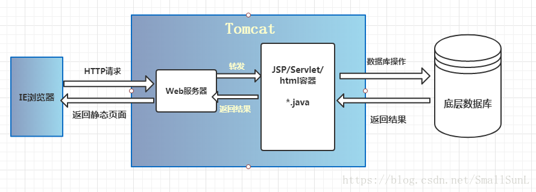

[https://www.zhihu.com/question/32212996 ](https://www.zhihu.com/question/32212996 )

# HTTP Server

HTTP服务器本质上也是一种应用程序——它通常运行在服务器之上，绑定服务器的IP地址并监听某一个tcp端口来接收并处理HTTP请求，这样客户端（一般来说是IE, Firefox，Chrome这样的浏览器）就能够通过HTTP协议来获取服务器上的网页（HTML格式）、文档（PDF格式）、音频（MP4格式）、视频（MOV格式）等等资源。

## Nginx

## Apache

# Application Server 

## Tomcat

Tomcat是运行java的网络服务器，底层是一个socket的程序，同时Tomcat也是JSP和Serlvet的容器

那么为什么我们要用Tomcat呢？
一般情况下，如果我们使用HTML/CSS/JS编写了一个网页，这个网页只能由我们本地打开，别的人无法通过远程访问这个页面。那么Tomcat就解决了这个问题，让其他人也可以访问我们写的页面。

部署war包：

第一种： 

	非常简单，直接将 web 项目文件（一般是复制生成的war包）复制到tomcat的webapps目录中。
	
	然后 startup.bat启动tomcat

第二种： 

	在本地tomcat的conf目录中，新建Catalina/localhost目录,这里要注意文件名的大小写,
	(注意,新建目录存放tomcat配置文件似乎不生效)
	然后在该目录下新建一个xml文件，名字不可以随意取，要和path后 的名字一致，
	我这里就应该是jstore.xml文件，它的具体内容为：
	
	<Context docBase="C:\work\jstore\web" path="/jstore" reloadable="true"/>

第三种: 

	在tomcat中的conf目录下的server.xml文件中，在<Host/>节点中添加一个context，具体为：
	
	<Context Path="/jstore"Docbase="C:\work\jstore\WebContent" Debug="0" Privileged="True" Reloadable="True"></Context>
	
	这里的 Reloadable= “true” 这个属性是指tomcat在运行状态下会自动检测应用程序的WEB-INF/classes和WEB-INF/lib
	目录下的class文件，如果监测到有class文件有改动，服务器自动加载新的web应用程序，可以在不重起tomcat的情况下
	改变应用程序，也就是热部署； 一般我们会在开发阶段将Reloadable属性设为true，有助于调试servlet和其它的class文件，
	但是由于这样会增加服务器的运行负荷，损耗系统性能，在项目运行阶段建议将它设为false。

# 总结

一个 HTTP Server 关心的是 HTTP 协议层面的传输和访问控制，所以在 Apache/Nginx 上你可以看到代理、负载均衡等功能。客户端通过 HTTP Server 访问服务器上存储的资源（HTML 文件、图片文件等等）。通过 CGI 技术，也可以将处理过的内容通过 HTTP Server 分发，但是一个 HTTP Server 始终只是把服务器上的文件如实的通过 HTTP 协议传输给客户端。

而应用服务器，则是一个应用执行的容器。它首先需要支持开发语言的 Runtime（对于 Tomcat 来说，就是 Java），保证应用能够在应用服务器上正常运行。其次，需要支持应用相关的规范，例如类库、安全方面的特性。对于 Tomcat 来说，就是需要提供 JSP/Sevlet 运行需要的标准类库、Interface 等。为了方便，应用服务器往往也会集成 HTTP Server 的功能，但是不如专业的 HTTP Server 那么强大，所以应用服务器往往是运行在 HTTP Server 的背后，执行应用，将动态的内容转化为静态的内容之后，通过 HTTP Server 分发到客户端。