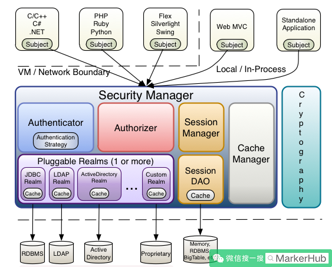
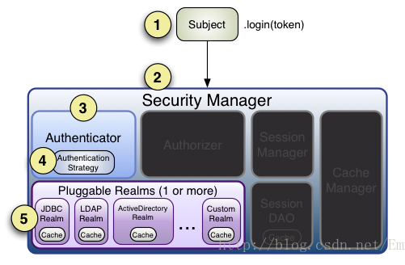
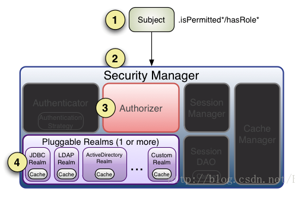

# Shiro认证和权限控制

https://blog.csdn.net/u011277123/article/details/68940939

## 权限控制的方式

认证
授权

## 权限的控制级别

从控制级别（模型）上分：

- URL级别-粗粒度
- 方法级别-细粒度
- 页面级别-自定义标签（显示）
- 数据级别-最细化的（数据）

### URL级别的权限控制

在web.xml中配置一个过滤器filter，在过滤器中，对请求的地址进行解析，字符串截取：url.substring()…把上下文前面的路径都截取掉，剩下user_login.action。

过滤器代码：

以通过查询数据库，来判断，当前登录用户，是否可以访问user_login.action。url级别控制，每次请求过程中只控制一次 ，相比方法级别权限控制 是粗粒度的 ！

URL级别权限控制，基于Filter实现。

### 方法级别的权限控制

aop面向切面的编程，在方法执行之前，进行权限判断，如果没有权限，抛出异常，终止方法的继续运行。

自定义注解 在需要权限控制方法上， 添加需要的权限信息代理 （Spring AOP ），在目标方法运行时 进行增强 ，通过反射技术获取目标方法上注解中权限 ， 查询数据库获取当前登陆用户具有权限，进行比较。

相比URL级别权限控制， 可以控制到服务器端执行的每个方法，一次请求中可以控制多次。

### 页面（显示）级别的权限控制-自定义标签

页面显示的权限控制，通常是通过 自定义标签来实现

### 数据级别的权限控制

在每条数据上增加一个字段，该字段记录了权限的值。数据和权限绑定。

代码中你在查询数据的时候，需要去权限和用户对应表中，通过当前登录用户的条件，查询出你的数据权限。然后再将数据权限作为一个条件，放到业务表中进行查询。从而限制了数据的访问。


## 示例代码

https://cloud.tencent.com/developer/article/1175271 + https://github.com/zhaojun1998/Premission-Study

[官网示例](http://shiro.apache.org/tutorial.html)

# 原理及其运行流程





subject：主题，可以是用户也可以是程序，主体要访问系统，系统需要对主体进行认证、授权。

securityManager：安全管理器，主体进行认证和授权都是通过securityManager进行。

authenticator：认证器，主体进行认证最终通过authenticator进行的。

authorizer：授权器，主体进行授权最终通过authorizer进行的。

sessionManager：web应用中一般是用web容器对session进行管理，shiro也提供一套session管理的方式。

SessionDao： 通过SessionDao管理session数据，针对个性化的session数据存储需要使用sessionDao。

cache Manager：缓存管理器，主要对session和授权数据进行缓存，比如将授权数据通过cacheManager进行缓存管理，和ehcache整合对缓存数据进行管理。

realm：域，领域，相当于数据源，通过realm存取认证、授权相关数据。

cryptography：密码管理，提供了一套加密/解密的组件，方便开发。比如提供常用的散列、加/解密等功能。比如 md5散列算法。


**注意：在realm中存储授权和认证的逻辑。**


## 官网示例

shiro.ini

```ini
# -----------------------------------------------------------------------------
# Users and their (optional) assigned roles
# username = password, role1, role2, ..., roleN
# -----------------------------------------------------------------------------
[users]
root = secret, admin
guest = guest, guest
presidentskroob = 12345, president
darkhelmet = ludicrousspeed, darklord, schwartz
lonestarr = vespa, goodguy, schwartz

# -----------------------------------------------------------------------------
# Roles with assigned permissions
# roleName = perm1, perm2, ..., permN
# -----------------------------------------------------------------------------
[roles]
admin = *
schwartz = lightsaber:*
goodguy = winnebago:drive:eagle5
```

上面代码中，`root = secret, admin`表示，用户名root，密码secret，角色是admin；`schwartz = lightsaber:*`表示角色schwartz拥有权限lightsaber:*。你其实可以把这个文件看成一个Realm，其实就是shiro默认的IniRealm。

```java
public class Tutorial {

    private static final transient Logger log = LoggerFactory.getLogger(Tutorial.class);

    public static void main(String[] args) {
        log.info("My First Apache Shiro Application");

        Factory<securitymanager> factory = new IniSecurityManagerFactory("classpath:shiro.ini");
        SecurityManager securityManager = factory.getInstance();
        SecurityUtils.setSecurityManager(securityManager);

        // get the currently executing user:
        Subject currentUser = SecurityUtils.getSubject();

        // Do some stuff with a Session (no need for a web or EJB container!!!)
        Session session = currentUser.getSession();
        session.setAttribute("someKey", "aValue");
        String value = (String) session.getAttribute("someKey");
        if (value.equals("aValue")) {
            log.info("Retrieved the correct value! [" + value + "]");
        }

        // let's login the current user so we can check against roles and permissions:
        if (!currentUser.isAuthenticated()) {
            UsernamePasswordToken token = new UsernamePasswordToken("lonestarr", "vespa");
            token.setRememberMe(true);
            try {
                currentUser.login(token);
            } catch (UnknownAccountException uae) {
                log.info("There is no user with username of " + token.getPrincipal());
            } catch (IncorrectCredentialsException ice) {
                log.info("Password for account " + token.getPrincipal() + " was incorrect!");
            } catch (LockedAccountException lae) {
                log.info("The account for username " + token.getPrincipal() + " is locked.  " +
                        "Please contact your administrator to unlock it.");
            }
            // ... catch more exceptions here (maybe custom ones specific to your application?
            catch (AuthenticationException ae) {
                //unexpected condition?  error?
            }
        }

        //say who they are:
        //print their identifying principal (in this case, a username):
        log.info("User [" + currentUser.getPrincipal() + "] logged in successfully.");

        //test a role:
        if (currentUser.hasRole("schwartz")) {
            log.info("May the Schwartz be with you!");
        } else {
            log.info("Hello, mere mortal.");
        }

        //test a typed permission (not instance-level)
        if (currentUser.isPermitted("lightsaber:wield")) {
            log.info("You may use a lightsaber ring.  Use it wisely.");
        } else {
            log.info("Sorry, lightsaber rings are for schwartz masters only.");
        }

        //a (very powerful) Instance Level permission:
        if (currentUser.isPermitted("winnebago:drive:eagle5")) {
            log.info("You are permitted to 'drive' the winnebago with license plate (id) 'eagle5'.  " +
                    "Here are the keys - have fun!");
        } else {
            log.info("Sorry, you aren't allowed to drive the 'eagle5' winnebago!");
        }

        //all done - log out!
        currentUser.logout();

        System.exit(0);
    }
}
```

## 常用API

```java
#获取当前用户
Subject currentUser = SecurityUtils.getSubject(); 
#判断用户已经认证
currentUser.isAuthenticated() 
#用户登录凭证
UsernamePasswordToken token = new UsernamePasswordToken("lonestarr", "vespa"); 
#记住我
token.setRememberMe(true); 
#登陆校验
currentUser.login(token); 
#判断是否有角色权限
currentUser.hasRole("schwartz") 
#判断是否有资源操作权限
currentUser.isPermitted("lightsaber:wield") 
#登出
currentUser.logout();
```

上面代码主要有两个步骤：

- 认证：

```
UsernamePasswordToken token = new UsernamePasswordToken("lonestarr", "vespa");
currentUser.login(token);
currentUser.logout();
```

- 判断权限

```
currentUser.hasRole("schwartz")
currentUser.isPermitted("winnebago:drive:eagle5")
```

## 认证流程



1、通过ini配置文件创建securityManager

2、调用subject.login方法主体提交认证，提交的token

3、securityManager进行认证，securityManager最终由ModularRealmAuthenticator进行认证。

4、ModularRealmAuthenticator调用IniRealm(给realm传入token) 去ini配置文件中查询用户信息

5、IniRealm根据输入的token（UsernamePasswordToken）从 shiro.ini查询用户信息，根据账号查询用户信息（账号和密码）

​     如果查询到用户信息，就给ModularRealmAuthenticator返回用户信息（账号和密码）

​     如果查询不到，就给ModularRealmAuthenticator返回null

6、ModularRealmAuthenticator接收IniRealm返回Authentication认证信息

​     如果返回的认证信息是null，ModularRealmAuthenticator抛出异常（org.apache.shiro.authc.UnknownAccountException）

​     如果返回的认证信息不是null（说明inirealm找到了用户），对IniRealm返回用户密码 （在ini文件中存在）

​     和 token中的密码 进行对比，如果不一致抛出异常（org.apache.shiro.authc.IncorrectCredentialsException）


追踪shiro源码的认证逻辑：

```
currentUser.login(token);
|
Subject subject = this.securityManager.login(this, token);
|
AuthenticationInfo info = this.authenticate(token);
|
this.authenticator.authenticate(token);
|
AuthenticationInfo info = this.doAuthenticate(token);
|
Collection<realm> realms = this.getRealms();
doSingleRealmAuthentication(realm, token);
|
AuthenticationInfo info = realm.getAuthenticationInfo(token);
|
AuthenticationInfo info = realm.doGetAuthenticationInfo(token);
```

ok，一条线下来，从login到委托给authenticator，再最后调用realm的doGetAuthenticationInfo方法。

## 授权流程



1、对subject进行授权，调用方法isPermitted（"permission串"）

2、SecurityManager执行授权，通过ModularRealmAuthorizer执行授权

3、ModularRealmAuthorizer执行realm（自定义的Realm）从数据库查询权限数据

调用realm的授权方法：doGetAuthorizationInfo

 

4、realm从数据库查询权限数据，返回ModularRealmAuthorizer

5、ModularRealmAuthorizer调用PermissionResolver进行权限串比对

6、如果比对后，isPermitted中"permission串"在realm查询到权限数据中，说明用户访问permission串有权限，否则 没有权限，抛出异常。


调用流程如下：

```
currentUser.hasRole("schwartz")
|
this.securityManager.hasRole(this.getPrincipals(), roleIdentifier)
|
this.authorizer.hasRole(principals, roleIdentifier)
|
AuthorizationInfo info = this.getAuthorizationInfo(principal);
return info.getRoles().contains(roleIdentifier)
|
info = this.doGetAuthorizationInfo(principals);(realm)
```

所以shiro判断用户是否有权限首先会从realm中获取用户所拥有的权限角色信息，然后再匹配当前的角色或权限是否包含，从而判定用户是否有权限！


## Shiro常见3种授权判断方式

- 编码实现

```java
Subject subject = SecurityUtils.getSubject();  
if(subject.hasRole(“admin”)) {  
    //有权限  
} else {  
    //无权限  
}
```

- 注解实现

```java
@RequiresRoles("admin")  
public void hello() {  
    //有权限  
}  
```

- JSP Taglig实现，freemarker等类似

```jsp
<shiro:hasrole name="admin">  
<!--— 有权限 —-->  
</shiro:hasrole>  
```

jsp页面引入shiro标签

```jsp
&lt;%@ taglib prefix="shiro" uri="http://shiro.apache.org/tags"%&gt;
```

## 数据表

**表设计**

开发用户-角色-权限管理系统，首先我们需要知道`用户-角色-权限`管理系统的表结构设计。

在`用户-角色-权限`管理系统找那个一般会涉及5张表，分别为：

- 1.`sys_users`用户表
- 2.`sys_roles`角色表
- 3.`sys_permissions`权限表（或资源表）
- 4.`sys_users_roles`用户-角色关联表
- 5.`sys_roles_permissions`角色-权限关联表（或角色-资源关联表）


**详细的建表信息如下**

- `sys_users`

**解释** 用户表中至少包含以上的字段，主键id、用户名username、密码password、盐值salt（因为密码是经过Shiro加密的，需要通过盐值校验，由Shiro生成，不需要用户手动填写）、角色列表roleId（这个字段不是必须的，仅实现在展示用户信息的时候能同时展示用户当前角色）、是否锁定locked（决定当前账户是否是锁定的）。 创建新的用户，仅需要输入用户名和密码即可，盐值由Shiro生成，角色列表和是否锁定都可以在后期管理。

其中是否锁定字段类型为`tinyint(1)`，设置这种类型，数据库中实际存储的是int类型数据，一般是0和1，在使用Mybatis取这个字段的数据时，Mybatis会自动将`tinyint(1)`字段值为0的转换成false，将字段值为1以上的转换为true。

- `sys_roles`

**解释** 角色表中role角色名称一般为存储着类似`user:create`这种格式，Shiro在Realm中校验用户身份的时候会通过`role`这个字段值进行校验；`description`是此角色的描述信息，比如`用户创建`。 其中`pid`表示父节点，就是说，当前的角色可能有上级节点，比如`老师`，这个角色可能就有父节点`计科教师`，如果存在父节点，这个字段值就是父级节点的ID，根据这个ID，在展示数据的时候就很方便的展示出其在哪个父节点下。 `available`表示当前节点是否锁定，同样是`tinyint(1)`类型，如果为false就说明没有锁定。

- `sys_users_roles`

**解释** 用户角色表就比较简单了，仅仅包含了主键`id`、用户ID`user_id`、角色ID`role_id`；这张表主要描述指定用户与角色间的依赖关系。其中用户表与角色表是一对多的关系，一个用户可以拥有多个角色。

- `sys_permissions`

**解释** 权限表和角色表类似，其中不同的字段是`rid`，这个字段表示此权限关联的角色的id值，当然不是必要的，但是后端角色更新时用到了，后面会介绍。

- `sys_roles_permissions`

**解释** 角色-权限表和用户-角色表类似，包含了主键`id`、角色ID`role_id`、权限ID`permission_id`，主要描述角色和权限间的依赖关系，同样，角色和权限间也是一对多的关系，一个角色会关联多个权限。

```sql
-- create database shiro default character set utf8;

drop table if exists sys_users;
drop table if exists sys_roles;
drop table if exists sys_permissions;
drop table if exists sys_users_roles;
drop table if exists sys_roles_permissions;

create table sys_users (
  id bigint auto_increment comment '编号',
  username varchar(100) comment '用户名',
  password varchar(100) comment '密码',
  salt varchar(100) comment '盐值',
  role_id varchar(50) comment '角色列表',
  locked bool default false comment '是否锁定',
  constraint pk_sys_users primary key(id)
) charset=utf8 ENGINE=InnoDB;
create unique index idx_sys_users_username on sys_users(username);

create table sys_roles (
  id bigint auto_increment comment '角色编号',
  role varchar(100) comment '角色名称',
  description varchar(100) comment '角色描述',
  pid bigint comment '父节点',
  available bool default false comment '是否锁定',
  constraint pk_sys_roles primary key(id)
) charset=utf8 ENGINE=InnoDB;
create unique index idx_sys_roles_role on sys_roles(role);

create table sys_permissions (
  id bigint auto_increment comment '编号',
  permission varchar(100) comment '权限编号',
  description varchar(100) comment '权限描述',
  rid bigint comment '此权限关联角色的id',
  available bool default false comment '是否锁定',
  constraint pk_sys_permissions primary key(id)
) charset=utf8 ENGINE=InnoDB;
create unique index idx_sys_permissions_permission on sys_permissions(permission);

create table sys_users_roles (
  id  bigint auto_increment comment '编号',
  user_id bigint comment '用户编号',
  role_id bigint comment '角色编号',
  constraint pk_sys_users_roles primary key(id)
) charset=utf8 ENGINE=InnoDB;

create table sys_roles_permissions (
  id bigint auto_increment comment '编号',
  role_id bigint comment '角色编号',
  permission_id bigint comment '权限编号',
  constraint pk_sys_roles_permissions primary key(id)
) charset=utf8 ENGINE=InnoDB;

insert into sys_users values(1,'TyCoding','123','salt','管理员',0);
insert into sys_roles values(21,'user:create','用户创建',0,0);
insert into sys_permissions values(31,'user:create','用户创建',0,0);
insert into sys_users_roles values(1,1,21);
insert into sys_roles_permissions values(1,21,31);
```

