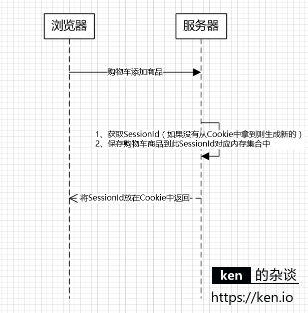
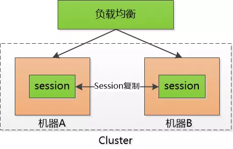
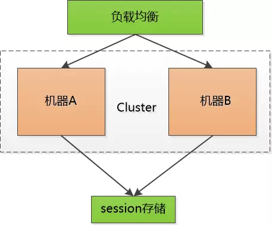
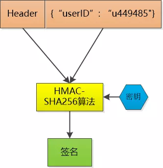
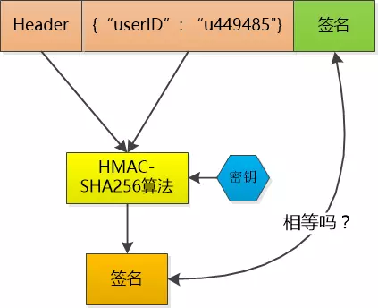
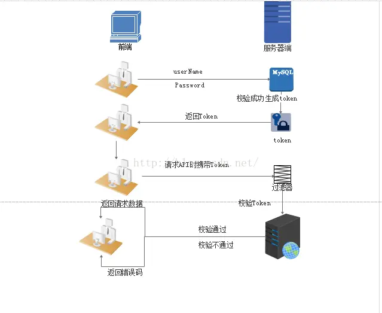
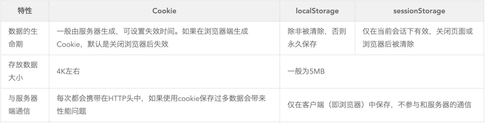

# web安全认证概览


很久很久以前，Web 基本上就是文档的浏览而已， 既然是浏览，作为服务器， 不需要记录谁在某一段时间里都浏览了什么文档，每次请求都是一个新的HTTP协议， 就是请求加响应， 尤其是我不用记住是谁刚刚发了HTTP请求， 每个请求对我来说都是全新的。 


但是随着交互式Web应用的兴起，像在线购物网站，需要登录的网站等等，马上就面临一个问题，那就是要管理会话，必须记住哪些人登录系统， 哪些人往自己的购物车中放商品， 也就是说我必须把每个人区分开，这就是一个不小的挑战，因为HTTP请求是无状态的 


## session

针对上述问题，第一种解决办法就是给大家发一个会话标识(session id), 说白了就是一个随机的字串，每个人收到的都不一样， 每次大家向我发起HTTP请求的时候，把这个字符串给一并捎过来， 这样我就能区分开谁是谁了。


由于HTTP是无状态协议，为了保持浏览器与服务器之间的联系，才有了Session。Session就是用于在服务器端保存用户状态的协议。通常用来保存用户的登录状态。


### 工作原理


#### Session是如何实现的

Session内容保存在服务器端的，通常是保存在内存中，当然也可以保存在文件、数据库等等。

客户端跟服务器端通过SessionId来关联，SessionId通常以Cookie的形式存储在客户端。

每次HTTP请求，SessionId都会随着Cookie被传递到服务器端，这行就可以通过SessionId取到对应的信息，来判断这个请求来自于哪个客户端/用户。





| 对象      | 职责                |
| --------- | ------------------- |
| SessionId | 负责标识客户端/用户 |
| HTTP      | 负责传递SessionId   |
| Cookie    | 负责保存SessionId   |
| 服务器    | 负责保存Session内容 |


#### 如果没有Cookie的话Session还能用吗

Cookie可以说是Session技术中至关重要的一环。如果客户端禁用了Cookie，那么Seesion就无法正常工作。


最后再强调一下，**Session是一种协议，是保持用户状态的协议。**
也就是说，只要能通过SessionId来识别客户端，并能将客户端对应的用户状态保存在服务器端，都可以认为是Session的实现。不论Session是保存在服务器内存，还是数据库，还是memcached、redis。

另外，各Web开发框架都会有Session的实现，不论是ASP.NET还是Java Servlet。另外，通常Seesion内容都会默认保存在Web应用所在的服务器，SessionId保存在Cookie中。


### 使用建议

- Session中保存的数据的大小要考虑到存储上线不论是内存还是数据库
- Session中不要存储不可恢复的内容
- 依赖Session的关键业务一定要确保客户端开启了Cookie
- 注意Session的过期时间
- 在负载均衡的情况下，由于存在Web服务器内存中的Session无法共享，通常需要重写Session的实现。


### 存在的问题

1. 对于客户端，每个人只需要保存自己的session id；而服务器要保存所有人的session id ！ 如果访问服务器多了， 就得由成千上万，甚至几十万个。

2. 限制了服务器扩展能力， 比如说用两个机器组成了一个集群， 小F通过机器A登录了系统， 那session id会保存在机器A上， 假设小F的下一次请求被转发到机器B怎么办？ 机器B可没有小F的 session id。

   > 1.  有时候会采用一点小伎俩： session sticky ， 就是让小F的请求一直粘连在机器A上， 但是这也不管用， 要是机器A挂掉了， 还得转到机器B去。 
   > 2.  session 复制， 把session id 在两个机器之间搬来搬去 


​	

用memcache/redis等，把session id 集中存储到一个地方， 所有的机器都来访问这个地方的数据， 这样一来，就不用复制了， 但是增加了单点失败的可能性， 要是那个负责session 的机器挂了， 所有人都得重新登录一遍。 

也可以尝试把这个单点的机器也搞出集群，增加可靠性。




## token

比如说， 小F已经登录了系统， 服务器给他发一个令牌(token)， 里边包含了小F的 user id， 下一次小F 再次通过Http 请求访问我的时候， 把这个token 通过Http header 带过来不就可以了。

 

不过这和session id没有本质区别， 任何人都可以可以伪造，  所以得想点儿办法， 让别人伪造不了。

 

那就对数据做一个签名吧， 比如说我用HMAC-SHA256 算法，加上一个只有我才知道的密钥，  对数据做一个签名， 把这个签名和数据一起作为token ，   由于密钥别人不知道， 就无法伪造token了。





这个token 我不保存，  当小F把这个token 给我发过来的时候，我再用同样的HMAC-SHA256 算法和同样的密钥，对数据再计算一次签名， 和token 中的签名做个比较， 如果相同， 我就知道小F已经登录过了，并且可以直接取到小F的user id ,  如果不相同， 数据部分肯定被人篡改过， 我就告诉发送者： 对不起，没有认证。




Token 中的数据是明文保存的（虽然我会用Base64做下编码， 但那不是加密）， 还是可以被别人看到的， 所以我不能在其中保存像密码这样的敏感信息。

 

当然， 如果一个人的token 被别人偷走了， 那我也没办法， 我也会认为小偷就是合法用户， 这其实和一个人的session id 被别人偷走是一样的。

 

这样一来， 服务器就不保存session id 了， 只是生成token , 然后验证token ，  用服务器的CPU计算时间获取了我的session 存储空间 ！


---

### 引入目的

Token是在客户端频繁向服务端请求数据，服务端频繁的去数据库查询用户名和密码并进行对比，判断用户名和密码正确与否，并作出相应提示，在这样的背景下，Token便应运而生。

Token的目的是为了减轻服务器的压力，减少频繁的查询数据库，使服务器更加健壮。


### 组成

token也称作令牌，由**uid+time+sign[+固定参数]**组成:

- uid: 用户唯一身份标识
- time: 当前时间的时间戳
- sign: 签名, 使用 hash/encrypt 压缩成定长的十六进制字符串，以防止第三方恶意拼接
- 固定参数(可选): 将一些常用的固定参数加入到 token 中是为了避免重复查库


由其组成可以看出, token 的认证方式类似于**临时的证书签名**, 并且是一种服务端无状态的认证方式, 非常适合于 REST API 的场景. 所谓无状态就是服务端并不会保存身份认证相关的数据,

token 只被保存在客户端 中的cookie 或 localstorage(数据库).
 **因为用户的状态在服务端的内存中是不存储的，所以这是一种无状态的认证机制。**


### token的认证流程

1. 用户登录校验，校验成功后就返回Token给客户端。
2. 客户端收到数据后保存在客户端
3. 客户端每次访问API是携带Token到服务器端。
4. 服务器端采用filter过滤器校验。校验成功则返回请求数据，校验失败则返回错误码


 这个token必须要在每次请求时发送给服务器，它应该保存在请求头中，另外，服务器要支持CORS（跨来源资源共享）策略，一般我们在服务端这么做就可以了 Access-Control-Allow-Origin：*。（spring: @CrossOrigin(allowCredentials = "true")）


### 优点：

- 无状态、可扩展

- 安全性

  > 请求中发送token而不再是发送cookie能够防止CSRF(跨站请求伪造)。即使在客户端使用cookie存储token，cookie也仅仅是一个存储机制而不是用于认证。不将信息存储在Session中，让我们少了对session操作。 
  >
  > token是有时效的，一段时间之后用户需要重新验证。我们也不一定需要等到token自动失效，token有撤回的操作，通过token revocataion可以使一个特定的token或是一组有相同认证的token无效。

- 可扩展性

- 多平台跨域


### 缺点:

 因为 token 一般都是 hash/encrypt 的字符串, 所以会额外附加 加密/解密 的性能开销
 有些加密方式同样存在安全隐患


### 适用场景

- 防止表单重复提交
- anti csrf攻击（跨站点请求伪造）
- 身份验证（单点登录）


## cookie

cookie 是一个非常具体的东西，指的就是浏览器里面能永久存储的一种数据。跟服务器没啥关系，仅仅是浏览器实现的一种数据存储功能。

cookie由服务器生成，发送给浏览器，浏览器把cookie以KV形式存储到某个目录下的文本文件中，下一次请求同一网站时会把该cookie发送给服务器。由于cookie是存在客户端上的，所以浏览器加入了一些限制确保cookie不会被恶意使用，同时不会占据太多磁盘空间。所以每个域的cookie数量是有限制的。


### 工作原理

在Request的时候，浏览器将Cookie信息放在HTTP-Request Headers中。

在Response的时候，浏览器保存HTTP-Response Headers信息中的Cookie信息。

Cookie的核心信息包含三个部分：Name、Value、过期时间。

Cookie的保存是覆盖式的，所以Cookie的添加、更新、删除对于浏览器来说都是执行设置（set）的动作。


### 组成

(1)Name/Value：设置Cookie的名称及相对应的值，对于认证Cookie，Value值包括Web服务器所提供的访问令牌

(2)Expires属性：设置Cookie的生存期

(3)Path属性：定义了Web站点上可以访问该Cookie的目录

(4)Domain属性：指定了可以访问该 Cookie 的 Web 站点或域。

(5)Secure属性：指定是否使用HTTPS安全协议发送Cookie

(6)HTTPOnly 属性 ：用于防止客户端脚本通过document.cookie属性访问Cookie


### 特点

#### 1、存储特点

- （1）存储大小受限，跟浏览器版本有关
- （2）存储条数受限，跟浏览器版本有关
- （3）字符编码为Unicode，不支持直接存储中文
- （4）存储内容可以被轻松查看，不建议存储敏感信息
- （5）可靠性差，可能随时都会因为各种原因被删除
- （6）存储属性除了Name、Value、过期时间，还有Domian、Path，当前域可以操作当前域子域、父域名的Cookie，当前Path，可以操作当前Path以及当前Path子、父Path下的Cookie。

> domian：www.ken.io 是ken.io的子域，是test.www.ken.io的父域，同时也是blog.ken.io的同级域名。www.ken.io下的应用可以访问ken.io以及*.www.ken.io下的Cookie，但是不能访问blog.ken.io下的Cookie
>
> path:例如页面：http://ken.io/home/about 路径是/home/about，这个路径下可以访问到根路径/以及/home/*路径下的Cookie，当时不能访问到/category下的Cookie

#### 2、传输特点

- （1）每次Request客户端符合domian以及path要求的Cookie都会通过Request Headers传输到服务器端
- （2）传输的Cookie大小会受到浏览器以及Web服务器的限制

#### 3、安全特点

- Cookie中的信息很容易被查看，建议加密后存储
- Cookie容易被XSS攻击利用，可以设置HttpOnly=true，不允许客户端读写

> 版本过于老旧的浏览器不支持HttpOnly=true的属性


### 使用经验/建议

- 不要保存未经加密敏感信息（安全性）
- 如果不需要在客户端访问，设置HttpOnly=true（安全性）
- 设置合理的过期时间（传输效率）
- 不要存储过大的内容（传输效率）
- 不要存储过多的条目（传输效率）
- 设置合理的domian、path，减少不必要的Cookie传输（传输效率）
- 不要存储非Unicode字符（可用性）
- 不要存储不可恢复的信息（可靠性）


### Cookie API

- Cookie类用于创建一个Cookie对象
- response接口中定义了一个addCookie方法，它用于在其响应头中增加一个相应的Set-Cookie头字段
- request接口中定义了一个getCookies方法，它用于获取客户端提交的Cookie


常用的Cookie方法：

- public Cookie(String name,String value)
- setValue与getValue方法
- setMaxAge与getMaxAge方法
- setPath与getPath方法
- setDomain与getDomain方法
- getName方法


# session详解

基于session服务器验证方式暴露的一些问题

1.Seesion：每次认证用户发起请求时，服务器需要去创建一个记录来存储信息。当越来越多的用户发请求时，内存的开销也会不断增加。

2.可扩展性：在服务端的内存中使用Seesion存储登录信息，伴随而来的是可扩展性问题。

3.CORS(跨域资源共享)：当我们需要让数据跨多台移动设备上使用时，跨域资源的共享会是一个让人头疼的问题。在使用Ajax抓取另一个域的资源，就可以会出现禁止请求的情况。

4.CSRF(跨站请求伪造)：用户在访问银行网站时，他们很容易受到跨站请求伪造的攻击，并且能够被利用其访问其他的网站。


 在这些问题中，可扩展行是最突出的。 


# token详解

在Web领域基于Token的身份验证随处可见。在大多数使用Web API的互联网公司中，tokens 是多用户下处理认证的最佳方式。 

大部分Web应用都使用tokens。例如Facebook, Twitter, Google+, GitHub等。 


基于Token的身份验证是无状态的，我们不将用户信息存在服务器或Session中。

这种概念解决了在服务端存储信息时的许多问题。NoSession意味着你的程序可以根据需要去增减机器，而不用去担心用户是否登录。


## 特征

1.无状态、可扩展

> 在客户端存储的Tokens是无状态的，并且能够被扩展。基于这种无状态和不存储Session信息，负载负载均衡器能够将用户信息从一个服务传到其他服务器上。
>
> 如果我们将已验证的用户的信息保存在Session中，则每次请求都需要用户向已验证的服务器发送验证信息(称为Session亲和性)。用户量大时，可能会造成一些拥堵。

2.支持移动设备

3.跨程序调用

4.安全性

> 请求中发送token而不再是发送cookie能够防止CSRF(跨站请求伪造)。即使在客户端使用cookie存储token，cookie也仅仅是一个存储机制而不是用于认证。不将信息存储在Session中，让我们少了对session操作。 


## 验证过程

1.用户通过用户名和密码发送请求。

2.程序验证。

3.程序返回一个签名的token 给客户端。

4.客户端储存token,并且每次用于每次发送请求。

5.服务端验证token并返回数据。


每一次请求都需要token。token应该在HTTP的头部发送从而保证了Http请求无状态。

我们同样通过设置服务器属性`Access-Control-Allow-Origin:*` ，让服务器能接受到来自所有域的请求。

需要注意的是：在`Access-Control-Allow-Origin`头部标明`(designating)*`时，不得带有像`HTTP`认证，客户端`SSL`证书和`cookies`的证书。




1.用户登录校验，校验成功后就返回Token给客户端。

2.客户端收到数据后保存在客户端

3.客户端每次访问API是携带Token到服务器端。

4.服务器端采用filter过滤器校验。校验成功则返回请求数据，校验失败则返回错误码


## 组成

- uid: 用户唯一身份标识
- time: 当前时间的时间戳
- sign: 签名, 使用 hash/encrypt 压缩成定长的十六进制字符串，以防止第三方恶意拼接
- 固定参数(可选): 将一些常用的固定参数加入到 token 中是为了避免重复查库


## CSRF

假如用户正在登陆银行网页，同时登陆了攻击者的网页，并且银行网页未对csrf攻击进行防护。攻击者就可以在网页放一个表单，该表单提交src为`http://www.bank.com/api/transfer`，body为`count=1000&to=Tom`。倘若是session+cookie，用户打开网页的时候就已经转给Tom1000元了.因为form 发起的 POST 请求并不受到浏览器同源策略的限制，因此可以任意地使用其他域的 Cookie 向其他域发送 POST 请求，形成 CSRF 攻击。在post请求的瞬间，cookie会被浏览器自动添加到请求头中。但token不同，token是开发者为了防范csrf而特别设计的令牌，浏览器不会自动添加到headers里，攻击者也无法访问用户的token，所以提交的表单无法通过服务器过滤，也就无法形成攻击。 


## JWT

用户认证。一般流程是下面这样

> 1、用户向服务器发送用户名和密码。
>
> 2、服务器验证通过后，在当前对话（session）里面保存相关数据，比如用户角色、登录时间等等。
>
> 3、服务器向用户返回一个 session_id，写入用户的 Cookie。
>
> 4、用户随后的每一次请求，都会通过 Cookie，将 session_id 传回服务器。
>
> 5、服务器收到 session_id，找到前期保存的数据，由此得知用户的身份。

这种模式的问题在于，扩展性（scaling）不好。单机当然没有问题，如果是服务器集群，或者是跨域的服务导向架构，就要求 session 数据共享，每台服务器都能够读取 session。

举例来说，A 网站和 B 网站是同一家公司的关联服务。现在要求，用户只要在其中一个网站登录，再访问另一个网站就会自动登录，请问怎么实现？

一种解决方案是 session 数据持久化，写入数据库或别的持久层。各种服务收到请求后，都向持久层请求数据。这种方案的优点是架构清晰，缺点是工程量比较大。另外，持久层万一挂了，就会单点失败。

另一种方案是服务器索性不保存 session 数据了，所有数据都保存在客户端，每次请求都发回服务器。JWT 就是这种方案的一个代表。

### JWT 的原理

JWT 的原理是，服务器认证以后，生成一个 JSON 对象，发回给用户，就像下面这样。

```json
{
  "姓名": "张三",
  "角色": "管理员",
  "到期时间": "2018年7月1日0点0分"
}
```

以后，用户与服务端通信的时候，都要发回这个 JSON 对象。服务器完全只靠这个对象认定用户身份。为了防止用户篡改数据，服务器在生成这个对象的时候，会加上签名（详见后文）。

服务器就不保存任何 session 数据了，也就是说，服务器变成无状态了，从而比较容易实现扩展。

### JWT 的数据结构


它是一个很长的字符串，中间用点（`.`）分隔成三个部分。（注意，JWT 内部是没有换行的，这里只是为了便于展示，将它写成了几行。）

JWT 的三个部分依次如下。

> Header（头部）
>
> Payload（负载）
>
> Signature（签名）

写成一行，就是下面的样子。

> Header.Payload.Signature


#### Header

Header 部分是一个 JSON 对象，描述 JWT 的元数据，通常是下面的样子。

```json
{
  "alg": "HS256",
  "typ": "JWT"
}
```

`alg`属性表示签名的算法（algorithm），默认是 HMAC SHA256（写成 HS256）；

`typ`属性表示这个令牌（token）的类型（type），JWT 令牌统一写为`JWT`。

最后，将上面的 JSON 对象使用 Base64URL 算法转成字符串。

#### Payload

Payload 部分也是一个 JSON 对象，用来存放实际需要传递的数据。JWT 规定了7个官方字段，供选用。

> - iss (issuer)：签发人
> - exp (expiration time)：过期时间
> - sub (subject)：主题
> - aud (audience)：受众
> - nbf (Not Before)：生效时间
> - iat (Issued At)：签发时间
> - jti (JWT ID)：编号

除了官方字段，你还可以在这个部分定义私有字段，下面就是一个例子。

```json
{
  "sub": "1234567890",
  "name": "John Doe",
  "admin": true
}
```

**注意：**JWT 默认是不加密的，任何人都可以读到，所以不要把秘密信息放在这个部分。

这个 JSON 对象也要使用 Base64URL 算法转成字符串。

#### Signature

Signature 部分是对前两部分的签名，防止数据篡改。

首先，需要指定一个密钥（secret）。这个密钥只有服务器才知道，不能泄露给用户。然后，使用 Header 里面指定的签名算法（默认是 HMAC SHA256），按照下面的公式产生签名。

> HMACSHA256(
>   base64UrlEncode(header) + "." +
>   base64UrlEncode(payload),
>   secret)

算出签名以后，把 Header、Payload、Signature 三个部分拼成一个字符串，每个部分之间用"点"（`.`）分隔，就可以返回给用户。


### Base64URL

Header 和 Payload 串型化的算法是 Base64URL。这个算法跟 Base64 算法基本类似，但有一些小的不同。

JWT 作为一个令牌（token），有些场合可能会放到 URL（比如 api.example.com/?token=xxx）。Base64 有三个字符`+`、`/`和`=`，在 URL 里面有特殊含义，所以要被替换掉：`=`被省略、`+`替换成`-`，`/`替换成`_` 。这就是 Base64URL 算法。


### JWT 的使用方式

客户端收到服务器返回的 JWT，可以储存在 Cookie 里面，也可以储存在 localStorage。

此后，客户端每次与服务器通信，都要带上这个 JWT。你可以把它放在 Cookie 里面自动发送，但是这样不能跨域，所以更好的做法是放在 HTTP 请求的头信息`Authorization`字段里面。

```json
Authorization: Bearer <token>
```

另一种做法是，跨域的时候，JWT 就放在 POST 请求的数据体里面。


### JWT 的几个特点

> （1）JWT 默认是不加密，但也是可以加密的。生成原始 Token 以后，可以用密钥再加密一次。
>
> （2）JWT 不加密的情况下，不能将秘密数据写入 JWT。
>
> （3）JWT 不仅可以用于认证，也可以用于交换信息。有效使用 JWT，可以降低服务器查询数据库的次数。
>
> （4）JWT 的最大缺点是，由于服务器不保存 session 状态，因此无法在使用过程中废止某个 token，或者更改 token 的权限。也就是说，一旦 JWT 签发了，在到期之前就会始终有效，除非服务器部署额外的逻辑。
>
> （5）JWT 本身包含了认证信息，一旦泄露，任何人都可以获得该令牌的所有权限。为了减少盗用，JWT 的有效期应该设置得比较短。对于一些比较重要的权限，使用时应该再次对用户进行认证。
>
> （6）为了减少盗用，JWT 不应该使用 HTTP 协议明码传输，要使用 HTTPS 协议传输。


# cookie详解


## 客户端设置

```js
document.cookie = "name=xiaoming; age=12 "
```

客户端可以设置cookie的一下选项: expires, domain, path, secure(只有在https协议的网页中, 客户端设置secure类型cookie才能生效), 但无法设置httpOnly选项。


 设置cookie => cookie被自动添加到request header中 => 服务端接收到cookie 


## 服务端设置

不管你是请求一个资源文件(如html/js/css/图片), 还是发送一个ajax请求, 服务端都会返回response.而response header中有一项叫`set-cookie`, 是服务端专门用来设置cookie的;

- 一个set-cookie只能设置一个cookie, 当你想设置多个, 需要添加同样多的`set-cookie`
- 服务端可以设置cookie的所有选项: expires, domain, path, secure, HttpOnly


### Cookie，SessionStorage，LocalStorage

HTML5提供了两种本地存储的方式 sessionStorage 和 localStorage；




# 总结

- session存储于服务器，可以理解为一个状态列表，拥有一个唯一识别符号sessionId，通常存放于cookie中。服务器收到cookie后解析出sessionId，再去session列表中查找，才能找到相应session。依赖cookie
- cookie类似一个令牌，装有sessionId，存储在客户端，浏览器通常会自动添加。
- token也类似一个令牌，无状态，用户信息都被加密到token中，服务器收到token后解密就可知道是哪个用户。需要开发者手动添加。
- jwt只是一个跨域认证的方案