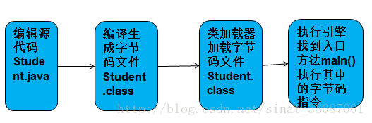
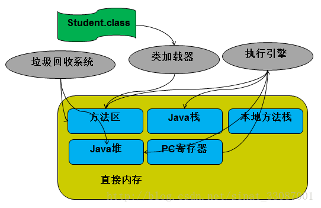
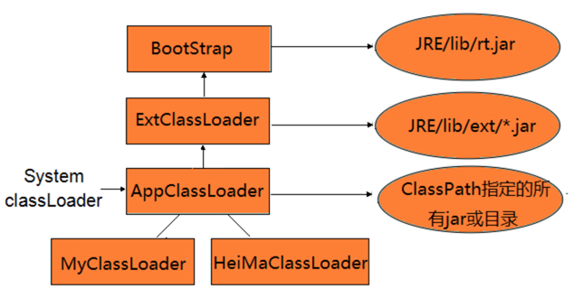
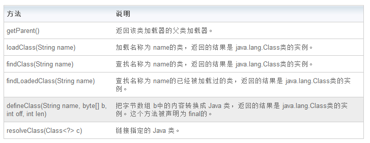
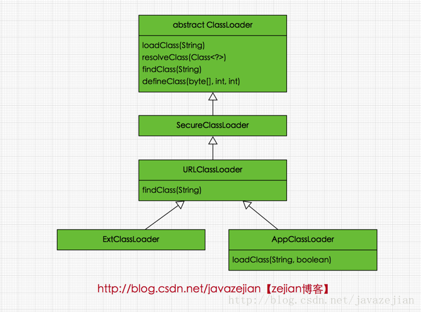

# **Java程序执行流程**

[原文链接](https://blog.csdn.net/sinat_33087001/article/details/76977437)

- 分为以下几个步骤：编辑源码、编译生成class文件、(加载class文件、运行class字节码文件)，其中后两个步骤都是在jvm虚拟机上执行的。



## 1. 编译

- 命令**javac    xxx.java**将该源码文件编译生成.class字节码文件

### 字节码文件：

- 实现了java语言的跨平台

> jvm运行的是class字节码文件，只要是这种格式的文件就行。
>
> jvm并不与java语言紧紧地捆绑在一起。如果非常熟悉字节码的格式要求，可以使用二进制编辑器自己写一个符合要求的字节码文件，然后交给jvm去运行**；**或者把其他语言编写的源码编译成字节码文件，交给jvm去运行，只要是合法的字节码文件，jvm都会正确地跑起来。
>
> 它存放了一个类的各种信息：字段、方法、父类、实现的接口等各种信息。

## 2.运行

- 命令行中输入**java xxx**这个命令，就**启动了一个java虚拟机**，然后加载xxx.class字节码文件到内存，然后运行内存中的字节码指令了。

### 2.1JVM基本结构介绍



- **方法区**：用于存放类、接口的元数据信息，加载进来的字节码数据都存储在方法区
- **Java栈（**虚拟机栈）：执行引擎运行字节码时的运行时内存区，采用栈帧的形式保存每个方法的调用运行数据
- **本地方法栈**：执行引擎调用本地方法时的运行时内存区
- **Java堆（**堆）：运行时数据区，各种对象一般都存储在堆上
- **PC寄存器（**程序计数器）：功能如同CPU中的PC寄存器，指示要执行的字节码指令。


> JVM的功能模块主要包括**类加载器、执行引擎**和**垃圾回收系统**。


### 2.2类加载步骤


**1.加载**：

​	1）类加载器会在指定的classpath中找到xxx.class（通过类的全限定名）这个文件，然后读取字节流中的数据，将其存储在**方法区**中。

​	2）会根据xxx.class的信息建立一个**Class对象**，这个对象比较特殊，一般也存放在**方法区**中，用于作为运行时访问xxx类的各种数据的接口。

**2.链接**：

**（1）验证阶段**：

​		格式验证：验证是否符合class文件规范

​		语义验证：检查一个被标记为final的类型是否包含子类；检查一个类中的final方法视频被子类进行重写；确保父类和子类之间没有不兼容的一些方法声明（比如方法签名相同，但方法的返回值不同）

​		操作验证：在操作数栈中的数据必须进行正确的操作，对常量池中的各种符号引用执行验证（通常在解析阶段执行，检查是否通过富豪引用中描述的全限定名定位到指定类型上，以及类成员信息的访问修饰符是否允许访问等）

**（2）准备阶段**：

​		为xxx类中的静态字段分配内存空间，也是在**方法区**中，并**进行零初始化**，即数字类型初始化为0，boolean初始化为false，引用类型初始化为null等。

**（3）解析阶段**：

**3.初始化**：

​	由于已经加载到内存了，所以原来字节码文件中存放的部分方法、字段等的符号引用可以解析为其在内存中的直接引用了，而不一定非要等到真正运行时才进行解析。


#### 2.2.1类加载器：

> 整个类加载的过程，是由类加载器（java.lang.ClassLoader）来负责的。

##### 系统自带的ClassLoader 

1. **BootstrapClassloader: 启动类加载器**, 加载JAVA_HOME/lib/目录下的所有jar包, 而该目录下的主要放系统核心类库,比如包含Object, String等类的rt.jar就是由该类加载器加载进内存的。

   注意必由于虚拟机是按照文件名识别加载jar包的，如rt.jar，如果文件名不被虚拟机识别，即使把jar包丢到lib目录下也是没有作用的(出于安全考虑，Bootstrap启动类加载器只加载包名为java、javax、sun等开头的类)。

2. **ExtClassloader: 扩展类加载器**, 加载JAVA_HOME/jre/lib/ext/目录下的所有jar包或者由java.ext.dirs系统属性指定的jar包。放入这个目录下的jar包对所有AppClassloader都是可见的(双亲委派模型 ). 

3. **AppClassloader | SystemClassLoader: 应用类加载器**, 也叫系统类加载器. 是我们平时接触最密切的类加载器, 主要负责加载classpath下的所有类. 平时我们用maven构建项目时, 添加进pom文件中的依赖, 最后都是由idea帮我们直接把依赖关联的jar包放到classPath下, 并在运行时, 由AppClassloader帮我们把这些jar包中的class加载到内存中.

   开发者可以直接使用系统类加载器，一般情况下该类加载是程序中默认的类加载器，通过`ClassLoader#getSystemClassLoader()`方法可以获取到该类加载器。 

4. 自定义类加载器（custom class loader）

   除了系统提供的类加载器以外，开发人员可以通过继承 java.lang.ClassLoader类的方式实现自己的类加载器，以满足一些特殊的需求。

- 总结：BootstrapClassloader和ExtClassLoader主要负责加载**JDK相关的系统类**。AppClassLoader来处理**我们classpath下的所有类**。

##### 用户自定义类加载ClassLoader



#### 2.2.2双亲委托模型：

- 约定类加载器的加载机制

- 内容：

  ​	双亲委托模型的工作过程是：如果一个类加载器收到了类加载的请求，它首先不会自己去尝试加载这个类，而是把这个请求委托给父类加载器去完成，每一个层次的类加载器都是如此，因此所有的加载请求最终都应该传送到顶层的启动类加载器中，只有当父类加载器反馈自己无法完成这个加载请求（它的搜索范围中没有找到所需要加载的类）时，子加载器才会尝试自己去加载。

- 好处

  ​	能够有效确保一个类的全局唯一性，当程序中出现多个限定名相同的类时，类加载器在执行加载时，始终只会加载其中的某一个类。

  > ​	使用双亲委托模型来组织类加载器之间的关系，有一个显而易见的好处就是**Java类随着它的类加载器一起具备了一种带有优先级的层次关系**。例如类java.lang.Object，它存放在rt.jar之中，无论哪一个类加载器要加载这个类，最终都是委托给处于模型最顶端的启动类加载器进行加载，因此Object类在程序的各种加载器环境中都是同一个类。相反，如果没有使用双亲委托模型，由各个类加载器自行去加载的话，如果用户自己编写了一个称为java.lang.Object的类，并放在程序的ClassPath中，那系统中将会出现多个不同的Object类，Java类型体系中最基础的行为也就无法保证，应用程序也将会变得一片混乱。如果自己去编写一个与rt.jar类库中已有类重名的Java类，将会发现可以正常编译，但永远无法被加载运行。
  >
  > 
  >
  > ​	双亲委托模型对于保证Java程序的稳定运作很重要，但它的实现却非常简单，实现双亲委托的代码都集中在**java.lang.ClassLoader的loadClass()方法**中，逻辑清晰易懂：先检查是否已经被加载过，若没有加载则调用父类加载器的loadClass()方法，若父加载器为空则默认使用启动类加载器作为父加载器。如果父类加载器加载失败，抛出ClassNotFoundException异常后，再调用自己的findClass方法进行加载。

#### 2.2.3类与类加载器

在JVM中表示两个class对象是否为同一个类对象存在两个必要条件

- 类的完整类名必须一致，包括包名。
- 加载这个类的ClassLoader(指ClassLoader实例对象)必须相同。

#### 2.2.4问题解答：

- 1. 类使用前需要ClassLoader加载到内存,那ClassLoader本身是由谁加载的?

     > BootStrapClassLoader并不是用java写的，而是用C++,他属于JVM的一部分，在JVM启动时就会被连带启动起来，所以在不需要被某一个ClassLoader加载。
     >
     > ExtClassLoader和AppClassLoader是定义在rt.jar中，所以是有BootStrapClassLoader加载进来的。

  2. 一个类什么时候被加载?

     > 程序第一次使用某个类的时候，就会调用ClassLoader去加载该类。比如：new 一个类的实例对象或者使用反射Class.forName(…)来获取Class对象（类对象）都会触发类加载。


### 2.3运行字节码指令：

- 执行引擎找到main()这个入口方法，执行其中的字节码指令：

> 只有当前正在运行的方法的栈帧位于栈顶，当前方法返回，则当前方法对应的栈帧出栈，当前方法的调用者的栈帧变为栈顶；**当前方法的方法体中若是调用了其他方法，则为被调用的方法创建栈帧，并将其压入栈顶。**


## 3.类加载器（java.lang.ClassLoader）介绍

- 根据一个指定的类的名称，找到或者生成其对应的字节代码，然后从这些字节代码中定义出一个Java 类，即 java.lang.Class类的一个实例。

### 3.1比较重要的方法



### 3.2Java中定义的类加载器及其双亲委派模式的实现，它们类图关系如下



### 3.3ClassLoader中几个比较重要的方法

#### 3.3.1loadClass(String)

- 该方法加载指定名称（包括包名）的二进制类型，该方法在JDK1.2之后不再建议用户重写但用户可以直接调用该方法，loadClass()方法是ClassLoader类自己实现的，该方法中的逻辑就是双亲委派模式的实现（resolve参数代表是否生成class对象的同时进行解析相关操作）

```java
protected Class<?> loadClass(String name, boolean resolve)
      throws ClassNotFoundException
{
  synchronized (getClassLoadingLock(name)) {
	  // 先从缓存查找该class对象，找到就不用重新加载
	  Class<?> c = findLoadedClass(name);
	  if (c == null) {
		  long t0 = System.nanoTime();
		  try {
			  if (parent != null) {
				  //如果找不到，则委托给父类加载器去加载
				  c = parent.loadClass(name, false);
			  } else {
			  //如果没有父类，则委托给启动加载器去加载
				  c = findBootstrapClassOrNull(name);
			  }
		  } catch (ClassNotFoundException e) {
			  // ClassNotFoundException thrown if class not found
			  // from the non-null parent class loader
		  }

		  if (c == null) {
			  // If still not found, then invoke findClass in order
			  // 如果都没有找到，则通过自定义实现的findClass去查找并加载
			  c = findClass(name);

			  // this is the defining class loader; record the stats
			  sun.misc.PerfCounter.getParentDelegationTime().addTime(t1 - t0);
			  sun.misc.PerfCounter.getFindClassTime().addElapsedTimeFrom(t1);
			  sun.misc.PerfCounter.getFindClasses().increment();
		  }
	  }
	  if (resolve) {//是否需要在加载时进行解析
		  resolveClass(c);
	  }
	  return c;
  }
}
```

- 正如loadClass方法所展示的，当类加载请求到来时，先从缓存中查找该类对象，如果存在直接返回，如果不存在则交给该类加载去的父加载器去加载，倘若没有父加载则交给顶级启动类加载器去加载，最后倘若仍没有找到，则使用findClass()方法去加载（关于findClass()稍后会进一步介绍）。

- 从loadClass实现也可以知道如果不想重新定义加载类的规则，也没有复杂的逻辑，只想在运行时加载自己指定的类，那么我们可以直接使用this.getClass().getClassLoder.loadClass("className")，这样就可以直接调用ClassLoader的loadClass方法获取到class对象。

#### 3.3.2findClass(String) 

- 在JDK1.2之前，在自定义类加载时，总会去继承ClassLoader类并重写loadClass方法，从而实现自定义的类加载类，但是在JDK1.2之后已不再建议用户去覆盖loadClass()方法，而是建议把自定义的类加载逻辑写在findClass()方法中
- 从前面的分析可知，findClass()方法是在loadClass()方法中被调用的，当loadClass()方法中父加载器加载失败后，则会调用自己的findClass()方法来完成类加载，这样就可以保证自定义的类加载器也符合双亲委托模式。
- 需要注意的是ClassLoader类中并没有实现findClass()方法的具体代码逻辑，取而代之的是抛出ClassNotFoundException异常，同时应该知道的是findClass方法通常是和defineClass方法一起使用的(稍后会分析)

```java
protected Class<?> findClass(String name) throws ClassNotFoundException {
    throw new ClassNotFoundException(name);
}

```

#### 3.3.3defineClass(byte[] b, int off, int len) 

- 用来将byte字节流解析成JVM能够识别的Class对象(ClassLoader中已实现该方法逻辑)。
- 通过这个方法不仅能够通过class文件实例化class对象，也可以通过其他方式实例化class对象，如通过网络接收一个类的字节码，然后转换为byte字节流创建对应的Class对象。
- defineClass()方法通常与findClass()方法一起使用，一般情况下，在自定义类加载器时，会直接覆盖ClassLoader的findClass()方法并编写加载规则，取得要加载类的字节码后转换成流，然后调用defineClass()方法生成类的Class对象
- 简单例子如下

```java
protected Class<?> findClass(String name) throws ClassNotFoundException {
      // 获取类的字节数组
      byte[] classData = getClassData(name);  
      if (classData == null) {
          throw new ClassNotFoundException();
      } else {
          //使用defineClass生成class对象
          return defineClass(name, classData, 0, classData.length);
      }
  }
```

- 需要注意的是，如果直接调用defineClass()方法生成类的Class对象，这个类的Class对象并没有解析(也可以理解为链接阶段，毕竟解析是链接的最后一步)，其解析操作需要等待初始化阶段进行。

#### 3.3.4resolveClass(Class≺?≻ c) 

- 使用该方法可以使用类的Class对象创建完成也同时被解析。
- 前面我们说链接阶段主要是对字节码进行验证，为类变量分配内存并设置初始值同时将字节码文件中的符号引用转换为直接引用。

[原文链接](<https://blog.csdn.net/javazejian/article/details/73413292>)