# java垃圾回收

[https://caojiele.com/2019/04/18/java-jvm-gc/](https://caojiele.com/2019/04/18/java-jvm-gc/)


## 引用计数算法

每个对象添加到引用计数器，每被引用一次，计数器+1，失去引用，计数器-1，当计数器在一段时间内为0时，即认为该对象可以被回收了。

但是这个算法有个明显的缺陷：当两个对象相互引用，但是二者都已经没有作用时，理应把它们都回收，但是由于它们相互引用，不符合垃圾回收的条件，所以就导致无法处理掉这一块内存区域。


## 根搜索算法

 基本思想是：从一个叫`GC Roots`的根节点出发，向下搜索，如果一个对象不能达到`GC Roots`的时候，说明该对象不再被引用，可以被回收。

如下图中的`Object5、Object6、Object7`，虽然它们三个依然相互引用，但是它们其实已经没有作用了，这样就解决了引用计数算法的缺陷。


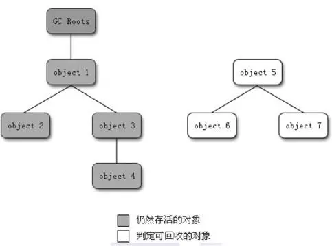

目前 `Java` 中可以作为 `GC ROOT` 的对象有：

1. **虚拟机栈** 中引用的对象（局部变量表）；
2. **方法区** 中 **静态变量** 引用的对象；
3. **方法区** 中 **常量** 引用的对象；
4. **本地方法栈** 中引用的对象（`Native` 对象）。


## 什么样的类需要被回收

- a.该类的所有实例都已经被回收；
- b.加载该类的`ClassLoad`已经被回收；
- c.该类对应的反射类`java.lang.Class`对象没有被任何地方引用。


## 相关概念


### 吞吐量（Throughput）

​		吞吐量就是**CPU用于运行用户代码的时间**与**CPU总消耗时间**的比值，即

​		**吞吐量 = 运行用户代码时间 /（运行用户代码时间 + 垃圾收集时间）。**

​		假设虚拟机总共运行了100分钟，其中垃圾收集花掉1分钟，那吞吐量就是99%。

​		垃圾收集时间越短，吞吐量越高；垃圾收集时间越长，吞吐量越低。

 

###  停顿时间

​		指垃圾回收器正在运行时，**应用程序** 的 **暂停时间**。

​		对于 **独占回收器** 而言，停顿时间可能会比较长。

​		使用 **并发回收器** 时，由于垃圾回收器和应用程序 **交替运行**，程序的 **停顿时间** 会变短，但是，由于其 **效率** 很可能不如独占垃圾回收器，故系统的 **吞吐量** 可能会较低。


### 并发与并行


#### 串行（Parallel）

​	**单线程** 进行垃圾回收工作，但此时 **用户线程** 仍然处于 **等待状态**。


#### 并发（Concurrent）

​	这里的并发指 **用户线程** 与 **垃圾回收线程** 交替执行。


#### 并行（Parallel）

​	这里的并行指 **用户线程** 和多条 **垃圾回收线程** 分别在不同 `CPU` 上同时工作。


# 堆内存分区

 内存主要被分为三块：**新生代、老年代、持久代**。三代的特点不同，造就了他们使用的GC算法不同：

​		新生代适合生命周期较短，快速创建和销毁的对象；

​		老年代适合生命周期较长的对象；

​		持久代在`Sun Hotpot`虚拟机中就是指方法区（有些`JVM`根本就没有持久代这一说法）。


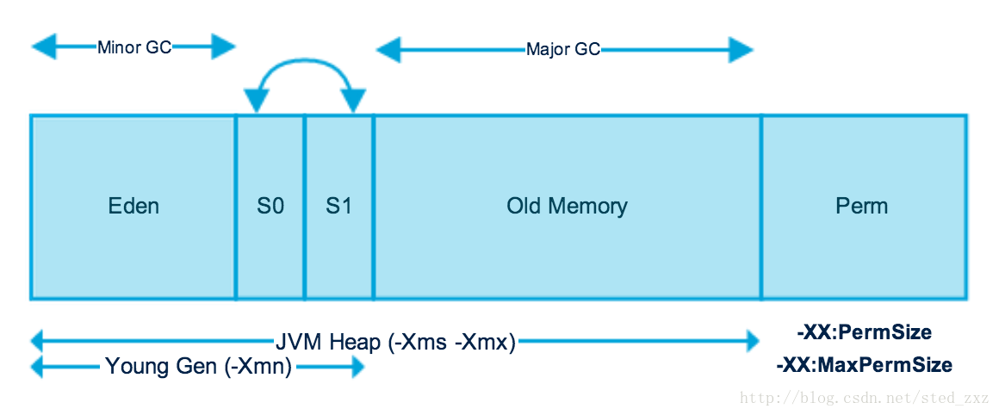

- 在 `Java` 中，堆被划分成两个不同的区域：新生代 ( `Young` )、老年代 ( `Old`)。新生代 ( `Young` ) 又被划分为三个区域：`Eden`、`S0`、`S1`。 这样划分的目的是为了使 `JVM` 能够更好的管理堆内存中的对象，包括内存的分配以及回收。


## 新生代

几乎所有新生成的对象首先都是放在新生代的。新生代内存按照<u>8:1:1</u>的比例分为一个`Eden`区和两个`Survivor`(`Survivor0,Survivor1`)区。大部分对象在`Eden`区中生成。

当新对象生成，`Eden Space`申请失败（因为空间不足等），则会发起一次`GC(Scavenge GC/MinorGC)`。回收时先将`Eden`区存活对象复制到一个`Survivor0`区，然后清空`Eden`区，当这个`Survivor0`区也存放满了时，则将`Eden`区和`Survivor0`区存活对象复制到另一个`Survivor1`区，然后清空`Eden`和这个`Survivor0`区，此时`Survivor0`区是空的，然后将`Survivor0`区和`Survivor1`区**交换**，即保持`Survivor1`区为空， 如此往复。

当`Survivor1`区不足以存放 `Eden`和`Survivor0`的存活对象时，就将存活对象直接存放到老年代。

当对象在`Survivor`区躲过一次`GC`的话，其对象年龄便会加1，默认情况下，如果对象年龄达到15岁，就会移动到老年代中。若是老年代也满了就会触发一次`Full GC/MajorGC`，也就是新生代、老年代都进行回收。

因为Java对象大多都具备朝生夕灭的特性，所以`Minor GC`非常频繁，一般回收速度也比较快。


### jvm相关参数

新生代大小可以由`-Xmn`来控制。

可以用`-XX:SurvivorRatio`来控制`Eden`和`Survivor`的比例。

`-XX:NewRatio`  新生代与老年代的比例。比如 `-XX:NewRatio=2`，则新生代占整个堆空间的1/3，老年代占2/3。

`-XX:PretenureSizeThreshold`  对象如果大于或等于此值,会直接分配到老年代里。

​		eg: `-XX:PretenureSizeThreshold=3145728`

 `-XX:MaxTenuringThreshold` 调整晋升到老年代的年龄。


## 老年代

在新生代中经历了N次垃圾回收后仍然存活的对象，就会被放到年老代中。因此，可以认为年老代中存放的都是一些生命周期较长的对象。

老年代内存比新生代也大很多(默认比例是1:2)，当老年代内存满时触发`Major GC/Full GC`，`Full GC`发生频率比较低，老年代对象存活时间比较长，存活率比较高。

一般来说，**大对象会被直接分配到老年代**。所谓的大对象是指需要大量连续存储空间的对象，最常见的一种大对象就是大数组。比如：

​      `byte[] data = new byte[4*1024*1024]`

​      这种一般会直接在老年代分配存储空间。

当然分配的规则并不是百分之百固定的，这要取决于当前使用的是哪种**垃圾收集器组合和JVM的相关参数**。

出现了`Major GC`，经常会伴随至少一次的`Minor GC`（但非绝对的，在`Parallel Scavenge`收集器的收集策略里就有直接进行`Major GC`的策略选择过程）。`Major GC`的速度一般会比`Minor GC`慢10倍以上。


## 永久代

在`HotSpot`中就是方法区。用于存放静态文件（class类、方法）和常量等。

持久代对垃圾回收没有显著影响，但是有些应用可能动态生成或者调用一些class，例如Hibernate 等，在这种时候需要设置一个比较大的持久代空间来存放这些运行过程中新增的类。对永久代的回收主要回收两部分内容：废弃常量和无用的类。

永久代空间在`Java SE8`特性中已经被移除。取而代之的是元空间（`MetaSpace`）。因此不会再出现`“java.lang.OutOfMemoryError: PermGen error”`错误。


`-XX:MaxMetaspaceSize=256m`

 `-XX:MetaspaceSize=size`


***堆内存分配策略明确以下三点：***

（1）对象优先在`Eden`分配。

（2）大对象直接进入老年代。

（3）长期存活的对象将进入老年代。


## JVM参数选项

jvm 可配置的参数选项可以参考 Oracle 官方网站给出的相关信息：

[Oracle官网示例](http://www.oracle.com/technetwork/java/javase/tech/vmoptions-jsp-140102.html)

[java8 linux Oracle官网示例](https://docs.oracle.com/javase/8/docs/technotes/tools/unix/java.html)

[java8 windows Oracle官网示例](https://docs.oracle.com/javase/8/docs/technotes/tools/windows/java.html)

下面只列举其中的几个常用和容易掌握的配置选项

| 配置参数                        | 功能                                                         |
| ------------------------------- | ------------------------------------------------------------ |
| -Xms                            | 初始堆大小，如： -Xms256m                                    |
| -Xmx                            | 最大堆大小，如： -Xmx512m                                    |
| -Xmn                            | 新生代大小。通常为Xmx的1/3或1/4。新生代=Eden + 2个Survivor空间。实际可用空间为：Eden + 1个Survivor，即90% |
| -Xss                            | 线程栈深度。JDK1.5+每个线程栈大小为1M，一般来说如果线程不是很深的话，1M足够用 |
| -XX:NewRatio                    | 新生代与老年代的比例。比如 -XX:NewRatio=2，则新生代占整个堆空间的1/3，老年代占2/3 |
| -XX:SurvivoRatio                | 新生代中Eden与Survivor的比例值。默认是8。即：8:1:1           |
| -XX:PermSize                    | 永久代（方法区）的初始大小                                   |
| -XX:MaxPermSize                 | 永久代最大值                                                 |
| -XX:+PrintGCDetails             | 打印gc信息                                                   |
| -XX:+HeapDumpOnOutOfMemoryError | 让虚拟机发生内存溢出时Dump出当前的内存堆转储快照，以便分析使用 |


# GC分类

Minor GC：回收Eden区

Major GC：回收老年代


Young Gen GC：回收 Eden + S0 + S1区

Old Gen GC： 只收集Old Gen（老年代）的GC。只有CMS的concurrent collection是这个模式 ，所以也称CMS GC


Full GC： 针对整个新生代、老生代、元空间（metaspace，java8以上版本取代perm gen）的全局范围的GC


# GC算法

常见的`GC`算法：复制、标记-清除和标记-压缩


## 复制

复制算法采用的方式为从根集合进行扫描，将存活的对象移动到一块空闲的区域，如图所示：


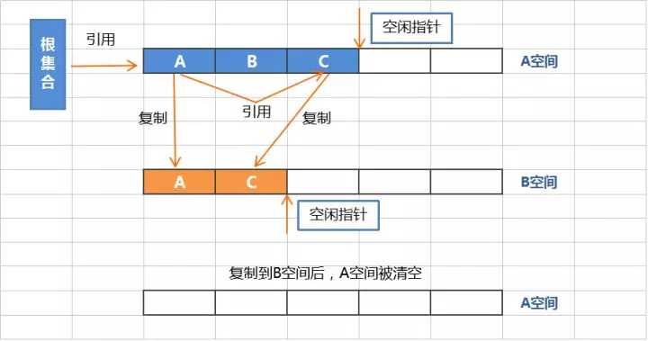


当存活的对象较少时，复制算法会比较高效（**新生代的`Eden`区就是采用这种算法**），其带来的成本是需要一块额外的空闲空间和对象的移动。


## 标记-清除

该算法采用的方式是从跟集合开始扫描，对存活的对象进行标记，标记完毕后，再扫描整个空间中未被标记的对象，并进行清除。标记和清除的过程如下：


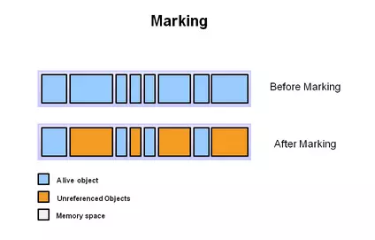

上图中蓝色部分是有被引用的对象，褐色部分是没有被引用的对象。在Marking阶段，需要进行全盘扫描，这个过程是比较耗时的。


清除阶段清理的是没有被引用的对象，存活的对象被保留。

标记-清除动作不需要移动对象，且仅对不存活的对象进行清理，在空间中存活对象较多的时候，效率较高，但由于只是清除，没有重新整理，因此**会造成内存碎片**。


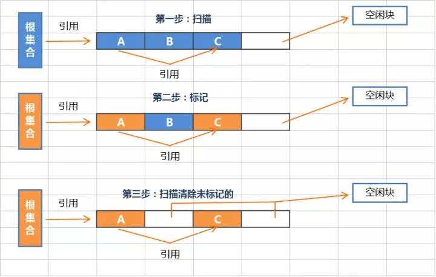


## 标记-压缩

该算法与标记-清除算法类似，都是先对存活的对象进行标记，但是在清除后会把活的对象向左端空闲空间移动，然后再更新其引用对象的指针，如下图所示


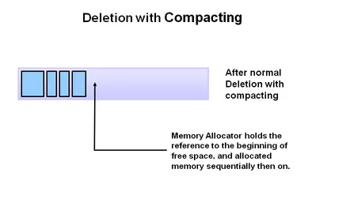

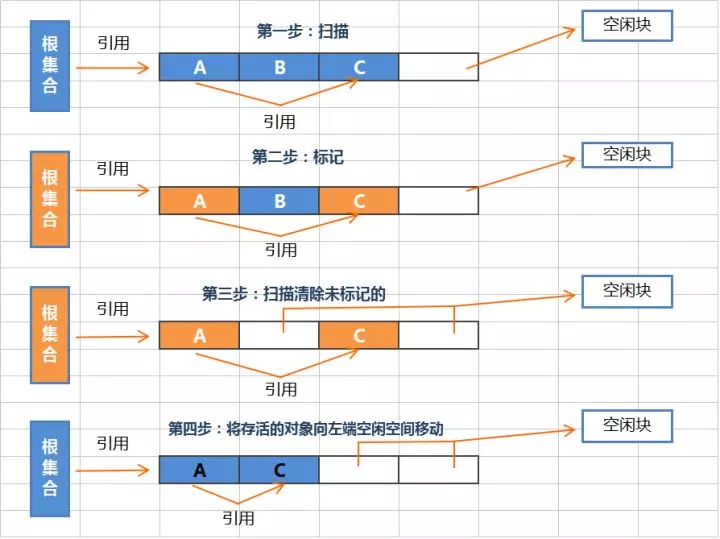


由于进行了移动规整动作，该算法避免了标记-清除的碎片问题，但由于需要进行移动，因此成本也增加了。（该算法**适用于老年代**）


# 垃圾收集器

[链接](https://crowhawk.github.io/2017/08/15/jvm_3/)

[链接](https://juejin.im/post/5b651200f265da0fa00a38d7)

[链接](https://www.ibm.com/developerworks/cn/java/j-lo-JVMGarbageCollection/index.html)


上图展示了7种作用于不同分代的收集器，如果两个收集器之间存在连线，就说明它们可以搭配使用。

虚拟机所处的区域，则表示它是属于新生代收集器还是老年代收集器。

`Hotspot`实现了如此多的收集器，正是因为目前并无完美的收集器出现，只是选择对具体应用最适合的收集器。


## 新生代收集器


### Serial收集器

它是一个单线程收集器，只会使用一个CPU或一条收集线程去完成垃圾收集工作，更重要的是它在进行垃圾收集时，必须暂停其他所有的工作线程，直至Serial收集器收集结束为止（**`Stop The World`**）。这项工作是由虚拟机在后台自动发起和自动完成的，在用户不可见的情况下把用户正常工作的线程全部停掉，这对很多应用来说是难以接收的。

下图展示了Serial 收集器（老年代采用Serial Old收集器）的运行过程：


### ParNew 收集器

`ParNew`收集器就是`Serial`收集器的多线程版本。除了使用多线程进行垃圾收集外，其余行为包括Serial收集器可用的所有控制参数、收集算法（复制算法）、**Stop The World**、对象分配规则、回收策略等与Serial收集器完全相同，两者共用了相当多的代码。


`ParNew`收集器的工作过程如下图（老年代采用Serial Old收集器）：


`ParNew`收集器除了使用多线程收集外，其他与`Serial`收集器相比并无太多创新之处，但它却是许多运行在`Server`模式下的虚拟机中首选的新生代收集器，其中有一个与性能无关的重要原因是，**除了Serial收集器外，目前只有它能和`CMS`收集器（Concurrent Mark Sweep）配合工作**，`CMS`收集器是`JDK 1.5`推出的一个具有划时代意义的收集器。

`ParNew` 收集器在**单CPU的环境**中绝对不会有比`Serial`收集器有更好的效果，甚至由于存在线程交互的开销，该收集器在通过超线程技术实现的两个CPU的环境中都不能百分之百地保证可以超越。在**多CPU环境**下，随着CPU的数量增加，它对于`GC`时系统资源的有效利用是很有好处的。它默认开启的收集线程数与CPU的数量相同，在CPU非常多的情况下可使用**`-XX:ParallerGCThreads`**参数设置。


#### jvm参数

 `-XX:ParallelGCThreads=n`

 设置并发收集器年轻代收集方式为并行收集时，使用的CPU数，并行收集线程数


### Parallel Scavenge 收集器

`Parallel Scavenge`收集器也是一个**并行**的**多线程新生代**收集器，它也使用**复制算法**。`Parallel Scavenge`收集器的特点是它的关注点与其他收集器不同，`CMS`等收集器的关注点是尽可能缩短垃圾收集时用户线程的停顿时间，而`Parallel Scavenge`收集器的目标是达到一个可控制的**吞吐量（Throughput）**。


停顿时间越短就越适合需要与用户交互的程序，良好的响应速度能提升用户体验。而高吞吐量则可以高效率地利用CPU时间，尽快完成程序的运算任务，主要适合**在后台运算而不需要太多交互的任务**。


`Parallel Scavenge`收集器提供可以精确控制吞吐量的参数，这是ParNew收集器不具备的（<font color=#dd0000>两者的区别</font>）。

#### jvm参数

`-XX:+UseAdaptiveSizePolicy`

开关参数，打开参数后，就不需要手工指定新生代的大小（-`Xmn`）、`Eden`和`Survivor`区的比例（`-XX:SurvivorRatio`）、晋升老年代对象年龄（`-XX:PretenureSizeThreshold`）等细节参数了，虚拟机会根据当前系统的运行情况收集性能监控信息，动态调整这些参数以提供最合适的停顿时间或者最大的吞吐量，这种方式称为**GC自适应的调节策略（GC Ergonomics）**。自适应调节策略也是`Parallel Scavenge`收集器与`ParNew`收集器的一个重要区别。


`-XX:MaxGCPauseMills`

设置最大gc停顿时间， 垃圾回收器会尽量控制回收的时间在该值范围内 


`-XX:GCTimeRatio`

 设置时间gc时间占比 


`-XX:GCPauseIntervalMillis`

设置停顿时间间隔 


`-XX:GCTimeRatio`

设置吞吐量大小，0~100之间的整数。若该值为n，那么jvm将会花费不超过1/(1+n)的时间用于垃圾回收。


## 老年代收集器


### Serial Old收集器

Serial Old 是 Serial收集器的老年代版本，它同样是一个**单线程收集器**，使用**“标记-整理”（Mark-Compact）**算法。


此收集器的主要意义也是在于给Client模式下的虚拟机使用。如果在Server模式下，它还有两大用途：

- 在JDK1.5 以及之前版本（Parallel Old诞生以前）中与Parallel Scavenge收集器搭配使用。
- 作为CMS收集器的后备预案，在并发收集发生**Concurrent Mode Failure**时使用。


它的工作流程与Serial收集器相同，这里再次给出Serial/Serial Old配合使用的工作流程图：

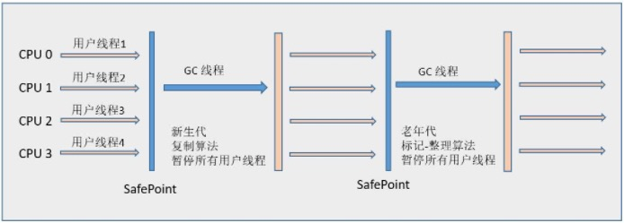


### Parallel Old收集器

`Parallel Old`收集器是`Parallel Scavenge`收集器的老年代版本，使用**多线程**和**“标记-整理”**算法。

这个收集器是`在JDK 1.6`中才开始提供的，在此之前，如果新生代选择了`Parallel Scavenge`收集器，老年代除了`Serial Old`以外别无选择，所以在`Parallel Old`诞生以后，**“吞吐量优先”收集器**终于有了比较名副其实的应用组合，在**注重吞吐量**以及**CPU资源敏感**的场合，都可以优先考虑`Parallel Scavenge + Parallel Old`收集器。


Parallel Old收集器的工作流程与Parallel Scavenge相同，这里给出Parallel Scavenge/Parallel Old收集器配合使用的流程图：


### CMS收集器

**`CMS（Concurrent Mark Sweep）`**收集器是一种以**获取最短回收停顿时间**为目标的收集器，它非常符合那些集中在互联网站或者B/S系统的服务端上的Java应用，这些应用都非常重视服务的响应速度。从名字上（“Mark Sweep”）就可以看出它是基于**“标记-清除”**算法实现的。


#### 流程

`CMS`收集器工作的整个流程分为以下4个步骤：

- **初始标记（CMS initial mark）**：仅仅只是标记一下GC Roots能直接关联到的对象，速度很快，需要“Stop The World”。
- **并发标记（CMS concurrent mark）**：进行**GC Roots Tracing**的过程，在整个过程中耗时最长。
- **重新标记（CMS remark）**：为了修正并发标记期间因用户程序继续运作而导致标记产生变动的那一部分对象的标记记录，这个阶段的停顿时间一般会比初始标记阶段稍长一些，但远比并发标记的时间短。此阶段也需要“Stop The World”。
- **并发清除（CMS concurrent sweep）**


由于整个过程中耗时最长的并发标记和并发清除过程收集器线程都可以与用户线程一起工作，所以，从总体上来说，`CMS`收集器的内存回收过程是与用户线程一起并发执行的。通过下图可以比较清楚地看到`CMS`收集器的运作步骤中并发和需要停顿的时间：


**优点**

CMS是一款优秀的收集器，它的主要**优点**在名字上已经体现出来了：**并发收集**、**低停顿**，因此CMS收集器也被称为**并发低停顿收集器（Concurrent Low Pause Collector）**。

**缺点**

- **对CPU资源非常敏感** 其实，面向并发设计的程序都对CPU资源比较敏感。在并发阶段，它虽然不会导致用户线程停顿，但会因为占用了一部分线程（或者说CPU资源）而导致应用程序变慢，总吞吐量会降低。**CMS默认启动的回收线程数是（CPU数量+3）/4**，也就是当CPU在4个以上时，并发回收时垃圾收集线程不少于25%的CPU资源，并且随着CPU数量的增加而下降。但是**当CPU不足4个时（比如2个），CMS对用户程序的影响就可能变得很大**，如果本来CPU负载就比较大，还要分出一半的运算能力去执行收集器线程，就可能导致用户程序的执行速度忽然降低了50%，其实也让人无法接受。

- **无法处理浮动垃圾（Floating Garbage）** 可能出现“Concurrent Mode Failure”失败而导致另一次Full GC的产生。**由于CMS并发清理阶段用户线程还在运行着，伴随程序运行自然就还会有新的垃圾不断产生。**这一部分垃圾出现在标记过程之后，CMS无法再当次收集中处理掉它们，只好留待下一次GC时再清理掉。这一部分垃圾就被称为**“浮动垃圾”**。也是由于在垃圾收集阶段用户线程还需要运行，那也就还需要预留有足够的内存空间给用户线程使用，因此CMS收集器不能像其他收集器那样等到老年代几乎完全被填满了再进行收集，需要预留一部分空间提供并发收集时的程序运作使用。

- **标记-清除算法导致的空间碎片** CMS是一款基于“标记-清除”算法实现的收集器，这意味着收集结束时会有大量空间碎片产生。空间碎片过多时，将会给<font color=#dd0000>大对象分配</font>带来很大麻烦，往往出现老年代空间剩余，但无法找到足够大连续空间来分配当前对象。

- **Concurrent Mode Failure**

  由于CMS并发清理阶段，用户程序还在运行，也需要内存空间，因此CMS收集器不能像其他老年代收集器那样，等到老年代空间快满了再执行垃圾收集，而是要预留一部分内存给用户程序使用。CMS的做法是老年代空间占用率达到某个阈值时触发垃圾收集，有一个参数来控制触发百分比： -XX:CMSInitiatingOccupancyFraction=80 （这里配置的是80%）。

  如果<font color=#0000dd>预留的老年代空间不够应用程序的使用</font>，就会出现Concurrent Mode Failure，此时会触发一次FullGC，采用标记-清除-整理算法，会发生stop-the-world，耗时相当感人（实际工作中遇到的大部分FGC估计都是这种情况）。Concurrent Mode Failure一般会伴随**ParNew promotion failed**，晋升担保失败。所谓晋升担保，就是为了应对新生代GC后存活对象过多，Survivor区无法容纳的情况，需要老年代有足够的空间容纳这些对象，如果老年代没有足够的空间，就会产生担保失败，导致一次Full GC。

  

  为了避免Concurrent Mode Failure，可以采取的做法是：
  
  1. 调大老年代空间；
  2. 调低CMSInitiatingOccupancyFraction的值，但这样会造成更频繁的CMS GC；
  3. 代码层面优化，控制对象创建频率。


- **ParNew promotion failed**

  晋升担保

  老年代是否有足够的空间来容纳全部的新生代对象或历史平均晋升到老年代的对象，如果不够的话，就提早进行一次老年代的回收，防止下次进行YGC的时候发生晋升失败。 


#### jvm相关调优参数

 **-XX：+UseConcMarkSweepGC**

激活 CMS 收集器。默认 HotSpot JVM 使用的是并行收集器。 


 **-XX：UseParNewGC** 

 年轻代使用多线程并行执行垃圾回收，新生代使用并发收集器与CMS配合

（ 注意最新的 JVM 版本，当使用 - XX：+UseConcMarkSweepGC 时，-XX：UseParNewGC 会自动开启。因此，如果年轻代的并行 GC 不想开启，可以通过设置 - XX：-UseParNewGC 来关掉。 ）


**-XX：+CMSConcurrentMTEnabled**

当该标志被启用时，并发的 CMS 阶段将以多线程执行。该标志已经默认开启，如果顺序执行更好，这取决于所使用的硬件，多线程执行可以通过 `- XX：-CMSConcurremntMTEnabled` 禁用。


**-XX：ConcGCThreads**

标志 `- XX：ConcGCThreads=1/2/3/4/n`（早期 JVM 版本也叫 `-XX:ParallelCMSThreads`）定义并发 CMS 过程运行时的线程数。比如 value=4 意味着 CMS 周期的所有阶段都以 4 个线程来执行。尽管更多的线程会加快并发 CMS 过程，但其也会带来额外的同步开销。因此，对于特定的应用程序，应该通过测试来判断增加 CMS 线程数是否真的能够带来性能的提升。

如果该标志未设置，JVM 会根据并行收集器中的 `- XX：ParallelGCThreads` 参数的值来计算出默认的并行 CMS 线程数。该公式是： `ConcGCThreads = (ParallelGCThreads + 3)/4`。因此，对于 CMS 收集器，来说 `- XX:ParallelGCThreads`标志不仅影响“stop-the-world”垃圾收集阶段，还影响并发阶段。

总之，有不少方法可以配置 CMS 收集器的多线程执行。正是由于这个原因, 建议第一次运行 CMS 收集器时使用其默认设置, 然后如果需要调优再进行测试。只有在生产系统中测量 (或类生产测试系统) 发现应用程序的暂停时间的目标没有达到 , 就可以通过这些标志应该进行 GC 调优。


 **-XX:CMSInitiatingOccupancyFraction** 

 该值代表老年代堆空间的使用率。比如，value=75意味着第一次CMS垃圾收集会在老年代被占用75%时被触发。通常CMSInitiatingOccupancyFraction的默认值为68(之前很长时间的经历来决定的)。 

>  因为不同的应用会有不同对象分配模式，JVM 会收集实际的对象分配 (和释放) 的运行时数据，并且分析这些数据，来决定什么时候启动一次 CMS 垃圾收集周期。为了引导这一过程， JVM 会在一开始执行 CMS 周期前作一些线索查找。该线索由 -XX:CMSInitiatingOccupancyFraction=来设置 


 **XX：+UseCMSInitiatingOccupancyOnly** 

 命令 JVM 不基于运行时收集的数据来启动 CMS 垃圾收集周期。而是当该标志被开启时，JVM 通过 上述`CMSInitiatingOccupancyFraction` 的值进行每一次 CMS 收集，而不仅仅是第一次。 


 **-XX:+CMSClassUnloadingEnabled** 

 相对于并行收集器，CMS 收集器默认不会对永久代进行垃圾回收。如果希望对永久代进行垃圾回收，可用设置标志 `-XX:+CMSClassUnloadingEnabled`。 


 **-XX:+ExplicitGCInvokesConcurrent and -XX:+ExplicitGCInvokesConcurrentAndUnloadsClasses** 

 标志 - XX:+ExplicitGCInvokesConcurrent 命令 JVM 无论什么时候调用系统 GC，都执行 CMS GC，而不是 Full GC。第二个标志 - XX:+ExplicitGCInvokesConcurrentAndUnloadsClasses 保证当有系统 GC 调用时，永久代也被包括进 CMS 垃圾回收的范围内。因此，通过使用这些标志，我们可以防止出现意料之外的”stop-the-world” 的系统 GC。 


 **-XX:+DisableExplicitGC** 

 该标志将告诉 JVM 完全忽略系统的 GC 调用 System.gc() (不管使用的收集器是什么类型)。 


 **-XX:+UseCMSCompactAtFullCollection**

 在CMS收集器顶不住要进行FullGC时<u>开启内存碎片的合并整理</u>过程 。

> 对于CMS收集器，由于其使用标记-清除算法，所以产生的内存碎片会比较多。空间碎片过多时，将会给大对象分配带来很大麻烦，往往会出现老年代还有很大空间剩余，但是无法找到足够大的连续空间来分配当前对象，不得不提前触发一次Full GC。为了解决这个问题，CMS收集器提供了一个-XX:+UseCMSCompactAtFullCollection开关参数（默认就是开启的）， 


 **-XX:CMSFullGCsBeforeCom-paction**

对于上述参数，当开启内存碎片的合并整理后，由于内存整理的过程是无法并发的，空间碎片问题没有了，但停顿时间不得不变长。此时还有这个参数，用于设置执行多少次不压缩的Full GC后，跟着来一次带压缩的（默认值为0，表示每次进入FullGC时都进行碎片整理）。 


## G1收集器

**G1（Garbage-First）**收集器是当今收集器技术发展最前沿的成果之一，它是一款**面向服务端应用**的垃圾收集器，HotSpot开发团队赋予它的使命是（在比较长期的）未来可以替换掉JDK 1.5中发布的CMS收集器。与其他GC收集器相比，G1具备如下特点：

- **并行与并发** G1 能充分利用多CPU、多核环境下的硬件优势，使用多个CPU来缩短“Stop The World”停顿时间，部分其他收集器原本需要停顿Java线程执行的GC动作，G1收集器仍然可以通过并发的方式让Java程序继续执行。
- **分代收集** 与其他收集器一样，分代概念在G1中依然得以保留。虽然G1可以不需要其他收集器配合就能独立管理整个GC堆，但它能够采用不同方式去处理新创建的对象和已存活一段时间、熬过多次GC的旧对象来获取更好的收集效果。
- **空间整合** G1从整体来看是基于**“标记-整理”**算法实现的收集器，从局部（两个Region之间）上来看是基于**“复制”**算法实现的。这意味着G1运行期间不会产生内存空间碎片，收集后能提供规整的可用内存。此特性有利于程序长时间运行，分配大对象时不会因为无法找到连续内存空间而提前触发下一次GC。
- **可预测的停顿** 这是<font color=#00dd00>G1相对CMS的一大优势</font>，降低停顿时间是G1和CMS共同的关注点，但G1除了降低停顿外，还能建立可预测的停顿时间模型，能让使用者明确指定在一个长度为M毫秒的时间片段内，消耗在GC上的时间不得超过N毫秒，这几乎已经是实时Java（RTSJ）的垃圾收集器的特征了。

**横跨整个堆内存**

在G1之前的其他收集器进行收集的范围都是整个新生代或者老生代，而G1不再是这样。G1在使用时，Java堆的内存布局与其他收集器有很大区别，它**将整个Java堆划分为多个大小相等的独立区域（Region）**，虽然还保留新生代和老年代的概念，但**新生代和老年代不再是物理隔离的了，而都是一部分Region（不需要连续）的集合**。

**建立可预测的时间模型**

G1收集器之所以能建立可预测的停顿时间模型，是因为它可以**有计划地避免在整个Java堆中进行全区域的垃圾收集**。G1跟踪各个Region里面的垃圾堆积的价值大小（回收所获得的空间大小以及回收所需时间的经验值），**在后台维护一个优先列表**，每次根据允许的收集时间，**优先回收价值最大的Region（这也就是Garbage-First名称的来由）**。这种使用Region划分内存空间以及有优先级的区域回收方式，保证了G1收集器在有限的时间内可以获取尽可能高的收集效率。

**避免全堆扫描——Remembered Set**

G1把Java堆分为多个Region，就是“化整为零”。但是Region不可能是孤立的，一个对象分配在某个Region中，可以与整个Java堆任意的对象发生引用关系。在做可达性分析确定对象是否存活的时候，需要扫描整个Java堆才能保证准确性，这显然是对GC效率的极大伤害。

为了避免全堆扫描的发生，虚拟机**为G1中每个Region维护了一个与之对应的Remembered Set**。虚拟机发现程序在对Reference类型的数据进行写操作时，会产生一个Write Barrier暂时中断写操作，检查Reference引用的对象是否处于不同的Region之中（在分代的例子中就是检查是否老年代中的对象引用了新生代中的对象），如果是，便通过CardTable**把相关引用信息记录到被引用对象所属的Region的Remembered Set之中**。当进行内存回收时，在GC根节点的枚举范围中加入Remembered Set即可保证不对全堆扫描也不会有遗漏。

------

如果不计算维护Remembered Set的操作，G1收集器的运作大致可划分为以下几个步骤：

- **初始标记（Initial Marking）** 仅仅只是标记一下GC Roots 能直接关联到的对象，并且修改**TAMS（Nest Top Mark Start）**的值，让下一阶段用户程序并发运行时，能在正确可以的Region中创建对象，此阶段需要**停顿线程**，但耗时很短。
- **并发标记（Concurrent Marking）** 从GC Root 开始对堆中对象进行**可达性分析**，找到存活对象，此阶段耗时较长，但**可与用户程序并发执行**。
- **最终标记（Final Marking）** 为了修正在并发标记期间因用户程序继续运作而导致标记产生变动的那一部分标记记录，虚拟机将这段时间对象变化记录在**线程的Remembered Set Logs**里面，最终标记阶段需要**把Remembered Set Logs的数据合并到Remembered Set中**，这阶段需要**停顿线程**，但是**可并行执行**。
- **筛选回收（Live Data Counting and Evacuation）** 首先对各个Region中的回收价值和成本进行排序，根据用户所期望的GC 停顿是时间来制定回收计划。此阶段其实也可以做到与用户程序一起并发执行，但是因为只回收一部分Region，时间是用户可控制的，而且停顿用户线程将大幅度提高收集效率。

通过下图可以比较清楚地看到G1收集器的运作步骤中并发和需要停顿的阶段（Safepoint处）：


### Young GC


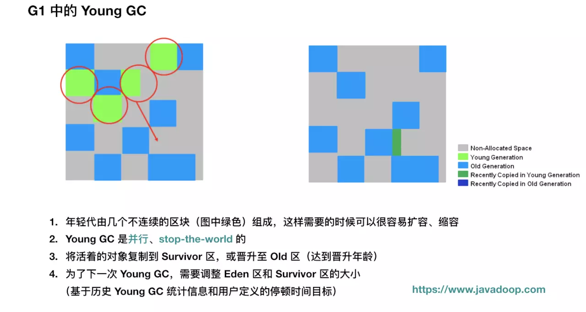


### Old GC

1. 初始标记：stop-the-world，它伴随着一次普通的 Young GC 发生，然后对 Survivor 区（root region）进行标记，因为该区可能存在对老年代的引用。

   > 因为 Young GC 是需要 stop-the-world 的，所以并发周期直接重用这个阶段，虽然会增加 CPU 开销，但是停顿时间只是增加了一小部分。

2. 扫描根引用区：扫描 Survivor 到老年代的引用，该阶段必须在下一次 Young GC 发生前结束。

   > 这个阶段不能发生年轻代收集，如果中途 Eden 区真的满了，也要等待这个阶段结束才能进行 Young GC。

3. 并发标记：寻找整个堆的存活对象，该阶段可以被 Young GC 中断。

   > 这个阶段是并发执行的，中间可以发生多次 Young GC，Young GC 会中断标记过程

4. 重新标记：stop-the-world，完成最后的存活对象标记。使用了比 CMS 收集器更加高效的 snapshot-at-the-beginning (SATB) 算法。

   > Oracel 的资料显示，这个阶段会回收完全空闲的区块

5. 清理：清理阶段真正回收的内存很少。

到这里，G1 的一个并发周期就算结束了，其实就是主要完成了垃圾定位的工作，定位出了哪些分区是垃圾最多的。


#### 注意

最好不要把上面的 Old GC 当做是一次 GC 来看，而应该当做**并发标记周期**来理解，虽然它确实会释放出一些内存。 


### 混合垃圾回收周期

并发周期结束后是混合垃圾回收周期，不仅进行年轻代垃圾收集，而且回收之前标记出来的老年代的垃圾最多的部分区块。

混合垃圾回收周期会持续进行，直到几乎所有的被标记出来的分区（垃圾占比大的分区）都得到回收，然后恢复到常规的年轻代垃圾收集，最终再次启动并发周期。


### Full GC

下面我们来介绍特殊情况，那就是会导致 **Full GC** 的情况，也是我们需要极力避免的：

1. concurrent mode failure：并发模式失败，CMS 收集器也有同样的概念。G1 并发标记期间，如果在标记结束前，老年代被填满，G1 会放弃标记。

   > 这个时候说明
   >
   > - 堆需要增加了，
   > - 或者需要调整并发周期，如增加并发标记的线程数量，让并发标记尽快结束
   > - 或者就是更早地进行并发周期，默认是整堆内存的 45% 被占用就开始进行并发周期。

2. 晋升失败：并发周期结束后，是混合垃圾回收周期，伴随着年轻代垃圾收集，进行清理老年代空间，如果这个时候清理的速度小于消耗的速度，导致老年代不够用，那么会发生晋升失败。

   > 说明混合垃圾回收需要更迅速完成垃圾收集，也就是说在混合回收阶段，每次年轻代的收集应该处理更多的老年代已标记区块。

3. 疏散失败：年轻代垃圾收集的时候，如果 Survivor 和 Old 区没有足够的空间容纳所有的存活对象。这种情况肯定是非常致命的，因为基本上已经没有多少空间可以用了，这个时候会触发 Full GC 也是很合理的。

   > 最简单的就是增加堆大小

4. 大对象分配失败，我们应该尽可能地不创建大对象，尤其是大于一个区块大小的那种对象。


### 小结

并发标记结束后，G1 也就知道了哪些区块是最适合被回收的，那些完全空闲的区块会在这这个阶段被回收。如果这个阶段释放了足够的内存出来，其实也就可以认为结束了一次 GC。

我们假设并发标记结束了，那么下次 GC 的时候，还是会先回收年轻代，如果从年轻代中得到了足够的内存，那么结束；过了几次后，年轻代垃圾收集不能满足需要了，那么就需要利用之前并发标记的结果，选择一些活跃度最低的老年代区块进行回收。直到最后，老年代会进入下一个并发周期。

那么什么时候会启动并发标记周期呢？这个是通过参数控制的，下面马上要介绍这个参数了，此参数默认值是 45，也就是说当堆空间使用了 45% 后，G1 就会进入并发标记周期。


 https://zhuanlan.zhihu.com/p/52841787 


## G1番外篇

G1收集器是一款在server端运行的垃圾收集器，专门针对于拥有多核处理器和大内存的机器，在JDK 7u4版本发行时被正式推出，在JDK9中更被指定为官方GC收集器。它满足高吞吐量的同时满足GC停顿的时间尽可能短。G1收集器专门针对以下应用场景设计

- 可以像CMS收集器一样可以和应用并发运行
- 压缩空闲的内存碎片，却不需要冗长的GC停顿
- 对GC停顿可以做更好的预测
- 不想牺牲大量的吞吐量性能
- 不需要更大的Java Heap


G1从长期计划来看是以取代CMS为目标。与CMS相比有几个不同点使得G1成为GC的更好解决方案。

- 第一点：G1会压缩空闲内存使之足够紧凑，做法是用regions代替细粒度的空闲列表进行分配，减少内存碎片的产生。
- 第二点：G1的STW更可控，G1在停顿时间上添加了预测机制，用户可以指定期望停顿时间。 


### 内存布局

在传统的GC收集器(serial,parallel,CMS)无一不例外都把heap分成固定大小连续的三个空间：新生代、老年代、永久代/元空间。


但G1收集器采用了一种全新的内存布局。

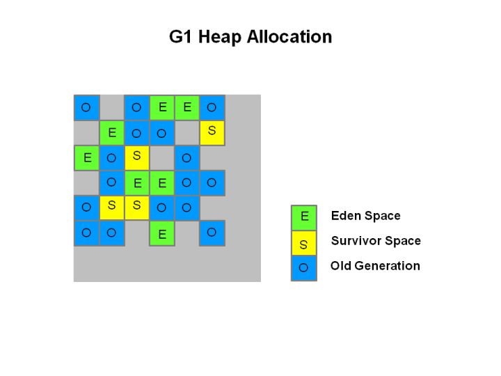

在G1中堆被分成一块块大小相等的heap region，一般有2000多块，这些region在逻辑上是连续的。

每块region都会被打唯一的分代标志(eden,survivor,old)。

在逻辑上，eden regions构成Eden空间，survivor regions构成Survivor空间，old regions构成了old 空间。 


### G1中的Region

G1中每个Region大小是固定相等的，Region的大小可以通过参数`-XX:G1HeapRegionSize`设定，取值范围从1M到32M，且是2的指数。如果不设定，那么G1会根据Heap大小自动决定。

逻辑:

size =（堆最小值+堆最大值）/ TARGET_REGION_NUMBER(2048) ，然后size取最靠近2的幂次数值， 并将size控制在[1M,32M]之间。


### G1中的数据结构

G1 比 ParallelOld 和 CMS 会需要更多的内存消耗，那是因为有部分内存消耗于簿记（accounting）上，如以下两个数据结构： 

- **Remembered Sets**：每个区块都有一个 RSet，用于记录进入该区块的对象引用（如区块 A 中的对象引用了区块 B，区块 B 的 Rset 需要记录这个信息），它用于实现收集过程的并行化以及使得区块能进行独立收集。总体上 Remembered Sets 消耗的内存小于 5%。
- **Collection Sets**：将要被回收的区块集合。GC 时，在这些区块中的对象会被复制到其他区块中，总体上 Collection Sets 消耗的内存小于 1%。


### 总结

- G1把内存分成一块块的Region，每块的Region的大小都是一样的。
- G1保留了YGC并加上了一种全新的MIXGC用于收集老年代。G1中没有Full GC，G1中的Full GC是采用serial old Full GC。在MIXGC中的Cset是选定所有young gen里的region，外加根据global concurrent marking统计得出收集收益高的若干old gen region。在YGC中的Cset是选定所有young gen里的region。通过控制young gen的region个数来控制young GC的开销。YGC与MIXGC都是采用多线程复制清除，整个过程会STW。
- G1的低延迟原理在于其回收的区域变得精确并且范围变小了。
- 全局并发标记分的五个阶段。
- 用STAB来维持并发GC的准确性。


### jvm参数配置

- -XX:+UseG1GC 使用G1 GC。
- -XX:MaxGCPauseMillis=n <font color=#dd0000>设置最大GC停顿时间</font>，这是一个软目标，JVM会尽最大努力去达到它。
- -XX:InitiatingHeapOccupancyPercent=n 启动并发标记循环的堆占用率的百分比，当整个堆的占用达到比例时，启动一个全局并发标记循环，0代表并发标记一直运行。默认值是45%。
- -XX:NewRatio=n 新生代和老年代大小的比例，默认是2。
- -XX:SurvivorRatio=n eden和survivor区域空间大小的比例，默认是8。
- -XX:MaxTenuringThreshold=n 晋升的阈值，默认是15（一个存活对象经历多少次GC周期之后晋升到老年代)。
- -XX:ParallelGCThreads=n 设置GC并发阶段的线程数，默认值与JVM运行平台相关。
- -XX:ConcGCThreads=n 设置并发标记的线程数，默认值与JVM运行平台相关。
- -XX:G1ReservePercent=n 设置保留java堆大小比例，用于防止晋升失败/Evacuation Failure,默认值是10%。
- -XX:G1HeapRegionSize=n 设置Region的大小，默认是根据堆的大小动态决定，大小范围是[1M,32M]


## 总结


|         收集器          | 串行、并行or并发 | 新生代/老年代 |        算法        |     目标     |                 适用场景                  |
| :---------------------: | :--------------: | :-----------: | :----------------: | :----------: | :---------------------------------------: |
|      **`Serial`**       |       串行       |    新生代     |      复制算法      | 响应速度优先 |          单CPU环境下的Client模式          |
|    **`Serial Old`**     |       串行       |    老年代     |     标记-整理      | 响应速度优先 |  单CPU环境下的Client模式、CMS的后备预案   |
|      **`ParNew`**       |       并行       |    新生代     |      复制算法      | 响应速度优先 |    多CPU环境时在Server模式下与CMS配合     |
| **`Parallel Scavenge`** |       并行       |    新生代     |      复制算法      |  吞吐量优先  |     在后台运算而不需要太多交互的任务      |
|   **`Parallel Old`**    |       并行       |    老年代     |     标记-整理      |  吞吐量优先  |     在后台运算而不需要太多交互的任务      |
|        **`CMS`**        |       并发       |    老年代     |     标记-清除      | 响应速度优先 | 集中在互联网站或B/S系统服务端上的Java应用 |
|        **`G1`**         |       并发       |     both      | 标记-整理+复制算法 | 响应速度优先 |        面向服务端应用，将来替换CMS        |


`jvm`运行模式：

```shell
$ java -version
java version "1.8.0_212"
Java(TM) SE Runtime Environment (build 1.8.0_212-b10)
Java HotSpot(TM) 64-Bit Server VM (build 25.212-b10, mixed mode)
```

如上所示，可以看到`HotSpot`虚拟机采时64位的，采用`Server`模式启动的。


> `JVM`有两种运行模式`Server`与`Client`。
>
> 两种模式的区别在于，`Client`模式启动速度较快，`Server`模式启动较慢；但是启动进入稳定期长期运行之后`Server`模式的程序运行速度比`Client`要快很多。这是因为`Server`模式启动的`JVM`采用的是重量级的虚拟机，对程序采用了更多的优化；而`Client`模式启动的`JVM`采用的是轻量级的虚拟机。所以`Server`启动慢，但稳定后速度比`Client`远远要快。


# GC 相关参数总结


## 基本参数设置

| **参数名称**                | **含义**                        | **默认值**            | **说明**                                                     |
| --------------------------- | ------------------------------- | --------------------- | ------------------------------------------------------------ |
| -Xms                        | 最小堆大小                      | 物理内存的 1/64(<1GB) | 空闲堆内存小于40%（通过 MinHeapFreeRatio 参数可调整该阈值）时，jvm 会增大堆直到 -Xmx |
| -Xmx                        | 最大堆大小                      | 物理内存的 1/4(<1GB)  | 空闲堆内存大于70%（通过 MaxHeapFreeRatio 参数可以调整该阈值）时，jvm 会减小堆直到 -Xms |
| -Xmn                        | 新生代大小                      | 无                    | 指 Eden 与两个 Survivor 空间之和，Sun 官方推荐配置为整个堆的 3/8 |
| -XX:PermSize                | 方法区（永久代）大小            | 物理内存的 1/64       | -                                                            |
| -Xss                        | 每个线程的堆栈大小              | 1M                    | -                                                            |
| -XX:ThreadStackSize         | 线程堆栈大小                    | 1M                    | 主线程以 -Xss 设置为主，其他线程以该设置为主，一般采用默认值即可 |
| -XX:NewRadio                | 新生代与老年代大小的比值        | 无                    | Xms=Xmx并且设置了Xmn的情况下，该参数不需要进行设置           |
| -XX:SurvivorRatio           | Eden 区域 Survivor 区大小的比值 | 无                    | -                                                            |
| -XX:LargePageSizeInBytes    | 内存页大小                      | 128M                  | 不可设置过大                                                 |
| -XX:+UseFastAccessorMethods | 是否使用原始类型的快速优化      | 无                    | -                                                            |
| -XX:+DisableExplicitGC      | 是否关闭 System.gc()            | 无                    | -                                                            |
| -XX:MaxTenuringThreshold    | 垃圾最大年龄                    | 无                    | N 次没有被回收的新生代资源自动放入老年代，只有使用串行GC时才有效 |
| -XX:MaxGCPauseMillis        | 最大停顿时间                    | -                     | 每次年轻代垃圾收集的最长时间                                 |
| -Xnoclassgc                 | 禁用垃圾回收                    | 无                    | -                                                            |
| -XX:SoftRefLRUPolicyMSPerMB | 堆内存中软引用存活时间          | 1s                    | -                                                            |
| -XX:PretenureSizeThreshold  | 对象超过多大自动在老年代分配    | 0                     | 采用 Parallel Scavenge GC 时无效                             |
| -XX:TLABWasteTargetPercent  | TLAB 占 eden 区的百分比         | 1%                    | -                                                            |
| -XX:+CollectGen0First       | FullGC时是否先YGC               | false                 | -                                                            |

 


## 与串行回收器相关的参数

`-XX:+UseSerialGC:`在新生代和老年代使用串行回收器。

`-XX:+SurvivorRatio:`设置 eden 区大小和 survivor 区大小的比例。

`-XX:+PretenureSizeThreshold:`设置大对象直接进入老年代的阈值。当对象的大小超过这个值时，将直接在老年代分配。

`-XX:MaxTenuringThreshold:`设置对象进入老年代的年龄的最大值。每一次 `Minor GC` 后，对象年龄就加 1。任何大于这个年龄的对象，一定会进入老年代。


## 与并行回收器相关的参数

| **参数名称**               | **含义**                                     | **默认值**        | **说明**                                                |
| -------------------------- | -------------------------------------------- | ----------------- | ------------------------------------------------------- |
| -XX:+UseParGC              | 使用 ParNew 收集器进行新生代收集             | false             | 与 -XX:+UseConcMarkSweepGC 相同                         |
| -XX:ParallelGCThreads      | 并行收集线程数                               | -                 | 指定并行 GC 下的垃圾收集线程数，最好配置为与 CPU 数相等 |
| -XX:+UseParallelOldGC      | 设置老年代收集器为 Parallel Old              | JDK1.6 起开始提供 | -                                                       |
| -XX:+UseAdaptiveSizePolicy | 自动选择年轻代大小及 Survivor 比例           | false             | 建议在使用并行收集器一直打开                            |
| -XX:GCTimeRatio            | 设置垃圾回收时间占用程序运行时间百分比       | 无                | 大于 0 小于 100，使用 Parallel Scavenge 时设置          |
| -XX:+UseAdaptiveSizePolicy | 是否自动根据当前系统情况决定最大吞吐量的限制 | false             | 使用 Parallel Scavenge 时设置                           |
| -XX:+ScavengeBeforeFullGC  | Full GC前调用YGC                             | true              | -                                                       |

 

-`XX:+UseParallelGC`

`-XX:+UseParNewGC:` 在新生代使用并行收集器。

`-XX:+UseParallelOldGC:` 老年代使用并行回收收集器。

`-XX:MaxGCPauseMills：`设置最大垃圾收集停顿时间。它的值是一个大于 0 的整数。收集器在工作时，会调整 Java 堆大小或者其他一些参数，尽可能地把停顿时间控制在 `MaxGCPauseMills` 以内。

`-XX:GCTimeRatio:`设置吞吐量大小，它的值是一个 0-100 之间的整数。假设 `GCTimeRatio` 的值为 n，那么系统将花费不超过 1/(1+n) 的时间用于垃圾收集。

`-XX:+UseAdaptiveSizePolicy:`打开自适应 `GC` 策略。在这种模式下，新生代的大小，`eden` 和 `survivor` 的比例、晋升老年代的对象年龄等参数会被自动调整，以达到在堆大小、吞吐量和停顿时间之间的平衡点。


## 与 CMS 回收器相关的参数

| **参数名称**                       | **含义**                                     | **默认值**       | **说明**                                                     |
| ---------------------------------- | -------------------------------------------- | ---------------- | ------------------------------------------------------------ |
| -XX:+UseConcMarkSweepGC            | 启用 CMS GC                                  | false            | -                                                            |
| -XX:CMSFullGCsBeforeCompaction     | 运行多少次 GC 后进行一次内存压缩（碎片整理） | -                | -                                                            |
| -XX:+CMSParallelRemarkEnabled      | 降低标记停顿                                 | false            | -                                                            |
| -XX+UseCMSCompactAtFullCollection  | 是否启用内存压缩（碎片整理）                 | -                | 建议开启                                                     |
| -XX:+UseCMSInitiatingOccupancyOnly | 手动触发 CMS                                 | false            | 禁止 HotSpot 自动触发 CMS GC                                 |
| -XX:CMSInitiatingOccupancyFraction | GC 触发阈值（百分比）                        | 1.5为68，1.6为92 | 内存使用达到阈值则开始 GC，设置过大会有可能造成失败而进行 full GC |
| -XX:+CMSIncrementalMode            | 设置为增量模式                               | false            | 运用于单CPU下，在 CMS 运行途中暂停，继续运行用户线程，下次增量 GC |
| -XX:CMSClassUnloadingEnabled       | 垃圾回收清理方法区时移除不再使用的 classes   | -                | -                                                            |
| -XX:+CMSPermGenSweepingEnabled     | 是否清理方法区（永久代）                     | -                | 默认不清理                                                   |


`-XX:+UseConcMarkSweepGC:` 新生代使用并行收集器，老年代使用 `CMS+`串行收集器。

`-XX:+ParallelCMSThreads:` 设定 `CMS` 的线程数量。

`-XX:+CMSInitiatingOccupancyFraction:`设置 `CMS` 收集器在老年代空间被使用多少后触发，默认为 68%。

`-XX:+UseFullGCsBeforeCompaction:`设定进行多少次 `CMS` 垃圾回收后，进行一次内存压缩。

`-XX:+CMSClassUnloadingEnabled:`允许对类元数据进行回收。

`-XX:+CMSParallelRemarkEndable:`启用并行重标记。

`-XX:CMSInitatingPermOccupancyFraction:`当永久区占用率达到这一百分比后，启动 `CMS` 回收 (前提是`-XX:+CMSClassUnloadingEnabled` 激活了)。

`-XX:UseCMSInitatingOccupancyOnly:`表示只在到达阈值的时候，才进行 `CMS` 回收。

`-XX:+CMSIncrementalMode:`使用增量模式，比较适合单 `CPU`。


## 与 G1 回收器相关的参数

`-XX:+UseG1GC:`使用 `G1` 回收器。

`-XX:+UnlockExperimentalVMOptions:`允许使用实验性参数。

`-XX:+MaxGCPauseMills:`设置最大垃圾收集停顿时间。

`-XX:+GCPauseIntervalMills:`设置停顿间隔时间。


## 其他参数

`-XX:+DisableExplicitGC:` 禁用显示 `GC`（如 `System.gc` ）。


# JVM参数设置规则

## 年轻代大小选择

1. 响应时间优先的应用 -- 尽可能增大年轻代大小，这也意味着老年代的大小会相对减少，因此同时要减少到达老年代的对象
2. 吞吐量优先应用 -- 尽可能增大年轻代，可以选择并行垃圾收集，适合 8 CPU 以上应用

无论如何，谨记不能将新生代设置过小，否则会造成新生代 GC 频繁，甚至让新生代对象直接进入老年代，从而触发 full GC

## 老年代大小选择

1. 响应时间优先的应用 -- 通常老年代使用 CMS 进行并发收集，所以老年代不能设计过小，否则会因为内存过多造成频繁 full GC；如果设计过大，则需要较长的收集，因此需要结合并发收集信息、持久化并发收集次数、传统GC信息、年轻代和老年代的时间比例考虑具体的内存大小
2. 吞吐量优先应用 -- 这样的应用通常需要大年轻代 + 小老年代，这样可以尽可能回收大部分短期对象，减少中期对象，而老年代存放长期存活对象

## 老年代的内存碎片问题

如果使用 CMS 作为老年代收集器，那么由于他采取的标记清除算法，通常会造成碎片，如果最终空间不足，则会触发一次 full GC

针对这种情况，需要进行如下配置：

1. -XX:+UseCMSCompactAtFullCollection -- 使用并发收集器时，开启对年老代的压缩
2. -XX:CMSFullGCsBeforeCompaction=0 -- 上面配置开启的情况下，这里设置多少次Full GC后，对年老代进行压缩

## 其他事项

1. linux 64 位操作系统中，jdk 消耗内存更多，执行速度更慢，但吞吐量更大
2. XMX 和 XMS 设置一样大，MaxPermSize 和 MinPermSize 设置一样大，这样可以减轻伸缩堆大小带来的压力
3. 使用CMS的好处是用尽量少的新生代，经验值是128M－256M， 然后老生代利用CMS并行收集， 这样能保证系统低延迟的吞吐效率。 实际上cms的收集停顿时间非常的短，2G的内存， 大约20－80ms的应用程序停顿时间
4. 系统停顿的时候可能是GC的问题也可能是程序的问题，多用jmap和jstack查看，或者killall -3 java，然后查看java控制台日志，能看出很多问题。
5. 如果用了缓存，那么年老代应该大一些
6. 采用并发回收时，年轻代小一点，年老代要大，因为年老大用的是并发回收，即使时间长点也不会影响其他程序继续运行，网站不会停顿


# JVM进行Full GC的情况


## 1、System.gc()方法的调用

此方法的调用是建议JVM进行Full GC,虽然只是建议而非一定,但很多情况下它会触发 Full GC,从而增加Full GC的频率,也即增加了间歇性停顿的次数。强烈影响系建议能不使用此方法就别使用，让虚拟机自己去管理它的内存，可通过通过-XX:+ DisableExplicitGC来禁止RMI调用System.gc。

## 2、老年代代空间不足

老年代空间只有在新生代对象转入及创建为大对象、大数组时才会出现不足的现象，当执行Full GC后空间仍然不足，则抛出如下错误：
java.lang.OutOfMemoryError: Java heap space
为避免以上两种状况引起的Full GC，调优时应尽量做到让对象在Minor GC阶段被回收、让对象在新生代多存活一段时间及不要创建过大的对象及数组。

## 3、永久代空间不足

JVM规范中运行时数据区域中的方法区，在HotSpot虚拟机中又被习惯称为永生代或者永生区，Permanet Generation中存放的为一些class的信息、常量、静态变量等数据，当系统中要加载的类、反射的类和调用的方法较多时，Permanet Generation可能会被占满，在未配置为采用CMS GC的情况下也会执行Full GC。如果经过Full GC仍然回收不了，那么JVM会抛出如下错误信息：
java.lang.OutOfMemoryError: PermGen space
为避免Perm Gen占满造成Full GC现象，可采用的方法为增大Perm Gen空间或转为使用CMS GC。

## 4、CMS GC时出现promotion failed和concurrent mode failure

对于采用CMS进行老年代GC的程序而言，尤其要注意GC日志中是否有`promotion failed`和`concurrent mode failure`两种状况，当这两种状况出现时可能会触发Full GC。

`promotion failed`是在进行Minor GC时，survivor space放不下、对象只能放入老年代，而此时老年代也放不下造成的；

`concurrent mode failure`是在执行CMS GC的过程中同时有对象要放入老年代，而此时老年代空间不足造成的（有时候“空间不足”是CMS GC当前的浮动垃圾过多导致暂时性的空间不足触发Full GC）。

**应对措施**：增大survivor space、老年代空间或调低触发并发GC的比率，但在JDK 5.0+、6.0+的版本中有可能会由于JDK的bug29导致CMS在remark完毕后很久才触发sweeping动作。对于这种状况，可通过设置`-XX: CMSMaxAbortablePrecleanTime=5`（单位为ms）来避免。


### concurrent mode failure 

concurrent mode failure是在执行CMS GC的过程中同时有对象要放入老年代，而此时老年代空间不足造成的（有时候“空间不足”是CMS GC时当前的浮动垃圾过多导致暂时性的空间不足触发Full GC）。

相关参数:-XX:+UseCMSInitiatingOccupancyOnly ，如果没有设置此参数，虚拟机会根据收集的数据决定是否触发（建议线上环境带上这个参数，不然会加大问题排查的难度）。

相关参数：-XX:CMSInitiatingOccupancyFraction=80，即老年代满80%时触发CMS GC。设置太高，就容易产生concurrent mode failure，设置过低，CMS GC又太过频繁。

相关参数：-XX:UseCMSCompactAtFullCollection=true，由于CMS没有对内存进行压缩，所以会有内存碎片，设置此参数，默认每次执行Full GC的时候会进行整理压缩，目前默认是true。

相关参数：-XX:CMSFullGCsBeforeCompaction=n，指定多少次不压缩的CMS GC刚才之后，跟着来一次带压缩的CMS GC。默认是0，表示每次发生forground的cms gc 都会进行压缩，但压缩会影响暂停时间,因此可以适当调整次参数。


### promotion failed

minor gc时年轻代的存活区空间不足而晋升老年代，老年代又空间不足而触发full gc。

相关参数： -XX:SurvivorRatio=8，设置eden和survivor的比例，默认8:1。

相关参数： -XX:MaxTenuringThreshold=15，最多经过多少次minor gc后存活的年轻代对象会晋升老年代，默认15。


## 5、统计得到的Minor GC晋升到老年代的平均大小大于老年代的剩余空间

这是一个较为复杂的触发情况，Hotspot为了避免由于新生代对象晋升到旧生代导致旧生代空间不足的现象，在进行Minor GC时，做了一个判断，如果之前统计所得到的Minor GC晋升到旧生代的平均大小大于旧生代的剩余空间，那么就直接触发Full GC。

例如程序第一次触发Minor GC后，有6MB的对象晋升到旧生代，那么当下一次Minor GC发生时，首先检查旧生代的剩余空间是否大于6MB，如果小于6MB，则执行Full GC。

当新生代采用PS GC时，方式稍有不同，PS GC是在Minor GC后也会检查，例如上面的例子中第一次Minor GC后，PS GC会检查此时旧生代的剩余空间是否大于6MB，如小于，则触发对旧生代的回收。

除了以上4种状况外，对于使用RMI来进行RPC或管理的Sun JDK应用而言，默认情况下会一小时执行一次Full GC。可通过在启动时通过 `java -Dsun.rmi.dgc.client.gcInterval=3600000`来设置Full GC执行的间隔时间或通过`-XX:+ DisableExplicitGC`来禁止RMI调用System.gc。

## 6、堆中分配很大的对象


所谓大对象，是指需要大量连续内存空间的java对象，例如很长的数组，此种对象会直接进入老年代，而老年代虽然有很大的剩余空间，但是无法找到足够大的连续空间来分配给当前对象，此种情况就会触发JVM进行Full GC。

为了解决这个问题，CMS垃圾收集器提供了一个可配置的参数，即-XX:+UseCMSCompactAtFullCollection开关参数，用于在“享受”完Full GC服务之后额外免费赠送一个碎片整理的过程，内存整理的过程无法并发的，空间碎片问题没有了，但提顿时间不得不变长了，JVM设计者们还提供了另外一个参数 -XX:CMSFullGCsBeforeCompaction,这个参数用于设置在执行多少次不压缩的Full GC后,跟着来一次带压缩的。


# GC日志

 **-verbosegc(相当于-XX:+PrintGC)**将日志的详细级别设置为详细。 

 **-XX:+PrintGCDetails**将细节级别设置为更精细。 

**`-XX:+PrintGCTimeStamps`** - 显示JVM启动后经过的时间。 

 **`-XX:+PrintGCDateStamps`** - 为每个条目添加日期前缀。 

**-Xloggc:<filename>** 记录gc日志到文件


```shell
-XX:+PrintGC：输出GC垃圾回收日志

-verbose:gc：与-XX:+PrintGC相同

-XX:+PrintGCDetail：输出详细的GC垃圾回收日志

-XX:+PrintGCTimeStamps：输出GC回收的时间戳

-XX:+PrintGCApplicationStoppedTIme：输出GC垃圾回收时所占用的停顿时间

-XX:+PrintGCApplicationConcurrentTime：输出GC并行回收时所占用的时间

-XX:+PrintHeapAtGC：输出GC前后详细的堆信息

-Xloggc:filename：把GC日志输出到filename指定的文件

-XX:+PrintClassHistogram：输出类信息

-XX:+PrintTLAB：输出TLAB空间使用情况

-XX:+PrintTenuringDistribution：输出每次minor GC后新的存活对象的年龄阈值
```


eg：

```shell
XX:+PrintGCTimeStamps -XX:+PrintGCDetails -Xloggc:<filename>
```

`GC`日志是收集调优所需信息的最好途径，即便是在生产环境，也可以开启`GC`日志来定位问题，开启`GC`日志对性能的影响极小，却可以提供丰富数据。


`Full GC` 信息与 `Minor GC` 的信息是相似的，这里就不一个一个的画出来了。从 `Full GC` 信息可知，新生代可用的内存大小约为 `18M`，则新生代实际分配得到的内存空间约为 `20M`(为什么是 `20M`? 请继续看下面…)。

老年代分得的内存大小约为 `42M`，堆的可用内存的大小约为 `60M`。

可以计算出： `18432K` ( 新生代可用空间 ) + `42112K` ( 老年代空间 ) = `60544K` ( 堆的可用空间 )新生代约占堆大小的 1/3，老年代约占堆大小的 2/3。

也可以看出，`GC` 对新生代的回收比较乐观，而对老年代以及方法区的回收并不明显或者说不及新生代。并且在这里 `Full GC` 耗时是 `Minor GC` 的 22.89 倍。


---

```log
[GC 118250K->113543K(130112K), 0.0094143 secs]
[Full GC 121376K->10414K(130112K), 0.0650971 secs]
```

XX:PrintGCDetails：GC时输出更多详细的信息，如使用的GC回收器类型，新生代或者老年代的回收情况等，不同的垃圾回收器略有不同，如下：

- Serial + ParNew
  - 新生代：ParNew（par new generation）
  - 老年代：Tenured
  - 永久代：Perm
- ParNew + CMS + Serial Old
  - 新生代：DefNew(def new generation)
  - 老年代：CMS
  - 永久代：CMS Perm
- Parallel Scavenge + Parallel Old
  - 新生代：PSYoungGen
  - 老年代：ParOldGen
  - 永久代：PSPermGen


# GC分析工具


## GChisto


## GC Easy

[https://gceasy.io](https://gceasy.io)


### JVM Heap Size

 这一部分分别使用了表格和图形界面来展示了JVM堆内存大小。 

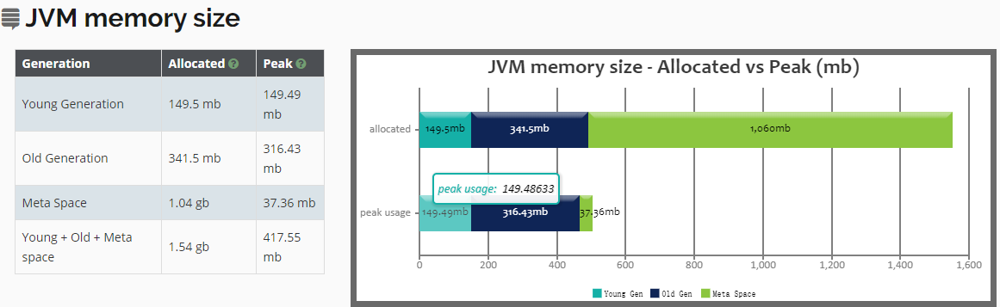


左侧分别展示了年轻代的内存分配分配空间大小（Allocated）和年轻代内存分配空间大小的最大峰值（Peek）。

然后依次是老年代（Old Generation）、元数据区（Meta Space）、堆区和非堆区（Young + Old + Meta Space）总大小。

值得注意的是，每一代的最大内存利用率都会超过分配的大小。


### Key Performance Indicators

 这一部分是关键的性能指标 

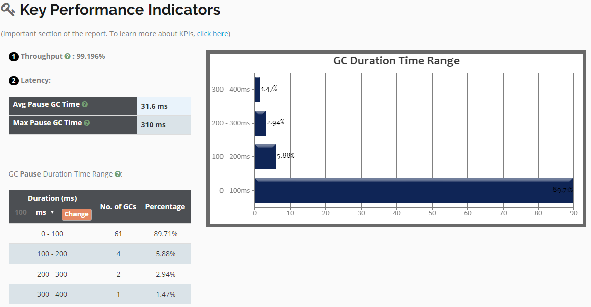


- Throughput表示的是吞吐量
- Latency表示响应时间
  - Avg Pause GC Time 平均GC时间
  - Max Pause GC TIme 最大GC时间


### Interactive Graphs


### GC Statistics


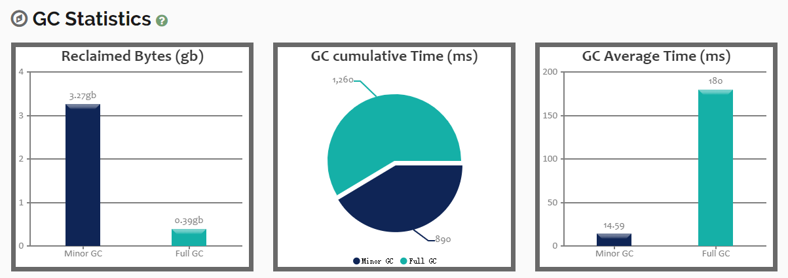


左图：表示的是堆内存中Minor GC和Full GC回收垃圾对象的内存。
中图：总计GC时间，包括Minor GC和Full GC，时间单位为ms。
右图：GC平均时间，包括了Minor GC和Full GC。 


### Object Stats


Total Created Bytes表示的是创建的字节总数，

Total promoted bytes表示的是晋升的字节总数，

Avg creation rate表示的是平均创建字节率，

Avg promotion rate表示平均的晋升率。 


### Memory Leak

检测程序没有内存泄漏。


此处可以诊断8种OOM中的5种（Java堆内存溢出，超出GC开销限制，请求数组大小超过JVM限制，Permgen空间，元空间）。 


### GC Causes


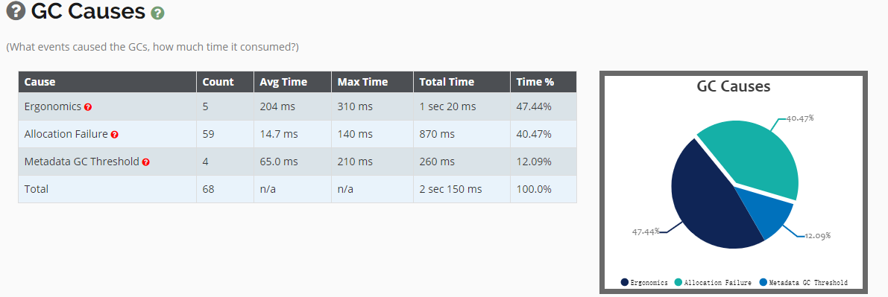


CG原因，以及所花费的时间，也就是停顿线程的时间。 


除了上面介绍的以外，还有`System.gc() calls`，`Consecutive Full GC`、`Safe Point Duration`、`Tenuring Summary`以及`command Line Flags`等等 


`Ergonomics`

`Allocation Failure`

`Metadata GC Threashold`

`System.gc() calls`

`Consecutive Full GC`

`Safe Point Duration`

`Tenuring Summary`

`command Line Flags`


# 实例分析


## GC日志


```java
/** 
  -Xms60m 
  -Xmx60m 
  -Xmn20m 
  -XX:NewRatio=2 ( 若 Xms = Xmx, 并且设定了 Xmn, 那么该项配置就不需要配置了 ) 
  -XX:SurvivorRatio=8 
  -XX:PermSize=30m 
  -XX:MaxPermSize=30m 
  -XX:+PrintGCDetails
  */
public class TestVm{
    public void doTest(){
         Integer M = new Integer(1024 * 1024 * 1);  //单位, 兆(M) 
            byte[] bytes = new byte[1 * M]; //申请 1M 大小的内存空间 
            bytes = null;  //断开引用链
            System.gc();   //通知 GC 收集垃圾                       
            System.out.println();       //                       
            bytes = new byte[1 * M];  //重新申请 1M 大小的内存空间   
            bytes = new byte[1 * M];  //再次申请 1M 大小的内存空间   
            System.gc();
            System.out.println();                                 
        }
    public static void main(String[] args) {
         new TestVm().doTest();
     }
}
/**
  
  -Xms60m -Xmx60m -Xmn20m -XX:NewRatio=2 -XX:SurvivorRatio=8 -XX:PermSize=30m -XX:MaxPermSize=30m -XX:+PrintGCDetails
  
  java -Xms60m -Xmx60m -Xmn20m -XX:NewRatio=2 -XX:SurvivorRatio=8 -XX:+PrintGCDetails GCTest
  
**/
```


按上面代码中注释的信息设定 jvm 相关的参数项，并执行程序，下面是一次执行完成控制台打印的结果：

```powershell
[ GC [ PSYoungGen:  1351K -> 288K (18432K) ]  1351K -> 288K (59392K), 0.0012389 secs ]  [ Times: user=0.00 sys=0.00, real=0.00 secs ] 
[ Full GC (System)  [ PSYoungGen:  288K -> 0K (18432K) ]  [ PSOldGen:  0K -> 160K (40960K) ]  288K -> 160K (59392K)  [ PSPermGen:  2942K -> 2942K (30720K) ],  0.0057649 secs ] [ Times:  user=0.00  sys=0.00,  real=0.01 secs ] 

[ GC [ PSYoungGen:  2703K -> 1056K (18432K) ]  2863K -> 1216K(59392K),  0.0008206 secs ]  [ Times: user=0.00 sys=0.00, real=0.00 secs ] 
[ Full GC (System)  [ PSYoungGen:  1056K -> 0K (18432K) ]  [ PSOldGen:  160K -> 1184K (40960K) ]  1216K -> 1184K (59392K)  [ PSPermGen:  2951K -> 2951K (30720K) ], 0.0052445 secs ]  [ Times: user=0.02 sys=0.00, real=0.01 secs ] 

Heap 
PSYoungGen      
      total 18432K, used 327K [0x00000000fec00000, 0x0000000100000000, 0x0000000100000000)  
      eden  space 16384K, 2% used [0x00000000fec00000,0x00000000fec51f58,0x00000000ffc00000)   
      from space 2048K, 0% used [0x00000000ffe00000,0x00000000ffe00000,0x0000000100000000)  
      to   space 2048K, 0% used [0x00000000ffc00000,0x00000000ffc00000,0x00000000ffe00000) 

PSOldGen        
    total 40960K, used 1184K [0x00000000fc400000, 0x00000000fec00000, 0x00000000fec00000)  

 PSPermGen       
     total 30720K, used 2959K [0x00000000fa600000, 0x00000000fc400000, 0x00000000fc400000)  
     object space 30720K, 9% used [0x00000000fa600000,0x00000000fa8e3ce0,0x00000000fc400000)

从打印结果可以看出，堆中新生代的内存空间为 18432K ( 约 18M )，eden 的内存空间为 16384K ( 约 16M)，from / to survivor 的内存空间为 2048K ( 约 2M)。
```


这里所配置的 Xmn 为 20M，也就是指定了新生代的内存空间为 20M，可是从打印的堆信息来看，新生代怎么就只有 18M 呢? 另外的 2M 哪里去了? 别急，是这样的。新生代 = eden + from + to = 16 + 2 + 2 = 20M，可见新生代的内存空间确实是按 Xmn 参数分配得到的。而且这里指定了 SurvivorRatio = 8，因此，eden = 8/10 的新生代空间 = 8/10 * 20 = 16M。from = to = 1/10 的新生代空间 = 1/10 * 20 = 2M。堆信息中新生代的 total 18432K 是这样来的： eden + 1 个 survivor = 16384K + 2048K = 18432K，即约为 18M。因为 jvm 每次只是用新生代中的 eden 和 一个 survivor，因此新生代实际的可用内存空间大小为所指定的 90%。因此可以知道，这里新生代的内存空间指的是新生代可用的总的内存空间，而不是指整个新生代的空间大小。另外，可以看出老年代的内存空间为 40960K ( 约 40M )，堆大小 = 新生代 + 老年代。因此在这里，老年代 = 堆大小 - 新生代 = 60 - 20 = 40M。
最后，这里还指定了 PermSize = 30m，PermGen 即永久代 ( 方法区 )，它还有一个名字，叫非堆，主要用来存储由 jvm 加载的类文件信息、常量、静态变量等。

回到 doTest() 方法中，可以看到代码在第 14、18、19 这三行中分别申请了一块 1M 大小的内存空间，并在 16 和 20 这两行中分别显式的调用了 System.gc()。从控制台打印的信息来看，每次调 System.gc()，是先进行 Minor GC，然后再进行 Full GC。
第 16 行触发的 Minor GC 收集分析：
从信息 PSYoungGen : 1351K -> 288K，可以知道，在第 14 行为 bytes 分配的内存空间已经被回收完成。引起 GC 回收这 1M 内存空间的因素是第 15 行的 bytes = null; bytes 为 null 表明之前申请的那 1M 大小的内存空间现在已经没有任何引用变量在使用它了，并且在内存中它处于一种不可到达状态 ( 即没有任何引用链与 GC Roots 相连 )。那么，当 Minor GC 发生的时候，GC 就会来回收掉这部分的内存空间。
第 16行触发的 Full GC 收集分析：
在 Minor GC 的时候，信息显示 PSYoungGen : 1351K -> 288K，再看看 Full GC 中显示的 PSYoungGen : 288K -> 0K，可以看出，Full GC 后，新生代的内存使用变成0K 了，那么这 288K 到底哪去了 ? 难道都被 GC 当成垃圾回收掉了 ? 当然不是了。我还特意在 main 方法中 new 了一个 Test 类的实例，这里的 Test 类的实例属于小对象，它应该被分配到新生代内存当中，现在还在调用这个实例的 doTest 方法呢，GC 不可能在这个时候来回收它的。

接着往下看 Full GC 的信息，会发现一个很有趣的现象，PSOldGen: 0K -> 160K，可以看到，Full GC 后，老年代的内存使用从 0K 变成了 160K，想必你已经猜到大概是怎么回事了。当 Full GC 进行的时候，默认的方式是尽量清空新生代 ( YoungGen )，因此在调 System.gc() 时，新生代 ( YoungGen ) 中存活的对象会提前进入老年代。

第 20行触发的 Minor GC 收集分析：
从信息 PSYoungGen : 2703K -> 1056K，可以知道，在第 18行创建的，大小为 1M 的数组被 GC 回收了。在第 19 行创建的，大小也为 1M 的数组由于 bytes 引用变量还在引用它，因此，它暂时未被 GC 回收。

第 20 行触发的 Full GC 收集分析：
在 Minor GC 的时候，信息显示 PSYoungGen : 2703K -> 1056K，Full GC 中显示的 PSYoungGen : 1056K -> 0K，以及 PSOldGen: 160K -> 1184K，可以知道，新生代 ( YoungGen ) 中存活的对象又提前进入老年代了。


## GC回收器


```java
import java.util.HashMap;
 
public class GCTimeTest {
 static HashMap map = new HashMap();
	public static void main(String[] args){
		 long begintime = System.currentTimeMillis();
		 for(int i=0;i<10000;i++){
			if(map.size()*512/1024/1024>=400){
				map.clear();
				System.out.println("clean map(map size: " + map.size() + ")");
			}
			byte[] b1;
			for(int j=0;j<100;j++){
				b1 = new byte[512];
				map.put(System.nanoTime(), b1);
			}
		}
		long endtime = System.currentTimeMillis();
		System.out.println(endtime - begintime);
	}
}
```


使用参数-Xmx512M -Xms512M -XX:+UseParNewGC 运行代码，输出如下：

clean map 8565

cost time=1655

使用参数-Xmx512M -Xms512M -XX:+UseParallelOldGC –XX:ParallelGCThreads=8 运行代码，输出如下：

clean map 8798

cost time=1998

使用参数-Xmx512M -Xms512M -XX:+UseSerialGC 运行代码，输出如下：

clean map 8864

cost time=1717

使用参数-Xmx512M -Xms512M -XX:+UseConcMarkSweepGC 运行代码，输出如下：

clean map 8862

cost time=1530

上面例子的 GC 输出可以看出，采用不同的垃圾回收机制及设定不同的线程数，对于代码段的整体执行时间有较大的影响。需要读者有针对性地选用适合自己代码段的垃圾回收机制。


# GC常见问题

## GC触发时机


## 应用GC长时间停顿


# finalize作用

- finalize()是Object的protected方法，子类可以覆盖该方法以实现资源清理工作，GC在回收对象之前调用该方法。
- finalize()与C++中的析构函数不是对应的。C++中的析构函数调用的时机是确定的（对象离开作用域或delete掉），但Java中的finalize的调用具有不确定性
- 不建议用finalize方法完成“非内存资源”的清理工作，但建议用于：
  - ① 清理本地对象(通过JNI创建的对象)；
  - ② 作为确保某些非内存资源(如Socket、文件等)释放的一个补充：在finalize方法中显式调用其他资源释放方法。其原因可见下文[finalize的问题]

## finalize的问题

- 一些与finalize相关的方法，由于一些致命的缺陷，已经被废弃了，如System.runFinalizersOnExit()方法、Runtime.runFinalizersOnExit()方法
- System.gc()与System.runFinalization()方法增加了finalize方法执行的机会，但不可盲目依赖它们
- Java语言规范并不保证finalize方法会被及时地执行、而且根本不会保证它们会被执行
- finalize方法可能会带来性能问题。因为JVM通常在单独的低优先级线程中完成finalize的执行
- 对象再生问题：finalize方法中，可将待回收对象赋值给GC Roots可达的对象引用，从而达到对象再生的目的
- finalize方法至多由GC执行一次(用户当然可以手动调用对象的finalize方法，但并不影响GC对finalize的行为)

## finalize的执行过程(生命周期)

(1) 首先，大致描述一下finalize流程：当对象变成(GC Roots)不可达时，GC会判断该对象是否覆盖了finalize方法，若未覆盖，则直接将其回收。否则，若对象未执行过finalize方法，将其放入F-Queue队列，由一低优先级线程执行该队列中对象的finalize方法。执行finalize方法完毕后，GC会再次判断该对象是否可达，若不可达，则进行回收，否则，对象“复活”。

(2) 具体的finalize流程：

对象可由两种状态，涉及到两类状态空间，一是终结状态空间 F = {unfinalized, finalizable, finalized}；二是可达状态空间 R = {reachable, finalizer-reachable, unreachable}。各状态含义如下：

- unfinalized: 新建对象会先进入此状态，GC并未准备执行其finalize方法，因为该对象是可达的
- finalizable: 表示GC可对该对象执行finalize方法，GC已检测到该对象不可达。正如前面所述，GC通过F-Queue队列和一专用线程完成finalize的执行
- finalized: 表示GC已经对该对象执行过finalize方法
- reachable: 表示GC Roots引用可达
- finalizer-reachable(f-reachable)：表示不是reachable，但可通过某个finalizable对象可达
- unreachable：对象不可通过上面两种途径可达

## 代码示例

### 对象复活

```java
public class GC {  
  
    public static GC SAVE_HOOK = null;  
  
    public static void main(String[] args) throws InterruptedException {  
        SAVE_HOOK = new GC();  
        SAVE_HOOK = null;  
        System.gc();  
        Thread.sleep(500);  
        if (null != SAVE_HOOK) { //此时对象应该处于(reachable, finalized)状态  
            System.out.println("Yes , I am still alive");  
        } else {  
            System.out.println("No , I am dead");  
        }  
        SAVE_HOOK = null;  
        System.gc();  
        Thread.sleep(500);  
        if (null != SAVE_HOOK) {  
            System.out.println("Yes , I am still alive");  
        } else {  
            System.out.println("No , I am dead");  
        }  
    }  
  
    @Override  
    protected void finalize() throws Throwable {  
        super.finalize();  
        System.out.println("execute method finalize()");  
        SAVE_HOOK = this;  
    }
}
```

### 覆盖finalize方法以确保资源释放

作为一个补充操作，以防用户忘记“关闭“资源，JDK中FileInputStream、FileOutputStream、Connection类均用了此”技术“，下面代码摘自FileInputStream类

```java
public class FileInputStream extends InputStream
    
	protected void finalize() throws IOException {
        if ((fd != null) &&  (fd != FileDescriptor.in)) {
            /* if fd is shared, the references in FileDescriptor
             * will ensure that finalizer is only called when
             * safe to do so. All references using the fd have
             * become unreachable. We can call close()
             */
            close();
        }
    }
}
```

