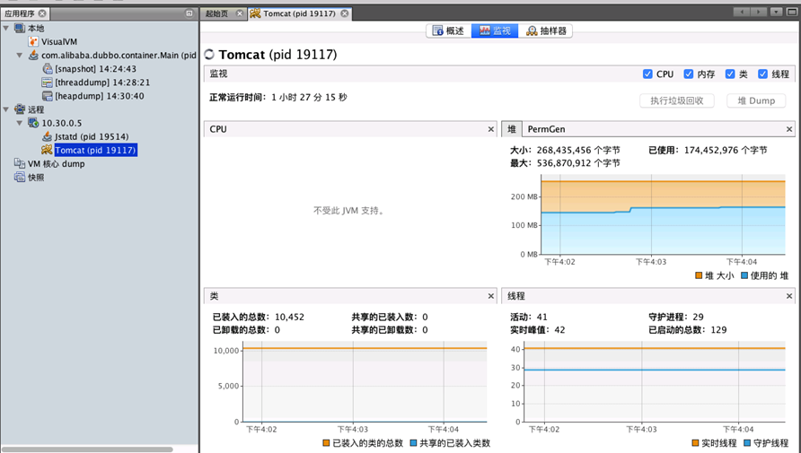

[TOC]

# jdk提供的工具


## jvisualvm

- jvisialVM是jconsule的加强版本
- jvisual的使用需要两个步骤（监控远程主机的java程序）
  - 1.远程主机开启jstatd
  - 2.被监控java程序启动时需要加上JMX的连接参数信息


### jstatd

- `jstatd`是一个RMI（Remove Method Invocation）的server应用，用于监控jvm的创建和结束，并且提供接口让监控工具（如VisualVM）可以远程连接到本机的jvms 。注意是jvms，就是说运行jstatd命令后可以用监控工具监控本用户（运行jstatd命令的用户）所有已经启动的java程序。

- 启动方式

  - 1.在服务器上新建文件，命名为jstatd.all.policy内容为：

    ```properties
    grant codebase "file:${java.home}/../lib/tools.jar" {  
       permission java.security.AllPermission;  
    };
    ```

  - 2.在远程主机上启动 jstatd 并且不要关闭。

    ```bash
    jstatd -J-Djava.security.policy=jstatd.all.policy
    ```

    想指定端口可以用下面命令：

    ```shell
    jstatd -J-Djava.security.policy=jstatd.policy -p 1099
    ```

  - 3.VisualVM 中连接

    在客户端用visualvm连接部署jstatd的服务器ip：`jvisualVM [--console new]`

    显示如下：

    


### JMX

- jstatd的远程监控，CPU的监控我这里看不到，这时候就要用到 JMX的连接了。

JMX 配置

远程机器的**被监测程序启动时**需要加上JVM参数

```shell
-Dcom.sun.management.jmxremote=true \
-Dcom.sun.management.jmxremote.port=9090 \
-Dcom.sun.management.jmxremote.ssl=false \
-Dcom.sun.management.jmxremote.authenticate=false
```


备注：另外需要检查 `hostname –i`，看解析出来是否为本地的IP，如是127.0.0.1或者IP为多个IP中之一，则其他的IP无效，会连接不上。

也可以使用如下的参数手动指定 hostname 或者 ip 地址

```shell
-Djava.rmi.server.hostname=192.168.0.1
```


启动命令示例：

```shell
$ java -cp . \
-Djava.rmi.server.hostname=172.16.1.127 \
-Dcom.sun.management.jmxremote=true \
-Dcom.sun.management.jmxremote.port=9090 \
-Dcom.sun.management.jmxremote.ssl=false \
-Dcom.sun.management.jmxremote.authenticate=false \
-Xms90m -Xmx90m -Xmn30m -XX:NewRatio=2 -XX:SurvivorRatio=8 -XX:+PrintGCDetails \
-Dcom.sun.management.jmxremote=true -Dcom.sun.management.jmxremote.port=9090 GCTimeTest

```


然后就可以使用菜单中的 “`Add JMX Connection`”，连接远程地址。

```
以 tomcat 为例， 我们需要修改 catalina.sh 文件。
在下面这行上面添加文字。
```

1. \# ----- Execute The Requested Command ----------------------------------------- 

```
需要添加的文字：
```

JAVA_OPTS="-Djava.rmi.server.hostname=10.12.49.64 
-Dcom.sun.management.jmxremote 
-Dcom.sun.management.jmxremote.port=8081 
-Dcom.sun.management.jmxremote.ssl=false 
-Dcom.sun.management.jmxremote.authenticate=false $JAVA_OPTS" 
export JAVA_OPTS 

注：第一行的ip为tomcat所在服务器的ip；第三行的端口为jmx使用的端口，确保此端口是未被占用的；（不要少了第一行，我一开始配置的时候就是没有第一行，jmx一直连接不上）

```
启动tomcat，netstat -aux 看看8080,8081端口是否被监听，如果被监听，说明配置成功了，然后在visualvm的远程选择ip，右键，添加“jmx连接”，成功连接就成功了
```


## jconsole

- jconsole配合jvisualvm一起使用（jconsole可以查看cpu占用情况）
- jconsole可以查看java内存的具体占用（新生代，老年代，永久代）


**使用方式**

- 被监测程序启动时需要指定jmx

```shell
$ java -cp . \
-Djava.rmi.server.hostname=172.16.1.127 \
-Dcom.sun.management.jmxremote=true \
-Dcom.sun.management.jmxremote.port=9090 \
-Dcom.sun.management.jmxremote.ssl=false \
-Dcom.sun.management.jmxremote.authenticate=false \
-Xms90m -Xmx90m -Xmn30m -XX:NewRatio=2 -XX:SurvivorRatio=8 -XX:+PrintGCDetails \
-Dcom.sun.management.jmxremote=true -Dcom.sun.management.jmxremote.port=9090 GCTimeTest
```

- 命令行启动或连接

```shell
$ jconsole
$ jconsole 172.16.1.127:9090
```


## jstack

`Java Stack Trace`，Java堆栈跟踪工具。用于生成java虚拟机当前时刻的线程快照。

线程快照是当前java虚拟机内每一条线程正在执行的方法堆栈的集合，生成线程快照的主要目的是定位线程出现长时间停顿的原因，如线程间死锁、死循环、请求外部资源导致的长时间等待等。


```shell
$ jstack [ option ] pid

$ jstack [ option ] executable core

$ jstack [ option ] [server-id@]remote-hostname-or-IP
```

参数：

```shell
-F 当’jstack [-l] pid’没有相应的时候强制打印栈信息

-l 长列表. 打印关于锁的附加信息,例如属于java.util.concurrent的ownable synchronizers列表.

-m 打印java和native c/c++框架的所有栈信息.
```


示例：

```shell
1.top查找出哪个进程消耗的cpu高。执行top命令，默认是进程视图，其中PID是进程号
co_ad2    18   0 1817m 776m 9712 S  3.3  4.9  12:03.24 java                                                                                           
co_ad     21   0 3028m 2.5g 9432 S  1.0 16.3   6629:44 ja


这里我们分析21125这个java进程
2.top中shift+h 或“H”查找出哪个线程消耗的cpu高 
先输入top，然后再按shift+h 或“H”，此时打开的是线程视图，pid为线程号
co_ad2    15   0 1807m 630m 9492 S  1.3  4.0   0:05.12 java                                                                                           
co_ad2_s  15   0 1360m 560m 9176 S  0.3  3.6   0:46.72 java                                                                                           

这里我们分析21233这个线程，并且注意的是，这个线程是属于21125这个进程的。 

3.使用jstack命令输出这一时刻的线程栈，保存到文件，命名为jstack.log。注意：输出线程栈和保存top命令快照尽量同时进行。
  由于jstack.log文件记录的线程ID是16进制，需要将top命令展示的线程号转换为16进制。

4. jstack查找这个线程的信息 
jstack [进程]|grep -A 10 [线程的16进制] 
即： jstack 21125|grep -A 10 52f1  

-A 10表示查找到所在行的后10行。21233用计算器转换为16进制52f1，注意字母是小写。 
结果： 
 
"http-8081-11" daemon prio=10 tid=0x00002aab049a1800 nid=0x52bb in Object.wait() [0x0000000042c75000]  
   java.lang.Thread.State: WAITING (on object monitor)  
     at java.lang.Object.wait(Native Method)  
     at java.lang.Object.wait(Object.java:485)  
     at org.apache.tomcat.util.net.JIoEndpoint$Worker.await(JIoEndpoint.java:416)  

在结果中查找52f1，可看到当前线程在做什么。
```


## jstat

`Java Virtual Machine statistics monitoring tool`，对Java应用程序的**资源**和**性能**进行**实时**的命令行的监控，包括了对Heap size和垃圾回收状况的监控。


[https://blog.csdn.net/zhaozheng7758/article/details/8623549](https://blog.csdn.net/zhaozheng7758/article/details/8623549)


```shell
$ jstat -options 

-class (类加载器) 
-compiler (JIT) 
-gc (GC堆状态) 
-gccapacity (各区大小) 
-gccause (最近一次GC统计和原因) 
-gcnew (新区统计)
-gcnewcapacity (新区大小)
-gcold (老区统计)
-gcoldcapacity (老区大小)
-gcpermcapacity (永久区大小)
-gcutil (GC统计汇总)
-printcompilation (HotSpot编译统计)
```


## jmap 

java内存映射工具（java Memory Map）

```shell
$ jmap [ option ] pid

$ jmap [ option ] executable core

$ jmap [ option ] [server-id@]remote-hostname-or-IP
```

参数

```shell
-dump:[live,]format=b,file=<filename> 使用hprof二进制形式,输出jvm的heap内容到文件=. live子选项是可选的，假如指定live选项,那么只输出活的对象到文件. 

-finalizerinfo 打印正等候回收的对象的信息.

-heap 打印heap的概要信息，GC使用的算法，heap的配置及wise heap的使用情况.

-histo[:live] 打印每个class的实例数目,内存占用,类全名信息. VM的内部类名字开头会加上前缀”*”. 如果live子参数加上后,只统计活的对象数量. 

-permstat 打印classload和jvm heap长久层的信息. 包含每个classloader的名字,活泼性,地址,父classloader和加载的class数量. 另外,内部String的数量和占用内存数也会打印出来. 

-F 强迫.在pid没有相应的时候使用-dump或者-histo参数. 在这个模式下,live子参数无效. 

-h | -help 打印辅助信息 

-J 传递参数给jmap启动的jvm. 
```


命令：`jmap -dump:format=b,file=heap.bin <pid>`

​        dump文件可以通过MemoryAnalyzer分析查看，网址：http://www.eclipse.org/mat/，可以查看dump时对象数量，内存占用，线程情况等。


## jhat

jvm堆快照分析工具。用来分析jmap生成的dump。

jhat内置了一个微型的HTTP/HTML服务器，生成dump的分析结果后， 可以在浏览器中查看。在此要注意，一般不会直接在服务器上进行分析，因为jhat是一个耗时并且耗费硬件资源的过程，一般把服务器生成的dump文件复制 到本地或其他机器上，通过本地可视化工具来分析（**MAT/jprofile/visualVm**）。


## jinfo

（Configuration Info for Java），配置信息工具

获取一些当前进程的jvm运行和启动信息。

```shell
[root@spark-slave0 ~]# jinfo 10732

VM Flags:
Non-default VM flags: -XX:CICompilerCount=4 -XX:InitialHeapSize=94371840 -XX:+ManagementServer -XX:MaxHeapSize=94371840 -XX:MaxNewSize=31457280 -XX:MinHeapDeltaBytes=524288 -XX:NewRatio=2 -XX:NewSize=31457280 -XX:OldSize=62914560 -XX:+PrintGCDetails -XX:SurvivorRatio=8 -XX:+UseCompressedClassPointers -XX:+UseCompressedOops -XX:+UseFastUnorderedTimeStamps -XX:+UseParallelGC
Command line:  -Djava.rmi.server.hostname=172.16.1.127 -Dcom.sun.management.jmxremote=true -Dcom.sun.management.jmxremote.port=9090 -Dcom.sun.management.jmxremote.ssl=false -Dcom.sun.management.jmxremote.authenticate=false -Xms90m -Xmx90m -Xmn30m -XX:NewRatio=2 -XX:SurvivorRatio=8 -XX:+PrintGCDetails -Dcom.sun.management.jmxremote=true -Dcom.sun.management.jmxremote.port=9090
```


## jcmd

`jcmd`是一个多功能的工具，可以用它来导出堆、查看Java进程、导出线程信息、执行GC、还可以进行采样分析（jmc 工具的飞行记录器）。


它的命令格式如下：

```shell
$ jcmd <pid | main class> <command ... | PerfCounter.print | -f  file>
$ jcmd -l # 同 jcmd
$ jcmd -h
```


```shell
pid：接收诊断命令请求的进程ID。
main class ：接收诊断命令请求的进程的main类。匹配进程时，main类名称中包含指定子字符串的任何进程均是匹配的。如果多个正在运行的Java进程共享同一个main类，诊断命令请求将会发送到所有的这些进程中。

command：接收诊断命令请求的进程的main类。匹配进程时，main类名称中包含指定子字符串的任何进程均是匹配的。如果多个正在运行的Java进程共享同一个main类，诊断命令请求将会发送到所有的这些进程中。

注意: 如果任何参数含有空格，你必须使用英文的单引号或双引号将其包围起来。 此外，你必须使用转义字符来转移参数中的单引号或双引号，以阻止操作系统shell处理这些引用标记。当然，你也可以在参数两侧加上单引号，然后在参数内使用双引号(或者，在参数两侧加上双引号，在参数中使用单引号)。

Perfcounter.print：打印目标Java进程上可用的性能计数器。性能计数器的列表可能会随着Java进程的不同而产生变化。

-f file：从文件file中读取命令，然后在目标Java进程上调用这些命令。在file中，每个命令必须写在单独的一行。以"#"开头的行会被忽略。当所有行的命令被调用完毕后，或者读取到含有stop关键字的命令，将会终止对file的处理。
```


### 查看进程

查看 当前机器上所有的 jvm 进程信息

```shell
$ jcmd 
$ jcmd -l
$ jps
```


### 查看性能统计

查看指定进程的性能统计信息。

```shell
$ jcmd 9592 PerfCounter.print
```


### 列出当前运行的 java 进程可以执行的操作

```shell
$ jcmd 9592 help

9592:
The following commands are available:
JFR.stop
JFR.start
JFR.dump
JFR.check
VM.native_memory
VM.check_commercial_features
VM.unlock_commercial_features
ManagementAgent.stop
ManagementAgent.start_local
ManagementAgent.start
GC.rotate_log
Thread.print
GC.class_stats
GC.class_histogram
GC.heap_dump
GC.run_finalization
GC.run
VM.uptime
VM.flags
VM.system_properties
VM.command_line
VM.version
help

For more information about a specific command use 'help <command>'.
```


#### 查看具体命令的选项

如果想查看命令的选项，比如想查看 JFR.dump 命令选项，可以通过如下命令:

```shell
$ jcmd 11772 help JFR.dump
```


#### JRF 相关命令

JRF 功能跟 jmc.exe 工具的飞行记录器的功能一样的。
要使用 JRF 相关的功能，必须使用 VM.unlock_commercial_features 参数取消锁定商业功能 。


**启动JFR**
		执行命令：jcmd $PID JFR.start name=abc,duration=120s

**Dump JFR**
		等待至少duration（本文设定120s）后，执行命令：jcmd PID JFR.dump name=abc,duration=120s filename=abc.jfr（注意，文件名必须为.jfr后缀）

**检查JFR状态**
		执行命令：jcmd $PID JFR.check name=abc,duration=120s

**停止JFR**
		执行命令：jcmd $PID JFR.stop name=abc,duration=120s

**JMC分析**
		切回开发机器，下载步骤3中生成的abc.jfr，打开jmc，导入abc.jfr即可进行可视化分析


#### VM.uptime

查看 JVM 的启动时长：

```shell
$ jcmd PID VM.uptime
```


#### GC.class_histogram

查看系统中类统计信息

```shell
$ jcmd PID GC.class_histogram
```


这里和jmap -histo pid的效果是一样的
这个可以查看每个类的实例数量和占用空间大小。


#### Thread.print

查看线程堆栈信息。同`jstack`命令。

```shell
$ jcmd PID Thread.print
```


#### GC.heap_dump

查看 JVM 的Heap Dump

```shell
$ jcmd PID GC.heap_dump FILE_NAME
```

```shell
$ jcmd 10576 GC.heap_dump d:\dump.hprof
10576:
Heap dump file created
```


跟 `jmap`命令：`jmap -dump:format=b,file=heapdump.phrof pid` 效果一样。
导出的 `dump` 文件，可以使用`MAT` 或者 `Visual VM` 等工具进行分析。


#### VM.system_properties

查看 JVM 的属性信息

```shell
$ jcmd PID VM.system_properties
```


#### VM.flags

查看 JVM 的启动参数

```shell
$ jcmd 10576 VM.flags
10576:
-XX:CICompilerCount=3 -XX:ConcGCThreads=1 
-XX:G1HeapRegionSize=1048576 -XX:InitialHeapSize=268435456 
-XX:MarkStackSize=4194304 -XX:MaxHeapSize=1073741824 
-XX:MaxNewSize=643825664 -XX:MinHeapDeltaBytes=1048576 
-XX:+UseCompressedClassPointers -XX:+UseCompressedOops 
-XX:+UseFastUnorderedTimeStamps -XX:+UseG1GC 
-XX:-UseLargePagesIndividualAllocation -XX:+UseStringDeduplication
```


#### VM.command_line

查看 JVM 的启动命令行

```shell
$ jcmd 10576 VM.command_line
10576:
VM Arguments:
jvm_args: -Dosgi.requiredJavaVersion=1.8 
-Dosgi.instance.area.default=@user.home/eclipse-workspace 
-XX:+UseG1GC -XX:+UseStringDeduplication 
-Dosgi.requiredJavaVersion=1.8 -Xms256m -Xmx1024m
java_command: <unknown>
java_class_path (initial): D:\tool\...\org.eclipse.equinox.launcher.jar
```


#### GC.run_finalization

对 JVM 执行 java.lang.System.runFinalization()

```shell
$ jcmd 10576 GC.run_finalization
10576:
Command executed successfully
```


#### GC.run

对 JVM 执行 java.lang.System.gc()

```shell
$ jcmd 10576 GC.run
10576:
Command executed successfully
```

告诉垃圾收集器打算进行垃圾收集，而垃圾收集器进不进行收集是不确定的。


#### PerfCounter.print

查看 JVM 性能相关的参数

```shell
$ jcmd 10576 PerfCounter.print
10576:
java.ci.totalTime=93024843
java.cls.loadedClasses=18042
java.cls.sharedLoadedClasses=0
java.cls.sharedUnloadedClasses=0
java.cls.unloadedClasses=3

......
```


#### VM.version

查看目标jvm进程的版本信息

```shell
$ jcmd 10576 VM.version
10576:
Java HotSpot(TM) 64-Bit Server VM version 25.91-b15
JDK 8.0_91
```


# 可视化工具

对`jvm`监控的常见可视化工具，除了`jdk`本身提供的`Jconsole`和`jvisualVm`以外，还有第三方提供的`jprofilter，perfino，Yourkit，Perf4j，JProbe，MAT`等。这些工具都极大的丰富了我们定位以及优化`jvm`方式。


# 问题排查示例


## cpu飙升

- 找到最耗CPU的进程

  ```shell
  $ top
  ```

- 找到该进程下最耗费cpu的线程

  ```shell
  $ top -Hp pid
  ```

- 转换进制

  ```shell
  # 转换16进制（转换后为0x3be4）
  $ printf “%x\n” 15332
  ```

- 过滤指定线程，打印堆栈信息

  ```shell
  #  打印进程堆栈 并通过线程id，过滤得到线程堆栈信息。
  $ jstack 13525 | grep '0x3be4'  -C5 --color
  ```

  

## 线程死锁

- 查找java进程id

  ```shell
  $ top
  $ jps 
  ```

- 查看java进程的线程快照信息

  ```shell
  $ jstack -l pid
  ```

  

从输出信息可以看到，有一个线程死锁发生，并且指出了那行代码出现的。如此可以快速排查问题。


## OOM内存泄露

java堆内的OOM异常是实际应用中常见的内存溢出异常。一般我们都是先通过内存映射分析工具（比如MAT）对dump出来的堆转存快照进行分析，确认内存中对象是否出现问题。

> 出现OOM的原因有很多，并非是堆中申请资源不足一种情况。还有可能是申请太多资源没有释放，或者是频繁频繁申请，系统资源耗尽。针对这三种情况我需要一一排查。


OOM的三种情况:

> 1.申请资源，内存过小，不够用。
>
> 2.申请资源太多，没有释放。
>
> 3.申请资源过多，资源耗尽。比如：线程过多，线程内存过大等。


### 排查申请申请资源问题

```shell
$ jmap -heap 11869 
```

查看新生代，老生代堆内存的分配大小以及使用情况，看是否本身分配过小。


### 排查gc

```shell
$ jstat -gcutil 11938 1000 # 每秒输出一次gc的分代内存分配情况，以及gc时间
```


### 查找最费内存的对象

```shell
$ jmap -histo:live 11869 | more
```

如果某个对象占用空间很大，比如超过了100Mb，应该着重分析，为何没有释放。


注意：

​		上述`jmap`执行之后，会造成jvm强制执行一次fgc，在线上不推荐使用，可以采取dump内存快照，线下采用可视化工具进行分析，更加详尽。


### 确认资源是否耗尽

```shell
$ pstree # 查看进程线程数量 pstree -p | wc -l
$ netstat # 查看网络连接数量或者采用

$ ll /proc/${PID}/fd | wc -l  # 打开的句柄数
$ ll /proc/${PID}/task | wc -l #（效果等同pstree -p | wc -l） //打开的线程数
```

