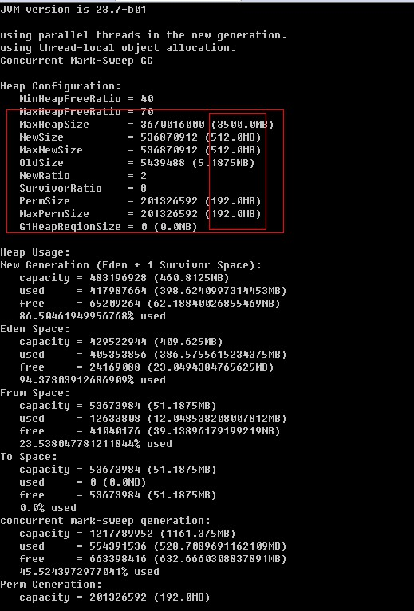

# java程序监控

- java 程序运行起来以后，如何查看其CPU，堆栈，线程数等

## 1.java visualVM

- jvisialVM是jconsule的加强版本

### 1.1jstatd

- `jstatd`是一个RMI（Remove Method Invocation）的server应用，用于监控jvm的创建和结束，并且提供接口让监控工具（如VisualVM）可以远程连接到本机的jvms 。注意是jvms，就是说运行jstatd命令后可以用监控工具监控本用户（运行jstatd命令的用户）所有已经启动的java程序。

- 启动方式

  - 1.在服务器上新建文件，命名为jstatd.all.policy内容为：

    ```properties
    grant codebase "file:${java.home}/../lib/tools.jar" {  
       permission java.security.AllPermission;  
    };
    ```

  - 2.在远程主机上启动 jstatd 并且不要关闭。

    ```bash
    jstatd -J-Djava.security.policy=jstatd.all.policy
    ```

    想指定端口可以用下面命令：

    ```shell
    jstatd -J-Djava.security.policy=jstatd.policy -p 1099
    ```

  - 3.VisualVM 中连接

    在客户端用visualvm连接部署jstatd的服务器ip：`jvisualVM [--console new]`

    显示如下：

    

### 1.2JMX连接

- jstatd的远程监控，CPU的监控我这里看不到，这时候就要用到 JMX的连接了。

JMX 配置

远程机器的程序需要加上JVM参数

> -Dcom.sun.management.jmxremote=true 
> -Dcom.sun.management.jmxremote.port=9090 
> -Dcom.sun.management.jmxremote.ssl=false 
> -Dcom.sun.management.jmxremote.authenticate=false

备注：另外需要检查 `hostname –i`，看解析出来是否为本地的IP，如是127.0.0.1或者IP为多个IP中之一，则其他的IP无效，会连接不上。

也可以使用如下的参数手动指定 hostname 或者 ip 地址

> ```
> -Djava.rmi.server.hostname=192.168.0.1
> ```

然后就可以使用菜单中的 “Add JMX Connection”，连接远程地址。

```
以 tomcat 为例， 我们需要修改 catalina.sh 文件。
在下面这行上面添加文字。
```

1. \# ----- Execute The Requested Command ----------------------------------------- 

```
需要添加的文字：
```

JAVA_OPTS="-Djava.rmi.server.hostname=10.12.49.64 
-Dcom.sun.management.jmxremote 
-Dcom.sun.management.jmxremote.port=8081 
-Dcom.sun.management.jmxremote.ssl=false 
-Dcom.sun.management.jmxremote.authenticate=false $JAVA_OPTS" 
export JAVA_OPTS 

注：第一行的ip为tomcat所在服务器的ip；第三行的端口为jmx使用的端口，确保此端口是未被占用的；（不要少了第一行，我一开始配置的时候就是没有第一行，jmx一直连接不上）

```
启动tomcat，netstat -aux 看看8080,8081端口是否被监听，如果被监听，说明配置成功了，然后在visualvm的远程选择ip，右键，添加“jmx连接”，成功连接就成功了
```

## 2.jstack

## 3.jstat

## 4.jmap 

### 4.1Jdk自带的jmap可以获取内在某一时刻的快照

​        命令：jmap -dump:format=b,file=heap.bin <pid>

​        file：保存路径及文件名

​        pid：进程编号（windows通过任务管理器查看，linux通过ps aux查看）

​        dump文件可以通过MemoryAnalyzer分析查看，网址：http://www.eclipse.org/mat/，可以查看dump时对象数量，内存占用，线程情况等。

### 4.2观察运行中的jvm物理内存的占用情况

观察运行中的jvm物理内存的占用情况，我们也可以用jmap命令。

​        参数如下：

-heap：打印jvm heap的情况

-histo：打印jvm heap的直方图。其输出信息包括类名，对象数量，对象占用大小。

-histo：live ：同上，但是只答应存活对象的情况

-permstat：打印permanent generation heap情况

​        命令使用：

​        jmap -heap 2083

​        可以观察到New Generation（Eden Space，From Space，To Space）,tenured generation,Perm Generation的内存使用情况



上图为tomcat应用出错前JVM的配置信息，可以明确的看到当时的信息：

​        MaxHeapSize堆内存大小为：3500M

​        MaxNewSize新生代内存大小：512M

​        PermSize永久代内存大小:192M

​        NewRatio设置年轻代（包括Eden和两个Survivor区）与年老代的比值（除去持久代）。设置为2，则年轻代与年老代所占比值为1：2，年轻代占整个堆栈的1/3。

​        SurvivorRatio设置年轻代中Eden区与Survivor区的大小比值。设置为8，则两个Survivor区与一个Eden区的比值为2:8，一个Survivor区占整个年轻代的1/10。

​        在New Generation中，有一个叫Eden的空间，主要是用来存放新生的对象，还有两个Survivor Spaces（from,to）, 它们用来存放每次垃圾回收后存活下来的对象。在Old Generation中，主要存放应用程序中生命周期长的内存对象，还有个Permanent Generation，主要用来放JVM自己的反射对象，比如类对象和方法对象等。

​        从上面的图可以看出来JVM的新生代设置太小，可以看出应用的新生代区完全占满了，无法再往新生代区增加新的对象此时的这些对象都处于活跃状态，所以不会被GC处理，但是tomcat应用还在继续产生新的对象，这样就会导致OOM的发生，这就是导致tomcat假死的原因。

## 5.jhat

jhat(JVM Heap Analysis Tool)命令是与jmap搭配使用，用来分析jmap生成的dump，jhat内置了一个微型的HTTP/HTML服务器，生成dump的分析结果后， 可以在浏览器中查看。在此要注意，一般不会直接在服务器上进行分析，因为jhat是一个耗时并且耗费硬件资源的过程，一般把服务器生成的dump文件复制 到本地或其他机器上进行分析。

## 5.jinfo

## 6.jcmd

`jcmd`命令（[帮助文档](https://docs.oracle.com/en/java/javase/11/tools/jcmd.html#GUID-59153599-875E-447D-8D98-0078A5778F05)）可以向运行中的Java虚拟机(JVM)发送诊断命令。

它的命令格式如下：

```
jcmd <pid | main class> <command ... | PerfCounter.print | -f  file>
jcmd -l
jcmd -h
```