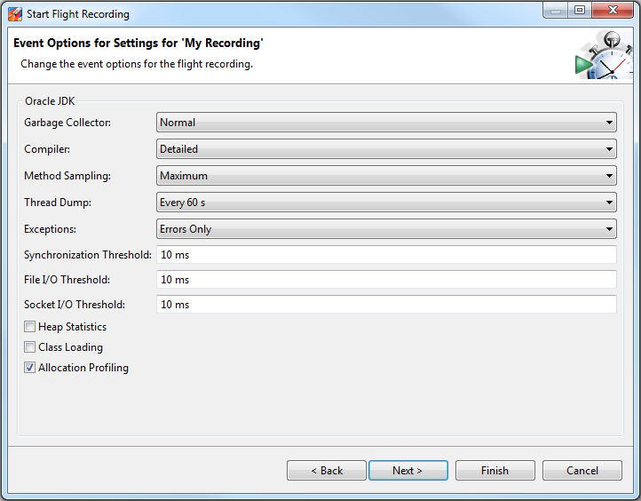
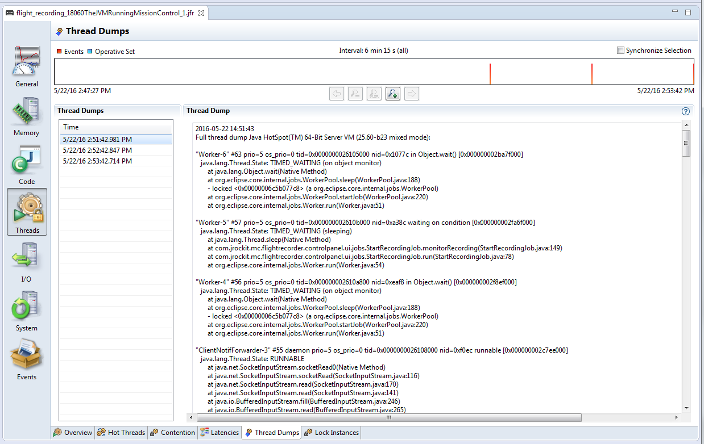
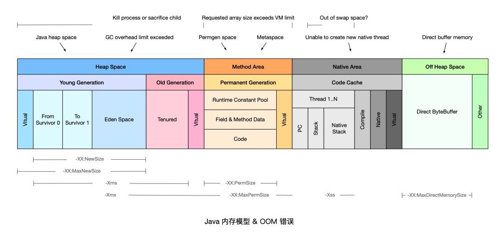

# JVM Core Dump

javacore文件主要保存的是java应用各线程在某一时刻的运行的位置，即执行到哪一个类的哪一个方法哪一个行上。javacore是一个文本文件，打开后可以看到每一个线程的执行栈，以stacktrace的方式显示。通过对javacore的分析可以得到应用是否“卡”在某一点上，即在某一点运行的时间太长，如[数据库](http://lib.csdn.net/base/mysql)查询，长期得不到响应，最终导致系统崩溃。


## 生成

```shell
$ kill -3 <pid>
```


首先，`ps -ef|grep java` 找出java进程id ；

然后再执行`kill -3 <pid>` 的操作；

等文件生成后再做一次同样的操作，再产生一组文件，两组文件在分析javacore时特别有效，困为它可以看出在先后两个时间点上，线程执行的位置，如果发现先后两组数据中同一线程都执行在同一位置，则说明此处可能有问题，因为程序运行是极快的，如果两次均在某一点上，说明这一点耗时是很大的。


# JVM Heap Dump

正如Thread Dump文件记录了当时JVM中线程运行的情况一样，Heap Dump记录了JVM中堆内存运行的情况。


## 生成Heap Dump

### 1.使用jmap

```shell
$ jmap -dump:live,format=b,file=heap-dump.bin <pid>

# pid: 				JVM进程的id
# heap-dump.bin: 	生成的文件名称
```


### 2.启动增加`-XX:+HeapDumpOnOutOfMemoryError`参数

在JVM的配置参数中可以添加 `-XX:+HeapDumpOnOutOfMemoryError` 参数，当应用抛出 OutOfMemoryError 时自动生成dump文件；

> 在JVM的配置参数中添加 `-Xrunhprof:head=site` 参数，会生成java.hprof.txt 文件，不过这样会影响JVM的运行效率，不建议在生产环境中使用


full gc之前dump：

`-XX:+HeapDumpBeforeFullGC -XX:HeapDumpPath=./java_pid<pid>.hprof` 


### 2.jconsole 生成


### 3.jprofile生成


## Heap Dump文件分析

### 1.使用jhat

```shell
$ jhat <heap-dump-file>

# heap-dump-file: 文件的路径和文件名

可以使用 -J-Xmx512m 参数设置命令的内存大小
```

```properties
# 执行成功后显示
Snapshot resolved.
Started HTTP server on port 7000
Server is ready.
```

这个时候访问 http://localhost:7000/ 就可以看到结果


### 2.Eclipse Memory Analyzer(MAT)


### 3.IBM Heap Analyzer


# JVM thread dump


## 生成Thread Dump文件


### 1.jstack

```shell
$ jstack -l <pid> > <file-path>

# pid： Java 应用的进程 id
# file-path： 保存 dump 文件的路径
```

示例

```shell
$ jstack -l 37320 > /opt/tmp/threadDump.txt
```


### 2.Kill -3

处于安全方面的考虑，有一部分生产环境的机器只包含 JRE 环境，因此就不能使用 jstack 工具了，在这种情况下，我们可以使用 kill -3 的方式：

```shell
$ kill -3 <pid>

# 当使用 kill -3 生成 dump 文件时，dump 文件会被输出到标准错误流。
# 假如你的应用运行在 tomcat 上，dump 内容将被发送到<TOMCAT_HOME>/logs/catalina.out 文件里。
```


### 3.JVisualVM


### 4.JMC

从 Oracle JDK 7 Update 40 开始，它被包含进 JDK 里，它可以从 JVM 里生成 dump 文件。

运行该工具之后，你可以看到运行在本地的 Java 进程，它也可以连接到远程机器。双击你想要生成 dump 文件的 Java 进程，点击Flight Recorder，你会看到以下的对话框：



在 Thread Dump 下拉框，你可以选择生成 dump 文件的时间间隔。在上面的例子里，每隔60秒将会生成一个 dump 文件。选择完成之后启动 Flight recorder ，可以在 Threads 面板看到 dump 文件的内容：




### 5.ThreadMXBean

从 JDK 1.5 开始，ThreadMXBean 被引入。这是 JVM 的管理接口，使用这个接口你仅需要少量的代码就能生成 dump 文件，以下是使用 ThreadMXBean 生成 dump 文件的主要实现：

```java
public void dumpThreadDump() {
  ThreadMXBean threadMxBean = ManagementFactory.getThreadMXBean();
  for (ThreadInfo ti : threadMxBean.dumpAllThreads(true, true)) {
    System.out.print(ti.toString());
  }
}
```


# 常见问题

## dump文件太大，比内存还大，如何查看


## 程序执行缓慢，如何查看具体哪一步缓慢


## 种常见OOM



```properties
java.lang.OutOfMemoryError: Java heap space

java.lang.OutOfMemoryError: GC overhead limit exceeded

java.lang.OutOfMemoryError: Permgen space

java.lang.OutOfMemoryError: Metaspace

java.lang.OutOfMemoryError: unable to create new native thread

java.lang.OutOfMemoryError: Out of swap space

java.lang.OutOfMemoryError: Kill process or sacrifice child

java.lang.OutOfMemoryError: Requested array size exceeds VM limit

java.lang.OutOfMemoryError: Direct buffer memory

java.lang.StackOverflowError
```


### 1、Java heap space

当堆内存（Heap Space）没有足够空间存放新创建的对象时，就会抛出 `java.lang.OutOfMemoryError:Javaheap space` 错误（根据实际生产经验，可以对程序日志中的 OutOfMemoryError 配置关键字告警，一经发现，立即处理）。

#### 堆溢出原因分析

`Javaheap space` 错误产生的常见原因可以分为以下几类：

1、请求创建一个超大对象，通常是一个大数组。

2、超出预期的访问量/数据量，通常是上游系统请求流量飙升，常见于各类促销/秒杀活动，可以结合业务流量指标排查是否有尖状峰值。

3、过度使用终结器（Finalizer），该对象没有立即被 GC。

4、内存泄漏（Memory Leak），大量对象引用没有释放，JVM 无法对其自动回收，常见于使用了 File 等资源没有回收。

#### 解决方案

针对大部分情况，通常只需要通过 `-Xmx` 参数调高 JVM 堆内存空间即可。如果仍然没有解决，可以参考以下情况做进一步处理：

1、如果是超大对象，可以检查其合理性，比如是否一次性查询了数据库全部结果，而没有做结果数限制。

2、如果是业务峰值压力，可以考虑添加机器资源，或者做限流降级。

3、如果是内存泄漏，需要找到持有的对象，修改代码设计，比如关闭没有释放的连接。

#### 代码示例

```java
import java.util.ArrayList;
import java.util.List;

/**
 * JVM配置参数
 * -Xms20m    JVM初始分配的内存20m
 * -Xmx20m   JVM最大可用内存为20m
 * -XX:+HeapDumpOnOutOfMemoryError 当JVM发生OOM时，自动生成DUMP文件
 * -XX:HeapDumpPath=/Users/weihuaxiao/Desktop/dump/  生成DUMP文件的路径
 */
public class HeapOOM {
    static class OOMObject {
    }
    public static void main(String[] args) {
        List<OOMObject> list = new ArrayList<OOMObject>();
        //在堆中无限创建对象
        while (true) {
            list.add(new OOMObject());
        }
    }
}
```


### 2、GC overhead limit exceeded

这个是JDK6新加的错误类型，一般都是堆太小导致的。

Sun 官方对此的定义：当 Java 进程花费 98% 以上的时间执行 GC，但只恢复了不到 2% 的内存，且该动作连续重复了 5 次，就会抛出 `java.lang.OutOfMemoryError:GC overhead limit exceeded` 错误。简单地说，就是应用程序已经基本耗尽了所有可用内存， GC 也无法回收。

此类问题的原因与解决方案跟 `Javaheap space` 非常类似，可以参考上文。

#### 解决方案

- 检查项目中是否有大量的死循环或有使用大内存的代码，优化代码。
- 检查JVM参数-Xmx -Xms是否合理
- dump内存，检查是否存在内存泄露，如果没有，加大内存。

#### 示例

```java
import java.util.concurrent.ExecutorService;
import java.util.concurrent.Executors;

/**
 * JVm参数 -Xmx8m -Xms8m
 */
public class GCoverheadTest {
    public static void main(String[] args) {
        ExecutorService executor = Executors.newFixedThreadPool(10);
        for (int i = 0; i < Integer.MAX_VALUE; i++) {
            executor.execute(() -> {
                try {
                    Thread.sleep(10000);
                } catch (InterruptedException e) {
                    //do nothing
                }
            });
        }
    }
}
```


### 3、Permgen space

该错误表示永久代（Permanent Generation）已用满，通常是因为加载的 class 数目太多或体积太大。

#### 原因分析

永久代存储对象主要包括以下几类：

1、加载/缓存到内存中的 class 定义，包括类的名称，字段，方法和字节码；

2、常量池；

3、对象数组/类型数组所关联的 class；

4、JIT 编译器优化后的 class 信息。

PermGen 的使用量与加载到内存的 class 的数量/大小正相关。

#### 解决方案

根据 Permgen space 报错的时机，可以采用不同的解决方案，如下所示：

1、程序启动报错，修改 `-XX:MaxPermSize` 启动参数，调大永久代空间。

2、应用重新部署时报错，很可能是没有应用没有重启，导致加载了多份 class 信息，只需重启 JVM 即可解决。

3、运行时报错，应用程序可能会动态创建大量 class，而这些 class 的生命周期很短暂，但是 JVM 默认不会卸载 class，可以设置 `-XX:+CMSClassUnloadingEnabled` 和 `-XX:+UseConcMarkSweepGC`这两个参数允许 JVM 卸载 class。

如果上述方法无法解决，可以通过 jmap 命令 dump 内存对象 `jmap-dump:format=b,file=dump.hprof` ，然后利用 Eclipse MAT 功能逐一分析开销最大的 classloader 和重复 class。

### 4、Metaspace

方法区，（又叫永久代，JDK8后，元空间替换了永久代），用于存放Class的相关信息，如类名、访问修饰符、常量池、字段描述、方法描述等。运行时产生大量的类，会填满方法区，造成溢出。

JDK 1.8 使用 Metaspace 替换了永久代（Permanent Generation），该错误表示 Metaspace 已被用满，通常是因为加载的 class 数目太多或体积太大。

此类问题的原因与解决方法跟 `Permgenspace` 非常类似，可以参考上文。需要特别注意的是调整 Metaspace 空间大小的启动参数为 `-XX:MaxMetaspaceSize`。

#### 方法区溢出原因

- 使用CGLib生成了大量的代理类，导致方法区被撑爆
- 在Java7之前，频繁的错误使用String.intern方法
- 大量jsp和动态产生jsp
- 应用长时间运行，没有重启

#### 方法区溢出排查解决思路

- 检查是否永久代空间设置得过小
- 检查代码是否频繁错误得使用String.intern方法
- 检查是否跟jsp有关。
- 检查是否使用CGLib生成了大量的代理类
- 重启大法，重启JVM

#### 示例

```java
import org.springframework.cglib.proxy.Enhancer;
import org.springframework.cglib.proxy.MethodInterceptor;
import org.springframework.cglib.proxy.MethodProxy;

import java.lang.reflect.Method;

/**
 *  jdk8以上的话，
 *  虚拟机参数：-XX:MetaspaceSize=10M -XX:MaxMetaspaceSize=10M 
 */
public class JavaMethodAreaOOM {
    public static void main(String[] args) {
        while (true) {
            Enhancer enhancer = new Enhancer();
            enhancer.setSuperclass(OOMObject.class);
            enhancer.setUseCache(false);
            enhancer.setCallback(new MethodInterceptor() {
                public Object intercept(Object obj, Method method,
                                        Object[] args, MethodProxy proxy) throws Throwable {
                    return proxy.invokeSuper(obj, args);
                }
            });
            enhancer.create();
        }
    }
    static class OOMObject {
    }
}
```


### 5、Unable to create new native thread

每个 Java 线程都需要占用一定的内存空间，当 JVM 向底层操作系统请求创建一个新的 native 线程时，如果没有足够的资源分配就会报此类错误。

#### 原因分析

JVM 向 OS 请求创建 native 线程失败，就会抛出 `Unable to create new native thread`，常见的原因包括以下几类：

1、线程数超过操作系统最大线程数 ulimit 限制；

2、线程数超过 kernel.pid_max（只能重启）；

3、native 内存不足；

该问题发生的常见过程主要包括以下几步：

1、JVM 内部的应用程序请求创建一个新的 Java 线程；

2、JVM native 方法代理了该次请求，并向操作系统请求创建一个 native 线程；

3、操作系统尝试创建一个新的 native 线程，并为其分配内存；

4、如果操作系统的虚拟内存已耗尽，或是受到 32 位进程的地址空间限制，操作系统就会拒绝本次 native 内存分配；

5、JVM 将抛出 `java.lang.OutOfMemoryError:Unableto create new native thread` 错误。

#### 解决方案

1、升级配置，为机器提供更多的内存；

2、降低 Java Heap Space 大小；

3、修复应用程序的线程泄漏问题；

4、限制线程池大小；

5、使用 -Xss 参数减少线程栈的大小；

6、调高 OS 层面的线程最大数：执行 `ulimia-a` 查看最大线程数限制，使用 `ulimit-u xxx` 调整最大线程数限制。

ulimit -a .... 省略部分内容 ..... max user processes (-u) 16384


### 6、Out of swap space

该错误表示所有可用的虚拟内存已被耗尽。虚拟内存（Virtual Memory）由物理内存（Physical Memory）和交换空间（Swap Space）两部分组成。当运行时程序请求的虚拟内存溢出时就会报 `Outof swap space?` 错误。

#### 原因分析

该错误出现的常见原因包括以下几类：

1、地址空间不足；

2、物理内存已耗光；

3、应用程序的本地内存泄漏（native leak），例如不断申请本地内存，却不释放。

4、执行 `jmap-histo:live` 命令，强制执行 Full GC；如果几次执行后内存明显下降，则基本确认为 Direct ByteBuffer 问题。

#### 解决方案

根据错误原因可以采取如下解决方案：

1、升级地址空间为 64 bit；

2、使用 Arthas 检查是否为 Inflater/Deflater 解压缩问题，如果是，则显式调用 end 方法。

3、Direct ByteBuffer 问题可以通过启动参数 `-XX:MaxDirectMemorySize` 调低阈值。

4、升级服务器配置/隔离部署，避免争用。

### 7、 Kill process or sacrifice child

有一种内核作业（Kernel Job）名为 Out of Memory Killer，它会在可用内存极低的情况下“杀死”（kill）某些进程。OOM Killer 会对所有进程进行打分，然后将评分较低的进程“杀死”，具体的评分规则可以参考 Surviving the Linux OOM Killer。

不同于其他的 OOM 错误， `Killprocessorsacrifice child` 错误不是由 JVM 层面触发的，而是由操作系统层面触发的。

#### 原因分析

默认情况下，Linux 内核允许进程申请的内存总量大于系统可用内存，通过这种“错峰复用”的方式可以更有效的利用系统资源。

然而，这种方式也会无可避免地带来一定的“超卖”风险。例如某些进程持续占用系统内存，然后导致其他进程没有可用内存。此时，系统将自动激活 OOM Killer，寻找评分低的进程，并将其“杀死”，释放内存资源。

#### 解决方案

1、升级服务器配置/隔离部署，避免争用。

2、OOM Killer 调优。

### 8、Requested array size exceeds VM limit

JVM 限制了数组的最大长度，该错误表示程序请求创建的数组超过最大长度限制。

JVM 在为数组分配内存前，会检查要分配的数据结构在系统中是否可寻址，通常为 `Integer.MAX_VALUE-2`。

此类问题比较罕见，通常需要检查代码，确认业务是否需要创建如此大的数组，是否可以拆分为多个块，分批执行。

### 9、Direct buffer memory

直接内存并不是虚拟机运行时数据区的一部分，也不是Java 虚拟机规范中定义的内存区域。但是，这部分内存也被频繁地使用，而且也可能导致OOM。

在JDK1.4 中新加入了NIO(New Input/Output)类，它可以使用 native 函数库直接分配堆外内存，然后通过一个存储在Java堆中的 DirectByteBuffer 对象作为这块内存的引用进行操作。这样能在一些场景中显著提高性能，因为避免了在 Java 堆和 Native 堆中来回复制数据。

#### 直接内存溢出原因

- 本机直接内存的分配虽然不会受到Java 堆大小的限制，但是受到本机总内存大小限制。
- 直接内存由 -XX:MaxDirectMemorySize 指定，如果不指定，则默认与Java堆最大值（-Xmx指定）一样。
- NIO程序中，使用ByteBuffer.allocteDirect(capability)分配的是直接内存，可能导致直接内存溢出。

#### 解决方案

1、Java 只能通过 ByteBuffer.allocateDirect 方法使用 Direct ByteBuffer，因此，可以通过 Arthas 等在线诊断工具拦截该方法进行排查。

2、检查是否直接或间接使用了 NIO，如 netty，jetty 等。

3、通过启动参数 `-XX:MaxDirectMemorySize` 调整 Direct ByteBuffer 的上限值。

4、检查 JVM 参数是否有 `-XX:+DisableExplicitGC` 选项，如果有就去掉，因为该参数会使 `System.gc()` 失效。

5、检查堆外内存使用代码，确认是否存在内存泄漏；或者通过反射调用 `sun.misc.Cleaner` 的 `clean()` 方法来主动释放被 Direct ByteBuffer 持有的内存空间。

6、内存容量确实不足，升级配置。

#### 示例

```java
import java.nio.ByteBuffer;
import java.util.concurrent.TimeUnit;

/**
 * -Xmx256m -XX:MaxDirectMemorySize=100M
 */
public class DirectByteBufferTest {
    public static void main(String[] args) throws InterruptedException{
        //分配128MB直接内存
        ByteBuffer bb = ByteBuffer.allocateDirect(1024*1024*128);

        TimeUnit.SECONDS.sleep(10);
        System.out.println("ok");
    }
}
```


### 10、栈溢出

关于虚拟机栈和本地方法栈，在Java虚拟机规范中描述了两种异常：

- 如果线程请求的栈深度大于虚拟机所允许的深度，将抛出StackOverflowError 异常；
- 如果虚拟机栈可以动态扩展，当扩展时无法申请到足够的内存时会抛出 OutOfMemoryError 异常。


#### 栈溢出原因

- 在单个线程下，栈帧太大，或者虚拟机栈容量太小，当内存无法分配的时候，虚拟机抛出StackOverflowError 异常。
- 不断地建立线程的方式会导致内存溢出。

#### 栈溢出排查解决思路

1. 查找关键报错信息，确定是StackOverflowError还是OutOfMemoryError
2. 如果是StackOverflowError，检查代码是否递归调用方法等
3. 如果是OutOfMemoryError，检查是否有死循环创建线程等，通过-Xss降低的每个线程栈大小的容量

#### 示例

```java
/**
 * -Xss2M
 */
public class JavaVMStackOOM {
    private void dontStop(){
        while(true){

        }
    }
    public void stackLeakByThread(){
        while(true){
            Thread thread = new Thread(new Runnable(){
                public void run() {
                    dontStop();
                }
            });
            thread.start();
        }
    }
    public static void main(String[] args) {
        JavaVMStackOOM oom = new JavaVMStackOOM();
        oom.stackLeakByThread();
    }
}
```


## 工具&产品

### JVM 内存分析工具 mat


### 阿里云 APM 产品，支持 OOM 异常关键字告警

ARMS

https://help.aliyun.com/document_detail/42966.html?spm=a2c4g.11174283.6.685.d69b668cuztvff


### 阿里 Java 在线诊断工具 Arthas(阿尔萨斯)

3、alibaba Arthas

https://github.com/alibaba/arthas