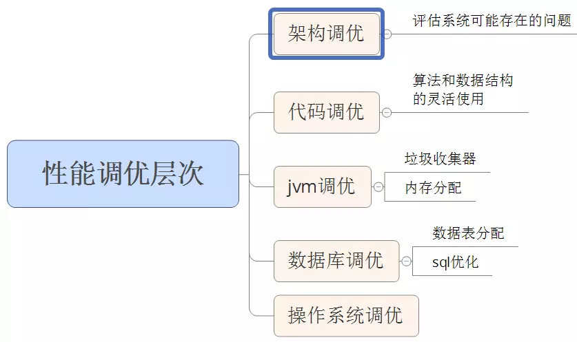
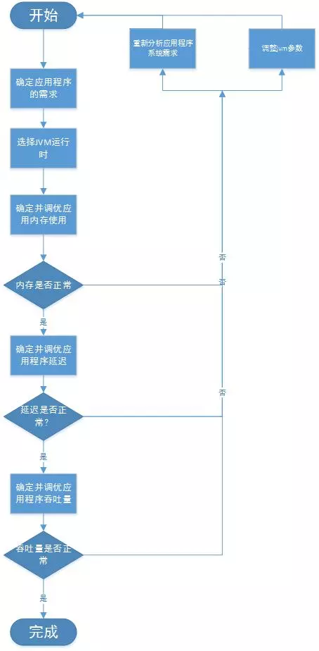

# 性能调优的层次

为了提升系统性能，我们需要对系统的各个角度和层次来进行优化，以下是需要优化的几个层次。

# jvm性能调优

jvm调优主要是针对垃圾收集器的收集性能优化，令运行在虚拟机上的应用能够使用更少的内存以及延迟获取更大的吞吐量。当然这里的最少是最优的选择，而不是越少越好。

## 性能定义

**吞吐量**：

​		重要指标之一，是指不考虑垃圾收集引起的停顿时间或内存消耗，垃圾收集器能支撑应用达到的最高性能指标。

**延迟**：

​		其度量标准是缩短由于垃圾啊收集引起的停顿时间或者完全消除因垃圾收集所引起的停顿，避免应用运行时发生抖动。

**内存占用**：

​		垃圾收集器流畅运行所需要 的内存数量。

注意：这三个属性中，其中一个任何一个属性性能的提高，几乎都是以另外一个或者两个属性性能的损失作代价，不可兼得，具体某一个属性或者两个属性的性能对应用来说比较重要，要基于应用的业务需求来确定。

## 调优原则

**`Minor GC`回收原则：**

​		每次`minor GC` 都要尽可能多的收集垃圾对象。以减少应用程序发生`Full GC`的频率。

**`GC`内存最大化原则：**

​		处理吞吐量和延迟问题时候，垃圾处理器能使用的内存越大，垃圾收集的效果越好，应用程序也会越来越流畅。

**`GC`调优3选2原则:** 

​		在性能属性里面，吞吐量、延迟、内存占用，我们只能选择其中两个进行调优，不可三者兼得。

## 调优流程

调优一般是从满足程序的内存使用需求开始的，之后是时间延迟的要求，最后才是吞吐量的要求，要基于这个步骤来不断优化，每一个步骤都是进行下一步的基础，不可逆行之。

### 内存调优

根据监测工具，`GC`日志等方式，确定程序在稳定运行阶段，此时查看应用程序所需要的新生代、老年代和永久代内存大小。

### 延迟调优

在调优之前，我们需要知道系统的延迟需求是那些，以及对应的延迟可调优指标是那些。

> - 应用程序可接受的平均停滞时间: 此时间与测量的Minor GC持续时间进行比较。
> - 可接受的Minor GC频率：Minor GC的频率与可容忍的值进行比较。
> - 可接受的最大停顿时间: 最大停顿时间与最差情况下FullGC的持续时间进行比较。
> - 可接受的最大停顿发生的频率：基本就是FullGC的频率。

以上中，平均停滞时间和最大停顿时间，对用户体验最为重要，可以多关注。

基于以上的要求，我们需要统计以下数据:

> - MinorGC的持续时间；
> - 统计MinorGC的次数；
> - FullGC的最差持续时间；
> - 最差情况下，FullGC的频率；

#### 优化新生代的大小

比如在`gc`日志中，如果`Minor GC`的平均持续时间=0.069秒，`Minor GC` 的频率为0.389秒一次。此时如果，我们系统的设置的平均停滞时间为50ms，当前的69ms明显是太长了，就需要调整。

我们知道**新生代空间越大，Minor GC的GC时间越长，频率越低。**

- 如果想减少其持续时长，就需要减少其空间大小。

- 如果想减小其频率，就需要加大其空间大小。

注意：为了降低改变新生代的大小对其他区域的最小影响。在改变新生代空间大小的时候，尽量保持老年代空间的大小。

#### 优化老年代的大小

### 吞吐量调优