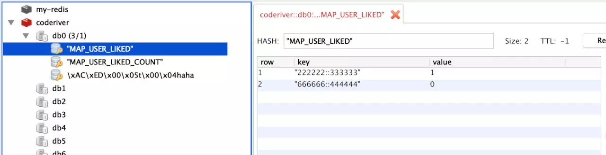

# 好友关系功能

需求：用户A添加用户B为好友后，A和B即互为好友。


实现：

分为两张表，用户表和用户关系表

```sql
CREATE TABLE `users` (
    `id` int(11) unsigned NOT NULL AUTO_INCREMENT,
    `user_id` int(11) DEFAULT NULL,
    `name` varchar(255) DEFAULT NULL,
    PRIMARY KEY (`id`),
    UNIQUE KEY `user_id` (`user_id`)
) ENGINE=InnoDB AUTO_INCREMENT=3 DEFAULT CHARSET=utf8;
```


## 方案1

```sql
CREATE TABLE `user_relation` (
    `id` int(11) unsigned NOT NULL AUTO_INCREMENT,
    `user_id` int(11) DEFAULT NULL,
    `friend_id` int(11) DEFAULT NULL,
    PRIMARY KEY (`id`),
    UNIQUE KEY `user_id` (`user_id`,`friend_id`)
) ENGINE=InnoDB AUTO_INCREMENT=2 DEFAULT CHARSET=utf8;
```


用户A添加用户B为好友后，即在数据库中添加两条记录，通过唯一性约束来保证朋友关系不重复。

```text
user_id: 10001, friend_id: 10002
user_id: 10002, friend_id: 10001
```


获取用户A的朋友:

```sql
SELECT friend_id FROM user_relation WHERE user_id = 10001;
```


### 优点

存取逻辑比较简单

### 缺点

user_relation 表中存在冗余的数据


## 方案2

```sql
CREATE TABLE `user_relation` (
    `id` int(11) unsigned NOT NULL AUTO_INCREMENT,
    `user_id` int(11) DEFAULT NULL,
    `friend_id` int(11) DEFAULT NULL,
    `sorted_key` varchar(255) DEFAULT NULL,
    PRIMARY KEY (`id`),
    UNIQUE KEY `user_id` (`user_id`,`friend_id`),
    KEY `sorted_uniq_key` (`sorted_key`)
) ENGINE=InnoDB AUTO_INCREMENT=3 DEFAULT CHARSET=utf8;
```


每次用户A添加用户B为好友后，即在数据库中添加一条记录：

```text
user_id: 10001, friend_id: 10002, sorted_key: 10001-10002
```

其中 sorted_key 是 (user_id, friend_id) 升序排列后的拼接，通过这个值来做数据库唯一性校验。


获取用户A的好友

```sql
SELECT friend_id FROM user_relation WHERE user_id = 10001;
SELECT user_id FROM user_relation WHERE friend_id = 10001;

或

SELECT friend_id as user_id FROM user_relation WHERE user_id = 10001  
UNION
SELECT user_id FROM user_relation WHERE friend_id = 10001;
```


### 优点

user_relation 表中没有冗余的数据


### 缺点

获取逻辑比较复杂。唯一性校验也要多占一个字段的空间。


# 用户关注关系

两个人之间有这么几种关系.

1. A关注了B.
2. B关注了A.
3. A和B互相关注.
4. 毫无关系.


针对这些关系有常见的以下几个需求:

1. 查看某个用户的关注列表，即：”我“关注了谁
2. 查看某个用户的粉丝列表，即：”谁“关注了我
3. 查看某个人的互相关注列表,(好友圈的定义就是和你互相关注的人的微博会在这里出现）
4. 判断两个用户之间的关系.(在微博中,你查看别人主页时左下角的集中状态)
5. 获取两个人的共同关注.(微博中查看别人的关注列表时会有这个栏目,展示你和他共同关注的一些人).

设计的结构要实现以上的需求.


## 关系型数据库实现

| id   | from_uid | to_uid | ts    |
| :--- | :------- | :----- | :---- |
| 1    | A        | B      | time1 |
| 2    | B        | C      | time2 |
| 3    | A        | C      | time3 |


- 查看某个用户的关注列表.

```sql
select to_uid from follow where from_uid = 'A' order by ts
```

可以拿到用户A的关注列表,按照时间关注的顺序进行排序.


- 查看用户的粉丝列表

```sql
select from_uid from follow where to_uid = 'C' order by ts
```

可以拿到用户C的粉丝列表,根据关注的时间进行排序.


- 查看某个用户的互相关注列表

上面两个语句的交集，在`mysql`中: 

```sql
select to_uid from follow where to_uid in (select from_uid from follow where to_uid= 'A')  and from_uid = 'A'
```

进行了一次子查询且语句中有in,当数据量稍大的时候查询效果太差劲了.


- 获取两个人的共同关注

```sql
select to_uid from follow where from_uid = 'A' and to_uid in (select to_uid from follow where from_uid = 'B')
```


### 存在的问题

1. 查询的复杂性

2. 当数据量直线上升,使用`mysql`就必须要进行分库分表,这时候分表的策略很难定

   > 使用`follow`表的`id`来进行分表,那么意味着对每一个用户的关注或者粉丝查询都需要从多个表查到数据再进行聚合,这个操作不科学.
   >
   > 使用`uid`进行分表,就意味着有数据冗余,且没有办法避免热点数据问题,比如微博很多大v有几千万的粉丝,这些数据放在一张表中仍然很拥挤,而且这样分表,表的数量会很多.


## Redis的hash实现

使用hash数据结构,每个用户对应两个hash表,一个存储关注,一个存储粉丝.


对应上述mysql数据表格中的三条数据,存储在redis中表现为:

```properties
follow_A:
	B:ds1
	C:ds2
fan_A:
	null;

follow_B:
	C:ds3
fan_B:
	A:ds1

follow_C:
	null;
fans_C:
	B:ds3
	A:ds2
```

这样在在获取列表的时候,可以直接使用`hgetall`来获取,十分简单.但是仍要注意一下问题,`hgetall`是一个时间复杂度为`O(n)`的命令,当用户的关注列表或者粉丝列表太大的时候,仍然有超时的可能.


```java
// 代码来实现以下上面那五个需求
public class Follow {

    static String FOLLOW_PREFIX = "follow_";
    static String FANS_PREFIX = "fans_";

    static Jedis jedis = new Jedis();

    public Set<String> getFollows(String id) {
        return jedis.hgetAll(FOLLOW_PREFIX + id).keySet();
    }

    public Set<String> getfans(String id) {
        return jedis.hgetAll(FANS_PREFIX + id).keySet();
    }

    // 获取互相关注的列表
    public Set<String> getTwoFollow(String id) {
        Set<String> follows = getFollows(id);
        Set<String> fans = getfans(id);
        follows.retainAll(fans);
        return follows;
    }

    // 判断from - > to 的关系
    public RelationShip getRelationShip(String from, String to) {
        boolean isFollow = getFollows(from).contains(to);
        boolean isFans = getfans(from).contains(to);

        if (isFollow) {
            if (isFans) {
                return RelationShip.TWOFOLLOW;
            }
            return RelationShip.FOLLOW;
        }
        return isFans ? RelationShip.FANS : RelationShip.NOONE;
    }

    // 获取共同关注列表
    public Set<String> publicFollow(String id1, String id2) {
        Set<String> id1Follow = getFollows(id1);
        Set<String> id2Follow = getfans(id2);

        id1Follow.retainAll(id2Follow);

        return id1Follow;
    }


    public enum RelationShip {
        FOLLOW, FANS, TWOFOLLOW, NOONE;
    }
    
}
```


## Redis的sorted set 实现

将关注或者粉丝的id放在`sorted set`中,将其关注时间作为分值,这样也可以获取到一个有序的关注列表.

```properties
follow_A:
        B-ds1
        C-ds2
fans_A: null

follow_B:
        C-ds3
fans_B:
        A-ds1

follow_C:null;
fan_C: 
        B-ds3
        A-ds2
```


```java
public class Follow {

    static String FOLLOW_PREFIX = "follow_";
    static String FANS_PREFIX = "fans_";

    static Jedis jedis = new Jedis();

    public Set<String> getFollows(String id) {
        return jedis.zrange(FOLLOW_PREFIX + id, 0, -1);
    }

    public Set<String> getfans(String id) {
        return jedis.zrange(FANS_PREFIX + id, 0, -1);
    }

    // 获取互相关注的列表
    public Set<String> getTwoFollow(String id) {
        Set<String> follows = getFollows(id);
        Set<String> fans = getfans(id);
        follows.retainAll(fans);
        return follows;
    }

    // 判断from - > to 的关系
    public Followtest.RelationShip getRelationShip(String from, String to) {
        boolean isFollow = getFollows(from).contains(to);
        boolean isFans = getfans(from).contains(to);

        if (isFollow) {
            if (isFans) {
                return Followtest.RelationShip.TWOFOLLOW;
            }
            return Followtest.RelationShip.FOLLOW;
        }
        return isFans ? Followtest.RelationShip.FANS : Followtest.RelationShip.NOONE;
    }

    // 获取共同关注列表
    public Set<String> publicFollow(String id1, String id2) {
        Set<String> id1Follow = getFollows(id1);
        Set<String> id2Follow = getfans(id2);

        id1Follow.retainAll(id2Follow);

        return id1Follow;
    }


    public enum RelationShip {
        FOLLOW, FANS, TWOFOLLOW, NOONE;
    }
}
```

主要是在获取列表的时候由`hgetall`转而使用了`zrange`.

在获取某两个列表的交集的时候,可以直接使用`ZINTERSTORE`,这个命令会将指定的集合的交集存在一个新的集合中,然后可以获取结果集合的所有元素.


## 总结

1. 使用mysql的话在数据量较小的时候勉强可以,在数据量逐渐增大,mysql的分库分表方案将很难抉择.
2. 使用Redis的hash结构来存储,需要在查询时`hgetall`之前还要加一层缓存,否则`hgetall`会有一些局部超时.
3. 使用Redis的sorted-set结构,个人觉得目前是比较好的,因为sorted-set可以直接获取交集,且可以使用`zscan`命令来逐页获取数据,比较契合大部分的使用场景.


# 点赞模块设计

参考链接：https://juejin.im/post/5bdc257e6fb9a049ba410098

https://github.com/cachecats/coderiver

点赞、取消点赞是高频次的操作，若每次都读写数据库，大量的操作会影响数据库性能，所以需要做缓存。

用户发起点赞、取消点赞后先存入 Redis 中，再每隔一段时间从 Redis 读取点赞数据写入数据库中做持久化存储。


## 点赞数据在 Redis 中的存储

用 Redis 存储两种数据，一种是记录点赞人、被点赞人、点赞状态的数据，另一种是每个用户被点赞了多少次，做个简单的计数。


由于需要记录点赞人和被点赞人，还有点赞状态（点赞、取消点赞），还要固定时间间隔取出 Redis 中所有点赞数据，分析了下 Redis 数据格式中 `Hash` 最合适。


设定点赞人的 id 为 `likedPostId`，被点赞人的 id 为 `likedUserId` ，点赞时状态为 1，取消点赞状态为 0。将点赞人 id 和被点赞人 id 作为键，两个 id 中间用 `::` 隔开，点赞状态作为值。

```properties
# 如果用户点赞，存储的键为
likedUserId::likedPostId, 1

# 取消点赞，存储的键为
likedUserId::likedPostId, 0
```

取数据时把键用 `::` 切开就得到了两个id





`MAP_USER_LIKED`: 存储 `likedUserId::likedPostId, 1`

`MAP_USER_LIKED_COUNT`: 存储 `likedUserId, 点赞个数`


## 点赞数据在 mysql 中的存储

数据库表中至少要包含三个字段：被点赞用户id，点赞用户id，点赞状态。再加上主键id，创建时间，修改时间


```sql
create table `user_like`(
    `id` int not null auto_increment,
    `liked_user_id` varchar(32) not null comment '被点赞的用户id',
    `liked_post_id` varchar(32) not null comment '点赞的用户id',
    `status` tinyint(1) default '1' comment '点赞状态，0取消，1点赞',
    `create_time` timestamp not null default current_timestamp comment '创建时间',
    `update_time` timestamp not null default current_timestamp on update current_timestamp comment '修改时间',
    primary key(`id`),
    INDEX `liked_user_id`(`liked_user_id`),
    INDEX `liked_post_id`(`liked_post_id`)
) comment '用户点赞表';
```


## 定时任务持久化存储到mysql

定时任务 `Quartz` 


```xml
<dependency>
    <groupId>org.springframework.boot</groupId>
    <artifactId>spring-boot-starter-quartz</artifactId>
</dependency>
```


```java
// 编写配置文件
package com.solo.coderiver.user.config;

import com.solo.coderiver.user.task.LikeTask;
import org.quartz.*;
import org.springframework.context.annotation.Bean;
import org.springframework.context.annotation.Configuration;

@Configuration
public class QuartzConfig {

    private static final String LIKE_TASK_IDENTITY = "LikeTaskQuartz";

    @Bean
    public JobDetail quartzDetail(){
        return JobBuilder.newJob(LikeTask.class).withIdentity(LIKE_TASK_IDENTITY).storeDurably().build();
    }

    @Bean
    public Trigger quartzTrigger(){
        SimpleScheduleBuilder scheduleBuilder = SimpleScheduleBuilder.simpleSchedule()
//                .withIntervalInSeconds(10)  //设置时间周期单位秒
                .withIntervalInHours(2)  //两个小时执行一次
                .repeatForever();
        return TriggerBuilder.newTrigger().forJob(quartzDetail())
                .withIdentity(LIKE_TASK_IDENTITY)
                .withSchedule(scheduleBuilder)
                .build();
    }
}
```


```java
// 编写执行任务的类继承自 QuartzJobBean
package com.solo.coderiver.user.task;

import com.solo.coderiver.user.service.LikedService;
import lombok.extern.slf4j.Slf4j;
import org.apache.commons.lang.time.DateUtils;
import org.quartz.JobExecutionContext;
import org.quartz.JobExecutionException;
import org.springframework.beans.factory.annotation.Autowired;
import org.springframework.scheduling.quartz.QuartzJobBean;

import java.text.SimpleDateFormat;
import java.util.Date;

/**
 * 点赞的定时任务
 */
@Slf4j
public class LikeTask extends QuartzJobBean {

    @Autowired
    LikedService likedService;

    private SimpleDateFormat sdf = new SimpleDateFormat("yyyy-MM-dd HH:mm:ss");

    @Override
    protected void executeInternal(JobExecutionContext jobExecutionContext) throws JobExecutionException {

        log.info("LikeTask-------- {}", sdf.format(new Date()));

        //将 Redis 里的点赞信息同步到数据库里
        likedService.transLikedFromRedis2DB();
        likedService.transLikedCountFromRedis2DB();
    }
}
```


# 评论模块设计

参考链接：https://juejin.im/post/5be2c213e51d453dfe02d406

评论的主体，即：被评论的，可以是人、项目、资源等，所以要有一个 `type` 字段标明这条评论的类型。

以项目为例，一个项目下面可能会有多条评论。每条评论其实分为两种，一种是直接对项目的评论，称之为父评论吧；另一种是对已有评论的评论，称为子评论。

> 每个项目可能有多个父评论，每个父评论可能有多个子评论。项目与父评论，父评论与子评论，都是一对多的关系。


综上，数据库应该分为两个表，一个存储父评论，一个存储子评论。

再看都需要什么字段，先分析主评论：必须要有的是项目id，得知道是对谁评论的，还有评论者的头像、昵称、id，评论时间、内容、点赞个数等。

子评论跟父评论的字段差不多，只是不要点赞数量。


## 数据库设计

评论主表（父评论表）

```sql
CREATE TABLE `comments_info` (
    `id` varchar(32) NOT NULL COMMENT '评论主键id',
    `type` tinyint(1) NOT NULL COMMENT '评论类型：对人评论，对项目评论，对资源评论',
    `owner_id` varchar(32) NOT NULL COMMENT '被评论者id，可以是人、项目、资源',
    `from_id` varchar(32) NOT NULL COMMENT '评论者id',
    `from_name` varchar(32) NOT NULL COMMENT '评论者名字',
    `from_avatar` varchar(512) DEFAULT '' COMMENT '评论者头像',
    `like_num` int(11) DEFAULT '0' COMMENT '点赞的数量',
    `content` varchar(512) DEFAULT NULL COMMENT '评论内容',
    `create_time` timestamp NOT NULL DEFAULT CURRENT_TIMESTAMP COMMENT '创建时间',
    `update_time` timestamp NOT NULL DEFAULT CURRENT_TIMESTAMP ON UPDATE CURRENT_TIMESTAMP COMMENT '修改时间',
    PRIMARY KEY (`id`),
    KEY `owner_id` (`owner_id`)
) ENGINE=InnoDB DEFAULT CHARSET=utf8mb4 COMMENT='评论主表';
```


评论回复表（子评论表）

```sql
CREATE TABLE `comments_reply` (
    `id` int(11) NOT NULL AUTO_INCREMENT,
    `comment_id` varchar(32) NOT NULL COMMENT '评论主表id',
    `from_id` varchar(32) NOT NULL COMMENT '评论者id',
    `from_name` varchar(32) NOT NULL COMMENT '评论者名字',
    `from_avatar` varchar(512) DEFAULT '' COMMENT '评论者头像',
    `to_id` varchar(32) NOT NULL COMMENT '被评论者id',
    `to_name` varchar(32) NOT NULL COMMENT '被评论者名字',
    `to_avatar` varchar(512) DEFAULT '' COMMENT '被评论者头像',
    `content` varchar(512) DEFAULT NULL COMMENT '评论内容',
    `create_time` timestamp NOT NULL DEFAULT CURRENT_TIMESTAMP COMMENT '创建时间',
    `update_time` timestamp NOT NULL DEFAULT CURRENT_TIMESTAMP ON UPDATE CURRENT_TIMESTAMP COMMENT '修改时间',
    PRIMARY KEY (`id`),
    KEY `comment_id` (`comment_id`)
) ENGINE=InnoDB AUTO_INCREMENT=4 DEFAULT CHARSET=utf8mb4 COMMENT='评论回复表';
```


# 秒杀系统

1）尽量将请求拦截在系统上游 

2）读多写少的常用多使用缓存


