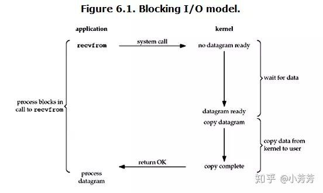
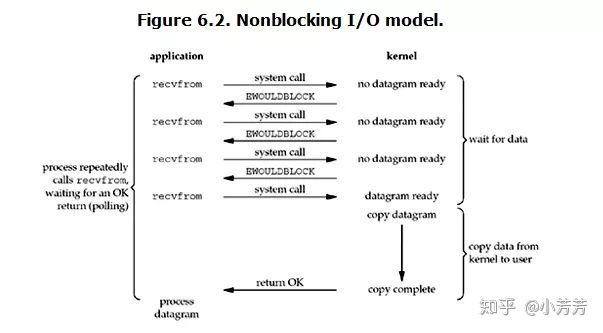
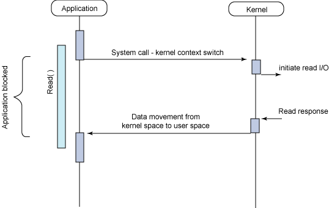
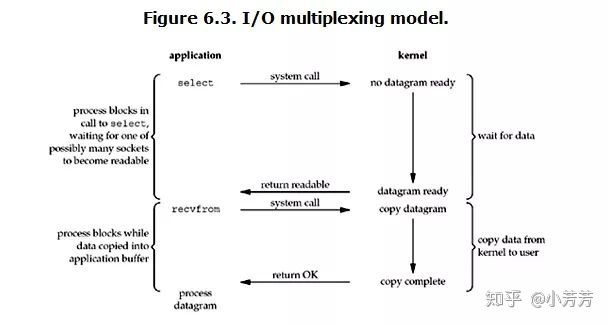
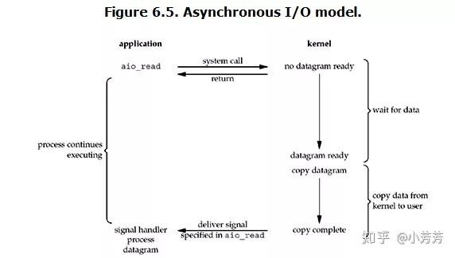
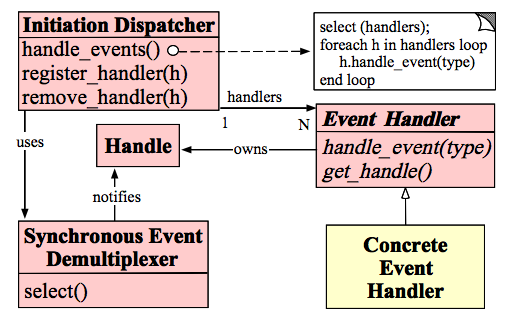
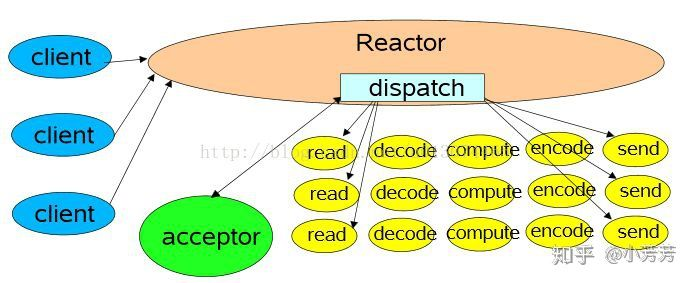
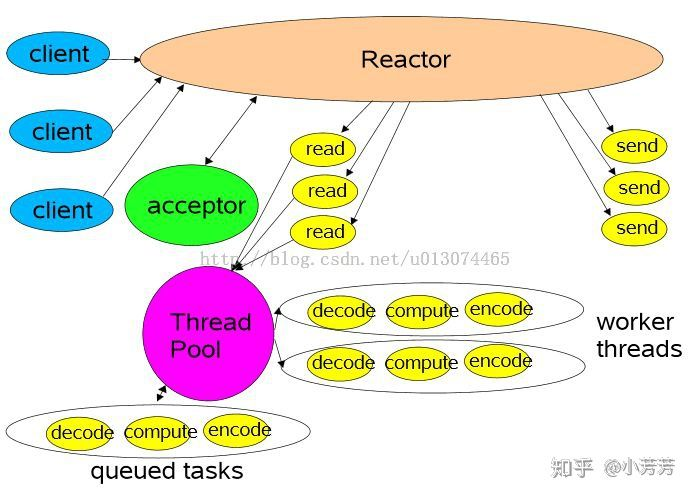
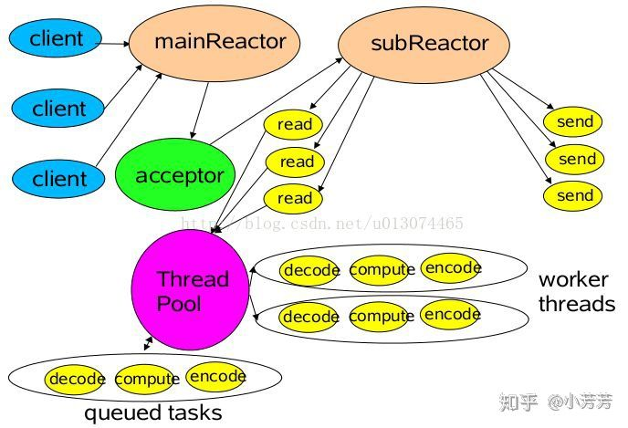

# I/O 模型


**一次 I/O 过程**

对于一次 Network I/O (以 read 举例)，它会涉及到两个系统对象，一个是调用这个 I/O 的进程或线程，另一个就是系统内核 (kernel)。当一个 read 操作发生时，会经历两个阶段（记住这两个阶段很重要，因为不同 I/O 模型的区别就是在两个阶段上各有不同的处理）

- 第一个阶段：等待数据准备 (Waiting for the data to be ready)；
- 第二个阶段：将数据从内核拷贝到进程中 (Copying the data from the kernel to the process)；


## 同步阻塞 I/O

在 Linux 中，默认情况下所有的 Socket 都是 blocking 的，也就是阻塞的。




当用户进程调用了 recvfrom 这个系统调用, 这次 I/O 调用经历如下 2 个阶段:

1. 准备数据： 对于网络请求来说，很多时候数据在一开始还没有到达（比如，还没有收到一个完整的 UDP 包），这个时候 kernel 就要等待足够的数据到来。而在用户进程这边，整个进程会被阻塞。
2. 数据返回：kernel 一但等到数据准备好了，它就会将数据从 kernel 中拷贝到用户内存，然后 kernel 返回结果，用户进程才解除 block 的状态，重新运行起来。


## 同步非阻塞 I/O

Linux 下，可以通过设置 socket 使其变为 non-blocking，也就是非阻塞。






当用户进程发出 read 操作具体过程分为如下 3 个过程：

1. 开始准备数据：如果 Kernel 中的数据还没有准备好，那么它并不会 block 用户进程，而是立刻返回一个 error。
2. 数据准备中： 从用户进程角度讲，它发起一个read操作后，并不需要等待，而是马上就得到了一个结果。用户进程判断结果是一个 error 时，它就知道数据还没有准备好，于是它可以再次发送 read 操作（重复轮训）。
3. 一旦 kernel 中的数据准备好了，并且又再次收到了用户进程的 system call，那么它马上就将数据拷贝到了用户内存，然后返回。


## 异步阻塞 I/O(I/O multiplexing)

这种 I/O 方式也可称为 event driven I/O。Linux select/epoll 的好处就在于单个 process 就可以同时处理多个网络连接的 I/O。它的基本原理就是 select/epoll 会不断的轮询所负责的所有 socket，当某个 socket 有数据到达了，就通知用户进程。




1. 整个进程会被 block，与此同时kernel 会 “监视” 所有 select 负责的 socket，当任何一个 socket 中的数据准备好了，select 就会返回。
2. 户进程再调用 read 操作，将数据从 kernel 拷贝到用户进程。这时和 blocking I/O 的图其实并没有太大的不同，事实上，还更差一些。因为这里需要使用两个 system call (select 和 recvfrom)，而 blocking I/O 只调用了一个 system call (recvfrom)。
3. 在 I/O multiplexing Model 中，实际中，对于每一个 socket，一般都设置成为 non-blocking，但是，如上图所示，整个用户的 process 其实是一直被 block 的。只不过 process 是被 select 这个函数 block，而不是被 socket I/O 给 block。


## 异步非阻塞 I/O(AIO)

Linux 下的 asynchronous I/O，即异步 I/O（需要高版本系统支持）。




当用户进程发出 read 操作具体过程：

1. 用户进程发起 read 操作之后，并不需要等待，而是马上就得到了一个结果，立刻就可以开始去做其它的事。
2. 从 kernel 的角度，当它收到一个 asynchronous read 之后，首先它会立刻返回，所以不会对用户进程产生任何 block。然后，kernel 会等待数据准备完成，然后将数据拷贝到用户内存，当这一切都完成之后，kernel会给用户进程发送一个 signal，告诉它 read 操作完成了。


**总结**

- Blocking I/O 的特点就是在 I/O 执行的两个阶段都被 block 了。
- Non-blocking I/O 特点是如果 kernel 数据没准备好不需要阻塞。
- I/O multiplexing 的优势在于它用 select 可以同时处理多个 connection。（如果处理的连接数不是很高的话，使用 select/epoll 的 web server 不一定比使用 multi-threading + blocking I/O 的 web server 性能更好，可能延迟还更大。select/epoll 的优势并不是对于单个连接能处理得更快，而是在于能处理更多的连接。）
- Asynchronous IO 的特点在于整个调用过程客户端没有任何 block 状态，但是需要高版本的系统支持。


# Reactor 线程模型




**构成**
`Handles` ：

表示操作系统管理的资源，我们可以理解为fd。


`Synchronous Event Demultiplexer` ：

同步事件分离器，阻塞等待Handles中的事件发生。


`Initiation Dispatcher` ：

初始分派器，作用为添加Event handler（事件处理器）、删除Event handler以及分派事件给Event handler。也就是说，Synchronous Event Demultiplexer负责等待新事件发生，事件发生时通知Initiation Dispatcher，然后Initiation Dispatcher调用event handler处理事件。


`Event Handler` ：

事件处理器的接口


`Concrete Event Handler` ：

事件处理器的实际实现，而且绑定了一个Handle。因为在实际情况中，我们往往不止一种事件处理器，因此这里将事件处理器接口和实现分开，与C++、Java这些高级语言中的多态类似。


**模块交互**
1）我们注册Concrete Event Handler到Initiation Dispatcher中。

2）Initiation Dispatcher调用每个Event Handler的get_handle接口获取其绑定的Handle。

3）Initiation Dispatcher调用handle_events开始事件处理循环。在这里，Initiation Dispatcher会将步骤2获取的所有Handle都收集起来，使用Synchronous Event Demultiplexer来等待这些Handle的事件发生。

4）当某个（或某几个）Handle的事件发生时，Synchronous Event Demultiplexer通知Initiation Dispatcher。

5）Initiation Dispatcher根据发生事件的Handle找出所对应的Handler。

6）Initiation Dispatcher调用Handler的handle_event方法处理事件。


## Reactor 是什么

**Reactor 是一种处理模式。** Reactor 模式是处理并发 I/O 比较常见的一种模式，用于同步 I/O，中心思想是将所有要处理的IO事件注册到一个中心 I/O 多路复用器上，同时主线程/进程阻塞在多路复用器上；一旦有 I/O 事件到来或是准备就绪(文件描述符或 socket 可读、写)，多路复用器返回并将事先注册的相应 I/O 事件分发到对应的处理器中。

**Reactor 也是一种实现机制。** Reactor 利用事件驱动机制实现，和普通函数调用的不同之处在于：应用程序不是主动的调用某个 API 完成处理，而是恰恰相反，Reactor 逆置了事件处理流程，应用程序需要提供相应的接口并注册到 Reactor 上，如果相应的事件发生，Reactor 将主动调用应用程序注册的接口，这些接口又称为 “回调函数”。用 “好莱坞原则” 来形容 Reactor 再合适不过了：不要打电话给我们，我们会打电话通知你。


## 为什么要使用 Reactor

一般来说通过 I/O 复用，epoll 模式已经可以使服务器并发几十万连接的同时，维持极高 TPS，为什么还需要 Reactor 模式？原因是原生的 I/O 复用编程复杂性比较高。

一个个网络请求可能涉及到多个 I/O 请求，相比传统的单线程完整处理请求生命期的方法，I/O 复用在人的大脑思维中并不自然，因为，程序员编程中，处理请求 A 的时候，假定 A 请求必须经过多个 I/O 操作 A1-An（两次 IO 间可能间隔很长时间），每经过一次 I/O 操作，再调用 I/O 复用时，I/O 复用的调用返回里，非常可能不再有 A，而是返回了请求 B。即请求 A 会经常被请求 B 打断，处理请求 B 时，又被 C 打断。这种思维下，编程容易出错。


## Reactor使用

在Reactor模式中，包含如下角色

- **Reactor** 将I/O事件发派给对应的Handler
- **Acceptor** 处理客户端连接请求
- **Handlers** 执行非阻塞读/写


其中Reactor线程，负责多路分离套接字，有新连接到来触发connect 事件之后，交由Acceptor进行处理，有IO读写事件之后交给hanlder 处理。


Acceptor主要任务就是构建handler ，在获取到和client相关的SocketChannel之后 ，绑定到相应的hanlder上，对应的SocketChannel有读写事件之后，基于reacotor 分发,hanlder就可以处理了（所有的IO事件都绑定到selector上，由Reactor分发）。


### 单Reactor单线程模型





```java
public class NIOServer {
  
    private static final Logger LOGGER = LoggerFactory.getLogger(NIOServer.class);
  
    public static void main(String[] args) throws IOException {
    
        Selector selector = Selector.open();
        ServerSocketChannel serverSocketChannel = ServerSocketChannel.open();
    	serverSocketChannel.configureBlocking(false);
    	serverSocketChannel.bind(new InetSocketAddress(1234));
    	serverSocketChannel.register(selector, SelectionKey.OP_ACCEPT);
    	
        while (selector.select() > 0) {
            
      		Set<SelectionKey> keys = selector.selectedKeys();
      		Iterator<SelectionKey> iterator = keys.iterator();
      		
            while (iterator.hasNext()) {
        		
                SelectionKey key = iterator.next();
        		iterator.remove();
        		
                if (key.isAcceptable()) {
          			ServerSocketChannel acceptServerSocketChannel = (ServerSocketChannel) key.channel();
          			SocketChannel socketChannel = acceptServerSocketChannel.accept();
          			socketChannel.configureBlocking(false);
          			LOGGER.info("Accept request from {}", socketChannel.getRemoteAddress());
          			socketChannel.register(selector, SelectionKey.OP_READ);
        		} else if (key.isReadable()) {
          			SocketChannel socketChannel = (SocketChannel) key.channel();
          			ByteBuffer buffer = ByteBuffer.allocate(1024);
          			int count = socketChannel.read(buffer);
          			if (count <= 0) {
            			socketChannel.close();
            			key.cancel();
            			LOGGER.info("Received invalide data, close the connection");
            			continue;
          			}
          			LOGGER.info("Received message {}", new String(buffer.array()));
        		}
        		keys.remove(key);
      		}
    	}
  	}
}
```


多个Channel可以注册到同一个Selector对象上，实现了一个线程同时监控多个请求状态（Channel）。 同时注册时需要指定它所关注的事件，例如上示代码中socketServerChannel对象只注册了OP_ACCEPT事件， 而socketChannel对象只注册了OP_READ事件。

`selector.select()`是阻塞的，当有至少一个通道可用时该方法返回可用通道个数。同时该方法只捕获Channel注册时指定的所关注的事件。


### 单Reactor多线程模型





```java
import org.slf4j.Logger;
import org.slf4j.LoggerFactory;

import java.io.IOException;
import java.net.InetSocketAddress;
import java.nio.channels.SelectionKey;
import java.nio.channels.Selector;
import java.nio.channels.ServerSocketChannel;
import java.nio.channels.SocketChannel;
import java.util.Iterator;
import java.util.Set;

public class NIOServer {

    private static final Logger LOGGER = LoggerFactory.getLogger(NIOServer.class);

    public static void main(String[] args) throws IOException {
        
        Selector selector = Selector.open();
        ServerSocketChannel serverSocketChannel = ServerSocketChannel.open();
        serverSocketChannel.configureBlocking(false);
        serverSocketChannel.bind(new InetSocketAddress(1234));
        serverSocketChannel.register(selector, SelectionKey.OP_ACCEPT);

        while (true) {
            if(selector.selectNow() < 0) {
                continue;
            }
            Set<SelectionKey> keys = selector.selectedKeys();
            Iterator<SelectionKey> iterator = keys.iterator();
            while(iterator.hasNext()) {
                SelectionKey key = iterator.next();
                iterator.remove();
                if (key.isAcceptable()) {
                    ServerSocketChannel acceptServerSocketChannel = (ServerSocketChannel) key.channel();
                    SocketChannel socketChannel = acceptServerSocketChannel.accept();
                    socketChannel.configureBlocking(false);
                    LOGGER.info("Accept request from {}", socketChannel.getRemoteAddress());
                    SelectionKey readKey = socketChannel.register(selector, SelectionKey.OP_READ);
                    readKey.attach(new Processor());
                } else if (key.isReadable()) {
                    Processor processor = (Processor) key.attachment();
                    processor.process(key);
                }
            }
        }
    }
}

// 注册完SocketChannel的OP_READ事件后，可以对相应的SelectionKey 绑定一个对象（本例中绑定了一个Processor对象，该对象处理读请求），并且在获取到可读事件后，可以取出该对象。

// 具体的读请求处理在如下所示的Processor类中。该类中设置了一个静态的线程池处理所有请求。
// 而process方法并不直接处理I/O请求， 而是把该I/O操作提交给上述线程池去处理，这样就充分利用了
// 多线程的优势，同时将对新连接的处理和读/写操作的处理放在了不同的线程中， 读/写操作不再阻塞对新连接请求的处理。

import org.slf4j.Logger;
import org.slf4j.LoggerFactory;

import java.nio.ByteBuffer;
import java.nio.channels.SelectionKey;
import java.nio.channels.SocketChannel;
import java.util.concurrent.ExecutorService;
import java.util.concurrent.Executors;

public class Processor {

    private static final Logger LOGGER = LoggerFactory.getLogger(Processor.class);
    private static final ExecutorService service = Executors.newFixedThreadPool(16);

    public void process(SelectionKey selectionKey) {
        service.submit(() -> {
            ByteBuffer buffer = ByteBuffer.allocate(1024);
            SocketChannel socketChannel = (SocketChannel) selectionKey.channel();
            int count = socketChannel.read(buffer);
            if (count < 0) {
                socketChannel.close();
                selectionKey.cancel();
                LOGGER.info("{}\t Read ended", socketChannel);
                return null;
            } else if(count == 0) {
                return null;
            }
            LOGGER.info("{}\t Read message {}", socketChannel, new String(buffer.array()));
            return null;
        });
    }
}
```


### 多Reactor多线程模型





Netty中使用的Reactor模式，引入了多Reactor，也即一个主Reactor负责监控所有的连接请求，

多个子Reactor负责监控并处理读/写请求， 减轻了主Reactor的压力，降低了主Reactor压力太大而造成的延迟。

并且每个子Reactor分别属于一个独立的线程， 每个成功连接后的Channel的所有操作由同一个线程处理。

这样保证了同一请求的所有状态和上下文在同一个线程中， 避免了不必要的上下文切换，同时也方便了监控请求响应状态。


```java
import org.slf4j.Logger;
import org.slf4j.LoggerFactory;

import java.io.IOException;
import java.net.InetSocketAddress;
import java.nio.channels.SelectionKey;
import java.nio.channels.Selector;
import java.nio.channels.ServerSocketChannel;
import java.nio.channels.SocketChannel;
import java.util.Set;

public class NIOServer {

    private static final Logger LOGGER = LoggerFactory.getLogger(NIOServer.class);

    public static void main(String[] args) throws IOException {

        Selector selector = Selector.open();
        ServerSocketChannel serverSocketChannel = ServerSocketChannel.open();
        serverSocketChannel.configureBlocking(false);
        serverSocketChannel.bind(new InetSocketAddress(1234));
        serverSocketChannel.register(selector, SelectionKey.OP_ACCEPT);

        int coreNum = Runtime.getRuntime().availableProcessors();
        Processor[] processors = new Processor[coreNum];

        for (int i = 0; i < processors.length; i++) {
            processors[i] = new Processor();
        }

        int index = 0;
        while (selector.select() > 0) {
            Set<SelectionKey> keys = selector.selectedKeys();
            for (SelectionKey key : keys) {
                keys.remove(key);
                if (key.isAcceptable()) {
                    ServerSocketChannel acceptServerSocketChannel = (ServerSocketChannel) key.channel();
                    SocketChannel socketChannel = acceptServerSocketChannel.accept();
                    socketChannel.configureBlocking(false);
                    LOGGER.info("Accept request from {}", socketChannel.getRemoteAddress());
                    Processor processor = processors[(int) ((index++) % coreNum)];
                    processor.addChannel(socketChannel);
                    processor.wakeup();
                }
            }
        }
    }
}

// Reactor个数是当前机器可用核数的两倍（与Netty默认的子Reactor个数一致）。 对于每个成功连接的SocketChannel，通过round robin的方式交给不同的子Reactor。

import org.slf4j.Logger;
import org.slf4j.LoggerFactory;

import java.io.IOException;
import java.nio.ByteBuffer;
import java.nio.channels.ClosedChannelException;
import java.nio.channels.SelectionKey;
import java.nio.channels.Selector;
import java.nio.channels.SocketChannel;
import java.nio.channels.spi.SelectorProvider;
import java.util.Iterator;
import java.util.Set;
import java.util.concurrent.ExecutorService;
import java.util.concurrent.Executors;

public class Processor {
    
    private static final Logger LOGGER = LoggerFactory.getLogger(Processor.class);
    private static final ExecutorService service =
        Executors.newFixedThreadPool(2 * Runtime.getRuntime().availableProcessors());
    
    private Selector selector;
    
    public Processor() throws IOException {
        this.selector = SelectorProvider.provider().openSelector();
        start();
    }
    public void addChannel(SocketChannel socketChannel) throws ClosedChannelException {
        socketChannel.register(this.selector, SelectionKey.OP_READ);
    }
    public void wakeup() {
        this.selector.wakeup();
    }
    public void start() {
        service.submit(() -> {
            while (true) {
                if (selector.select(500) <= 0) {
                    continue;
                }
                Set<SelectionKey> keys = selector.selectedKeys();
                Iterator<SelectionKey> iterator = keys.iterator();
                while (iterator.hasNext()) {
                    SelectionKey key = iterator.next();
                    iterator.remove();
                    if (key.isReadable()) {
                        ByteBuffer buffer = ByteBuffer.allocate(1024);
                        SocketChannel socketChannel = (SocketChannel) key.channel();
                        int count = socketChannel.read(buffer);
                        if (count < 0) {
                            socketChannel.close();
                            key.cancel();
                            LOGGER.info("{}\t Read ended", socketChannel);
                            continue;
                        } else if (count == 0) {
                            LOGGER.info("{}\t Message size is 0", socketChannel);
                            continue;
                        } else {
                            LOGGER.info("{}\t Read message {}", socketChannel, new String(buffer.array()));
                        }
                    }
                }
            }
        });
    }
}

// 在Processor中，同样创建了一个静态的线程池，且线程池的大小为机器核数的两倍。每个Processor实例均
// 包含一个Selector实例。 同时每次获取Processor实例时均提交一个任务到该线程池，并且该任务正常情况下
// 一直循环处理，不会停止。 而提交给该Processor的SocketChannel通过在其Selector注册事件，加入到相
// 应的任务中。 由此实现了每个子Reactor包含一个Selector对象，并由一个独立的线程处理。
```


## 总结

通过以上大概了解 Reactor 相关知识。最后做个总结一下使用 Reactor 模型的优缺点。

- 优点

- - 响应快，虽然 Reactor 本身依然是同步的，不必为单个同步时间所阻塞。
  - 编程相对简单，可以最大程度的避免复杂的多线程及同步问题，并且避免了多线程/进程的切换开销。
  - 可扩展性，通过并发编程的方式增加 Reactor 个数来充分利用 CPU 资源。
  - 可复用性，Reactor 框架本身与具体事件处理逻辑无关，具有很高的复用性。

- 缺点

- - 相比传统的简单模型，Reactor增加了一定的复杂性，因而有一定的门槛，调试相对复杂。
  - Reactor 模式需要底层的 Synchronous Event Demultiplexer 支持，例如 Java 中的 Selector，操作系统的 select 系统调用支持。
  - 单线程 Reactor 模式在 I/O 读写数据时还是在同一个线程中实现的，即使使用多 Reactor 机制的情况下，共享一个 Reactor 的 Channel 如果出现一个长时间的数据读写，会影响这个 Reactor 中其他 Channel 的相应时间，比如在大文件传输时，I/O 操作就会影响其他 Client 的相应时间，因而对这种操作，使用传统的 Thread-Per-Connection 或许是一个更好的选择，或则此时使用 Proactor 模式。


# Netty Reactor


# Proactor线程模型

Reactor模式里，操作系统只负责通知IO就绪，具体的IO操作（例如读写）仍然是要在业务进程里阻塞的去做的，而Proactor模式则更进一步，由操作系统将IO操作执行好（例如读取，会将数据直接读到内存buffer中），而handler只负责处理自己的逻辑，真正做到了IO与程序处理异步执行。所以我们一般又说Reactor是同步IO，Proactor是异步IO。