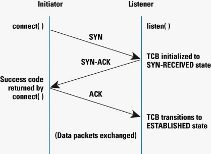

# socket多线程

## 示例

server.c

```c
#include <stdio.h>
#include <sys/socket.h>
#include <netinet/in.h>
#include <pthread.h>
#include <arpa/inet.h>
#include <stdlib.h>
#include <unistd.h>
#include <signal.h>
#include <string.h>
//一些准备工作
int sockfd;//socket描述符
char *IP = "127.0.0.1";//本机IP
short PORT = 10222;//端口
typedef struct sockaddr SA;//用作通信地址类型转换
struct client{//客户端信息结构
	char name[20];//昵称
	int fds;//socket描述符
};
#define max_client_size 1024
struct client c[max_client_size];//最多记录max_client_size个socket
int size;//数组下标，记录客户端个数

//1、初始化服务器的网络，创建socket
void init(){
	//创建socket
	sockfd = socket(PF_INET,SOCK_STREAM,0);
	if(sockfd == -1){
		perror("创建socket失败");
		exit(-1);
	}

	int yes = 1;
	if (setsockopt(sockfd, SOL_SOCKET, SO_REUSEADDR, &yes, sizeof(int)) == -1) 
	{
		perror("setsockopt");
		exit(1);
	}

	//准备网络通信地址
	struct sockaddr_in addr;
	addr.sin_family = PF_INET;//协议簇
	addr.sin_port = htons(PORT);//端口
	addr.sin_addr.s_addr = inet_addr(IP);//IP
	//绑定
	if(bind(sockfd,(SA*)&addr,sizeof(addr))==-1){
		perror("绑定失败");
		exit(-1);
	}
	//设置监听
	// if(listen(sockfd,max_client_size)==-1){//max_client_size表示同一时间能处理的最大连接请求
	if(listen(sockfd, 2)==-1){//max_client_size表示同一时间能处理的最大连接请求
		perror("设置监听失败");
		exit(-1);
	}
	//等待客户端连接(这部分放到service中)
}
//用于把消息分发给所有在聊天室内的客户端
void sendMsgToAll(char * msg){
	int i = 0;
	for(;i<size;i++){
		// printf("sendto%d\n",c[i].fds);//测试
		send(c[i].fds,msg,strlen(msg),0);
	}
}
//线程函数，用于通信服务
void* service_thread(void* p){
	int fd = *(int*)p;//拿到客户端的socket
	printf("pthread socket fd = %d\n",fd);//测试察看
	//记录客户端的socket
	c[size].fds = fd;
	size++;//数据索引值增1
	printf("当前连接客户端个数: %d\n", size);
	
	//正式收发聊天内容
	while(1){
		char buf[100] = {};
		if(recv(fd,buf,sizeof(buf),0)==0){
			//recv函数返回0表示对方断开连接
			printf("fd(%d) is quit\n",fd);//测试
			//处理结构体数组中的客户端信息，用数组
		//的最后一个元素信息，覆盖目标元素信息。
		//最后让size的值减一
			int i = 0;
			char name[20]={};
			for(i=0;i<size;i++){
				if(c[i].fds == fd){
					strcpy(name,c[i].name);//备份名字
					c[i].fds = c[size-1].fds;//
					strcpy(c[i].name,c[size-1].name);
				}
			}
			size--;
			close(fd);//关闭描述符
			return;//客户端退出，结束线程
		}
		// sendMsgToAll(buf);//如果接收成功，把内容发给其他人
		printf("server recv msg: %s\n", buf);
	}
}
//2、启动服务器的服务，接发消息
void service(){
	while(1){
		struct sockaddr_in fromaddr;//存储客户端通信地址的结构体
		socklen_t len = sizeof(fromaddr);
		int fd = accept(sockfd,(SA*)&fromaddr,&len);
		if(fd == -1){
			printf("accept 失败, continue");
			sleep(1);
			continue;//继续下一次循环，处理连接
		}
		//如果有客户端成功连接
		//开启一个线程，为该客户端进行通信服务
		pthread_t pid;
		pthread_create(&pid,0,service_thread,&fd);

	}
}
int main(){
	init();//搭建网络
	service();//启动服务
	return 0;
}
```


client.c

```c
#include <stdio.h>
#include <sys/socket.h>
#include <netinet/in.h>
#include <pthread.h>
#include <arpa/inet.h>
#include <stdlib.h>
#include <unistd.h>
#include <signal.h>
#include <string.h>
//一些准备工作
char *IP = "127.0.0.1";//本机IP
short PORT = 10222;//端口
typedef struct sockaddr SA;//用作通信地址类型转换
char name[20];//存储客户昵称
//分两部分，1启动客户端，连接服务器
int init(){
	int sockfd = socket(PF_INET,SOCK_STREAM,0);
	struct sockaddr_in addr;
	addr.sin_family = PF_INET;
	addr.sin_port = htons(PORT);
	addr.sin_addr.s_addr = inet_addr(IP);
	//客户端不需要绑定，需要用connect连接
	if(connect(sockfd,(SA*)&addr,sizeof(addr))==-1){
		perror("无法连接到服务器");
		printf("客户端启动失败\n");
		exit(-1);
	}
	return sockfd;
}
//2开始通信
void start(int sockfd){
	//该函数用于发送消息，发之前启动一个线程
	//该线程用于接受服务器发过来的消息
	pthread_t pid;
	void* send_pthread(void*);//函数声明
	pthread_create(&pid,0,send_pthread,&sockfd);
}
//收消息线程函数
void* send_pthread(void *p)
{
	int sockfd = *(int*)p;
	while(1){
		char msg[256] = {};
		sprintf(msg, "%d", sockfd);	
		send(sockfd, msg, strlen(msg), 0);
		usleep(10);
	}
	/*
	int sockfd = *(int*)p;
	while(1){
		char buf[100] = {};
		if(recv(sockfd,buf,sizeof(buf),0)<=0){
			return;//接收出错，结束线程
		}
		printf("客户端接收到消息: %s\n",buf);
	}
	*/
}
#define max_client_size 1024
int main(){
	int i = 0;
	for(; i < max_client_size; i++){
		int sockfd = init();//启动客户端
		start(sockfd);//通信
		usleep(10);
	}
	printf("%d 个客户端连接完毕", max_client_size);
	return 0;
}
```


# listen函数

```c
int listen(int sockfd, int backlog)
```


**backlog**

> TCP连接是一个过程，所以可能存在一种半连接的状态，有时由于同时尝试连接的用户过多，使得服务器进程无法快速地完成连接请求。如果这个情况出现了，服务器进程希望内核如何处理呢？内核会在自己的进程空间里维护一个队列以跟踪这些完成的连接但服务器进程还没有接手处理或正在进行的连接，这样的一个队列内核不可能让其任意大，所以必须有一个大小的上限。这个backlog告诉内核使用这个数值作为上限。





首先客户端发起syn包时，服务端会回复syn-ack包，此时链接处于未完成状态。服务端内存中会创建一个状态为**SYN_RCVD** 的连接,放入**未完成队列**，这个队列的大小可通过<font color=#dd0000>`/proc/sys/net/ipv4/tcp_max_syn_backlog`</font>设置。注意，当<font color=#dd0000>`/proc/sys/net/ipv4/tcp_syncookies`</font>生效(=1)时，没有逻辑上的该值的最大值，因此该设置无效。**未完成队列**中每个链接都维护有一个定时器，如果网络超时没有在时限内收到相应的ack，会重发syn-ack包，如果多次无效则停止，并从**未完成队列**中取消该连接。（次数在这里指定<font color=#dd0000>`/proc/sys/net/ipv4/tcp_synack_retries` </font>）


当客户端收到服务端的syn-ack包后，会发出ack包进行确认，服务端接收ack确认，此时tcp三次握手完成。服务端中该链接的状态会变成**ESTABLISHED**，同时该链接会移交到内存的**已完成队列**中。这个队列的最大容量就是通过**backlog**参数指定的。如果backlog的值比<font color=#dd0000>`/proc/sys/net/core/somaxconn`</font>中的还要大,则会被截断,文件中默认的值的大小是124。该队列会随着越来越多的客户端与服务器完成tcp三次握手而增长。直到达到backlog指定的上限。如果**已完成队列**满了，系统收到新的ack包时，协议栈的行为取决于 <font color=#dd0000>`/proc/sys/net/ipv4/tcp_abort_on_overflow`</font>的设置。如若为1，直接回rst包，结束链接，否则忽视ack包。


此时，服务端应用层一般可以使用accept函数（该函数是一个阻塞函数），从**已完成队列**中获取一个tcp链接并返回一个**套接字的文件描述符**，与此同时**已完成队列**会空出一个位置，从而内核协议栈又可以接受新的已完成三次握手的tcp链接。


附: linux进程文件描述符最大值

```shell
$ ulimit -SHn 102400 // 只对当前的session有效
```


永久修改：

```shell
$ vim /etc/security/limits.conf 

* hard nofile 65536
* soft nofile 65536
```


# select

## 函数介绍

```c
int select (int maxfdp1,fd_set *readset,fd_set * writeset,fd_set excpetset,const struct timeval *timeout);
```


参数：

select函数的第一个参数maxfdp1，是所有加入集合的句柄值的最大那个值还要加1。

`readset` `writeset`和`excpetset`指定我们要让内核测试读、写、异常条件所需的描述字。

```c
typedef struct fd_set {
		 u_int 		fd_count;                /* how many are SET? */
		 SOCKET   	fd_array[FD_SETSIZE];    /* an array of SOCKETs */
} fd_set;
```

系统提供了4个宏对描述符集进行操作：

```c
#include <sys/select.h>
#include <sys/time.h>
//设置文件描述符集fdset中对应于文件描述符fd的位
void FD_SET(int fd, fd_set *fdset);
//清除文件描述符集fdset中对应于文件描述符fd的位（设置为0)
void FD_CLR(int fd, fd_set *fdset);
//清除文件描述符集fdset中的所有位(既把所有位都设置为0)
void FD_ZERO(fd_set *fdset);
//在调用select后使用FD_ISSET来检测文件描述符集fdset中对应于文件描述符fd的位是否被设置。
void FD_ISSET(int fd, fd_set *fdset);
```

例如下面一段代码：

```c
fd_set readset;
FD_ZERO(&readset);
FD_SET(5, &readset);
FD_SET(33, &readset);
```

 再执行如下程序后：

```c
FD_CLR(5, &readset);//则文件描述符集readset对应于文件描述符6的相应位被置为0
```


通常，操作系统通过宏 `FD_SETSIZE` 来声明在一个进程中**select所能操作的文件描述符的最大数目**。
一般情况下被定义为1024.一个整数占4个字节，既32位，那么就是用包含32个元素的整数数组来表示文件描述符集。
我们可以在头文件中修改这个值来改变select使用的文件描述符集的大小，但是需要注意的是：**必须重新编译内核**才能使修改后的值有效。
如果我们对其中的个一不感兴趣的话，可以设置为空指针。如果我们把三个都设为空指针，就实现了一个比sleep更准确的定时器。


当我们调用函数时，指定我们关心的描述符集，当返回时，指示那些描述符已经准备好了。怎么样才算准备好呢！下面列出几种情况：
下列四个条件中的任何一个满足时，套接口准备好读：
（1） 套接口接收缓冲区中的数据字节数大于等于套接口接收缓冲区低潮限度的当前值。可以通过SO_REVILOAT来设置此低潮限度。
（2）连接的读这一半关闭，也就是接收了FIN的TCP连接，
（3）套接口是一个监听套接口且已完成的连接数为非0.
（4）有一个套接口错误等处理。
下列三个条件中的任一个满足时，套接口准备好写：
（1） 套接口发送缓冲区的可用空间字节娄大于等于套接口发送缓冲区低潮限度的当前值且或者（i）套接口已连接，或者（ii）套接口不要求连接。
（2）连接的写这一半关闭，对这样的套接口写操作将产生信号SIGPIEP。
（3）有一个套接口错误待处理。


## 示例

```c++
#include <stdio.h>
#include <stdlib.h>
#include <unistd.h>
#include <errno.h>
#include <string.h>
#include <sys/types.h>
#include <sys/socket.h>
#include <sys/stat.h>
#include <netinet/in.h>
#include <arpa/inet.h>

#define MAX_CONN_COUNT	2
#define	BUFFER_SIZE		1024
#define	MYPORT			8888

static int	g_cur_conn_count = 0;//当前连接数
int g_fd_accept[MAX_CONN_COUNT];//accept连接的fd

// 从count个fd中删除第num个fd
void delUnusedFd(int fd[], int count, int num)
{
	for(int i = num; i < count; i++)
	{
		fd[i] = fd[i + 1];
	}
}

int main(int argc, char * argv[])
{
	//socket
	int sockfd = socket(AF_INET, SOCK_STREAM, 0);
	if(-1 == sockfd)
	{
		printf("socket func error\n");
		return -1;
	}
	/*
	 需要设置socket属性为地址重用,否则在客户端不断开连接，
	 服务端断开连接再重启时，会出现bind地址失败的情况
	 */
	// set socket attribute
	socklen_t opt = 1;
	if(-1 == setsockopt(sockfd, SOL_SOCKET, SO_REUSEADDR, &opt, sizeof(socklen_t)))
	{
		printf("setsockopt func failed\n");
		perror("setsockopt");
		return -1;
	}
	//prepare address
	struct sockaddr_in addrSrv;
	addrSrv.sin_family = AF_INET;
	addrSrv.sin_port = htons(MYPORT);
	addrSrv.sin_addr.s_addr = INADDR_ANY;
	//bind
	if(-1 == bind(sockfd, (struct sockaddr *)&addrSrv, sizeof(addrSrv)))
	{
		printf("bind sockfd failed\n");
		perror("bind");
		printf("errno = %d\n", errno);
		return -1;
	}
	//listen
	//在进程正理一个一个连接请求的时候，可能还存在其它的连接请求。因为TCP连接是一个过程，所以可能存在一种半连接的状态，
	//有时由于同时尝试连接的用户过多，使得服务器进程无法快速地完成连接请求。如果这个情况出现了，服务器进程希望内核如何
	//处理呢？内核会在自己的进程空间里维护一个队列以跟踪这些完成的连接但服务器进程还没有接手处理或正在进行的连接，这样
	//的一个队列内核不可能让其任意大，所以必须有一个大小的上限。这个backlog告诉内核使用这个数值作为上限。
	//具体详见 https://blog.csdn.net/yangbodong22011/article/details/60399728
	if(-1 == listen(sockfd, MAX_CONN_COUNT))
	{
		printf("listen sockfd failed\n");
		return -1;
	}
	//prepare select
	fd_set rfds;
	int max_sockfd = sockfd;

	while(1)
	{
		/*
		每次循环开始，需要将监听socket加入到rfds
		*/
		FD_ZERO(&rfds);
		FD_SET(sockfd, &rfds);
		
		for(int i = 0; i < g_cur_conn_count; i++)
		{
			FD_SET(g_fd_accept[i], &rfds);
		}

		struct timeval tv = {20, 0};
		//select
		int ret = select(max_sockfd + 1, &rfds, NULL, NULL, &tv);
		if(-1 == ret)
		{
			printf("sockfd select error\n");
			break;
		}
		else if(0 == ret)
		{
			printf("select time out\n");
			continue;
		}
		else
		{
			//accept
			if(FD_ISSET(sockfd, &rfds))
			{
				struct sockaddr_in addrCli;
				socklen_t addrlen = sizeof(addrCli);

				int connfd = accept(sockfd, (struct sockaddr *)&addrCli, &addrlen);
				if(-1 == connfd)
				{
					printf("accept error\n");
					continue;
				}

				if(g_cur_conn_count < MAX_CONN_COUNT)
				{
					printf("new connfd is connect, connfd = %d\n", connfd);

					g_fd_accept[g_cur_conn_count++] = connfd;
					FD_SET(connfd, &rfds);

					if(connfd > max_sockfd)
					{
						max_sockfd = connfd;
					}
				}
				else
				{
					printf("current socket connect count is max, exit\n");
					send(connfd, "max connect count now, bye!", 28, 0);
					close(connfd);
					continue;
				}
			}
			else
			{
				for(int i = 0; i < g_cur_conn_count; i++)
				{
					//recv
					if(FD_ISSET(g_fd_accept[i], &rfds))
					{
						char buf[BUFFER_SIZE] = {0};
						size_t rc = recv(g_fd_accept[i], buf, BUFFER_SIZE, 0);
						if(rc < 0)
						{
							printf("recv func err, g_fd_accept[%d] failed\n", i);

							delUnusedFd(g_fd_accept, g_cur_conn_count, i);
							g_cur_conn_count--;

							FD_CLR(g_fd_accept[i], &rfds);
							close(g_fd_accept[i]);

							continue;
						}
						else if(0 == rc)//客户端断开连接
						{
							printf("recv return 0, client shutdown the connect\n");

							delUnusedFd(g_fd_accept, g_cur_conn_count, i);
							g_cur_conn_count--;

							FD_CLR(g_fd_accept[i], &rfds);
							close(g_fd_accept[i]);

							continue;
						}
						else
						{
							//send
							printf("recv data from fd = %d:%s\n", g_fd_accept[i], buf);
							send(g_fd_accept[i], buf, strlen(buf) + 1, 0);
						}
					}
				}
			}
		}
	}
	return 0;
}
```


## select优点

目前几乎在所有的平台上支持，其良好跨平台支持也是它的一个优点

## select缺点

1.每次调用 select()，都需要把 fd 集合从用户态拷贝到内核态，这个开销在 fd 很多时会很大，同时每次调用 select() 都需要在内核遍历传递进来的所有 fd，这个开销在 fd 很多时也很大。

2.单个进程能够监视的文件描述符的数量存在最大限制，在 Linux 上一般为 1024，可以通过修改宏定义甚至重新编译内核的方式提升这一限制，但是这样也会造成效率的降低

```c
#define __FD_SETSIZE    1024
```


# poll

select() 和 poll() 系统调用的本质一样，poll() 的机制与 select() 类似，与 select() 在本质上没有多大差别，

管理多个描述符也是进行轮询，根据描述符的状态进行处理，但是 poll() 没有最大文件描述符数量的限

制（但是数量过大后性能也是会下降）。poll() 和 select() 同样存在一个缺点就是，包含大量文件描述符的数组

被整体复制于用户态和内核的地址空间之间，而不论这些文件描述符是否就绪，它的开销随着文件描述符数量的增加而线性增大。


## 函数介绍

头文件：
#include <poll.h>  

函数体：
int poll(struct pollfd *fds, nfds_t nfds, int timeout);  

功能：
监视并等待多个文件描述符的属性变化

参数：

fds:指向一个结构体数组的第0个元素的指针，每个数组元素都是一个struct pollfd结构，用于指定测试某个给定的fd的条件


[csharp] view plain copy
struct pollfd{  
    int fd;         //文件描述符  
    short events;   //等待的事件  
    short revents;  //实际发生的事件  
};  

fd：每一个 pollfd 结构体指定了一个被监视的文件描述符，可以传递多个结构体，指示 poll() 监视多个文件描述符。

events：指定监测fd的事件（输入、输出、错误），每一个事件有多个取值，如下：


revents：revents 域是文件描述符的操作结果事件，内核在调用返回时设置这个域。events 域中请求的任何事件都可能在 revents 域中返回.

注意：每个结构体的 events 域是由用户来设置，告诉内核我们关注的是什么，而 revents 域是返回时内核设置的，以说明对该描述符发生了什么事件

nfds:用来指定第一个参数数组元素个数

timeout: 指定等待的毫秒数，无论 I/O 是否准备好，poll() 都会返回.


返回值：

成功时，poll() 返回结构体中 revents 域不为 0 的文件描述符个数；如果在超时前没有任何事件发生，poll()返回 0；


失败时，poll() 返回 -1，并设置 errno 为下列值之一：

EBADF：一个或多个结构体中指定的文件描述符无效。

EFAULT：fds 指针指向的地址超出进程的地址空间。

EINTR：请求的事件之前产生一个信号，调用可以重新发起。

EINVAL：nfds 参数超出 PLIMIT_NOFILE 值。

ENOMEM：可用内存不足，无法完成请求。


## 示例

```c++
// 用poll实现udp同时收发
#include <string.h>  
#include <stdio.h>  
#include <stdlib.h>  
#include <unistd.h>  
#include <sys/select.h>  
#include <sys/time.h>  
#include <sys/socket.h>  
#include <netinet/in.h>  
#include <arpa/inet.h>  
#include <poll.h>  

int main(int argc,char *argv[])  
{  
    int udpfd = 0;  
    int ret = 0;  
    struct pollfd fds[2];//监测文件描述结构体数组：2个  
    struct sockaddr_in saddr;  
    struct sockaddr_in caddr;  
  
    bzero(&saddr,sizeof(saddr));  
    saddr.sin_family = AF_INET;  
    saddr.sin_port   = htons(8000);  
    saddr.sin_addr.s_addr = htonl(INADDR_ANY);  
      
    bzero(&caddr,sizeof(caddr));  
    caddr.sin_family  = AF_INET;  
    caddr.sin_port    = htons(8000);  
      
    //创建套接字  
    if( (udpfd = socket(AF_INET,SOCK_DGRAM, 0)) < 0)  
    {  
        perror("socket error");  
        exit(-1);  
    }  
      
    //套接字端口绑字  
    if(bind(udpfd, (struct sockaddr*)&saddr, sizeof(saddr)) != 0)  
    {  
        perror("bind error");  
        close(udpfd);         
        exit(-1);  
    }  
  
    printf("input: \"sayto 192.168.220.X\" to sendmsg to somebody\033[32m\n");    
    fds[0].fd = 0;      //标准输入描述符  
    fds[1].fd = udpfd;  //udp描述符  
      
    fds[0].events = POLLIN; // 普通或优先级带数据可读    
    fds[1].events = POLLIN; // 普通或优先级带数据可读  
      
    while(1)  
    {     
        // 监视并等待多个文件（标准输入，udp套接字）描述符的属性变化（是否可读）    
        // 没有属性变化，这个函数会阻塞，直到有变化才往下执行，这里没有设置超时    
        ret = poll(fds, 2, -1);   
          
        write(1,"UdpQQ:",6);  
          
        if(ret == -1){ // 出错    
            perror("poll()");    
        }  
        else if(ret > 0){ // 准备就绪的文件描述符    
            char buf[100] = {0};    
            if( ( fds[0].revents & POLLIN ) ==  POLLIN ){ // 标准输入    
                  
                fgets(buf, sizeof(buf), stdin);  
                buf[strlen(buf) - 1] = '\0';  
                if(strncmp(buf, "sayto", 5) == 0)  
                {  
                    char ipbuf[16] = "";  
                    inet_pton(AF_INET, buf+6, &caddr.sin_addr);//给addr套接字地址再赋值.  
                    printf("\rsay to %s\n",inet_ntop(AF_INET,&caddr.sin_addr,ipbuf,sizeof(ipbuf)));  
                    continue;  
                }  
                else if(strcmp(buf, "exit")==0)  
                {  
                    close(udpfd);  
                    exit(0);  
                }  
                sendto(udpfd, buf, strlen(buf),0,(struct sockaddr*)&caddr, sizeof(caddr));    
                    
            }  
            else if( ( fds[1].revents & POLLIN ) ==  POLLIN ){ //udp套接字    
                struct sockaddr_in addr;  
                char ipbuf[INET_ADDRSTRLEN] = "";  
                socklen_t addrlen = sizeof(addr);  
                  
                bzero(&addr,sizeof(addr));  
                  
                recvfrom(udpfd, buf, 100, 0, (struct sockaddr*)&addr, &addrlen);  
                printf("\r\033[31m[%s]:\033[32m%s\n",inet_ntop(AF_INET,&addr.sin_addr,ipbuf,sizeof(ipbuf)),buf);    
            }    
                
        }  
        else if(0 == ret){ // 超时    
            printf("time out\n");    
        }    
    }  

    return 0;  
}
```


# epoll

相比于select，epoll最大的好处在于它不会随着监听fd数目的增长而降低效率。因为在内核中的select实现中，它是采用轮询来处理的，
轮询的fd数目越多，自然耗时越多。并且，在linux/posix_types.h头文件有这样的声明：
#define __FD_SETSIZE    1024
表示select最多同时监听1024个fd，当然，可以通过修改头文件再重编译内核来扩大这个数目，但这似乎并不治本。


## 函数介绍

```c
int epoll_create(int size);
```

创建一个epoll的句柄，size用来告诉内核这个监听的数目一共有多大。这个参数不同于select()中的第一个参数，给出最大监听的fd+1的值。

**注意：**当创建好epoll句柄后，它就会占用一个fd值，在linux下如果查看/proc/进程id/fd/，是能够看到这个fd的，所以在使用完epoll后，必须调用close()关闭，否则可能导致fd被耗尽。


```c
int epoll_ctl(int epfd, int op, int fd, struct epoll_event *event);
```

**epoll的事件注册函数，它不同于select()是在监听事件时告诉内核要监听什么类型的事件，而是在这里先注册要监听的事件类型。**

第一个参数是epoll_create()的返回值，

第二个参数表示操作选项，用三个宏来表示：

```c
EPOLL_CTL_ADD：注册新的fd到epfd中；
EPOLL_CTL_MOD：修改已经注册的fd的监听事件；
EPOLL_CTL_DEL：从epfd中删除一个fd；
```

第三个参数是需要监听的fd

第四个参数是告诉内核需要监听什么事，struct epoll_event结构如下：

```c
struct epoll_event {
  __uint32_t events;  /* Epoll events */
  epoll_data_t data;  /* User data variable */
};
```


events可以是以下几个宏的集合：

```c
EPOLLIN ：表示对应的文件描述符可以读（包括对端SOCKET正常关闭）；
EPOLLOUT：表示对应的文件描述符可以写；
EPOLLPRI：表示对应的文件描述符有紧急的数据可读（这里应该表示有带外数据到来）；
EPOLLERR：表示对应的文件描述符发生错误；
EPOLLHUP：表示对应的文件描述符被挂断；
EPOLLET： 将EPOLL设为边缘触发(Edge Triggered)模式，这是相对于水平触发(Level Triggered)来说的。
EPOLLONESHOT：只监听一次事件，当监听完这次事件之后，如果还需要继续监听这个socket的话，
    		  需要再次把这个socket加入到EPOLL队列里
```


```c
typedef union epoll_data {
  void *ptr;
  int fd;
  uint32_t u32;
  uint64_t u64;
} epoll_data_t;
```


```c
int epoll_wait(int epfd, struct epoll_event * events, int maxevents, int timeout);
```

等待事件的产生，类似于select()调用。

参数events用来从内核得到事件的集合。

maxevents告之内核这个events有多大，这个maxevents的值不能大于创建epoll_create()时的size。

参数timeout是超时时间（毫秒，0会立即返回，-1将不确定，也有说法说是永久阻塞）。

该函数返回需要处理的事件数目，如返回0表示已超时。


## 工作方式

epoll有2种工作方式：LT和ET。 　　

LT（level triggered，水平触发）是缺省的工作方式，并且同时支持block和no-block socket。

在这种做法中，内核告诉你一个文件描述符是否就绪了，然后你可以对这个就绪的fd进行IO操作。如果你不作任何操作，内核还是会继续通知你的，所以，这种模式编程出错误可能性要小一点。传统的select/poll都是这种模型的代表。


ET （edge-triggered，边缘触发）是高速工作方式，只支持no-block socket。

在这种模式下，当描述符从未就绪变为就绪时，内核通过epoll告诉你。然后它会假设你知道文件描述符已经就绪，并且不会再为那个文件描述符发送更多的就绪通知，直到你做了某些操作导致那个文件描述符不再为就绪状态了（比如，你在发送，接收或者接收请求，或者发送接收的数据少于一定量时导致了一个EWOULDBLOCK 错误）。

但是请注意，如果一直不对这个fd作IO操作（从而导致它再次变成未就绪），内核不会发送更多的通知（only once）。


## epoll的优点

支持一个进程打开大数目的socket描述符。

IO效率不随FD数目增加而线性下降。


# 内核微调

​    这一点其实不算epoll的优点了，而是整个linux平台的优点。也许你可以怀疑linux平台，但是你无法回避linux平台赋予你微调内核的能力。
​	比如，内核TCP/IP协议栈使用内存池管理sk_buff结构，那么可以在运行时期动态调整这个内存pool(skb_head_pool)的大小--- 
​	通过echo XXXX>/proc/sys/net/core/hot_list_length完成。再比如listen函数的第2个参数(TCP完成3次握手的数据包队列长度)，
​	也可以根据你平台内存大小动态调整。更甚至在一个数据包面数目巨大但同时每个数据包本身大小却很小的特殊系统上尝试最新的NAPI网卡驱动架构。