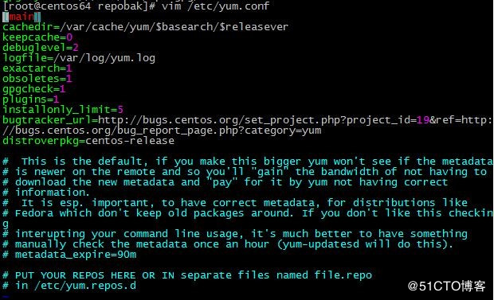
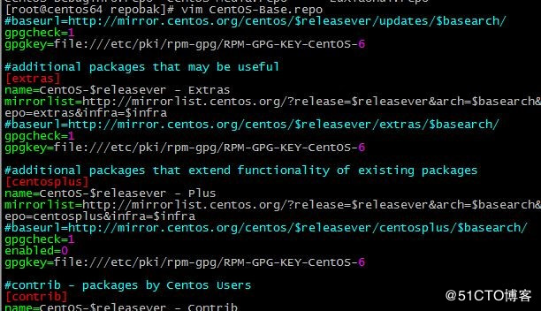
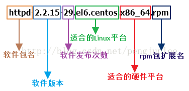

# 1.yum软件包管理器

## 1.1yum介绍

- YUM: Yellowdog Update Modifier，rpm的前端程序，可解决软件包相关依赖性，可在多个库之间定位软件包。
- yum repository:（yum资源库） 以.repo结尾的yum库文件中存储了众多rpm包，以及包的相关的元数据文件（放置于特定目录repodata下）
- yum库文件中支持的文件的服务器：
  - http:// （外部网站的rpm包地址）
  - https:// （外部网站的rpm包地址）
  - ftp:// （内部网的共享rpm包地址）
  - file:// （本机上存储的rpm包地址）

## 1.2yum客户端配置文件

### 1.2.1.公共配置

`/etc/yum.conf`：为所有仓库提供公共配置



cachedir :指定缓存目录
logfile : 日志文件
gpgcheck : 是否查包的合法性

### 1.2.2.为仓库的指向提供配置

`/etc/yum.repos.d/*.repo`：为仓库的指向提供配置



[repositoryID] （标题，这个库的id，相当于×××号，不可重复）
name=Some name for this repository （库名字，名字可以重复）
baseurl=url://path/to/repository/ （指定rpm包的路径）
enabled={1|0} （是否有效，0表示这个repo无效，1表示有效，默认值为1）
gpgcheck={1|0} （是否检验包的合法性，默认为1）
gpgkey=URL （公钥路径）
enablegroups={1|0} （是否开启组功能）
failovermethod={roundrobin|priority} （一个源是可以跟多个地址（baseurl）的，此选项是设置多个地址的使用顺序的）
roundrobin：意为随机挑选，默认值 
priority:按顺序访问 
cost= 默认为1000（优先级）

### 1.2.3.yum的repo配置文件中可用的变量

$releasever: 当前OS的发行版的主版本号 
$arch: 平台，i386,i486,i586,x86_64等 
$basearch：基础平台；i386, x86_64 
$YUM0-$YUM9:自定义变量

- 例如： http://server/centos/$releasever/$basearch/

如果当前服务器是centos7版本x86_64平台的
  则实际网址为http://server/centos/7/x86_64
如果当前服务器是centos6版本i384平台的
  则实际网址为http://server/centos/6/i384

## 1.3yum命令行管理

- 语法：yum(选项)(参数)

- 选项:
  		-h：显示帮助信息；
  		-y：对所有的提问都回答“yes”；
  		-c：指定配置文件；
  		-q：安静模式；
  		-v：详细模式；
  		-d：设置调试等级（0-10）；
  		-e：设置错误等级（0-10）；
  		-R：设置yum处理一个命令的最大等待时间；
  		-C：完全从缓存中运行，而不去下载或者更新任何头文件。
- 参数:
  		install：安装rpm软件包；
  		update：更新rpm软件包；
  		check-update：检查是否有可用的更新rpm软件包；
  		remove：删除指定的rpm软件包；
  		list：显示软件包的信息；
  		search：检查软件包的信息；
  		info：显示指定的rpm软件包的描述信息和概要信息；
  		clean：清理yum过期的缓存；
  		shell：进入yum的shell提示符；
  		resolvedep：显示rpm软件包的依赖关系；
  		localinstall：安装本地的rpm软件包；
  		localupdate：显示本地rpm软件包进行更新；
  		deplist：显示rpm软件包的所有依赖关系。
- 图形化前端
  		Yum的图形化前端主要有yumex和kyum。


---

列出可安装的、已安装的、可升级的包

`yum list {available|installed|updates}`


卸载程序包

`yum remove package`


查看指定程序（命令）的信息

` yum info  命令`

`yum provides 包`

`yum search [all] 包的关键字`


yum 缓存

`yum makecache` ：构建缓存

`yum clean all`：清除所有缓存


# 2.RPM包管理

- RPM包命名规则



- RPM包文件默认安装位置

| /etc/           | 配置文件默认安装目录       |
| --------------- | -------------------------- |
| /usr/bin/       | 可执行的命令安装目录       |
| /usr/lib/       | 所依赖的函数库文件保存位置 |
| /usr/share/doc/ | 软件帮助文档保存位置       |
| /usr/share/man/ | 软件手册保存位置           |

- rpm命令

命令语法：**rpm [选项] [包全名]|[包名]|[系统文件名]**

常用选项：

```shell
-i：安装（install）；
-U：升级（upgrade）；
-e：卸载（erase）；
-v：显示安装过程详细信息（verbose）；
-h：显示安装进度（hash）；
--nodeps：不检查依赖性；

-q：查询（query）；

-i：查询软件包信息（information）；

-l：查询包中文件的默认安装位置（list）；

-f：查询系统文件属于哪个软件包（file）；

-R：查询软件包的依赖性（requires）；

-a：查询所有（all）；

-p：查询未安装包信息（package）；

-V：校验指定RPM包中的文件（verify）； 
```

示例：

```shell
//安装httpd-2.2.15-29.el6.centos.x86_64.rpm  
rpm -ivh httpd-2.2.15-29.el6.centos.x86_64.rpm

//升级httpd-2.2.15-29.el6.centos.x86_64.rpm  
rpm -Uvh httpd-2.2.15-29.el6.centos.x86_64.rpm  

//卸载httpd软件包  
rpm -e httpd  
```

示例：

```shell
//查询所有已安装的httpd软件包
rpm -qa | grep httpd

//查询已安装的httpd软件包的详细信息
rpm -qi  httpd

//查询未安装的httpd-2.2.15-29.el6.centos.x86_64.rpm软件包的详细信息
rpm -qip  httpd-2.2.15-29.el6.centos.x86_64.rpm 

//查询已安装的httpd软件包中文件的安装位置
rpm -ql  httpd

//查询未安装的httpd-2.2.15-29.el6.centos.x86_64.rpm软件包中文件的安装位置
rpm -qlp  httpd-2.2.15-29.el6.centos.x86_64.rpm

//查询系统文件/usr/sbin/httpd所属的软件包
rpm -qf /usr/sbin/httpd

//查询已安装的httpd软件包的依赖性
rpm -qR httpd

//查询未安装的httpd-2.2.15-29.el6.centos.x86_64.rpm软件包的依赖性
rpm -qRp httpd-2.2.15-29.el6.centos.x86_64.rpm

//校验已安装的httpd软件包
rpm -V httpd

//校验未安装的httpd-2.2.15-29.el6.centos.x86_64.rpm软件包
rpm -Vp httpd-2.2.15-29.el6.centos.x86_64.rpm
```

- 注：在使用rpm命令时，若操作的包是未安装的软件包时，需使用包全名，而且要注意路径；若操作的是已经安装的软件包时，使用包名，系统会去/var/lib/rpm/中的数据库中搜索。