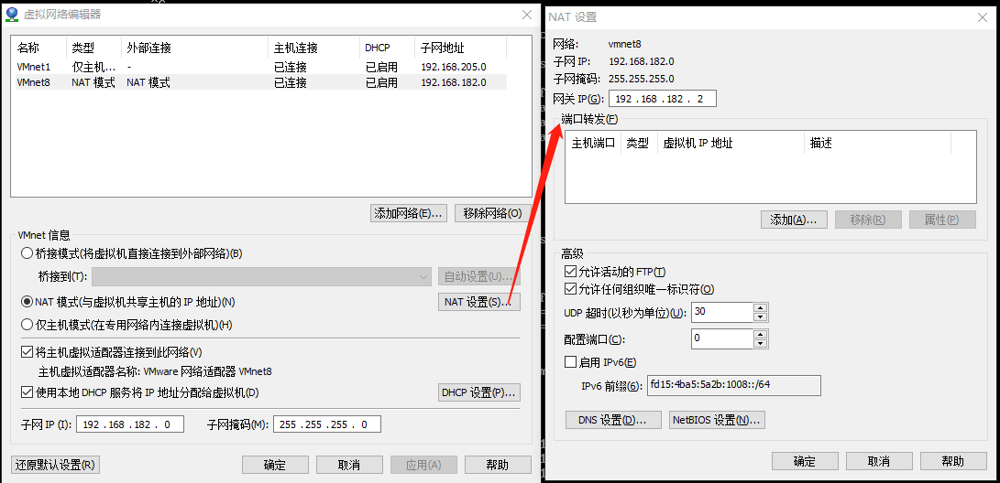

# VMWARE虚拟机3种网络模式

无论是vmware,virtual box,virtual pc等虚拟机软件，一般来说，虚拟机有三种网络模式:

- 1.桥接

- 2.NAT

- 3.Host-Only（仅主机）

## 1.桥接

**解释**：

- 桥接网络是指本地物理网卡和虚拟网卡**通过VMnet0虚拟交换机进行桥接**，物理网卡和虚拟网卡在拓扑图上处于同等地位，那么物理网卡和虚拟网卡就相当于处于**同一个网段**，虚拟交换机就相当于一台现实网络中的交换机,所以两个网卡的**IP地址也要设置为同一网段**。

**适用场景**：

- 所以当我们要在局域网使用虚拟机，对局域网其他pc提供服务时，例如提供ftp，提供ssh，提供http服务，那么就要选择桥接模式。

**使用示例**：

- 例如大学宿舍里有一个路由器，宿舍里四个人连接这个路由器，路由器的wanip就不理会了，这个ip是动态获取的，而lanip默认是192.168.1.1,子网掩码是255.255.255.0。而其他四个人是自动获取ip，假设四个人的ip是:

     A:192.168.1.100/255.255.255.0,  B:192.168.1.101/255.255.255.0,  C:192.168.1.102/255.255.255.0,  D:192.168.1.103/255.255.255.0

     那么虚拟机的ip可以设置的ip地址是192.168.1.2-192.168.1.99,192.168.1.104-192.168.1.254(网络地址全0和全1的除外，再除去ABCD四个人的ip地址)

    那么虚拟机的ip地址可以设置为192.168.1.98/255.255.255.0,设置了这个ip地址，ABCD这四个人就可以通过192.168.1.98访问虚拟机了，如果虚拟机需要上外网，那么还需要配置虚拟机的路由地址，就是192.168.1.1了，这样，虚拟机就可以上外网了，但是，上网我们一般是通过域名去访问外网的，所以我们还需要为虚拟机配置一个dns服务器，我们可以简单点，把dns服务器地址配置为google的dns服务器:8.8.8.8,到此，虚拟机就可以上网了。

## 2.NAT

**解释**：

​	NAT模式中，就是让虚拟机借助NAT(网络地址转换)功能，通过宿主机器所在的网络来访问公网。

​	NAT模式中，虚拟机的网卡和物理网卡的网络，不在同一个网络，虚拟机的网卡，是在**vmware提供的一个虚拟网络**。

**NAT和桥接的比较**:

​	(1) NAT模式和桥接模式虚拟机都可以上外网。

​	(2) 由于NAT的网络在vmware提供的一个虚拟网络里，所以局域网其他主机是无法访问虚拟机的，而宿主机可以访问虚拟机，虚拟机可以访问局域网的所有主机，因为真实的局域网相对于NAT的虚拟网络，就是NAT的虚拟网络的外网，不懂的人可以查查NAT的相关知识。

​	(3) 桥接模式下，多个虚拟机之间可以互相访问；NAT模式下，多个虚拟机之间也可以相互访问。

**适用场景**：

- 如果你建一个虚拟机，只是给自己用，不需要给局域网其他人用，那么可以选择NAT，毕竟NAT模式下的虚拟系统的TCP/IP配置信息是由VMnet8(NAT)虚拟网络的DHCP服务器提供的，只要虚拟机的网路配置是DHCP，那么你不需要进行任何其他的配置，只需要宿主机器能访问互联网即可，就可以让虚拟机联网了。

  

  例如你想建多个虚拟机集群，作为测试使用，而宿主机可能是一个笔记本，ip不固定。这种应用场景，我们需要采用nat模式了，但是我们要考虑一个问题，虚拟机之间是需要互访的，默认采用dhcp，虚拟机的ip每次重启，ip都是不固定的，所以我们需要手工设置虚拟机的ip地址。

  

  但是我们对虚拟机网卡所在的虚拟网络的信息还一无所知，例如虚拟机网络的路由地址，子网掩码，所以我们需要先查下nat虚拟网络的信息。

  

  使用vmware,在**Edit->Virtual Network Editor中配置**好虚拟网络信息后看到下图所示，注意VMnet8，VMnet8相当于是本机的一个路由，虚拟机设置NAT后就通过这个路由进行上网的，可以查看其网络地址，路由地址，子网掩码。

  

  选择**VMnet8->NAT设置**,可以看到子网ip显示为192.168.182.0，子网掩码是255.255.255.0，那路由地址呢，其实就是网关IP了，都是同个东西，这里是192.168.182.2。

  **注意**：虚拟机网络配置的IP，子网掩码，网关，必须与上述图中对应才行。否则不能上公网。

  接下来就好办了，在对应的虚拟机设置好ip，子网掩码，路由地址就可以上外网了，至于dns可以设置为8.8.8.8.

## 3.Host-Only

​		在Host-Only模式下，虚拟网络是一个**全封闭的网络**，它唯一能够访问的就是主机。其实Host-Only网络和NAT网络很相似，不同的地方就是Host-Only网络没有NAT服务，所以虚拟网络不能连接到Internet。主机和虚拟机之间的通信是通过**VMware Network Adepter VMnet1虚拟网卡**来实现的。

　　Host-Only的宗旨就是建立一个与外界隔绝的内部网络，来提高内网的安全性。这个功能或许对普通用户来说没有多大意义，但大型服务商会常常利用这个功能。如果你想为VMnet1网段提供路由功能，那就需要使用RRAS，而不能使用XP或2000的ICS，因为ICS会把内网的IP地址改为192.168.0.1，但虚拟机是不会给VMnet1虚拟网卡分配这个地址的，那么主机和虚拟机之间就不能通信了。