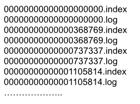
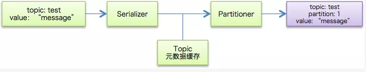

[kafka官网](<https://kafka.apache.org/>)

[confluent](<https://www.confluent.io/>)


[TOC]


# 相关概念

- `broker`： 消息处理结点，多个broker组成kafka集群。

- `topic`：话题，代表 一类消息，如page view，click行为等。

- `partition`： topic的物理分组，每个partition都是一个有序队列。

- `segment`： 多个大小相等的段组成了一个partition。

- `massage`： kafka中最基本的传递对象，有固定格式。 

- `offset`： 一个连续的用于定位被追加到分区的每一个消息的序列号，最大值为64位的long大小，19位数字字符长度。

- `producer`： 产生信息的主体，可以是服务器日志信息等。

- `consumer`： 消费producer产生话题消息的主体。

- `Consumer Group`：每个 Consumer 属于一个特定的 Consumer Group（可为每个 Consumer 指定 group name，若不指定 group name 则属于默认的 group）。


## topic、partition、segment、offset的关系


- 每个`topic`可以分为多个`partition`，一个`partition`相当于一个大目录，每个`partition`下面有多个**大小相等**的`segment`文件，这个`segment`是由`message`组成的，而每一个的`segment`不一定由大小相等的`message`组成。`segment`大小及生命周期在`server.properties`文件中配置。`offset`用于定位位于段里的唯一消息。

  ```properties
  # 以下配置控制日志段 segments 的处理。策略可以将其设置为在一段时间之后，或在给定大小累积之后删除段。
  # 只要满足*其中*一个条件，段就会被删除。删除总是发生在日志的最后。
  
  # 日志文件的最小删除年龄
  log.retention.hours=168
  
  # 基于日志大小的保留策略。除非剩下的片段被从日志中删除
  # 段位于 log.retention.bytes. 功能独立于 log.retention.hours.
  log.retention.bytes=1073741824
  
  # 日志段文件的最大大小。当达到这个大小时，将创建一个新的日志段。
  log.segment.bytes=1073741824
  
  # The interval at which log segments are checked to see if they can be deleted according to the retention policies
  # 时间间隔： 检查日志segments以查看是否可以根据保留策略删除它们 的 时间间隔
  log.retention.check.interval.ms=300000
  ```

  

- `segment`

  - `segment`由`index`和`data`文件组成，两个文件成对出现，分别存储索引和数据。
  - `segment`文件命名规则：对于所有的`partition`来说，`segment`名称从0开始，之后的每一个`segment`名称为上一个`segment`文件最后一条消息的`offset`值。

- `offset`

  对于分区中的一个`offset`例如等于345552怎么去查找相应的`message`呢？

  > 先找到该message所在的segment文件，通过二分查找的方式寻找小于等于345552的offset，假如叫S的segment符合要求，如果S等于345552则S上一个segment的最后一个message即为所求；如果S小于345552则依次遍历当前segment即可找到。

- `topic` 和 `partition`


## 为什么要在topic里加入partitions的概念

topic是逻辑的概念，partition是物理的概念，对用户来说是透明的。producer只需要关心消息发往哪个topic，而consumer只关心自己订阅哪个topic，并不关心每条消息存于整个集群的哪个broker。

为了性能考虑，如果topic内的消息只存于一个broker，那这个broker会成为瓶颈，无法做到<font color=#dd0000>水平扩展</font>。所以把topic内的数据分布到整个集群就是一个自然而然的设计方式。Partition的引入就是解决水平扩展问题的一个方案。


- kafka消息传递语义

```properties
# 有这么几种可能的 delivery guarantee：
At most once 消息可能会丢，但绝不会重复传输
At least one 消息绝不会丢，但可能会重复传输
Exactly once 每条消息肯定会被传输一次且仅传输一次，很多时候这是用户所想要的。
```

- offset更新的方式

```properties
自动提交，设置enable.auto.commit=true
# 更新的频率根据参数【auto.commit.interval.ms】来定。这种方式也被称为【at most once】，fetch 到消息后就可以更新offset，无论是否消费成功。

手动提交，设置enable.auto.commit=false
# 这种方式称为【at least once】。fetch到消息后，等消费完成再调用方法【consumer.commitSync()】，手动更新offset；如果消费失败，则offset也不会更新，此条消息会被重复消费一次。
```


## kafka消息分发

默认的分区策略是：

- 如果在发消息的时候指定了分区，则消息投递到指定的分区
- 如果没有指定分区，但是消息的key不为空，则基于key的哈希值来选择一个分区
- 如果既没有指定分区，且消息的key也是空，则用轮询的方式选择一个分区

> Kafka 中最基本的数据单元就是消息，而一条消息其实是由 Key + Value 组成的（Key 是可选项，可传空值，Value 也可以传空值）。在发送一条消息时，我们可以指定这个 Key，那么 Producer 会根据 Key 和 partition 机制来判断当前这条消息应该发送并存储到哪个 partition 中（这个就跟分片机制类似）。我们可以根据需要进行扩展 Producer 的 partition 机制（默认算法是 hash 取 %）。


扩展自己的 partition：

```java
import org.apache.kafka.clients.producer.Partitioner;
import org.apache.kafka.common.Cluster;
import org.apache.kafka.common.PartitionInfo;
 
import java.util.List;
import java.util.Map;
import java.util.Random;
 
/**
 * 消息发送后会调用自定义的策略
 *
 * @author Dongguabai
 * @date 2019/1/18 15:40
 */
public class MyPartitioner implements Partitioner {
 
    @Override
    public int partition(String topic, Object key, byte[] keyBytes, Object value, byte[] valueBytes, Cluster cluster) {
        //获取当前 topic 有多少个分区（分区列表）
        List<PartitionInfo> partitions = cluster.partitionsForTopic(topic);
        int partitionNum = 0;
        if (key == null) { //之前介绍过 Key 是可以传空值的
            partitionNum = new Random().nextInt(partitions.size());   //随机
        } else {
            //取 %
            partitionNum = Math.abs((key.hashCode()) % partitions.size());
        }
        System.out.println("key：" + key + "，value：" + value + "，partitionNum：" + partitionNum);
        //发送到指定分区
        return partitionNum;
    }
 
    @Override
    public void close() {
 
    }
 
    @Override
    public void configure(Map<String, ?> configs) {
 
    }
}
```


# 实例讲解

## 启动停止

```shell
#启动：
$ kafka/bin/kafka-server-start.sh -daemon kafka/config/server.properties
#通过jps查看Kafka进程是否启动。

#查看kafka状态
$ kafka-topics --describe --zookeeper hadoop-cluster01:2181
```


## 创建话题

- 创建一个 test2 test-demo（注意这里的 partitions 参数为 3）：

```shell
# --topic后面的test0是topic的名称
# --zookeeper应该和server.properties文件中的zookeeper.connect一样
# --config指定当前topic上有效的参数值
# --partitions指定topic的partition数量，如果不指定该数量，默认是server.properties文件中的num.partitions配置值
# --replication-factor指定每个partition的副本个数，默认1个

$ kafka-topics --create --partitions 3 --replication-factor 2  --zookeeper spark-master:2181 --topic test-demo

Created topic "test-demo".
```


## 删除话题

```shell
# 移除话题，若移除话题失败需要在Kafka服务端配置中添加设定 
# delete.topic.enble = true
$ kafka-topics --delete --topic [话题名称] --zookeeper [Zookeeper集群IP:端口]

# eg:
$ kafka-topics --delete --topic test-demo --zookeeper hadoop-cluster01:2181

#删除zookeeper中该topic相关的目录命令：
$ rm -r /kafka/config/topics/test-demo0
$ rm -r /kafka/brokers/topics/test-demo0
```


## 修改话题

```shell
$ kafka-topics --zookeeper zk_host:port --alter --topic my_topic_name --partitions 3
```

关于修改partition数量，有两点需要注意：

1. partition只能增加，不支持减少
2. 新增的partition只会对将来写入的数据起作用，以前存在的数据不会被移动到新的partition中

除了修改partition数量，我们还可以修改topic层面的配置，增加配置项：

```shell
$ kafka-topics --zookeeper zk_host:port/chroot --alter --topic my_topic_name --config x=y
```

删除配置项：

```shell
$ kafka-topics --zookeeper zk_host:port/chroot --alter --topic my_topic_name --delete-config x
```


## 查看话题

- 查看`test-demo`

```shell
[root@spark-master ~]# kafka-topics --describe  --zookeeper spark-master:2181 | grep test-demo
Topic:test-demo PartitionCount:3        ReplicationFactor:2     Configs:
      Topic: test-demo        Partition: 0    Leader: 1       Replicas: 1,3   Isr: 1,3
      Topic: test-demo        Partition: 1    Leader: 2       Replicas: 2,1   Isr: 2,1
      Topic: test-demo        Partition: 2    Leader: 3       Replicas: 3,2   Isr: 3,2
```

> PartitionCount:3 表示该话题有3个分区（0，1，2）；
>
> Leader1，2，3表示3个分区分别为broker1，2，3；
>
> Replicas表示该分区的备份broker id


```shell
#查看topic：
$ kafka-topics --list --zookeeper 172.16.0.126:2181
```


- 进入kafka数据目录查看

```shell
# broker 1
[root@spark-master ~]# ls /home/data/kafka/kafkadata/ | grep test-demo
test-demo-0
test-demo-1

# broker 2
[root@spark-slave0 ~]# ls /home/data/kafka/kafkadata/ | grep test-demo
test-demo-1
test-demo-2

# broker 3
[root@spark-slave2 ~]# ls /home/data/kafka/kafkadata/ | grep test-demo
test-demo-0
test-demo-2

```


## 生产数据

- 生产数据（producer）

```shell
[root@spark-slave0 ~]# kafka-console-producer --broker-list spark-slave1:9092 --topic test-demo
>hello:world
>question:what is your name?
>answer:jams
```


## 消费数据

- 消费数据（consumer）

```shell
#消费消息：
#使用 --from-beginning 参数输出该话题从创建开始后的消息
#使用 --consumer.config 参数指定消费端使用的配置文件
#使用 --offset [偏移量] --partion [分区编号] 参数自定义读取消息时的偏移量
$ kafka-console-consumer --bootstrap-server [listeners IP:端口] --topic [话题名称] [--consumer-property group.id=group_test]

# eg:

$ kafka-console-consumer --bootstrap-server spark-slave1:9092 --topic test-demo [--consumer-property group.id=group_test] --from-beginning
question:what is your name?
answer:jams
hello:world
```


- 查看有哪些消费者

```shell
$ kafka-consumer-groups  --bootstrap-server 172.16.0.200:9092 --list
Note: This will not show information about old Zookeeper-based consumers.

console-consumer-56274
group_test
console-consumer-49717
console-consumer-27024
```


- 查看Group详情

```shell
$ kafka-consumer-groups  --bootstrap-server 172.16.0.200:9092 --group group_test  --describe
Note: This will not show information about old Zookeeper-based consumers.

Consumer group 'group_test' has no active members.

TOPIC                          PARTITION  CURRENT-OFFSET  LOG-END-OFFSET  LAG        CONSUMER-ID                                       HOST                           CLIENT-ID
test                           0          2               8               6          -                                                 -                              -
```


- 删除group

```shell
$ kafka-consumer-groups  --bootstrap-server 172.16.0.200:9092 --group group_test  --delete
```


## 偏移量操作

### 查看Offset

```shell
$ kafka-run-class kafka.tools.GetOffsetShell --broker-list 172.16.0.200:9092 --topic test --time -1

test:0:8
```


```shell
$ kafka-consumer-groups --bootstrap-server spark-slave1:9092 --describe --group group_test
Note: This will not show information about old Zookeeper-based consumers.

Consumer group 'group_test' has no active members.

TOPIC                          PARTITION  CURRENT-OFFSET  LOG-END-OFFSET  LAG        CONSUMER-ID                                       HOST                           CLIENT-ID
test-demo                      2          2               2               0          -                                                 -                              -
test-demo                      1          2               2               0          -                                                 -                              -
test-demo                      0          4               4               0          -                                                 -                              -

# current-offset 当前已经消费到偏移量为2,可以理解为已经消费2条。
# log-end-offset可以理解为总共2条记录。
# lag可以理解为未消费记录条数。
```


### 查看partition状态

```shell
$ bin/kafka-run-class kafka.tools.GetOffsetShell --broker-list spark-slave1:9092 --topic test-demo --time -1

test-demo:2:2
test-demo:1:2
test-demo:0:4
```


### 调整offset

前提是：consumer group状态必须是inactive的，即不能是处于正在工作中的状态。

```shell
# kafka-consumer-groups --bootstrap-server spark-slave1:9092 --reset-offsets --group group_test --topic test-demo --to-offset 20 --execute
Note: This will not show information about old Zookeeper-based consumers.


TOPIC                          PARTITION  NEW-OFFSET
test-demo                      2          20
test-demo                      1          20
test-demo                      0          20
```

讲解：


- 确定topic作用域——当前有3种作用域指定方式：--all-topics（为consumer group下所有topic的所有分区调整位移），--topic t1 --topic t2（为指定的若干个topic的所有分区调整位移），--topic t1:0,1,2（为指定的topic分区调整位移）

- 确定位移重设策略——当前支持8种设置规则：

  - --to-earliest：把位移调整到分区当前最小位移
  - --to-latest：把位移调整到分区当前最新位移
  - --to-current：把位移调整到分区当前位移
  - --to-offset <offset>： 把位移调整到指定位移处
  - --shift-by N： 把位移调整到当前位移 + N处，注意N可以是负数，表示向前移动
  - --to-datetime <datetime>：把位移调整到大于给定时间的最早位移处，datetime格式是yyyy-MM-ddTHH:mm:ss.xxx，比如2017-08-04T00:00:00.000
  - --by-duration <duration>：把位移调整到距离当前时间指定间隔的位移处，duration格式是PnDTnHnMnS，比如PT0H5M0S
  - --from-file <file>：从CSV文件中读取调整策略

- 确定执行方案——当前支持3种方案：

- - 什么参数都不加：只是打印出位移调整方案，不具体执行
  - --execute：执行真正的位移调整
  - --export：把位移调整方案按照CSV格式打印，方便用户成csv文件，供后续直接使用


## 查看数据文件

```shell
# --print-data-log 是表示查看消息内容的，不加此项是查看不到详细的消息内容。如果要查看多个log文件可以用逗号分隔。
$ kafka-run-class kafka.tools.DumpLogSegments --files /home/data/kafka/kafkadata/test-demo-1/00000000000000000000.log --print-data-log
```


## 查看索引文件

```shell
$ kafka-run-class kafka.tools.DumpLogSegments --files /home/data/kafka/kafkadata/test-demo-1/00000000000000000000.index
```


## 扩展集群


# 文件存储机制


## topic存储

- topic以partition的方式存储

- 如何设置partition值

  topic下的一个分区只能被同一个consumer group下的一个consumer线程来消费。（但反之并不成立，即一个consumer线程可以消费多个分区的数据，比如Kafka提供的ConsoleConsumer，默认就只是一个线程来消费所有分区的数据）。

  因此，如果设置的partition的数量小于consumer的数量，就会有消费者消费不到数据。所以，推荐partition的数量一定要大于同时运行的consumer的数量。

  <font color=#dd0000>总结：分区数决定了同组消费者个数的上限。</font>

  建议partition的数量大于集群broker的数量，这样leader partition就可以均匀的分布在各个broker中，最终使得集群负载均衡。


## partiton存储

- 每个partion(目录)相当于一个巨型文件被平均分配到多个大小相等segment(段)数据文件中。但每个段segment file消息数量不一定相等，这种特性方便old segment file快速被删除。
- 每个partiton只需要支持顺序读写就行了，segment文件大小和生命周期由**服务端配置参数**决定。

```properties
# 以下配置控制日志段 segments 的处理。策略可以将其设置为在一段时间之后，或在给定大小累积之后删除段。
# 只要满足*其中*一个条件，段就会被删除。删除总是发生在日志的最后。

# 日志文件的最小删除年龄
log.retention.hours=168

# 基于日志大小的保留策略。除非剩下的片段被从日志中删除
# 段位于 log.retention.bytes. 功能独立于 log.retention.hours.
log.retention.bytes=1073741824

# 日志段文件的最大大小。当达到这个大小时，将创建一个新的日志段。
log.segment.bytes=1073741824

# The interval at which log segments are checked to see if they can be deleted according to the retention policies
# 时间间隔： 检查日志segments以查看是否可以根据保留策略删除它们 的 时间间隔
log.retention.check.interval.ms=300000
```


## segment存储

producer发message到某个topic，message会被均匀的分布到多个partition上（随机或根据用户指定的回调函数进行分布），kafka broker收到message后，往对应partition的最后一个segment上添加该消息。当某个segment上的消息条数达到配置值或消息发布时间超过阈值时，segment上的消息会被flush到磁盘，只有flush到磁盘上的消息consumer才能消费，segment达到一定的大小后将不会再往该segment写数据，broker会创建新的segment。


每个partition在内存中对应一个index，记录每个segment中的第一条消息偏移。

- segment file组成：由2大部分组成，分别为index file和data file，此2个文件一一对应，成对出现，后缀".index"和“.log”分别表示为segment索引文件、数据文件.
- segment文件命名规则：partion全局的第一个segment从0开始，后续每个segment文件名为上一个全局partion的最大offset(偏移message数)。数值最大为64位long大小，19位数字字符长度，没有数字用0填充。


每个segment中存储很多条消息，消息id由其逻辑位置决定，即从消息id可直接定位到消息的存储位置，避免id到位置的额外映射。

下面文件列表是笔者在Kafka broker上做的一个实验，创建一个topicXXX包含1 partition，设置每个segment大小为500MB,并启动producer向Kafka broker写入大量数据，如下图2所示segment文件列表形象说明了上述2个规则：


以上述图2中一对segment file文件为例，说明segment中index<—->data file对应关系物理结构如下：



上述图3中索引文件存储大量元数据，数据文件存储大量消息，索引文件中元数据指向对应数据文件中message的物理偏移地址。其中以索引文件中 元数据3,497为例，依次在数据文件中表示第3个message(在全局partiton表示第368772个message)、以及该消息的物理偏移 地址为497。

从上述图3了解到segment data file由许多message组成，下面详细说明message物理结构如下：


**参数说明**：

| 关键字              | 解释说明                                                     |
| :------------------ | :----------------------------------------------------------- |
| 8 byte offset       | 在parition(分区)内的每条消息都有一个有序的id号，这个id号被称为偏移(offset),它可以唯一确定每条消息在parition(分区)内的位置。即**offset表示partiion的第多少message** |
| 4 byte message size | message大小                                                  |
| 4 byte CRC32        | 用crc32校验message                                           |
| 1 byte “magic"      | 表示本次发布Kafka服务程序协议版本号                          |
| 1 byte “attributes" | 表示为独立版本、或标识压缩类型、或编码类型。                 |
| 4 byte key length   | 表示key的长度,当key为-1时，K byte key字段不填                |
| K byte key          | 可选                                                         |
| value bytes payload | 表示实际消息数据。                                           |


## 通过offset查找message

例如读取offset=368776的message，需要通过下面2个步骤查找。

- 第一步查找segment file

  上述图2为例，其中00000000000000000000.index表示最开始的文件，起始偏移量(offset)为0.第二个文件 00000000000000368769.index的消息量起始偏移量为368770 = 368769 + 1.同样，第三个文件00000000000000737337.index的起始偏移量为737338=737337 + 1，其他后续文件依次类推，以起始偏移量命名并排序这些文件，只要根据offset **二分查找**文件列表，就可以快速定位到具体文件。

  当offset=368776时定位到00000000000000368769.index|log

- 第二步通过segment file查找message通过第一步定位到segment file，当offset=368776时，依次定位到00000000000000368769.index的元数据物理位置和 00000000000000368769.log的物理偏移地址，然后再通过00000000000000368769.log顺序查找直到 offset=368776为止。

segment index file采取稀疏索引存储方式，它减少索引文件大小，通过mmap可以直接内存操作，稀疏索引为数据文件的每个对应message设置一个元数据指针,它 比稠密索引节省了更多的存储空间，但查找起来需要消耗更多的时间。


# 复制

## 特性

1）一个partition的复制个数（replication factor）包括这个partition的leader本身。

2）所有对partition的读和写都通过leader。

3）Followers通过pull获取leader上log（message和offset）

4）如果一个follower挂掉、卡住或者同步太慢，leader会把这个follower从”in sync replicas“（ISR）列表中删除。

5）当所有的”in sync replicas“的follower把一个消息写入到自己的log中时，这个消息才被认为是”committed“的。

6）如果针对某个partition的所有复制节点都挂了，Kafka默认选择最先复活的那个节点作为leader（这个节点不一定在ISR里）。


## Leader选举

Kafka在Zookeeper中为每一个partition动态的维护了一个ISR，这个ISR里的所有replica都跟上了leader，只有ISR里的成员才能有被选为leader的可能（unclean.leader.election.enable=false）。

在这种模式下，对于f+1个副本，一个Kafka topic能在保证不丢失已经commit消息的前提下容忍f个副本的失败，在大多数使用场景下，这种模式是十分有利的。事实上，为了容忍f个副本的失败，“少数服从多数”的方式和ISR在commit前需要等待的副本的数量是一样的，但是ISR需要的总的副本的个数几乎是“少数服从多数”的方式的一半。


# 生产者-消费者

## Producers


```java
public class ProducerRecord<K, V> {
    private final String topic;
    private final Integer partition;
    private final Headers headers;
    private final K key;
    private final V value;
    private final Long timestamp;
}
```

注：ProducerRecord允许用户在创建消息对象的时候就直接指定要发送的分区，这样producer后续发送该消息时可以直接发送到指定分区，而不用先通过Partitioner计算目标分区了。另外，我们还可以直接指定消息的时间戳——但一定要慎重使用这个功能，因为它有可能会令时间戳索引机制失效。


```java
public final class RecordMetadata {
    public static final int UNKNOWN_PARTITION = -1;
    private final long offset;
    private final long timestamp;
    private final int serializedKeySize;
    private final int serializedValueSize;
    private final TopicPartition topicPartition;
    private volatile Long checksum;
}
```


### 消息发送流程

用户首先构建待发送的消息对象`ProducerRecord`；

然后调用`KafkaProducer#send`方法进行发送；

`KafkaProducer`接收到消息后首先对其进行序列化；

然后结合本地缓存的元数据信息一起发送给`partitioner`去确定目标分区；

最后追加写入到内存中的消息缓冲池(`accumulator`)。此时`KafkaProducer#send`方法成功返回；

同时，`KafkaProducer`中还有一个专门的`Sender IO`线程负责将缓冲池中的消息分批次发送给对应的`broker`，完成真正的消息发送逻辑。


 **特点：**

总共创建两个线程：执行KafkaPrducer#send逻辑的线程——我们称之为“用户主线程”；

?									  执行发送逻辑的IO线程——我们称之为“Sender线程”。 

batch机制——“分批发送“机制。每个批次(batch)中包含了若干个PRODUCE请求，因此具有更高的吞吐量。 


### 消息发送方式

1、发送并忘记( fire-and-forget)：我们把消息发送给服务器，但井不关心它是否正常到达。大多数情况下，消息会正常到达，因为 Kafka是高可用的，而且生产者会自动尝试重发。不过，使用这种方式有时候也会丢失一些消息。

```java
ProducerRecord<String, String> record = new ProducerRecord<String, String>("CustomerCountry", "Precision Products", "France");

try {
  producer.send(record);
} catch (Exception e) {
  e.printStackTrace();
}
```

2、同步发送：我们使用send()方法发送消息， 它会返回一个Future对象，调用get()方法进行等待， 就可以知道悄息是否发送成功。

```java
ProducerRecord<String, String> record = new ProducerRecord<String, String>("CustomerCountry", "Precision Products", "France");

try {
  producer.send(record).get();
} catch (Exception e) {
  e.printStackTrace();
}
```

3、异步发送：我们调用 send() 方怯，并指定一个回调函数， 服务器在返回响应时调用该函数。

```java
private class DemoProducerCallback implements Callback {
  @Override
  public void onCompletion(RecordMetadata recordMetadata, Exception e) {
    if (e != null) {
	  e.printStackTrace();
	}
  }
}

ProducerRecord<String, String> record = new ProducerRecord<String, String>("CustomerCountry", "Precision Products", "France");

producer.send(record, new DemoProducerCallback());
```


### 消息发送内部流程

 当用户调用`KafkaProducer.send(ProducerRecord, Callback)`时Kafka内部流程分析： 


#### 序列化+计算目标分区

 这是`KafkaProducer#send`逻辑的第一步，即为待发送消息进行序列化并计算目标分区，如下图所示： 



如上图所示，一条所属`topic`是"`test`"，消息体是"`message`"的消息被序列化之后结合`KafkaProducer`缓存的元数据(比如该`topic`分区数信息等)共同传给后面的`Partitioner`实现类进行目标分区的计算。


#### 追加写入消息缓冲区(accumulator)

`producer`创建时会创建一个默认`32MB`(由`buffer.memory`参数指定)的`accumulator`缓冲区，专门保存待发送的消息。除了`linger.ms`和`batch.size`等参数之外，该数据结构中还包含了一个特别重要的集合信息：消息批次信息(`batches`)。该集合本质上是一个`HashMap`，里面分别保存了每个`topic`分区下的`batch`队列，即前面说的批次是按照`topic`分区进行分组的。这样发往不同分区的消息保存在对应分区下的`batch`队列中。

举个简单的例子，假设消息M1, M2被发送到test的0分区但属于不同的`batch`，M3分送到test的1分区，那么`batches`中包含的信息就是：

```java
{
	"test-0" -> [batch1, batch2], 
	"test-1" -> [batch3]
}
```


单个`topic`分区下的`batch`队列中保存的是若干个消息批次。每个`batch`中最重要的3个组件包括：

?	`compressor`: 负责执行追加写入操作

?	`batch`缓冲区：由`batch.size`参数控制，消息被真正追加写入到的地方

?	`thunks`：保存消息回调逻辑的集合

这一步的目的就是将待发送的消息写入消息缓冲池中，具体流程如下图所示：


 这一步执行完毕之后理论上讲`KafkaProducer.send`方法就执行完毕了，用户主线程所做的事情就是等待`Sender`线程发送消息并执行返回结果了。 


#### Sender线程预处理及消息发送

此时，该`Sender`线程登场了。严格来说，`Sender`线程自`KafkaProducer`创建后就一直都在运行着 。它的工作流程基本上是这样的：

- 不断轮询缓冲区寻找已做好发送准备的分区 ；
- 将轮询获得的各个`batch`按照目标分区所在的`leader broker`进行分组；
- 将分组后的`batch`通过底层创建的**Socket连接**发送给各个broker；
- 等待服务器端发送`response`回来。

为了说明上的方便，还是基于图的方式来解释`Sender`线程的工作原理：


#### Sender线程处理response

上图中`Sender`线程会发送`PRODUCE`请求给对应的`broker`，`broker`处理完毕之后发送对应的`PRODUCE response`。一旦`Sender`线程接收到`response`将<font color="#00dd00">依次(按照消息发送顺序)</font>调用`batch`中的回调方法，如下图所示：


做完这一步，`producer`发送消息就可以算作是100%完成了。

通过这4步我们可以看到新版本`producer`发送事件完全是异步过程。**因此在调优producer前我们就需要搞清楚性能瓶颈到底是在用户主线程还是在Sender线程**。

由于`KafkaProducer`是线程安全的，因此在使用上有两种基本的使用方法：

|                     | 说明                              | 优势                                                         | 劣势                                                         |
| ------------------- | --------------------------------- | ------------------------------------------------------------ | ------------------------------------------------------------ |
| 单KafkaProducer实例 | 所有线程共享一个KafkaProducer实例 | 实现简单，性能好                                             | 1.所有线程公用一个内存缓冲池，可能需要较多的内存空间<br />2.一旦崩溃所有用户线程都无法工作 |
| 多KafkaProducer实例 | 每个线程维护一个KafkaProducer实例 | 1.每个线程拥有专属的KafkaProducer实例、缓冲区空间以及一组配置参数，支持更细粒度的调优<br />2.单个KafkaProducer实例崩溃不影响其他实例的工作 | 较大的对象分配开销                                           |


### 相关参数

```properties
# producer采用分批发送机制，该参数即控制一个batch的大小。默认是16KB
batch.size

# 指定生产者在发送批量消息前等待的时间，当设置此参数后，即便没有达到批量消息的指定大小，
# 到达时间后生产者也会发送批量消息到broker。默认情况下，生产者的发送消息线程只要空闲了就
# 会发送消息，即便只有一条消息。设置这个参数后，发送线程会等待一定的时间，这样可以批量发送
# 消息增加吞吐量，但同时也会增加延迟。
linger.ms

# acks控制多少个副本必须写入消息后生产者才能认为写入成功，这个参数对消息丢失可能性有很大影响。这个参数有三种取值：

# 	acks=0：生产者把消息发送到broker即认为成功，不等待broker的处理结果。这种方式的吞吐最高，但也是最容易丢失消息的。
#
# 	acks=1：生产者会在该分区的群首（leader）写入消息并返回成功后，认为消息发送成功。
#	如果群首写入消息失败，生产者会收到错误响应并进行重试。这种方式能够一定程度避免消息丢失，
#	但如果群首宕机时该消息没有复制到其他副本，那么该消息还是会丢失。另外，如果我们使用同步方式来发送，
#	延迟会比前一种方式大大增加（至少增加一个网络往返时间）；如果使用异步方式，应用感知不到延迟，
#	吞吐量则会受异步正在发送中的数量限制。
# 	
#	acks=-1/all：生产者会等待所有副本成功写入该消息，这种方式是最安全的，能够保证消息不丢失，但是延迟也是最大的。
request.required.acks = 0, 1, n, -1/all

# 设置生产者缓冲发送的消息的内存大小(即：Batch缓冲总的大小->accumulator)，如果应用调用send方法的速度大于生产者发送的速度，
# 那么调用会阻塞或者抛出异常，具体行为取决于block.on.buffer.full（这个参数在0.9.0.0版本
# 被max.block.ms代替，允许抛出异常前等待一定时间）参数。
buffer.memory

# 指定使用消息压缩，参数可以取值为snappy、gzip或者lz4
# 	snappy压缩算法由Google研发，这种算法在性能和压缩比取得比较好的平衡；
# 	相比之下，gzip消耗更多的CPU资源，但是压缩效果也是最好的。通过使用压缩，我们可以节省网络带宽和Kafka存储成本。
compresstion.type

# 当生产者发送消息收到一个可恢复异常时，会进行重试，这个参数指定了重试的次数。
#	在实际情况中，这个参数需要结合retry.backoff.ms（重试等待间隔）来使用，
#	建议总的重试时间比集群重新选举群首的时间长，这样可以避免生产者过早结束重试导致失败。
retries

# 这个参数可以是任意字符串，它是broker用来识别消息是来自哪个客户端的。在broker进行打印日志、衡量指标或者配额限制时会用到。
client.id

# 这个参数指定生产者可以发送多少消息到broker并且等待响应.
# 设置此参数较高的值可以提高吞吐量，但同时也会增加内存消耗。另外，如果设置过高反而会降低吞吐量，
# 因为批量消息效率降低。设置为1，可以保证发送到broker的顺序和调用send方法顺序一致，
# 即便出现失败重试的情况也是如此。
max.in.flight.requests.per.connection

# 这些参数控制生产者等待broker的响应时间。
#	request.timeout.ms指定发送数据的等待响应时间，
#	metadata.fetch.timeout.ms指定获取元数据（例如获取分区的群首信息）的等待响应时间。
#	timeout.ms则指定broker在返回结果前等待其他副本（与acks参数相关）响应的时间，如果时间到了但其他副本没有响应结果，则返回消息写入失败。
timeout.ms
request.timeout.ms
metadata.fetch.timeout.ms

#  指定应用调用send方法或者获取元数据方法（例如partitionFor）时的阻塞时间，超过此时间则抛出timeout异常。
max.block.ms

# 限制生产者发送数据包的大小，数据包的大小与消息的大小、消息数相关。如果我们指定了最大数据包大小为1M，
# 那么最大的消息大小为1M，或者能够最多批量发送1000条消息大小为1K的消息。
# 另外，broker也有message.max.bytes参数来控制接收的数据包大小。
# 在实际中，建议这些参数值是匹配的，避免生产者发送了超过broker限定的数据大小。
max.request.size

# 这两个参数设置用来发送/接收数据的TCP连接的缓冲区，如果设置为-1则使用操作系统自身的默认值。
# 如果生产者与broker在不同的数据中心，建议提高这个值，因为不同数据中心往往延迟比较大。
receive.buffer.bytes
send.buffer.bytes
```


### 保证分区的顺序

`Kafka`可以保证同一个分区里的消息是有序的。也就是说，如果生产者按照一定的顺序发送消息， `broker`就会按照这个顺序把它们写入分区，消费者也会按照同样的顺序读取它们。在某些情况下 ， 顺序是非常重要的。如果把`retries` 设为非零整数，同时把 `max.in.flight.requests.per.connection` 设为比 1大的数，那么，如果第一个批次消息写入失败，而第二个批次写入成功， `broker`会重试写入第一个批次。如果此时第一个批次也写入成功，那 么两个批次的顺序就反过来了。

 一般来说，如果某些场景要求消息是有序的，那么消息是否写入成功也是 很关键的，所以不建议把顺序是非常重要的。如果把`retries` 设为 0。可以把 `max.in.flight.requests.per.connection`设为 1，这样在生产者尝试发送第一批消息时，就不会有其他的消息发送给 broker。不过这样**会严重影响生产者的吞吐量** ，所以只有在 对消息的顺序有严格要求的情况下才能这么做。


### 序列化

 [http://www.dengshenyu.com/%E5%88%86%E5%B8%83%E5%BC%8F%E7%B3%BB%E7%BB%9F/2017/11/12/kafka-producer.html](http://www.dengshenyu.com/分布式系统/2017/11/12/kafka-producer.html)


## Consumers

- Kafka提供了两套consumer api，分为`high-level api`和`sample-api`。

  - **Sample-api** 是一个底层的API，通过直接操作底层API获取数据的方式获取Kafka中的数据，需要自行给定分区、偏移量等属性。

    优点：可操作性强；

    缺点：代码相对而言比较复杂。(入口类：`SimpleConsumer`) 

  - **High Level Consumer API**：高度抽象的Kafka消费者API；将底层具体获取数据、更新offset、设置偏移量等操作屏蔽掉，直接将操作数据流的处理工作提供给编写程序的人员。

    优点是：操作简单；

    缺点：可操作性太差，无法按照自己的业务场景选择处理方式。(入口类：`ConsumerConnector`)

- **在kafka中，当前读到哪条消息的offset值是由consumer来维护的**，因此，consumer可以自己决定如何读取kafka中的数据。比如，consumer可以通过重设offset值来重新消费已消费过的数据。不管有没有被消费，kafka会保存数据一段时间，这个时间周期是**可配置**的，只有到了过期时间，kafka才会删除这些数据。

- High-level API封装了对集群中一系列broker的访问，可以透明的消费一个topic。它自己维持了已消费消息的状态，即每次消费的都是下一个消息。

  High-level API还支持以组的形式消费topic，如果consumers有同一个组名，那么kafka就相当于一个队列消息服务，而各个consumer均衡的消费相应partition中的数据。若consumers有不同的组名，那么此时kafka就相当与一个广播服务，会把topic中的所有消息广播到每个consumer。

  

  **High level api和Low level api是针对consumer而言的，和producer无关。**

  

  High level api是consumer读的partition的offsite是存在zookeeper上。High level api 会启动另外一个线程去每隔一段时间，offsite自动同步到zookeeper上。换句话说，如果使用了High level api， 每个message只能被读一次，一旦读了这条message之后，无论我consumer的处理是否ok。High level api的另外一个线程会自动的把offiste+1同步到zookeeper上。如果consumer读取数据出了问题，offsite也会在zookeeper上同步。因此，如果consumer处理失败了，会继续执行下一条。这往往是不对的行为。因此，Best Practice是一旦consumer处理失败，直接让整个conusmer group抛Exception终止，但是最后读的这一条数据是丢失了，因为在zookeeper里面的offsite已经+1了。等再次启动conusmer group的时候，已经从下一条开始读取处理了。

  

  Low level api是consumer读的partition的offsite在consumer自己的程序中维护。不会同步到zookeeper上。但是为了kafka manager能够方便的监控，一般也会手动的同步到zookeeper上。这样的好处是一旦读取某个message的consumer失败了，这条message的offsite我们自己维护，我们不会+1。下次再启动的时候，还会从这个offsite开始读。这样可以做到exactly once对于数据的准确性有保证。

  

  

### Consumer与Partition的关系（ **Consumer Rebalance** ）

- 如果consumer比partition多，是浪费，因为kafka的设计是在一个partition上是不允许并发的，所以consumer数不要大于partition数
- 如果consumer比partition少，一个consumer会对应于多个partitions，这里主要合理分配consumer数和partition数，否则会导致partition里面的数据被取的不均匀
- 如果consumer从多个partition读到数据，不保证数据间的顺序性，kafka只保证在一个partition上数据是有序的，但多个partition，根据你读的顺序会有不同
- 增减consumer，broker，partition会导致rebalance，所以rebalance后consumer对应的partition会发生变化
- High-level接口中获取不到数据的时候是会block的


# 消息投递语义

Kafka支持的三种消息投递语义:

- `at most once`:至多一次，消息可能会丢，但不会重复
- `at least once`:至少一次，消息肯定不会丢失，但可能重复
- `exactly once`:有且只有一次，消息不丢失不重复，且只消费一次。


## 0.11.0之前的版本

### Producer 消息生产者端

当 producer 向 leader 发送数据时，可以通过 `request.required.acks` 参数来设置数据可靠性的级别：

- acks=1（默认）：当且仅当leader收到消息**返回commit确认信号**后认为发送成功。如果 leader 宕机，则会丢失数据。
- acks=0：producer发出消息即完成发送，**无需等待**来自 broker 的确认。这种情况下数据传输效率最高，但是数据可靠性确是最低的。
- acks=-1（ALL）：发送端需要等待 **ISR 列表中所有列表都确认接收数据**后才算一次发送完成，可靠性最高，延迟也较大。

这里涉及到producer端的acks设置和broker端的副本数量，以及`min.insync.replicas`的设置。


### Broker 消息接收端

acks=1，表示当leader分片副本写消息成功就返回响应给producer，此时认为消息发送成功。
如果leader写成功单马上挂了，还没有将这个写成功的消息同步给其他的分片副本，那么这个分片此时的ISR列表为空，
如果unclean.leader.election.enable=true，就会发生log truncation（日志截取），同样会发生消息丢失。
如果unclean.leader.election.enable=false，那么这个分片上的服务就不可用了，producer向这个分片发消息就会抛异常。

所以我们设置min.insync.replicas=2，unclean.leader.election.enable=false，producer端的acks=all，这样发送成功的消息就绝不会丢失。


### Consumer 消息消费者端

我们要求消费者关闭自动提交(`enable.auto.commit:false`)，同时当消费者每次 poll 处理完业务逻辑后必须完成手动同步提交（`commitSync`），如果消费者在消费过程中发生 `crash`，下次启动时依然会从之前的位置开始消费，从而保证每次提交的内容都能被消费。


### 消息去重

考虑到 producer,broker,consumer 之间都有可能造成消息重复，所以我们要求接收端需要支持消息去重的功能，最好借助业务消息本身的幂等性来做。其中有些大数据组件，如 hbase，elasticsearch 天然就支持幂等操作。

举例：
在接收端，启动专门的消费者拉取 kafka 数据存入 hbase。hbase 的 rowkey 的设计主要包括`Id`和 `timestamp`。消费线程从 kafka 拉取数据后反序列化，然后批量插入 hbase，只有插入成功后才往 kafka 中持久化 offset。这样的好处是，如果在中间任意一个阶段发生报错，程序恢复后都会从上一次持久化 offset 的位置开始消费数据，而不会造成数据丢失。如果中途有重复消费的数据，则插入 hbase 的 rowkey 是相同的，数据只会覆盖不会重复，最终达到数据一致。


## 0.11.0之后的版本

### 幂等性发送

在0.11之前主要是通过下游系统具有幂等性来保证`Exactly Once`。但是这样有几个缺陷：

- 要求下游系统支持幂等操作，限制了`Kafka`的适用场景
- 实现门槛相对较高，需要用户对`Kafka`的工作机制非常了解
- 对于`Kafka Stream`而言，`Kafka Producer`本身就是“下游”系统，能让`Producer`具有幂等处理特性，那就可以让`Kafka Stream`在一定程度上支持`Exactly once`语义。

0.11之后的版本，引入了idempotent producer机制，通过**Producer ID（PID）和Sequence Number**实现Producer的幂等语义。

- `Producer ID`：每个新的`Producer`在初始化的时候会被分配一个唯一的PID
- `Sequence Number`：对于每个`PID`，该`Producer`发送数据的每个`<Topic, Partition>`都对应一个从0开始单调递增的`Sequence Number`。

`Broker`端也会在内存中为每个`<PID, Topic, Partition>`维护一个序号，并且每次`Commit`一条消息时将其对应序号递增。对于接收的每条消息，如果其序号比`Broker`维护的序号（即最后一次`Commit`的消息的序号）大一，则`Broker`会接受它，否则将其丢弃：

- 如果消息序号比Broker维护的序号大一以上，说明中间有数据尚未写入，也即乱序，此时Broker拒绝该消息，Producer抛出InvalidSequenceNumber
- 如果消息序号小于等于Broker维护的序号，说明该消息已被保存，即为重复消息，Broker直接丢弃该消息，Producer抛出DuplicateSequenceNumber

这种机制很好的<font color=#dd0000>解决了数据重复和数据乱序的问题</font>。


**如何设置呢**？

设置`producer`端的新参数 `enable.idempotent=true`。


而多分区的情况，我们需要保证原子性的写入多个分区，即写入到多个分区的消息要么全部成功，要么全部回滚。

这时候就需要使用事务，在producer端设置 transcational.id为一个指定字符串。

<font color=#dd0000>这样幂等producer只能保证单分区上无重复消息；事务可以保证多分区写入消息的完整性。</font>


这样producer端实现了exactly once，那么consumer端呢？

consumer端由于可能无法消费事务中所有消息，并且消息可能被删除，所以事务并不能解决consumer端exactly once的问题，我们可能还是需要自己处理这方面的逻辑。比如自己管理offset的提交，不要自动提交，也是可以实现exactly once的。

**还有一个选择就是使用kafka自己的流处理引擎，也就是Kafka Streams，**

**设置processing.guarantee=exactly_once，就可以轻松实现exactly once了。**


**注意**

以上说的这个只是针对单个Producer在一个session内的情况，假设Producer挂了，又重新启动一个Producer被而且分配了另外一个PID，这样就不能达到防重的目的了，所以kafka又引进了Transactional Guarantees（事务性保证）。


## 幂等

幂等性：

> 一般指 producer 投递了多少消息，consumer 就消费了多少消息，不会发生消息丢失或者消息重复的情况；


对于`producer`，如果`broker`配置了`enable.idempotence = true`,每个`producer`在初始化的时候都会被分配一个唯一的`Producer ID`，`producer`向指定`topic`的`partition`发送消息时，携带一个自己维护的自增的`Sequence Number`。`broker`会维护一个`<pid,topic,partition>`对应的`seqNum`。 每次`broker`接收到`producer`发来的消息，会和之前的`seqNum`做比对，如果刚好大一，则接受；如果相等，说明消息重复;如果相差大于一，则说明中间存在丢消息，拒绝接受。

这个设计解决了两个问题:

- `broker`保存消息后，发送`ACK`前宕机，`producer`认为没有发送成功并重试，造成消息重复
- 前一条消息发送失败，后一条成功，前一条消息重试后成功，造成消息乱序

## 事务性保证

kafka的事务性保证：同时向多个`Topic` `Partitions`发送消息，要么都成功，要么都失败。

上述的幂等操作，只能保证单个`producer`对于同一个`<topic,partition>`的`exactly once`,并不能保证向多个`topic` `partitions`写操作时的原子性。更不能保证多个读写操作时的原子性。

例如某个场景是，从某个`topic`消费消息，处理转换后回写到另一个`topic`中。

事务性保证可以使应用程序将生产数据和消费数据当作一个原子单元来处理，即使该生产或消费跨多个`<Topic, Partition>`。应用程序也可以在重启后，从上一个事物点恢复，也即事物恢复。

因为消息可以是跨`topic`和`partition`的，所以为实现这一效果，必须是应用程序提供一个稳定的（重启后不变）唯一的`Transaction ID`，使得`PID` 和 `Transaction ID` 一一对应起来。

## conusmer端

以上事务性保证只是针对producer端的，对consumer端依然无法保证。

如果是消费kafka中的topic，并将结果回写到另一个topic，那么可以将消费消息和发送消息绑定为一个事务。 如果要将处理消息后的结果保存到外部系统，就要用到两阶段提交了。

# 顺序消费


# 重复消费


# 配置文件

```properties
############################# Server Basics #############################

# The id of the broker. This must be set to a unique integer for each broker.
broker.id=1

############################# Socket Server Settings #############################

# The address the socket server listens on. It will get the value returned from 
# java.net.InetAddress.getCanonicalHostName() if not configured.
#   FORMAT:
#     listeners = listener_name://host_name:port
#   EXAMPLE:
#     listeners = PLAINTEXT://your.host.name:9092
listeners = PLAINTEXT://hadoop-cluster01:9092 

# Hostname and port the broker will advertise to producers and consumers. If not set, 
# it uses the value for "listeners" if configured.  Otherwise, it will use the value
# returned from java.net.InetAddress.getCanonicalHostName().
#advertised.listeners=PLAINTEXT://your.host.name:9092

# Maps listener names to security protocols, the default is for them to be the same. See the config documentation for more details
#listener.security.protocol.map=PLAINTEXT:PLAINTEXT,SSL:SSL,SASL_PLAINTEXT:SASL_PLAINTEXT,SASL_SSL:SASL_SSL

# The number of threads that the server uses for receiving requests from the network and sending responses to the network
num.network.threads=3

# The number of threads that the server uses for processing requests, which may include disk I/O
num.io.threads=8

# The send buffer (SO_SNDBUF) used by the socket server
socket.send.buffer.bytes=102400

# The receive buffer (SO_RCVBUF) used by the socket server
socket.receive.buffer.bytes=102400

# The maximum size of a request that the socket server will accept (protection against OOM)
socket.request.max.bytes=104857600


############################# Log Basics #############################

# A comma seperated list of directories under which to store log files
log.dirs=/home/data/kafka/kafkalog

# The default number of log partitions per topic. More partitions allow greater
# parallelism for consumption, but this will also result in more files across
# the brokers.
num.partitions=1

# The number of threads per data directory to be used for log recovery at startup and flushing at shutdown.
# This value is recommended to be increased for installations with data dirs located in RAID array.
num.recovery.threads.per.data.dir=1

############################# Internal Topic Settings  #############################
# The replication factor for the group metadata internal topics "__consumer_offsets" and "__transaction_state"
# For anything other than development testing, a value greater than 1 is recommended for to ensure availability such as 3.
offsets.topic.replication.factor=3
transaction.state.log.replication.factor=3
transaction.state.log.min.isr=3

############################# Log Flush Policy #############################

# 消息被立即写入文件系统，但是在默认情况下，我们只同步fsync()
# 操作系统缓存是惰性的。以下配置控制数据到磁盘的刷新。
# 这里有一些重要的权衡:
# 	1。持久性:如果不使用复制，未刷新的数据可能会丢失。
# 	2。延迟:非常大的刷新间隔可能会导致延迟峰值，因为会有大量数据需要刷新。
# 	3。吞吐量:刷新通常是最昂贵的操作，一个小的刷新间隔可能导致过度的查找。

# 下面的设置允许您配置刷新策略，以便在一段时间或之后刷新数据

#每N条消息(或两者都有)。这可以在全局范围内完成，并在每个主题的基础上覆盖。
# every N messages (or both). This can be done globally and overridden on a per-topic basis.

# The number of messages to accept before forcing a flush of data to disk
# 在将数据刷新到磁盘之前可以接受的消息条数
log.flush.interval.messages=10000

# The maximum amount of time a message can sit in a log before we force a flush
# 在强制刷新之前，消息可以驻留在日志中的最长时间
log.flush.interval.ms=1000

############################# Log Retention Policy #############################

# 以下配置控制日志段 segments 的处理。策略可以将其设置为在一段时间之后，或在给定大小累积之后删除段。
# 只要满足*其中*一个条件，段就会被删除。删除总是发生在日志的最后。

# 日志文件的最小删除年龄
log.retention.hours=168

# 基于日志大小的保留策略。除非剩下的片段被从日志中删除
# 段位于 log.retention.bytes. 功能独立于 log.retention.hours.
log.retention.bytes=1073741824

# 日志段文件的最大大小。当达到这个大小时，将创建一个新的日志段。
log.segment.bytes=1073741824

# The interval at which log segments are checked to see if they can be deleted according to the retention policies
# 时间间隔： 检查日志segments以查看是否可以根据保留策略删除它们 的 时间间隔
log.retention.check.interval.ms=300000

############################# Zookeeper #############################

# Zookeeper connection string (see zookeeper docs for details).
# This is a comma separated host:port pairs, each corresponding to a zk
# server. e.g. "127.0.0.1:3000,127.0.0.1:3001,127.0.0.1:3002".
# You can also append an optional chroot string to the urls to specify the
# root directory for all kafka znodes.
# zookeeper.connect=localhost:2181
zookeeper.connect=hadoop-cluster01:2181,hadoop-cluster02:2181,hadoop-cluster03:2181

# Timeout in ms for connecting to zookeeper
zookeeper.connection.timeout.ms=6000

##################### Confluent Metrics Reporter #######################
# Confluent Control Center and Confluent Auto Data Balancer integration
#
# Uncomment the following lines to publish monitoring data for
# Confluent Control Center and Confluent Auto Data Balancer
# If you are using a dedicated metrics cluster, also adjust the settings
# to point to your metrics kakfa cluster.
#metric.reporters=io.confluent.metrics.reporter.ConfluentMetricsReporter
#confluent.metrics.reporter.bootstrap.servers=localhost:9092
#
# Uncomment the following line if the metrics cluster has a single broker
#confluent.metrics.reporter.topic.replicas=1

##################### Confluent Proactive Support ###################### 
# If set to true, and confluent-support-metrics package is installed
# then the feature to collect and report support metrics
# ("Metrics") is enabled.  If set to false, the feature is disabled.
#
confluent.support.metrics.enable=true

############################# Group Coordinator Settings #############################

# The following configuration specifies the time, in milliseconds, that the GroupCoordinator will delay the initial consumer rebalance.
# The rebalance will be further delayed by the value of group.initial.rebalance.delay.ms as new members join the group, up to a maximum of max.poll.interval.ms.
# The default value for this is 3 seconds.
# We override this to 0 here as it makes for a better out-of-the-box experience for development and testing.
# However, in production environments the default value of 3 seconds is more suitable as this will help to avoid unnecessary, and potentially expensive, rebalances during application startup.
group.initial.rebalance.delay.ms=0


# The customer ID under which support metrics will be collected and
# reported.
#
# When the customer ID is set to "anonymous" (the default), then only a
# reduced set of metrics is being collected and reported.
#
# Confluent customers
# -------------------
# If you are a Confluent customer, then you should replace the default
# value with your actual Confluent customer ID.  Doing so will ensure
# that additional support metrics will be collected and reported.
#
confluent.support.customer.id=anonymous
```


# 客户端

`kafka-manager`

https://blog.51cto.com/liqingbiao/2417010

https://juejin.im/post/5dd2261df265da0bc3309393


# kafka速度快


## 顺序读写

磁盘大多数都还是机械结构（SSD不在讨论的范围内），如果将消息以随机写的方式存入磁盘，就需要按柱面、磁头、扇区的方式寻址，寻址是一个“机械动作”也最耗时。为了提高读写硬盘的速度，**Kafka就是使用顺序I/O**。

顺序I/O就是不断追加数据到文件中的，这个特性使它可以充分利用磁盘的顺序读写能力。


> 每个partition就是一个文件，每条消息都被append 到该 partition 中，属于顺序写磁盘，因此效率非常高。这种方法有一个缺陷—— 没有办法删除数据 ，所以Kafka是不会删除数据的，它会把所有的数据都保留下来，每个消费者（Consumer）对每个Topic都有一个offset用来表示读取到了第几条数据 。


顺序读写降低了硬盘磁头的寻道时间，只需要很少的扇区旋转时间，所以速度远快于随机读写。Kafka 官方给出的测试数据(Raid-5, 7200rpm)

顺序I/O: 600MB/s

随机I/O: 100KB/s


## mmap（写入数据）

 即便是顺序写入硬盘，硬盘的访问速度还是不可能追上内存。所以Kafka的数据并不是实时的写入硬盘 ，它充分利用了现代操作系统分页存储来利用内存提高I/O效率。 

Memory Mapped Files(后面简称mmap)也被翻译成 内存映射文件 ，在64位操作系统中一般可以表示20G的数据文件，**它的工作原理是直接利用操作系统的Page来实现文件到物理内存的直接映射。**


完成映射之后你对物理内存的操作会被同步到硬盘上（操作系统在适当的时候）。


通过mmap，进程像读写硬盘一样读写内存（当然是虚拟机内存），也不必关心内存的大小有虚拟内存为我们兜底。


使用这种方式可以获取很大的I/O提升，省去了用户空间到内核空间复制的开销（调用文件的read会把数据先放到内核空间的内存中，然后再复制到用户空间的内存中。）


但也有一个很明显的缺陷——不可靠，写到mmap中的数据并没有被真正的写到硬盘，操作系统会在程序主动调用flush的时候才把数据真正的写到硬盘。


Kafka提供了一个参数——producer.type来控制是不是主动flush，如果Kafka写入到mmap之后就立即flush然后再返回Producer叫 同步 (sync)；写入mmap之后立即返回Producer不调用flush叫异步 (async)。


## 零拷贝（读取数据）

[https://www.ibm.com/developerworks/cn/linux/l-cn-zerocopy2/](https://www.ibm.com/developerworks/cn/linux/l-cn-zerocopy2/)

零拷贝（Zero-copy）技术指在计算机执行操作时，CPU 不需要先将数据从一个内存区域复制到另一个内存区域，从而可以减少上下文切换以及 CPU 的拷贝时间。

它的作用是在数据报从网络设备到用户程序空间传递的过程中，减少数据拷贝次数，减少系统调用，实现 CPU 的零参与，彻底消除 CPU 在这方面的负载。


实现零拷贝用到的最主要技术是 DMA 数据传输技术和内存区域映射技术：

- 零拷贝机制可以减少数据在内核缓冲区和用户进程缓冲区之间反复的 I/O 拷贝操作。
- 零拷贝机制可以减少用户进程地址空间和内核地址空间之间因为上下文切换而带来的 CPU 开销。


### 传统文件IO

 传统模式下，文件传输的操作流程，例如一个程序要<font color=#dd0000>把文件内容发送到网络</font>。这个过程发生在用户空间，文件和网络socket属于硬件资源，两者之间有一个内核空间，在操作系统内部，整个过程为:


从上图中可以看出，共产生了四次数据拷贝，即使使用了`DMA`来处理了与硬件的通讯，CPU仍然需要处理两次数据拷贝，与此同时，在用户态与内核态也发生了多次上下文切换，无疑也加重了CPU负担。


附：


### mmap

```c
#include <sys/mman.h>

void *mmap(void *addr, size_t length, int prot, int flags, int fd, off_t offset);

int munmap(void *addr, size_t length);
```


我们减少拷贝次数的一种方法是调用mmap()来代替read调用

```c
buf = mmap(diskfd, len);
write(sockfd, buf, len);
```

应用程序调用`mmap()`，磁盘上的数据会通过`DMA`被拷贝的内核缓冲区，接着操作系统会把这段内核缓冲区与应用程序共享，这样就不需要把内核缓冲区的内容往用户空间拷贝。应用程序再调用`write()`,操作系统直接将内核缓冲区的内容拷贝到`socket`缓冲区中，这一切都发生在内核态，最后，`socket`缓冲区再把数据发到网卡去。


使用mmap替代read很明显减少了一次拷贝，当拷贝数据量很大时，无疑提升了效率。


**问题**

当使用`mmap`时，可能会遇到一些隐藏的陷阱。例如，当程序`map`了一个文件，但是当这个文件被另一个进程截断(`truncate`)时, `write`系统调用会因为访问非法地址而被`SIGBUS`信号终止。`SIGBUS`信号默认会杀死你的进程并产生一个`coredump`,这样，服务会被终止。


**解决方法**

1、为SIGBUS信号建立信号处理程序

> 当遇到`SIGBUS`信号时，信号处理程序简单地返回，`write`系统调用在被中断之前会返回已经写入的字节数，并且`errno`会被设置成success,但是这是一种糟糕的处理办法，因为你并没有解决问题的实质核心。

2、使用文件租借锁

> 通常我们使用这种方法，在文件描述符上使用租借锁，我们为文件向内核申请一个租借锁，当其它进程想要截断这个文件时，内核会向我们发送一个实时的`RT_SIGNAL_LEASE`信号，告诉我们内核正在破坏你加持在文件上的读写锁。这样在程序访问非法内存并且被`SIGBUS`杀死之前，你的`write`系统调用会被中断。`write`会返回已经写入的字节数，并且置`errno`为success。


我们应该在`mmap`文件之前加锁，并且在操作完文件后解锁：

```c
if(fcntl(diskfd, F_SETSIG, RT_SIGNAL_LEASE) == -1) {
    perror("kernel lease set signal");
    return -1;
}
/* l_type can be F_RDLCK F_WRLCK  加锁*/
/* l_type can be  F_UNLCK 解锁*/
if(fcntl(diskfd, F_SETLEASE, l_type)){
    perror("kernel lease set type");
    return -1;
}
```


### sendfile

```c
#include<sys/sendfile.h>

ssize_t sendfile(int out_fd, int in_fd, off_t *offset, size_t count);
```

系统调用`sendfile()`在代表输入文件的描述符`in_fd`和代表输出文件的描述符`out_fd`之间传送文件内容（字节）。<font color=#dd0000>描述符`out_fd`必须指向一个套接字（只是文件到 socket 进行数据传输。），而`in_fd`指向的文件必须是可以`mmap`的。</font>这些局限限制了`sendfile`的使用，使`sendfile`只能将数据从文件传递到套接字上，反之则不行。
 使用`sendfile`不仅减少了数据拷贝的次数，还减少了上下文切换，数据传送始终只发生在`kernel space`。


> 在我们调用`sendfile`时，如果有其它进程截断了文件会发生什么呢？假设我们没有设置任何信号处理程序，`sendfile`调用仅仅返回它在被中断之前已经传输的字节数，`errno`会被置为success。如果我们在调用sendfile之前给文件加了锁，`sendfile`的行为仍然和之前相同，我们还会收到RT_SIGNAL_LEASE的信号。


### 带有 DMA 收集拷贝功能的 sendfile


目前为止，我们已经减少了数据拷贝的次数了，但是仍然存在一次拷贝，就是<font color=#dd0000>页缓存到socket缓存的拷贝</font>。那么能不能把这个拷贝也省略呢？

借助于硬件上的帮助，我们是可以办到的。之前我们是把页缓存的数据拷贝到socket缓存中，实际上，我们仅仅需要把缓冲区描述符传到`socket`缓冲区，再把数据长度传过去，这样`DMA`控制器直接将页缓存中的数据打包发送到网络中就可以了。

总结一下，`sendfile`系统调用利用`DMA`引擎将文件内容拷贝到内核缓冲区去，然后将带有文件位置和长度信息的缓冲区描述符添加socket缓冲区去，这一步不会将内核中的数据拷贝到socket缓冲区中，`DMA`引擎会将内核缓冲区的数据拷贝到协议引擎中去，避免了最后一次拷贝。

不过这一种收集拷贝功能是需要硬件以及驱动程序支持的。


### splice

`sendfile`只适用于将数据从文件拷贝到套接字上，限定了它的使用范围。Linux在`2.6.17`版本引入`splice`系统调用，用于在两个文件描述符中移动数据：

```c
#define _GNU_SOURCE         /* See feature_test_macros(7) */
#include <fcntl.h>

ssize_t splice(int fd_in, loff_t *off_in, int fd_out, loff_t *off_out, size_t len, unsigned int flags);
```

`splice`调用在两个文件描述符之间移动数据，而不需要数据在内核空间和用户空间来回拷贝。他从`fd_in`拷贝`len`长度的数据到`fd_out`，但是<font color=#dd0000>有一方必须是管道设备，这也是目前`splice`的一些局限性。</font>


`flags`参数：

> **SPLICE_F_MOVE** ：尝试去移动数据而不是拷贝数据。这仅仅是对内核的一个小提示：如果内核不能从`pipe`移动数据或者`pipe`的缓存不是一个整页面，仍然需要拷贝数据。Linux最初的实现有些问题，所以从`2.6.21`开始这个选项不起作用，后面的Linux版本应该会实现。
>
> **SPLICE_F_NONBLOCK** ：`splice` 操作不会被阻塞。然而，如果文件描述符没有被设置为不可被阻塞方式的 I/O ，那么调用 splice 有可能仍然被阻塞。
>
> **SPLICE_F_MORE**： 后面的`splice`调用会有更多的数据。


splice调用利用了Linux提出的管道缓冲区机制， 所以至少一个描述符要为管道。


## 文件分段

 Kafka 的队列 topic 被分为了多个区 partition, 每个 partition 又分为了多个 segment，所以一个队列中的消息实际上是保存在 N 多个片段文件中。 


通过分段的方式，每次文件操作都是对一个小文件的操作，非常轻便，同时也增加了并行处理能力。 


## 批量发送 batch

客户端发送消息给`kafka`服务器的时候，是有一个内存缓冲机制的。 也就是说，消息会先写入一个内存缓冲中，然后直到多条消息组成了一个Batch，才会一次网络通信把Batch发送过去。 如下图所示：


延申：内存缓冲造成的频繁GC问题如何解决？


这种内存缓冲机制的本意，其实就是把多条消息组成一个Batch，一次网络请求就是一个Batch或者多个Batch。

这样每次网络请求都可以发送很多数据过去，避免了一条消息一次网络请求。从而提升了吞吐量，即单位时间内发送的数据量。

但是问题来了，一个Batch中的数据，会取出来然后封装在底层的网络包里，通过网络发送出去到达Kafka服务器。 等到这个Batch里的数据都发送过去了，现在Batch里的数据应该怎么处理？ 

要知道，这些Batch里的数据此时可还在客户端的JVM的内存里啊！那么此时从代码实现层面，一定会尝试避免任何变量去引用这些Batch对应的数据，然后尝试触发JVM自动回收掉这些内存垃圾。

这样不断的让JVM回收垃圾，就可以不断的清理掉已经发送成功的Batch了，然后就可以不断的腾出来新的内存空间让后面新的数据来使用。

->  实际线上运行的时候一定会有问题，**最大的问题，就是JVM GC问题。** 如下：


Kafka实现的缓冲池机制


配置：

```properties
# 生产者可用于缓冲等待发送到服务器的记录的内存总字节数。
# 如果记录发送的速度比发送到服务器的速度快，那么生产者将阻塞max.block。之后，它将抛出一个异常。
# 此设置应该大致对应于生产者将使用的总内存，但不是硬限制，因为生产者使用的并非所有内存都用于缓冲。
# 一些额外的内存将用于压缩(如果启用了压缩)以及维护运行中的请求。
buffer.memory = 33554432 # 32M
max.block.ms = 60000

batch.size = 16384 # 16k
linger.ms = 0
```


## 数据压缩

 Kafka支持多种消息压缩方式（gzip、snappy、lz4） 


## 页缓存

这个其实时在linux操作系统层面提供的优化。

[https://www.jianshu.com/p/3b6612318c23](https://www.jianshu.com/p/3b6612318c23)

[https://juejin.im/post/5d59638c518825291e3dd77f](https://juejin.im/post/5d59638c518825291e3dd77f)

