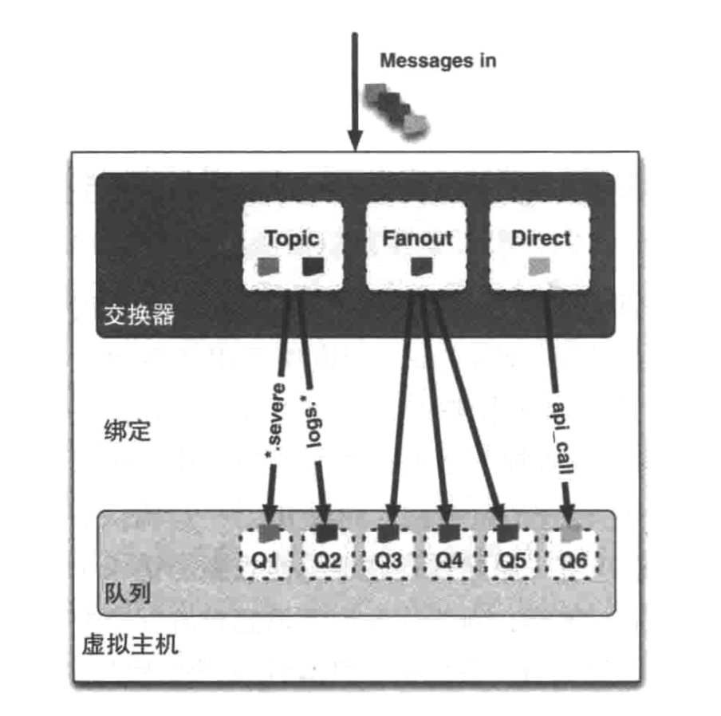

# 安装配置


## 管理界面

默认用户名密码 guest


## 配置rabbitmq账号密码

执行以下命令：

```shell
$ rabbitmq-plugins enable rabbitmq_management
```


添加新用户：

```shell
$ rabbitmqctl add_user admin admin
```


这里添加的用户名和密码为 admin

添加用户标签（超级管理员）：

```shell
$ rabbitmqctl set_user_tags admin administrator
```


添加成功后可以执行以下命令查看当前的用户列表：

```shell
$ rabbitmqctl list_users
```


访问网页：

```
http://localhost:15672/ 使用默认账号：guest/guest
```


## 常见操作

```shell
$ service rabbitmq-server start #启动
$ rabbitmq-server -detached   #后台运行rabbitmq

$ service rabbitmq-server stop #停止

$ service rabbitmq-server restart #重启

$ service rabbitmq-server status #查看状态

$ service rabbitmq-server etc #查看有哪些命令可以使用

$ rabbitmq-plugins enable rabbitmq_management   #启动后台管理

$ rabbitmqctl status # 查看状态

$ rabbitmq-pluginsenable xxx # 开启某个插件
$ rabbitmq-pluginsdisablexxx # 关闭某个插件

$ rabbitmqctl list_bindings # 查看绑定
$ rabbitmqctl list_exchanges # 查看交换器
$ rabbitmqctl list_queues # 查看已声明的队列
```

## 模拟器

http://tryrabbitmq.com/

# AMQP 相关概念


## 信道

如果项目需要发布消息，那么必须要链接到 RabbitMQ，而项目与 RabbitMQ之间使用 TCP 连接，假如每次发布消息都要连接TCP，这不仅会造成连接资源严重浪费，还会造成服务器性能瓶颈，所以 RabbitMQ 为所有的线程只用一条 TCP 连接，怎么实现的呢？RabbitMQ 引入了信道的概念，所有需要发布消息的线程都包装成一条信道在 TCP 中传输，理论上 一条 TCP 连接支持无限多个信道，模型如下：


## 队列

消息队列，用来保存消息直到发送给消费者。它是消息的容器，也是消息的终点。一个消息可投入一个或多个队列。消息一直在队列里面，等待消费者连接到这个队列将其取走。

## 绑定

绑定，用于消息队列和交换器之间的关联。一个绑定就是基于路由键将交换器和消息队列连接起来的路由规则，所以可以将交换器理解成一个由绑定构成的路由表



## 交换器

我们向 RabbitMQ 发送消息，实际上是把消息发到交换器了，再由交换器根据相关路由规则发到特定队列上，在队列上监听的消费者就可以进行消费了，目前 RabbitMQ 共四种类型：direct、fanout、topic、headers 。

headers 匹配 AMQP 消息的 header 而不是路由键，此外 headers 交换器和 direct 交换器完全一致，但性能差很多，目前几乎用不到了，所以直接看另外三种类型：

### direct交换器

消息中的路由键（routing key）如果和 Binding 中的 binding key 一致， 交换器就将消息发到对应的队列中。路由键与队列名完全匹配，如果一个队列绑定到交换机要求路由键为“dog”，则只转发 routing key 标记为“dog”的消息，不会转发“dog.puppy”，也不会转发“dog.guard”等等。它是完全匹配、单播的模式。

### fanout交换器

每个发送到 fanout 交换器中的消息，他不会去匹配路由键，直接把消息投递到所有绑定到 fanout 交换器中的队列上，它就像一个广播站一样，它会向所有收听广播的用户发送消息。对应到系统上，它允许你针对一个消息作不同操作，比如用户上传了一张新的图片，系统要同时对这个事件进行不同的操作，比如删除旧的图片缓存、增加积分奖励等等。这样就大大降低了系统之间的耦合度了。

### topic交换器

topic 交换器有点类似于 direct 交换器，它通过模式匹配分配消息的路由键属性，将路由键和某个模式进行匹配，此时队列需要绑定到一个模式上。它将路由键和绑定键的字符串切分成单词，这些单词之间用点隔开。它同样也会识别两个通配符：符号“#”和符号"* " 。#匹配0个或多个单词，*匹配不多不少一个单词。

# RabbitMQ工作模式

## simple模式（即最简单的收发模式）


```java
import com.rabbitmq.client.Connection;
import com.rabbitmq.client.ConnectionFactory;

import java.io.IOException;
import java.util.concurrent.TimeoutException;

public class ConnectionUtils {
    /**
     * 连接器
     * @return
     * @throws IOException
     * @throws TimeoutException
     */
    public static Connection getConnection() throws IOException, TimeoutException {
        ConnectionFactory factory = new ConnectionFactory();
        factory.setHost("127.0.0.1");
        factory.setPort(5672);
        factory.setVirtualHost("/vhost_mmr");
        factory.setUsername("user_mmr");
        factory.setPassword("sowhat");
        Connection connection = factory.newConnection();
        return connection;
    }
}
```


```java
import com.rabbitmq.client.AMQP;
import com.rabbitmq.client.Channel;
import com.rabbitmq.client.Connection;
import com.sowhat.mq.util.ConnectionUtils;

import java.io.IOException;
import java.util.concurrent.TimeoutException;

public class Send {
    public static final String QUEUE_NAME = "test_simple_queue";

    public static void main(String[] args) throws IOException, TimeoutException {
        // 获取一个连接
        Connection connection = ConnectionUtils.getConnection();
        // 从连接获取一个通道
        Channel channel = connection.createChannel();
        // 创建队列声明
        AMQP.Queue.DeclareOk declareOk = channel.queueDeclare(QUEUE_NAME, false, false, false, null);

        String msg = "hello Simple";
        // exchange，队列，参数，消息字节体
        channel.basicPublish("", QUEUE_NAME, null, msg.getBytes());

        System.out.println("--send msg:" + msg);

        channel.close();

        connection.close();

    }
}
```


```java
import com.rabbitmq.client.*;
import com.sowhat.mq.util.ConnectionUtils;

import java.io.IOException;
import java.util.concurrent.TimeoutException;

/**
 * 消费者获取消息
 */
public class Recv {
    public static void main(String[] args) throws IOException, TimeoutException, InterruptedException {
        newApi();
        oldApi();
    }

    private static void newApi() throws IOException, TimeoutException {
        // 创建连接
        Connection connection = ConnectionUtils.getConnection();
        // 创建频道
        Channel channel = connection.createChannel();
        // 队列声明  队列名，是否持久化，是否独占模式，无消息后是否自动删除，消息携带参数
        channel.queueDeclare(Send.QUEUE_NAME,false,false,false,null);
        // 定义消费者
        DefaultConsumer defaultConsumer = new DefaultConsumer(channel) {
            @Override  // 事件模型，消息来了会触发该函数
            public void handleDelivery(String consumerTag, Envelope envelope, AMQP.BasicProperties properties, byte[] body) throws IOException {
                String s = new String(body, "utf-8");
                System.out.println("---new api recv:" + s);
            }
        };
        // 监听队列
        channel.basicConsume(Send.QUEUE_NAME,true,defaultConsumer);
    }

    // 老方法 消费者 MQ 在3。4以下 用次方法，
    private static void oldApi() throws IOException, TimeoutException, InterruptedException {
        // 创建连接
        Connection connection = ConnectionUtils.getConnection();
        // 创建频道
        Channel channel = connection.createChannel();
        // 定义队列消费者
        QueueingConsumer consumer = new QueueingConsumer(channel);
        //监听队列
        channel.basicConsume(Send.QUEUE_NAME, true, consumer);
        while (true) {
            // 发货体
            QueueingConsumer.Delivery delivery = consumer.nextDelivery();
            byte[] body = delivery.getBody();
            String s = new String(body);
            System.out.println("---Recv:" + s);
        }
    }
}
```


## WorkQueue 工作队列

Simple队列中只能一一对应的生产消费，实际开发中生产者发消息很简单，而消费者要跟业务结合，消费者接受到消息后要处理从而会耗时。**「可能会出现队列中出现消息积压」**。所以如果多个消费者可以加速消费。


RabbitMQ有两种对队列长度的限制方式

- 对队列中消息的条数进行限制 `x-max-length`
- 对队列中消息的总量进行限制 `x-max-length-bytes`


### round robin 轮询分发

消费者1 跟消费者2 处理的数据量完全一样的个数：消费者1:处理偶数 消费者2:处理奇数 这种方式叫`轮询分发(round-robin)`结果就是不管两个消费者谁忙，**「数据总是你一个我一个」**，MQ 给两个消费发数据的时候是不知道消费者性能的，默认就是雨露均沾。此时 autoAck = true。


```java
import com.rabbitmq.client.AMQP;
import com.rabbitmq.client.Channel;
import com.rabbitmq.client.Connection;
import com.sowhat.mq.util.ConnectionUtils;

import java.io.IOException;
import java.util.concurrent.TimeoutException;

public class Send {
    public static final String  QUEUE_NAME = "test_work_queue";
    public static void main(String[] args) throws IOException, TimeoutException, InterruptedException {
        // 获取连接
        Connection connection = ConnectionUtils.getConnection();
        // 获取 channel
        Channel channel = connection.createChannel();
        // 声明队列
        AMQP.Queue.DeclareOk declareOk = channel.queueDeclare(QUEUE_NAME, false, false, false, null);
        for (int i = 0; i <50 ; i++) {
            String msg = "hello-" + i;
            System.out.println("WQ send " + msg);
            channel.basicPublish("",QUEUE_NAME,null,msg.getBytes());
            Thread.sleep(i*20);
        }
        channel.close();
        connection.close();
    }
}
```


```java
import com.rabbitmq.client.*;
import com.sowhat.mq.util.ConnectionUtils;

import java.io.IOException;
import java.util.concurrent.TimeoutException;

public class Recv1 {
    public static void main(String[] args) throws IOException, TimeoutException {
        // 获取连接
        Connection connection = ConnectionUtils.getConnection();
        // 获取通道
        Channel channel = connection.createChannel();
        // 声明队列
        channel.queueDeclare(Send.QUEUE_NAME, false, false, false, null);
        //定义消费者
        DefaultConsumer consumer = new DefaultConsumer(channel) {

            @Override // 事件触发机制
            public void handleDelivery(String consumerTag, Envelope envelope, AMQP.BasicProperties properties, byte[] body) throws IOException {
                String s = new String(body, "utf-8");
                System.out.println("【1】：" + s);
                try {
                    Thread.sleep(2000);
                } catch (InterruptedException e) {
                    e.printStackTrace();
                } finally {
                    System.out.println("【1】 done");
                }
            }
        };
        boolean autoAck = true;
        channel.basicConsume(Send.QUEUE_NAME, autoAck, consumer);
    }
}

import com.rabbitmq.client.*;
import com.sowhat.mq.util.ConnectionUtils;

import java.io.IOException;
import java.util.concurrent.TimeoutException;

public class Recv2 {
    public static void main(String[] args) throws IOException, TimeoutException {
        // 获取连接
        Connection connection = ConnectionUtils.getConnection();
        // 获取通道
        Channel channel = connection.createChannel();
        // 声明队列
        channel.queueDeclare(Send.QUEUE_NAME, false, false, false, null);
        //定义消费者
        DefaultConsumer consumer = new DefaultConsumer(channel) {

            @Override // 事件触发机制
            public void handleDelivery(String consumerTag, Envelope envelope, AMQP.BasicProperties properties, byte[] body) throws IOException {
                String s = new String(body, "utf-8");
                System.out.println("【2】：" + s);
                try {
                    Thread.sleep(1000 );
                } catch (InterruptedException e) {
                    e.printStackTrace();
                } finally {
                    System.out.println("【2】 done");
                }
            }
        };
        boolean autoAck = true;
        channel.basicConsume(Send.QUEUE_NAME, autoAck, consumer);
    }
}
```


### 公平分发 fair dipatch

如果要实现`公平分发`，要让消费者消费完毕一条数据后就告知MQ，再让MQ发数据即可。自动应答要关闭！

```java
import com.rabbitmq.client.AMQP;
import com.rabbitmq.client.Channel;
import com.rabbitmq.client.Connection;
import com.sowhat.mq.util.ConnectionUtils;

import java.io.IOException;
import java.util.concurrent.TimeoutException;

public class Send {
    public static final String  QUEUE_NAME = "test_work_queue";
    public static void main(String[] args) throws IOException, TimeoutException, InterruptedException {
        // 获取连接
        Connection connection = ConnectionUtils.getConnection();
        // 获取 channel
        Channel channel = connection.createChannel();
        // s声明队列
        AMQP.Queue.DeclareOk declareOk = channel.queueDeclare(QUEUE_NAME, false, false, false, null);

        // 每个消费者发送确认消息之前，消息队列不发送下一个消息到消费者，一次只发送一个消息
        // 从而限制一次性发送给消费者的消息不得超过1个。
        int perfetchCount = 1;
        channel.basicQos(perfetchCount);

        for (int i = 0; i <50 ; i++) {
            String msg = "hello-" + i;
            System.out.println("WQ send " + msg);
            channel.basicPublish("",QUEUE_NAME,null,msg.getBytes());
            Thread.sleep(i*20);
        }
        channel.close();
        connection.close();
    }
}
```


```java
import com.rabbitmq.client.*;
import com.sowhat.mq.util.ConnectionUtils;

import java.io.IOException;
import java.util.concurrent.TimeoutException;

public class Recv1 {
    public static void main(String[] args) throws IOException, TimeoutException {
        // 获取连接
        Connection connection = ConnectionUtils.getConnection();
        // 获取通道
        final Channel channel = connection.createChannel();
        // 声明队列
        channel.queueDeclare(Send.QUEUE_NAME, false, false, false, null);
        // 保证一次只分发一个
        channel.basicQos(1);
        //定义消费者
        DefaultConsumer consumer = new DefaultConsumer(channel) {

            @Override // 事件触发机制
            public void handleDelivery(String consumerTag, Envelope envelope, AMQP.BasicProperties properties, byte[] body) throws IOException {
                String s = new String(body, "utf-8");
                System.out.println("【1】：" + s);
                try {
                    Thread.sleep(2000);
                } catch (InterruptedException e) {
                    e.printStackTrace();
                } finally {
                    System.out.println("【1】 done");
                    // 手动回执
                    channel.basicAck(envelope.getDeliveryTag(),false);
                }
            }
        };
        // 自动应答
        boolean autoAck = false;
        channel.basicConsume(Send.QUEUE_NAME, autoAck, consumer);
    }
}
```


```java
import com.rabbitmq.client.*;
import com.sowhat.mq.util.ConnectionUtils;

import java.io.IOException;
import java.util.concurrent.TimeoutException;

public class Recv2 {
    public static void main(String[] args) throws IOException, TimeoutException {
        // 获取连接
        Connection connection = ConnectionUtils.getConnection();
        // 获取通道
        final Channel channel = connection.createChannel();
        // 声明队列
        channel.queueDeclare(Send.QUEUE_NAME, false, false, false, null);
        // 保证一次只分发一个
        channel.basicQos(1);
        //定义消费者
        DefaultConsumer consumer = new DefaultConsumer(channel) {

            @Override // 事件触发机制
            public void handleDelivery(String consumerTag, Envelope envelope, AMQP.BasicProperties properties, byte[] body) throws IOException {
                String s = new String(body, "utf-8");
                System.out.println("【2】：" + s);
                try {
                    Thread.sleep(1000);
                } catch (InterruptedException e) {
                    e.printStackTrace();
                } finally {
                    System.out.println("【2】 done");
                    // 手动回执
                    channel.basicAck(envelope.getDeliveryTag(),false);
                }
            }
        };
        // 自动应答
        boolean autoAck = false;
        channel.basicConsume(Send.QUEUE_NAME, autoAck, consumer);
    }
}
```


## publish/subscribe 发布订阅模式

1. 一个生产者多个消费者
2. 每一个消费者都有一个自己的队列
3. 生产者没有把消息直接发送到队列而是发送到了`交换机转化器(exchange)`。
4. 每一个队列都要绑定到交换机上。
5. 生产者发送的消息经过交换机到达队列，从而实现一个消息被多个消费者消费。

### routing 路由选择 通配符模式

Exchange(交换机，转发器)：**「一方面接受生产者消息，另一方面是向队列推送消息」**。匿名转发用 ""  表示，比如前面到简单队列跟WorkQueue。

`fanout`：不处理路由键。**「不需要指定routingKey」**，我们只需要把队列绑定到交换机， **「消息就会被发送到所有到队列中」**。

`direct`：处理路由键，**「需要指定routingKey」**，此时生产者发送数据的时候会指定key，任务队列也会指定key，只有key一样消息才会被传送到队列中。

如下图


`Topics` 主题：将路由键跟某个模式匹配，# 表示匹配 >=1个字符， *表示匹配一个。生产者会带routingKey，但是消费者的MQ会带模糊routingKey。


# 客户端

```xml
<dependency>
    <groupId>com.rabbitmq</groupId>
    <artifactId>amqp-client</artifactId>
    <version>4.11.1</version>
</dependency>
```

生产者

```java
public class Producer {

    public static void main(String[] argv) throws Exception {
        //创建连接工厂
        ConnectionFactory factory = new ConnectionFactory();
        factory.setUsername("guest");
        factory.setPassword("guest");
        //设置 RabbitMQ 地址
        factory.setHost("host-application");
        //建立到代理服务器到连接
        Connection conn = factory.newConnection();
        //获得信道
        Channel channel = conn.createChannel();
        //声明交换器
        String exchangeName = "hello-exchange";
        channel.exchangeDeclare(exchangeName, "fanout", true);

        String routingKey = "hola";
        //发布消息
        byte[] messageBodyBytes = "messageBodyBytes".getBytes();
        // 设置消息过期时间
        AMQP.BasicProperties properties = new AMQP.BasicProperties.Builder()
                .deliveryMode(2) // 设置持久化
                //.expiration("6000") // 消息过期时间
                .build();
        // channel.basicPublish(exchangeName, routingKey, MessageProperties.PERSISTENT_TEXT_PLAIN, messageBodyBytes);
        channel.basicPublish(exchangeName, routingKey, properties, messageBodyBytes);

        channel.close();
        conn.close();
    }
}
```

消费者

```java
public class Consumer {

    public static void main(String[] argv) throws Exception {
        ConnectionFactory factory = new ConnectionFactory();
        factory.setUsername("guest");
        factory.setPassword("guest");
        factory.setHost("host-application");
        //建立到代理服务器到连接
        Connection conn = factory.newConnection();
        //获得信道
        final Channel channel = conn.createChannel();
        //声明交换器
        String exchangeName = "hello-exchange";
        channel.exchangeDeclare(exchangeName, "fanout", true);
        //声明队列
        String queueName = "hello-queue";
        // 设置队列过期属性
//        Map<String, Object> args = new HashMap<String, Object>(4){{
//            put("vhost", "/");
//            put("username","guest");
//            put("password", "guest");
//            // 过期时间
//            put("x-message-ttl",6000);
//        }};
        channel.queueDeclare(queueName, true, false, false, null).getQueue();
        System.out.println("声明队列名称：" + queueName);
        String routingKey = "hola";
        //绑定队列，通过键 hola 将队列和交换器绑定起来
        channel.queueBind(queueName, exchangeName, routingKey);

        while (true) {
            //消费消息
            boolean autoAck = false;
            String consumerTag = "";
            channel.basicConsume(queueName, autoAck, consumerTag, new DefaultConsumer(channel) {
                @Override
                public void handleDelivery(String consumerTag, Envelope envelope,
                                           AMQP.BasicProperties properties, byte[] body) throws IOException {
                    String routingKey = envelope.getRoutingKey();
                    String contentType = properties.getContentType();
                    System.out.println("消费的路由键：" + routingKey);
                    System.out.println("消费的内容类型：" + contentType);
                    long deliveryTag = envelope.getDeliveryTag();
                    //确认消息
                    channel.basicAck(deliveryTag, false);
                    System.out.println("消费的消息体内容：");
                    String bodyStr = new String(body, "UTF-8");
                    System.out.println(bodyStr);
                }
            });
        }
    }
}
```

# 死信队列

死信队列：没有被及时消费的消息存放的队列，消息没有被及时消费有以下几点原因：

**a.消费者拒绝消息（channel.basicNack/channel.basicReject）并且不再重新投递 requeue=false**

**b.TTL(time-to-live)：消息在队列的存活时间超过设置的TTL时间**

**c.消息队列的消息数量已经超过最大队列长度**

> 消息变成死信后，会被重新投递（publish）到另一个交换机上（Exchange）,这个交换机往往被称为DLX(dead-letter-exchange)“死信交换机”，然后交换机根据绑定规则转发到对应的队列上，监听该队列就可以被重新消费。
>
> 生产者-->发送消息-->交换机-->队列-->变成死信队列-->DLX交换机-->队列-->监听-->消费者

```java
args.put("x-dead-letter-exchange", "some-exchange-name");
args.put("x-dead-letter-routing-key", "some-rounting-key");
channel.queueDeclare(queueName, true, false, false, args);
```

## 如何配置死信队列

1. 配置业务队列，绑定到业务交换机上
2. 为业务队列配置死信交换机和路由key
3. 为死信交换机配置死信队列

注意：并不是直接声明一个公共的死信队列，然后所以死信消息就自己跑到死信队列里去了。而是为每个需要使用死信的业务队列配置一个死信交换机，这里同一个项目的死信交换机可以共用一个，然后为每个业务队列分配一个单独的路由key。


有了死信交换机和路由key后，接下来，就像配置业务队列一样，配置死信队列，然后绑定在死信交换机上。也就是说，死信队列并不是什么特殊的队列，只不过是绑定在死信交换机上的队列。死信交换机也不是什么特殊的交换机，只不过是用来接受死信的交换机，所以可以为任何类型【Direct、Fanout、Topic】。一般来说，会为每个业务队列分配一个独有的路由key，并对应的配置一个死信队列进行监听，也就是说，一般会为每个重要的业务队列配置一个死信队列。


创建一个Springboot项目。然后在pom文件中添加 `spring-boot-starter-amqp` 和 `spring-boot-starter-web` 的依赖，接下来创建一个Config类

```java
@Configuration
public class RabbitMQConfig {
    public static final String BUSINESS_EXCHANGE_NAME = "dead.letter.demo.simple.business.exchange";
    public static final String BUSINESS_QUEUEA_NAME = "dead.letter.demo.simple.business.queuea";
    public static final String BUSINESS_QUEUEB_NAME = "dead.letter.demo.simple.business.queueb";
    public static final String DEAD_LETTER_EXCHANGE = "dead.letter.demo.simple.deadletter.exchange";
    public static final String DEAD_LETTER_QUEUEA_ROUTING_KEY = "dead.letter.demo.simple.deadletter.queuea.routingkey";
    public static final String DEAD_LETTER_QUEUEB_ROUTING_KEY = "dead.letter.demo.simple.deadletter.queueb.routingkey";
    public static final String DEAD_LETTER_QUEUEA_NAME = "dead.letter.demo.simple.deadletter.queuea";
    public static final String DEAD_LETTER_QUEUEB_NAME = "dead.letter.demo.simple.deadletter.queueb";
    
    // 声明业务Exchange 
    @Bean("businessExchange")
    public FanoutExchange businessExchange() {
        return new FanoutExchange(BUSINESS_EXCHANGE_NAME);
    }

    // 声明死信Exchange 
    @Bean("deadLetterExchange")
    public DirectExchange deadLetterExchange() {
        return new DirectExchange(DEAD_LETTER_EXCHANGE);
    }

    // 声明业务队列A 
    @Bean("businessQueueA")
    public Queue businessQueueA() {
        Map<String, Object> args = new HashMap<>(2);
        // x-dead-letter-exchange 这里声明当前队列绑定的死信交换机 
        args.put("x-dead-letter-exchange", DEAD_LETTER_EXCHANGE);
        // x-dead-letter-routing-key 这里声明当前队列的死信路由key 
        args.put("x-dead-letter-routing-key", DEAD_LETTER_QUEUEA_ROUTING_KEY);
        return QueueBuilder.durable(BUSINESS_QUEUEA_NAME).withArguments(args).build();
    }

    // 声明业务队列B 
    @Bean("businessQueueB") 
    public Queue businessQueueB() {
        Map<String, Object> args = new HashMap<>(2);
        // x-dead-letter-exchange 这里声明当前队列绑定的死信交换机 
        args.put("x-dead-letter-exchange", DEAD_LETTER_EXCHANGE);
        // x-dead-letter-routing-key 这里声明当前队列的死信路由key 
        args.put("x-dead-letter-routing-key", DEAD_LETTER_QUEUEB_ROUTING_KEY);
        return QueueBuilder.durable(BUSINESS_QUEUEB_NAME).withArguments(args).build();
    }

    // 声明死信队列A 
    @Bean("deadLetterQueueA") 
    public Queue deadLetterQueueA() {
        return new Queue(DEAD_LETTER_QUEUEA_NAME);
    }

    // 声明死信队列B 
    @Bean("deadLetterQueueB")
    public Queue deadLetterQueueB() {
        return new Queue(DEAD_LETTER_QUEUEB_NAME);
    }

    // 声明业务队列A绑定关系 
    @Bean
    public Binding businessBindingA(@Qualifier("businessQueueA") Queue queue, @Qualifier("businessExchange") FanoutExchange exchange) {
        return BindingBuilder.bind(queue).to(exchange);
    }

    // 声明业务队列B绑定关系 
    @Bean
    public Binding businessBindingB(@Qualifier("businessQueueB") Queue queue, @Qualifier("businessExchange") FanoutExchange exchange) {
        return BindingBuilder.bind(queue).to(exchange);
    }

    // 声明死信队列A绑定关系 
    @Bean
    public Binding deadLetterBindingA(@Qualifier("deadLetterQueueA") Queue queue, @Qualifier("deadLetterExchange") DirectExchange exchange) {
        return BindingBuilder.bind(queue).to(exchange).with(DEAD_LETTER_QUEUEA_ROUTING_KEY);
    }

    // 声明死信队列B绑定关系 
    @Bean
    public Binding deadLetterBindingB(@Qualifier("deadLetterQueueB") Queue queue, @Qualifier("deadLetterExchange") DirectExchange exchange) {
        return BindingBuilder.bind(queue).to(exchange).with(DEAD_LETTER_QUEUEB_ROUTING_KEY);
    }
}
```

这里声明了两个Exchange，一个是业务Exchange，另一个是死信Exchange，业务Exchange下绑定了两个业务队列，业务队列都配置了同一个死信Exchange，并分别配置了路由key，在死信Exchange下绑定了两个死信队列，设置的路由key分别为业务队列里配置的路由key。

下面是配置文件application.yml：

```yaml
spring: 
	rabbitmq: 
		host: localhost 
        password: guest 
        username: guest 
        listener: 
            type: simple 
            simple: default-requeue-rejected: false 
            acknowledge-mode: manual
```

接下来，是业务队列的消费代码：

```java
@Slf4j
@Component
public class BusinessMessageReceiver {
    
    @RabbitListener(queues = BUSINESS_QUEUEA_NAME)
    public void receiveA(Message message, Channel channel) throws IOException {
        String msg = new String(message.getBody());
        log.info("收到业务消息A：{}", msg);
        boolean ack = true;
        Exception exception = null;
        try {
            if (msg.contains("deadletter")) {
                throw new RuntimeException("dead letter exception");
            }
        } catch (Exception e) {
            ack = false;
            exception = e;
        }
        if (!ack) {
            log.error("消息消费发生异常，error msg:{}", exception.getMessage(), exception);
            channel.basicNack(message.getMessageProperties().getDeliveryTag(), false, false);
        } else {
            channel.basicAck(message.getMessageProperties().getDeliveryTag(), false);
        }
    }

    @RabbitListener(queues = BUSINESS_QUEUEB_NAME)
    public void receiveB(Message message, Channel channel) throws IOException {
        System.out.println("收到业务消息B：" + new String(message.getBody()));
        channel.basicAck(message.getMessageProperties().getDeliveryTag(), false);
    }
}
```

然后配置死信队列的消费者

```java
@Component
public class DeadLetterMessageReceiver {
    @RabbitListener(queues = DEAD_LETTER_QUEUEA_NAME)
    public void receiveA(Message message, Channel channel) throws IOException {
        System.out.println("收到死信消息A：" + new String(message.getBody()));
        log.info("死信消息properties：{}", message.getMessageProperties());
        channel.basicAck(message.getMessageProperties().getDeliveryTag(), false);
    }

    @RabbitListener(queues = DEAD_LETTER_QUEUEB_NAME)
    public void receiveB(Message message, Channel channel) throws IOException {
        System.out.println("收到死信消息B：" + new String(message.getBody()));
        log.info("死信消息properties：{}", message.getMessageProperties());
        channel.basicAck(message.getMessageProperties().getDeliveryTag(), false);
    }
}
```

最后，写一个简单的消息生产者，并通过controller层来生产消息。

```java
@Component
public class BusinessMessageSender {
    @Autowired
    private RabbitTemplate rabbitTemplate;

    public void sendMsg(String msg) {
        rabbitTemplate.convertSendAndReceive(BUSINESS_EXCHANGE_NAME, "", msg);
    }
}
```

```java
@RequestMapping("rabbitmq")
@RestController
public class RabbitMQMsgController {
    @Autowired
    private BusinessMessageSender sender;

    @RequestMapping("sendmsg")
    public void sendMsg(String msg) {
        sender.sendMsg(msg);
    }
}
```


```shell
$ curl http://localhost:8080/rabbitmq/sendmsg?msg=msg
```

```log
收到业务消息A：msg
收到业务消息B：msg
```

```shell
$ curl http://localhost:8080/rabbitmq/sendmsg?msg=deadletter
```

这将会触发业务队列A的NCK，按照预期，消息被NCK后，会抛到死信队列中，因此死信队列将会出现这个消息，日志如下：

```log
收到业务消息A：deadletter 
消息消费发生异常，error msg:dead letter exception 
java.lang.RuntimeException: dead letter exception
...
收到死信消息A：deadletter
```

## 死信消息的变化

“死信”被丢到死信队列中后，会发生什么变化

如果队列配置了参数 `x-dead-letter-routing-key` 的话，“死信”的路由key将会被替换成该参数对应的值。如果没有设置，则保留该消息原有的路由key。

举个栗子：

如果原有消息的路由key是`testA`，被发送到业务Exchage中，然后被投递到业务队列QueueA中，如果该队列没有配置参数`x-dead-letter-routing-key`，则该消息成为死信后，将保留原有的路由key`testA`，如果配置了该参数，并且值设置为`testB`，那么该消息成为死信后，路由key将会被替换为`testB`，然后被抛到死信交换机中。

另外，由于被抛到了死信交换机，所以消息的Exchange Name也会被替换为死信交换机的名称。

消息的Header中，也会添加很多奇奇怪怪的字段：

```log
死信消息properties：MessageProperties [headers={x-first-death-exchange=dead.letter.demo.simple.business.exchange, x-death=[{reason=rejected, count=1, exchange=dead.letter.demo.simple.business.exchange, time=Sun Jul 14 16:48:16 CST 2019, routing-keys=[], queue=dead.letter.demo.simple.business.queuea}], x-first-death-reason=rejected, x-first-death-queue=dead.letter.demo.simple.business.queuea}, correlationId=1, replyTo=amq.rabbitmq.reply-to.g2dkABZyYWJiaXRAREVTS1RPUC1DUlZGUzBOAAAPQAAAAAAB.bLbsdR1DnuRSwiKKmtdOGw==, contentType=text/plain, contentEncoding=UTF-8, contentLength=0, receivedDeliveryMode=PERSISTENT, priority=0, redelivered=false, receivedExchange=dead.letter.demo.simple.deadletter.exchange, receivedRoutingKey=dead.letter.demo.simple.deadletter.queuea.routingkey, deliveryTag=1, consumerTag=amq.ctag-NSp18SUPoCNvQcoYoS2lPg, consumerQueue=dead.letter.demo.simple.deadletter.queuea]
```

| 字段名                 | 含义                                                         |
| :--------------------- | :----------------------------------------------------------- |
| x-first-death-exchange | 第一次被抛入的死信交换机的名称                               |
| x-first-death-reason   | 第一次成为死信的原因，`rejected`：消息在重新进入队列时被队列拒绝，由于`default-requeue-rejected` 参数被设置为`false`。`expired` ：消息过期。`maxlen` ： 队列内消息数量超过队列最大容量 |
| x-first-death-queue    | 第一次成为死信前所在队列名称                                 |
| x-death                | 历次被投入死信交换机的信息列表，同一个消息每次进入一个死信交换机，这个数组的信息就会被更新 |

## 死信队列应用场景

一般用在较为重要的业务队列中，确保未被正确消费的消息不被丢弃，一般发生消费异常可能原因主要有由于消息信息本身存在错误导致处理异常，处理过程中参数校验异常，或者因网络波动导致的查询异常等等，当发生异常时，通过配置死信队列，可以让未正确处理的消息暂存到另一个队列中，待后续排查清楚问题后，编写相应的处理代码来处理死信消息，这样比手工恢复数据要好太多了。

## 总结

死信队列其实并没有什么神秘的地方，不过是绑定在死信交换机上的普通队列，而死信交换机也只是一个普通的交换机，不过是用来专门处理死信的交换机。
来源: 弗兰克的猫

死信消息的生命周期：

1. 业务消息被投入业务队列
2. 消费者消费业务队列的消息，由于处理过程中发生异常，于是进行了nck或者reject操作
3. 被nck或reject的消息由RabbitMQ投递到死信交换机中
4. 死信交换机将消息投入相应的死信队列
5. 死信队列的消费者消费死信消息

# 延迟队列

延时消息就是指当消息被发送以后，并不想让消费者立即拿到消息，而是等待指定时间后，消费者才拿到这个消息进行消费。

## 实现

延迟队列，我们可以通过死信交换机来完成。

生产者发送消息，定义2S后消息过期，消息就回进入死信交换机，最后进到死信队列；消费者可以从死信队列获取消息，这样就可以得到延迟后的消息。

当然，还可以安装启用延迟插件。

```shell
$ rabbitmq-plugins enable rabbitmq_delayed_message_exchange
```

## 作用

- **订单业务：** 在电商/点餐中，都有下单后 30 分钟内没有付款，就自动取消订单。
- **短信通知：** 下单成功后 60s 之后给用户发送短信通知。
- **失败重试：** 业务操作失败后，间隔一定的时间进行失败重试。

这类业务的特点就是：非实时的，需要延迟处理，需要进行失败重试。一种比较笨的方式是采用定时任务，轮训数据库，方法简单好用，但性能底下，在高并发情况下容易弄死数据库，间隔时间不好设置，时间过大，影响精度，过小影响性能，而且做不到按超时的时间顺序处理。另一种就是用Java中的DelayQueue 位于java.util.concurrent包下，本质是由PriorityQueue和BlockingQueue实现的阻塞优先级队列，这个最大的问题就是不支持分布式与持久化。


# HA

# 持久化

消息的可靠性是RabbitMQ的一大特色，那么RabbitMQ是如何保证消息可靠性的呢——消息持久化。

为了保证RabbitMQ在退出或者crash等异常情况下数据没有丢失，需要将queue，exchange和Message都持久化。

## queue的持久化

queue的持久化是通过`durable=true`来实现的。

```java
Connection connection = connectionFactory.newConnection();
Channel channel = connection.createChannel();
// 第二个参数设置为true,即durable=true.
channel.queueDeclare("queue.persistent.name", true, false, false, null);
```

源码

```java
/**
     * Declare a queue
     * @see com.rabbitmq.client.AMQP.Queue.Declare
     * @see com.rabbitmq.client.AMQP.Queue.DeclareOk
     * @param queue the name of the queue
     * @param durable true if we are declaring a durable queue (the queue will survive a server restart)
     * @param exclusive true if we are declaring an exclusive queue (restricted to this connection)
     * @param autoDelete true if we are declaring an autodelete queue (server will delete it when no longer in use)
     * @param arguments other properties (construction arguments) for the queue
     * @return a declaration-confirm method to indicate the queue was successfully declared
     * @throws java.io.IOException if an error is encountered
     
     durable:
     	是否持久化
     
     exclusive：
     	排他队列，如果一个队列被声明为排他队列，该队列仅对首次申明它的连接可见，并在连接断开时自动删除。
     	这里需要注意三点：
     		1.排他队列是基于连接可见的，同一连接的不同信道是可以同时访问同一连接创建的排他队列；
     		2.“首次”，如果一个连接已经声明了一个排他队列，其他连接是不允许建立同名的排他队列的，这个与普通队列不同；
     		3.即使该队列是持久化的，一旦连接关闭或者客户端退出，该排他队列都会被自动删除的，这种队列适用于一个客户端发送读取消息的应用场景
     		
     autoDelete：
     	自动删除，如果该队列没有任何订阅的消费者的话，该队列会被自动删除。这种队列适用于临时队列。
     */
    Queue.DeclareOk queueDeclare(String queue, boolean durable, boolean exclusive, boolean autoDelete,
                                 Map<String, Object> arguments) throws IOException;


    Queue.DeclareOk queueDeclare() throws IOException;
    Queue.DeclareOk queueDeclare(String queue, boolean durable, boolean exclusive, boolean autoDelete,
                                     Map<String, Object> arguments) throws IOException;
    void queueDeclareNoWait(String queue, boolean durable, boolean exclusive, boolean autoDelete,
                                Map<String, Object> arguments) throws IOException;
	// 可以用来检测一个queue是否已经存在。如果该队列存在，则会返回true；如果不存在，就会返回异常，但是不会创建新的队列。
    Queue.DeclareOk queueDeclarePassive(String queue) throws IOException;
```

## 消息的持久化

如过将queue的持久化标识durable设置为true,则代表是一个持久的队列，那么在服务重启之后，也会存在，因为服务会把持久化的queue存放在硬盘上，当服务重启的时候，会重新加载之前被持久化的queue。

队列是可以被持久化，但是里面的消息是否为持久化那还要看消息的持久化设置。也就是说，重启之前那个queue里面还没有发出去的消息的话，重启之后那队列里面是不是还存在原来的消息，这个就要取决于发生在发送消息时对消息的设置了。

如果要在重启后保持消息的持久化必须设置消息是持久化的标识。

```java
channel.basicPublish("exchange.persistent", "persistent", MessageProperties.PERSISTENT_TEXT_PLAIN, "persistent_test_message".getBytes());
```

关键是：`MessageProperties.PERSISTENT_TEXT_PLAIN`

源码

```java
void basicPublish(String exchange, String routingKey, BasicProperties props, byte[] body) throws IOException;
void basicPublish(String exchange, String routingKey, boolean mandatory, BasicProperties props, byte[] body)
        throws IOException;
void basicPublish(String exchange, String routingKey, boolean mandatory, boolean immediate, BasicProperties props, byte[] body)
        throws IOException;
```

```java
public BasicProperties(
            String contentType,//消息类型如：text/plain
            String contentEncoding,//编码
            Map<String,Object> headers,
            Integer deliveryMode,//1:nonpersistent 2:persistent // deliveryMode=1代表不持久化，deliveryMode=2代表持久化。
            Integer priority,//优先级
            String correlationId,
            String replyTo,//反馈队列
            String expiration,//expiration到期时间
            String messageId,
            Date timestamp,
            String type,
            String userId,
            String appId,
            String clusterId)
```


设置了队列和消息的持久化之后，当broker服务重启的之后，消息依旧存在。单只设置队列持久化，重启之后消息会丢失；单只设置消息的持久化，重启之后队列消失，既而消息也丢失。单单设置消息持久化而不设置队列的持久化显得毫无意义。

## exchange的持久化

如果不设置exchange的持久化对消息的可靠性来说没有什么影响，但是如果exchange不设置持久化，那么当broker服务重启之后，exchange将不复存在，那么既而发送方rabbitmq producer就无法正常发送消息。所以同样应该设置exchange的持久化。

```java
Exchange.DeclareOk exchangeDeclare(String exchange, String type, boolean durable) throws IOException;
Exchange.DeclareOk exchangeDeclare(String exchange, String type, boolean durable, boolean autoDelete,
                                   Map<String, Object> arguments) throws IOException;
Exchange.DeclareOk exchangeDeclare(String exchange, String type) throws IOException;
Exchange.DeclareOk exchangeDeclare(String exchange,
                                          String type,
                                          boolean durable,
                                          boolean autoDelete,
                                          boolean internal,
                                          Map<String, Object> arguments) throws IOException;
void exchangeDeclareNoWait(String exchange,
                           String type,
                           boolean durable,
                           boolean autoDelete,
                           boolean internal,
                           Map<String, Object> arguments) throws IOException;
Exchange.DeclareOk exchangeDeclarePassive(String name) throws IOException;
```

设置

```java
// 在声明的时候将durable字段设置为true
channel.exchangeDeclare(exchangeName, “direct/topic/header/fanout”, true);
```


# 持久化番外篇

## 消息什么时候需要持久化

根据 官方介绍，RabbitMQ在两种情况下会将消息写入磁盘：

1. 消息本身在publish的时候就要求消息写入磁盘；（confirm机制）
2. 内存紧张，需要将部分内存中的消息转移到磁盘；

## 消息什么时候会刷到磁盘

1. 写入文件前会有一个Buffer，大小为1M（1048576），数据在写入文件时，首先会写入到这个Buffer，如果Buffer已满，则会将Buffer写入到文件（未必刷到磁盘）；
2. 有个固定的刷盘时间：25ms，也就是不管Buffer满不满，每隔25ms，Buffer里的数据及未刷新到磁盘的文件内容必定会刷到磁盘；
3. 每次消息写入后，如果没有后续写入请求，则会直接将已写入的消息刷到磁盘：使用Erlang的receive x after 0来实现，只要进程的信箱里没有消息，则产生一个timeout消息，而timeout会触发刷盘操作。

## 消息在磁盘文件中的格式

消息保存于`$MNESIA/msg_store_persistent/x.rdq`文件中，其中x为数字编号，从1开始，每个文件最大为16M（16777216），超过这个大小会生成新的文件，文件编号加1。消息以以下格式存在于文件中：

```
<<Size:64, MsgId:16/binary, MsgBody>>
```

MsgId为RabbitMQ通过rabbit_guid:gen()每一个消息生成的GUID，MsgBody会包含消息对应的exchange，routing_keys，消息的内容，消息对应的协议版本，消息内容格式（二进制还是其它）等等。

## 文件何时删除（垃圾回收）

PUBLISH消息时写入内容，ack消息时删除内容（更新该文件的有用数据大小），当一个文件的有用数据等于0时，删除该文件。

由于执行消息删除操作时，并不立即对在文件中对消息进行删除，也就是说消息依然在文件中，仅仅是垃圾数据而已。当垃圾数据（已经被删除的消息）比例超过一定阈值后（默认比例GARBAGE_FRACTION = 0.5即50%），并且至少有三个及以上的文件时，rabbitmq触发垃圾回收文件合并操作，以提高磁盘利用率。垃圾回收会先找到符合要求的两个文件（根据#file_summary{}中left，right找逻辑上相邻的两个文件，并且两个文件的有效数据可在一个文件中存储），然后锁定这两个文件，并先对左边文件的有效数据进行整理，再将右边文件的有效数据写入到左边文件，同时更新消息的相关信息（存储的文件，文件中的偏移量），文件的相关信息（文件的有效数据，左边文件，右边文件），最后将右边的文件删除。


# 保证消息不丢


分析RabbitMQ消息丢失的情况，不妨先看看一条消息从生产者发送到消费者消费的过程：


可以看出，一条消息整个过程要经历两次的网络传输：**从生产者发送到RabbitMQ服务器，从RabbitMQ服务器发送到消费者**。

**在消费者未消费前存储在队列(Queue)中**。

所以可以知道，有三个场景下是会发生消息丢失的：

- 存储在队列中，如果队列没有对消息持久化，RabbitMQ服务器宕机重启会丢失数据。
- 生产者发送消息到RabbitMQ服务器过程中，RabbitMQ服务器如果宕机停止服务，消息会丢失。
- 消费者从RabbitMQ服务器获取队列中存储的数据消费，但是消费者程序出错或者宕机而没有正确消费，导致数据丢失。

针对以上三种场景，RabbitMQ提供了三种解决的方式，分别是消息持久化，confirm机制，ACK事务机制。


## ACK

将queue，exchange, message等都设置了持久化之后就能保证100%保证数据不丢失了吗？不是。

首先，从consumer端来说，如果这时autoAck=true，那么当consumer接收到相关消息之后，还没来得及处理就crash掉了，那么这样也算数据丢失。

这种情况下，只需将autoAck设置为false(方法定义如下)，然后在正确处理完消息之后进行手动ack（channel.basicAck()）.

```java
String basicConsume(String queue, boolean autoAck, Consumer callback) throws IOException;
```

## 镜像队列

消息在正确存入RabbitMQ之后，还需要有一段时间（这个时间很短，但不可忽视）才能存入磁盘之中，RabbitMQ并不是为每条消息都做fsync的处理，

可能仅仅保存到cache中而不是物理磁盘上，在这段时间内RabbitMQ broker发生crash, 消息保存到cache但是还没来得及落盘，那么这些消息将会丢失。

怎么解决呢？

可以引入RabbitMQ的mirrored-queue即镜像队列，这个相当于配置了副本，当master在此特殊时间内crash掉，可以自动切换到slave，这样有效的保障了HA, 

除非整个集群都挂掉，这样也不能完全的100%保障RabbitMQ不丢消息，但比没有mirrored-queue的要好很多，很多现实生产环境下都是配置了mirrored-queue的。

## 事务机制或者Confirm机制

在producer引入事务机制或者Confirm机制来确保消息已经正确的发送至broker端

### 事务机制

```java
// 通过txSelect开启事务之后，我们便可以发布消息给broker代理服务器了，如果txCommit提交成功了，则消息一定到达了broker了;
// 如果在txCommit执行之前broker异常崩溃或者由于其他原因抛出异常，这个时候我们便可以捕获异常通过txRollback回滚事务了。
channel.txSelect();
channel.basicPublish(ConfirmConfig.exchangeName, ConfirmConfig.routingKey, MessageProperties.PERSISTENT_TEXT_PLAIN, ConfirmConfig.msg_10B.getBytes());
channel.txCommit();
```

### Confirm机制


生产者将信道channel设置成confirm模式，一旦信道进入confirm模式，所有在该信道上面发布的消息都会被指派一个唯一的ID(从1开始)，一旦消息被投递到所有匹配的队列之后，broker就会发送一个确认给生产者（包含消息的唯一ID）,这就使得生产者知道消息已经正确到达目的队列了。

<font color=#00dd00>如果消息和队列是可持久化的，那么确认消息会将消息写入磁盘之后发出</font>，broker回传给生产者的确认消息中deliver-tag域包含了确认消息的序列号，此外broker也可以设置basic.ack的multiple域，表示到这个序列号之前的所有消息都已经得到了处理。


confirm模式最大的好处在于他是异步的，一旦发布一条消息，生产者应用程序就可以在等信道返回确认的同时继续发送下一条消息，当消息最终得到确认之后，

生产者应用便可以通过回调方法来处理该确认消息，如果RabbitMQ因为自身内部错误导致消息丢失，就会发送一条nack消息，生产者应用程序同样可以在回调方

法中处理该nack消息。


在channel 被设置成 confirm 模式之后，所有被 publish 的后续消息都将被 confirm（即 ack） 或者被nack一次。但是没有对消息被 confirm 的快慢做任何保证，并且同一条消息不会既被 confirm又被nack 。


**开启confirm模式**

生产者通过调用`channel.confirmSelect()`方法将channel设置为confirm模式

## mandatory

事务机制和publisher confirm机制确保的是消息能够正确的发送至RabbitMQ，这里的“发送至RabbitMQ”的含义是指消息被正确的发往至RabbitMQ的交换器，如果此交换器没有匹配的队列的话，那么消息也将会丢失

**有两个解决方案:**

1. 使用mandatory 设置true

2. 利用备份交换机（alternate-exchange）：实现没有路由到队列的消息

```java
void basicPublish(String exchange, String routingKey, boolean mandatory, boolean immediate, BasicProperties props, byte[] body)
            throws IOException;
```

```java
/**
     * 当mandatory标志位设置为true时，如果exchange根据自身类型和消息routeKey无法找到一个符合条件的queue， 那么会调用basic.return方法将消息返回给生产者<br>
     * 当mandatory设置为false时，出现上述情形broker会直接将消息扔掉。
     */
    @Setter(AccessLevel.PACKAGE)
    private boolean mandatory = false;

    /**
     * 当immediate标志位设置为true时，如果exchange在将消息路由到queue(s)时发现对应的queue上没有消费者， 那么这条消息不会放入队列中。
     * 
     * 当immediate标志位设置为false时,exchange路由的队列没有消费者时，该消息会通过basic.return方法返还给生产者。
     * RabbitMQ 3.0版本开始去掉了对于immediate参数的支持，对此RabbitMQ官方解释是：这个关键字违背了生产者和消费者之间解耦的特性，因为生产者不关心消息是否被消费者消费掉
     */
    @Setter(AccessLevel.PACKAGE)
    private boolean immediate;
```

所以为了保证消息的可靠性，需要设置发送消息代码逻辑。如果不单独形式设置mandatory=false

使用mandatory 设置true的时候有个关键点要调整，生产者如何获取到没有被正确路由到合适队列的消息呢？通过调用channel.addReturnListener来添加ReturnListener监听器实现，只要发送的消息，没有路由到具体的队列，ReturnListener就会收到监听消息。

```java
channel.addReturnListener(new ReturnListener() {
            public void handleReturn(int replyCode, String replyText, String exchange, String routingKey, AMQP
                    .BasicProperties basicProperties, byte[] body) throws IOException {
                String message = new String(body);
                //进入该方法表示，没路由到具体的队列
                //监听到消息，可以重新投递或者其它方案来提高消息的可靠性。
                System.out.println("Basic.Return返回的结果是：" + message);
            }
 });
```


此时有人问了，不想复杂化生产者的编程逻辑，又不想消息丢失，那么怎么办？ 

还好RabbitMQ提供了一个叫做**alternate-exchange**东西，翻译下就是**备份交换器**，这个干什么用呢？很简单，它可以将未被路由的消息存储在另一个exchange队列中，再在需要的时候去处理这些消息。

如何实现

简单一点可以通过web ui管理后台设置，当你新建一个exchange业务的时候，可以给它设置Arguments，这个参数就是 alternate-exchange，其实alternate-exchange就是一个普通的exchange，类型最好是fanout 方便管理。


当你发送消息到你自己的exchange时候，对应key没有路由到queue，就会自动转移到alternate-exchange对应的queue，起码消息不会丢失。


上面介绍了，两种方式处理，发送的消息无法路由到队列的方案， 如果备份交换器和mandatory参数一起使用，会有什么效果？

答案是：**mandatory参数无效**

## 总结

RabbitMQ的可靠性涉及producer端的确认机制、broker端的镜像队列的配置以及consumer端的确认机制，要想确保消息的可靠性越高，那么性能也会随之而降。

# 消息推拉模式

rabbitmq中支持两种消息处理的模式，一种是订阅模式（也叫push模式），由broker主动将消息推送给订阅队列的消费者；

另一种是检索模式（也叫pull模式），需要消费者调用channel.basicGet方法，主动从队列中拉取消息。

## 订阅模式（push）

```java
boolean autoAck = false;

channel.basicConsume(queueName, autoAck, "myConsumerTag",
    new DefaultConsumer(channel) {
        
        public void (String consumerTag,
                                   Envelope envelope,
                                   AMQP.BasicProperties properties,
                                   byte[] body)
            throws IOException {
            String routingKey = envelope.getRoutingKey();
            String contentType = properties.getContentType();
            long deliveryTag = envelope.getDeliveryTag();
            // (process the message components here ...)
            // channel.basicAck(deliveryTag, multiple);
            channel.basicAck(deliveryTag, false); // 消费端确认消息处理成功
        }
    });
```

## 检索模式（pull）

```java
boolean autoAck = false;
GetResponse response = channel.basicGet(queueName, autoAck);
if (response == null) {
    // No message retrieved.
} else {
    AMQP.BasicProperties props = response.getProps();
    byte[] body = response.getBody();
    long deliveryTag = response.getEnvelope().getDeliveryTag();
    ...
    ...
    channel.basicAck(method.deliveryTag, false); // acknowledge receipt of the message
}
```

# 顺序消费

如果存在多个消费者， 那么就在MQ 里面创建多个 queue，让每个消费者对应一个queue，然后把同一规则的数据（对唯一标识进行 hash）全都放到一个queue，这样就能保证所有的数据只到达一个消费者从而保证每个数据到达数据库都是顺序的。

或者就一个queue对应一个consumer，然后这个consumer内部用内存队列做排队，然后分发给底层不同的worker来处理

如下为前后对比图：


# 重复消费

RabbitMQ 不保证消息不重复，如果你的业务需要保证严格的不重复消息，需要你自己在业务端去重。

**如何保证消息队列消费的幂等性**

业务场景1：从生产者拿到个数据后要写库，先根据主键查一下，如果这个数据有了就别插了直接update

业务场景2：如果是写redis的都没问题，因为每次都是set，redis天然的幂等性

业务场景3：需要让生产者发送每条数据的时候加上一个全局唯一的id,消费的时候先根据id去比如redis查一下判断是否消费过，若没有则处理然后这个id写redis（将<id,message>以K-V形式写入redis）,若消费过就不处理

业务场景4：如果数据库有唯一建约束了，插入只会报错，不会导致数据库出现脏数据，本身幂等了

# Q&A

q: 

rabbitmq 怎么实现多个消费者同时接收一个队列的消息?

> 通配符 与 订阅模式都是发送端发送消息到交换机 接收端定义不同的队列名绑定到交换机 消费者监听不同的队列 实现的多个消费者同时接收同一个消息 怎么实现多个消费者同时接收一个队列的消息呢 类似activemq的topic模式

a:

**随机产生多个队列名称绑定到同一个交换机上**

```java
@Slf4j
@Component
public class DownCmdConsumer {

    @RabbitListener(bindings = @QueueBinding(
        value = @Queue(), //注意这里不要定义队列名称,系统会随机产生
        exchange = @Exchange(value = "填写交换机名称",type = ExchangeTypes.FANOUT)
    )
                   )
    public void process(String payload) {
        log.info("receive:{}",payload)
    }
}
```

