# 详解

https://juejin.cn/post/6844904008629354504

> RocketMQ是一个纯Java、分布式、队列模型的开源消息中间件，前身是MetaQ，是阿里参考Kafka特点研发的一个队列模型的消息中间件，后开源给apache基金会成为了apache的顶级开源项目，具有高性能、高可靠、高实时、分布式特点。

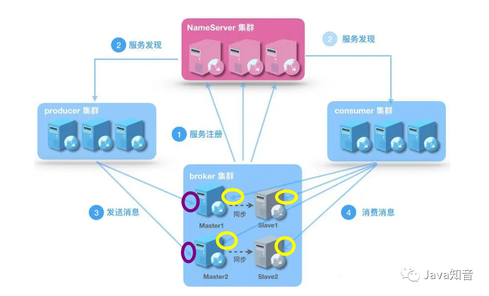


**RocketMQ**啥都是**集群**部署的，这是他**吞吐量大**，**高可用**的原因之一，集群的模式也很花哨，可以支持多master 模式、多master多slave异步复制模式、多 master多slave同步双写模式。


## 角色

### Broker

- broker主要用于producer和consumer接收和发送消息
- broker会定时向nameserver提交自己的信息
- 是消息中间件的消息存储、转发服务器
- 每个Broker节点，在启动时，都会遍历NameServer列表，与每个NameServer建立长连接，注册自己的信息，之后定时上报

### Nameserver

- 理解成zookeeper的效果，只是他没用zk，而是自己写了个nameserver来替代zk
- 底层由netty实现，提供了路由管理、服务注册、服务发现的功能，是一个无状态节点
- nameserver是服务发现者，集群中各个角色（producer、broker、consumer等）都需要定时向nameserver上报自己的状态，以便互相发现彼此，超时不上报的话，nameserver会把它从列表中剔除
- nameserver可以部署多个，当多个nameserver存在的时候，其他角色同时向他们上报信息，以保证高可用，
- NameServer集群间互不通信，没有主备的概念
- nameserver内存式存储，nameserver中的broker、topic等信息默认不会持久化，所以他是无状态节点

### Producer

- 随机选择其中一个NameServer节点建立长连接，获得Topic路由信息（包括topic下的queue，这些queue分布在哪些broker上等等）
- 接下来向提供topic服务的master建立长连接（因为rocketmq只有master才能写消息），且定时向master发送心跳

### Consumer

- 通过NameServer集群获得Topic的路由信息，连接到对应的Broker上消费消息
- 由于Master和Slave都可以读取消息，因此Consumer会与Master和Slave都建立连接进行消费消息

## 核心流程

- Broker都注册到Nameserver上
- Producer发消息的时候会从Nameserver上获取发消息的topic信息
- Producer向提供服务的所有master建立长连接，且定时向master发送心跳
- Consumer通过NameServer集群获得Topic的路由信息
- Consumer会与所有的Master和所有的Slave都建立连接进行监听新消息


## 核心概念

### Message

消息载体。Message发送或者消费的时候必须指定Topic。Message有一个可选的Tag项用于过滤消息，还可以添加额外的键值对。

### Tag

Tag 是 Topic 的进一步细分，顾名思义，标签。每个发送的消息都能打tag，消费的时候可以根据tag进行过滤，选择性消费。

### topic

消息的逻辑分类，发消息之前必须要指定一个topic才能发，就是将这条消息发送到这个topic上。消费消息的时候指定这个topic进行消费。就是逻辑分类。

### queue

其实就是kafka中的分区（partition）的概念。

1个Topic会被分为N个Queue，数量是可配置的。message本身其实是存储到queue上的，消费者消费的也是queue上的消息。多说一嘴，比如1个topic4个queue，有5个Consumer都在消费这个topic，那么会有一个consumer浪费掉了，因为负载均衡策略，每个consumer消费1个queue，5>4，溢出1个，这个会不工作。

### Message Model

消息模型：集群（Clustering）和广播（Broadcasting）

### Message Order

消息顺序：顺序（Orderly）和并发（Concurrently）

### Producer Group

消息生产者组

### Consumer Group

消息消费者组


## 消费模式

默认的是使用集群消费模式，这两者最大的区别在于同组中的消费，集群消费模式是同组公同消费一组消息，广播模式是同组各自都消费一组消息。

### 集群模式（Clustering）

适用场景

- 适用于消费端集群化部署，每条消息只需要被处理一次的场景。此外，由于消费进度在服务端维护，可靠性更高。具体消费示例如下图所示。

注意事项

- 集群消费模式下，每一条消息都只会被分发到一台机器上处理。如果需要被集群下的每一台机器都处理，请使用广播模式。
- 集群消费模式下，不保证每一次失败重投的消息路由到同一台机器上。


> 每条消息只需要被处理一次，broker只会把消息发送给消费集群中的一个消费者
>
> 在消息重投时，不能保证路由到同一台机器上
>
> 消费状态由broker维护


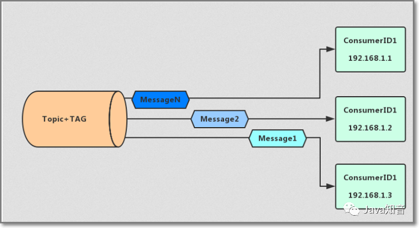


### 广播模式（Broadcasting）

适用场景

- 适用于消费端集群化部署，每条消息需要被集群下的每个消费者处理的场景

注意事项

- 广播消费模式下不支持顺序消息。
- 广播消费模式下不支持重置消费位点。
- 每条消息都需要被相同订阅逻辑的多台机器处理。
- 消费进度在客户端维护，出现重复消费的概率稍大于集群模式。
- 广播模式下，保证每条消息至少被每台客户端消费一次，但是并不会重投消费失败的消息，因此业务方需要关注消费失败的情况。
- 广播模式下，客户端每一次重启都会从最新消息消费。客户端在被停止期间发送至服务端的消息将会被自动跳过，请谨慎选择。
- 广播模式下，每条消息都会被大量的客户端重复处理，因此推荐尽可能使用集群模式。
- 广播模式下服务端不维护消费进度，所以控制台不支持消息堆积查询、消息堆积报警和订阅关系查询功能。


> 消费进度由consumer维护
>
> 保证每个消费者都消费一次消息
>
> 消费失败的消息不会重投


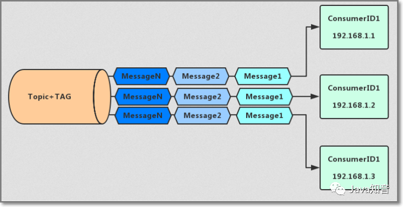


# 安装部署


## 控制台

https://github.com/apache/rocketmq-externals

### 下载源码

### 修改配置（可选）

修改`rocketmq-consolesrcmainresourcesapplication.properties`文件的`server.port`默认8080。

### 编译打包

进入`rocketmq-console`，然后用maven进行编译打包

```shell
$ mvn clean package -DskipTests
```

### 启动控制台

```shell
java -jar rocketmq-console-ng-1.0.1.jar --rocketmq.config.namesrvAddr=127.0.0.1:9876
```

## 测试

> rocketmq给我们提供了测试工具和测试类，可以在安装完很方便的进行测试。

rocketmq给我们提供的默认测试工具在bin目录下，叫`tools.sh`。我们测试前需要配置这个脚本，为他指定namesrv地址才可以

```shell
vim tools.sh
# 在export JAVA_HOME上面添加如下这段代码
export NAMESRV_ADDR=localhost:9876
```

### 发送消息

```shell
$ ./tools.sh org.apache.rocketmq.example.quickstart.Producer
```

成功的话会看到哗哗哗的日志，因为这个类会发送1000条消息到TopicTest这个Topic下。

### 消费消息

```shell
$ ./tools.sh org.apache.rocketmq.example.quickstart.Consumer
```

成功的话会看到哗哗哗的日志，因为这个类会消费TopicTest下的全部消息。刚发送的1000条都会被消费掉。


# 持久化

**RocketMQ 采用文件系统的方式来存储消息，消息的主要存储文件包括 CommitLog 文件、ConsumeQueue 文件、IndexFile 文件。**

- **CommitLog** 是消息存储的物理文件，所有消息主题的消息都存储在 CommitLog 文件中，每个 Broker 上的 CommitLog 被当前机器上的所有 ConsumeQueue 共享。CommitLog 中的文件默认大小为 1G，可以动态配置；收到消息之后就将内容直接追加到文件末尾，当一个文件写满以后，会生成一个新的 CommitLog 文件。所有的 Topic 数据是顺序写入在 CommitLog 文件中的。
- **ConsumeQueue** 是消息消费的逻辑队列，消息达到 CommitLog 文件后将被异步转发到消息消费队列，供消息消费者消费，这里面包含 MessageQueue 在 CommitLog 中的物理位置偏移量 Offset，消息实体内容的大小和 Message Tag 的 hash 值。每个文件默认大小约为 600W 个字节，如果文件满了后会也会生成一个新的文件。
- **IndexFile** 是消息索引文件，Index 索引文件提供了对 CommitLog 进行数据检索，提供了一种通过 key 或者时间区间来查找 CommitLog 中的消息的方法。在物理存储中，文件名是以创建的时间戳命名，固定的单个 IndexFile 大小大概为 400M，一个 IndexFile 可以保存 2000W 个索引。

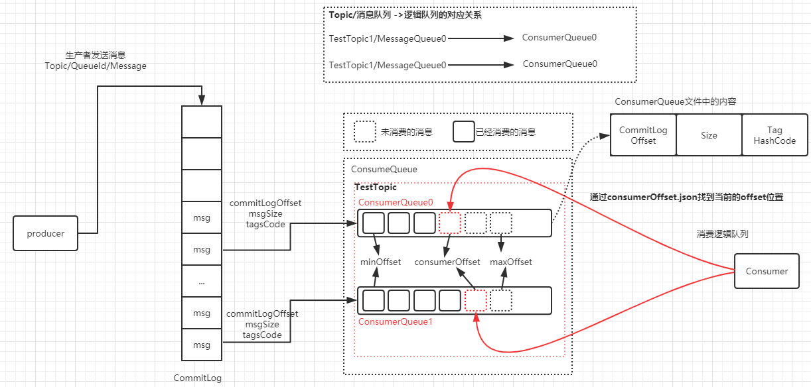

RocketMQ 的消息存储采用的是混合型的存储结构，也就是 Broker 单个实例下的所有队列共用一个日志数据文件 CommitLog。这个是和 Kafka 又一个不同之处。为什么不采用 Kafka 的设计，针对不同的 Partition 存储一个独立的物理文件呢？这是因为在 Kafka 的设计中，一旦 Kafka 中 Topic 的 Partition 数量过多，队列文件会过多，那么会给磁盘的 IO 读写造成比较大的压力，也就造成了性能瓶颈。所以 RocketMQ 进行了优化，消息主题统一存储在 CommitLog 中。当然它也有它的优缺点。

- 优点在于：由于消息主题都是通过 CommitLog 来进行读写，ConsumerQueue 中只存储很少的数据，所以队列更加轻量化。对于磁盘的访问是串行化从而避免了磁盘的竞争。
- 缺点在于：消息写入磁盘虽然是基于顺序写，但是读的过程确实是随机的。读取一条消息会先读取 ConsumeQueue，再读 CommitLog，会降低消息读的效率。

## 消息收发整体流程

1、Producer 将消息发送到 Broker 后，Broker 会采用同步或者异步的方式把消息写入到 CommitLog。RocketMQ 所有的消息都会存放在 CommitLog 中，为了保证消息存储不发生混乱，对 CommitLog 写之前会加锁，同时也可以使得消息能够被顺序写入到 CommitLog，只要消息被持久化到磁盘文件 CommitLog，那么就可以保证 Producer 发送的消息不会丢失。

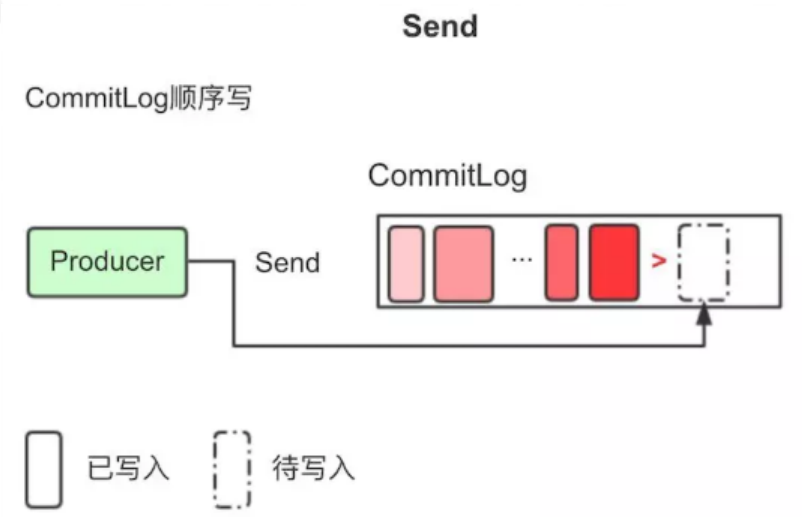

2、CommitLog 持久化后，会把里面的消息 Dispatch 到对应的 Consume Queue 上，Consume Queue 相当于 Kafka 中的 Partition，是一个逻辑队列，存储了这个 Queue 在 CommitLog 中的起始 Offset，log 大小和 MessageTag 的 hashCode。

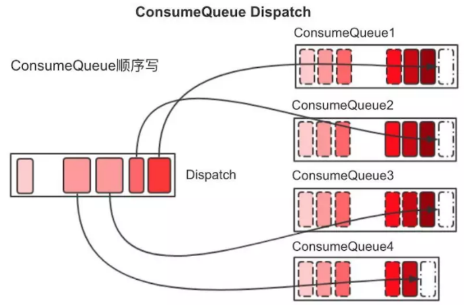

3、当消费者进行消息消费时，会先读取 ConsumerQueue，逻辑消费队列 ConsumeQueue 保存了指定 Topic 下的队列消息在 CommitLog 中的起始物理偏移量 Offset，消息大小、和消息 Tag 的 HashCode 值。

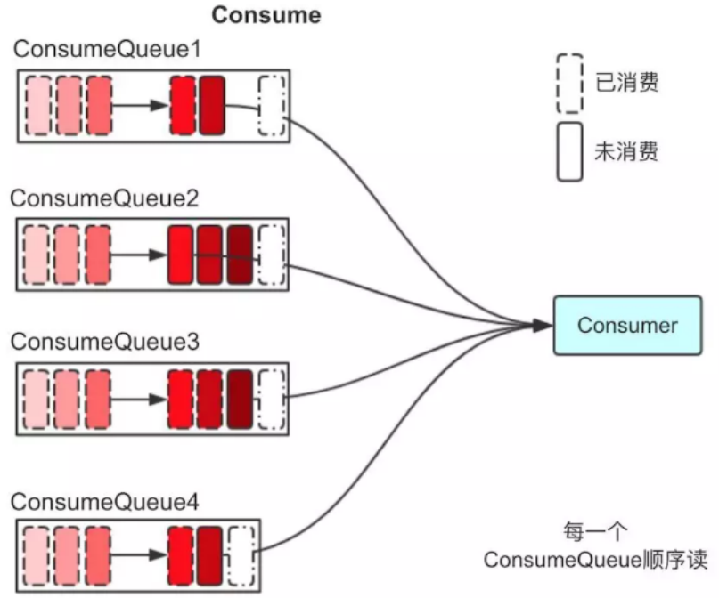

4、直接从 ConsumerQueue 中读取消息是没有数据的，真正的消息主体在 CommitLog 中，所以还需要从 CommitLog 中读取消息。

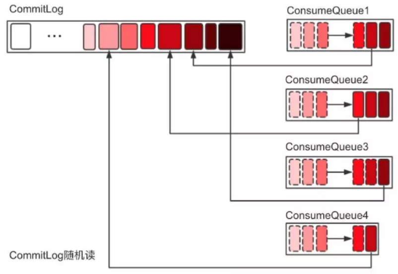

## 消息刷盘

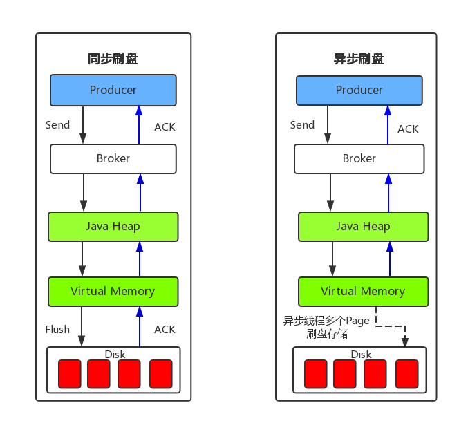

(1) 同步刷盘：只有在消息真正持久化至磁盘后RocketMQ的Broker端才会真正返回给Producer端一个成功的ACK响应。同步刷盘对MQ消息可靠性来说是一种不错的保障，但是性能上会有较大影响，一般适用于金融业务应用该模式较多。

(2) 异步刷盘：能够充分利用OS的PageCache的优势，只要消息写入PageCache即可将成功的ACK返回给Producer端。消息刷盘采用后台异步线程提交的方式进行，降低了读写延迟，提高了MQ的性能和吞吐量。


# 消息推拉模式

RocketMQ消息消费本质上是基于的拉（pull）模式。

consumer被分为2类：MQPullConsumer和MQPushConsumer，其实本质都是拉模式（pull），即consumer轮询从broker拉取消息。 区别：

**MQPushConsumer**方式，consumer把轮询过程封装了，并注册MessageListener监听器，取到消息后，唤醒MessageListener的consumeMessage()来消费，对用户而言，感觉消息是被推送（push）过来的。主要用的也是这种方式。

**MQPullConsumer**方式，取消息的过程需要用户自己写，首先通过消费的Topic拿到MessageQueue的集合，遍历MessageQueue集合，然后针对每个MessageQueue批量取消息，一次取完后，记录该队列下一次要取的开始offset，直到取完了，再换另一个MessageQueue。


# 保证消息不丢失

## producer

```java
// 发送消息到一个Broker
try {
    SendResult sendResult = mqProducer.send(msg);
} catch (RemotingException e) {
    e.printStackTrace();
} catch (MQBrokerException e) {
    e.printStackTrace();
} catch (InterruptedException e) {
    e.printStackTrace();
}
```

`send` 方法是一个同步操作，只要这个方法不抛出任何异常，就代表消息已经**发送成功**。

消息发送成功仅代表消息已经到了 Broker 端，Broker 在不同配置下，可能会返回不同响应状态:

- `SendStatus.SEND_OK`
- `SendStatus.FLUSH_DISK_TIMEOUT`
- `SendStatus.FLUSH_SLAVE_TIMEOUT`
- `SendStatus.SLAVE_NOT_AVAILABLE`

官方状态说明：

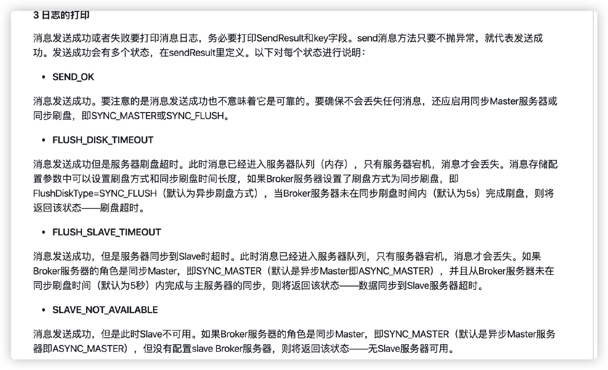

另外 RocketMQ 还提供异步的发送的方式，适合于链路耗时较长，对响应时间较为敏感的业务场景。

```java
try {
    // 异步发送消息到，主线程不会被阻塞，立刻会返回
    mqProducer.send(msg, new SendCallback() {
        @Override
        public void onSuccess(SendResult sendResult) {
            // 消息发送成功，
        }

        @Override
        public void onException(Throwable e) {
            // 消息发送失败，可以持久化这条数据，后续进行补偿处理
        }
    });
} catch (RemotingException e) {
    e.printStackTrace();
} catch (InterruptedException e) {
    e.printStackTrace();
}
```

不管是同步还是异步的方式，都会碰到网络问题导致发送失败的情况。针对这种情况，我们可以设置合理的重试次数，当出现网络问题，可以自动重试。设置方式如下：

```java
// 同步发送消息重试次数，默认为 2
mqProducer.setRetryTimesWhenSendFailed(3);
// 异步发送消息重试次数，默认为 2
mqProducer.setRetryTimesWhenSendAsyncFailed(3);
```

## broker

### 持久化

默认情况下，消息只要到了 Broker 端，将会优先保存到内存中，然后立刻返回确认响应给生产者。随后 Broker 定期批量的将一组消息从内存异步刷入磁盘。

这种方式减少 I/O 次数，可以取得更好的性能，但是如果发生机器掉电，异常宕机等情况，消息还未及时刷入磁盘，就会出现丢失消息的情况。

若想保证 Broker 端不丢消息，保证消息的可靠性，我们需要将消息保存机制修改为同步刷盘方式，即消息**存储磁盘成功**，才会返回响应。

修改 Broker 端配置如下：

```conf
## 默认情况为 ASYNC_FLUSH 
flushDiskType = SYNC_FLUSH 
```

若 Broker 未在同步刷盘时间内（**默认为 5s**）完成刷盘，将会返回 `SendStatus.FLUSH_DISK_TIMEOUT` 状态给生产者。


### 集群部署

为了保证可用性，Broker 通常采用一主（**master**）多从（**slave**）部署方式。为了保证消息不丢失，消息还需要复制到 slave 节点。

默认方式下，消息写入 **master** 成功，就可以返回确认响应给生产者，接着消息将会异步复制到 **slave** 节点。

> 注：master 配置：flushDiskType = SYNC_FLUSH

此时若 master 突然**宕机且不可恢复**，那么还未复制到 **slave** 的消息将会丢失。

为了进一步提高消息的可靠性，我们可以采用同步的复制方式，**master** 节点将会同步等待 **slave** 节点复制完成，才会返回确认响应。


Broker master 节点 同步复制配置如下：

```conf
## 默认为 ASYNC_MASTER 
brokerRole=SYNC_MASTER
```

如果 **slave** 节点未在指定时间内同步返回响应，生产者将会收到 `SendStatus.FLUSH_SLAVE_TIMEOUT` 返回状态。


**总结**

结合producer和broker，若需要**严格保证消息不丢失**，broker 需要采用如下配置：

```conf
## master 节点配置
flushDiskType = SYNC_FLUSH
brokerRole=SYNC_MASTER

## slave 节点配置
brokerRole=slave
flushDiskType = SYNC_FLUSH
```

同时这个过程我们还需要生产者配合，判断返回状态是否是 `SendStatus.SEND_OK`。若是其他状态，就需要<font color=#00dd00>考虑补偿重试</font>。

虽然上述配置提高消息的高可靠性，但是会**降低性能**，生产实践中需要综合选择。


## consumer

Consumer消费完消息后要进行ACK确认，如果未确认则代表是消费失败，这时候Broker会进行重试策略（仅集群模式会重试）。ACK的意思就是：Consumer说：ok，我消费成功了。这条消息给我标记成已消费吧。


消费者从 broker 拉取消息，然后执行相应的业务逻辑。一旦执行成功，将会返回 `ConsumeConcurrentlyStatus.CONSUME_SUCCESS` 状态给 Broker。

如果 Broker 未收到消费确认响应或收到其他状态，消费者下次还会再次拉取到该条消息，进行重试。这样的方式有效避免了消费者消费过程发生异常，或者消息在网络传输中丢失的情况。

```java
// 注册回调实现类来处理从broker拉取回来的消息
consumer.registerMessageListener(new MessageListenerConcurrently() {
    @Override
    public ConsumeConcurrentlyStatus consumeMessage(List<MessageExt> msgs, ConsumeConcurrentlyContext context) {
        // 执行业务逻辑
        // 标记该消息已经被成功消费
        return ConsumeConcurrentlyStatus.CONSUME_SUCCESS;
    }
});
// 启动消费者实例
consumer.start();
```

以上消费消息过程的，我们需要**注意返回消息状态**。只有当业务逻辑真正执行成功，我们才能返回 `ConsumeConcurrentlyStatus.CONSUME_SUCCESS`。否则我们需要返回 `ConsumeConcurrentlyStatus.RECONSUME_LATER`，稍后再重试。


# 顺序消费

RocketMQ的顺序消息分为2种情况：局部有序和全局有序。前面的例子是局部有序场景。

- 局部有序：指发送同一个队列的消息有序，可以在发送消息时指定队列，在消费消息时也按顺序消费。例如同一个订单ID的消息要保证有序，不同订单的消息没有约束，相互不影响，不同订单ID之间的消息时并行的。
- 全局有序：设置Topic只有一个队列可以实现全局有序，创建Topic时手动设置。此类场景极少，性能差，通常不推荐使用。


## 示例

producer中模拟了两个线程，并发顺序发送100个消息的情况，发送的消息中，key为消息发送编号i，消息body为orderId，大家注意下MessageQueueSelector的使用

```java
public class Producer {
    public static void main(String[] args)  {
        try {
            MQProducer producer = new DefaultMQProducer("please_rename_unique_group_name");
            ((DefaultMQProducer) producer).setNamesrvAddr("111.231.110.149:9876");
            producer.start();
			
			//顺序发送100条编号为0到99的，orderId为1 的消息
            new Thread(() -> {
                Integer orderId = 1;
                sendMessage(producer, orderId);
            }).start();
			//顺序发送100条编号为0到99的，orderId为2 的消息
            new Thread(() -> {
                Integer orderId = 2;
                sendMessage(producer, orderId);
            }).start();
			//sleep 30秒让消息都发送成功再关闭
            Thread.sleep(1000*30);

            producer.shutdown();
        } catch (MQClientException e) {
            e.printStackTrace();
        } catch (InterruptedException e) {
            e.printStackTrace();
        }
    }

    private static void sendMessage(MQProducer producer, Integer orderId) {
        for (int i = 0; i < 100; i++) {
            try {
                Message msg = new Message("TopicTestjjj", "TagA", i + "",
                                (orderId + "").getBytes(RemotingHelper.DEFAULT_CHARSET));
                SendResult sendResult = producer.send(msg, new MessageQueueSelector() {
                    @Override
                    public MessageQueue select(List<MessageQueue> mqs, Message msg, Object arg) {
                        Integer id = (Integer) arg;
                        int index = id % mqs.size();
                        return mqs.get(index);
                    }
                }, orderId);
                System.out.println("message send,orderId:"+orderId);
            } catch (Exception e) {
                e.printStackTrace();
            }
        }
    }
}
```

consumer的demo有两个，第一个为正常集群消费的consumer，另外一个是顺序消费的consumer，从结果中观察消息消费顺序

理想情况下消息顺序消费的结果应该是，同一个orderId下的消息的编号i值应该顺序递增，但是不同orderId之间的消费可以并行，即局部有序即可

```java
public class Consumer {

    public static void main(String[] args) throws InterruptedException, MQClientException {

        DefaultMQPushConsumer consumer = new DefaultMQPushConsumer("please_rename_unique_group_name_4");

        consumer.setNamesrvAddr("111.231.110.149:9876");

        consumer.setConsumeFromWhere(ConsumeFromWhere.CONSUME_FROM_FIRST_OFFSET);

        consumer.subscribe("TopicTestjjj", "*");
        //单个消费者中多线程并行消费
        consumer.setConsumeThreadMin(3);
        consumer.setConsumeThreadMin(6);
		
        // TODO MessageListenerConcurrently
        consumer.registerMessageListener(new MessageListenerConcurrently() {

            @Override
            public ConsumeConcurrentlyStatus consumeMessage(List<MessageExt> msgs,
                ConsumeConcurrentlyContext context) {
                for (MessageExt msg : msgs) {
                    System.out.println("queueId:"+msg.getQueueId()+",orderId:"+new String(msg.getBody())+",i:"+msg.getKeys());
                }
                return ConsumeConcurrentlyStatus.CONSUME_SUCCESS;
            }
        });

        consumer.start();

        System.out.printf("Consumer Started.%n");
    }
}
```

同一个orderId下，编号大的消息先于编号小的消息被消费，不是正确的顺序消费，即普通的并行消息消费，无法保证消息消费的顺序性


顺序消费的消费者例子如下，使用的监听器是`MessageListenerOrderly`

```java
public class Consumer {

    public static void main(String[] args) throws MQClientException {
        DefaultMQPushConsumer consumer = new DefaultMQPushConsumer("please_rename_unique_group_name_3");
        consumer.setNamesrvAddr("111.231.110.149:9876");

        consumer.setConsumeFromWhere(ConsumeFromWhere.CONSUME_FROM_FIRST_OFFSET);

        consumer.subscribe("TopicTestjjj", "TagA");

        //消费者并行消费
        consumer.setConsumeThreadMin(3);
        consumer.setConsumeThreadMin(6);

        consumer.registerMessageListener(new MessageListenerOrderly() {
            @Override
            public ConsumeOrderlyStatus consumeMessage(List<MessageExt> msgs, ConsumeOrderlyContext context) {
//                context.setAutoCommit(false);
                for (MessageExt msg : msgs) {
                    System.out.println("queueId:"+msg.getQueueId()+",orderId:"+new String(msg.getBody())+",i:"+msg.getKeys());
                }
                return ConsumeOrderlyStatus.SUCCESS;
            }
        });

        consumer.start();
        System.out.printf("Consumer Started.%n");
    }
}
```

在什么情况下会发生RocketMQ的消息重复消费呢？

1. 当系统的调用链路比较长的时候，比如系统A调用系统B，系统B再把消息发送到RocketMQ中，在系统A调用系统B的时候，如果系统B处理成功，但是迟迟没有将调用成功的结果返回给系统A的时候，系统A就会尝试重新发起请求给系统B，造成系统B重复处理，发起多条消息给RocketMQ造成重复消费
2. 在系统B发送消息给RocketMQ的时候，也有可能会发生和上面一样的问题，消息发送超时，结果系统B重试，导致RocketMQ接收到了重复的消息
3. 当RocketMQ成功接收到消息，并将消息交给消费者处理，如果消费者消费完成后还没来得及提交offset给RocketMQ，自己宕机或者重启了，那么RocketMQ没有接收到offset，就会认为消费失败了，会重发消息给消费者再次消费

消息重复消费的场景大概可以分为生产者端重复消费和消费者端重复消费，那么如何来解决消息的重复消费呢？

答案是通过**幂等性**来保证，只要保证重复消费的消息不对结果产生影响，就完美地解决这个问题


生产端/消费端保证幂等性。


# 重复消费

RocketMQ不提供重复消费问题的解决方案。

##### 解决方案

如果消费端收到两条一样的信息，怎么处理呢？

> 1. 消费端处理消息的业务逻辑保持幂等性
> 2. 保证每条消息都有唯一编号且保证消息处理成功与去重表的日志同时出现


# 延迟消息

RocketMQ延迟队列的核心思路是：所有的延迟消息由producer发出之后，都会存放到同一个topic（SCHEDULE_TOPIC_XXXX）下，不同的延迟级别会对应不同的队列序号，当延迟时间到之后，由定时线程读取转换为普通的消息存的真实指定的topic下，此时对于consumer端此消息才可见，从而被consumer消费。


RocketMQ 开源版本延迟消息临时存储在一个内部主题中，默认支持18个level的延迟消息，这是通过broker端的`messageDelayLevel`配置项确定

```java
messageDelayLevel=1s 5s 10s 30s 1m 2m 3m 4m 5m 6m 7m 8m 9m 10m 20m 30m 1h 2h
```

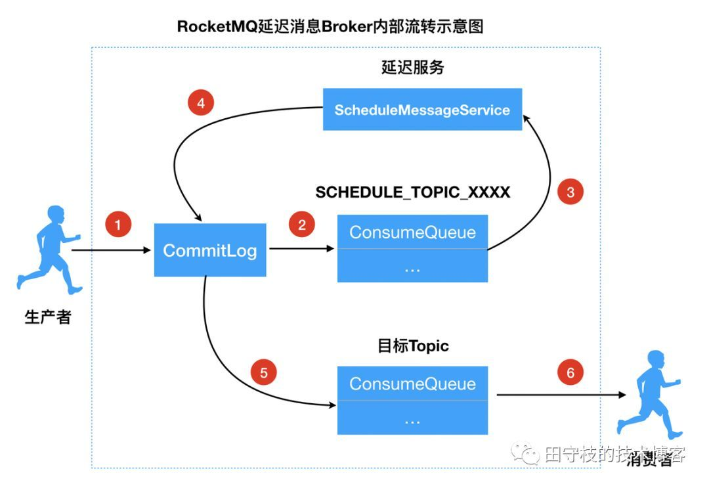


## 配置

延迟级别的值可以进行修改，以满足自己的业务需求，可以修改/添加新的level。

`Message.setDelayTimeLevel` 延时精度。可以修改这个指定级别的延时时间，时间单位支持：s、m、h、d，分别表示秒、分、时、天


## 示例

```java
Message msg=new Message();
msg.setTopic("TopicA");
msg.setTags("Tag");
msg.setBody("this is a delay message".getBytes());
//设置延迟level为5，对应延迟1分钟
msg.setDelayTimeLevel(5);
producer.send(msg);
```


# 事务消息

RocketMQ4.3+版本。

**相关概念**

**Half(Prepare) Message**

指的是暂不能投递的消息，发送方已经将消息成功发送到了 MQ 服务端，但是服务端未收到生产者对该消息的二次确认，此时该消息被标记成“暂不能投递”状态，处于该种状态下的消息即半消息。

**消息回查**

由于网络闪断、生产者应用重启等原因，导致某条事务消息的二次确认丢失，MQ 服务端通过扫描发现某条消息长期处于“半消息”时，需要主动向消息生产者询问该消息的最终状态（Commit 或是 Rollback），该过程即消息回查。


事务消息发送步骤如下：

1. 发送方将半事务消息（half-message）发送至消息队列RocketMQ服务端。
2. 消息队列RocketMQ服务端将消息持久化成功之后，向发送方返回Ack确认消息已经发送成功，此时消息为半事务消息。
3. 发送方开始执行本地事务逻辑。
4. 发送方根据本地事务执行结果向服务端提交二次确认（Commit或是Rollback），服务端收到Commit状态则将半事务消息标记为可投递，订阅方最终将收到该消息；服务端收到Rollback状态则删除半事务消息，订阅方将不会接受该消息。

事务消息回查步骤如下：

1. 在断网或者是应用重启的特殊情况下，上述步骤4提交的二次确认最终未到达服务端，经过固定时间后服务端将对该消息发起消息回查。
2. 发送方收到消息回查后，需要检查对应消息的本地事务执行的最终结果。
3. 发送方根据检查得到的本地事务的最终状态再次提交二次确认，服务端仍按照步骤4对半事务消息进行操作。


# rocketmq-client

```xml
<dependency>
    <groupId>org.apache.rocketmq</groupId>
    <artifactId>rocketmq-client</artifactId>
    <version>4.8.0</version>
</dependency>
```


```java
import org.apache.rocketmq.client.producer.DefaultMQProducer;
import org.apache.rocketmq.client.producer.SendResult;
import org.apache.rocketmq.common.message.Message;
import org.apache.rocketmq.remoting.common.RemotingHelper;

public class Producer {

    public static void main(String[] args) throws Exception {
        //创建一个消息生产者，并设置一个消息生产者组
        DefaultMQProducer producer = new DefaultMQProducer("niwei_producer_group");

        //指定 NameServer 地址
        producer.setNamesrvAddr("localhost:9876");

        //初始化 Producer，整个应用生命周期内只需要初始化一次
        producer.start();

        for (int i = 0; i < 100; i++) {
            //创建一条消息对象，指定其主题、标签和消息内容
            Message msg = new Message(
                    "topic_example_java" /* 消息主题名 */,
                    "TagA" /* 消息标签 */,
                    ("Hello Java demo RocketMQ " + i).getBytes(RemotingHelper.DEFAULT_CHARSET) /* 消息内容 */
            );

            //发送消息并返回结果
            SendResult sendResult = producer.send(msg);

            System.out.printf("%s%n", sendResult);
        }

        // 一旦生产者实例不再被使用则将其关闭，包括清理资源，关闭网络连接等
        producer.shutdown();
    }
}
```


```java
import org.apache.rocketmq.client.consumer.DefaultMQPushConsumer;
import org.apache.rocketmq.client.consumer.listener.ConsumeConcurrentlyContext;
import org.apache.rocketmq.client.consumer.listener.ConsumeConcurrentlyStatus;
import org.apache.rocketmq.client.consumer.listener.MessageListenerConcurrently;
import org.apache.rocketmq.common.consumer.ConsumeFromWhere;
import org.apache.rocketmq.common.message.MessageExt;

import java.io.UnsupportedEncodingException;
import java.util.Date;
import java.util.List;

public class Consumer {

    public static void main(String[] args) throws Exception {
        //创建一个消息消费者，并设置一个消息消费者组
        DefaultMQPushConsumer consumer = new DefaultMQPushConsumer("niwei_consumer_group");
        //指定 NameServer 地址
        consumer.setNamesrvAddr("localhost:9876");
        //设置 Consumer 第一次启动时从队列头部开始消费还是队列尾部开始消费
        consumer.setConsumeFromWhere(ConsumeFromWhere.CONSUME_FROM_FIRST_OFFSET);
        //订阅指定 Topic 下的所有消息
        consumer.subscribe("topic_example_java", "*");

        //注册消息监听器
        consumer.registerMessageListener(new MessageListenerConcurrently() {
            public ConsumeConcurrentlyStatus consumeMessage(List<MessageExt> list, ConsumeConcurrentlyContext context) {
                //默认 list 里只有一条消息，可以通过设置参数来批量接收消息
                if (list != null) {
                    for (MessageExt ext : list) {
                        try {
                            System.out.println(new Date() + new String(ext.getBody(), "UTF-8"));
                        } catch (UnsupportedEncodingException e) {
                            e.printStackTrace();
                        }
                    }
                }
                return ConsumeConcurrentlyStatus.CONSUME_SUCCESS;
            }
        });

        // 消费者对象在使用之前必须要调用 start 初始化
        consumer.start();
        System.out.println("消息消费者已启动");
    }
}
```


# Spring集成

目前在 Spring 框架中集成 RocketMQ 有三种方式，一是将消息生产者和消费者定义成 bean 对象交由 Spring 容器管理，二是使用 RocketMQ 社区的外部项目 rocketmq-jms（https://github.com/apache/rocketmq-externals/tree/master/rocketmq-jms）然后通过 spring-jms 方式集成使用，三是如果你的应用是基于 spring-boot 的，可以使用 RocketMQ 的外部项目 rocketmq-spring-boot-starter（https://github.com/apache/rocketmq-externals/tree/master/rocketmq-spring-boot-starter）比较方便的收发消息。