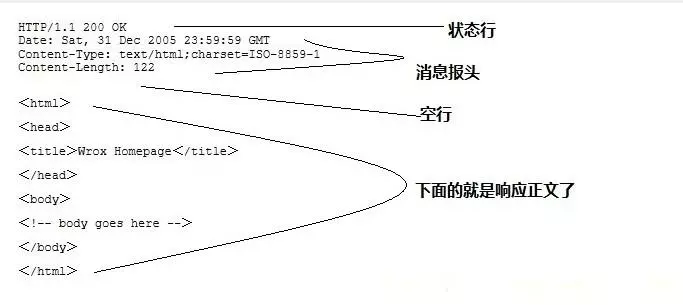

# HTTP简介

HTTP协议是Hyper Text Transfer Protocol（超文本传输协议）的缩写,是用于从万维网（WWW:World Wide Web ）服务器传输超文本到本地浏览器的传送协议。 

 HTTP是一个基于TCP/IP通信协议来传递数据（HTML 文件, 图片文件, 查询结果等）。 


# 主要特点

1、简单快速：客户向服务器请求服务时，只需传送请求方法和路径。请求方法常用的有GET、HEAD、POST。每种方法规定了客户与服务器联系的类型不同。由于HTTP协议简单，使得HTTP服务器的程序规模小，因而通信速度很快。

2、灵活：HTTP允许传输**任意类型**的数据对象。正在传输的类型由Content-Type加以标记。

3.无连接：无连接的含义是限制每次连接只处理一个请求。服务器处理完客户的请求，并收到客户的应答后，即断开连接。采用这种方式可以节省传输时间。

4.无状态：HTTP协议是无状态协议。无状态是指协议对于事务处理没有记忆能力。缺少状态意味着如果后续处理需要前面的信息，则它必须重传，这样可能导致每次连接传送的数据量增大。另一方面，在服务器不需要先前信息时它的应答就较快。
 5、支持B/S及C/S模式。


# URI

`uniform resource identifier`，统一资源标识符，用来唯一的标识一个资源。

Web上可用的每种资源如HTML文档、图像、视频片段、程序等都是一个来URI来定位的

URI一般由三部组成：
	①访问资源的命名机制
	②存放资源的主机名
	③资源自身的名称，由路径表示，着重强调于资源。 


## URL

`uniform resource locator`，统一资源定位器，它是一种具体的URI，即URL可以用来标识一个资源，而且还指明了如何locate这个资源。


采用URL可以用一种统一的格式来描述各种信息资源，包括文件、服务器的地址和目录等。


URL一般由三部组成：
 	①协议(或称为服务方式)
 	②存有该资源的主机IP地址(有时也包括端口号)
 	③主机资源的具体地址。如目录和文件名等


## URN

`uniform resource name`，统一资源命名，是通过名字来标识资源

示例：[mailto:java-net@java.sun.com](https://link.jianshu.com/?t=mailto:java-net@java.sun.com)


# Http之Resuest

一个http请求由：请求行（request line）、请求头部（header）、空行和请求数据四个部分组成。


示例（Get请求例子，使用Charles抓取的request：）：

```http
GET /562f25980001b1b106000338.jpg HTTP/1.1
Host    img.mukewang.com
User-Agent  Mozilla/5.0 (Windows NT 10.0; WOW64) AppleWebKit/537.36 (KHTML, like Gecko) Chrome/51.0.2704.106 Safari/537.36
Accept  image/webp,image/*,*/*;q=0.8
Referer http://www.imooc.com/
Accept-Encoding gzip, deflate, sdch
Accept-Language zh-CN,zh;q=0.8
```


## 请求行

- 用来说明请求类型,要访问的资源以及所使用的HTTP版本


## 请求头

- 用来说明服务器要使用的附加信息


从第二行起为请求头部：

​	HOST：将指出请求的目的地.

​	User-Agent：服务器端和客户端脚本都能访问它,它是浏览器类型检测逻辑的重要基础.该信息由你的浏览器来定义,并且在每个请求中自动发送等等 


## 空行

- 请求头部后面的空行是必须的


## 请求数据

 这个例子的请求数据为空。 可以看下面例子。


```http
POST / HTTP1.1
Host:www.wrox.com
User-Agent:Mozilla/4.0 (compatible; MSIE 6.0; Windows NT 5.1; SV1; .NET CLR 2.0.50727; .NET CLR 3.0.04506.648; .NET CLR 3.5.21022)
Content-Type:application/x-www-form-urlencoded
Content-Length:40
Connection: Keep-Alive

name=Professional%20Ajax&publisher=Wiley
```


### Content-Type


### Connection

若connection 模式为close，则服务器主动关闭[TCP连接](https://www.jianshu.com/p/ef892323e68f)，客户端被动关闭连接，释放[TCP连接](https://www.jianshu.com/p/ef892323e68f);若connection 模式为keepalive，则该连接会保持一段时间，在该时间内可以继续接收请求;


# Http之Response

一个http应答由：状态行、消息报头、空行和响应正文组成。





## 状态行

- 第一行为状态行，（HTTP/1.1）表明HTTP版本为1.1版本，状态码为200，状态消息为（ok） 

## 消息报头

- 用来说明客户端要使用的一些附加信息

第2，3，4行为消息报头。

​	Date:生成响应的日期和时间；

​	Content-Type:指定了MIME类型的HTML(text/html),编码类型是ISO-8859-1

## 空行

- 消息报头后面的空行是必须的

## 响应正文

- 空行后面的html部分为响应正文。 


# HTTP状态码

状态代码有三位数字组成，第一个数字定义了响应的类别，共分五种类别:

```properties
1xx：指示信息--表示请求已接收，继续处理

2xx：成功--表示请求已被成功接收、理解、接受

3xx：重定向--要完成请求必须进行更进一步的操作

4xx：客户端错误--请求有语法错误或请求无法实现

5xx：服务器端错误--服务器未能实现合法的请求
```

常见状态码：

```jsx
200 OK                        //客户端请求成功
400 Bad Request               //客户端请求有语法错误，不能被服务器所理解
401 Unauthorized              //请求未经授权，这个状态代码必须和WWW-Authenticate报头域一起使用 
403 Forbidden                 //服务器收到请求，但是拒绝提供服务
404 Not Found                 //请求资源不存在，eg：输入了错误的URL
500 Internal Server Error     //服务器发生不可预期的错误
503 Server Unavailable        //服务器当前不能处理客户端的请求，一段时间后可能恢复正常
```

更多状态码[http://www.runoob.com/http/http-status-codes.html](https://link.jianshu.com?t=http://www.runoob.com/http/http-status-codes.html)


# HTTP请求方法

根据HTTP标准，HTTP请求可以使用多种请求方法。
 HTTP1.0定义了三种请求方法： GET, POST 和 HEAD方法。
 HTTP1.1新增了五种请求方法：OPTIONS, PUT, DELETE, TRACE 和 CONNECT 方法。

```tex
GET		请求指定的页面信息，并返回实体主体。
HEAD    类似于get请求，只不过返回的响应中没有具体的内容，用于获取报头
POST    向指定资源提交数据进行处理请求（例如提交表单或者上传文件）。数据被包含在请求体中。POST请求可能会导致新的资源的建立和/或已有资源的修改。
PUT  	从客户端向服务器传送的数据取代指定的文档的内容。
DELETE  请求服务器删除指定的页面。
CONNECT HTTP/1.1协议中预留给能够将连接改为管道方式的代理服务器。
OPTIONS 允许客户端查看服务器的性能。
TRACE   回显服务器收到的请求，主要用于测试或诊断。
```


# Http1.0与1.1区别

