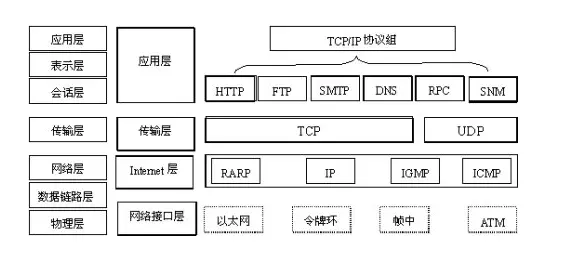
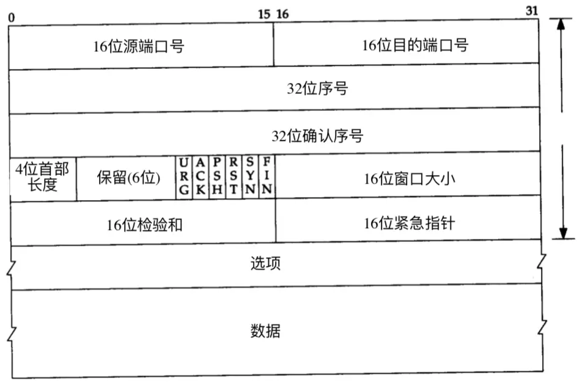

# OSI模型

- **物理层**

物理层处于OSI的最底层，是整个开放系统的基础。物理层涉及通信信道上传输的原始比特流(bits)，它的功能主要是为数据端设备提供传送数据的通路以及传输数据。

- **数据链路层**

数据链路层的主要任务是实现计算机网络中相邻节点之间的可靠传输，把原始的、有差错的物理传输线路加上数据链路协议以后，构成逻辑上可靠的数据链路。需要完成的功能有链路管理、成帧、差错控制以及流量控制等。其中成帧是对物理层的原始比特流进行界定，数据链路层也能够对帧的丢失进行处理。

- **网络层**

网络层涉及源主机节点到目的主机节点之间可靠的网络传输，它需要完成的功能主要包括路由选择、网络寻址、流量控制、拥塞控制、网络互连等。

- **传输层**

传输层起着承上启下的作用，涉及源端节点到目的端节点之间可靠的信息传输。传输层需要解决跨越网络连接的建立和释放，对底层不可靠的网络，建立连接时需要三次握手，释放连接时需要四次挥手。

- **会话层和表示层**

会话层的主要功能是负责应用程序之间建立、维持和中断会话，同时也提供对设备和结点之间的会话控制，协调系统和服务之间的交流，并通过提供单工、半双工和全双工3种不同的通信方式，使系统和服务之间有序地进行通信。

表示层关心所传输数据信息的格式定义，其主要功能是把应用层提供的信息变换为能够共同理解的形式，提供字符代码、数据格式、控制信息格式、加密等的统一表示。

- **应用层**

应用层为OSI的最高层，是直接为应用进程提供服务的。其作用是在实现多个系统应用进程相互通信的同时，完成一系列业务处理所需的服务。


# 常见网络协议




# 传输层协议


## TCP/IP模型


### TCP报文段格式

TCP报文段包括协议首部和数据两部分，协议首部的固定部分有20个字节，首部的固定部分后面是选项部分。





下面是报文段首部各个字段的含义。

#### 源端口号以及目的端口号

各占2个字节，端口是传输层和应用层的服务接口，用于寻找发送端和接收端的进程，一般来讲，通过端口号和IP地址，可以唯一确定一个TCP连接，在网络编程中，对应编码级别的socket。

#### 序号

tcp提供全双工服务，两端都有各自的序号。**编号：解决网络包乱序的问题**

> 序号如何生成：不能是固定写死的，否则断网重连时序号重复使用会乱套。tcp基于时钟生成一个序号，每4微秒加一，到2^32-1时又从0开始

#### 确认序号

占4字节，确认序号应该是上次已经成功收到数据字节的<font color=#00dd00>序号加1</font>。ack为1才有效。**确认号：解决丢包的问题**

#### 数据偏移/首部长度

占4位，用于指出TCP首部长度，若不存在选项，则这个值为20字节，数据偏移的最大值为60字节。

#### 保留字段

占6位，暂时可忽略，值全为0

#### 标志位

URG（紧急） : 为1时表明紧急指针字段有效
ACK（确认）：为1时表明确认号字段有效
PSH（推送）：为1时接收方应尽快将这个报文段交给应用层
RST（复位）：为1时表明TCP连接出现故障必须重建连接
SYN（同步）：在连接建立时用来同步序号
FIN （终止）： 为1时表明发送端数据发送完毕要求释放连接

#### 接收窗口大小

占2个字节，接收端期望接收的字节数。**解决流量控制的问题**。

用于流量控制和拥塞控制，表示当前接收缓冲区的大小。在计算机网络中，通常是用接收方的接收能力的大小来控制发送方的数据发送量。TCP连接的一端根据缓冲区大小确定自己的接收窗口值，告诉对方，使对方可以确定发送数据的字节数。

#### 校验和

占2个字节，范围包括首部和数据两部分。

#### 选项

是可选的，默认情况是不选。

 

### 三次握手

TCP是面向连接的协议，因此每个TCP连接都有3个阶段：连接建立、数据传送和连接释放。连接建立经历三个步骤，通常称为“三次握手”。

#### 三次握手过程


1. 第一次握手
    客户机发送连接请求报文段到服务器，并进入<font color=#dd0000>SYN_SENT状态</font>，等待服务器确认。（SYN = 1,seq=x）
2. 第二次握手
    服务器收到连接请求报文，如果同意建立连接，向客户机发回确认报文段，并为该TCP连接分配TCP缓存和变量。(SYN=1,ACK=1,seq=y,ack=x+1)。服务端进入<font color=#dd0000>SYN_RECV状态</font>
3. 第三次握手
    客户机收到服务器的确认报文段后，向服务器给出确认报文段，并且也要给该连接分配缓存和变量。此包发送完毕，客户端和服务器进入<font color=#dd0000>ESTABLISHED（TCP连接成功）状态</font>，完成三次握手。(ACK=1,seq=x+1,ack=y+1)。


#### 为什么TCP客户端最后还要发送一次确认

主要防止已经失效的连接请求报文突然又传送到了服务器，从而产生错误。

如果使用的是两次握手建立连接，假设有这样一种场景，<font color=#dd0000>客户端发送了第一个请求连接并且没有丢失，只是因为在网络结点中滞留的时间太长了</font>，由于TCP的客户端迟迟没有收到确认报文，以为服务器没有收到，此时重新向服务器发送这条报文，此后客户端和服务器经过两次握手完成连接，传输数据，然后关闭连接。此时此前滞留的那一次请求连接，网络通畅了到达了服务器，这个报文本该是失效的，但是，两次握手的机制将会让客户端和服务器再次建立连接，这将导致不必要的错误和资源的浪费。

如果采用的是三次握手，就算是那一次失效的报文传送过来了，服务端接受到了那条失效报文并且回复了确认报文，但是客户端不会再次发出确认。由于服务器收不到确认，就知道客户端并没有请求连接。


### 四次挥手

#### TCP四次挥手过程


由于TCP连接是全双工的，因此每个方向都必须单独进行关闭。这原则是当一方完成它的数据发送任务后就能发送一个FIN来终止这个方向的连接。收到一个 FIN只意味着这一方向上没有数据流动，一个TCP连接在收到一个FIN后仍能发送数据。首先进行关闭的一方将执行主动关闭，而另一方执行被动关闭。

1. TCP客户端发送一个FIN，用来关闭客户到服务器的数据传送。
2. 服务器收到这个FIN，它发回一个ACK，确认序号为收到的序号加1。和SYN一样，一个FIN将占用一个序号。
3. 服务器关闭客户端的连接，发送一个FIN给客户端。
4. 客户端发回ACK报文确认，并将确认序号设置为收到序号加1。


#### 为什么客户端最后还要等待2MSL

MSL（Maximum Segment Lifetime），TCP允许不同的实现可以设置不同的MSL值。

第一，保证客户端发送的最后一个ACK报文能够到达服务器，因为这个ACK报文可能丢失，站在服务器的角度看来，我已经发送了FIN+ACK报文请求断开了，客户端还没有给我回应，应该是我发送的请求断开报文它没有收到，于是服务器又会重新发送一次，而客户端就能在这个2MSL时间段内收到这个重传的报文，接着给出回应报文，并且会重启2MSL计时器。

第二，防止类似与“三次握手”中提到了的“已经失效的连接请求报文段”出现在本连接中。客户端发送完最后一个确认报文后，在这个2MSL时间中，就可以使本连接持续的时间内所产生的所有报文段都从网络中消失。这样新的连接中不会出现旧连接的请求报文。


#### 为什么建立连接是三次握手，关闭连接确是四次挥手

建立连接的时候， 服务器在LISTEN状态下，收到建立连接请求的SYN报文后，把ACK和SYN放在一个报文里发送给客户端。
而关闭连接时，服务器收到对方的FIN报文时，仅仅表示对方不再发送数据了但是还能接收数据，而自己也未必全部数据都发送给对方了，所以己方可以立即关闭，也可以发送一些数据给对方后，再发送FIN报文给对方来表示同意现在关闭连接，因此，己方ACK和FIN一般都会分开发送，从而导致多了一次。


### 状态说明

服务端等待客户端连接时，处于Listen监听状态

客户端主动打开请求，发送SYN时处于SYN_SENT发送状态

客户端收到syn和ack，并回复ack时，处与Established状态等待发送报文

服务端收到ack确认后，也处于Established状态等待发送报文

客户端发送fin后，处于fin_wait_1状态

服务端收到fin并发送ack时，处于close_wait状态

客户端收到ack确认后，处于fin_wait_2状态

服务端发送fin后，处于last_ack状态

客户端收到fin后发送ack，处于time_wait状态

服务端收到ack后，处于closed状态


##  UDP协议

 UDP，用户数据报协议，英文全称是User Datagram Protocol，它是TCP/IP协议簇中无连接的运输层协议。 


 **UDP协议格式**


 从图中可以看到，UDP协议十分简单，它由两部分组成：首部和数据。其中，首部仅有8个字节，包括源端口和目的端口，长度（UDP用于数据报的长度）、校验和。 


## 应用层协议

### http

HTTP协议是Hyper Text Transfer Protocol（超文本传输协议）的缩写,是用于从万维网（WWW:World Wide Web ）服务器传输超文本到本地浏览器的传送协议。 

 HTTP是一个基于TCP/IP通信协议来传递数据（HTML 文件, 图片文件, 查询结果等）。 

#### 主要特点

1、简单快速：客户向服务器请求服务时，只需传送请求方法和路径。请求方法常用的有GET、HEAD、POST。每种方法规定了客户与服务器联系的类型不同。由于HTTP协议简单，使得HTTP服务器的程序规模小，因而通信速度很快。

2、灵活：HTTP允许传输**任意类型**的数据对象。正在传输的类型由Content-Type加以标记。

3.无连接：无连接的含义是限制每次连接只处理一个请求。服务器处理完客户的请求，并收到客户的应答后，即断开连接。采用这种方式可以节省传输时间。

4.无状态：HTTP协议是无状态协议。无状态是指协议对于事务处理没有记忆能力。缺少状态意味着如果后续处理需要前面的信息，则它必须重传，这样可能导致每次连接传送的数据量增大。另一方面，在服务器不需要先前信息时它的应答就较快。
 5、支持B/S及C/S模式。


#### URI

`uniform resource identifier`，统一资源标识符，用来唯一的标识一个资源。

**Web上每种可用的资源如HTML文档、图像、视频片段、程序等都是一个URI来定位的**

URI一般由三部组成：
	①访问资源的命名机制
	②存放资源的主机名
	③资源自身的名称，由路径表示，着重强调于资源。 


#### URL

`uniform resource locator`，统一资源定位器，它是一种具体的URI，即URL可以用来标识一个资源，而且还指明了如何locate这个资源。


采用URL可以用一种统一的格式来描述各种信息资源，包括文件、服务器的地址和目录等。


URL一般由三部组成：
 	①协议(或称为服务方式)
 	②存有该资源的主机IP地址(有时也包括端口号)
 	③主机资源的具体地址。如目录和文件名等


#### URN

`uniform resource name`，统一资源命名，是通过名字来标识资源

示例：[mailto:java-net@java.sun.com](https://link.jianshu.com/?t=mailto:java-net@java.sun.com)


#### Http之Resuest

一个http请求由：请求行（request line）、请求头部（header）、空行和请求数据四个部分组成。


示例（Get请求例子，使用Charles抓取的request：）：

```http
GET /562f25980001b1b106000338.jpg HTTP/1.1
Host    img.mukewang.com
User-Agent  Mozilla/5.0 (Windows NT 10.0; WOW64) AppleWebKit/537.36 (KHTML, like Gecko) Chrome/51.0.2704.106 Safari/537.36
Accept  image/webp,image/*,*/*;q=0.8
Referer http://www.imooc.com/
Accept-Encoding gzip, deflate, sdch
Accept-Language zh-CN,zh;q=0.8
```


##### 请求行

- 用来说明请求类型,要访问的资源以及所使用的HTTP版本


##### 请求头

- 用来说明服务器要使用的附加信息

​	

`HOST`:

​	指出请求的目的地

`User-Agent`:

​	服务器端和客户端脚本都能访问它,它是浏览器类型检测逻辑的重要基础.该信息由你的浏览器来定义,并且在每个请求中自动发送等等 

`Accept`:

​	告诉服务端 客户端接受什么类型的响应

`Cookie`


`Referer`

​	表示这个请求是从哪个URL过来的

> 假如你通过google搜索出一个商家的广告页面，你对这个广告页面感兴趣，鼠标一点发送一个请求报文到商家的网站，这个请求报文的Referer报文头属性值就是http://www.google.com。 


`Cache-Control`

​	对缓存进行控制


##### 空行

- 请求头部后面的空行是必须的


##### 请求数据

 这个例子的请求数据为空。 可以看下面例子。


```http
POST / HTTP1.1
Host:www.wrox.com
User-Agent:Mozilla/4.0 (compatible; MSIE 6.0; Windows NT 5.1; SV1; .NET CLR 2.0.50727; .NET CLR 3.0.04506.648; .NET CLR 3.5.21022)
Content-Type:application/x-www-form-urlencoded
Content-Length:40
Connection: Keep-Alive

name=Professional%20Ajax&publisher=Wiley
```


##### Content-Type

```properties
常见的媒体格式类型如下：

- text/html ： HTML格式
- text/plain ：纯文本格式
- text/xml ： XML格式
- image/gif ：gif图片格式
- image/jpeg ：jpg图片格式
- image/png：png图片格式

以application开头的媒体格式类型：

- application/xhtml+xml ：XHTML格式
- application/xml： XML数据格式
- application/atom+xml ：Atom XML聚合格式
- application/json： JSON数据格式
- application/pdf：pdf格式
- application/msword ： Word文档格式
- application/octet-stream ： 二进制流数据（如常见的文件下载）
- application/x-www-form-urlencoded ： \<form encType="">中默认的encType，form表单数据被编码为key/value格式发送到服务器（表单默认的提交数据的格式）

另外一种常见的媒体格式是上传文件之时使用的：

- multipart/form-data ： 需要在表单中进行文件上传时，就需要使用该格式
```


##### Connection

若connection 模式为close，则服务器主动关闭TCP连接，客户端被动关闭连接，释放TCP连接;

若connection 模式为keepalive，则该连接会保持一段时间，在该时间内可以继续接收请求;


#### Http之Response

一个http应答由：状态行、消息报头、空行和响应正文组成。


##### 状态行

- 第一行为状态行，（HTTP/1.1）表明HTTP版本为1.1版本，状态码为200，状态消息为（ok） 

##### 消息报头

- 用来说明客户端要使用的一些附加信息

​	

`Date:`

​	生成响应的日期和时间；


`Content-Type:`
	指定了MIME类型的HTML(text/html),编码类型是ISO-8859-1


`Cache-Control`:

​	响应输出到客户端后，服务端通过该报文头属告诉客户端如何控制响应内容的缓存。 

> 下面，的设置让客户端对响应内容缓存3600秒，也即在3600秒内，如果客户再次访问该资源，直接从客户端的缓存中返回内容给客户，不要再从服务端获取（当然，这个功能是靠客户端实现的，服务端只是通过这个属性提示客户端“应该这么做”，做不做，还是决定于客户端，如果是自己宣称支持HTTP的客户端，则就应该这样实现）。 

```http
Cache-Control: max-age=3600  
```


`Location`:

​	我们在JSP中让页面Redirect到一个某个A页面中，其实是让客户端再发一个请求到A页面，这个需要Redirect到的A页面的URL，其实就是通过响应报文头的Location属性告知客户端的


`Set-Cookie`:

​	服务端可以设置客户端的Cookie，其原理就是通过这个响应报文头属性实现的

```http
Set-Cookie: UserID=JohnDoe; Max-Age=3600; Version=1  
```


参见：http://en.wikipedia.org/wiki/List_of_HTTP_header_fields 


##### 空行

- 消息报头后面的空行是必须的

##### 响应正文

- 空行后面的html部分为响应正文。 


#### HTTP状态码

状态代码有三位数字组成，第一个数字定义了响应的类别，共分五种类别:

```properties
1xx：指示信息--表示请求已接收，继续处理

2xx：成功--表示请求已被成功接收、理解、接受

3xx：重定向--要完成请求必须进行更进一步的操作

4xx：客户端错误--请求有语法错误或请求无法实现

5xx：服务器端错误--服务器未能实现合法的请求
```

常见状态码：

```jsx
200 OK                        //客户端请求成功
400 Bad Request               //客户端请求有语法错误，不能被服务器所理解
401 Unauthorized              //请求未经授权，这个状态代码必须和WWW-Authenticate报头域一起使用 
403 Forbidden                 //服务器收到请求，但是拒绝提供服务
404 Not Found                 //请求资源不存在，eg：输入了错误的URL
500 Internal Server Error     //服务器发生不可预期的错误
503 Server Unavailable        //服务器当前不能处理客户端的请求，一段时间后可能恢复正常
```

更多状态码[http://www.runoob.com/http/http-status-codes.html](https://link.jianshu.com?t=http://www.runoob.com/http/http-status-codes.html)


#### HTTP请求方法

根据HTTP标准，HTTP请求可以使用多种请求方法。
 HTTP1.0定义了三种请求方法： GET, POST 和 HEAD方法。
 HTTP1.1新增了五种请求方法：OPTIONS, PUT, DELETE, TRACE 和 CONNECT 方法。

```properties
GET		请求指定的页面信息，并返回实体主体。
HEAD    类似于get请求，只不过返回的响应中没有具体的内容，用于获取报头
POST    向指定资源提交数据进行处理请求（例如提交表单或者上传文件）。数据被包含在请求体中。POST请求可能会导致新的资源的建立和/或已有资源的修改。
PUT  	从客户端向服务器传送的数据取代指定的文档的内容。
DELETE  请求服务器删除指定的页面。
CONNECT HTTP/1.1协议中预留给能够将连接改为管道方式的代理服务器。
OPTIONS 允许客户端查看服务器的性能。
TRACE   回显服务器收到的请求，主要用于测试或诊断。
```


#### Http1.0与1.1区别


### https