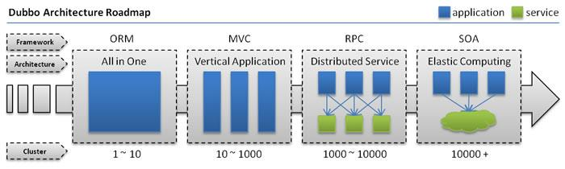
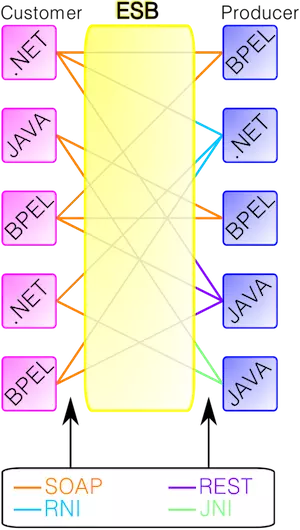
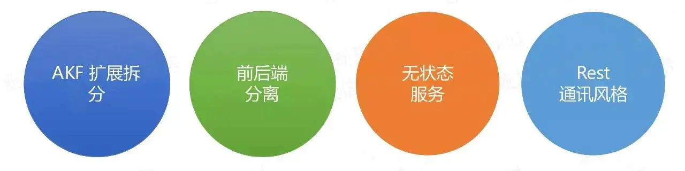
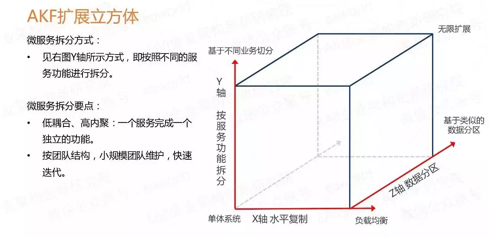
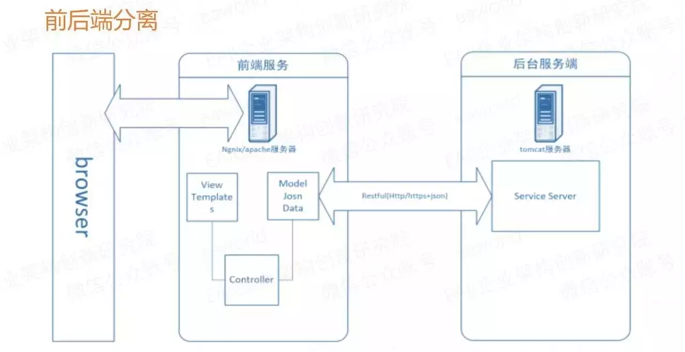
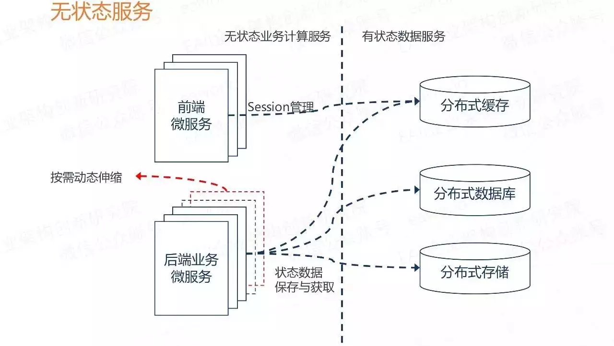
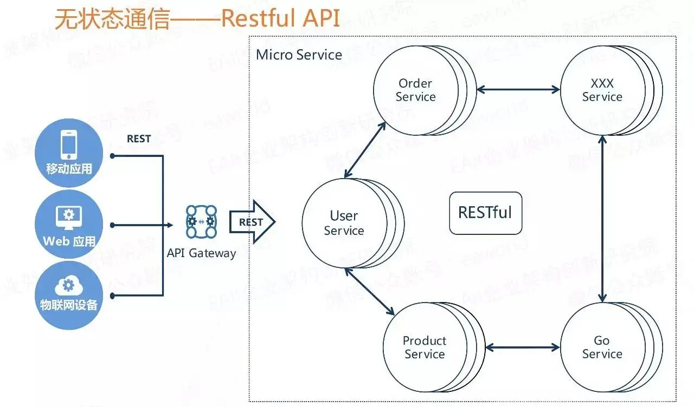
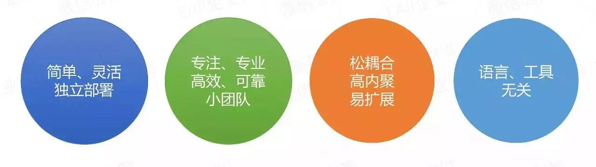
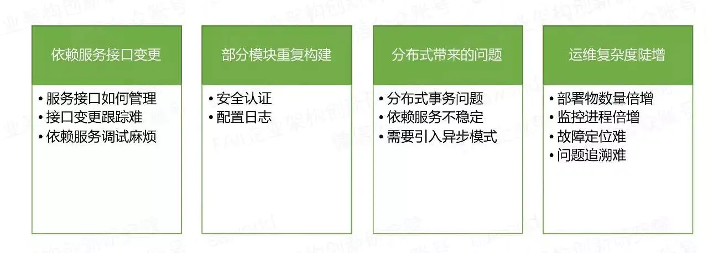

# 引言

## 什么是Restful 

Restful是一种架构设计风格，提供了设计原则和约束条件，而不是架构，而满足这些约束条件和原则的应用程序或设计就是 Restful架构或服务。

**主要的设计原则**：

-  资源与URI
-  统一资源接口(HTTP方法如GET，PUT和POST)
-  资源的表述
-  资源的链接
-  状态的转移

总之，RESTful的核心就是后端将**资源**发布为**URI**，前端通过URI访问资源，并通过HTTP动词表示要对资源进行的操作。

## 什么是SOAP 

简单对象访问协议是一种数据交换协议规范，是一种轻量的、简单的、基于XML的协议的规范。SOAP协议和HTTP协议一样，都是底层的通信协议，只是请求包的格式不同而已，SOAP包是XML格式的。

SOAP的消息是基于xml并封装成了符合http协议，因此，它符合任何路由器、 防火墙或代理服务器的要求。

SOAP可以使用任何语言来完成，只要发送正确的soap请求即可，基于soap的服务可以在任何平台无需修改即可正常使用。

## RPC 

RPC就是从一台机器（客户端）上通过参数传递的方式调用另一台机器（服务器）上的一个函数或方法（可以统称为服务）并得到返回的结果。

RPC 会隐藏底层的通讯细节（不需要直接处理Socket通讯或Http通讯）

RPC 是一个请求响应模型。客户端发起请求，服务器返回响应（类似于Http的工作方式）

RPC 在使用形式上像调用本地函数（或方法）一样去调用远程的函数（或方法）。

## 4种典型RPC远程调用框架 

（1）RMI实现，利用java.rmi包实现，基于Java远程方法协议(Java Remote Method Protocol)和java的原生序列化。

（2）Hessian，是一个轻量级的remoting onhttp工具，使用简单的方法提供了RMI的功能。 基于HTTP协议，采用二进制编解码。

（3）thrift是一种可伸缩的跨语言服务的软件框架。thrift允许你定义一个描述文件，描述数据类型和服务接口。依据该文件，编译器方便地生成RPC客户端和服务器通信代码。

（4）dubbo，阿里的RPC框架。

（5）还有SpringCloud框架，微服务全家桶。为开发人员提供了快速构建[分布式系统](https://youzhixueyuan.com/tag/分布式系统)的一些工具，包括配置管理、服务发现、断路器、路由、微代理、事件总线、全局锁、决策竞选、分布式会话等等。

**微服务在本质上，就是rpc。rpc有基于tcp的，http的，mq的等等。spring cloud是基于spring boot的，spring boot 实现的是http协议的rpc，算是rpc的一个子集。**

## 什么是SOA 

SOA（Service-Oriented Architecture），中文全称：面向服务的架构。

通俗点来讲，SOA提倡将不同应用程序的业务功能封装成“服务”并宿主起来，通常以接口和契约的形式暴露并提供给外界应用访问（通过交换消息），达到不同系统可重用的目的。

SOA是一个组件模型，它能将不同的服务通过定义良好的接口和契约联系起来。服务是SOA的基石。

## 微服务和SOA的区别 

微服务是SOA架构演进的结果。两者说到底都是对外提供接口的一种架构设计方式,随着互联网的发展，复杂的平台、业务的出现，导致SOA架构向更细粒度、更通过化程度发展，就成了所谓的微服务了。

**总之，微服务是SOA发展出来的产物，它是一种比较现代化的细粒度的SOA实现方式。**

**SOA与微服务的区别在于如下几个方面：**

1.  微服务相比于SOA更加精细，微服务更多的以独立的进程的方式存在，互相之间并无影响；
2.  微服务提供的接口方式更加通用化，例如HTTP RESTful方式，各种终端都可以调用，无关语言、平台限制；
3.  微服务更倾向于分布式去中心化的部署方式，在互联网业务场景下更适合。

## 为什么要使用微服务

技术为业务而生，架构也为业务而出现，当然SOA和微服务也是因为业务的发展而出现。出现SOA和微服务框架与业务的发展、平台的壮大密不可分，下面借用dubbo的网站架构发展图和说明：

-  **单一应用架构**
-  当网站流量很小时，只需一个应用，将所有功能都部署在一起，以减少部署节点和成本。
-  此时，用于简化增删改查工作量的 **数据访问框架(ORM)** 是关键。
-  **垂直应用架构**
-  当访问量逐渐增大，单一应用增加机器带来的加速度越来越小，将应用拆成互不相干的几个应用，以提升效率。
-  此时，用于加速前端页面开发的 **Web框架(MVC)** 是关键。
-  **分布式服务架构**
-  当垂直应用越来越多，应用之间交互不可避免，将核心业务抽取出来，作为独立的服务，逐渐形成稳定的服务中心，使前端应用能更快速的响应多变的市场需求。
-  此时，用于提高业务复用及整合的 **分布式服务框架(RPC)** 是关键。
-  **流动计算架构**
-  当服务越来越多，容量的评估，小服务资源的浪费等问题逐渐显现，此时需增加一个调度中心基于访问压力实时管理集群容量，提高集群利用率。
-  此时，用于提高机器利用率的 **资源调度和治理中心(SOA)** 是关键。

平台随着业务的发展从 All in One 环境就可以满足业务需求（以Java来说，可能只是一两个war包就解决了）。

发展到需要拆分多个应用，并且采用MVC的方式分离前后端，加快开发效率；在发展到服务越来越多，不得不将一些核心或共用的服务拆分出来，其实发展到此阶段，如果服务拆分的足够精细，并且独立运行，我觉得就可以将之理解为一个微服务了。

# SOA

`service-oriented architecture`，并不特指一种技术，而是一种分布式运算的软件设计方法。软件的部分组件（调用者），可以透过网络上的通用协议调用另一个应用软件组件运行、运作，让调用者获得服务。

## SOA理解

SOA简单的理解：把系统按照实际业务，拆分成刚好大小的、合适的、独立部署的模块，每个模块之间相互独立。

比如现我有一个数据库，一个JavaWeb（或者PHP等）的网站客户端，一个安卓app客户端，一个IOS客户端。

现在我要从这个数据库中获取注册用户列表，如果不用SOA的设计思想，那么就会这样：JavaWeb里面写一个查询方法从数据库里面查数据然后在网页显示，安卓app里面写一个查询方法查询后在app上显示，IOS同样如此。这里就会出现查询方法重叠了，这样的坏处很明显了，三个地方都有相同的业务代码，要改三个地方都要改，而且要改的一模一样。当然问题不止这一个。

于是乎出现了这样的设计思想，比如用Java（或者是其他语言皆可）单独创建一个工程部署在一台服务器上，并且写一个方法（或称函数）执行上述查询操作，然后使其他人可以通过某种途径（可以是http链接，或者是基于socket的RPC调用）访问这个方法得到返回数据，返回的数据类型是通用的json或者xml数据，就是说把这个操作封装到一个工程中去，然后暴露访问的方式，形成“服务”。比如这里就是注册用户服务，而关于注册用户的所有相关增删改查操作这个服务都会提供方法。

这样一来，JavaWeb这边可以访问这个服务然后得到数据使用，安卓和IOS这里也可以通过这个服务得到数据。而且最重要的是，要修改关于注册用户的业务方法只要改这个服务就好了，很好的解耦。同理，其他业务比如商品、广告等业务都可以单独形成服务部署在单独服务器上。

还有就是一旦哪天突然有一堆人要注册，假设这堆人仅仅只是注册而不做其他事情，其他业务比如商品、广告服务等都不忙，唯独注册这个功能压力很大，而原有的一台部署了注册服务的服务器已经承受不了这么高的并发，这时候就可以单独集群部署这个注册服务，提供多几台服务器提供注册服务，而其他服务还不忙，那就维持原样。

当然，还有很多其他好处。

以上我所描述的都还不能完全称为SOA，还不够完整，因为它少了**服务治理**这一环节。

什么是服务治理，就是当服务越来越多，调用方也越来越多的时候，它们之间的关系就变得非常混乱，需要对这些关系进行管理。举例，还是上面的例子，假如我有一个用户服务，一开始有调用方1和调用方2来使用这个服务，后来越来越多，将近上百个调用方，这个时候作为服务方，它只知道提供服务，却不知道具体为谁提供了服务。而对于开发者来说，知道这N多调用方和N多服务方之间的关系是非常重要的。

所以这个时候就需要能进行服务治理的框架，比如dubbo+zookeeper，比如SpringCloud，有了服务治理功能，我们就能清晰地看到服务被谁谁谁调用，谁谁谁调用了哪些服务，哪些服务是热点服务需要配置服务器集群，服务编排、服务治理、服务路由、服务监控等。而对这个服务集群的负载均衡也是服务治理可以完成的重要功能之一。

这个时候就是更加完善一点的SOA了。

当然，还可以更进一步，加上服务监控跟踪等等之类的。

实际上SOA只是一种架构设计模式，而SOAP、REST、RPC就是根据这种设计模式构建出来的规范，其中SOAP通俗理解就是http+xml的形式，REST就是http+json的形式，RPC是基于socket的形式。上文提到的CXF就是典型的SOAP/REST框架，dubbo就是典型的RPC框架，而SpringCloud就是遵守REST规范的生态系统。

## SOA特性

1. 针对某特定要求的输出，该服务就是运作一项商业逻辑
2. 具有完备的特性（self-contained）
3. 消费者并不需要了解此服务的运作过程
4. 可能由底层其他服务组成

## SOA原则

以下指导原则是开发，维护和使用SOA的基本原则

- 可重复使用、粒度、模块性、可组合型、对象化原件、构件化以及具交互操作性
- 符合开放标准（通用的或行业的）
- 服务的识别和分类，提供和发布，监控和跟踪。

下面是一些特定的体系架构原则：

- 服务封装
- 服务松耦合（Loosely Coupled） - 服务之间的关系最小化，只是互相知道。
- 服务契约 - 服务按照服务描述文档所定义的服务契约行事。
- 服务抽象 - 除了服务契约中所描述的内容，服务将对外部隐藏逻辑。
- 服务的重用性 - 将逻辑分布在不同的服务中，以提高服务的重用性。
- 服务的可组合性 - 一组服务可以协调工作并组合起来形成一个组合服务。
- 服务自治 – 服务对所封装的逻辑具有控制权
- 服务无状态 – 服务将一个活动所需保存的信息最小化。
- 服务的可被发现性 – 服务需要对外部提供描述信息，这样可以通过现有的发现机制发现并访问这些服务。[[4\]](https://zh.wikipedia.org/wiki/面向服务的体系结构#cite_note-4)

除此以外，在定义一个SOA实现时，还需要考虑以下因素：

- 生命周期管理
- 有效使用系统资源
- 服务成熟度和性能

## ESB

`enterprise service bus`，企业服务总线

它的概念借鉴了计算机组成原理中的通信模型——总线，所有需要和外部系统通信的系统，统统接入ESB，岂不是完美地兼容了现有的互相隔离的异构系统，可以利用现有的系统构建一个全新的松耦合的异构的分布式系统。

但是在实际使用中，它还是会有很多的缺点：

​	首先就是`ESB`的本身就很复杂，大大增加了系统的复杂性和可维护性；

​	其次就是由于`ESB`想要做到所有服务都通过一个通路通信，直接降低了通信速度。

而在现代的微服务中，往往是一个「富终端、瘦通信」（Smart endpoints and dumb pipes），使用轻量级的通信机制，而每个终端（服务）有自己的处理逻辑，它知道它要找的服务在哪里，不需要在通信的链路上做什么事情。

# 微服务

微服务是SOA发展出来的产物，它是一种比较现代化的细粒度的SOA实现方式。

## 设计原则

微服务架构是如何一步一步进化产生的，最早是应用是单块架构，后来为了具备一定的扩展和可靠性，就有了垂直架构，也就是加了个负载均衡，接下来是前几年比较火的`SOA`，主要讲了应用系统之间如何集成和互通，而到现在的微服务架构则是进一步在探讨一个应用系统该如何设计才能够更好的开发、管理更加灵活高效。

### AKF拆分原则

AKF扩展立方体（参考《The Art of Scalability》），是一个叫AKF的公司的技术专家抽象总结的应用扩展的三个维度。理论上按照这三个扩展模式，可以将一个单体系统，进行无限扩展。

> X 轴 ：指的是水平复制，很好理解，就是讲单体系统多运行几个实例，做个集群加负载均衡的模式。
>
> Z 轴 ：是基于类似的数据分区，比如一个互联网打车应用突然火了，用户量激增，集群模式撑不住了，那就按照用户请求的地区进行数据分区，北京、上海、四川等多建几个集群。
>
> Y 轴 ：就是我们所说的微服务的拆分模式，就是基于不同的业务拆分。

**场景说明**：比如打车应用，一个集群撑不住时，分了多个集群，后来用户激增还是不够用，经过分析发现是乘客和车主访问量很大，就将打车应用拆成了三个乘客服务、车主服务、支付服务。三个服务的业务特点各不相同，独立维护，各自都可以再次按需扩展。

### 前后端分离

前后端分离原则，简单来讲就是前端和后端的代码分离也就是技术上做分离，我们推荐的模式是最好直接采用物理分离的方式部署，进一步促使进行更彻底的分离。不要继续以前的服务端模板技术，比如JSP ，把Java JS HTML CSS 都堆到一个页面里，稍复杂的页面就无法维护。这种分离模式的方式有几个好处：

- 前后端技术分离，可以由各自的专家来对各自的领域进行优化，这样前端的用户体验优化效果会更好。
- 分离模式下，前后端交互界面更加清晰，就剩下了接口和模型，后端的接口简洁明了，更容易维护。
- 前端多渠道集成场景更容易实现，后端服务无需变更，采用统一的数据和模型，可以支撑前端的web UI\ 移动App等访问。

### 无状态服务

对于无状态服务，首先说一下什么是状态：如果一个数据需要被多个服务共享，才能完成一笔交易，那么这个数据被称为状态。进而依赖这个“状态”数据的服务被称为有状态服务，反之称为无状态服务。

那么这个无状态服务原则并不是说在微服务架构里就不允许存在状态，表达的真实意思是要把有状态的业务服务改变为无状态的计算类服务，那么状态数据也就相应的迁移到对应的“有状态数据服务”中。

场景说明：例如我们以前在本地内存中建立的数据缓存、Session缓存，到现在的微服务架构中就应该把这些数据迁移到分布式缓存中存储，让业务服务变成一个无状态的计算节点。迁移后，就可以做到按需动态伸缩，微服务应用在运行时动态增删节点，就不再需要考虑缓存数据如何同步的问题。

### Restful通信风格

作为一个原则来讲本来应该是个“无状态通信原则”，在这里我们直接推荐一个实践优选的Restful 通信风格 ，因为他有很多好处：

- 无状态协议HTTP，具备先天优势，扩展能力很强。例如需要安全加密是，有现成的成熟方案HTTPS可用。
- JSON 报文序列化，轻量简单，人与机器均可读，学习成本低，搜索引擎友好。
- 语言无关，各大热门语言都提供成熟的Restful API框架，相对其他的一些RPC框架生态更完善。

当然在有些特殊业务场景下，也需要采用其他的RPC框架，如thrift、avro-rpc、grpc。但绝大多数情况下Restful就足够用了。

## 微服务的优势

- 是每个微服务组件都是简单灵活的，能够独立部署。不再像以前一样，应用需要一个庞大的应用服务器来支撑。
- 可以由一个小团队负责更专注专业，相应的也就更高效可靠。
- 微服务之间是松耦合的，微服务内部是高内聚的，每个微服务很容易按需扩展。
- 微服务架构与语言工具无关，自由选择合适的语言和工具，高效的完成业务目标即可。

## 微服务架构带来的问题

- 依赖服务变更很难跟踪，其他团队的服务接口文档过期怎么办？依赖的服务没有准备好，如何验证我开发的功能。
- 部分模块重复构建，跨团队、跨系统、跨语言会有很多的重复建设。
- 微服务放大了分布式架构的系列问题，如分布式事务怎么处理？依赖服务不稳定怎么办？
- 运维复杂度陡增，如：部署物数量多、监控进程多导致整体运维复杂度提升。

上面这些问题我们应该都遇到过，并且也会有一些解决方案，比如提供文档管理、服务治理、服务模拟的工具和框架； 实现统一认证、统一配置、统一日志框架、分布式汇总分析； 采用全局事务方案、采用异步模拟同步；搭建持续集成平台、统一监控平台等等。

## 微服务架构的挑战

- API Gateway
- 服务间调用
- 服务发现
- 服务容错
- 服务部署
- 数据调用

## 第一代微服务框架

### Spring Cloud

Spring Cloud为开发者提供了快速构建分布式系统的通用模型的工具（包括配置管理、服务发现、熔断器、智能路由、微代理、控制总线、一次性令牌、全局锁、领导选举、分布式会话、集群状态等）。 主要项目包括：

- Spring Cloud Config：由Git存储库支持的集中式外部配置管理。配置资源直接映射到Spring Environment，但是如果需要可以被非Spring应用程序使用。
- Spring Cloud Netflix：与各种Netflix OSS组件（Eureka，Hystrix，Zuul，Archaius等）集成。
- Spring Cloud Bus：用于将服务和服务实例与分布式消息传递联系起来的事件总线。用于在集群中传播状态更改（例如配置更改事件）。
- Spring Cloud for Cloudfoundry：将您的应用程序与Pivotal Cloudfoundry集成。提供服务发现实现，还可以轻松实现通过SSO和OAuth 2保护资源，还可以创建Cloudfoundry服务代理。
- Spring Cloud - Cloud Foundry Service Broker：提供构建管理一个Cloud Foundry中服务的服务代理的起点。
- Spring Cloud Cluster：领导选举和通用状态模型（基于ZooKeeper，Redis，Hazelcast，Consul的抽象和实现）。
- Spring Cloud Consul：结合Hashicorp Consul的服务发现和配置管理
- Spring Cloud Security：在Zuul代理中为负载平衡的OAuth 2休眠客户端和认证头中继提供支持。
- Spring Cloud Sleuth：适用于Spring Cloud应用程序的分布式跟踪，与Zipkin，HTrace和基于日志（例如ELK）跟踪兼容。
- Spring Cloud Data Flow：针对现代运行时的可组合微服务应用程序的云本地编排服务。易于使用的DSL，拖放式GUI和REST-API一起简化了基于微服务的数据管道的整体编排。
- Spring Cloud Stream：轻量级事件驱动的微服务框架，可快速构建可连接到外部系统的应用程序。使用Apache Kafka或RabbitMQ在Spring Boot应用程序之间发送和接收消息的简单声明式模型。
- Spring Cloud Stream Application Starters：Spring Cloud任务应用程序启动器是Spring Boot应用程序，可能是任何进程，包括不会永远运行的Spring Batch作业，并且它们在有限时间的数据处理之后结束/停止。
- Spring Cloud ZooKeeper：ZooKeeper的服务发现和配置管理。
- Spring Cloud for Amazon Web Services：轻松集成托管的Amazon的Web Services服务。它通过使用Spring的idioms和APIs便捷集成AWS服务，例如缓存或消息API。开发人员可以围绕托管服务，不必关心基础架构来构建应用。
- Spring Cloud Connectors：使PaaS应用程序在各种平台上轻松连接到后端服务，如数据库和消息代理（以前称为“Spring Cloud”的项目）。
- Spring Cloud Starters：作为基于Spring Boot的启动项目，降低依赖管理（在Angel.SR2后，不在作为独立项目）。
- Spring Cloud CLI：插件支持基于Groovy预言快速创建Spring Cloud的组件应用。

### dubbo

Dubbo是一个阿里巴巴开源出来的一个分布式服务框架，致力于提供高性能和透明化的RPC远程服务调用方案，以及SOA服务治理方案。其核心部分包含：

- 远程通讯： 提供对多种基于长连接的NIO框架抽象封装，包括多种线程模型，序列化，以及“请求-响应”模式的信息交换方式。
- 集群容错：提供基于接口方法的透明远程过程调用，包括多协议支持，以及软负载均衡，失败容错，地址路由，动态配置等集群支持。
- 自动发现：基于注册中心目录服务，使服务消费方能动态的查找服务提供方，使地址透明，使服务提供方可以平滑增加或减少机器。

显而易见，无论是Dubbo还是Spring Cloud都只适用于特定的应用场景和开发环境，它们的设计目的并不是为了支持通用性和多语言性。并且它们只是Dev层的框架，缺少DevOps的整体解决方案（这正是微服务架构需要关注的）。而随之而来的便是Service Mesh的兴起。

## 下一代微服务：Service Mesh

Service Mesh又译作“服务网格”，作为服务间通信的基础设施层。如果用一句话来解释什么是Service Mesh，可以将它比作是应用程序或者说微服务间的TCP/IP，负责服务之间的网络调用、限流、熔断和监控。对于编写应用程序来说一般无须关心TCP/IP这一层（比如通过 HTTP 协议的 RESTful 应用），同样使用Service Mesh也就无须关系服务之间的那些原来是通过应用程序或者其他框架实现的事情，比如Spring Cloud、OSS，现在只要交给Service Mesh就可以了。

Service Mesh有如下几个特点：

- 应用程序间通讯的中间层
- 轻量级网络代理
- 应用程序无感知
- 解耦应用程序的重试/超时、监控、追踪和服务发现

Service Mesh的架构如下图所示：

Service Mesh作为Sidebar运行，对应用程序来说是透明，所有应用程序间的流量都会通过它，所以对应用程序流量的控制都可以在Service Mesh中实现。

目前流行的Service Mesh开源软件有Linkerd、Envoy和Istio，而最近Buoyant（开源Linkerd的公司）又发布了基于Kubernetes的Service Mesh开源项目Conduit。

# SOA与微服务的区别

## ESB

## 服务化的概念和服务的尺寸

OA的出现其实是为了解决历史问题：企业在信息化的过程中会有各种各样互相隔离的系统，需要有一种机制将他们整合起来，所以才会有上边所述的ESB的出现。同样的，也造成了SOA初期的服务是很大的概念，通常指定的一个可以独立运作的系统（这样看，好像服务间天然的松耦合）。这种做法相当于是「**把子系统服务化**」。

而微服务没有历史包袱，轻装上阵，服务的尺寸通常不会太大，关于服务的尺寸，在实际情况中往往是一个服务应该能够代表「实际业务场景中的一块不可分割或不易分割的业务实体」。将服务的尺寸控制在一个较小的体量可以带来很多的好处：

1. 更易于实现低耦合、高内聚
2. 更易于维护
3. 更易于扩展
4. 更易于关注实际业务场景

## 通信协议

如今越来越多的工程开始使用RESTful来作为API的设计的基础，但仅仅几年前还有大把的API使用SOAP、WSDL等基于XML的重量级协议的Web Service。

这点和上文说到的2点其实大同小异，仔细想想，它们都是由于历史原因造成的，同样的，通信协议经过这些年的发展，现在主流的基本上了两种：

1. 文本协议
   使用最广泛的多是基于HTTP的RESTful规范
2. 轻量级二进制协议
   Thrift、Protobuf，或者任何自定义的轻量级协议