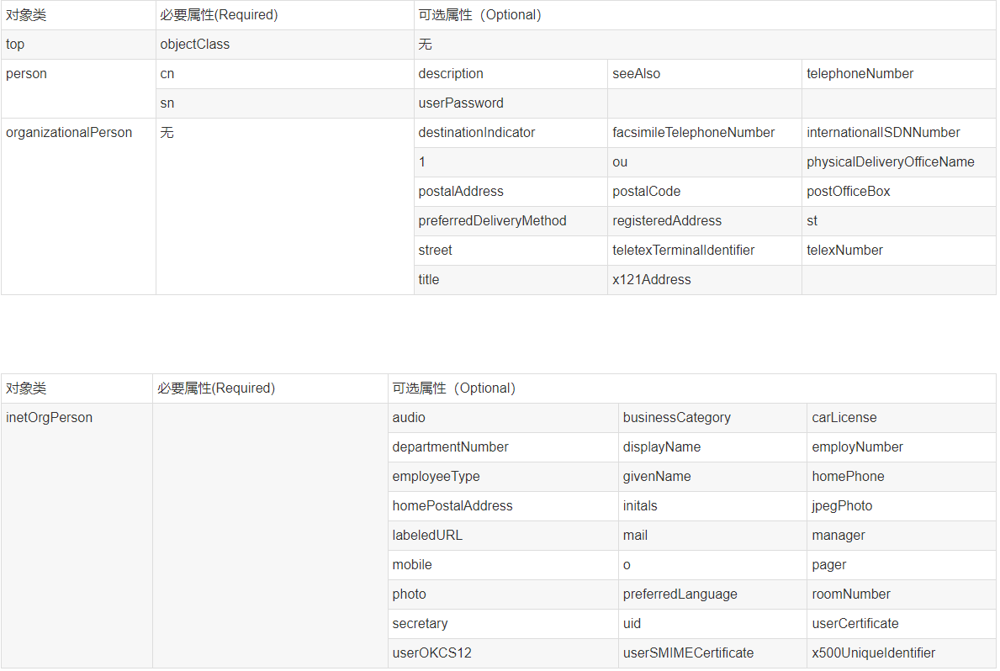

# LDAP是什么

首先LDAP是一种通讯协议，LDAP支持TCP/IP。协议就是标准，并且是抽象的。在这套标准下，AD（Active Directory）是微软出的一套实现。

那AD是什么呢？暂且把它理解成是个数据库。也有很多人直接把LDAP说成数据库(可以把LDAP理解成存储数据的数据库)。像是其他数据库一样，LDAP也是有client端和server端。server端是用来存放资源，client端用来操作增删改查等操作。而我们通常说的LDAP是指运行这个数据库的服务器。

可以简单理解AD =LDAP服务器＋LDAP应用。

# LDAP数据库特殊性

我们知道，像MySQL数据库，数据都是按记录一条条记录存在表中。而LDAP数据库，是树结构的，数据存储在叶子节点上。看看下面的比喻：

```tex
假设你要树上的一个苹果（一条记录），你怎么告诉园丁它的位置呢？
当然首先要说明是哪一棵树（dc，相当于MYSQL的DB），
然后是从树根到那个苹果所经过的所有“分叉”（ou）
，最后就是这个苹果的名字（uid，相当于MySQL表主键id）。
好了！这时我们可以清晰的指明这个苹果的位置了
```

就这样就可以描述清楚“树结构”上的一条记录了。

说一下LDAP里如何定义一个记录的位置吧。 

```tex
树（dc=ljheee)
分叉（ou=bei,ou=xi,ou= dong）
苹果（cn=redApple）
好了，redApple的位置出来了：
dn:cn=honglv,ou=bei,ou=xi,ou=dong,dc=ljheee
其中dn标识一条记录，描述了一条数据的详细路径。
咦!有人疑问，为什么ou会有多个值？你想想，从树根到达苹果的位置，可能要经过好几个树杈，所有ou可能有多个值。关于dn后面一长串，分别是cn，ou,dc；中间用逗号隔开。
```

总结一下LDAP树形数据库如下

```tex
dn ：一条记录的详细位置
dc ：一条记录所属区域    (哪一颗树)
ou ：一条记录所属组织    （哪一个分支）
cn/uid：一条记录的名字/ID   (哪一个苹果名字)
LDAP目录树的最顶部就是根，也就是所谓的“基准DN"。
```


```tex
o 	– organization（组织-公司）
ou 	– organization unit（组织单元-部门）
c 	- countryName（国家）
dc 	- domainComponent（域名）
sn 	– suer name（真实名称）
cn 	- common name（常用名称）
```

# LDAP场景描述

https://blog.csdn.net/u013310119/article/details/109402932

[阿里云LDAP认证登录](https://help.aliyun.com/document_detail/147473.html)

[IDAAS身份认证管理](https://cloud.baidu.com/doc/IDaaS/s/Lkcacxmmq)


# LDAP概念详解

## Entry

条目，也叫记录项，是LDAP中最基本的颗粒，就像是数据库中的记录。通常对LDAP的添加、删除、更改、检索都是以条目为基本对象的。


`dn`：每一个条目都有一个唯一的标识名（distinguished Name ，DN）

`rdn`：一般指dn逗号最左边的部分，如cn=baby。它与RootDN不同，RootDN通常与RootPW同时出现，特指管理LDAP中信息的最高权限用户。

`Base DN`：LDAP目录树的最顶部就是根，也就是所谓的“Base DN"，如"dc=glodon,dc=com"。


## Attribute

<font color=#dd0000>每个条目都可以有很多属性（Attribute）</font>，比如常见的人都有姓名、地址、电话等属性。每个属性都有名称及对应的值，属性值可以有单个、多个


<font color=#dd0000>属性不是随便定义的，需要符合一定的规则，而这个规则可以通过schema制定。比如，如果一个entry没有包含在 inetOrgPerson 这个 schema 中的`objectClass: inetOrgPerson`，那么就不能为它指定employeeNumber属性，因为employeeNumber是在inetOrgPerson中定义的。</font>

LDAP为人员组织机构中常见的对象都设计了属性(比如commonName，surname)。下面有一些常用的别名：

| 属性                   | 别名 | 语法             | 描述             | 值(举例)             |
| ---------------------- | :--- | ---------------- | ---------------- | -------------------- |
| commonName             | cn   | Directory String | 姓名             | sean                 |
| surname                | sn   | Directory String | 姓               | Chow                 |
| organizationalUnitName | ou   | Directory String | 单位（部门）名称 | IT_SECTION           |
| organization           | o    | Directory String | 组织（公司）名称 | example              |
| telephoneNumber        |      | Telephone Number | 电话号码         | 110                  |
| objectClass            |      |                  | 内置属性         | organizationalPerson |


## ObjectClass

对象类，是属性的集合。

LDAP预想了很多人员组织机构中常见的对象，并将其封装成对象类。比如人员（person）含有姓（sn）、名（cn）、电话(telephoneNumber)、密码(userPassword)等属性；单位职工(organizationalPerson)是人员(person)的继承类，除了上述属性之外还含有职务（title）、邮政编码（postalCode）、通信地址(postalAddress)等属性。

<font color=#00dd00>通过对象类可以方便的定义条目类型。每个条目可以直接继承多个对象类，这样就继承了各种属性。</font>如果2个对象类中有相同的属性，则条目继承后只会保留1个属性。

对象类同时也规定了哪些属性是基本信息，必须含有(Must 活Required，必要属性)：哪些属性是扩展信息，可以含有（May或Optional，可选属性）。


对象类有三种类型：

### 结构类型（Structural）

结构类型是最基本的类型，它规定了对象实体的基本属性，每个条目属于且仅属于一个结构型对象类。

### 抽象类型(Abstract)

抽象类型可以是结构类型或其他抽象类型父类，它将对象属性中共性的部分组织在一起，称为其他类的模板，条目不能直接集成抽象型对象类。

### 辅助类型（Auxiliary）

辅助类型规定了对象实体的扩展属性。


对象类本身是可以相互继承的，所以对象类的根类是top抽象型对象类。


如果将其中一支 top-->person-->organizationalPerson-->inetOrgPerson的必要属性和可选属性列表（表1-5-2），就会发现这种设计还是非常合理的。我们可以从任何一个对象派生出自己的对象类，比如organizationalPerson派生出职工(employee)对象类，那么它可以含有工号(employeeNumber)、工种(employeeType)等属性。注意，对象类继承的时候会把属性是必须(Must)还是可选（May）的特性也一并继承。也就是说person有cn和sn两个Must属性，organizationalPerson和inetOrgPerson由于直接或间接继承了person，也会有这两个Must属性。




## 模式（Schema）

对象类（ObjectClass）、属性类型（AttributeType）、语法（Syntax）分别约定了条目、属性、值，他们之间的关系如下图所示。所以这些构成了模式(Schema)，模式中的每一个元素都有唯一的OID编号，如2.5.4.41.条目数据在导入时通常需要接受模式检查，它确保了目录中所有的条目数据结构都是一致的。


# JAVA LDAP client

```xml
<!-- spring ldapTemplate操作 -->
<dependency>
    <groupId>com.sun</groupId>
    <artifactId>ldapbp</artifactId>
    <version>1.0</version>
</dependency>
<dependency>
    <groupId>org.springframework.ldap</groupId>
    <artifactId>spring-ldap-core</artifactId>
    <version>2.3.2.RELEASE</version>
</dependency>
```

介绍一些Spring-ldap，spring-ldap框架，是Spring集成ldap操作的总和，包含spring-ldap-core，spring-ldap-core-tiger，spring-ldap-ldif-core，spring-ldap-odm等jar，而通常我们在工程中只需要引入spring-ldap-core即可，它提供了绝大部分功能。


在ldap中，有两个"查询"概念，search和lookup。search是ldaptemplate对每一个entry进行查询，lookup是通过DN直接找到某个条目。
在Ldap中，新增与删除叫做绑定bind和解绑unBind。这些方法LdapTemplate全部提供，并且还提供各种条件过滤等方法，不如findAll(),list()等。