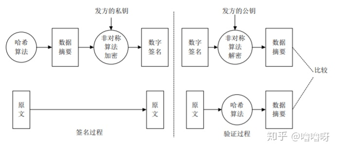

# 加密的基本概念

非对称加密算法（公钥加密）
有RSA、DSA/DSS、Elgamal、Rabin、D-H、ECC等。在客户端与服务器相互验证的过程中用的就是非对称加密算法
RSA密码体制就是公钥密码体制，RSA的一对公钥和私钥都可以用来加密和解密。
比如公钥加密后只能由私钥解密；私钥加密后只能由公钥解密。且一方加密的内容只能由对方进行解密。

对称加密算法（私钥加密）
有AES、DES、3DES、TDEA、Blowfish、RC4、RC5、IDEA等。加密使用的密钥和解密使用的密钥是同一个密钥。由于加密算法是公开的，若要保证安全性，密钥不能对外公开。通常用来加密消息体。

HASH算法
有MD5，SHA1，SHA256。用来确认信息没有被篡改。主要用来生成签名，签名是加在信息后面的，可以证明信息没有被修改过。一般对信息先做hash计算得到一个hash值，然后用私钥加密（这个加密一般是非对称加密）作为一个签名和信息一起发送。接收方收到信息后重新计算信息的hash值，且和信息所附带的hash值解密后进行对比。如果一样则认为没有被修改，反之则认为修改过，不做处理。可能有一种情况，黑客修改了信息并把hash值也改了，从而让他们相匹配。所以hash值一般都是加密后（生成签名）再和信息一起发送，确保hash值不会被修改。

数字证书
主要包含证书发布机构，证书有效期，公钥，证书所有者，签名使用的算法，指纹以及指纹算法。数字证书可以保证里面的公钥一定是证书持有者的。

数字签名

将明文通过Hash算法加密生成摘要，再将消息体摘要用私钥加密后就是签名了。当下一级证书或客户端需要时就返回这个整体。数字签名主要作用就是配合Hash算法保证信息没有被篡改。当https验证通过后，一般会改用对称加密方式通信，因为RSA公钥体制比较耗性能。所以数字签名只存在于验证阶段。

证书链
证书是分级的，证书链由多个证书一级一级组成，拿到上级证书的公钥才能解密本级证书。只有最底层的证书是自签名的，自己颁发给自己。