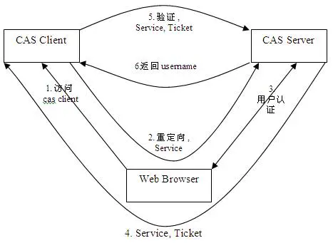
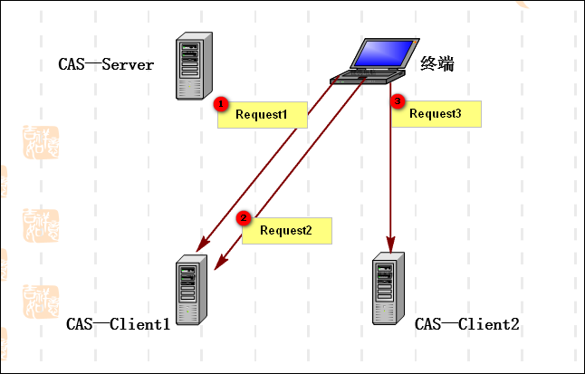

# SSO 原则

　　SSO 实现模式一般包括以下三个原则：

　　＊  所有的认证登录都在 SSO 认证中心进行；

　　＊  SSO 认证中心通过一些方法来告诉 Web 应用当前访问用户究竟是不是已通过认证的用户；

　　＊  SSO 认证中心和所有的 Web 应用建立一种信任关系，也就是说 web 应用必须信任认证中心。（单点信任）

# Cas介绍

CAS （ Central Authentication Service ），最初由耶鲁大学的Shawn Bayern 开发，后由Jasig社区维护，经过十多年发展，目前已成为影响最大、广泛使用的、基于Java实现的、开源SSO解决方案。cas旨在为 Web 应用系统提供一种可靠的单点登录解决方法（属于 Web SSO ）。 CAS 开始于 2001 年， 并在 2004 年 12 月正式成为 JA-SIG 的一个项目。

所有的系统应用都会引导到CAS Server认证中心去登录。登录成功后，认证中心会产生一个票据叫TGT(Ticket Granting Ticket)，TGT即代表了用户与认证中心直接的全局会话。TGT存在，表明该用户处于登录状态。
 TGT并没有放在Session中，也就是说，CAS全局会话的实现并没有直接使用Session机制，而是利用了Cookie自己实现的，这个Cookie叫做TGC(Ticket Granting Cookie)，它存放了TGT的id,认证中心服务端实现了TGT。

在认证中心登录下，看下登录前后cookie的变化。显然，在登录后，多出一个叫CASTGC的Cookie,它来维持全局会话。

如果是应用系统登录，客户端会被引导到认证中心进行登录，登录成功后再重定向回应用系统，这时会带上一个登录令牌，告知系统应用登录成功。
 这个令牌，在CAS中叫做ST(Service Ticket)服务票据，它的作用和Nebula的token类似。当然，和Nebula一样，应用系统收到ST后，会直接向CAS Server去验证，验证通过后，应用系统即可建立本地会话，返回用户访问的受限资源。

## 体系结构

从结构体系看，CAS 包括两部分： CAS Server 和 CAS Client 。

CAS Server负责完成对用户的认证工作 ，会为用户签发两个重要的票据：登录票据（TGT）和服务票据（ST）来实现认证过程, CAS Server需要独立部署 。

CAS Client负责处理对客户端受保护资源的访问请求，需要对请求方进行身份认证时，重定向到 CAS Server 进行认证。准确地来说，它以Filter 方式保护受保护的资源。对于访问受保护资源的每个 Web 请求，CAS Client 会分析该请求的 Http 请求中是否包含 ServiceTicket（服务票据，由 CAS Server发出用于标识目标服务）。CAS Client 与受保护的客户端应用部署在一起。

　　由上可知，它符合SSO中的角色架构，如下：

　　＊  User （多个）

　　＊  Web 应用（多个CAS Client—与Web应用部署在一起）

　　＊  SSO 认证中心（ 一个CAS Server—独立部署）

　　2.2  核心票据
　　　　CAS的核心就是其Ticket，及其在Ticket之上的一系列处理操作。CAS的主要票据有TGT、ST、PGT、PGTIOU、PT，其中TGT、ST是CAS1.0(基础模式)协议中就有的票据，PGT、PGTIOU、PT是CAS2.0(代理模式)协议中有的票据。这里主要介绍CAS1.0—基础模式中的几种票据。

TGT（Ticket Grangting Ticket）

TGT是CAS为用户签发的登录票据，拥有了TGT，用户就可以证明自己在CAS成功登录过。TGT封装了Cookie值以及此Cookie值对应的用户信息。用户在CAS认证成功后，生成一个TGT对象，放入自己的缓存（Session）；同时，CAS生成cookie（叫TGC，个人理解，其实就是TGT的SessionId），写入浏览器。TGT对象的ID就是cookie的值，当HTTP再次请求到来时，如果传过来的有CAS生成的cookie，则CAS以此cookie值（SessionId）为key查询缓存中有无TGT（Session），如果有的话，则说明用户之前登录过，如果没有，则用户需要重新登录。

TGC （Ticket-granting cookie）

　　　　上面提到，CAS-Server生成TGT放入自己的Session中，而TGC就是这个Session的唯一标识（SessionId），以Cookie形式放到浏览器端，是CAS Server用来明确用户身份的凭证。（如果你理解Session的存放原理的话就很好理解）

ST（ServiceTicket）

　　　　ST是CAS为用户签发的访问某一服务票据。用户访问service时，service发现用户没有ST，则要求用户去CAS获取ST。用户向CAS发出获取ST的请求，如果用户的请求中包含cookie，则CAS会以此cookie值为key查询缓存中有无TGT，如果存在TGT，则用此TGT签发一个ST，返回给用户。用户凭借ST去访问service，service拿ST去CAS验证，验证通过后，允许用户访问资源。

为了保证ST的安全性：ST 是基于随机生成的，没有规律性。而且，CAS规定 ST 只能存活一定的时间，然后 CAS Server 会让它失效。而且，CAS 协议规定ST只能使用一次，无论 Service Ticket 验证是否成功， CASServer 都会清除服务端缓存中的该 Ticket ，从而可以确保一个 Service Ticket 不被使用两次。

2.3  认证过程
　　这里用一个终端，对两个CAS—Client的三次请求来说明CAS的认证过程，主要是TGT、TGC、ST等票据的传递，以及如何实现的SSO。

　　如下图，前两次请求都是访问的CAS—Client1，主要来说明TGT、TGC、ST等票据的作用；然后第三次请求访问的是CAS—Client2，主要来说明如何实现的SSO。

Request1
　　　　【第一步】终端第一次访问CAS—Client1，AuthenticationFilter会截获此请求：1、首先，检测本地Session没有缓存有用户信息；2、然后，检测到请求信息中没有ST；3、所以，CAS—Client1将请求重定向到CAS—Server，并传递 Service （也就是要访问的目的资源地址，以便登录成功过后转回该地址），例：【https://cas:8443/cas/login?service=http0%3A8081%2F】

　　　　【第二步】终端第一次访问CAS—Server：1、CAS—Server检测到请求信息中没有TGC，所以跳转到自己的登录页；2、终端输入用户名、密码登录CAS—Server，认证成功后，CAS—Server会生成登录票据—TGT（集成了用户信息与ST），并随机生成一个服务票据—ST与CAS会话标识—TGC。TGT实际上就是Session，而TGC就是这标识这个Session存到Cookie中的SessionID；ST即，根据Service生成Ticket。3、然后，CAS—Server会将Ticket加在url 后面，然后将请求redirect 回客户web 应用，例如URL为【http://192.168.1.90:8081/web1/?ticket=ST-5-Sx6eyvj7cPPCfn0pMZ】

　　　　【第三步】这时，终端携带ticket再次请求CAS—Client1：1、这时客户端的AuthenticationFilter看到ticket 参数后，会跳过，由其后面的TicketValidationFilter 处理；2、TicketValidationFilter 会利用httpclient工具访问cas 服务的/serviceValidate 接口, 将ticket 、service 都传到此接口，由此接口验证ticket 的有效性，即向CAS—Server验证ST的有效性。3、TicketValidationFilter如果得到验证成功的消息，就会把用户信息写入web 应用的session里。至此为止，SSO 会话就建立起来了。

　　Request2
　　　　上面说了SSO 会话已经建立起来了，这时用户在同一浏览器里第二次访问此web 应用（CAS—Client1）时，AuthenticationFilter会在session 里读取到用户信息，这就代表用户已成功登录，所以就不会去CAS 认证了。

　　Request3
　　　　【第一步】与Request1是完全一样的，如下：终端第一次访问CAS—Client2，AuthenticationFilter会截获此请求：1、首先，检测本地Session没有缓存有用户信息；2、然后，检测到请求信息中没有ST；3、所以，CAS—Client1将请求重定向到CAS—Server，并传递 Service （也就是要访问的目的资源地址，以便登录成功过后转回该地址），例：【https://cas:8443/cas/login?service=http0%3A8081%2F】

　　　　【第二步】然后，终端第二次访问CAS—Server：此时，Request中会带有上次生成的TGC，然后根据TGC（SessionID）去查找是否有对应的TGT（Session），如果有，代表此用户已成功登录过，所以此时用户不必再去登录页登录（SSO的体现），而CAS—Server会直接用找到的TGT签发一个ST，然后重定向到CAS—Client2，剩下的如Request1中的【第三步】就完全一样了。
