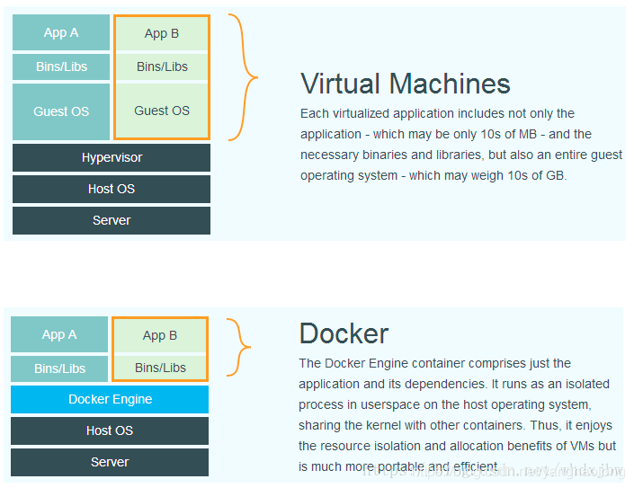

# 基本概念

docker与传统虚拟化技术（vmware, openstack）比较



虚拟机，类似于“子电脑”

在“子电脑”里，你可以和正常电脑一样运行程序，例如开QQ。如果你愿意，你可以变出好几个“子电脑”，里面都开上QQ。“子电脑”和“子电脑”之间，是**相互隔离**的，互不影响。

虚拟机属于虚拟化技术。而Docker这样的容器技术，也是虚拟化技术，属于**轻量级的虚拟化**。

虚拟机虽然可以隔离出很多“子电脑”，但占用空间更大，启动更慢，虚拟机软件可能还要花钱（例如VMWare）。

而容器技术恰好没有这些缺点。它不需要虚拟出整个操作系统，只需要虚拟一个小规模的环境（类似“沙箱”）。

它启动时间很快，几秒钟就能完成。而且，它对资源的利用率很高（一台主机可以同时运行几千个Docker容器）。此外，它占的空间很小，虚拟机一般要几GB到几十GB的空间，而容器只需要MB级甚至KB级。


需要注意，**Docker本身并不是容器**，它是创建容器的工具，是应用容器引擎。

想要搞懂Docker，其实看它的两句口号

第一句，是“**Build, Ship and Run**”。也就是，“搭建、发送、运行”，三板斧。

> 举个例子：
>
> 我来到一片空地，想建个房子，于是我搬石头、砍木头、画图纸，一顿操作，终于把这个房子盖好了。
>
> 结果，我住了一段时间，想搬到另一片空地去。这时候，按以往的办法，我只能再次搬石头、砍木头、画图纸、盖房子。
>
> 但是，跑来一个老巫婆，教会我一种魔法。
>
> 这种魔法，可以把我盖好的房子复制一份，做成“镜像”，放在我的背包里。
>
> 等我到了另一片空地，就用这个“镜像”，复制一套房子，摆在那边，拎包入住。

第二句口号就是：“**Build once，Run anywhere（搭建一次，到处能用）**”。


Docker技术的三大核心概念

- **镜像（Image）**：Docker 镜像（Image），就相当于是一个 root 文件系统。它除了提供容器运行时所需的程序、库、资源、配置等文件外，还包含了一些为运行时准备的一些配置参数（例如环境变量）。镜像不包含任何动态数据，其内容在构建之后也不会被改变。

  > 放在包里的“镜像”，就是**Docker镜像**

- **容器（Container）**：镜像（Image）和容器（Container）的关系，就像是面向对象程序设计中的类和实例一样，镜像是静态的定义，容器是镜像运行时的实体。容器可以被创建、启动、停止、删除、暂停等。

  > 我在空地上，用魔法造好的房子，就是一个**Docker容器**。

- **仓库（Repository）**：仓库可看着一个代码控制中心，用来保存镜像。

  > 我的背包，就是**Docker仓库**。

Docker 使用客户端-服务器 (C/S) 架构模式，使用远程API来管理和创建Docker容器。

Docker 容器通过 Docker 镜像来创建。

容器与镜像的关系类似于面向对象编程中的对象与类。

| Docker | 面向对象 |
| :----- | :------- |
| 容器   | 对象     |
| 镜像   | 类       |


| 概念                   | 说明                                                         |
| :--------------------- | :----------------------------------------------------------- |
| Docker 镜像(Images)    | Docker 镜像是用于创建 Docker 容器的模板，比如 Ubuntu 系统。  |
| Docker 容器(Container) | 容器是独立运行的一个或一组应用，是镜像运行时的实体。         |
| Docker 客户端(Client)  | Docker 客户端通过命令行或者其他工具使用 Docker SDK (<https://docs.docker.com/develop/sdk/>) 与 Docker 的守护进程通信。 |
| Docker 主机(Host)      | 一个物理或者虚拟的机器用于执行 Docker 守护进程和容器。       |
| Docker Registry        | Docker 仓库用来保存镜像，可以理解为代码控制中的代码仓库。Docker Hub([https://hub.docker.com](https://hub.docker.com/)) 提供了庞大的镜像集合供使用。一个 Docker Registry 中可以包含多个仓库（Repository）；每个仓库可以包含多个标签（Tag）；每个标签对应一个镜像。通常，一个仓库会包含同一个软件不同版本的镜像，而标签就常用于对应该软件的各个版本。我们可以通过 **<仓库名>:<标签>** 的格式来指定具体是这个软件哪个版本的镜像。如果不给出标签，将以 **latest** 作为默认标签。 |
| Docker Machine         | Docker Machine是一个简化Docker安装的命令行工具，通过一个简单的命令行即可在相应的平台上安装Docker，比如VirtualBox、 Digital Ocean、Microsoft Azure。 |


# CentOS Docker 安装

Docker 支持以下的 64 位 CentOS 版本：

- CentOS 7
- CentOS 8
- 更高版本...


## 卸载旧版本

```shell
$ yum remove docker \
                  docker-client \
                  docker-client-latest \
                  docker-common \
                  docker-latest \
                  docker-latest-logrotate \
                  docker-logrotate \
                  docker-engine
```


## 安装 Docker Engine-Community

```shell
$ yum install -y yum-utils \
  device-mapper-persistent-data \
  lvm2
  
$ yum-config-manager \
    --add-repo \
    https://download.docker.com/linux/centos/docker-ce.repo
```


```shell
# 安装最新版本的 Docker Engine-Community 和 containerd
$ sudo yum install docker-ce docker-ce-cli containerd.io

# 安装特定版本
$ yum list docker-ce --showduplicates | sort -r

docker-ce.x86_64  3:18.09.1-3.el7                     docker-ce-stable
docker-ce.x86_64  3:18.09.0-3.el7                     docker-ce-stable
docker-ce.x86_64  18.06.1.ce-3.el7                    docker-ce-stable
docker-ce.x86_64  18.06.0.ce-3.el7                    docker-ce-stable

$ yum install docker-ce-<VERSION_STRING> docker-ce-cli-<VERSION_STRING> containerd.io
```


## 启动 Docker

```shell
$ systemctl start docker
```


# 常见使用

- 启动/停止docker

```shell
$ docker start/stop 容器名称

$ docker start/stop 容器id
```


- 搜索下载镜像

```shell
$ docker search [keyword] # 看Docker Hub上都有哪些镜像可以下载
```

- 查看当前所有镜像

```shell
$ docker images

# 查看镜像的详细信息
$ docker inspect [image-id]
```

- 下载镜像

```shell
$ docker pull centos
```

- 运行容器

```shell
$ docker run centos echo "hello word"
```

- *运行容器 hello word*

```shell
$ docker run hello-world
```


# Docker启动jar包

## 方式一

1. 上传jar到服务器的指定目录

2. 在该目录下创建Dockerfile 文件

   ```dockerfile
   FROM java:8
   MAINTAINER bingo
   ADD demo-0.0.1-SNAPSHOT.jar demo.jar
   EXPOSE 8080
   ENTRYPOINT ["java","-jar","demo.jar"]
   ```

   > from java:8   拉取一个jdk为1.8的docker image
   >
   > maintainer  作者是bingo
   >
   > demo-0.0.1-SNAPSHOT.jar 就是你上传的jar包，替换为jar包的名称
   >
   > demo.jar  是你将该jar包重新命名为什么名称，在容器中运行
   >
   > expose  该容器暴露的端口是多少，就是jar在容器中以多少端口运行
   >
   > entrypoint 容器启动之后执行的命令，java -jar demo.jar  即启动jar

3. docker build -t my/demo .

   > 注意最后的 .  表示 Dockerfile 文件在当前目录下
   >
   >  my/demo  构建之后镜像名称

4. 运行容器 

   ```shell
   # --restart=always 表示docker容器在停止或服务器开机之后会自动重新启动 
   $ docker run -d --restart=always --name demo -p 8080:8080  my/demo 
   
   # => 如果docker run 的时候没有加 --restart=always ，然后已经运行的docker容器怎么设置自动重启
   $ docker update –-restart=always demo # demo : 你的容器名称
   ```

5. docker ps查看

6. ```shell
   $ docker logs --tail  300 -f  demo  查看启动日志 
   ```

   

## 方式二

运行一个jdk的容器，然后挂载其中的目录到宿主机，然后运行之后，就可以将需要运行的jar放在宿主机的挂载目录下，然后每次重新运行docker容器即可。不用每次发布需要重新构建docker容器，只需要替换宿主机中的jar包即可

1. 在服务器中拉取jdk1.8的镜像

```shell
$ docker pull jdk8
```

2. 创建目录

    ```shell
$ cd /server/
$ mkdir deploy/jar
    ```

​    3. 构建容器

```shell
$ docker run -d \
--restart=always \
-v /server/deploy/jar:/jar -v /server/logs/demo:/mnt/logs/demo \
-p 7778:7778 \
--name demo \
jdk8 /usr/bin/java -jar \
-Duser.timezone=GMT+08 \
/jar/demo-1.0.jar

# -Duser.timezone 是设置时区
# jdk8 /usr/bin/java -jar 是执行 java jar的命令
# /jar/demo-1.0.jar 是需要运行的jar包的位置在容器中的什么位置，/jar 下面
```


