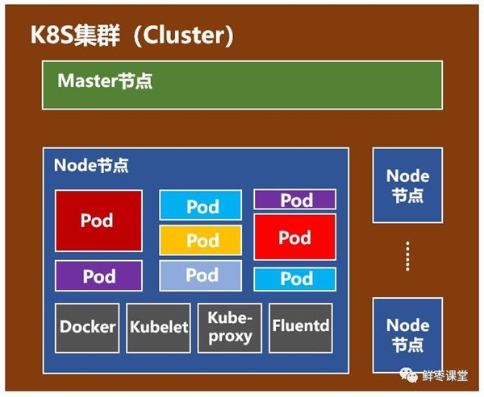

# 引言

在Docker容器技术被炒得热火朝天之时，大家发现，如果想要将Docker应用于具体的业务实现，是存在困难的——编排、管理和调度等各个方面，都不容易。于是，人们迫切需要一套管理系统，对Docker及容器进行更高级更灵活的管理。

就在这个时候，K8S出现了。

# 架构

一个K8S系统，通常称为一个**K8S集群（Cluster）**。

这个集群主要包括两个部分：

- **一个Master节点（主节点）**
- **一群Node节点（计算节点）**

Master节点主要还是负责管理和控制。Node节点是工作负载节点，里面是具体的容器。

深入来看这两种节点。

## Master节点

Master节点包括API Server、Scheduler、Controller manager、etcd。

`API Server`是整个系统的对外接口，供客户端和其它组件调用，相当于“营业厅”。

`Scheduler`负责对集群内部的资源进行调度，相当于“调度室”。

`Controller manager`负责管理控制器，相当于“大总管”。

## Node节点

Node节点包括Docker、kubelet、kube-proxy、Fluentd、kube-dns（可选），还有就是**Pod**。

> Pod是Kubernetes最基本的操作单元。一个Pod代表着集群中运行的一个进程，它内部封装了一个或多个紧密相关的容器。
>
> 除了Pod之外，K8S还有一个Service的概念，一个Service可以看作一组提供相同服务的Pod的对外访问接口。

Docker，创建容器的。

Kubelet，主要负责监视指派到它所在Node上的Pod，包括创建、修改、监控、删除等。

Kube-proxy，主要负责为Pod对象提供代理。

Fluentd，主要负责日志收集、存储与查询。