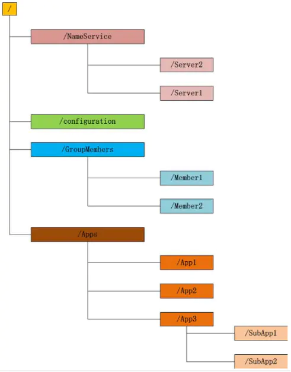
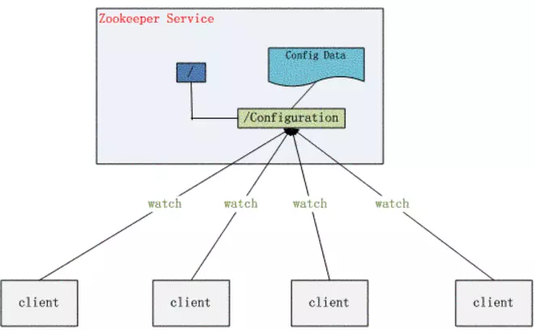

# zookeeper详解

是一个分布式服务框架，是Apache Hadoop 的一个子项目，它主要是用来解决分布式应用中经常遇到的一些数据管理问题，如：统一命名服务、状态同步服务、集群管理、分布式应用配置项的管理等。

上面的解释有点抽象，简单来说**zookeeper=文件系统+监听通知机制**。

## 1、 文件系统

Zookeeper维护一个类似文件系统的数据结构：

每个子目录项如 NameService 都被称作为 znode(目录节点)，和文件系统一样，我们能够自由的增加、删除znode，在一个znode下增加、删除子znode，唯一的不同在于znode是可以存储数据的。

有四种类型的znode：

- PERSISTENT-持久化目录节点

客户端与zookeeper断开连接后，该节点依旧存在

- PERSISTENT_SEQUENTIAL-持久化顺序编号目录节点

客户端与zookeeper断开连接后，该节点依旧存在，只是Zookeeper给该节点名称进行顺序编号

- EPHEMERAL-临时目录节点

客户端与zookeeper断开连接后，该节点被删除

- EPHEMERAL_SEQUENTIAL-临时顺序编号目录节点

客户端与zookeeper断开连接后，该节点被删除，只是Zookeeper给该节点名称进行顺序编号

## 2、 监听通知机制

客户端注册监听它关心的目录节点，当目录节点发生变化（数据改变、被删除、子目录节点增加删除）时，zookeeper会通知客户端。

# Zookeeper能做什么

zookeeper功能非常强大，可以实现诸如分布式应用配置管理、统一命名服务、状态同步服务、集群管理等功能。

我们这里拿比较简单的分布式应用配置管理为例来说明。

假设我们的程序是分布式部署在多台机器上，如果我们要改变程序的配置文件，需要逐台机器去修改，非常麻烦，现在把这些配置全部放到zookeeper上去，保存在 zookeeper 的某个目录节点中，然后所有相关应用程序对这个目录节点进行监听，一旦配置信息发生变化，每个应用程序就会收到 zookeeper 的通知，然后从 zookeeper 获取新的配置信息应用到系统中。

# zookeeper API

https://www.cnblogs.com/shamo89/p/9800925.html